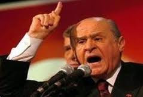

# Yıgım brojesi

Referandum amaçlı düzenlenen mitinglerde tansiyon artmaya
başladı. Devlet Bahçeli en son başbakan Erdoğan'ı "demogratik yiğim
brojesine" imza atmakla suçladı ve anayasa değişikliğine ilginç bir
yorum getirdi. Bahçeli "anayasalar sadece darbeden sonra değişir,
Tayyip sivil darbe yapmıştır, şimdi de anayasasını
yapmaktadır!". Cümlenin sonunda sesi incelerek bozulan Bahçeli
mitingin devamını getiremedi. Uluyan Gençler korosunun ulumalarıyla
miting tamamlandı.

