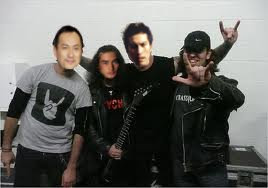

# Uzakdoğu'da ülkücü genclik

Türkçülüğün etkileri tüm dünyaya yayılmaya devam ediyor: Japonya'da
ilk kez bir ülkücü ocağı açıldığı haberi alındı. Başına bildiri veren
grup sözcüsü Takanoda Sokanomu "biz nihayet kokumuzu keşfettik,
tarihimizi inceleyince, aslında 'Ada Türkleri' olduğumuzu anladık"
yorumunu yaptı.Sokanomu "tüm hayatımızı Türkçülük prensiplerine göre
tanzim ediyoruz, sushiyi kimızla yiyoruz, aynı anda kafayı da
buluyoruz; böylece sakeye ihtiyacımız kalmadı, Ulu Türk Ulus'una ait
olmak bütçemizi de rahatlattı" yorumunu yaptı.

Gençlik kültürünü korumak için bazı film çalışmalarını
destekleyecek. Japon tarihindeki gelmiş geçmiş ilk Samuray'ı eğitenin
Battal Gazi olduğu biliniyor; bu tarihi olayı konu alan, başrolde ünlü
sanatçılar Tako Watanabe ve Abe İto'nun rol alacağı "Battal Gazi'nin
Babasının Oğlu" adlı bir film çekilecek, Japonlara gerçek kültürlerini
anlatacak şenlikler hazırlanacak.

zaman:

Eylül 28, 2010

