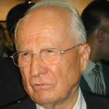

# 20 Soru

Kenan Evren'e 20 Soru--

1. En sevdiğiniz kelime nedir?

Darbe.

2. En nefret ettiğiniz kelime
nedir?

Postmodern darbe (ne bicim bir kavram bu?)

3. Sizi ne heyecanlandırır?

Radyo istasyonlari.

4. Heyecanınızı ne öldürür?

Basarisiz darbe.

5. En sevdiğiniz ses nedir?

Iskence goren insanlarin cikardigi sesler.

6. Nefret ettiğiniz ses
nedir?

Mutlu, neseli insanlarin sesleri.

7. Hangi mesleği yapmak istemezsiniz?

Siyaset.

8. Hangi doğal yeteneğe sahip olmak istersiniz?

Sadece dusunerek darbe yapabilme yetenegi.

9. Kendiniz olmasaydınız kim olurdunuz?

Pinochet.

10. Nerede yaşamak
isterdiniz?

Latin Amerika, tercihen seksenli yillar.

11. En önemli kusurunuz nedir?

Siyasetci veto ederken bazen yufka yurekli olabiliyordum. Daha fazla
veto etmek isterdim.

12. Size en fazla keyif veren kötü huyunuz hangisi?

Darbe ortami hazirlamak.

13. Kahramanınız kim?

Hitler

14. En çok kullandığınız küfür nedir?

Anarsist.

15. Şu hanki ruh haliniz nasıl?

Netekim.

16. Hayat felsefenizi hangi
slogan özetler?

Bir sagdan, bir soldan.

17. Mutluluk rüyanız nedir?

Siyasetsiz bir dunyada yasamak.

18. Sizce mutsuzluğun tanımı nedir?

Herkesin degisik bir fikre sahip olmasi.

19. Nasıl ölmek istersiniz?

Emir komuta dahilinde, "öl" komutunu aldiktan sonra.

20. Öldüğünüzde cennete giderseniz Tanrı’nın size kapıda ne
söylemesini istersiniz?

Gel Kenan arkadaslarin coktan geldi bile, Stalin, Hitler, Pinochet
hepsi iceride.. Ama yan odadalar, orasi daha sicak.
