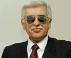

# YSK: Tepkileri anlamiyoruz

YSK Baskani Ali Em, son iptallere Kurtlerden gelen tepkileri abartili
buldugunu soyledi. Em, "Kurtler simdiye kadar darbelere herkesle
beraber ayni anda maruz kaliyorlardi. Ilk kez sadece onlara ozel bir
darbe yaptik" dedi ve ekledi "artik devletten ilgi gormediklerini
kimse iddia edemez". Baskan, kurumlarin performansini iyilestirmek
icin surekli ugrastigini, mesela bu siralarda yavas hayat akiminin
takip edildigini aktardi. Bu akima gore tek bir buyuk darbe yerine,
arka arkaya kucuk darbelerin tercih edildigini soyleyen baskan, soyle
devam etti: "Halkimizin hayat kalitesini arttirmak icin surekli
calisiyoruz".

