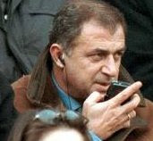
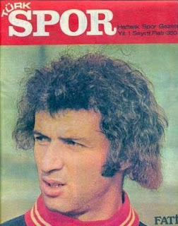

# Everything is something happened

Futbolda şike sorgulamaları devam ederken, operasyona bağlı olarak
Futbol Federasyonu gizli servisinin takibe aldigi teknik adamlardan
Fatih Terim'in İtalya ile bağlantıları net delilleriyle ortaya
çıkarıldı. Terim'in lige geri dönüşü şüphe yaratınca tüm bağlantıları
masaya yatırıldı, ve teknik adamın İtalya bazlı örgütlere basın
toplantılarında bilgi sızdırdığı tespit edildi.

Terim'in bu toplantılarda kullandığı çok ileri seviyedeki İngilizce
terimlerin dışarıya dönük kodlu iletişim olduğu anlaşılıyor. "I dont
want to see the back, I want to see the front", "now is in the tabele"
kelimelerinin "bir sonraki maçı 2-0 kaybediyoruz" mesajını içerdiği
deşifre edildi; İtalyanca yerine İngilizce kullanımının ise şaşırtma
amaçlı olduğu anlaşıldı... Terim'in dış bağlantılarının tarihinin çok
geriye gittiği iddia ediliyor, teknik adamın yabancı gizli servisler
tarafından modayı çok yakından takip ettiği gençlik yıllarında etki
altına alındığı söyleniyor.

