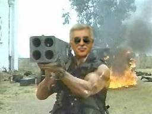

# YSK: Komando

YSK temalı filmlerin başarısı benzer filmlerin önünü açtı; bu
filmlerden birisi şu anda çekilmekte. YSK: Komando adlı filmin konusu
şöyle - bir devlet kurumu olan YSK seçim sonuçlarını kendi istediği
gibi şekillendirmek için bir komando timi kurar. Timin başındaki uzman
çavuş, uzun bir macera sonucunda 2011 sonuçlarını etkilemeyi
başarır. Çavuş karakteri film kariyeri son zamanlarda parlayan Ali Em
tarafından oynanıyor. Em, rol yaparken hangi yöntemi kullandığı
sorusuna "her oynadığım rolde kendimden bir şeyler bulmaya uğraşırım"
cevabını verdi. Film 2012 yılında vizyona girecek.

