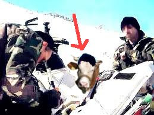

# Keçi değil inek yedi

Blog'umuza ulaştırılan fotoğraflar M. Yazıcıoğlu'nun kaza geçirdiği
bölgede aracın önemli yerlerini yemesi için bir ineğin
görevlendirildiğini gösteriyor. Bu inek herkesin tanıdığı, sabıkalı,
bölücü, Soroscu, büst karşıtı Gülsüm İnek'ten başkası değil.Fakat
Gülsüm acaba orada ne arıyor? Bilindiği gibi bu sabıkalı hayvan daha
önce büyük bir operasyon sonrası Güneydoğu'da yakalanmıştı. Acaba
Gülsüm taraf mı değiştirdi, itirafçı mı oldu? Nasıl serbest kaldı? Bu
eylem PKK-Ergenekon bağlantısının mı bir ispatı acaba?Çok gizemli bir
sürece girdiğimiz anlaşılıyor. Üçüncü Dalga Geliyor Blog."İlk bilen
siz olun"

