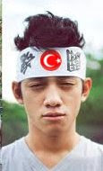

# Flaş.. flaş..

Van'daki artçı deprem sonrası Japon ülkücü derneği ile bağlantıya
geçtik. Aşağıda röportajın metni:

UDG: Alo? Merhaba.. Japon Ülkücü Derneği mi?

JD: Evet. Ben dernek başkanı Takanoda Sokanomu.

UDG: Röportaj için Türkiye'den arıyoruz.  Van'da artçı deprem oldu,
düşüncelerinizi alalım. Acı var mı?

JD: Haberi sizden alıyoruz biz de.. Oraya dernekten iki arkadaş
gönderdik, Otaboka Karishi, ve Aganigi Koyanobe arkadaşlarımız yardım
icin gitmişlerdi. Wasabi, bedava kömür filan dağıtıyorlardi.

UDG: Bu arkadaşlardan haber yok mu?

JD: Merak etmeye gerek yok.. Onlara bir sey olmaz. Eğer bir bina
üzerlerine yıkıldıysa ben o binaya acırım. Türk'e zarar gelmesi mümkün
değildir. Arkadaşlara seyahat sigortası bile yaptırmıyoruz.

UDG: Öyle mi?

JD: Tabii; boşuna masraf, Ulu Ulus, Ulu Türk Ululuğu bizi korur. [..]
Bir dakika.. simdi haber geldi. Abe Ito'yu aramışlar, sağ
salimler. Ama birinin kafası kırılmış.

UDG: O nasıl oldu?

JD: Mümkün değil tabii ki, ama olmus.. Bir gariplik var bu
iste. Herhalde bu arkadaşlar yuzde 100 Japon, yani Ada Türk'ü
değillerdi. Derneğe alırken de şüphelerimiz vardı. Dernekteki herkesin
soyu binlerce yıl geriye gidiyor, hatta ondan da once Sirius
Galaksi'sine uzanıyor. Bu iki arkadas dönünce bir kurultay yaparız,
durum netleşir. Yamukluk varsa, bir kaset maset isi hallederiz.

UDG: Pekala. Röportaj için teşekkürler.

JD: Ben teşekkür ederim. Domaarigato Mister Robatto. Hepiniz Türk'e
emanet olun.

UDG: Amin.

