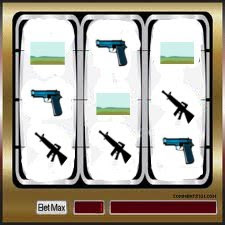

# Vicdani ret

Bedelli askerlik kararına gelen tepkiler sebebiyle devlet yeni bir
formül ortaya attı. Yeni çözüme göre tüm askeri şubelerin önünde
kumarhanedeki slot makinalarına benzeyen kollu makinalar
olacak. Askerliği yaklaşan vatandaş kendine en yakın subeye giderek
makinanın kolunu çekecek ve nasıl askerlik yapacağını
öğrenecek. Makinada Las Vegas'taki makinalarda bulunan 7, bar, üzüm
sembolleri yerine, "tabanca", "tüfek", ve "arazi" sembolleri
bulunuyor.

Eger makinada üç tane arazi sembolü yanyana gelirse, bu "vicdani ret"
anlamına geliyor. Vatandaş askerlik yapmıyor, onun sonucu olarak dayak
yiyor ve ceza alıyor, fakat kazandığı ödül sayesinde ikinci kez ceza
almıyor. Yani devlet dayak, ceza sonrası ikinci defa ceza vermeyi
vicdanen reddediyor.

1 arazi, 1 tabanca, 1 tüfek yanyana gelirse, vatandaş 20,000 TL verip
10 ay askerlik yapıyor. 2 tabanca, 1 tüfek için 10,000 TL verip 20 ay
askerlik yapılıyor, 3 tane tüfek yanyana gelince bu en büyük ödül
"jackpot" sayılıyor ve 20 TL verilip 55 ay komando olarak askerlik
yapılıyor.Tabanca, tüfek gibi sembollerin arazi sembolünden daha fazla
olması, askerlik olasılığının daha yüksek oldugu eleştirisine
yetkililer şöyle cevap verdi: "Eh olacak o kadar... Kumarhane her
zaman kazanır".

