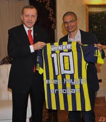
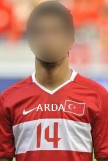

# Fotoğraflar

Şike iddianamesini takip eden sürec hızla devam ediyor, biz de
blog'umuza ulaşan bilgileri paylaşıyoruz. En son ele geçirdiğimiz
fotoğraf "10 Numara" olarak bilinen Alex de Souza'yı net olarak
Fenerbahçe Cumhuriyeti'yle bağlantılı bir şekilde gösteriyor. De
Souza'nın Cumhuriyet eşbaşkanı ile verdigi pozdaki mutluluk görüntüsü
gözlerden kaçmıyor. Bir diğer şüpheli örgütte "14 Numara" olarak
bilinen sağda resmi görülen şahıs; fotoğrafta bu kişinin yüzü
bulandırıldıgı için kimliği tespit edilemedi, fakat şüphelinin
"halklar" gibi kelimeler kullanarak bölücü yorumlar yaptığı ve
propaganda, provoke amaçlı sözler sarfettigi belirtiliyor. Şüphelinin
İspanya'ya kaçtığı söylentiler arasında, ve kırmızı bülten ile
aranıyor.

