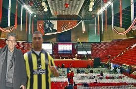

# Duble

CHP'de çifte kurultay gündemi meşgul etmeye devam ediyor. Basındaki
negatif yorumlara Kılıçdaroğlu "CHP kurultay yapmakta son derece
başarılı bir partidir, seçmen Türkiye'nin yönetiminde bize niye
güvenmiyor anlamıyorum, bu kadar kurultay yapmış bir parti niye
Türkiye'yi yönetemesin?" sözleriyle cevap veriyor. Parti içindeki
kaynaklara göre ikili kurultay ilahi bir oluş, adeta kutsal bir
raslantı olarak görülüyor. Bu "ikili mucize"nin daha net vurgulanması
için kurultaylardan biri sabah, diğeri akşam 2:22 saatinde, ve ikisi
de 22 Şubat, yani 22/2 tarihinde yapılacak.Kurultaya hazırlık için
altı ok prensipleri "iki ok" olarak tekrar düzenlenecek; iki ok
değerleri "vesayet" ve "darbe" olarak kararlaştırıldı. Kurultayın özel
durumunu vurgulamak için ünlü şahsiyetlerden Anter Anter ve Kazım
Kazım konuk olarak çağırılıyor. Davet edilen bir diğer kişilik eski BM
genel sekreteri Boutros Boutros Gali "isminin bu kutsal ana yakışacak
kadar pür olmadığı" gerekçesiyle daveti geri çevirdi.

