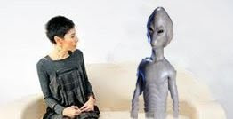

# Galaksi çapında bir röportaj - 1

Neşe Düzel - Sirius Galaksisinden dünyayı ziyarete gelen Ata'nın yaverleri Hamdi Türkedön ve Hakkı Daum ile irtibata geçtik, Hamdi Bey bize röportaj için zaman ayıracağını belirtti. Röportajda dünya, galaksi ve evrensel konulara değinildi. 

Neden Hamdi Türkedön?

Ata'nın en güvendiği yaverlerinden olan Türkedön yıllardır onunla beraber seyahat ediyor. Tüm Türk dünyası, evreni hakkında önemli bilgilere sahip ender bir kişilik, konular hakkında ilginç bakış açısı için görüşlerine başvurduk. 

Sizle ne zamandır görüşme yapmak istiyoruz. Nerelerdeydiniz? 

Ata'nın dünyaya ikinci gelişi sebebiyle oldukça yoğun gündemimiz var. Çoğunlukla teftiş amaçlı etrafı geziyoruz, ulu milletimizin, ulu ırkımızın durumunu gözden geçiriyoruz. Sürekli notlar alıyoruz. 

Sirius Galaksisi nasıl bir yer? 

Cennet gibi bir galaksimiz var. Dünyadaki herkes oradan geldiği için sizin memleketiniz de orası sayılır. Ben Yozgat gezegeninden geliyorum mesela, İzmir var, Mü gezegeni var. 

Mü bir gezegen mi? Buradaki efsanelerde ada diye geciyor. 

Bir yanlışlık olmuş herhalde. Mü bir sayfiye gezegeni, herkes oraya tatile gider. Kenar mahallesi Poseidon var, gecekondu mahallesi Atlantis, hatta oraya geçende sel bastı yağmura teslim oldular, halkın evi barkı su altında kaldı. 

Peki günlük, kültürel hayat nasıl, ne bileyim sanat, inanışlar nasıl? 

Çok önemli sanat eserlerimiz var. İnanış olarak biz şamancı tarzı yaşayışa,  inanışa sahibiz. Tabiat bizim için kutsaldır, onunla içiçe yaşıyoruz, ona tapınıyoruz. 

Neye tapınıyorsunuz?

Kedi, kurbağa, geyik, kirpi... ne bulursak tapınırız. Etrafta varsa tavuk ta olabilir. 

Peki horoz? 

Tüm kümes hayvanları caizdir. Tabii  bazen karışıklık ta çıkmıyor değil. Mesela bir arkadaş tuttu dedi ki "tavuk yumurtadan geliyor yumurtaya da tapınmak lazım", gitti bir başkası itiraz etti "ama yumurta tavuktan geliyor, ona tapınmak olmaz". Ortalık toz duman oldu, hersey karıştı,  ırkımız birbirine girdi. Bunlar çok önemli fıkıh sorunları..

Böyle durumlarda danışılacak birisi yok mu ? 

Dini problemlerde danışmak için şaman babasına gideriz. Biz bilmezsek
baba bilir. Bizim gezegendeki şaman babasına gittik, baba Refik
ErTürkOneArkayaSağaBayrakSiperÇavuşVuralVerme kararı verdi, dedi ki
"yumurta tavuktan geliyor", problem çözüldü. Irkdaşlarımız kahvaltıda
yumurta yiyemez hale gelmişti, benizleri solmuş açlıktan helak
olmuşlardı, karardan sonra rahatladılar.

Şaman babası nasıl birisidir? 

Koydumu oturtan birisidir. Otoriter bir kişiliktir, döver de sever
de. Bazen ikisini de aynı anda yapar. Etrafinda dikkatli olmak
gerekir, bir kızdı mı ne yapacağı belli olmaz. Birgün mesela aklımıza
zor bir soru geldi, soralım dedik. Arkadaşlar beni dolduruşa getirdi
"sen git, bir tek sen sorarsın, baba seni dinler" falan dediler, ben
de koşa koşa gittim dedim "baba bir sürü kutsal var, sen alimsin,
kutsalsın, sana tapınmak gerekir mi?". Son derece safiyene bir
muhabbetle, hislerle sormuştum..

Baba ne dedi? 

Beklemediğim bir tepki aldım, "ben hayvan mıyım eşşoleşşek" dedi bana
bir tokat çaktı... vallahi abartmak gibi olmasın ama o anda hayatım
kaydı desem yalan olmaz. "Baba ne olur ben ettim sen etme, öpeyim
elini, affet beni" filan diye kendimi yere attım, yalvar yakar, durumu
zor kurtardık. Yoksa ..

Yoksa? 

yoksa .. hiç belli olmaz, iyice kızar sürgüne gönderir, oradan dönüş
yok. Tabiatı Teala'ya kavuşabilirsiniz.

Sürgün nasıl bir ceza?

Biz bu cezaya "merkeze götürmek" diyoruz. Galaksinin tam ortasındaki
kara delik Ankara'ya yakın bir yere götürüp bırakıyorlar, ama öyle bir
yere bırakıyorlar ki Ankara'nın çekimi ile dış çekim eşit, ne
çekiliyorsun, ne kaçabiliyorsun.. Kollar bir tarafa bacaklar bir
tarafa gidiyor, hangi odakta olduğun belli olmuyor, bir arada bir
derede acaip bir sey... Cehennemde olmak gibi bir durum adeta.

Aman aman..

Evet 

Peki size hep merak ettiğim bir soruyu sorayım. "Uzaylılar gelip
insanları gemilerine götürdüler, üzerlerinde inceleme yaptılar" diye
bir sürü hikaye var. Herhalde sizden bahsediyorlar. Bunlar doğru mu?

Doğru. Fakat amaç inceleme değil, genetik değişiklikler icin.. Bilim
adamlarımız arada sırada gizlice dünyaya gelip, kardeşlerimizin
durumunu yakından takip edebilmek amacıyla birkaç kişiyi içeri alıyor,
genlerinde bazı değişimler yapıyor. Bu değişimler daha sonra dünyadaki
herkese yayılıyor.

Nasıl değişiklikler?

Değişimler sayesinde bazı genler, hatta kişinin tüm bedeni adeta bir
radyo vericisi haline geliyor, beyinle de bir bağlantı
yapılıyor. Sonra biz bir düğmeye basınca şahsın siyasi görüşleri
anında bize aktarılıyor. Mesela röportaj sırasında sizin görüşleriniz
bize iletildi, özel bir frekans üzerinden.

Bu nasıl oldu? Ben hiçbir şey hissetmedim. 

Öyle ama cihaz kaydetti. 

Bu teknik yüzde 100 çalışan bir teknik mi? 

Kesinlikle güvenilir bir teknoloji.

Bu arada, yüzde 100 dediniz, yani "tamamen" demek istediniz, ama arı
Türkceye uygun bir kavram degil bu, orada bir düzeltme yapayım. Simdi
nedir? 100 eksi 100 esittir 0. Sıfır bir sayıdır. Sonra 0 - 0 yine 0,
sonra bir eksi, bir sıfır daha. Böyle gidiyor, bir sürü sayı ortaya
çıkıyor. Demek ki 100 sayısı 100'u tam olarak doldurmuyor. Arada
boşluklar oluyor.

Eğer "tam" demek istiyorsanız, "yüzde Türk" demeniz gerekir. Türklük
tam olmanın ötesinde bir şeydir, mistik bir oluştur, durumu daha iyi
ifade eder.

Anladım. Teşekkür ederim. Peki bir atasözü sorusu: "Türk'ün Türk'ten
başka dostu yoktur" diye bir deyiş var, bu doğru mu?

Bu söz ne demek istiyor, anlayamadım, mantık dışı bir ifade. Herkes
Türk olduğuna göre geriye dost olunmayacak kimse kalmıyor ki.. Saçma
sapan bir söyleyiş. Birisi uydurmuş kesin.

Teşekkür ederim Hamdi Bey.

Ben teşekkür ederim. 
