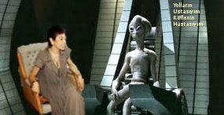

# Galaksi çapında bir röportaj - 2

Neşe Düzel: Ata'nın yaveri Hamdi Türkedön ile röportajımızın ikinci
bölümüne uzay gemisinde devam ediyoruz.

Hamdi Bey, şimdi geminizdeyiz. Buraya nasıl geldik? Bir parlaklık
oldu, sonra sandalyem ile buraya geldim. Işınlandık mı?

Evet... Bizim galakside buna "uzak mesafeye Türkolmak"
deniyor. Bilindiği gibi göçebe milletiz, göçmek, transfer olmak,
ışınlanmak.. hepsi aynı şey. Keşfi yapan kişinin ismi zaten Dündar
Türkolmuşlaroğlu.

Anladım.. İç dekoru ilginc bir geminiz var.. Şuradaki bir kasetçalar
mı?

Evet. Yolda giderken müzik dinlemeyi çok severim.. Gaza
basmışım... kolum yan camda, vitesi alttan, ikiden üçe söyle tık-tık
diye atarken [kasedi takar]

♬ ♫Görmedimmm-mmmm- yürekten ♫ candan seveni ♫
♫ Yalancı dostluklar ağlattıııı-ııı beni♫
♫ Kul ettimmm--mmm-mm-m ellere ben bu bedeni ♫
♬ Yinede kimseye yaranamadımmm-m--mmmm ♫♫

♬ ♫Hataya düşmüşümmm-mmm-m ♫ bunca sevmekle ♬
♫ Aramı açtılar benimmm-mm gülmekle ♫
♫ Ömrümü geçirdimmm-m--mmmm boyun bükmekle ♬
♬ Yinede kimseye yaranamadımm-mmm-mm-m ♬ ♬

Bu arabesk müziği 

Yo o tür değil. Şarkı Dağ Türkleri yöresinden Türki Hicazkar
makamında... Yani en azından satan kasetçi bana öyle
söyledi. "Arabesk" dediniz, bu arada bir düzeltme yapayım, bir milleti
kastettiğiniz, ama Arap diye bir millet yok aslında, o kardeşlerimiz
"Ortadoğu Türkleri".. Yine o bölgeden Ermeniler, "Kilise
Türkleri". Bunları hep hatırlatıyorum düzeltmezsek yanlışlar böyle
sürüp gidecek.

Hazır uzaydayız, geminizdeyiz, şimdi size kainat hakkında bazı sorular
sormak istiyorum. 

Buyrun sorun. 

Yaratılış anı nasıldı? Nasıl yaratıldık?

Bu derin bir soru. Cevaplamaya uğrasayım.. Başta kainatta hiçbir şey
yoktu. Hersey bomboştu. Sonra Tabiatı Teala, ulu kirpilerin, öküzlerin
benliğindeki derin ruh tüm evreni Büyük Patlama ile bir anda
yarattı. Bu patlama tam anlamıyla bir müdaheleydi, bir
darbeydi. Ardından tüm gördüğünüz şeyler vücuda geldi.

Ardından ne oldu?

Çiçekler, bulutlar, toprak su oluşturuldu.

Ondan sonra? 

Onun hemen ardından Fenerbahçe Takımı yaratıldı.

Bildiğimiz futbol takımı Fenerbahçe mi? Bu cok ilginç. Ama onların
kuruluşu 1907 değil miydi?

Nasıl yani - milattan sonra 1907 mı? Olur mu canım! Büyük Patlama'dan
1907 milisaniye sonra. Hemen ardından diyorum. Doğanın yaratıcı şaman
güçleri "Kün" dedi, ve 11 as 7 yedek 18 oyuncu pat diye oracıkta
yaratıldılar. Gelir gelmez de hemen aralarında top çevirmeye
başladılar.

Fenerbahçe iddialı bir takım..

Tabii. Çok uzun süredir idman yapıyorlar.  İlginç bir şeydir,
takımımızın yaratılması için evrim süreci bile beklenmemiştir. Bitmiş
ürün halinde topçular hemen ortaya çıkartıldılar, bugünkü gördüğümüz
haliyle Fenerbahçe'ye benziyorlardı.

Fakat ligde diğer takımlar da var. Bunları nasıl açıklamak gerekir?
Bir ezeli rekabet var mesela..

Diğer takımlar da yavaş yavaş serpildiler, oynayacak birileri lazım
zaten. Ama mesela ezeli rekabet diyorsunuz, o takımlar hiçbir zaman
Fenerbahçe kalitesinde olamıyorlar.

Beşiktaş, Galatasaray,..

O dedikleriniz de var, doğru, ama bunlar, "bir kısım klüp", şimdi
burada isim vermek istemiyorum, farklılık bariz ortada.. Sirius
Galaksisi'nde bahsettiğiniz ezeli rekabete bianen belirteyim, iki
istatistik çok yakından takip edilir. Bunlardan birincisi, "en çok kim
koydu". Diğeri "en son kim koydu". Bakıyoruz - en çok: 136-116, Fener,
en son, yine Fener.

Tartışma bitmiştir.

Ama en son maçta ...

.. Yani, o son maçı karıştırmayalım şimdi... Orada şaibeli bir durum
oldu, zaten hakemin cinsel tercihleri hakkında ciddi şüpheler
var. Durumu yargıya taşımayı planlıyoruz, halk tüm olanları
görsün. Ulu takımımızın hakkı çalındı. Öyle bir durum ki, eğer
dünyadaki herkesin Sirius'tan bizim getirdigimizi bilmesem
"bazılarının Türk kanı taşıdığında şüphe ediyorum" derdim.

Daha gündelik konulara gelelim o zaman.. Merak ettiğimiz konulardan
biri Sirius'taki yönetim şekli. Nasıl yönetiliyor tüm galaksi?

Son derece demokratik bir sistemimiz var.

Yani belli aralıklarla sandığa gidiliyor, vekiller, seçim..

O dediklerinizi anlayamadım. Demokratik sistem diyorum, yani reşit
olmuş her Sirius vatandaşı darbe yapabilir. Tamamen açık, özgür ve
katılımcı bir sistemimiz vardır.

Hakikaten herkes müdahele yapabiliyor mu?

Herkes yapabiliyor.. Hakkı kardeşim ile beraber biz bile darbe
yaptık. Ah, hatıralarım canlandı şimdi. Çok güzel bir gündü.. O gün
biz kahvaltıdan erken kalkmışız, bir fırsat ortaya çıktı, hemen
harekete geçip yayın organlarını ele geçirdik, müdaheleyi
yaptık. "Devlet otoritesini tarafsız olarak yeniden tesis ve idame
etmek gayesiyle yönetime el koymak zorunda kaldık .." diye giden bir
konuşma patlattım. Tam süperdi. Sonra karşı darbeye maruz kaldık,
alaşağı edildik ama bir süre çok ve büyük işler yaptığımızı
söyleyebilirim.

Neler yaptınız?

Birkaç gün krallar gibi yaşadık.. Sonra beni çok rahatsız eden tüm
sorunları ele aldım. Andromeda Galaksisi ile bizimki arasında bir
kavşak var mesela, yahu, ne zaman gitsem trafik ışığı bizim tarafa
sürekli kırmızı yanıyor. İllatayıgeyik dedirtti, ben de yönetimi ele
alınca "yeşile çevrilsin" diye emir verdim, yeşil oldu.

Emir verdiniz oldu.

Yaptık oldu. Sonra o kavşakta kazalar arttı ama ne yapalım.. halk
cahil, yolda giderken etrafa dikkat etmiyor .. yolları triple yapmak
lazım...

Peki ne zaman darbe yapılmalı? Kaos, kargaşa olunca mı, her kafadan
bir ses çıkmaya başlarsa mı? Darbe için ne zaman uygun zamandır?

Neşe Hanım, her an darbe için uygun zamandır. Ama o an yapılmalı
mıdır, bu galaksimizde bir akademik tartışma konusudur. Bir de, çok
kafadan değil, iki kafadan farklı ses çıkıyorsa bile darbe zamanı
gelmiş demektir. Daha önce de belirttiğim gibi darbe, kainatın en
temel öğesidir. Çarpıştırıcı deneyleri yapıldı dünyada, ne oldu? Bir
baktılar, içeride parçacıklar sürekli birbirlerine müdahele ediyor. Bu
nedir? Bir tur mikrokozmik darbe.

Şamancı tarzı inanışın bu konuda duruşu nettir: size şimdi Kutsal
Kitabımızın Yağdı Yağmur Çaktı Şimşek ayetinden aktarayım:

>De ki, bir zamanlar öyle bir millet vardı ki onlar görünmeyen
>tanrılara inanıyordu, sürekli fikir birliğini bozup 'biz tek halk
>değiliz, aramızda farklı halklar var' diyorlardı. Doğaya
>tapınmıyorlardı. Biz de onların üzerlerine kokarcaları saldık,
>burunlarının direği kırıldı. Elbette bizim gazabımız çok
>şiddetlidir. Şimdi imana gel. Kunduzlara, kokarcalara tapın. Bilmezsin
>ki O'nlar görürler. Onlar Darbe. Onlar Müdahele."..  .. böyle devam
>ediyor. Yani ilahiyat açısından da müdahele, yönetimi ele geçirmek
>caizdir.

Kutsal Kitabin ismi ne? 

Gudat Gulugulu Gugubilig

Son olarak galaksiniz ile ilgili bazı verileri sizden almak istiyorum. Bunları hemen arka arkaya soracağım.

Cevaplandırmaya uğraşayım.

Galaksinizin resmi adı:

Sirius Büyük Baysak  Türk Kamutayı 

Geçim kaynakları:

Tarım, madencilik, ana ürünler şeker pancarı, pamuk, karpuz, ve domates

İklim:

Yazlar sıcak ve kurak, kışları ılık ve yağışlı

Bitki örtüsü:

MAKİ 

Teşekkürler 

Ben teşekkür ederim

