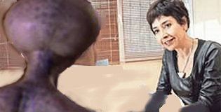

# Galaksi çapında bir röportaj - 3



Neşe Düzel - röportaj dizimize bugün farklı bir konukla devam ediyoruz - Hakkı Daum. Kendisiyle galaksi-ötesi yayın dizimize farklı bir açıdan yaklaşmaya çalışacağız.

Neden Hakkı Daum?

Ata'nın en önemli yaverlerinden olan Daum, uzay gemisi Savarona ile çok uzun süredir seyahat ediyor ve Sirius Galaksi'siden dünyaya teftiş amaçlı ziyareti hakkında ilginç bilgiler paylaşıyor.

Hosgeldiniz Hakkı Bey

Hoşbulduk

Biz daha önce Hamdi Bey ile söyleşi yaptık sizden çok bahsedildi, kulağınızı çınlattık, nihayet sizinle de görüşmek kısmet oldu.

Çok iyi oldu, röportaj sayesinde verebildiğim kadar bilgi vermek isterim, Türk dünyasını, Türk ırkını tüm dünyaya anlatmak bizim görevimiz, zaten bunun için buradayız. 

Soyadınız Daum.. Fenerbahçeli misiniz?

Ben Belediyespor taraftarıyım. Annem aslında hasta Fenerli, ondan bana böyle bir soyadı verildi.. Bu konunun detaylarını başka bir röportajda anlatmıştım.

Sirius'ta herkes Fenerli değil mi? Hamdi Bey'den öyle bir intiba aldım sanki..

Galaksimiz yüzde 99.9 Fenerlidir, Belediyespor taraftarları çok azınlıkta. Bir deyiş var bizim orada: "Herkes zaten Türk. Birgün herkes Fenerbahçeli olacak". Bunlar fantazi tabii, ben takımımı değiştirmeyi düşünmüyorum, ama azınlıkta kalıyoruz sürekli..

Bu nasıl bir duygu? 

Zor bir durum... bazen çok rencide ediliyoruz, çok baskı görüyoruz. Ne zaman bir büyük maçta kaybetsek, hemen birileri geliyor, mağlubiyete mealen muhtelif kaş göz, el hareketleri eşliğinde "yaa. tık tık.. " gibi sözler sarfediliyor, taciz yapılıyor.. Sonra bunları duyan bir başkası araya giriyor "ooo var ya bunu bana diyecekti" diye hemen bir gerginlik yaratıyor.. dolduruşa getiriyor. Digeri geliyor "bunun altında kalacağına gel benim altımda kal".. Şimdi böyle olmaz. Çok ağır sataşmalar, sürekli baskı. Uzun süre dengem bozuldu bu sebeple, psikolojik tedavi gördüm. Halen de görüyorum.

Gecmis olsun.. Şimdi siz bunları anlatırken düşünüyordum da.. arkadaşınız Hamdi Bey'e görüntü olarak ne kadar çok benziyorsunuz. 

Neşe Hanım, teessüf ederim. Çok ırkçı bir şey söylediniz. "Bunların hepsi birbirine benziyor" gibi bir anlam çıktı. Lütfen. Bunu kabul etmem mümkün değil. Bu yorumunuzu kınıyorum.

Yok öyle demek istemedim... yanlış anlaşıldı..  

Ama öyle bir anlam çıkmadı. Kınama mesajım ile beraber size nota veriyorum.

Ben.. öyle demek istememiştim Hakkı Bey, rica ederim. Bir de, notayı devletler vermez mi? Burada öyle de..

Sirius'ta tüzel kişiler de nota verebilir. Geçende Hamdi'yle konuşuyorduk, laf arasında ona "bana bak" dedim, o da bana döndü "sana belediye baksın" dedi derhal ona da nota verdim. Bu konularda cok hassasımdır.

Ben tekrar özür diliyorum.. Lütfen notanızı geri alın.

Peki aldım. Irkdaşlar arasında küskünlük olmaz.

Teşekkürler.. Hamdi Bey'den söz açılmışken, o bana müzik dinlemeyi çok sevdiğini söyledi. Siz ne tür müzikler dinlersiniz? Sirius'ta ne tür müzikler vardır?

Pek çok farklı müzik çeşidini severim, galaksimizde geniş bir Türk müziği, yani müzik yelpazesi vardır. Bugünlerde daha çok doğa seslerinin kaydını dinliyorum, su sesleri, böcek vızıltıları, inek, öküz sesleri.. Tabiatı Teala'nın sesleri onlar, beni çok rahatlatıyor. Zaten psikologum bunu yapmamı tavsiye etti.

Peki sözlü müziklerden neleri seversiniz? Hangi şarkılar?

Hangisini saysam bilmem ki..  Mesela Kara Kedi sarkisini severim. "♬ ♫ Keşke ulu kara kedi girse aramıza ♬ ♬ seni şöyle alalım otur yakınımıza ♬ ♫". Böyle... Bir başka sevdiğim şarkı Ulu Tanrım Eşşek. 

Burada da ona benzer  bir şarkı var ama ismi farklı, bizdeki Arkadaşım Eşşek 

Tövbe tövbe.. Olur mu öyle şey? Fesupanayıbeygir. Çarpılırsınız Neşe Hanım valla böyle şeyler söylemeyin. Eşşek gibi bir kutsal yaratık nasıl arkadaş seviyesinde olabilir. Samancı tarzı inanışa göre seviyeler, hiyerarşi cok nettir, böyle olmaz.

Nasıl bir hiyerarşi?

Hiyerarşi cok açık. Kul var, kutsal var, peygamber var. Sirius'taki bir atasözü durumu daha iyi aciklayabilir: "Bir lisan, bir insan. İki insan bir hayvan." 

Yani durum gayet net. Lütfen bu konuya dikkat edelim. Yani siz çarpılırken bana da burada bir şey olacak diye korkuyorum.  

Dikkat edeyim peki.. Son sorum: Ata ile seyahat etmek nasıl? 

Kendisi ile seyahat edebilmek tam bir seref bizim icin. O  en büyük Türk dinimizin peygamberi ölümsüz Ata'mız [ayağa fırlar]

```
Atam!
Oydu Met’lerde, Oğuz Kağan’larda
Oydu Orhun yazıtları’ndaki destan
Oydu dolu dizgin şanlı ılgazlarda
O kurtardı bizi her mutsuz çağda
Karşısında onu buldu her düşman.
Çökmedikçe üstümüze mavi gök
Göçmedikçe altımızda yağız yer,
Durdukça evren uzar gider uzayda Atatürk
```

İlginç bir şiir.

Birdenbire içimden geldi, kendime hakim olamadım, şiiri okumak istedim.

Hakkı Bey, şiiri paylaştığınız için ve röportaja zaman ayırdığınız için teşekkür ederim. 

Ben teşekkür ederim. Mistik Türk Gücü sizinle olsun.


