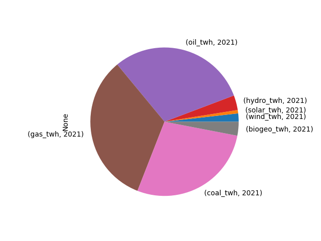

# Enerji İstatistikleri

```python
import util
df, prod_perc, tot = util.get_bp_country("Turkey")
print (df)
print ('\nProduction As Percentage of Consumption\n')
print (prod_perc)
print ('\nTotal\n')
print (np.round(tot*1000 / (365*24),2),'GW')
```

```text
             Year
wind_twh     2021     1.795618
solar_twh    2021     0.740097
nuclear_twh  2021     0.000000
hydro_twh    2021     3.211806
oil_twh      2021    30.255704
gas_twh      2021    33.057043
coal_twh     2021    27.915404
biogeo_twh   2021     3.024327
dtype: float64

Production As Percentage of Consumption

   Perc Commodity
0   0.0       Oil
1   0.0       Gas
2  43.1      Coal

Total

197.95 GW
```

```python
df.plot(kind='pie')
plt.savefig('source-pie.png')
```




