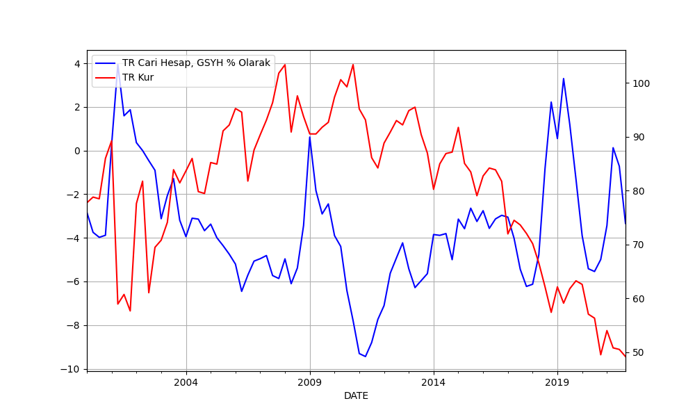
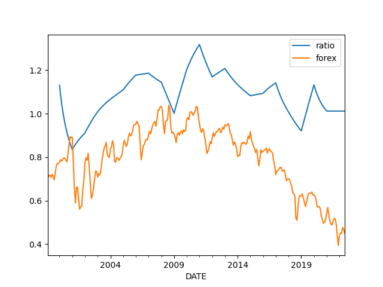
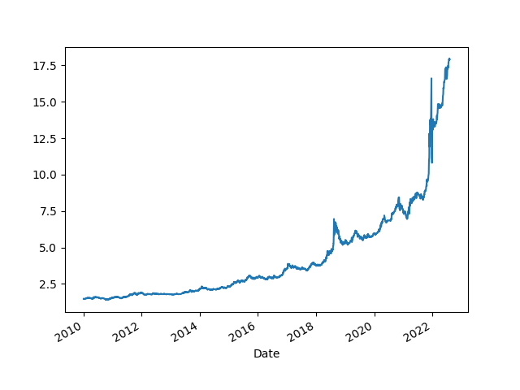
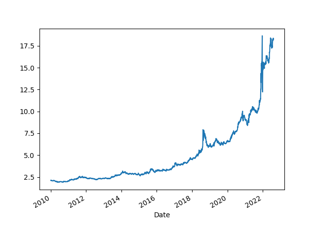

# Ekonomik İstatistikler

Cari açık ile kur ilişkisi

```python
import util
cols = ['TURB6BLTT02STSAQ','RBTRBIS']
df = util.get_fred(2000,cols)
df = df.dropna()
print (df.tail(5))
plt.figure(figsize=(10,6))
ax1 = df.TURB6BLTT02STSAQ.plot(color='blue', grid=True, label='TR Cari Hesap, GSYH % Olarak')
ax2 = df.RBTRBIS.plot(color='red', grid=True, secondary_y=True, label='TR Kur')
h1, l1 = ax1.get_legend_handles_labels()
h2, l2 = ax2.get_legend_handles_labels()
plt.legend(h1+h2, l1+l2, loc=2)
plt.savefig('currxch.png')
```

```text
            TURB6BLTT02STSAQ  RBTRBIS
DATE                                 
2020-10-01         -4.992384    49.55
2021-01-01         -3.439216    54.04
2021-04-01          0.130167    50.83
2021-07-01         -0.718499    50.54
2021-10-01         -3.339187    49.22
```



<a name='impexp'/>

İthalat İhracat Oranı ve Kur

```python
import util
df = util.get_fred(1990, ['TURIMPORTADSMEI','TUREXPORTADSMEI','RBTRBIS'])
df = df[df.index > '1999-01-01']
df.columns = ['import','export','forex']
df = df.interpolate()
df['ratio'] = df['import'] / df['export']
df['forex'] = (df.forex / 100.0)
df[['ratio','forex']].plot()
plt.savefig('impexp.png')
```



Dollar / TL

```python
import util; df = util.get_yahoofin(2010,"USDTRY=X"); df.plot()
print (df.tail(5))
plt.savefig('try-dollar.png')
```

```text
Date
2022-08-02    17.893499
2022-08-03    17.943100
2022-08-04    17.930700
2022-08-05    17.941700
2022-08-06    17.910101
Name: Close, dtype: float64
```




Euro / TL

```python
import util; df = util.get_yahoofin(2010,"EURTRY=X"); df.plot()
print (df.tail(5))
plt.savefig('try-eur.png')
```

```text
Date
2022-08-02    18.332830
2022-08-03    18.217159
2022-08-04    18.206249
2022-08-05    18.380260
2022-08-05    18.237400
Name: Close, dtype: float64
```




