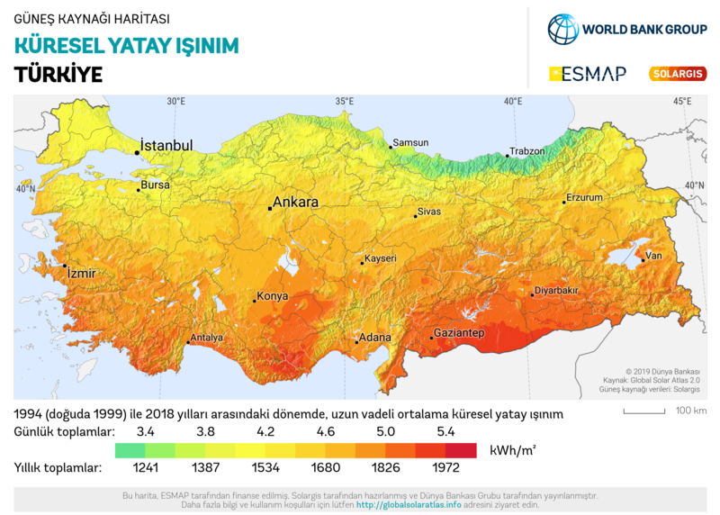

# Güneş Kaynağı Haritası

Watt/m2 birimine çevirmek gerekirse en yüksek yerde 225
Watt/m2. Dünyada en yüksek nokta 300 Watt/m2, Avutralya ve
Afrika'da.

Konsantre Güneş Gücü (CSP)

Güneş ışınlarını aynalarla yönlendirip yüksek ısı üzerinden enerji
üretmek tekniği CSP.

[Makale](https://www.researchgate.net/publication/222051631_Prospect_of_concentrating_solar_power_in_Turkey_The_sustainable_future)

"Konsantre güneş gücü sistemlerinin olurluğu (feasible) en az [205
Watt / m2] direk normal güneş radyasyonu (DNİ) gerektiriyor. Adana en
iyi DNI'ya sahip, ardından İç Anadolu (Konya) ve Güneydoğu Anadolu
(Urfa) geliyor.

