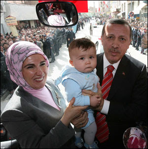
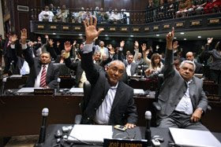
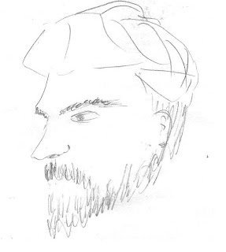

# Hafta 12

Hadi Uluengin

O halde bir, öküz altında buzağı arayıp ve komplo teorilerine bir
yenisini daha ekleyip, savcının jestini "yukarıdan eşgüdümlü" bir
kumpas olarak açıklamanın álemi yok! Ortada ne "örgüt", ne "komplo"
var! Ankara bürokratlarının ahbap?çavuş ilişkisi ve onların Sakarya
meyhanelerindeki "laiklik gitti, gidiyor" vahvahı da bu gerçeği
değiştirmez. Hasbelkader konumuna sığınıp kendine "misyon" vehmeden
aklıevveller ibadullah. Fakat doğru, Başsavcı statüko açısından tabii
ki "taktik" bir taarruza kalkıştı. Ancak, bu, harita okumayı bilmez ve
ikmál kuvveti hesaplamaz işgüzar çavuşun, emir gelmeden ve tek başına
karşı sipere yönelttiği başıbozuk saldırıdan farksızdır ki, nokta!

Dogru

Bizce de, bu deneme 'munferit' bir olaydir.

---

Kadir Copdemir

Kimisi diyor ki "bu filme herkes gidiyor, film para kazaniyor kesin
kotu filmdir gitmeyelim, bir baskasi da diyor bu film odul almis kesin
kotudur, gitmeyelim. Bu ikisi arasinda bir orta nokta olmali".

Dogru

O orta nokta su olmasin: "Bu film para kazaniyor, cok kisi gidiyor, o
zaman iyi filmdir".

Degil mi? Yani bunu dusunmek niye bu kadar zor? Tabii iyi derken, o
seyircilerin icinden ciktigi grup icin gecerli genellemeden
bahsediyoruz. Eger siz, genel sinema seyircisini temsil etmiyorsaniz,
o zaman sizin iyi/kotu kriterleriniz bile toplumdan farkli demektir -
o zaman o ulke baglaminda hicbir piyasa kiyaslamasina dahil olmamaniz
lazim. Fakat topluma donuk bir irdeleme yapacaksaniz, o zaman
insanlarin serbest bir piyasada cuzdanlari ile oy verdiklerini
anlamamiz gerekiyor. Sinan Cetin'in konu hakkinda yorumlar suradadir
(sonlara dogru).

Goze, kulaga guzel gelen sey, sanattir. Nokta. Baska hicbir tanima
gerek yok... Sanatin bir seyi "temsil" etmesi, onu uretenin bir
seyinin "disavurumu" olmasi gerekmez. Picasso'nun eserlerini
begeniyorsaniz, iyi sanattir. Begenmiyorsaniz, degildir. Film gise
rekorlari kirmissa, iyi filmdir, hic basarili olmamissa, bu irdelemeyi
yaptiginiz grup baglaminda, film kotu filmdir.

Buradan hareketle, su unlu Kurtlar Vadisi hakkinda birkac yorum... Bu
dizi mafya yapilanmasini, derin devleti yuceltiyor diye bir zaman cok
elestirildi. Fakat "sanat hayati taklit eder, tersi degil" kuralina
gore K.V dizisi, cekildigi zamandaki Turkiye'nin bir aynasiydi. Yani
bu dizi cekilmekte oldugu icin derin devlet, ceteler olusmadi - onlar
zaten vardi.

Simdi ne oldu? Ceteler cokertiliyor, temizlik yapiliyor - ve (bazi
yorumlardan anladigimiz uzere) Kurtlar Vadisi'nin havasi son
zamanlarda degismeye baslamis. Bu is boyledir. Sanattan, ayni
dusunceyi ifadeden korkmaya, onu sansurlemeye gerek yoktur, cunku
sanat, fikir, mevcut durumun bir aynasidir.

Ayni sekilde, su anda televizyonlarda olan dizilere "feodal yapiyi
yuceltiyor" diye elestiri yapmak sacmaliktir cunku bu mereti seyreden
adamin biraz ustunu kazirsaniz, bir nesil oncesi koye dayanacaktir!
Sohbet sirasinda biraz silkelersen uzerinden "imece, kuyu, keci,
nadas" gibi kelimeler dokulecektir. Yani adamin kultur kodlarinda bu
meret vardir - zamanla olmayacaktir, ama simdi vardir. O sebeple, bunu
seyredecektir, bunu sevecektir. Siz begenmiyorsaniz, seyretmezsiniz.

Biz sahsen kayit ederek TV seyrederiz (hizli gecmek icin) ya da baska
yollardan yabanci diziler.. Kayit edilenler, Turkce kanallardan TRT1,
CnnTurk, Tgrt, Business Channel, NTV'den ibarettir (diger tum kanallar
blok edilmistir). Hicbir Turkiyeli dizi seyretmeyiz. Hosumuza gitmiyor
ama bu baskalarini elestirecegiz, o seyretmesin dedigimiz anlamina
gelmez.

---

Ilber Ortayli

"[Turkiyeli kelimesi] abuk sabuk, ne oldugu bilinmeyen, hic tutar bir
tarafi olmayan bir laf[tir]" [1]

Yanlis

Eger zaman tunelinde geriye gitseydiniz, Kanadali veya Amerika'li
kelimelerinin de "abuk sabuk sacma" bulanabilecegi bir zamana denk
gelebilirdiniz. Turkiyeli kelimesi ne oldugu bilinmeyen bir kelime
degildir, ne oldugu gayet net sekilde bilinmektedir: Mevcut Turkiye
topraklarindan yasayan insanlar anlamina gelmektedir. Sn. Ortayli bunu
gayet iyi biliyor tabii ki.

[1] Cumhuriyet'imize Dair, Ismail Kucukkaya

Tayyip Erdogan

Dünya Kadınlar Günü nedeniyle Uşak’ta düzenlenen toplantıda konuşan
Erdoğan, kadınlara “Bunlar Türk milletinin kökünü kazımak istiyorlar,
nüfusun azalmasını istemiyorsanız, 3 çocuk doğurun” dedi.

Dogru

Yani, 3 cocuk kismi dogru... Ama daha kesin bir sayi istiyorsaniz, her
ailenin 2.1 cocugu olmalidir! :) Bu rakam gelismis ulkelerde (biz daha
orada olmasak ta) nufusun saglikli devri-daimi (replacement) icin
gereklidir.Bu rakam ile ABD'de bazen dalga gecilir - "evet,
evlenecegim, suburbia'ya [1] tasinacagim, ve 2.1 cocuk sahibi
olacagim" bunlardan biri..

Serdar Turgut

Daha önce söyledim; ‘getir göster bir birinci sayfa manşetini ve buyur
ulusalcılık de’ diye ama o başka yazarların köşe yazılarıyla münakaşa
ediyor kendi kafasında.

Yanlis

Bahsedilen gazetede "darbecilik kotu bir sey degildir" kivaminda
yazilarin ciktigi oldu. Sn. Turgut bunlardan haberdardir
umuyoruz... Kendi gazetesini okuyor olmali.---[1] Suburbia, "sehir
disi" yani "suburb" kelimesinin bir espriyle ulke ismi gibi
kullanildigi bir durumdur cunku sehir disi yasayanlar bazen degisik
bir ulkede yasiyor gibi olurlar. Mesela bu sebeple suburbia'nin krali
olan New Jersey'den gelen okuldan tanidiklarimiz New York'u hic
sevmez. Sevmemezlik ters yonde de isler tabi - NY da NJ'yi pek
tutmaz. NJ'in halini en guzel Sopranos dizisinde gorebilirsiniz.

---

---

Sinan Cetin

Soru: Başörtüsü yasağına karşı yapılan düzenleme için mi söylüyorsunuz
bunu?

Hayır, hayır. Orada yanlışlık yapmıyor AK Parti, aksine son derece
serinkanli ve haklı davranıyor. Başörtüsü konu bile değil. Konu haline
getiren yasaktır, sorun haline getirenler de yasaklayanlar. Yasak
olmasaydı sorun olmayacaktı. Yasaklayan yaşıyorsa Allah uzun ömür
versin, öldüyse kemikleri sızlıyordur herhalde. Her yasak başka
özgürlük alanlarını da daraltır. [..] Özgürlük fikri sevilmiyor, satın
alınmıyor çünkü. Devlet seçkinleri başta olmak üzere herkes toplumu
yönetmek, biçim vermek istiyor. Halbuki toplum diye bir şey
yoktur. Birey vardır, birey de nereye gideceğine, neyi tercih
edeceğine sadece kendi karar verir. Hukuk ise bireyleri devlete karşı
korumak için vardır.

Dogru

---

Mehmet Barlas

Galiba kolay olan türbana "evet" veya "hayır" diyerek kavga etmek.

Yanlis

Turban gibi bir konuda esas yanlis olan orta pozisyondur. Aynen
Amerika'daki kurtaj konusu gibi, ya yasaktir, ya da degildir (1973
tarihli Roe vs. Wade kararindan itibaren de serbesttir). Zannediyorum
kendisi turban konusu ilk gundeme ciktiginda bir kafa karisikligi
yasadi (akil hocasi bulamadi?), ve "tutarli olmak" icin bu pozisyonu
devam ettirmek istiyor. Sn. Fehmi Koru benzer bir durum yasadi, onun
soguklugunun sebebi "hukumete yakin oldugum halde nasil oldu da bu
isten once haberim olmadi?" havasinda bir soguk durmaydi galiba (gayet
flu ve anlamsiz bir beyanname "ucuncu gorus"'e desteginin sebebi de bu
olmali).

Artik hayat daha hizli ilerliyor. Sorunlar ve cozumler, beklenmedik
anlarda, sartlarda ortaya cikabiliyor. Bu, hayat icinde aktif
olanlarin o "firsat dalgalari" ciktigi anda, ustune atlayip sorfe
baslamasini gerektirmektedir. Her sorunu tekil bir sekilde, tek basina
irdeleyip, onun ortaya cikarttigi secenekleri en puruzsuz sekilde
ortaya koymak, ve firsatlar ciktigi anda onu cozmek icin bir tarafa
yonelmemiz gerekiyor. Degisim icin bir sureligine karisiklik tolere
edilebilir. Kaos teorisinde siddetli akim bolgeleri oldugu gibi stabil
noktalar (saddle points) de mevcuttur.

Ve bir diger stabil noktaya varmaniz icin, once icinde oldugunu
stabilite noktadan cikmaniz gerekir.

---

Murat Birsel

Normal fizik kurallarının işlediği makro dünyadan mikro boyutlara
geçtiğiniz zaman bildiğimiz fizik kuralları çalışmaz oluyor. Yere
düşmesini beklediğiniz şey havaya çıkıyor veya çarpacak dediğiniz şey
duvarın içinden geçiyor. Mesela ‘kuantum’ klavye ile yazı yazıyor
olsanız ‘elma’ yazmak üzere e-l-m-a tuşlarına basıyorsunuz (kuantum
daktilo) ‘gazoz’ yazıyor.

Belki

Kuantum mekanigine gore bazen elma, bazen gazoz yaziliyor, fakat daha
cok elma yaziliyor demek daha dogru olur. Bir elektronun bir yerden
digerine giderken, en kisa yol yerine kainatin oteki ucuna gidip U
donusu yaparak sonra onunuzdeki hedefe uzun yoldan gecerek gitmesi
ihtimali sifir degildir, fakat sifira yakindir. Matematiksel olarak bu
yollarin tumunden gecilir fakat agirlik daha olasi olan yol duz olan
yoldadir demek daha dogrudur. Kuantum karmasa, kargasa, tekme tokat
sokak kavgasi, arbede degildir. Kaldi ki kaos bile deterministik
olarak uretilebilir. Rasgele sayilari uretmenin algoritmalari da
vardir.

---

Mehmet Barlas

Mussolini "Faşizmin Doktrini" nde, şöyle bir tanımlama yapar. Faşizm,
sosyalizme, liberalizme, demokrasiye ve bireyciliğe karşı olan
kollektivist bir ideolojidir. Faşist hayat tarzında, bireyin çıkarları
devletin çıkarları ile aynı olmalıdır. Faşist devletin kapsadığı
insani ve ruhsal değerler dışında başka bir değer olamaz.

Dogru

Barlas'in yazisi, fasizmin kabileci ve bireyi yokeden tarafini acik
sekilde gozonune koyuyor.

Ayrica buradaki bir ironi de var: Bu ironi, sosyalizme karsi oldugunu
zannedenlerin ona ne kadar benzedigi... Bizce, Mussolili Italya'si ve
Hitler Almanya'sinin Sosyalist Rusya'ya olan yegane gicikligi,
kollektivist kabile ideolojisinin kendilerinden degil onlardan cikmis
olmasidir. Hitler bu ideolojiyi "nasyonel" yaparak adeta "bu da
bizimki iste" demistir. Bir anlamda "sizin kabilenize girmek
istemiyoruz, siz bizimkine girin" imasi vardir.

MB

Falih Rıfkı Atay [..] şöyle yazar: "Halk çocuğunun anasının karnından
çıkar çıkmaz yattığı beşik fırka (parti) kucağıdır. Bir yeni cemiyet
başka türlü yoğrulamaz. Roma'nın yeni mahallelerinde liberalizm ve
demokrasiye aykırı birçok şeyler görülse de, 1921 anarşisinden,
fakirliğinden, gevezeliğinden, başıbozukluğundan hiçbir eser
göremedim. Demokrasinin ardından Ostiya'nın sivrisineği, Roma kırının
batağı, İtalyan ahlakının inzibatsızlığı, İtalyan sokağının pisliği
kalktı ve İtalyan milliyetperverliğinin eğilmiş başı yukarı kalktı."

[..] 1930'ların dünyası çok geride kaldı.

Dogru

Ustteki turden, kollektivist kabile ideolojilerine duzulen methiyeler
pek coktur. Bu safsatalardan bir digeri "Nazi Almanya'sinin trenleri
vaktinde yerine ulastirtirdigidir". Bu soz genelde "evet efendim,
ozgurluk yoktu ama hersey tikir tikir isliyordu" bab'inda
kullanilir. Halbuki bunu tartismasiz sekilde ispatlayacak (trenler
dahil) hicbir delil yoktur! Tersini ispatlamak icin II. Dunya
Savasi'na bakmak yeterlidir! Almanya kaynaklari lojistik olarak
planlamada buyuk zorluk cekerken, yetistiremezken, totaliter olmayan
Ingiltere kaynak dagitimini ve kullanimini (utilization) cok daha
verimli sekilde yapabilmistir. Almanya gerekli innovasyonlari gerekli
zamanda ve gerekli noktalara eristirememis, Ingiltere radari
kesfederek onemli bir avantaj saglamistir. Savas sonrasi roket
arastirmasi yapan Von Braun'un tum bilgisini NASA'ya vererek ABD uzay
arastirmalarinda cag atlatmasi, bilim adamlarinin pek de oyle
"nasyonel" olmadiklarini acikca gostermektedir. Bu insanlari ve
sanslari "kacirmis" olan Almanya'nin kaynaklari daha iyi idare
ettigini kimsenin tutarli sekilde iddia edebilecegini zannetmiyoruz.

---

Emre Akoz

Bu tip baskılara, zorlamalara, itip kakmalara, buluttan nem
kapmalara... Velhasıl o dönemi çağrıştıran uygulamalara sinir
olurum. İkincisi... Bir dile karakterini veren, kültürün ruhunu
taşıyan; "düz" kelimelerden ziyade deyimlerdir, tamlamalardır,
benzetmelerdir, deyiş biçimleridir...

Dogru

Dil onu kullananlarin sekillendirdigi bir seydir. Bir mirastir,
deyimleri, eski yeni tum kelimeleri onun zenginligidir. Bir kelimeyi
begenmeyen, onu kullanmamakta ve onu kullananlarla iletisim kurmamakta
serbesttir. Mesela "direkman", "şık oldu/olmadi" gibi kelimeleri
kullanmiyoruz, etrafimizda bunlari kullanan insanlar da yoktur. Bir
insan grubunda begenilen bir kisinin/kisilerin konusma stili belki
daha fazla yayilir, fakat bu da o grubun dinamiginin karar verdigi bir
seydir - bir merkezin degil.

---

Serdar Kaya

Bay Spiro'nun hikayesi, başlangıçta çok mantıklı gibi görülen kimi
düşüncelerin, daha ciddi sorgulamalara tabi tutulduğunda üzerlerindeki
yaldızların nasıl da kazınıp asıl mahiyetlerinin ortaya çıkabileceği
konusunda benzeri az görülür türden bir ibret vesikasıdır. Bay
Spiro'nun saygıdeğer çalışmasıyla ortaya koyduğu örnek, özellikle
sürekli dezenformasyona maruz kalan kitlelerin herhangi bir konuda bir
fikre varma konusunda acele etmeyip sabırlı davranmaları, en bilimsel
ve analize dayalı gibi görünen yargıları dahi sonuna kadar
sorgulamaktan korkmamaları gerektiğine işaret etmektedir.

Dogru

Guzel bir yazi - kutlarim.

Bahsedilen turden safsatalar etrafiimizda bolca. Tom Friedman bu tur
yalnis saptamalari kaynatan kisilerde biri. Evet, bir "model" bulmaya
ugrasmak, yani bu ugrasi, bu zihin durumu alkislanacak bir sey. Bunun
%100 arkasindayiz. Fakat her modele cok dikkatle bakmak
gerekiyor. Mesela Friedman'in "McDonalds'i olan iki ulke hicbir zaman
savasmamistir" diyen kurali bunlardan biriydi [2] - Yugoslavya
bolununce ve savasan her iki tarafta da McDonalds olunca modelin
hatasi ortaya cikti. Simdi, "ayni ikmal hattinda olan iki ulke
savasmamistir ve savasmayacaktir" diyor. Bunun dogru olup olmadigini
zaman gosterecek. Bu modelin iyi taraflari sunlar (dikkat adam bir
kere sisti diye her dedigini bir kenara atmacilik yapmiyoruz, durmus
saat bile gunde iki kere dogru vakti gosterir) biraz daha mantikli -
birbirine "satan" ulkeler bir urunun bitmesi icin "beraber
calismazlar" ve birbirleri ile olan baglantilari cok kuvvetli degildir
[1]. Boyle ulkeler birbirlerinin piyasasini urunleriyle isgal
etmektedirler, bu da aslinda bir savas olarak gorulebilir. Fakat ikmal
hattinda olmak, yani bir bilgisayari insa etmek icin innovasyonun
Turkiye'de, anakartin Bengalor'da, kasanin Cin'de, ve satisin ABD'de
yapiliyor olmasi o zincirdeki tum ulkeleri ve bu sureci takip eden
sirketi ilgilendirir, ve belki bu sirketin etkisiyle Cin ile Hindistan
arasinda daha iyi iliskiler gelistirilmesi mumkun olur (mesela). Fena
model degil. Dogrulugunu zaman gosterecek.

[1] Buna iyi bir ornek, iki dunya savasinda karsi taraflarda olmus Fransa ve Almanya'dir. Fransa, savaslardan once Almanya'nin en cok ticaret yaptigi ulkeydi.

[2] Fakat sunu da eklemek gerekir: Modelin iddiayi ortaya koyma "yontemi" ve detay seviyesi (granularity) dogrudur ve Popper'in "yanlislanabilir" kriterine uygundur. Ki, tarihte modele uymayan bir olay olunca modeli atabilmeniz mumkun olmustur. Yanlislanabilme kriterine uymayan bir model, "vallahi madalyonun bir yuzunde askeriyesi kuvveli ulkeler savasir, madalyonun diger yuzunde askeriyesi kuvvetli ulkeler caydirici olur ve savasmaya ihtiyaclari kalmaz" (mesela) seklindeki bir modeldir. Bu modeli yanlislamak mumkun degildir, bilahere modelin hicbir kuvveti yoktur. Gelecegi tahmin icin size hicbir enstruman saglamaz.

[3] Bir fakat daha: Kararlama mekanizmasi ile bir sorunun pek cok tarafini gorebilmeyi karistirmamak gerektigini de ekleyelim. Karardan once bir sorunun pek cok yonunu gorebilmis olmak her zaman karar mekanizmasina yardim eder.

---

Serdar Turgut

Türkiye’nin sorunu, aklın hâkim olduğu bir derin devletin ortada bulunmamasıdır.

Dogru

Cunku zaten AKP entegrator elit kesimi ile halk secimlerinin arasinda
bir "anlasma" noktasini temsil ediyor... Son gunlerde olanlar, elit
tabakasinin bir kisminin kendi basina bir takim isler cevirmeye
ugrasmasidir. Bu insanlar zamanin degisen sartlarina uyum
gosteremiyorlar. Her endustriyel demokraside halk ve entegrator elit
istekleri arasinda bir al-ver sozkonusudur, turbani,
Cumhurbaskanligini, kisitli populizmi verirsin (mesela), karsiliginda
ekonomik, siyasi istikrar, ve imtiyaz olmasa bile en azindan rahat
birakilmayi alirsin.

Bu al-ver iliskilerine bakarsak, Cumhurbaskanligi, turban konusunun
katiyen parti kapatma seviyesinde sorun yapilacak konular olmadigini
gorebiliriz.

Daha once belirttigimiz gibi, Turkiye tarim -> endustri -> bilgi
ekonomileri arasindaki gecisi cok hizli ve ayni anda yapiyor, bu
sebeple dogal olarak olusmasi gereken gruplasmalar yarim yamalak
olusuyor, ya da bu grubun bir kismi kendilerini birdenbire cagin baska
turlu degisim isteklerinin bombardinanda buluyorlar.

Fakat konu ile ilgili tum kesimlere tekrar hatirlatmam gerekir ki,
AKP, sistemle calismak icin bastan beri cok ugrasmis bir partidir,
Sn. Osman Ulagay'in kitabinda [1] AKP kurucularindan Bulent Arinc'in
konu hakkindaki dusuncerine bir goz atmak bunu anlamak icin
yeterlidir. Bu sebeple hukuksal sebepleri birakin, guc dinamiklerine
ve herkesi kapsayacak "optimal getir noktasina" baktigimiz anda,
AKP'nin kapatilma davasinin ne kadar mantiksizca ve ortak akilin
disinda bir garabet oldugunu anlayabiliriz.

Bu kapatma davasi kesinlikle ve kesinlikle reddedilmelidir.

Aslinda kapatma davasinin acilmasi bir bakima iyi olmustur - boylece
davanin muhtemel reddi sonrasi demokrasinin daha guclenmesi mumkun
olacaktir. Bir asi olarak addedebiliriz.

Alternatifi acikcasi dusunmek bile istemiyorum. Bu oldugu durumda
bizim sahsen yapacaklarimiz, Turkiye'de baslattigimiz teknoloji
projelerinin fisini cekmek, ulkeyi ne yazik ki terk etmek, ve her
turlu yardim, gozetleme eylemlerimizi durdurmak olacaktir. Bu sitenin
calismasi bitecektir.

Bize adim atana biz de adim atariz, ama yerinde duranlar icin
yapacagimiz bir sey yoktur.

[1] Osman Ulagay, Akp Gerçeği ve Laik Darbe Fiyaskosu

---

Mustafa Akyol

Gelin, Fuller’ın yaklaşımıyla biraz da kendimize bakalım. Bu ülkedeki
kimi “laikçiler”, en az yüzyıldır, “İslam yüzünden geri kaldığımızı”
söyler veya ima eder. Bunu söylerken, “dinciler”in bağnaz, hoşgörüsüz,
şekilci ve yeniliklere kapalı olduğunu da vurgularlar. Ama bu
saydıkları olumsuz vasıflara kendilerinin de fazlasıyla sahip olduğu,
son yıllarda ayan-beyan ortaya çıkmış durumda. Demek ki, bağnazlık,
hoşgörüsüzlük, şekilcilik ve yeniliklere kapalılık, dinin bir ürünü
değil; dindara da seküler olana da bulaşabilen, kendi başına ayakta
duran sorunlar.

Dogru

---

Gulay Gokturk

Evet, meseleler her zaman çok yönlüdür. Ama bazen, bir yön öylesine
ağır basar; öylesine vahim bir hal alır, diğer bütün yönler, o kadar
tali kalır ki; işte o noktada "başka yönlerden" de bahsetmek, asıl
meseleyi kamufle etmekten başka bir işe yaramaz. Şu anda öyle günler
yaşıyoruz. [..] Gundeme geldiğinden bu yana sık sık kullanılan bazı
ifadeler var ki, "meselenin iki yanını da görme" çabasını ortaya
koymaktan ziyade, kullanıcısının ruh halini, ideolojik ve siyasi
olarak iki arada bir derede kalmışlığını deşifre ediyor. "AK Parti'nin
hiç mi suçu yok" tekerlemesi bunlardan bir tanesi...[..] Somut bir
örnekle söyleyecek olursak, "AK Parti'nin türbanı serbest bırakmaya
çalışması laikliğe aykırıdır" demez, "Şimdi zamanı mıydı, başka türlü
yapılamaz mıydı?" diye eleştirir. "Bütünsel bir demokrasi yaklaşımı
içinde olmama" eleştirisi de yine, yürütülen icraatı yanlış değil ama
eksik bulan bir ifadedir. Ve aslına bakarsanız, her hükümete her zaman
yöneltilebilir.

Katiliyoruz

Bir karara varmadan once o konunun pek cok tarafini gormek iyidir,
fakat bir karar verilmesi gerekince, miyminti yapmadan, en optimal
olan secilerek o yonde "kalinmalidir". Kaldi ki turban serbestisinin
zamanlamasi acisindan yapilan tum elestirilerin ici bostur. AKP,
alabilecegi en fazla destegi alabildigi bir zamanda, konuda cozum
bekleyen bir sorunu cozme yoluna gitmistir.

Bu sebeple "kapatma iddianamesi" baglaminda olanlar bir garabet olarak
addedilmeli, muhtemel cozum sonrasi hicbir istif bozulmadan ayni
yolda/mentalitede devam edilmelidir.

GG

Peki bunlar, birileri ellerinde balyoz, hükümetin üstüne yürürken;
aslında sadece hükümetin değil, topyekun demokratik rejimin üstüne
doğru yürürken söylenecek şeyler midir? Sayılan günahlara bakın:
301'inci maddeyi bir türlü kaldıramamış; Hrant Dink davasını bir türlü
aydınlatamamış. Türban yasağını kaldırmaya çalışırken
üniversitelerdeki diğer yasakları kaldırmayı ihmal etmiş. [..] Peki AK
Parti bütün bunları yapmış olsaydı, bu dava açılmayacak mıydı?

Katiliyoruz

Bazilari, goze carpmak, dikkate alinmak icin hep ters olani soylemek
gerektigini zannediyorlar. Bazilari, "tepki varsa kesin bir seyler
yanlis yapilmistir" kivaminda bir korkaklik sergiliyorlar. Ayrica "Ak
Partili" gibi bir etiketten korkanlar da var. Bu baglamda en iyisini
Hadi Uluengin soyledi zannediyoruz:

"Her koyun kendi bacağından asılır, sürüden olmadığım için kişisel
açıklayacağım. Evet, derin mesafeme rağmen iktidar partisine kısmen
olumlu baktığım doğrudur. Ama burada belirleyici olan nokta AKP değil,
bizzat b-e-n'im! "Yol" benimkisidir!"

AKP'nin ozgurluklerden vazgectigini iddia edenlere sunlari belirtmek
gerekir: AKP'nin mesela "Turkiyeli" kelimesinden vazgecmesi (biz
vazgecmedik), 301 konusunda (guya) ayak surumesi, genel secim oncesi
"yukselen milliyetciligin oy kaybina ugratabilecegi" dusuncesiydi ve
hesabiydi. Bu yuzden AKP bir ucgenleme (triangulation) yaparak karsi
tarafin (MHP) bazi konularini caldi. Tum bunlar siyasi rasyonalitenin
bir parcasidir.

"Efendim politikada her sey oy icin mi yapilir?".

EVET HERSEY OY ICIN YAPILIR. Kapitalizm'de hersey para kazanmak icin
yapilir. Dinde her sey inanc cercevesinde yapilir. Hukukta hersey
kanun cercevesinde yapilir. Futbolda hersey o maci kazanmak icin
yapilir.

Ve aynen kapitalizmde "gorunmez el"in fiyatlari duzenledigi gibi,
demokrasilerde de "gorunmez el", yani halkin kanaati, icinde yasadigi
cagin genel sorunlari hakkinda en optimal karara varir.

O zaman: Siyasi rasyonalite icin yapilan her, siyasette mubahtir. O
zaman, AKP, muhtemel bir cozum sonrasi aynen kaldigi yerden
zihniyetini hic bozmadan, yoluna devam etmelidir. Oy almayi gozetmeli,
karsi tarafin konularini calmaya ugrasmalidir. Ayni seyi MHP, CHP de
yapmalidir.

Bu surec sonunda uzun vadede ulkenin sorunlari cozume ulasacaktir.

---

TİB BAŞKANI

Ses kayıtlarının Youtube’a nereden yüklendiği kolaylıkla
bulunabilir. Orijinal sesleri bilmiyoruz. Youtube ve benzeri paylaşım
siteleri Türkiye’den faaliyet belgesi almak zorunda. IP trafiği
dediğimiz, yani kullanıcıların siteye hangi videoyu, hangi ülkeden,
nasıl yüklediğini gösteren bilgiler o sitelerin kendileri tarafından
kaydedilir

Dogru fakat...

.. kayitlari yukleyen kisi cok basit bir yonlendirme ile IP adresini
saklayabilir. Bu durumda YouTube'in elindeki adres dogru adres
olmaz. Biz Internet yasaklarinin etrafindan boyle dolaniyoruz
zaten. Sanayi mentalitesi ile bilgi dunyasini idare edemezsiniz ve
anlayamazsiniz.

---

Fikret Ilkiz

Ses kayıtlarında içeriğine bağlı yayından kaynaklanan suç oluşabilir.

Dogru fakat...

.. bu yasagin etrafindan dolasilabilir. Kontrolu yapilamayacak kanunu
hic gundeme koymamak en iyisidi, yani bizden soylemesi, isteyen
yapacagini yapar.

Daha fazla bilgi her zaman daha iyidir. Bilgi yayilmak ister ve
yayilacaktir. Ne cekismesi olursa olsun, daha fazla is gozonune
cikiyor, bu da iyidir. ABD'de devlet ici cekisme help olur (ozellikle
baskan topal ordeklesmeye baslarsa), ve bu cekismeler bir kurumun
katilmadigi bir karar hakkinda bilgiyi basina "sizdirmasi" seklinde
tezahur eder, mesela CIA bunu daha once yapmistir (evet, CIA'nin her
tarafi "derin" degildir - cag degistikce, insanlar degistikce, onlarin
icinde yeraldigi kurumlar da degismektedirler).

Bu arada, konusanlarin kimligini saptamanin teknolojisi var - buna
"speaker identification" denir.

---

Hadi Uluengin

Eğer TSK şu an Kuzey Irak'ta harekát düzenleyebiliyorsa, bu, ABD'nin
söz konusu müdahaleye "ceváz vermiş" olmasından kaynaklanmaktadır.

Dogru

HU

Yani, TBMM'den çıkmış olan "Tezkere" işin yalnız "göstermelik" cihetidir.

Yanlis

Tezkere hukumetin elinde ABD'yi sıkıstırmak icin onemli bir koz oldu,
cunku tezkere dis basinda aninda flas haber oldu ve ABD kamuoyu bunu
gordu [1]. Bunun niye ise yaradigini anlamak icin ABD'de kamuoyunun
Irak hakkindaki su anki dusuncelerini bilmek gerekiyor - oncelikle
Bush'un halk arasindaki kabul gorme yuzdesi gecende yukari cikti ve
%19'a geldi! :) Saka gibi degil mi? Ek olarak, Irak'a girmis olmanin
bir hata oldugu kamuoyu tarafindan artik kabul edildi. Ustune ustluk,
Irak'ta Guney, Dogu, Bati'da bir suru problem duyulurken bir tek Kuzey
Irak hakkinda gurultu cikmiyordu, Turkiye de oraya girmek istedigini
ilan edince Bush fena sıkıstı! Eger Turkiye o durumda bir saatlik bile
girseydi, Bush'un durumu iyice tabana vuracakti.. Bu yuzden topal
ordek Bush, kotulerin arasindan daha kotusuyu secmedi ve Turkiye'yi
destekledi. Bu baglamda bizimkilerin Bush'un PKK hakkinda surekli
basinin etini yemis olmalari iste o an ise yaradi (bak yillardir
soyluyoruz, vs..).

[Buradan gerisi Sn. Uluengin'in yazisi ile alakali degildir] Yani
evet, ABD aslandir, kaplandir, asar, keser... Kavramsal
dusunemeyenler, fikirler yerini "kisileri/seyleri" koyanlar bu "ismi"
gorunce altinda ne dinamikler oldugunu dusunmezler, bu yuzden o seye
"kizarlar" ya da ondan "korkarlar". Fakat kavramlari kullanirsaniz,
bakin ne cikiyor: "Topal ordek" bir Baskan varsa, bu Baskan'i azicik
tokatlayip kendi amacina uygun yonlendirebilirsiniz. Tabii ABD kamuoyu
onunde hakli olabilecek bir durumda olmaniz gerekir, gerekcelerinizin
yerinde olmasi gerekir (ki Turkiye'nin oyle idi). Oyleyse tezkereyi
cikartirsin, Washington'a gidip W amcayi sıkıstırırsın ve izni
alirsin. Istihbarati toplarsin.

Harekatin ne kadar basarili olup olmadigi farkli konudur. Bence
harekatin olmus olmasi olmamasindan daha iyi oldu. Muhakkak, zorunlu
askerlik kalkmali, savasmayi tercih etmeyen savasmamalidir. Bu da
baska meseledir. Fakat su da bir gercektir: Surekli "sehitler olmez,
vatan bolunmez" demenin bayat/vasatlayabilecegi kadar "savas cozum
degil, hic kimse olmesin" demek te bayatlasmaya baslayabilir.

Hic kimse unutmasin ki, ta bastan tum bunlara sebep olan PKK
saldirisi, AKP Kurt asilli oylarin cogunlugunu aldiktan sonra
yapilmisti, yani siyasi cozume giden yol gorunmeye baslayinca. PKK
bundan rahatsiz oldu ve siyasi cozumun disinda olmak icin, onu bozmak
icin saldirida bulundu. Gittiler Sn. Abdullah Gul'un ziyaret ettigi o
cocuklari oldurduler, bunlari hatirliyoruz. Eh bunu yaparsan, Allah'in
sopasi bir gun kafana iner. Oyle ya da boyle.

HU

ŞÖYLE ki, ABD'nin harekátı onaylaması özünde, Beyaz Saray'ın
Türkiye'den y-a-n-a tercih yapmasından; daha doğrusu yapmak zorunda
kalmasından başka bir şey değildir! Yani, Irak Kürtleriyle arayı ne
denli iyi tutmak istiyor olursa olsun, iş "ya herrü, ya merrü"
noktasına geldiğinde, Washington kesinkes Ankara'yı seçmiştir.

Dogru

[1] Hatta tezkerenin gecmesi komedyenlerin diline bile dusmustu. Bill
Maher bu haber ardindan monolog'unda soyle espri yapmisti: "Turkiye
Kuzey Irak'a girmek icin parlamentosundan izin almis... Bush ta bunu
duyunca demis ki: "Ne parlamentosu yahu? Ben kimseye sormadim! Kut
diye girdim. Parlamento da neymis?"... Simdi, bunlar onemli seyler...

---

NTV

Avrupa ülkeleri İnternet’in en büyük arama motoru Google’a rakip
çıkarma arayışında. Sitenin adı “Quaero”, Latince’de “Arıyorum”
anlamına geliyor. Ama işleri hiç de kolay değil. Zira rakipleri çok
güçlü...

Dogru

.. cunku Google, Quaero gibi bir "devlet" projesi degildir. Fransa,
"geri kaldigini" hissettigi alanlara hep bu sekilde bir "devlet
projesi" ile dahil olmaya ugrasir, mesela bilgisayar bilimdeki baska
bir alanda da bunu yapmaya ugrastilar, milyarlarca dolar para harcayip
buyutmeye ugrastiklari proje ellerinde patladi. Bu projenin sonucunun
da husran olacagini tahmin ediyoruz. Piyasa rasyonalitesi icindeki
aktorleri gercekci olmaya iter. Bu rasyonalite disina cikarsaniz,
rasyonellik disina cikarsiniz. Fransa her alanda "ulusal yildizlar"
(sirketler, kisiler, vs.) cikartmaya ugrasiyor ama ote yanda 2.2
milyon vatandasi, ozellikle gencleri, ulkesinden kacip baska ulkede
calismaya gidiyor. Bu kacis 95'ten itibaren %40 artmistir! Bu iki olay
arasinda bir korelasyon olmali.

---

Taha Akyol

Oktay Ağabey, “Şeriat tehlikesi var” diyor; Demirel’in son sözlerini
de buna kanıt gösteriyor!

Normal

Bunu soyleyen zihniyetin (Sn. Eksi'nin), kabile mentalitesinde yani kavramsal dusunemedigi belli. Fikirler yerine "kisilerin soylediklerini" delil olarak vermesi bunun kesin bir ispatidir. Sn. Akyol'un ise bu yuzden Eksi ile tartismasi karsi tarafin bunu anlayamacagi sebebiyle gereksizdir - fakat takip edenlerin bilgilenmesi icin bunlar faydali muhakkak.

TA

Siz İslamiyette “Devleti ben yöneteceğim” şeklinde bir dogma olduğunu
söylüyor ve bundan yola çıkarak, “İslamiyette devleti yönetmenin onun
işi olmadığını kabul ettiremediğiniz sürece, İslamiyet adına
konuşanların laik sistemi yıkmaya çalışacaklarını bilmeniz gerekir”
diye hüküm veriyorsunuz!

Normal

Aslinda ustteki kelimeleri sarfeden bir kisi, kendi dusunce
sistematigini disari vurmus oluyor. Kripto-otarsist, karma ekonomici
ve/ya devletci zihniyet, esas kendisi devleti ele gecirip onu yolmak
istedigi icin ozgurlugu kendi haricinde kimse icin istemez. Bu
insanlarin elindeki alfabe ile kurabilecekleri cumleler zaten cok
kisitlidir - "ele gecirmek", ki bu kelime diger bir kabile ideolojisi
olan sosyalizm'de cok onemlidir, surekli zihninizde donuyor ise, bu
"eylemi" ya siz yapiyorsunuzdur, ya da baskasi. "Devleti kucultme"'nin
bu adamlarin zihninde hicbir yansimasi yoktur. Bu kisilerin Ozal
zamaninda ustlerine gayet samimi bir sekilde (yani kendilerini
kandirarak) piyasaci, ozgurlukcu boyasini cekmis olmasina sakin
aldanmayin: Eger Ozal'in reformlari darbe semsiye altinda, bir
"devlet" projesi olarak sunulmamis olsalardi, bu kabileciler hicbir
zaman o reformlari takip etmeyecekti. Fikren dusunemedikleri icin o
yapilan reformlarin nerelere varacagini da
dusunemediler. Dusunselerdi, "hizla donmeye" ihtiyaclari kalmayacakti.

---

Unlu genetikci Craig Venter, bitmesine yaklasik 18 ay kaldigini
duyurdugu 4. nesil yakit projesini Monterey, California'daki bir
konferansta acikladi. Bu projenin kapsaminda biyo-muhendislik
teknikleri ile yapay olarak tasarlanan bir organizma CO2
isleyip/tuketecek ve karsiliginda motorlarda kullanilabilecek turden
yakit uretecek. CO2 bilindigi gibi yaygin bulunan bir atik ayrica
kuresel isinmanin bas sorumlularindan biri.Venter, "tum petrol
endustrisinin yerine gecip dunyaya enerji saglayan en ana enerji
kaynagi olmak gibi "mutevazi" amaclarimiz var" diye aciklamasini
surdurdu. Konusmasini yaparken dinleyicilerin arasinda Google
sirketinin kurucusu Larry Page ve Al Gore goze carpti.Venter en buyuk
problemin organizmayi tasarlamak degil, ticari baglamda anlamli olacak
sekilde havadan cok yogun konsantrasyonda CO2 cekebilmek oldugunu
belirtti. Venter, "elimizde 20 milyon gen var, bu genler gelecekte
isimize yarayacak pek cok organizmanin tasarim bilesenleri olacak. Bu
alanda sinirimiz sadece hayallerimizdir" dedi.Venter'in takimi
sentetik kromozomlar kullanarak zaten mevcut olan organizmalari
degistiriyor, bastan yeni canli yaratmiyorlar. Aslinda su anda bile
motorlarda yakit olarak kullanilabilecek oktan (octane) ureten
organizmalar var, fakat urettikleri miktar yeterli degil. Takimin
yapmaya ugrastigi bu organizmalari genetik olarak degistirerek,
tuketilen CO2'nun ve uretilen oktanin artmasini saglamak.Haberin asli
surada.

---

Iyi bir haber: "Büyükşehirlerde trafik sıkışıklığını ortadan kaldırmak için 1 Nisan’dan itibaren yepyeni bir dönem başlıyor. Maddi hasarlı kazalarda taraflar doldurup imzaladıkları tutanak sayesinde trafik polisini beklemeden olay yerinden ayrılabilecek. Tutanaklar ve fotoğraflar sigorta şirketlerine verilecek, taraflar hasarlarını sigorta şirketlerinden alacak. Taraflar arasında anlaşmazlık olursa eski uygulamada olduğu gibi polis çağırılacak".

Uygulama cok yerinde. Iletisim, etkilesim, ulasimin ustel bir sekilde arttigi yeni cagda her turlu kanun, uygulama icin sorulmasi gereken ana soru sudur: Yurutumu, kontrolu merkezi bir sekilde mi yapiliyor, yoksa daginik/gayri-merkezi bir sekilde mi? Trafik gayri-merkezi bir kavram olduguna gore, onunla ilgili sorunlar da ayni sekilde cozulmelidir, yani o trafigin icinde bizzat olan tekil aktorler, insanlar tarafindan. Artik kendi tutanagi, kendi fotograf makinasi olan kisiler tarafindan kaza sorunun halledilmesi, muhakkak optimal bir cozum olacaktir.

Bunu yazarken aklima geldi: Demokrasi de daginik bir karar mekanizmasi degil mi? Ve nitekim, bu gayri-merkezilikten rahatsiz olan dinazor Kemalist'ler, acaba bu kazalar hakkindaki uygulamayi da iptal etmek ister mi? :) Kendi basina tutanak dolduran kisiler "laiklik" icin tehlike olabilir mi? Devletin birligi ve butunlugu tehlikeye girer mi?

---

Foreign Policy dergisindeki bir yazıya göre, güçlü başkan ya da güçlü
hükümet'ten ziyade kanun koyucuların, yani parlamento'nun kuvvetli
olduğu ülkelerin demokrasisi daha sağlam/dayanikli oluyor. Afrika'nın
en stabil ülkesi olarak bilinen Kenya birdenbire karışınca, pek çok
kişi şaşırdı, fakat Steven Fish and Matthew Kroenig'in yaptığı
araştırma gözden kaçan bir faktöre işaret ediyordu: Zayıf bir
parlamento. Kenya'da başkanın rakibi olan parti onunkine göre iki kat
daha vekil kazanmış olmasına rağmen, yine sokaklarda kargaşa
oldu. Niye? Çünkü rakip partiye oy verenler Kenya'da doğru dürüst
kuvvet sahibi olan tek makamın hangisi olduğunu biliyorlardı:
Başkanlık.

Fish ve Kroenig araştırmalarında dünyadaki 158 parlamento'yu güçlerine
göre sıraladılar. Parlamento gücü 4 kriter üzerinden ölçüldü: Hükümet
üzerindeki etki gücü (power over executive), hükümeten ayrı bir kuvvet
olabilmek (autonomy), hangi yetkilere sahip olduğu (savaş ilan
edebilmek gibi), ve kısmen icra kabiliyet (iş yapabilmek için eleman
ise alabilecek parası olup olmadığı gibi).Bu faktörleri Türkiye'ye
uygularsak, meclisimizin son zamanlarda güçlendiğini ve buna mukabil
demokrasimizin daha kuvvetlendiğini görüyoruz. Meclis ABD tezkeresine
hayır, türban, sosyal güvenlik, Kuzey Irak harekatına izin gibi
konularda zor bazı kararları alabilerek son zamanlarda bir etki
merkezi olabildiğini ispatladı. Bu durum halk arasında da hissediliyor
- insanlar problemleri olduğunda muhtar, belediye başkanı, kaymakamlık
gibi mercilere gitmek yerine bölgelerinden seçtikleri vekillere daha
çok gitmekteler.

---

Sinan Cetin ile yapilmis roportajlarin ilginc gelen bir bolum surasi:

1974 veya 75 yıllarıydı. Deniz Baykal, Bülent Ecevit hükümetinde
Enerji Bakanı olmuştu. Baykal, bakan olduktan sonra ilk iş olarak
madenleri devletleştirdi. Bunun üzerine rahmetli Uğur Mumcu, ben, Işık
Yenersu ve Fikret Hakan toplanıp onu bu kararından dolayı kutlamaya
gittik. Hayatta hatırladıkça sıkıldığım anlardan biridir bu
olay. Madenleri devletleştirerek kendine göre entelektüel
sosyalistlerin gözüne girmeye çalıştı ve bu madenler daha sonra teker
teker kapatıldı. Binlerce insan işsiz kaldı. [..] Devlete ait
zenginlikler millete geçmeden bu ülkede kurtuluş yok. Hal böyle iken
bizim bu devletçi kararından dolayı Deniz Bey’i tebrik etmeye gitmemiz
hayattaki en büyük pişmanlığımdır.

---

Bir onceki yazida, Tom Friedman'dan ornek vererek kendisinin ortaya
koydugu modelin yanlis fakat kivaminin dogru oldugunu
soyledik... Buradan bir sonuc daha cikar: Yanlislanabilen model ortaya
atmak onun yanlis olma ihtimalini fazlalastiracagi icin, bu sekilde
dusunce, belli bir cesaret gerektirir.

Evet, model koyarak kendini ortaya atmak bir cesaret isidir. Ve bilgi
ekonomisi surekli verinin aciklanmasini gerektirdigi, hatta bunu
gunluk bir is haline getirdigi icin, yeni ekonomide basarili olmak
isteyen sirketler ve kisiler, bu tur cesaretin onunu acmak zorundadir.

Bilgi ekonomisinde en ileri olan ABD'de sirketlerin yanlislanabilir
(yani kuvvetli) fikirlerin onunu acabilmek icin kullandigi "beyin
firtinasi (brainstorming session)" tekniginin amaci budur. Modellerin
yanlis olsun olmasin ortaya cikabilmesinin onunu acmak icin, bu tur
serbestlige bir isim verilmis ve bu sayede ona sosyal bir "zirh"
saglanmis olmaktadir. Bu zirh, bir calisma grubundaki insanlarin
birisinin yanlis veya aptalca (gozuken) bir seyi ortaya attiginda,
digerlerinin onun ustune cullanmasini engellemek icin yapilmistir.

Bireysel seviyede, bunu is ahlakina yansimalari vardir. Baskalarinin
ve bireyin kendi hatalari artik kariyer icin kotu etki eden olaylar
degildir. Cunku istatistiki olarak dusunursek, yanlislanabilir
dusunenlerin hata yapma olasiligi zaten daha fazladir. Fakat dogru bir
model bulduklarinda da bu modelin kuvveti dolayisiyla bunu yansimalari
basarili bir urun, daha fazla kar, piyasada daha genis pay anlamina
gelecektir. Edison ampulu bulmadan once binlerce deneyi basarisiz
olmustur. Fakat dogru olani buldugunda, elektrik ile aydinlanmanin onu
acilmistir.

Bu sebeple fikirler ve modeller ortaya atarken "karizma", "onu nasil
soylersin" turunden kelimelerin ve hissiyatlarin ortada gezinmesi,
kuvvetli modellerin ortaya cikmasini baltaliyici bir ortamin olduguna
isaret edecektir. Yeni dunyada basarili bir kurum sahibi olmak isteyen
her yonetici, bu tur kelimelerin ve hissiyatlarin kulturunden arinmasi
icin aktif bir sekilde ugrasmalidir.

---

Tekrar belirtelim: Biz hala bu yasagin etrafindan dolasmaya devam
ediyoruz - fakat tutarlilik acisindan yasakcilara sunu belirtmek
gerekiyor: Eger "zararli" icerik dolayisiyla YouTube kapatiliyorsa,
Google'da da bazi kelimeler yazilinca pek cok "zararli" icerik
cikiyor. O zaman Google'in da kapatilmasi gerekir.

Serbesti ve yasakcilik oyle gayri-ciddi yapilacak isler
degildir. Yasakciligin da bir raconu var. Cin Halk Cumhuriyeti'ne
bakin. Ya tam yasaklayacaksin, ya da tam ozgurluk vereceksin. Iki
arada bir derede olmak yok.

---

Lost dizisi hakkinda yapilan yaygin elestirilerden biri cozulmeden cok
fazla "gizemi" ortada birakmasi... Simdiye kadar iyi ilginc hikaye
anlatim teknikleri seyrettik - eskiyi hatirlama (flashback) ile guncel
zamani parca parca, ayni bolumde seyrettik. Simdi, 4. sezonda, ileriyi
hatirlama (flash forward) teknigi basladi. Buna gore 4. sezon bitmemis
olsa bile sonucunu biliyoruz, ama tam degil, ve o sonuca nasil
gelinecegini yavas yavas "simdiyi" seyrederek ogreniyoruz. Jack, Kate
adadan kurtuldu, ama tabuttaki kimdi? .. Vs.Fakat cok fazla sonuca
baglanmamis ve cok eski sezonlardan gelen bosluklar var.. Walt ne
oldu? Waaaaaalt! :) Siyah bulut neyin nesiydi? Ben, iyi mi mi kotu mu?
Kotu ise 4. sezon ileri hatirlamari arasinda niye Said onunla
beraber?En azindan adanin dis dunya ile baglantilarini biraz daha iyi
anlamaya basladik - fakat isler cok yavas ilerliyor. Artik eminim ki
Lost her hafta yeni bir dizi usulu seyredilecek bir sey degil - bir
sezonu, hatta bittikten sonra kut diye tum sezonlarini seyredilecek
bir sey. DVD, Bluray ve "diger" teknikler ile bunu yapmak mumkun, ki
aslinda teknoloji ile hasir nesir cogu insanin olagan (default)
seyredim usulu buna yaklasmaya basladi.Bu arada, yapimcilar
karakterlere uygun filozof isimleri bulmak icin Wikipedia'ya
bakiyorlarmis.

---

Her turlu tabu yikilmak icindir...Altta Hz. Peygamber'in temsili bir
resmini gorebilirsiniz. Elimle cizdim.

---
