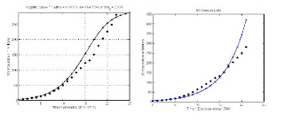
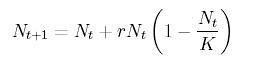
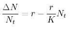

# Hafta 16

Erdal Safak

Malthus daha o çağda (200 yıl önce) nüfus ile besin maddelerinin
farklı dizinde çoğalmalarını dengeleyen savaş, salgın hastalıklar gibi
"doğal" nedenlerin, bir yandan uluslararası ilişkilerdeki gelişmeler,
bir yandan da tıbbi, biyolojik, kısaca teknolojik buluşlar sayesinde
etkinliğini yitirmesi sonucu insanlığın eninde sonunda "beslenme
krizi" ile karşı karşıya kalacağını iddia ediyordu. [..] Evet, dünya
nüfusu artıyordu ama teknolojik devrim sayesinde, tarımsal üretimde
dünya nüfusunu besleyecek düzey yakalanmıştı. Meğer hayalmiş.Yanlis 1)
Malthus bahsedilen felaket tahminini 18. yuzyilda yapti, arkasindan
19. ve 20. yuzyillarda onun bekledigi felaket ortaya cikmadi cunku
endustriyellesme verimliligi arttirarak besin uretimini
arttirdi. Demek ki teori cuvalladi. Eger "ama yeterince bekleyince
denklem dogru cikiyor" derseniz, buna bilimsel dangalaklik
denir. Durmus saat bile gunde iki kere dogru vakti gosterir. Evet
yeterince beklerseniz, bir sure icin herhangi bir denklem herhangi bir
konuyu kisa bir sure icin aciklayabilir - ama bunu tutarli, surekli ve
uzun vadeli yapabiliyor mu? Surekli kendimize sormamiz gereken soru
budur.2) Malthus'un nufus buyumesini gosteren matematiksel bir
denklemi de vardir, fakat cok ilginctir ki bizzat kendi one surdugu
yiyecek sIkIntisi, hastaliklar gibi kisitlayici sartlari bu denkleme
almamistir. Bu sartlarin denkleme eklenmesi icin 19. yuzyilda Pierre
Francois Verhulst'u beklememiz gerekecekti. Verhulst daha once bu
blog'da isledigimiz logistic fonksiyonu kesfeder ve nufus hesaplari bu
ek ile veriyi daha iyi aciklmaya baslar.Malthus tahminleri ile
logistic tahminleri yanyana plot edin, bir sure sonra Malthus'un
cuvallamaya basladigini, ama logistic fonksiyonun dogru tahmine devam
edecegini goreceksiniz (bkz alttaki plot'lar - soldaki logistic
denklem)Bunu bir not olarak dusmek istedik, Safak'in ana soylemi ile
ilgisi yok, fakat Malthus'un eksikleri ile bir ilgisi var.--Ozet
olarak: Nufus artisi kendi kendini besleyen bir dinamige sahiptir,
19.,20. yuzyillarda bu kendini besleme "endustriyellesme" uzerinden
olmustur, insanoglu yeni bir uretim sekli kesfetmistir ve kendini daha
iyi besleyebilmistir, simdi de bu biyoteknoloji, otomize tarim gibi
innovasyonlar uzerinde olacaktir. Genetik bazi kodlari degistirerek
kafaniz kadar domatese sahip olabilirsiniz.Bazi ornekler:

Capisc?

---

Taha Akyol

Tedbir almak zordur çünkü insanoğlu sırf “akılcı” bir yaratık olmadığı
için, çok defa yatağa düşmeden acı ilacı içmiyor.

Belki

Insanoglu ve onun bireysel istekleri, cikar pesinde kosturmasi bir
sistemin baz alabilecegi en kesin "durtu"'dur. Tekil bir insan bazen
hata yapabilir, elinde piyasa hakkinda "mukemmel bilgi" de olmayabilir
- fakat insan gruplari bir karar odagi olarak agirlikli olarak
rasyoneldir. Istatistikteki normal egriyi hatirlayin, ortadaki
kisimdan bahsediyoruz. Demokrasi ve kapitalizm bu sayede isliyor.

Bence temkinli yaklasilmasi gereken bir sey varsa, o da "daha fazla
regulasyon" gibi yapay olusumlardir. Kapitalizm'deki krizler her zaman
devlet piyasanin isine gerektiginden fazla burnunu soktugunda meydana
gelmistir, buna 1929'daki kriz de dahildir.

TA

KEMAL Derviş’in “Dünya Ekonomisinin Yeni Yapısı Üzerine Perspektifler”
konulu konuşmasını okudum. Derviş bir ekonomist olarak dünya çapında
saygın bir isim olduğu gibi, BM Kalkınma Programı Başkanı olarak da
son derece önemli bir otoritedir

Pek sanmiyorum

Ekonomist olarak soylenen kismen dogru, fakat vizyoner olarak Dervis
ABD'de orta seviyede bir beyindir. Daha once yapilan Davos
toplantilarin birinde kuresel ekonomi, fakirlik ele alindiginda ona
soz verildi, o da problem hakkinda "yapilmali, edilmeli, bu bedel
yuklenilmeli" turunden laflar etti... Bu sozlere kimseden katki,
elestiri gelmedi, kaale bile alinmadi! Bunun sebebini soyleyeyim: O
sozlerin icindeki "gizli zamir", yani yapilmali kelimesindeki aktor,
devlet, burokrasi gibi bir sey olacak, boyle laflari da artik o
asamalardan gecmis, onlari arkada birakmis olanlar duymak istemiyor!
Eger fakirlik, hastaliklar gibi konulari cozmek istiyorsaniz, uzerinde
optimizasyon yapabileceginiz bir durtu bulmaniz gerekir. Ne? Daha
bilinmiyor.

Fakat insanligin eskiye gore daha iyi durumda oldugunu kimse
yadsiyamaz. Rakamlara bakalim, fakirlik uzerinde eskiden (endustri
oncesi) kac kisi vardi, simdi kac kisi var [2]. Nufusumuz kacti, kac
oldu! Bu bile yeterli bir olcudur. Bu insanlar beslenememis, is
bulamamis olsa, dogurulmaz, sonraki nesli dogurmazdi! Kaliteye bakmak
istiyorsak, eger fakirlik uzerinde yasayan insanlarin sayisi arttiysa,
bu bir basaridir. Nokta. Bunun uzerine eklediginiz her sey, ek
basarilar olacaktir. Su anda basarisiz durumda degiliz, daha iyi olmak
istiyoruz ve bunu nasil yapacagimiza karar vermeye calisiyoruz.

Krizde olan bir sey varsa, o artik cokmeye baslayan endustriyel
sistemin kurumlaridir. Kitle egitim, kitle habercilik, cekirdek aile,
vs. Fakat birey cevresinde sekillenen serbest piyasa, innovasyon,
bilgi teknolojileri son gaz yola devam ediyorlar. 90'lardaki IT balonu
yapay bir sismeydi, hatta vaktinden once olmus bir kutlamaydi! Su anda
elimizde o gun oldugundan iki kat iyi teknolojiler var (burada o
balonun itici etkisinin de oldugunu soylemek gerekir) - balon gitmis
olabilir, ama kazanimlari know-how olarak hala bizde duruyor.

TA

Marx sosyolojiye sınıf analizleriyle önemli katkılarda bulunmuş [..]
bir filozof, fakat kötü bir ideolog ve kâhindi!

Dogru

---

Fehmi Koru

[..] İtirazı yapanlar bir veya iki münasebetsizden ibaret olsa belki
önemsemez geçebiliriz; ancak sporu ilgi alanı seçmiş neredeyse her
kalem, televizyonların hemen her spor yorumcusu, bir münasebet düşürüp
Hakan Şükür'ü yerlere vurmak için o saf temennisini dile dolamaktan
çekinmedi. Toplum ile medya arasında siyaset alanında her gün tanığı
olduğumuz 'değerler sistemi çelişkisi', öyle anlaşılıyor ki, aynıyla
sporumuz için de geçerli.

Dogru

Televizyon seyretmedigimiz [1] icin bilmiyoruz ama tarif edilen turden
sozler soyleniyorsa hakikaten yazik. Bazi insanlarin "takintilarindan"
artik kurtulmasi gerekiyor. "Mustemleke laikligi" hissiyatinin artik
vakti gecti.

[1] Ayrica tam anlamiyla "gazete okudumuguzu" soylemek te zor. Kose
yazarlarina ek olarak, laikci yobaz olmayan bazi gazetelerin
basliklarina, goze carpan tek tuk habere bakip, Google News, ya da
diger "birlestirici" kaynaklardan haber aliniyor daha cok. Kitle
haberciligin cokmeye basladigindan bahsetmistik, buyrun iste.

[2] Fakir insanlar, demokrasi sayesinde, sistemden hatiri sayilir
seviyede sosyal yardim koparmayi da basarmislardir (hatta Turkiye'de
sistemin verebileceginden fazla!) Bu da sistemin isleyisine dahildir -
sosyal yardimin optimal seviyesi suc oranini en az seviyede, ve kisiyi
merkeze bagimli hale getirmeyecek ve merkezin verebilecegi en fazla
orandir. Insanlari bagimliliktan kurtarmak ileride dijital egitim
uzerinden olabilir - sinif, tahta, hoca merkezli olmayan daginik ve
olceklenebilen bir egitim.

---

Hurriyet

ABD’de, "Kaos ve Kelebek Etkisi" teorisinin babası olarak gösterilen
Amerikalı bilim adamı Edward Lorenz hayata gözlerini yumdu. Lorenz’in
ünlü teorisinin temel önermeleri şunlar:

Düzen düzensizliği yaratır.

Eksik

Dogru kelime "deterministik sistemler kaos yaratabilir" olacakti.

H

Düzensizliğin içinde de düzen vardır.

Eksik

Dogrusu, kaotik sistemler bazen stabil bir faza girebilirler
sozudur. Ayrica, kaos strange attractor denen bolgelerde kendini
"tekrar edebilir". Bu tekrar duzenli olabilir. Ama anahtar kelime
olabilir.

---

H

Yeni düzende uzlaşma ve bağlılık, değişimin ardından çok kısa süreli
olarak kendini gösterir.

Ne?

Bunlar flu laflar... Tercume bile oldugundan supheliyim. Birileri yine kafasina gore takilmis.

---

H

Ulaşılan yeni düzen, kendiliğinden örgütlenen süreçle kestirilemez bir
yöne doğru gelişir.

Sacmalik

Kaos terosinde "baslangic sartlarina hassas baglilik" sozleri cok
onemlidir, yani "sensitive dependence on initial conditions". Bunu
anlamadan Kaos Teorisini anlamis sayilmazsiniz. Lutfen! Iki dakikada
Wikipedia'dan bakip tercume ederek bile bundan daha iyi bilgiler
edinebilirdiniz.

---

Gulay Gokturk

En katı ve dışlayıcı yaklaşımlar 'eğitimli' insanlardan geliyor; insan
haklarına ve demokrasiye en uzak tezler de yine onlar tarafından
savunuluyor. Seçimlerde en anti-demokratik siyasi tercihler de, sağ ve
sol totaliter örgütler de, darbecilere destek de yine ağırlıklı olarak
onlardan geliyor" diyordu Berat...

Dogru

Bu duruma en iyi aciklamayi Amerika'nin kurucularindan bilim adami
Benjamin Franklin vermistir. Ozdeyis soyledir:

"O iyi egitimli bir insan degil, cunku egitimli olmayan insanlara
dayanamiyor".

Demek ki bizim demokrat olmayan "egitimli" insanlarimiz aslinda "iyi
egitimli" degiller. Buna bakip aslinda "iyi ki daha fazla "egitilmis"
insanimiz yok" diye sevinmemiz lazim! Allahtan egitim, halkimizin
tumune ulasamamis! Kaldi ki kendini egitimli zannedenlerin karsisinda
artik egitimsiz insanlar yok. Sadece hayatindaki birkac secenegin
farkli oldugu insanlar var. Acaba ulkemizde egitim cocuklarimiza zalim
olmayi mi ogretiyor?

---

Taha Akyol

İnönü, genç cumhuriyeti “kurumlaştırma” ihtiyacını vurguluyor,
“devletin kalıcı, devlet başkanlarının farklı olabileceğini göstermek
için” kendi resmini paralara koydurduğunu anlatıyor.

Akla yatkin

"Para uzerinde kafa" polemigi hakikaten bir polemiken
ibaret... CHP'nin bu saldiri karsisinda sican gibi kivranmasini zevkle
seyretmem bir yana, ustte belirtilenler zihnimdeki Ismet "Gitti
Kismet" Inonu imajina uymakta... Yani, piyasa, uretim, ticaret,
vs. gibi konulardan pek anlamayan, ama yonetim, devlet gibi konularda
bazi icraatlari olmus, bazi seyleri "yapmaya ugrasmis" bir
sahsiyet,.. Inonu'yu kakalayip tarihimizdeki diger sahsiyetleri
"kurtarmaya" ve "sahiplenmeye" calisma cabasinda zaten taraf degiliz,
ama bunu iceren politik "maci" ilgiyle ve bazen gulerek
seyretmekteyiz.

Ayrica - polemigin de siyasette yeri vardir - secmene o konu hakkinda
bir sey soylemese de, saldiri ve muhatabi hakkinda bir seyler
soyler. Nasil karsilik veriyor? Ne kadar etkili? Clinton / Bush
baskanlik yarisi sirasinda, o zamanki baskan yardimcisi Dan Quayle'nin
"ben bizim kampanyanin (Bush tarafi) pitbull saldiri kopegi olacagim"
sozu ustune rakibi Bill Clinton, "hic suphem yok ki bu sozler
Amerika'daki tum yangin musluklarini korkudan titretmistir (kopekler o
musluklara iserler cunku)" cevabini vermisti. Bu pur bir polemiktir.

TA

Tarih üzerinden güncel siyaset yapılmamalıdır!

Yanlis

Yarinin planlanmasi gecmisi anlamayi gerektirir, siyaset de yarina
donuk bir enstruman olduguna gore, tarihin siyasette gundeme
gelmesinde hicbir mahsur yoktur.

Aclik tehlikesi ve kapitalizme gelirsek: Eger ortada bir arz sIkIsmasi
var ise, bunun caresi arzi arttirmaktir. Arzi arttirmak ise
verimliligin artmasi ya da yeni girisimler demektir, ki bunu ozel
tesebbusten baskasi gerceklestiremez. Sosyalizm "elde olani dagitma"
sistemidir, "olmayani ortaya cikarma" sistemi degildir. Kaldi ki elde
olani dagitmayi kapitalizm de pek guzel gerceklestirir.

Bu konuda suclanacak biri varsa bu, Irak uzerinden kuresel guc
oyunlari oynayip dunya stabilitesini bozan, petrol fiyatinin
artmasina, bilahere bunun yiyecek fiyatlarina yansimasina sebebiyet
veren, kuresel isinma hakkinda basit cozumlere yonelip yiyeceklerin
yakitlastirilmasina sebep olan ve boylece tum dengelerin icine eden
ABD sahinlerinden baskasi degildir.

---

Ali Bayramoglu

Bu darbe hamlesi savuşturulmalıdır. Ve bunun tek bir yolu var: İçinde
Anayasa Mahkemesi değişikliklerinin de olacağı sivil ve demokratik bir
anayasayla referanduma gitmek…

Iyi fikir

Ayrica An. Mahkemesi degisiklikleri, su anki uyeleri "tamamen
sifirlayan" bir sekilde yapilabilir - bir ek madde olarak ilk uyeleri
parlamento + Cumhurbaskani atar boylece Kemalizm'den buyuk olcude
arinmis yeni bir anayasa mahkemesine kavusabiliriz.

Bu yeni mahkeme atamalarinda meclisteki her partiye bir, ya da
meclisteki temsil oranina gore, uye atama hakki vermek iyi bir fikir
olabilir. Bunun sonucu olarak mesela Kurt asilli, milliyetci (ama
turbani tehlike olarak gormeyen) ve Kemalist (ama buyuk oranda degil)
yargiclarimiz da olabilir.

Parlamento'muzun gucunun kisitlanmasi anlamina gelen yargi darbesine
hicbir sekilde izin verilmemelidir. Daha onceki bir yazimizda
isyanlar, kargasa ve kaosun oldugu Kenya gibi ulkelerde parlamentonun
zayif olmasinin bu kargasada onemli bir faktor oldugunu
belirtmistik. Demek ki Turkiye karisiklik yasamak istemiyorsa,
parlamentonun gucunden katiyen taviz verilmemelidir.

---

Hadi Uluengin

Küba merakım henüz "cinnet yıllarım"a yelken açarken başladı. GİTTİM
ki, ayıp tercümesini size bırakıyorum, gümrükten çıkıldığı an "kamon
senyor, tüventi dolar, gud cob" diye üşüşen küçük kızcağızlardan
kendimi kurtardığımda, "sosyalist cennet" ne kelime, "sosyalist
kerhane"ye geldiğim kafama tamamen dank etti.

Dogru

Devletcilik, sosyalizm, yobaz Kemalizm, ve pek cok diger kollektif
"izm"'ler deger uretememeye (cunku uretimin temeli olan bireyi hicbir
zaman gerektigi kadar tesvik edemezler) bilahere halklarini ac
birakmaya mahkumdurlar. Ama ilginc olan bu tespit degildir - ilginc
olan, 21. yuzyilda hala bu ornekleri romantize etmeye calisanlarin
olabilmesidir. Belki de bunun sebebi psikolojik bir korkudur - deger
uretemeyenler, ve uretemeyeceklerini bilenler, uretebilenlerin
elindekine goz koymakta ve bunu mumkun kilacak mekanizmayi mesru hale
getirmeye ugrasmaktadirlar. "Birbirine yardim" kisvesi altinda devlet
merkezli gasp sisteminden baska bir sey olmayan sosyalizmi bu devirde
desteklemelerinin baska bir aciklamasi olamaz.

---

Mehmet Barlas

[..] AK Parti'lilerin sıra partilerinin kapatılmasına geldiği zaman AB
ipine sarıldığıni [..]

Eksik

Bakis acisi yanlis, bu yuzden final analiz eksik. Esas bakis acisi
soyle: Kapatma davasi yuzunden AB neyi kaybedecegini (demokrasiyi,
bilahere Turkiye uyeligini) anladi ve halk nedzinde dusmus imajini
yukseltmek icin yuksek profil bir Turkiye ziyareti planladi. Boylece
uzun suredir Merkel, Sarkozy yuzunden Turkiye'ye verilen "sirt
cevirmis" goruntusu duzeltilmeye ugrasildi. Final analizde AB'nin
Turkiye'ye ihtiyaci vardir ve son yasananlar Turkiye'yi tas devrine
geri dondurme ihtimali icerdigi icin AB tarafindan ciddiye alinmistir
ve Barroso ziyaretinin arka planinda bu yatmaktadir.

AKP halkin nabzini tutmakta cok ciddi caba gosteriyor - ve halkin
kuvvetle arkasinda olmadigi isleri takip etmekte enerji harcamiyorlar,
cunku sonucta tek kuvvet noktalari "o halk destegi"dir. Fi tarihinde
tezkerenin meclisten gecmemesinin sebebi de tezkerenin arkasinda halk
destegi olmamasi idi (Erdogan ve Gul ikilisi her ne kadar acikta
ABD'yi destekliyor goruntusu verselerde aslinda tezkereyi
desteklememislerdir -programlarinizda da zart zurt bu soruyu sormayin,
adam tabii ki "destekliyordum" diyecek, ABD iliskilerini iyi tutmak
icin-). Bu sebeple AB'nin profilinin dustugu sirada AKP strateji
olarak AB'nin "pesinden kosar" profili vermeyecekti.

Son zamanlarda olanlar hakkinda: Iiddianame baglaminda olanlari "kotu"
olarak niteleyemeyiz... Kemalist beyinsizler nihayet bir hamle
yaptilar ve aslinda stratejik olarak yanlis bir adim
attilar. Olabilecek her sey olur ama tum bunlarin sonunda olmasi en
muhtemel olanlar olur. Kaos teorisinde karisik bolgeler vardir ama
stabil bolgeler de mevcuttur ve bazi stabil noktalarin yeterince
yakinindaysaniz onlardan kacmaniz neredeyse imkansizdir (bu bolgeleri
plot ettiginizde de grafik sasirtici sekilde kara delige benzer
-burada iyi anlamda bir kara delik tabi ki-). Uzun vadede olacak "en
muhtemelin" de ne oldugunu hepimiz biliyoruz.

Turkiye'nin kultur kodlari ortadadir.

---

Mehmet Barlas

Veya Erdoğan'ın partisine oy veren tek çocuklu evli çiftler, "Üç çocuk
yapın" çağrısını duyunca hemen yatak odalarına mı koşacaklardır?

Hayir, ama ..

.. hesap olarak dogru bir rakamin telafuz edilmesinde hicbir mahsur
yok. Belki milyonda bir kisi o ucuncu cocugu yapacaktir, bu bile bu
rakamin telafuz edilmesi icin yeterlidir. Ayrica bu beyan simdiye
kadar "dogru" zannedilen nufus planlama mentalitesinin yanlis oldugunu
onu destekleyenlerin gozune sokarak ortaya koymaktadir, bu da iyi bir
seydir. Kim bilir - cocuk belki coban olur, belki Cumhurbaskani olur
(hatta ikisinin de oldugu bir ornegimiz vardir).

Neyse - cocuk yapma yasi sizden "gectiyse" gocunmaniza gerek yok... :)
Bu isi genclere birakin.

---

TUSIAD

"Türkiye'de ciddi bir muhalefet boşluğu yaşanıyor. Bu durum TÜSİAD'ın
söylemlerinin daha siyasi algılanmasına neden oluyor. Keşke daha
kuvvetli, daha yapıcı söylemleri olan bir ana muhalefet partisi
olsaydı."

Yanlis

Muhalefet eksikligi Turkiye'nin bir numarali problemi degildir. Esas
problem demokrasinin islemesine izin verilmemesi ve iktidarlara is
yaptirilmamasidir. Daha once modern Avrupa'nin degisik seyleri
denemeye acik olan kenarda kosede kalmis "catlaklar"'da gelisip
buyudugunu belirtmistik, yani bugunku Avrupa statukocu "yoz"
derebeyliklerden gelmemistir. Ve "deneme/yanilma/tekrar
deneme/basarma" dinamigi gunumuzde en iyi demokrasiler uzerinden
gerceklesiyorsa (cunku basari/basarisizlik kistasini sadece halk
belirleyebilir) bu surecin islemesine surekli comak sokulmaya
ugrasilmasi tum ulkeyi geri tutacaktir, ki tutmaktadir.

Eger TUSIAD iyi muhalefet istiyorsa, her endustriyel ulkede entegrator
elitin yapmasi gerekeni yapmali, ve o ikinci alternatifi
palazlandirmalidir. Stop crying like a little BITCH. Bu alternatif
belki "Sinanoglu Kemalizmi" olabilir, ya da "Ucuncu Yol" denen (bizim
ucuncu dalga ile -direk- alakasi yok [2]) Bill Clinton'un actigi yol
olabilir - tabii AKP basarili gordugu konulari hemen sahiplenmeye
ugrasacaktir.. yani etkili muhalefet zor.

Eger hakikaten dengeler ve kontroller sistemini kurmak istiyorsaniz,
Amerikan sistemine gitmeniz gerekir. Meclis ve hukumet ayri
sandiklardan cikacak - halka "denge" icin mecliste karsi partiyi
secebilme "sansi" verilecek... Burada onemli olan kavram "parti"
degil, her "erkin" farkli sandiktan gelmesi. Bundan sonra herhangi bir
erkin kompozisyonunun hangi partilerden olustugu artik o kadar onemli
degildir - halk o kompozisyonu farkli sekilde belirleyebilecegi gibi,
hukumetten daha ayrilan meclis daha da kuvvetlenir. Senatorler var
ise, bu insanlar daha uzun vadeli "elit" gorusu yansitabilirler (bkz
Ingiltere'de Lordlar Kamarasi, ABD'de Senato) [1].

Ama tum bunlar bir tarafa, mevcut sistem de isletilebilir. Kemalist
yobazlarin varligi sistemin islememesinde en buyuk problem.

---

Murat Belge

Ama bugün saygı duyulan, platonik bir 'saygı duymak'la kalmayıp
üzerinden iş görülebilen bir diyalog kanalı, demokratik değerler
kanalıdır. Uluslararası topluluk bu zeminde buluşur ve
konuşur. Buranın değerleri, ayrıca, 'Uganda demokratik değerleri',
'Paraguay demokratik değerleri' diye ayrışmaz. Uluslararası
değerler'dir bunlar. Türkiye'den birileri ABD veya AB ile bir diyaloğa
giriyor ve bir yerlere varabiliyorsa, bu dili konuşabildiği ölçüde bir
yere varıyor.

Baykal'ın 'Türkiye Cumhuriyeti'nin değerleri' dediği, aralarında
kendisinin de yer aldığı, bir yanından 301, bir yanından çeşitli
andıçlar sarkan, barut kokan 'değerler dünyası'nın bunlarla hiçbir
ilgisi yok. Baykal'ın da bir öğesi olarak içinde yer aldığı o kesim,
bu uluslararası dili öğrenmeyi ve bu uluslararası değerlere değer
vermeyi reddediyor. Onun için, ABD'nin veya AB'nin ciddiye aldığı,
önem verdiği bir parti (asıl onun şu anda temsil ettiği halk desteği)
ile bu kesim bir araya gelemiyor, konuşamıyor, barışamıyor. Türk'ün
Türk'ten başka dostu olmadığı gibi, bu kesimin de kendisinden başka
konuşup anlaşacağı bir kesim yok.

O kesim öyle de, AKP ve ileri gelen temsilcileri o uluslararası dili
gerekli bütün incelik ve nüanslarıyla konuşmayı biliyorlar mı? Bence,
hayır. Ama en azından konuşmaya, başka herkesten daha fazla
çalışıyorlar ve ötekilerden, bunu öğrenmemeye kararlı olanlardan, bu
noktada ayrılıyorlar. Geldikleri siyasi-ideolojik kökenin önlerine
koyabileceği ve koyduğu bütün engellere rağmen, dünya ile konuşup
anlaşmaya en açık olanlar onlar. 'Türkiye Cumhuriyeti değerleri' ile
barışık olan Baykal, üyesi olduğu Sosyalist Enternasyonel'de kaç
kişiyle konuşup anlaşabiliyor?

Dogru

Daha fazla ekleyecek bir sey yok.

[1] Tabi "baskanlik sistemi" deyince bazi "sosyalist" temelli insanlar
(mesela Dr. Zafer Uskul) hemen "saltanat sistemi" diye yirtiniyor,
cunku her ne kadar demokrat olmayi basarmislarsa da (ki bu cok onemli
bir gelisme) devletci bir temelden geliyorlar ve her yerde bir
"teklik" arama yonunde meyilleri var. "Binlerce aktorun etkilesiminden
ortaya cikan ortak aklin yonu ve kendi icinde istikrari, guvencesi,
oto-kontrolu" kavrami hala bu insanlar icin anlasilmasi zor
kavramlar. Zafer Uskul'u suradaki yazida yeterince tokatladik
zannediyorum, daha fazlasina gerek yok. Ama yeni mecliste kendisine
bir ses verilmis o sebeple parti icinde Burhan Kuzu'ya (bu konuda) bir
karsi denge noktasi olmasi sebebiyle erkler dengesi sistemine
gidilmesinde fazla bir ihtimal gozukmemektedir. Goruldugu gibi,
demokratik sistemin karar mekanizmasina saygi bu demek - eger parti
ici, disi secim ortaya bu kompozisyonu getirdiyse, onun izin
verdikleri olacaktir. Izin vermedikleri olmayacaktir.

[2] Muhakkak 1950 sonrasi ABD'de, daha sonrasi dunyada olan tum siyasi
degisimlerde Ucuncu Dalganin fitilleyici ve katalize edici etkisi
var. Sovyetleri yikan yeni teknoloji temelli bir ulkeydi [4], geri
birakan ise Sovyetlerin zaten kendisi geri kalmis sanayilesme
ideolojisinin bir de en yozlasmis/merkeziyetci versiyonu olan
sosyalizm'de tikanip kalmis olmalariydi. Akabinde "kendine sol diyen
seyin" hayatta kalmasi icin yeni bir "yol" bulmasi kacinilmaz
olacakti, ki buna Ucuncu Yol denmistir (ne sag, sol, ucuncu
yol). 90'lari hatirlayanlar Bill Clinton'un "yeni ekonomi" kavramina
ne kadar cok vurgu yaptigini hatirlayacaktir [3]. Ucuncu yol ve dalga
arasindaki organik baglanti buradan ileri gelmektedir.

[3] Burada Turkiye'ye ilginc bir paralel var: Clinton bu (ucuncu)
yolda ilerlemeye basladiginda parti icindeki statukoculardan cetin bir
tepki aldi. Yenilik icin ortaya koyduklarini "secim kazanmak icin
soyluyor bunlari" diyerek kotuleyen, onu bu sekilde sucladigini
zanneden statukocu yobaz Demokratlar bile cikmisti! Clinton
hatirasinda ciddi bir alayla (sarcasm) durumu soyle aktarir: "Demek ki
secim kazanmak artik biz Demokratlarin yapmamasi gereken bir
seydi". CHP'ye ne kadar benziyorlarmis degil mi? :)

[4] Hatta yeni teknolojilerin Amerikan askeri doktrinine
yansimalarinda etkili olanlar, Toffler ciftinin bizzat
kendileridir. Daha fazla bilgi icin sag kolondaki "General Donn
Starry" baglantisina bakabilirsiniz.

---

Milliyet

Türkiye İstatistik Kurumu (TÜİK) 31 Aralık 2007 tarihi itibarıyla
adrese dayalı nüfus kayıt sistemiyle Türkiye nüfusunu 70 milyon 586
bin 256 olarak saptarken, [..] gibi uluslararası kuruluşlar içinde bu
rakama en yakın tahmin Amerikan Sayım Bürosu’ndan (US Census Bureau)
geldi. [..] Başta Amerikan Haber Alma Teşkilatı (CIA) olmak üzere çok
sayıda kuruluşun rakamlarını kullandığı Amerikan Nüfus Bürosu, 2007
temmuz ayı itibarıyla verdiği 71 milyon 158 bin 647’lik nüfus
rakamıyla, Türkiye nüfusunu en iyi tahmin eden kuruluş oldu.Zor bir
sey degilBahsedilen hesap, differansiyel matematikte yapilan en basit
hesaplardan biridir. Temeli lojistik denklem denen bir modele gider -
bu modelin ortaya cikarilmasinda cok guzel bir yaraticilik ve zeka
var, ona ileride belki geliriz, ama denklemi biliyorsaniz, ki nufus
hesabinda lojistik denklem kullanildigini akademide herkes bilir,
tarihi (historical) veriye bakarak ileri dogru tahmin (projection)
yapmak cok kolaydir. Once lojistik denkleme bakalim:Bu denklemde sabit
degerler r ve K degerleridir, Nt ise donemlik nufus degerleri. Nt
degerlerini veriden gelecek, sabit degerleri tarihi veriyi isleyerek
bizim cikartmamiz gerekiyor. Burada hemen bir matematiksel takla atmak
lazim.Eger Nt'yi sol tarafa alip, iki tarafi Nt ile bolersek elimize
dogrusal denkleme benzeyen bir sey gelecek.Yani denklem y = mx + c
denklemine benzeyecek, c bizim r, m yani egim (slope) bizim -r/K
oluyor. Guzel.Simdi sabitleri veriden cikarmaya gelelim. Ustteki gibi
bir denklem kullanarak veriyi ona uydurup (fitting) m ve c degerlerini
bulmanin yoluna lineer cebirde "regresyon" denir. En baz matematik
paketinde bile bunu yapan bir fonksiyonu bulabilirsiniz. Biz Python
Numpy diye bir paketteki polyfit adli fonksiyonu kullanacagiz. Bu
arada hemen Turkiye'nin nufus verisini ekte verelim (TUIK'ten
indirdik)1940 178211945 187901950 209471955 240651960 281601965
318381970 354641975 395851980 441051985 493991990 541301995 588642000
636272005 68143Bu veriyi nufus.txt diye bir dosyaya kaydedin.

Simdi Python bilgisayar programini verelim:from
pylab import *pdata = loadtxt('tr.txt')pdiff = diff(pdata[:,
1])pratios = pdiff / pdata[0:-1, 1]p = polyfit(pdata[0:-1, 1],
pratios, 1)r = p[1]K = -r/p[0]prev = pdata[-1,1] # en sonuncu veri
noktasini alprevy = pdata[-1,0]for i in arange(4): curr = prev + (r *
prev)*(1-(prev/K)) curry = prevy + 5 print(curry, curr) prevy=curry
prev=curr

Bu kadar!Bu programi islettiginizde elinize gelecek sonuc 2005 yili
icin 69,563,000 degeridir.Yukaridaki kodda ekrana basmak icin
kullanilan kodlari gecerseniz, gercek hesabi yapan bolumler 7-8
satirdan ibarettir. Yani demek istedigimiz gazeteler bilimsel
konularda allama pullama yapmadan once bir biline danisirlarsa,
bilgilendirici ozelliklerini arttirabilirler, onemsiz seyleri
insanlarin gozunde buyutmekten de kurtulurlar. Ustteki hesap herhangi
bir universitede matematik ogreten bir hocanin uykusunda
cevaplayabilmesi gereken bir sorudur.Tayyip ErdoganBazıları rahatsız
oluyor, Başbakan 3 çocuk yapın dedi diye. Şu andaki nüfus artış
oranıyla devam edersek, 2037'de nüfusunuz yaşlı nüfus haline
gelecektir. [..] En az 3 çocuk yapın.Hala dogruDaha once belirttigimiz
gibi, bahsedilen rakam dogru. Saglikli nufus buyumesi icin gelismis
ulkelerde aile basina 2.1 cocuk, gelismekte olan ulkelerde 2.5 ile 3.3
cocuk arasi gerekir (gelismekte olan ulkelerde daha fazla olum oldugu
icin). Bu rakamlari, mesela 2.5'i, "genel (blanket)" beyanlar yapmak
zorunda olan basbakan gibi biri 3'e dogru "yukari"
yuvarlayabilir. Beyan, matematiksel olarak dogrudur.

---

Milliyet

Web browser'ı Firefox'un ünlü logosunun arkasındaki sır çözüldü. 17
Aralık 2002 tarihinde Hubble Uzay Teleskopu tarafından çekilen bir
uzay fotoğrafı akıllara Firefox'un logosunu getirdi.

Yanlis

Kimin aklina getiriyor? Hangi kaynaga gore bunu akla getiriyor?
Firefox logosunun ortaya cikisi hakkinda gercekleri o logoyu yaratanin
kendi agzindan ifadelerle surada bulabilirsiniz. Zaten logoya biraz
yakindan baksaniz, onun "dunyayi sarmalayan ates (fire) kuyruklu bir
tilki (fox)" resmi oldugunu gorebilirsiniz. Biraraya koyalim:
Fire..fox. Capisci? Bakin solda kafasi var, sarmaladigi "seyin" rengi
mavi, bir kure (yani dunya), uzerinde kitalar falan gozukuyor
yahu!Sanatcinin bu imaji yaratirken esinlendigi "esas goruntu"
alttadir. Tek bir Google aramasi ile bu bilgilere 2 dakikada
ulasabilirlerdi - "firefox logo icon" kelimeleri yeterli. Geri gelen
sonuclarda (hits) en ustteki bilgiyi veriyor.Gazetelerimiz bu tur
haberleri yayinlamadan once bir bilene danisirsa insanlara yanlis
bilgi vermekten kurtulacaklardir. Lutfen, biraz kafa ve parmak
calistiralim.

---

Mehmet Barlas

Bizim petrolümüz veya doğal gazımız yok. Bizim bu
coğrafyadaki en büyük doğal zenginliğimiz "güvenilir ve istikrarlı
demokrasimiz"dir.

Eksik

Sn. Barlas bu soyleminde Polonya basbakani Donald Tusk'tan
"esinlenmis" (simdi gencler buna "Indra Gandi yapmak" diyor galiba
:)). Fakat Polonya basbakaninin kendi ulkesi icin soylediklerinin
Turkiye icin birebir gecerli oldugunu, kelimesi kelimesine soylemek
zor. Soylesiyi okursaniz basbakan "bizde turizm yok, hi-tech yok"
diyor. Bunlardan birincisi bizde var, ikincisi de kesinlikle
ulasabilecegimiz bir hedeftir. Ozgurluk lazim degil demiyoruz, dogal
kaynak kelimesi hafiften acaiptir... Bizce, ozgurluge bilgi
ekonomisinin "vazgecilmez/tetikleyici ogesi/arka plani" olarak bakmak
daha dogru.. Bilgi ekonomisinde gercek hammadde, dogal kaynak,
bilginin ta kendisidir. O hammaddeye erisim, isleyebilme,
vs. baglaminda ozgurluklerden bahsedilebilir.Ve bu baglamda
ozgurlukler kesinlikle buyuk onem tasirlar.

---

Serdar Turgut

İyi bir burjuva olabilmenin şartı eldeki para miktarı
değildir. Burjuva olabilmek o kadar kolay değildir. Burjuva adını hak
edebilmek kültürel ideolojik bir gelişme, değişim gerektiren bir
süreçtir.

Yanlis

Bu burjuva laflarini geciniz (Fransiz'lar bu kelimeyi kullanmayi cok
sever). Gelecegin hakim sinifi, cognetariat denen bilgi iscileridir -
ve bu insanlar zaten gundelik islerinde analitik melekeleri
kullandiklari icin dunyaya bakislari dogma kabul etmeyen, olculu ve
demokratiktir. "Kulturlu" kelimesi de anlamini yitirmistir cunku artik
"tek kultur" yoktur, herkes icin degisik olabilecek "kultur alanlari"
vardir. Eski jargonda cogunlukla kulturden kasdedilen Ronesans sonrasi
Avrupa sanati, yerini cesitlenen insanlarin hobileri, zevkleri
etrafinda sekillenen alanlara dogru birakmaktadir [1]

---

ST

Bu sorunun neden komik olarak algılanabileceğini anlamak mümkün
değil. Halbuki İshak Alaton’un sorusu detaylandırılmasa da
kapitalizmin ciddi bir analizini içeriyor.

Yanlis

Soru ciddi bir analiz icermiyor. Ayrica soru komik, cunku sorunun (!)
yoneltildigi, G.E.'yi zaten yeni kapitalizm yolunda en cok ilerletmis
bir kisi. Welch Hindistan'a IT outsourcing'i yapan ilk
yoneticilerden. Ilerisi icin IT ve biyoteknolojinin kesisiminden iyi
para kazanilabileceginden bahsetmekte... Beyaz yakali toplumda cok
onemli olan "kisisel gelisimi" on plana almakta. Sunu acikca soylemek
gerekiyor: Alaton'un sorunun sorulma seklinin altinda yatan, "farkli
olmaya calisan zipir cocuk" mentalitesinden baska bir sey
degil. Toplantidan sonra "vaaay ulan Welch'e nasil sordu ama?"
havasinda, "yabanciya nanik yapti" turundeki Ortadogu ezikliliginin
tatmin cabasi.

ST

Marx, bu bölümde, normal sürecinde işlemekte olan kapitalist üretim
sürecinin hiçbir dışsal etki bile olmadan nasıl krizler
üretebileceğini anlatmıştır.

Ve cuvallamistir

Marx'in referans aldigi endustriyel kapitalizm'dir ve referans aldigi
kaynaklarin yanlisligi, onu da yanlis analizlere itmistir. Teori
yuzyillarca bu sebeple gelecegi tahmin edemedi, hala da
edemiyor. Turgut, Erdal Safak'in dustugu ayni hataya
dusuyor. "Yeterince beklerseniz teori birkac gun dogru seyi
gosteriyor!". Evet! Demek ki teori dogru! :) Ben de diyorum ki
"gelecekte yagmur yagmasi kesin!". Hakli miyim? Bekleyin gorun!

ST

İshak Alaton Bey, gayet tabii ki işçi sınıfı bu sistemi yıksın filan
demiyor, sadece krizin anlamını algılamak için Marx’ı okuyun diyor

Tavuk cevirme

Alaton serbest piyasa ekonomisini sorgulamis, yerine de devlet
merkezli bir gasp mekanizmasi olan Marx'inkini tavsiye etmis. Bunun ne
anlama geldigi gayet acik ortada. Turgut, kendi kafasindan gecenleri
Alaton'a yamamaya ugrasiyor ve kelime oyunu yapiyor. Satir aralarini
okumaya ugrasiyor. Bazen bir puro sadece bir puro demektir.

---

Serdar Turgut

Bu insan tipinin, hiçbir zaman doymayan, hep daha fazlasını talep
eden, tamemen egoistçe tüketmek üstüne kurulu bu yaşamları, kendisine
benzeyenlerle bir araya gelince hem kendilerini hem de hayatı
tükettiler.

Asiri genelleme

Madem durum boyle, o zaman niye ABD'de yardim amacli (charity) ve kar
pesinde olmayan (non-profit) kuruluslarda calisan milyonlarca insan
var?

---

ST

Merkezde hep daha fazla, daha da fazla tüketmeye koşullanmış insanlar,
kağıt üzerindeki oyunlardan oluşan kazançlarla kendilerine bir yaşam
kurdular.

Asiri genelleme

Bu "havadan kazanilan para" dusturu tipik bir sosyalist
bakisidir. Acaba Google da parayi boyle havadan kazanan bir sirket mi?
Marx kafasini kullanarak para kazananlari her zaman hakir gormustu,
onlari "verimsiz insanlar" diye asagilamisti. Fakat 1950 sonrasi
ABD'de daha sonra tum gelismis ekonomilerde bu onemsiz sayilan isciler
kapitalizme yeni bir enerji verdiler ve Marx'a tokadi caktilar. Bu
ekonomide evet spekulatorler de vardir, ve bu insanlarin bazilari
kumar oynar gibi oynamaktadir fakat artik bu is ciddi teknik analiz ve
bugunu yorumlama gibi analitik yetenekler gerektirmektedir. Bu alanda
matematiksel modellerle ugrasmis (ve halen ugrasan) biri olarak
soyluyorum, kullanilan teknikler, sismolojide deprem tahmini ya da
meteorolojide hava tahmini yapmak icin kullanilan tekniklerden katiyen
daha asagi degildir. Bazi metotlar oyle saglamdir ki, mesela alip "ses
tanima (speech processing)" icin direk, birebir olarak
kullanilabilirsiniz (ki onu da yaptik).

---

ST

Bir gün bu eve alıcı olarak 20’li yaşlarda, suratındaki sivilceler
henüz patlamamış bir ‘nerd’ gelip, parayı bastırıverdi. O nerd de
parayı çok kolay kazanmış bir ‘hedge fund’cıydı

Asiri genelleme

Turgut o sivilceli cocugun o parayi hangi teknikleri kullanarak
kazandigini bilmiyor. Yine tipik bir sosyalist bilgisizligi ve
anlamadigi sisteme "supheci" bir bakis.. Oyle cocuklar taniyorum
Sn. Turgut valla bir bilgisayar programi yaziverir - mal gibi
bakakalirsiniz.

---

ST

Bir başka çevre ülkede yine fiktif [hayali demek istiyor] yoldan
paralar kazanan bazı genç adamlar, gece çıktıkları son derece lüks
restoranda bir şişe şaraba binlerce doları hiç düşünmeden verebildiler

Ne olmus?

Luks tuketimin de bir ekonomide yeri vardir. Hic unutmam, boyle bir
yerin kapisinda taksiye bindigimde taksiciyle sohbetimizde adam
"zengin mengin geliyor buraya, gelsin ne olmus? iste onun sayesinde
biz de para kazaniyoruz burada" yorumunu isitmistim. Sokaktaki insan
cebine bakar ve parayi hangi ortamda kazandigini da iyi
bilmektedir. Ayagi yere basmayan (ve hicbir zaman basmayacak olan)
teoriler ile dunyayi ve ulkenizi anlayamazsiniz. Asagiladiginiz finans
sektorunun arkasinda milyarlarca dolarlik IT yatirimi ve know-how
yatiyor. Istanbul niye finans merkezi olmak icin yirtiniyor acaba?

* Sonra bir gün bakıldı, dünyanın iklimi değişmeye başlamış. Aslında sınırsız olmayan kaynaklar sınırsızmışçasına yenilip bitirildi.

Dogru ama..

.. burada suclu eski usul endustriyellesmedir, kapitalizm degildir. Ayrica ekonomik krizler, savaslar her zaman devletci ya da "karma ekonomi" on plana ciktigi zamanlarda olmustur. Bu zamanlar kapitalizm'in arka planda kaldigi zamanlardir. Ve tipik olarak suc kapitalizm'e atilmistir [2].

---

ST

Bunu bildiğimden New York’ta geçen hafta etrafı izlerken kendimi
birden Pompei’nin son günlerini izliyormuş gibi hissettim.

Kiyametsevici

Turkiye'de bir kisim insanda bu ozellik cok goruluyor. Sistem cokecek,
her sey bitecek, falan.. Bu hissiyatin arkasinda birkac faktor
yatiyor:

1) Bugunu anlayamadigi icin anlayamadigi seyin cokmesi icin gudulen
gizli bir istek

2) "Aci arkadas ister (misery needs friends)" hissiyatinin
Turkiyelesmis hali. Insanlarimiz sosyallesmeyi cok seviyor, bazilari
da bunun icin ortaya yapay bir "aci" cikartarak bunu "sosyallesme
araci" olarak kullaniyorlar. Bu tip insanlarin surekli saglik
problemlerinden bahsetmesi de benzer hissiyatla alakali .

---

ST

Maalesef öyle görülüyor ki; kapitalizmin değil ama kapitalizmin bir
evresinin sonuna gelindi.

Dogru

Nihayet. Eski usul endustriyellesmenin kapitalizm'i bitiyor. Yerine
cevreye duyarli, daha az "sinirli dogal kaynaga" dayanan, daha fazla
bilgiye dayali, daha cok insana yardim edebilecek (egitim, verimli
uretim uzerinden) bir kapitalizm geliyor. Bu sistem daha az merkeze
dayali, daha fazla "network'u baz alan" bir sistem olacaktir, ki
aslinda kapitalizmin ruhu gayri-merkezidir. Tamamen nasil olacagini
bilemiyoruz, fakat bu sistem buyuk bir ihtimalle ABD'den cikacak. Yani
Turgut'un Pompei dedigi sehrin oldugu ulkeden.

---

Hadi Uluengin

OYSA, söz konusu "modernite"nin önemli zaaflar içerdiğinin de farkındayım.

Dogru

Modernite endustriyellesme demektir ve dogru, bu ideoloji zaaflar icerir. Hatta biz daha ileri gidecegiz: 21. yuzyil itibariyle modernite gericiliktir.

HU

"Rasyonel mantıkçılık" yaftası altında ipin uçu kaçırıldığı takdirde,
işin, yukarıdaki "felsefi insaniyetçilik"in tam zıddı olan kanlı
totalitarizme gittiğini ve gideceğini biliyorum.

Eksik

Rasyonel dusunce, mantik ile yanlisa gitmezsiniz - ama eger onkabul
(apriori) bilgileriniz yanlissa, en dogru mantiksal zincirle bile
yanlisa erisirsiniz. Herseyi de bilemeyebilirsiniz, bu normaldir,
onemli olan "ne bilmediginizi bilmektir" ki bu da rasyonel dusuncenin
bir parcasidir.

Totaliterlik mi dediniz? Bu yemegi pisirmenin kolay yolu sudur: Darwin
teorisini amaci disinda kullanirsaniz, sosyalizm gibi b.ktan bir
ideolojiye azicik mistisizm katarsaniz, endustriyellesmis bir ulkede
fasizmi elde edersiniz.

HU

Nitekim de, Fransız Devrimi giyotininden [..], böylesine "dejenere" ve
"sapkın" örnekler göz çıkartıyor. Bunları kim inkár edebilir?

Ne de olsa Fransiz

---

HU

Başka bir deyişle, hálen hüküm süren "akıldışılık modası", eyvah ki
eyvah, modern akılcılığının o aklı bazen peynir ekmekle yemek
gafletine düşmüş olmasından yararlanıyor.

Dogru

Postmodernizm sanayi ideoloji sonrasinin seceneklerinden
biridir. Bilim karsitidir bu sebeple takip edilmesi cok
sakincalidir. Kaldi ki tek secenek degildir.

HU

Diğer yandan ise, dün değindiğim "dini muhafazakárlaşma" da dahil,
rasyonaliteyi dünya sathında reddeden ve esas itibariyle yeni tür bir
"kadercilik" olan şimdiki postmodern hezeyanlara karşı, özgür insanı
ve onun mantıki aklını savunmak zorunluluğu dayatmaktadır

Dogru

[1] Mesela sahsimiz icin bilim kurgu filmleri, dizileri boyle bir "kulturel" alandir, bu alandaki fikriyat, sanat seviyesi katiyen diger sanatlardan daha asagi degildir. Tek bir Firefly dizisi hakkinda sayfalarca analiz, yorum yapmak mumkundur (birgun yapariz belki), Star Trek hakkinda artik doktora tezleri yazilmaktadir. Yani tek kultur, ve kulturlu olmak laflari bitmistir. Kendine has ilgi alanlari olmak gundemdedir.

[2] Ayn Rand, Capitalism, The Unknown Ideal

---

Beyaz Insanlar Neleri Sever?

Gunlerdir bu blog'u okuyup guluyorum.... Beyaz Insanlar Neleri Sever
adli blog'da ABD'de beyazlar ti'ye aliniyor - muhakkak tum
kategorizasyonlar gibi bunun da eksik oldugu yerler var, aslinda ti'ye
alinanlar genelde "teknik" ve "kafa gerektiren" islerde ugrasmayan,
farkli kulturlerle hasir nesir olmamis, Avrupa'yi bir sey zanneden
[1], derinligi olmayan hafiften "odun" beyaz tipler. Ama bazi noktalar
cogu kiside kismen mevcut olabiliyor.Beyazlarin sevdigi seyler her
blog post'unda yeni bir kalem olarak anlatiliyor. Mesela #1 no'lu
kalem"Kahve", #74 no'lu post, "Oscar Partileri", Oscar partisi derken
Oscar odullerinin verilirken ona paralel bir ev partisi ya da baska
bir yerde yapilan bir partiden bahsediliyor. Alttaki bu post'tan
kismen bir tercume:"Bir beyaz adamin guvenini kazanmak icin en uygun
yer bir Oscar partisidir. Hatta bu partilerden birine davet edilmis
olmak sizin "klube girmek" icin iyi bir firsatinizdir. Bu partilerde
kullandiginiz kelimeler cok onemlidir: Hic bir zaman "movie"
demeyeceksiniz, "film" diyeceksiniz. Hangi odullerin "Best" kelimesini
icerdigi, hangi odullerin "Outstanding Achievement" kelimesini
icerdigini bilmeniz gerekir, mesela "umarim Atonement adli film "Best
Art Direction" odulunu kazanir" derseniz, bir dahaki seneye partiye
davet edilmemeniz garanti olur.

Bu partilerde giysi cok onemlidir. Ya cok sasa'li takim elbise/gecelik
giyin, ya da "Best Picture" odulune aday gosterilmis filmlerden birine
gore "tematik" giyinin. Yani 2008 Oscar partisine giderken thirt'unuz
icine bir yastik koyup hamile bir teenager'i hatirlatarak (Juno adli
filme atif yaparak) gidebilirsiniz. [..]Fakat tum bu hazirliklar eger
Oscar partisinin en kritik aninda dogru davranmazsaniz suya duser. Bu
an, Best Foreign Film (en iyi yabanci filmler) kategorisindeki
"adaylarin" aciklandigi andir. O anda beyaz insanlardan biri mutlaka
kizar, ve hic kimsenin duymadigi bir film ismi soyleyerek o filme
haksizlik yapildigini soyler. Bu soylenince kafanizi sallayin ve ona
katilin. "Vakit bulursam o filmi seyretmek isterim ben de"
diyebilirsiniz, filmi seyretmis ve can sıkıcı oldugunu dusunuyor
olsaniz da.. "---Komedi.. Blog'u hala daha bitiremedik, simdiye
bakilanlar arasinda #90 Dinner Parties, #89 St. Patrick’s Day, #87
Outdoor Performance Clothes, #84 T-Shirts, #83 Bad Memories of High
School ilginc olanlardan sayilabilir.Bir zencinin baskanlik sansinin
oldugu gunlerde, beyaz kulturunu kritik edici bir blog zamanin ruhuna
uygun olmali..

Isin komik tarafi blog'un yazari Christian Lander'in kendisi de bir
beyaz (ben de blog baglantisini beyaz bir arkadastan aldim).Iyi
eglenceler,---[1] Bu sasirtici gelebilir, cunku Amerika kurulus
itibariyle Avrupa'dan tamamen farkli bir felsefe tasir. Fakat daha
once pek cok kez bahsettigimiz ucuncu dalga'nin beraberinde getirdigi
karisiklik, arayis, bazi insanlari Avrupasevicik gibi bir garabet uc
noktaya itmistir.

---

TESEV - Yargida Algi ve Zihniyet Kaliplari

Hâkim ve savcılar arasında yargılama faaliyeti sırasında adalet ile
devletin çıkarı veya demokrasi ile devletin güvenligi arasında bir
karsıtlık çıkabilecegi ve bu durumda devletin çıkarlarının korunması
gerektigi kanısının yaygın oldugunu gördük. Görüsme yapılan hâkim ve
savcıların bu kanılarını yansıtan su ifadelerini, özellikle dikkat
çekici bulduk:

“Ben devletçi hukukçuyum.”

“Önce devlet gelir.”

“Bir kere biz devletçi bir ekolden geliyoruz.”

“Her zaman devlet ön plana çıkıyor gibi geliyor.”

“Devlet olmazsa hukuk olmaz, biz de olmayız.”

“Yani mutlaka tabi hepimiz devletimizi seviyoruz, devletimizin güvenligi konusunda azami özeni, dikkati göstermek durumundayız.”

“Diyelim devleti korumaya çalısırken adil olmayabilirsin, adaletten sapabilirsin. Veya adaleti yerine getiriyorum diye devlete zarar verebilirsiniz veya devleti koruyorum diye adalete zarar verebilirsiniz. Mümkündür.”

“Simdi devlet olmazsa demokrasi olmaz. Tabii, Cumhuriyet Savcısıyım, yani bu nasıl, Cumhuriyeti denetlersiniz devleti korumak geregi … Bu gibi durumlarda devlet mi öncelikli demokrasi mi önemli, yani çok fazla karsılastıgımız bir durum olmadı simdiye kadar. Ancak tabii ben Cumhuriyet Savcısı olarak devleti ve rejimi korumam gerek. Ben rejimin savcısıyım. Buna karsı olan bir seyde ben demokrasiyi, demokrasi dediniz, göz ardı ederim. Yani siz benim devletime, milletime saldırırsanız, bu olmaz.”

“Benim ülkem söz konusu oldugunda hukuk mukuk dinlemem.”

“Devletim olmadıktan sonra benim bireysel özgürlügüm hiçbir ise yaramaz.”

“Yargılama faaliyetinin amacı, olmazsa olmazı nedir”, “hukuk öncelikli olarak hangi degeri korumalıdır” gibi sorulara aldıgımız yanıtlardan biri ise su sekildeydi : “insan hakları biraz abartılıyor”

Bu yaygın kanının dısında kalan ve görüsmeciler arasında azınlıgı
olusturan hâkim ve savcıların yaklasımları da su ifadelerde dile
geldi:

“Devlet kutsal kabul edilmemeli.”

“Insana gereken degerin verilmesi, hakkının korunması, devlet tarafından korunması, insanımızın hakkını korumadıgımız sürece devlet olmaz ki devletin hakkını koruyalım.”

“Devlet adına demokrasinin çignenmesine karsıyım.”

“Devletin nesini koruyacaksınız? Devletin önce yurttasını koruyacaksınız.”

---
