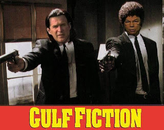

# Hafta 20

Hadi Uluengin

Ve bütün irrasyonel korkularda olduğu gibi burada da, çok vahim ve çok
travmatik boyuttaki bu kaygı ve endişelerin esas nedenini o "öteki"ni
bilmemek eksikliği oluşturuyor.

Dogru

Bu bilmemenin sebebi ne? Aslinda sebep zannedilenden daha vahim bir
merkezde: Ayn Rand bu tur "bilmeyen" ve daha kotusu "bilmeye direnen"
insanlara bilgisel/kavramsal dusunemeyenler (anti-conceptual thinkers)
diyor, yani bilgi sembollerini kullanarak dusunemeyenler... Bu
insanlar icin her sey, dunya hakkindaki her bilgi onceden verilidir -
kirintilari birlestirerek yeni kavramlara erismek onlar icin en agir
iskenceden daha beterdir. Bu insanlar hayatta iki seyden veremden
korkar gibi korkar: Etik ve epistemoloji.

Cunku etik, onu takip eden kisi belli temel "kavramlari" baz alarak
ozeldeki her durum icin bir durus sergilemelesini gerektirir,
epistemoloji ise bilginin nasil bilindigini arastirir, deser, irdeler
(bilgi hakkinda bilgi -iki kat dehset!-). Algisal beyin, etik
kurallarini takip edecegine olmeyi tercih eder, cunku o, bilgi
sembollerinin degil, icinde oldugu grubun ne yaptigini takip etmek
meyilindedir, zaten fazla dusunmekten kurtulmak icin o grubun icine
siginmistir!

Her turlu suc orgutu, sosyalizm, feodal aile yapilari, fasizm ve tum
kollektif ideolojiler bu tur insanlarin varligindan beslenir.

Ek olarak: Sn. Uluengin'in arada sirada pisirdigi "dindar olmayanlarin
korkularinin hakliligi" durumu da yukarida yine kendi belirttigi
yanilsama ile birebir alakali. Kendisi hala bu baglantiyi kurmamis,
fakat zannediyorum problem, zihninde bir bahar temizligi yapma
ihtiyaci.. Bazen eskiden kalan kalinti bilgiler irdelenmeden etrafta
suruklenmeye devam ederler...

---

Taha Akyol

Sosyalizmin ahlaka değil bilime dayanmasına öncelik verdi. [..]. Bunu,
determinist bir anlayışla, "bilim"in gereği gibi görüyordu.

Dogru

Ve keske bunu yapmasaydi. Marks'in "bilim" ile "sosyalizm"'i bu kadar
yakin bir sekilde, yanyana kullanmis olmasi, yillarca insanlarin
beyninde bilim kelimesini kirli bir kelime haline
getirdi. Teknolojinin insanlarin (objektif) hayatinda en buyuk
donusturuculerden / mumkun kilicilardan (enabler) biri oldugunu
soylemek bu sebeple Marks'in dusuncelerinin cogunlukla yikildigi bir
cagda zorlasiyor. Fakat elmalari armutlardan ayirmak lazim. Marks'in
kullandigi yanlis bilimdir. Daha dogru bilimi kullanirsaniz, dogru
sonuclara erisebilirsiniz. Evrimsel Oyun Teorisi matematigini
kullanarak gecmis dinlerin, adetlerin ortaya cikardigi "ahlaki" bile
turetebilirsiniz.

---

Milliyet

Gelmiş geçmiş en büyük kuramsal fizikçi olarak gösterilen Albert
Einstein’ın, din ve Tanrı inancına itibar etmediği ve özellikle
ömrünün son yılında bu kavramlar için “çocukça, ilkel efsaneler”
nitelemelerinde bulunduğu ortaya çıktı.

Dogru olabilir ama...

.. ayni mektupta "[sadece] dahil olmaktan memnun oldugum Yahudi
milleti ve cok yakinlik duydugum mentalitelerini digerlerinden ustun
gormuyorum" da diyor. Yani eskiden gelen o davranislar, kultur
kaliplari, vs. ile bir problemi yok, "yukarida degilim"
diyor. Einstein'in bir din devleti olan Israil'in kurulmasi icin en
cok cabalamis Yahudi aydinlarindan biri oldugunu unutmayalim! Milliyet
okuru Kemalist yobazlar bu yaziyi okurken sozleri soyleyeni kendileri
gibi biri oldugunu zannetmesinler. Hic unutmamak gerekir ki
Einstein'in yasadigi yillarda zamanin en buyuk zehiri "(milletlerin)
kendisini baskasindan ustun gorme" hastaligi idi... Yobaz Yahudilerde
bu anlayis vardir [1], ve Alman irkciligi da mistik bir baglamda bu
yanilgidaydi (ne demistik: sosyalizm + mistisizm = fasizm).

Ek olarak:

Einstein'in kitaplarinda ve popularize edilen sozlerinde "ben
Spinoza'nin tanrisina inaniyorum" dedigi bilinir. Bir tanri inanci
vardi.  Subjektif bir alan olan din konusunda hicbir objektif ifadenin
etkili olmayacagini anlamak gerekir! O yuzden zaten din bir vicdan
meselesidir.  Einstein organize din icin bahsedilen ifadelerden cok
daha agir olanlarini fasizm icin kullanmistir. Endustriyel sistemin
urettigi duz siraya girip yuruyen "kitle" sisteminin piyadesine resmen
"kullanmayacaksan o buyuk beyne niye ihtiyacin var?" sozunu sarfettigi
bilinir!  Yeter mi bu kadar? Vallahi kolum yoruldu.

[1] Yobaz Yahudilerin bu anlayista olduguna dair bir hatiram, ABD'de
bir cafe'de tanistigim normal bir Yahudi'den geliyor: Surekli
birbirimize ulkelerimiz, insanlarimiz uzerinden takildigimiz bir anda
ben "demek ki siz secilmissiniz haaa" deyivermistim. Bunu duyor duymaz
arkadasin parmagi havaya firladi: "Tek tanrililik icin secilmislik o!"
:) Sonra da utangac besus bir ifade ile "otekini dersen kesiyorlar
sonra" diye (aslinda aci) bir espri de yapmisti.

---

Hadi Uluengin

[..] bugünün de "çevreci - ekolojist" akımları son tahlilde,
yukarıdaki "anti-modern" içerikli "toprakçılık" hareketlerinin doğal
uzantısıdır.

Eksik

Endustriyel Adam adli yazimizda topraga donusun hangi bilincten
geldigini anlatmistik. Dogal kaynaklari isleyerek, ve sadece dogayi
katlederek kar yapabilen endustriyel mentalite bir sure sonra
bilincaltinda o katlettigi "seye" donmek icin dayanilmaz bir istek
duyar.

Gunumuzdeki cevreci akimlarin kismen bu damardan beslendigi
dogrudur. Fakat daha onemlisi bu hareketler dunya ve cevre hakkinda
daha iyi bilgi edinebilmenin de bir sonucudur. Uzaydan dunyanin ilk
resmi cekildikten neredeyse gunler sonra ilk yesilci hareket
baslamistir. O tek resim "buradan baskasi yok (simdilik)" ve "evimiz"
mesajini insanlara buyuk olcekte hissettirmistir. Ayni sekilde kuresel
isinma gibi tehlikeler cevre hakkinda daha net bilgi toplayabilmemiz
sayesinde bilinir/anlasilir hale geliyor. Modernite ulusal bir
zihniyettir, sadece kendi sinirlari icinde olanlari sahiplenir ve
onlardan sorumluluk duyar. Gitmekte oldugumuz yeni dunyada, insanlarin
bilinci kureseldir, ve "kureyi" daha cok sahiplenmelerinin altinda
yatan gercek budur.

---

Taraf (4/5/2008)

Internet 11 yasinda

Yanlis

Bugun kullandigimiz network protokollerini iceren hali ile Internet
1985'te kullanima girmistir. Eger Internet'in babasi ARPANET'i de
hikayeye katmak isterseniz, 60'li yillara kadar geriye gitmeniz
mumkundur. Yazi Tim Berners-Lee'nin Internet'i yarattigini soylemis,
bu beyan da yanlistir. Berners-Lee Internet uzerinde calisan
uygulamalardan biri olan World Wide Web'i bulmustur, Internet'i
degil. Ornek olarak belirtmek gerekirse, bir e-mail programi aynen WWW
gibi Internet uzerinden calisan uygulamalardan biridir. Ayrica WWW
1989'da bulunmustur, 1997'de degil. Bu tarihi nereden cikartiyor Taraf
gazetesi? Bu tarihte Internet Explorer 4. surumune gelmisti!

Muhakkak bu bilgi ezber bir bilgidir, ve bu ve bu tur bilgiler
mantikli dusunebilmek ya da matematiksel modelleme yapabilmek kadar
degerli olmayabilir. Fakat haberdeki bilgi hatasi, altta yatan baska
bir problemi disa vurmaktadir: Detaya olan dikkatsizlik. Bilebilmek
kadar bulabilmek te onemlidir, demek ki Taraf gazetesinin bulabilmek
konusunda biraz calismasi gerekiyor. Cunku ustte verdigimiz bilgiler
Wikipedia'dan 5 dakikada ogrenilebilir niteliktedir.

---

Emre Akoz

Bir soru daha: 1 Mayıs kutlamaları için İstanbul'da başka alanlara
izin var da, Taksim'e niye yok? " Taksim olursa saldırırım ama başka
yerdeki kutlamalarla ilgilenmem " diyen örgüt hangisi? Hatırlarsanız,
korkulan örgütün Ergenekon olduğunu, 1977'deki kanlı 1 Mayıs'ın bir
benzerini yaparak, gözdağı vereceğini yazmıştım. ( 26 Nisan ve 1 Mayıs)

Mantikli

---

Mumtaz'er Turkone

O zaman Economist, Baykal'a hiçbir şeyle tepkimeye girmeyen, temas
ettiği her şeyi yabancılaştıran, kokmaz, bulaşmaz ve yapışmaz bir
lider demiş oluyor.

Yanlis

ABD'deki politik jargonda bir politikaciya teflon demek aslinda bir
iltifattir. Kurulan analoji tavanin ustundekilerin ona "yapismama"
ozelligidir, bazi politikacilara da ne atsan ustune yapismaz, yani
Turkiye'deki "camur at izi kalir" sozu gibi, bu adamlara camur atsan
usunde izi kalmaz. Economist'in elestirisi zaten teflon kelimesinde
gizli degil, yazinin diger kisimlarinda yapiliyor.. "Etkisiz muhalefet
(ineffective opposition) demisler, "zavalli bir alakasizlik/onemsizlik
durumu (sad irrelevance)" demisler, "yabanci dusmani (xenophobic)"
demisler! Buralarda yeterince tokatlamislar yani... Sn. Turkone
Economist elestirisini bu kelimelere baglamaya ugrasmis fakat bu biraz
"zorlama" olur bence.

CHP ve Baykal hakkinda: Daha once belirttigimiz gibi, muhalefet
yoklugu, ya da "sol" yoklugu Turkiye'nin bir numarali sorunu degildir
(iki hatta uc numarali sorunu da degildir). Ayrica Baykal'in olmasi ve
soylediklerini soyluyor olmasi aslinda iyidir. Kendisi tam bir
Kemalist kara yobaz, fakat o soylenenlerin birileri tarafindan meclis
icinde soyleniyor olmasi lazim. Kendisi igrenc seyler soyluyor ama o
fikriyata sahip olan baska insanlar da var! Birilerinin bu insanlara
iclerindeki pisligi aynada gostermeleri gerekiyor. Baykal bunlari
soylemeye devam etmelidir, bagira bagira, ustune basa basa
soylemelidir. Bu koyun surusunu gudebildigi kadar gutmelidir, KI
yanlis yone gudulduklerini er gec anlayacak olan bu kisiler
uyandiklarinda cok "sert bir uyanis (rude awakening)" ani
yasayacaklardir, ve bu durumun onlarda biraktigi iz cok daha derin
olacaktir. O anin etkisi daha uzun sureli olacaktir. O sok sayesinde
belki demokrat olacaklar!

Bu sebeple Baykal yaptigina aynen devam etmelidir.

---

Mahir Kaynak

Bir olayın niteliğini anlamak için sadece oluştuğu dönemi değil
öncesini ve sonrasını da incelemek gerekir. 1 Mayısta gerçekleşen
olayların sonrasına baktığımızda, medyanın güç odaklarını temsil eden
bir bölümünün genel olarak, gözlenen olumsuzlukları ön plana
çıkardığını, polisin kabul edilemeyecek davranışlarını ısrarla
vurguladığını görüyoruz.

Binlerce kişinin katıldığı, tarafların fiziki şiddet kullandığı bir
ortamda, savunulamayacak olayların olması, ihtimaller hesabına göre,
doğaldır. Bu olumsuzlukları meşrulaştırmak anlamına gelmez.

Eğer böyle bir ortamda her şeyin kurallara uygun olarak cereyan
etmesini istiyorsanız oraya robot göndermek gerekir. Eğitim eksikliği
ya da bireysel tepkiler her zaman ve her yerde benzer olumsuzlukların
görülmesine neden olabilir. Diğer yandan, başka bir medya grubunun,
hiçbir olumsuzluğun olmadığı izlenimi yaratan yayın yaptığını
görüyoruz.

Taraflar böyle bir tedbirin alınmasını ya da toplantıya izin
verilmesini savunacak yerde, sonuçları kendi açılarından uygun biçimde
yansıtarak, uygulanan politikanın değerlendirilmesini istemektedir.

Olaylara bir gözlemci gibi bakıldığında şunları söyleyebiliriz: 1
Mayısta Taksim’de toplanılmasına izin verilseydi buraya işçilerin
yanında çatışma çıkarmak üzere hazırlanmış bir grup da gelecek ve
taraflar arasında çatışma çıkacaktı. Yapılmak istenen şey devletin
güvenliği sağlayamadığını göstermek ve iktidara yönelik olumsuz bir
havanın oluşmasını sağlamaktı. Bu olmayınca sonuçlar üzerinden aynı
yere varılmak istendi.

Bu olay Türkiye’deki mücadelenin bir parçasıydı. Bunu anlamadan
münferit olayları değerlendirerek doğru bir sonuç elde edilmesi mümkün
değildi.

Dogru

---

Engin Ardic

Fakat sergilediği ciddi bir saçmalık var, altının çizilmesi gerekiyor:
Mehmet Barlas ve bendenizden sözederken "onlar demokrat, ben
cumhuriyetçiyim" demiş!

Dogru, fakat..

.. bu yanilginin temeli "fasistlerin karsi tarafi" olarak bilinen, ve
o yuzden fasistler tarafindan da okunan Oguz Atay'a ve belki daha
oncesine gidiyor. Tehlikeli Oyunlar adli kitabinda [1] Atay bir
karakterine sunlari soyletir: "Uc cesit idare var
biliyorsun. Mutlakiyet, mesrutiyet, cumhuriyet. Biz en
ilerideyiz. Ingilizler daha ikinci bolumde, baslarinda kral var".

Simdi bunlarin soyletildigi karakter aslinda ti'ye aliniyor, fakat
kafaniz cok calismiyorsa, bu karakterin soylediklerini oldugu gibi
yutmaniz cok muhtemel. Fasistler de tanim itibariyle pek parlak
insanlar olmadiklarina gore... Gerisini anlayin. Yani, bu konularda
konusurken tane tane soyleyeceksiniz. Ironi yapmayacaksiniz.

---

Ertugrul Ozkok

Fenerbahçe bugün Avrupa’nın en "cool" takımlarından biridir. Yani çok
sakin futbol oynayan, kendinden emin ve morali bozulmayan bir
takımdır.

Yanlis Ingilizce

Yazi Google'dan dusuverdi. Nasil hic sormayin.

Cool kelimesinin kullanimi felaket sekilde yanlis.. Bir kisi veya grup
icin sifat olarak kullanirsaniz cool havali demektir. Eger fiil olarak
kullanirsaniz, mesela "cool it" olarak, ancak o zaman "sakinlesmek"
anlamina gelir. Eger birisi size "cool reception" verdi ise, "soguk"
ve "mesafeli" bir karsilama aldiniz demektir, istenmeyen bir
yerdesiniz bab'indadir. Sifat olarak "cool"'a bir ornek daha Top Gun
filmindeki "Ice Man" karakteridir (hatirlayabileceginiz filmleri
seciyorum) ve burada bu kelime yine "artist" ve "havali" anlamini
tasir. Ayrica cool "kafa olmak" anlaminda da (havali ile yakindan
alakalidir) cok kullanilir. Bir arkadasinizi onu tanimayan baska
birine anlatirken, "yeah he's cool" diyebilirsiniz - "kafa cocuktur"
demektir. Yani yukarida kullanildigi sekilde Fenerbahce "havali bir
takim", "kafa" takim demektir. Ne demek kafa takim? Cok guzel parti mi
yapiyorlar? Sahada herkes gunes gozlugu mu takiyor?
Lutfen. Sacmalamayin.

Ricam yazarlarin kafasina gore ucube bir takim lugatlar
yaratmamasidir. Bilmiyorsaniz, uydurmayacaksiniz.

---

Mehmet Barlas

Buna karşı Amerika'nın sözcüleri konuya çekimser
yaklaşıyor. "Demokrasi" ve "Hukuk" gibi kavramları soyut biçimde
seslendirerek, olayı Washington'daki tribünden tarafsız seyirci
konumunda izliyorlar.

Evet ama...

.. ABD gibi bir ulke iseniz, soylediklerinizin/yaptiklarinizin
gelismekte olan bir ulkede olan yansimalarini iyi hesap etmek
zorundasiniz. Eger ABD "bu gelisime karsiyiz" derse, Kemalist'ler
galeyana gelecektir.. ABD taraf almis olacak ve belki de istediginin
tam ters bir sonucu almis olacaktir.

ABD'de entegrator elitin AKP'yi sevmedigi dogrudur fakat ABD
politikasinda, ozellikle son zamanlarda, bir tek onlarin borusu
otmuyor. Bir baskanin yapacagi bir konusma bile pek cok degisik ilgi
grubun kapistigi bir alandir, baskan bu durumda bir secici/dengeleyici
(arbiter) rolunu oynar. Yani, acikca soyleyeyim - ABD kapali kapilar
arkasinda yargi darbesine karsidir. Kapi onunde ise, gelismislik
baglaminda bir "teenage" ile ugrastiginin farkinda oldugu icin, aynen
kucuk cocuga "yapma" deyince o cocugun onun tersini yapmak isteyecegi
icin, ters psikoloji (reverse psychology) uygulayarak bu sozu
soylememektedir.

[1] Tehlikeli Oyunlar, sf. 110

---

Milliyet

Fakirlikle mücadele, sağlık sisteminde reform gibi popülist
söylemleriyle tanınan ve “orta sınıftaki beyaz seçmenler” tarafından
sevilen Edwards’ın desteğinin, bu kesimlerden oy almakta zorlanan
Obama’ya önemli katkısının olması bekleniyor.

Yanlis

Edwards'i tutan ve Obama'ya simdiye kadar soguk olan kesim, isci
kesimidir. Beyaz yakali beyaz kesim Obama'yi en cok destekleyen
gruplarin basinda geliyor, yani ustteki tanim yanlis. Edwards'in
babasi demir/celik fabrikasinda calismistir ve Edwards populist
soylemini bu gecmisine dayandiriyordu, ve evet, onun destegini almasi
Obama'nin o kesimdeki destegini arttirabilir.

Fakat eklemek gerekir ki Obama parti ici yarisma sirasinda bu destegi
alamamis olsa da, karsi tarafta Cumhuriyetci rakip olunca ruzgarin
yonu tamamen degisir. Cumhuriyetci/Demokrat cekismesinde sendikalar
geleneksel olarak Demokrat Parti adayi arkasinda dizilirler.

Ek olarak sunu da belirtelim: Muhakkak birkac oy daha, o oylarin
olmamasindan cok daha iyidir, ama ABD gibi bir bilgi ekonomisinde
artik mavi yakali iscilerin sayilari ve bilahere politik kuvvetleri
gittikce azalmaktadir. Bunun ispati icin ABD'de bir semsiye sendika
kurulusu olan AFL-CIO'nun uyelik rakamlarina bakmaniz yeterli (surekli
asagi dusuyor).

---

Sami Kohen

Generallerin beceriksizlikleri, yardımların felaket bölgelerine
zamanında yetiştirilememesi, zayiatın ve acıların hızla büyümesine yol
açtı. Yani, Myanmar halkı, cuntanın böyle bir felaket anında dahi dış
dünyadan uzak tutma ve kendi iradelerini hakim kılma politikalarının
ağır faturasını ödemiş oldu.

Dogru

Genel bir kaniya gore George Orwell'in Hayvanlar Ciftligi (Animal
Farm) kitabi aslinda allegori kullanarak Burma'yi (Myanmar)
anlatmaktadir [1]. Burma, Sosyalizm'in sefalet urettigi yerlere iyi
bir ornek.

---

Nuray Mert

AB dış politikasında ana eğilim (özellikle Almanya ve Fransa’da ABD’ye
yakın iktidarların başa gelmesiyle) ABD dış politikasının çizdiği hat
üzerine oturdu. AB dış politika çıkarlarının, ABD dış politikasına
paralel olarak, özellikle Ortadoğu’da girişilen düzenlemelerde ‘ılımlı
Müslüman’ bir müttefik olan Türkiye’ye çok ihtiyacı olduğu ve önem
atfettiğini biliyoruz.

Kismen dogru ama..

.. kelimelendirme, vurguda ve acida yanlisliklar var. Bir ornekle
aciklayayim;

Almanya'da cok sayida Turkiye asilli calisan var. Dogru? Simdi: Bu
sebeple, eger Almanya'da Nazizm geri gelse bu bizi rahatsiz eder mi?
Eder.

O zaman biz niye Almanya'da Nazizm'in gelmesini istemiyorsak, onlar da
burada Kemalizm'in gelmesini istemeyecektir! Durum bundan ibarettir!

Ingiltere, AB ve ABD'nin Turkiye'de yatirimlari, dis politika
cikarlari vardir, aynen bizim baska ulkelerde oldugu gibi, ve kimse bu
cikarlarin tehlikeye girmesini istemez. Fakat isin puf noktasi surada:
Kemalizm'in Turkiye'de tutunmamasi herkes icin iyi bir seydir. Yani
ortada kazan kazan durumu var. Capisc?

Ek: Turkiye, AKP iktidarindan itibaren dis politikada kendi oyununu
oynuyor (tabi dis dinamikleri de gozetiyor). Bu oyun baskalarinin
hosuna gider, katilirlar, oyun arkadasi olurlar - o baska
meseledir... "Rol biciliyor" kelimesine katilmiyoruz.

---

Can Dundar

Irak’taki diğer gruplarla da temas kurabilirse Türkiye’nin Ortadoğu’da
ABD’nin beklentileri doğrultusunda “başat ülke” haline gelebileceğini,
bu açıdan bakıldığında AKP’nin kapatılmasının ABD’nin çıkarlarıyla
çelişeceğini belirtti. [..] Yeni filmde Türkiye’ye yarım asırlık bayat
rol biçiliyor: “Bölgede Batı’nın çıkarlarını kollama rolü...”

Eksik

Eksikler biraz once yukarida belirttigimiz sebeplerden. Ayrica: Boyle
teoriler pisirmek kolay, bakin hemen ben de bir tane pisireyim.

"Rusya, cikarlari sebebiyle Turkiye'de demokrasi olmamasini
istemektedir cunku demokrasi Turkiye'yi AB(D)'ye yaklastirir. Bu
baglamda 2002 yilinde Karen Fogg'un e-mail'leri Rus gizli servisi
tarafindan kopyalanip, Aydinlik dergisine sizdirilmistir ve bu sekilde
AB yolunda engel konulmak istenmistir. Rusya'nin kendisi de son
zamanlarda demokrasiden uzaklasmaktadir, Putin'in ekonomik danismani
liberteryen Andrei Illarionov bu sebeple gorevinden istifa etmistir,
ve Rusya etkisi altina almak istedigi ulkelerde ayni sekilde
demokrasiden uzaklasilmasini istemektedir. Cunku Rusya bilmektedir ki
ic sorunlari olmayan bir Turkiye etnik ve dini baglari uzerinden
"guney kusagi"'na uzanabilir ve Rus Imparatorlugu'nun geri donusunu
geciktirebilir".  Nasil oldu ama? Daha saatlerce devam
edebilirim... Yani, boyle senaryolari pisirmek kolay. Zor olan
dunyanin ve ulkenizin icinde oldugu dinamikleri anlamak, ve "temelden
yukari (bottom up)" bir yaklasimla nerede oldugunuzu anlamaktir.

---

Mumtaz'er Turkone

[68 olaylari], içinde muhalif bütün meşreplerin bulunduğu heterojen
bir başkaldırıdır. Uyuşturucunun ve cinsellikte sınırsızlığın ön plana
çıktığı "Çiçek çocuklar", yani Hippiler'den, her türlü otoriteye
başkaldıran anarşistlere, solun her türünü içeren geniş bir yelpazeye
kadar statükoya muhalif her eğilim, 68'in rengarenk dünyası
içindedir. [..]

Bu başkaldırının bir yansıması, Çekoslovakya'da Sovyet tankları
tarafından bastırılır. 68 başkaldırısı sosyal sorumluluklar üstlenen
Refah Devleti'ni biraz daha ileri bir noktaya taşır. Sendikal haklar
ve sol ideolojiler daha güçlü bir toplumsal tabana kavuşur. Hareket
başladığı gibi hızla söner.

Peki Türkiye'nin 68 kuşağı, bu evrensel başkaldırının neresindedir?

Hiçbir yerinde değildir. Türkiye'nin 68 kuşağı ile bu evrensel dalga
arasında bir bağ kurulamaz. Kurulabilecek tek bağ, gençliğin bir
siyasî aktör olarak ilgi odağı haline gelmesidir. Gençler, dışarıdan
ilham alan bu ilginin karşılığını bulmaya çalışırken, Avrupa'daki
akranlarından çok farklı bir yöne doğru ilerlemişlerdir. Bu yönü
belirleyen ise, ordu içindeki cuntalar ve bu cuntaların
operasyonlarıdır.

Dogru

Ayrica, bu kusagin, olayin, sayinin gevelenip durmalarinin altinda
"elitlerimizin" siyasi Mekke'sinin Fransa olmasi yatiyor (kilavuzunuz
karga ise). Fakat aynen 1789'daki Fransiz Devriminin oldugu gibi, bu
olay da ABD'de yasananlarin kotu bir kopyasindan ibaretti [3]. Uretim
metotu gercekten degismis ulke onlar idi ve bunun calkantilarini cok
siddetli bir sekilde yasamaktaydilar:

Martin Luther King 4 Nisan'da oldurulmustu, arkasinda Washington'da
4-8 Nisan arasi olaylar meydana gelmisti [2]. New York'ta 23 Nisan
tarihinde Columbia Universite'si (Orhan Pamuk'un ogrettigi okul)
ogrenciler tarafindan isgal edilmisti! Vietnam protestolari girla
gidiyordu.

Turkiye'de olanlar ise, tam sanayilesememis, beyaz yakaliligin b'sinin
olmadigi, cogunlugu koylu ve sehirli olmayan bir ulkede "kopyanin
kopyasi" olaylarin saptirilip baskalarinin amaclari icin kullanilmis
olmasidir.

MT

İlk defa savaş görmemiş bir nesil, II. Dünya Savaşı sonrasında doğan
nesil kendi sesini ve kimliğini aramaktadır..

Yanlis

Bu nesli "ilk defa savas gormemis" olarak kategorize etmek yanlis olur
- cunku II. Dunya Savasi'na gidenler de kendi gencliklerinde ayni
kategoride olurlardi. Hayir: Eski nesli cocuklarindan ayiran bu
degildir - onlari bicak gibi ayiran o muthis fark, pek cok kez
belirttigimiz gibi bacali (smokestack) ekonomi yerine masa basi
ekonomisinin gelmis olmasidir. Guruh (mass) yerine bireyin one cikmaya
baslamasidir. Evet bu "heterojen" toplulugun kendisi bile neyin
degistiginin tam farkinda degildi, ama bir seyler degismisti ve bu
degisimi pek cok sekilde disa vurmaya basladilar.

Bill Clinton bu nesle uyedir, hatta o neslin ilk baskanidir. Bush
II. o nesilden ikinci baskan oluyor ama o nesli tam temsil etmiyor,
entegrator elite uye oldugu icin o tur isleri kendisi pek
karismadi. Skulls & Bones'da takildi, bol bol kafa cekti, babasi
Vietnam'dan yirtmasi icin onu savasa gitmesi imkansiz bir birlige
verdi (torpil).

---

Can Dundar

[..] her koyunun kendi bacağından asıldığını söyleye söyleye [..]
umutsuzlar yarattılar.

Yanlis

Her koyun kendi bacagindan asilir, bunun neresi umutsuzluk yaratiyor?
"Sen bir guruhun parcasisin, insiyatifi almamalisin, hep takip
etmelisin" sozleri esas umutsuzluk yaratir. Girisim yapilabilen yerde
umutsuzluk olmaz. Insanlarin kendini gelistirebildigi bir ulkede
umutsuzluk olmaz.

Fakat bir sosyalist'in bu sozleri niye sevmeyecegini tahmin etmek zor
degil. Mert İçgören'den bahsetmissiniz, muzigi fena degil, ayrica
sanat hayatin aynasidir ve su anda eski kurumlarin cokmekte olmasindan
meydana gelen bosluktaki "acaip hayatlar" ile cok guzel dalgasini
gecmis. Evet evet, dalgasini gecmis! Bu soylenenlerin soyleniyor
olmasi lazim.

Benim daha sevdigim sozler "Beden Egitimi" adli sarkidan (tum sozler).

```
pahalı diilse alma
kro diilse bakma
zengin diilse açma
elmas diilse takma
herşeye kanma herkese inanma
gucci diilse giyme
merco diilse binme
piyasa diilse gitme
zengin diilse verme
kal hamile sonra boşa kocanı paraları ye
madem açsın o zaman açmalısın,
madem açtın ozman saçmalısın,
madem saçtın ozmn yatmalısın,
madem yattın ozaman azdın
```

Last.fm

[1] Diger bir iddia, bu kitabin Sovyet rejimini anlatiyor
olmasidir. Aslinda iki iddia da dogru olabilir - her turlu endustriyel
despot rejimi birbirine cok benzeyen ozellikler icerir. Orwell'in
Burma'yi referans aldigina ispat olarak yazarin gencliginde bu ulkede
(Ingiltere isgali sirasinda) polislik yapmis olmasidir.

[2] Hatta bir rivayete gore FBI baskani Edgar J. Hoover Washington'da
kalabaliga oldurme amacli ates edilmesini emretmisti. Bu emre karsi
gelen Walter Washington, daha sonra sehrin ilk zenci belediye baskani
olacakti.

[3] Fransiz Devrimi'ne giden gunlerde Thomas Jefferson
Paris'teydi. Lafayette'in "su bizim anayasaya da bir baksana" diye
akil danismak icin ona geldigi soylenir. Neyse, bu devrim'in de kime
yaradigi hicbir zaman belli olmamistir, birileri gitmistir, birileri
gelmistir, ve arkasinda Napolyon ile diktaya gecilmistir.

---

Sn. Aydin Dogan'in psikolojik analizi onume geldi.. Acikcasi, durum pek parlak degil. Metnin tamami altta bulunabilir:

"[..] Mantikli degil ve tartismadan kopmamak icin cok bilincli ve ciddi bir guc sarfetmesi gerekiyor. Olaylari yuzeysel inceliyor ve ciddi uygulamalarla ugrasmasi gerekirken baska yollari tercih edebiliyor. Sabit fikirleri var, aklina koyduktan sonra fikrini degistirmekte zorlaniyor. Tartismaci ve anlasmakta zorlanan bir karakter yapisinda... Baskalarinin bakis acilarini cok iyi yakalamiyor ve onlarin dilinden konusmakla pek ilgilenmiyor. Amaclarina uygun oldugu takdirde sert hatta acimasiz olabiliyor. Kati bir bakis acisi onu kaplamakta ve kararlarindan donmekte cok zorlaniyor. Bir cesit hasinlige sahip.

Guc onun icin onemli, ancak ic gozleme sahip degil, bu yuzden guc sadece baskalarini etkilemek icin kullanilan bir sov ya da blof havasinda. Gereksiz ve ice attigi kirilmalar kendisine celme takabilmekte. Kazanmak onun icin cok onemli, bu amacla her yolu denemesi muhtemel. Ogrenmesi gereken, gucun uygun kullanimi - boylece basariyi kotu hileler yerine, daha faydali yonlere kanalize edebilir. Olaylara siddetli bir sekilde karsi cikabildigi kadar, onlarin arkasinda durmayi ogrenmeli.

Gecmise bagli kalma egilimi var, bilincsiz tepkilerinin ve motivasyonlarinin ona nasil engel oldugunu anlayana dek, eski sartlara gore hareket etmeye calisacak. Uzlasma, hayatinin anahtar sozcugunden biri olmali.

Dogmatik olma egilimi icinde, degisime ve baskalarinin fikirlerine inatci bir sekilde karsi cikabiliyor . Genclik yillarinda ogrenimin disiplinine karsi isyan etmis olabilir, simdi ise kendini aptal veya yavas olarak nitelendiriyor. Tek sorunu ise, yeni fikirlere aciklik ve konstrasyon eksikligi. Insanlari kendisinden istemeden de olsa uzaklastirabiliyor, konusmadan once bazen dusunmuyor. Kizgin oldugu zaman sergileyebildigi acimasiz ignelemeler, elde etmek icin agir bir sekilde calistigi destegin kaybolmasina neden olabilir. Ogrenmesi gereken en onemli ders, yapici elestiriyi kabullenebilmek.

Bu zat'in Aşil Topugu bagimlilik kelimesi. Bu tur insanlarda "Eger bana bakacak kimse olmazsa yasamimi surduremem" anlayisi hakim olabilir - bu bagimlilik kendi haricinde bir guc, bir merkeze olan bagimlilik seklinde vuku bulabilir. Bu durtuye, ozsaygisindan yoksunluk ta eslik edebilir; Simdiki andan kacmak icin gecmisi kullanmak belirtilerinin olmasi muhtemel.

Bu kisi kendini korkuyla sinirlandirabilir. Baskalarini asiri duygusal tepkiler gostererek yonetme egilimi diger bir negatif ozellik olarak gozukuyor".

---

Cogulculuk hakkindaki ilk yazimizda bu akimin en son 1000 sene
oncesine kadar sovalyelerin zamaninda yasandigini belirtmistik. Bunun
sebebi sovalyenin merkezden bagimsiz, zamaninin en mukemmel savascisi
ve bir guc merkezi olmasiydi. Daha sonra barut, uzun yay ve en son
endustriyel devrimin kuvvetlendirdigi merkez, bu kuvveti asindirip
cogulculugun kuvvetini azaltmayi basaracakti.Fakat yeni bireysel
teknolojilerin kuvvetlendirdigi tekil kisi, tarih sahnesinde yavas
yavas tekrar one cikmaktadir. Bu gercek durumun semboller uzerinden
perde uzerine aktarildigi en son film Iron Man olarak
addedilebilir.Bundan da ote, bu film o kadar bariz 2. ve 3. dalgalar
arasindaki bir gecisi gostermektedir ki, bu blog'da konu olarak
almamak kayip olurdu. Ama filmin gosterdigi dalgalararasi gecisler ve
referanslardan bahsetmeden once, daha ufak, tarihsel ve konjektruel
konulara once hemen deginelim.Iron Man oncelikle ABD'nin icinde oldugu
bazi donemsel ihtiyaclara ve halkinin hissiyatlarina cevap
veriyor. Afganistan ve Irak'ta binlerce askerini kaybeden bir ulke
icin su anda kursun gecirmez bir adam mit'inden daha cekici ne
olabilir?

Iron Man cikis hikayesinin (origin story) -cizgi romaninda- yer olarak
aslen Vietnam'i referans almasi bu acidan katiyen bir raslanti
degildir. Bu ulke de tarihsel olarak diger bir yanlis savas, ve yanlis
secimleri temsil eden bir yer olarak Tony Stark'i bugun donusturen
Afganistan gibi hikayeye gerekecek arka plana ve trajediye
sahipti.Insanlarin bosuna hayatini kaybettigi, 2 kusur milyon
Vietnam'linin ve onbinlerce Amerikan askerinin oldugu bu yer, "oldurme
bantinin" ne derece iyi calistigini da gostermekteydi. Iron Man
filminde metaforlar uzerinden surekli bu konulara dokundurmalar
yapildigini goruyoruz: Insanlarin buyuk sayilarla olumune sebep olacak
kitle imha silahlari ureten Stark, en sonunda kendi bombasi ile
yaralanacaktir.

Kotu kalpli bir kisi olarak betimlenen bu silah tuccari, kendi
kalbinden yaralanacaktir. Yaralanmadan sonra artik sadece bir
jenerator sayesinde kalbini isler halde tutabilecektir - ki bu yeni
elektronik "kalbin" filmde Gwenneth Paltrow'un harika bir sekilde
oynadigi Pepper Potts tarafindan Stark'a takildigi an aslinda bu
metaforu sadece kuvvetlendirmektedir. Stark degisim gecirdikten,
playboy gunlerini kismen geride biraktiktan sonra eskiden beri yaninda
olan Potts'a daha bir yakinlik hissetmektedir. Metafora gore "kalp
artik Potts'un elindedir".Ayrica, Stark'in kalbine ve zirhina enerji
veren teknoloji Ark Reaktoru, fosil yakitlarin dunya iklimini tehdit
ettigi, ham petrol fiyatlarinin asiri yukseldigi gunumuzde "temiz
enerji" alternatifi olarak kurgulanmis ve cevreci hissiyata hitap
etmektedir.Yeni SovalyeFakat esas kapsamli analizi, endustriyellesme
-> innovasyon/bilgi cercevesinde yapmak lazim ve cogulculugun geri
gelisi tum bu faktorler ile yakinda alakali. Stark, Iron Man zirhini
yarattiktan ve gerekli gordugu yerde bu silahi kullanmaya basladiktan
sonra, alttaki ucuncu dalgaya ait karakteristikleri
sergilemektedir.

Ure-ketim (prosuming): Teknolojinin kabiliyetlerini (capability)
arttirdigi bireyler, kendi tuketimi icin uretim yapabilmeye baslarlar,
mesela yazilimda open source kavrami bu fikriyatin bir
ornegidir. Herhangi bir alanda bir ihtiyac hisseden bir beyaz yakali
profosyonel, istedigini bulamazsa, bu icati kendi yapiverir. Stark,
Iron Man zirhini uretirken ciddi bir ure-ketim ornegi
sergilemistir. Dahi bir mucit, bilim adami ve tasarimci olan Stark
bunu yapmistir cunku yapabilecek durumdadir. Innovasyon kapasitesi ve
birikimi bunu mumkun kilmaktadir. Ayrica Stark icin tasarimdan imalata
gitmenin bedeli sifirdir. Bunu altta irdeliyoruz.Ev merkezde: Sanayi
toplumlarinda calisanlar fabrikaya yakin durmak zorundadir. Iscilerin
cogu vasifsizdir. Aileler cekirdektir. Kiyasla beyaz yakali
toplumlarda bilgi iscileri fikir yogunluklu islerde calistiklari icin
istedikleri yerde olabilir, yasayabilirler. Stark orneginde daha
ilginc bir durum goruyoruz, Stark'in evinin icinde bir fabrika vardir!
Stark'in fabrikaya gitmesine gerek yoktur, fabrika ona
gelmistir.Filmin kurgusu icinde Stark'in cok zengin olmasi ile
aciklanan bu durum, ileride norm haline gelebilecektir. Ayrica bir
diger faktor, Stark'in yaralandiktan sonra kalbini isleten enerji
birimi, Ark Reaktorununun daha buyuk bir versiyonu evinde
calismasidir, yani tasarim->imalat gecisi bir diger acidan temiz ve
ucuz enerjinin yayginlasmasina baglanmistir..

Gercek dunyada, imalat yontemi olarak nanoteknolojinin yayginlasmasi
3-boyutlu yazici kavramini one cikartabilir ve daha dusuk enerjiyle
bile her tasarimcinin ayni zamanda imalatci olabilmesine imkan
saglayabilir. Stark bu hayati kurgusal alemde onceden beyaz perdede
gosteren bir ornektir.Bilgi teknolojileri: Iron Man zirhi
tasarlanirken kullanilan teknolojilere bakarsak, tasarim, yapay zeka
konularinda gelecegin nasil olacagina dair ipuclari
gorebiliriz. Stark, evini, ofisini idare eden bilgisayar Jarvis ile
neredeyse bir insanla konusur gibi konusabilmektedir. Ayrica tasarim
sirasinda Jarvis ile beraber calismaktadir. "Al, oradan tut, o vidayi
sIkIstir, tamam, oldu.. " gibi... Hasar raporlarini, tasarim
iyilestirmelerini bir arkadasa anlatir gibi anlatabilmektedir.Ustteki
resimde goruldugu gibi Stark'in tasarim icin kullandigi teknolojiler
gorunmez / hissedilmez (seamless) bir sekilde birbirine bagli, pek cok
farkli ortam (medium) uzerinde manipule edilebilir haldedir. Tasarim
islemi icin ilk taslak klasik klavyeli bilgisayar ortamindadir, fakat
kullanici bu tasarimi oldugu gibi yeni bir ortama
tasiyabilmektedir.Filmin kurgusuna gore, bir 3 boyutlu tasarim,
tasinan yeni ortamda 3. boyutlu manipulasyon uzerinden, direk eller
kullanilarak degistirilebilmektedir. Burada cok ciddi insan / makina
arayuzu (human/machine interface) ilerlemeleri kurgulanmistir.Stark
modeli evirip, cevirip, istemedigi kisimlari eliyle alip cope
atabilmektedir (sag alttaki kutu).Endustriyellesmeden Kacis ve
Cogulculuk: Stark'in degisimi aslinda gelismis ulkelerde insanlarin
yasadiginin renkli olarak ekranlara yansimasidir. Kitle imha ile
ugrasan, militer/endustriyel kompleks (military/industrial complex)
ile dirsek temasinda olan, "organizasyon" adami Stark, degisimden
sonra bir sovalye haline gelmis ve kendi innovasyonu ile kendi icin
urettigi bir silahi "noktasal" sekilde kendi sectigi yardim amaclari
dogrultusunda kullanmaktadir.

"Endustriyellesmeden kacis" temasina vurgu Stark rolunu oynayan Robert
Downey Jr. tarafindan da bir roportajda yapilmistir.Stark degisim
gecirmeden once de ikinci dalganin kurumlarinin ve sosyal hayatinin
cokmus olmasindan meydana gelen karisik dunyada yasamaktadir. Hedonizm
ile mesguldur, "dagitmaktadir" ama bunun yaninda hala dahi bir
mucittir, sadece dehasini eski endustriyel amaclar icin heba
etmektedir. Arada sirada ismen atif yapilan ayni sekilde dahi mucit
(artik vefat etmis) baba Howard Stark, belli ki ayni inis cikisli
hayati yasamamistir. Fakat Tony'nin bilmedigi, kismen romantize ettigi
babasinin kendisinkinden daha basit bir zamanda yasamis olmasidir
[1]. Howard Stark, Nazi'leri yenmek icin silah uretmistir, Manhattan
Projesinde (ilk nukleer silahin uretildigi proje) calismistir. Ama
onun zamani daha lineer, yani endustriyel'dir. Hatlar, roller, yerler
bellidir: Onlar Bizler. Nazi=kotu, ABD=iyi. Baba, anne, cocuk,
aile. Kitle, kitle, kitle. Yoket, yoket, yoket.Iron Man filmi bu
temalari tam bam telinden yakaladigi icin cok ilgi gordu. Ilk acilis
yaptigi haftasonu bilet satislari 100 milyon dolari asti ve satislar
tirmaniyor. Holywood tarihinde en iyi acilis yapan filmlerden biri
seviyesine geldi ve bu basarisini ustte anlatilan zamanin ruhunu cok
iyi yakalamis olmasina borcludur.---[1] ABD'de bu nesile, yani
II. Dunya Savasi sirasinda genc olan nesle biraz gipta ile "En Buyuk
Nesil (The Greatest Generation)" denir, bunun sebebi daha oturakli, ve
dogru/yanlisi (guya) daha iyi bilmis olan bir nesil olmalaridir. Bu
tanim kismen dogru olsa da, final tahlilde cok haksizdir. Basit bir
zamanda, ABD gibi duzeni oturmus bir ulkede yasayan insanlarin fazla
yanlis yapmasi zaten zordur. Turbulans ile beraber yasamak zorunda
olan onlarin cocuklari olmustur fakat bu, onlarin cabalarinin daha az
degerli oldugu anlamina gelmez.

---

Petrol ve devlet ilişkisine önceki yazıda bir giriş yaptık. Bu seviyede çıkar ilişkisinin olduğu bir ortamda, kişisel bağlantıların, geçişleri olmaması beklenemez... Bu kişisel bağlar her iki tarafı birbirine yakın tutan iletişim kanalları, bir taraftan diğerine nefes alır kadar rahat geçiş yapan insanlar üzerinden olmaktadır. Allen Dulles adında bir zat'ın kariyeri bunu gösteren ansiklopedik bir örnektir.

Dulles kariyerine Ortadoğu'da çalışan Amerikalı bir diplomat olarak başladı. Yükselerek ABD dışişlerinde Yakın Doğu masasının şefi haline geldi. 1920'li yılların ilk yarısında Amerikalı şirketlerin Irak'taki petrol kontraktlarını kazanması amaçlı kampanyayı yönetti. Daha sonra devlet görevinden çıktı, New Yorklu bir hukuk şirketi Sullivan ve Cromwell adına kurumsal avukatlık yaptı, ki şirketinin en önemli müşterisi petrol sektörüydü. Dulles, II. Dünya Savaşı sırasında istihbarat göreviyle çalıştı, ve daha sonra başkan Eisenhower tarafından CIA'nın başına getirildi. CIA başkanı olarak İran'da Mossadeğh'in devrilmesini ayarladı, ve böylece İran'da Amerikan petrol şirketlerinin kontrakt kazanmasını sağladı!

Yani, Dulles'in pek çok değişim geçiren kariyerinde neredeyse tek değişmeyen, sürekli petrol şirketlerinin çıkarlarını gözetmiş olmasıydı.

Bir diğer örnek: Max Thornberg ABD dışişlerine 1941 tarihinde Bahreyn Petrol şirketinden "üst düzey petrol danışmanı" olarak geldi. Şirketi Standard Oil California'nın içinde bulunduğu bir şirket evliliği idi. Fakat Thornberg dışişlerinde çalışırken bile eski şirketinden maaş almaya devam ediyordu, ve dışişlerinde onun üstünde olan amirlerinden bağımsız olarak çalışmaktaydı. Eski (!) şirketinin yöneticilerini gizli olsun olmasın önemli hükümet toplantılarından haberdar ediyordu ve hükümet içinde aktif olarak şirketinin çıkarlarını ilerletmek için lobi yapıyordu. Ve tüm bunlar olurken, Thornberg bir çıkar çatışması yaşadığını aklından bile geçirmiyordu - tüm hayatını petrol endüstrisinde geçirmiş biri olarak sektörünün çıkarlarının ülkesinin çıkarları ile aynı olduğu düşüncesindeydi.

Fakat bu örneklerin hepsi günümüzdeki durum yanında cüce kalır: Petrol/Devlet kişisel ilişkisinde altın madalya mevcut George W. Bush hükümetine gidiyor. Bu ilişki devletin en üst katında, çok daha yoğun ve açıktır. Öncelikle Başkan Bush ve babası Texas'taki petrol endüstrisinde yıllarca ve aktif olarak çalışmışlardır ve zamanında kendi petrol şirketlerinin başkanıydılar. Başkan Yardımcısı Dick Cheney başkan yardımcısı olmadan önce Halliburton şirketinin CEO'su idi (Haliburton ABD'nin en büyük petrol servisi şirketidir). Dışişleri Bakanı Rice, Chevron Texaco'nun direktörlüğünü yapmıştı, hatta bu şirket tarafından bir süpertankere "Condolezza" ismi verilmişti! Tüm bu insanlar Bush hükümetine ağırlıklı bir "petrol havası" getirmekteydi.

Bu sebeple Bush hükümeti, rakibi "çevreci" Gore'u tartışmalı bir seçimde yendikten sonra, gelir gelmez petrol endüstrisi için bir takım faydalı kararları hızla almaya başladı. Bu kararlardan bazıları ABD'nin petrol şirketleri için iyi olmayan Kyoto Anlaşması'ndan çıkılması idi. Daha sonra Devletlerarası İklim Değişim Panelinin başkanı alelacele sepetlenecek ve petrole ağırlık veren bir enerji planı devreye sokulacaktı.

[1] Oil Companies in Iraq: A Century of Rivalry and War

[2] How the Bush Administration's Iraqi Oil Grab Went Awry

[3] Oil in Iraq: the heart of the Crisis

---

Irak Savaşı'nın ana amacının petrol şirketlerinin "kaynağa" erişme
kavgalarının olduğunu belirtmiştik. Muhakkak bir ülkeyi işgal gibi
önemli bir kararda diğer faktörler de rol oynayabilir: ABD'nin önde
gelen stratejisyenleri, farklı açılardan da Irak'ın işgaline yeşil
ışık yakmışlardır. Osmanlı uzmanı ünlü Bernard Lewis Beyaz Ev'e "11
Eylül sonrası Irak'ın işgali müslüman dünyasının gözünü açacak ve
modernizasyonu için onu kamçılayacak" tavsiyesini yaptığında bu
analizi yapabiliriz. Neo-con tipler İsrail'in güvenliğini
düşünüyorlardı, diğer yandan Amerikanın uzun süredir stratejisi olan
"savaşı kendi kıtasından uzakta tutmak" yöntemi ışığında, Irak'ta
Amerikan varlığı Al Kaide'yi Amerikan toprakları yerine Irak'ta
savaşmaya zorlayacak, bir "bal" yaratıp "ayıları" kendine doğru
çekecekti. Bunların hepsi değişik derecelerde Bush'un kararında rol
oynamış olabilir. Her halükarda, işgalin başladığı 2003 yılında tüm
oklar Irak'ı gösteriyordu.  En önemli işgal konusu olan petrolün
güvenliği Bush hükümetini düşündürüyordu. Acaba Saddam yenilirken (ki
bu kesindi) petrol kuyularını ateşe verir miydi? Bu durumda ABD
dışişleri Irak'ın petrol altyapısını yenilemek için $7-$8 milyar
dolarlık ek bir yatırım gereceğini hesapladı.

20 Mart 2003'te işgal kuvvetleri Bağdat'a girdiklerinde petrol
kuyularını ateşe sarılmış halde bulacaklarını düşünüyorlardı, fakat
durum böyle olmadı. Mahalle kabadayısından ülke liderliğine geçmiş
Saddam, bu sırada belli ki milliyetçiliği öğrenmişti, tarihin gözünde
halkının doğal kaynaklarını heba etmiş adam olarak geçmeyi demek ki
istememişti. Bu iyi haberdi. 9 Nisan'da işgal kuvvetleri Bağdat'a
girdiler. Ardından anarşi cikti. Birlikler bu anarşiye karışmadan
uzaktan seyrettiler - müzeler, dükkanlar yağmalanıp ofisler
yıkılırken, birlikler sadece "Petrol Bakanlığı" binasını ve petrol
altyapısını korumakla yetindi. Petrol Bakanlığı binasında ileride
petrol aramasında ise yarayacak çok önemli sismik haritalar
bulunmaktaydı.  İşgal sonrası Irak'ın devlet petrol sektörünün
dağıtılması, ve kaynakların ABD/İngiltere şirketlerine geçirilmesi
birinci hedefti. Irak'ı yönetmek için atanan ilk işgal valisi emekli
general Jay Garner, bu "önemli" amaç yerine "yerel seçimlere"
odaklanmayı seçince, alelacele sepetlendi. Yerine Paul Bremer iş
başına getirildi. Bremer başa geldiğinde kendini Royal Dutch Shell
adlı petrol şirketinin eski CEO'su Philip Carroll ile çalışma
durumunda buldu - bu kişi, Irak'ın petrol endüstrisinin başına
getirilmişti.

Her ne kadar Caroll şonradan "ben iş başındayken katiyen özelleştirme
yapılmayacaktı" demiş olsa da, Bush hükümetinin bunu geciktirmesindeki
sebep başkaydı. Beyaz Ev farketmişti ki bu kadar önemli bir sektörün
bu kadar süratle özelleştirilmesi "işgal altındaki bir devletin
ekonomik yapısında büyük değişiklikler yapılmasını yasaklayan" Geneva
Anlaşması'na aykırıydı! Ama belki de bundan daha önemlisi, Iraklı
Şiiler için önemli bir dini figür olan Ali Sistanı'nın özelleştirmeye
net bir şekilde karşı çıkmasıydı. Özelleştirme ve yabancı sermaye
bağımsız bir ülke için muhakkak önemlidir, fakat işgal altındaki bir
ülke için Sistanı alabileceği tek direniş kararını almış gözüküyordu.
Zaten halk ta, özellikle petrol endüstrisinde çalışanlar bu şekildeki
bir özelleştirmeye karşı gözüküyorlardı. Sadece özelleştirmenin
"dedikodusu" bile karışıklık çıkarmaya yetmişti - petrol boru hatları,
rafineriler ve diğer petrol yapıları bombalanmış, sabote edilmeye
uğraşılmıştı. Daha sonra kuşkusuz devlet petrolcülerinin (İran, Rusya)
bölgeye müdahil olmasından sonra alevlenen direniş, petrol
altyapısının tam kapasiteside kullanılmasına darbe vuracaktı. Amerika
planlamacıların petrol üretiminin 2010 tarihinde senede 6 milyar
varile çıkması planı artık hayal gibi gözüküyordu. Bu arada güvenliği
kalmamış ve herkesin kendi başının çaresini baktığı bir ortamın
oluştuğu Irakta yolsuzluk had safhaya vardı. Ocak 2005'te Stuart Bowen
adlı bir ABD müfettişi Irak bakanlıklarına dağıtılmış olan $9 milyar
doların ortadan yokolduğunu rapor etti.

Bu ortamda Ekim 2005 referendumla kabul edilen yeni bir anayasa tam
tekmilli bir petrol özelleştirmesine ağır bir darbe vurdu. Mart
2006'da petrol ihracı işgal öncesinin yarısına bile
gelememişti. Şii/Sünni çatışması bu sıralarda başladı (22 Şubat 2006),
burada ABD petrol şirketlerinin parmağını aramak
gerekir. İstediklerini alamayınca, "birbirine kırdırma" politikasının
devreye girmesi bir sonraki raundda güçlü şekilde masaya oturmak için
kullanılmış olabilir. Irak'ta rehin alınan Amerikalı Jill Caroll, o
sırada rehin olarak Sünnilerle beraberdir ve Şiiler için kutsal Altın
Cami bombalandıktan sonra onu rehin tutan Iraklılardan birinin ona
şöyle söylediğini aktarir: "Artık birinci düşmanımız
Şiiler. Amerikalılar ikinci".  Şubat 2007'de anayasa'nın belirttiği
üzere detayların belirleneceği bir "hidrokarbon yasası" devreye
girecektir. Bu yasada tek bir Irak Milli Petrol şirketi yaratılması
öngörülüyordu. Bu şirketin karlarının dağıtımı için ayrı bir yasa
gerecekti. Fakat yasada yine de yabancı şirketlerin yatırım
yapabilmesi için yeterince kaldıraç noktaları bulunuyordu.  Olayın
bütününe bakarsak, Bush'un ve petrol şirketlerinin kısa vade
çıkarlarını elde edemediklerini görüyoruz. Plana göre Irak işgal
edecek, halk onları ellerinde çiçekler ile karşılayacak,

Irak petrol şirketleri özelleştirilip ABD/İngiltere şirketleri tatlı
karları elde etmeye başlayacaktı. Durum böyle olmadı. Bush ve Blair
dünya çapında müthiş bir direnişe muhatap oldular - ele geçirdikleri
ülke sosyal ve ekonomik olarak çalkantıya battı ve çok ölümcül bir
direniş harekatı yarattı.  Fakat ABD/İngiliz petrol şirketlerinin çok
acele ettiklerini de söyleyemeyiz. Bu tür şirketlerin plan ve
aksiyonları onyıllık dönemlerle yapılır, ve şu anki karışıklığın
geçmesini bekleyip, Irak petrol alanlarının önlerindeki yıllarda
ellerine bir şekilde düşmesini bekleyeceklerdir. Fakat kesin bir şey
var ki, Irak'ta sözlerini Washington'da olduğu kadar rahat
geçiremiyorlar. Bu sebeple deniyor ki Irak'ın Osmanlı'dan alınıp
İngiltere'ye geçtiği savaş dahil olmak üzere Irak'ta 7 savaş
yapılmıştır - belki 8. savaş çoktan yol çıkmıştır bile.  ---

[1] Oil Companies in Iraq: A Century of Rivalry and War

[2] How the Bush Administration's Iraqi Oil Grab Went Awry

[3] Oil in Iraq: the heart of the Crisis



---

Obama'yi ve destekcilerini tanimlamak icin kullanilan "Starbucks
Demokrat'lari" tanimina bir yenisi daha eklendi: Facebook
Politikasi. Obama, yeni neslin cok asikar oldugu "sosyal ag" kavramini
politika icin mobilize etmeyi beceriyor... Sonuc? Sadece Nisan ayinda
$31 milyon dolarlik bagis elde etmis, ve bu bagislarin neredeyse hepsi
Internet'ten toplanmis ve cogu $200 dolar veya asagisi bagislardan..

ABD yeni secim kanunlarina gore artik tek bir kisi bir politikaciya
$2300 dolardan daha fazla bagis yapamiyor, bu iyi bir sey, boylece
buyuk sirketlerin cok fazla miktarda para ile secimin dengesini
degistirmesi engellenmis oluyor. Buyuk sirketler tabi ki bundan memnun
olmayabilir, fakat politikacilarin kendisi bile artik "sisman kedi
(fat cats)" denen bu zatlarla ugrasmaktan bezmis olmalilar ki, boyle
bir kanunu gecirmisler... Bu arada bu kanunu yazan ve meclise tasiyan
(2002 yili) kisi kim? John McCain. Eger kendi gecirdigi kanun yuzunden
bu secimi kaybederse hakikaten komik bir durum olacak.

Bu yeni bagis toplama mekanizmasini kurmasi icin Obama Chris Hughes
adli bir zat'a gorev vermis: Hughes kimdir? Facebook'un
kurucularindan...

---

Simdiye kadar blog'umuzda iki önemli ana konuyu işledik: 1) sanayi
sisteminde optimal ideoloji nedir, ve 2) bundan sonra ne
geliyor... İlk sorunun cevabını sosyalizm, kapitalizm konularını
açıklayarak sunmaya uğraştık - bireyin özgürlüğünün, bireyin
kollektife hapis edilmediği takdirde kapitalizmin en dinamik haliyle
yaşanabileceğini anlattık ve bir sonraki aşamaya bu düzenden en rahat
şekilde zıplanabileceğini söyledik. İkinci sorunun cevabını hayatımıza
iyice giren bilgi teknolojilerinin etkisinin ne kadar derin olduğu ile
alakalıydı - son zamanlardaki değişimlerin hepsinin altında yeni bilgi
teknolojilerin bir ya da ikinci dereceden sorumlu olduğunu gördük.

Fakat bugünü anlamak için bir önemli konu daha kaldı: Petrol.

Aynen masamızın üstünde duran bilgisayarın beraberinde bir düşünce
sistematiği, yaşam şekli, ve gelecek tezahürü getirdiği gibi, pek çok
insanın arabasına koyduğu petrol ürünü de aynı şekilde arkasında bir
nakil zinciri, stratejiler, şirketler, tercihler, kazananlar ve
kaybedenler ağı içeriyor. Bilgi teknolojilerinden bahsederken ne kadar
ilerlenildiğinden bahsettik. Google şirketine pek çok atıf yaptık. Bu
şirketleri seyretmek heyecan verici, innovasyon son hız devam
ediyor. Atıf yaptığımız şirketler o innovasyonları ile müthiş paralar
kazanıyorlar. Gelecekte pek çok insanın işi bu tür innovasyonların
etrafında dönecek. Bunlar çok güzel gelişimler.

Fakat günümüz itibariyle ve ölçü olarak "para" baz alınırsa hala
dünyanın en büyük sektörü bilgi/servis sektörü değildir. Dünyada en
çok paranın döndüğü sektör, petrol sektörüdür. Dünyanın en büyük
petrol şirketi Exxon, aynı zamanda (2001, 2003) dünyanın en çok kar
eden şirketidir. Şirketin karı 2003 yılında 22 milyar dolara
erişmiştir, bu rakam daha çok göz önünde olan ve bu sebeple daha çok
kazandıkları zannedilebilecek General Motors, Ford, DaimlerChrysler ve
Toyota'nın toplamından fazladır. Exxon'un 2003 cirosu, inanılmaz bir
rakam olan 247 milyar dolardı ve bu rakam Walt Disney ($25 milyar),
Coca Cola'yı ($19 milyar) katlayarak geçmişti ve bu geçiş sadece
şirketlere has değildi - Exxon'un cirosu, dünyadaki 185 ülkenin
kazancını da geçmeyi başarmıştı. Sadece dünyanın en zengin 6 ülkesi
Exxon'u kazanç/ciro bazında aşabilmişti: Bu ülkeler ABD, Japonya,
Almanya, Fransa, İtalya ve İngiltere ülkeleriydi.

Petrol işinde ne kadar çok para döndüğünü böylece görebiliyoruz. Bunu
söylerken, bu kadar paranın hiçbir politik (iç/dış) etkisinin
olmayacağını düşünmek saflık olurdu. İleride ucuz ve temiz enerji
sayesinde petrol politik önemini kaybedebilir, ama o gün henüz gelmiş
değildir ve günümüzü anlamak için "siyah altın"'a yakından bakmak
gerekiyor.

Kullanım

Petrolün ekonomik etkilerini anlamak için kullanıldığı yerlere
bakalım: Neredeyse tüm ulaşım (araba, otobüs, trenler, uçak, gemi),
binalarda ısıtma, ana element olarak plastik, boya, gübre ve tıbbi
ilaç yapımı... Askeri bağlamda durum değişik değildir - herhangi bir
askeri kuvvet için petrol vazgeçilmez bir hammaddedir - tanklar, savaş
gemileri, savaş uçakları petrole ihtiyaç duyar. Dünyanın en uzak
köşelerinde operasyon yapmak isteyen ülkeler, bu sebeple tutarlı
(steady) bir petrol kaynağına sahip olmalıdır. Bu ülkeler için onların
"ulusal" petrol şirketlerinin çıkarları, ülkelerinin çıkarları ile
eşanlamlıdır - bu, kendi şirketinin rakiplerini geçmesi, en iyi boru
hattını kurabilmesi, ve diğer ulaşım ve dağıtım kanallarına sahip
olması bağlamında okunabilir. Bu sebeptendir ki Standard Oil'in
kurucusu ünlü rafinerici/milyarder John D. Rockefeller 1909 yılındaki
kitabında şöyle diyordu: "En iyi ortağımız ABD dışişleri
bakanlığıdır. Elçilerimiz, bakanlarımız ve konsüllerimiz dünyanın en
ücra köşelerindeki piyasalara girmemize hep yardımcı oldular" [1].

Uluslarası bağlamda petrolün önemi İ. Dünya Savaşı'nda iyice ortaya
çıktı. Savaşa giden yıllarda savaş gemileri daha fazla hız ve mesafe
(range) elde edebilmek için kömürden petrole geçmişti (petrol fosil
yakıtlar arasında en iyi patlama yaratanlardandır), ve bu savaş yine
ilk kez savaş amaçlı otomobilin kullanıldığı zaman olacaktır. Petrol
yakıtlı tank, ve petrol yakıtlı uçakların kulanımı da bu zamana denk
gelir, ve tahmin edilebileceği gibi, İ. Dünya Savaşı'nın sonucunu
karar veren en önemli faktörlerden biri petrol olacaktır. Öyle ki
İngiliz Savaş Kabine üyesi Lord Curzon savaş sonrası şunları
yazmıştır: "Müttefik güçleri zafer denen kıyıya petrolün yarattığı
dalga sayesinde erişmiştir".

II. Dünya Savaşı'nda petrol artık tartışmasız en önemli (highest
priority) konudur. Alman ve Japon kuvvetleri bu kaynağa erişmek için
ellerinden geleni arkalarında koymazken, ABD ve İngiliz kuvvetleri
onların bu kaynağa erişmesini engellemek için elinden geleni
yapacaktır. Fakat petrol, aynı tarafta olanlar için bile çekişme
konusuydu: Roosevelt ve Churchill savaş sonrası petrolün
bölüştürülmesi için kıyasıya tartışıyorlardı. Sonunda Suudi Arabistan
kaynakları İngiltere'ye gram verilmeden ABD'nin kontrolüne geçtiğinde
bu başarı hakkında ABD Devlet Politikaları Planlama Bölümü başkanı
George Kennan şunları yazmıştır: "Amerika dünyanın en önemli materyel
mükafatını elde etmiştir".

Her Şey Petrol İçin

Askeri gücün petrol ihtiyacı madalyonun bir yüzüdür. Diğer yüz, petrol
şirketlerinin askeri güce olan ihtiyaçlarıdır. Yani, dünyanın
Rockefeller'lerine verilen destek, sadece diplomat seviyesinde
kalmadı: Petrol şirketleri yabancı ülkelerdeki karlı petrol
alanlarının çıkarma haklarını alabilmek, ve o petrolün ulaştırılması
için nakil güvenliğini sağlayabilmek için ülkelerinin askeriye,
istihbarat kuvvetlerine rutin şekilde ihtiyaç duymuşlardır. Bütün
üretici şirketler bu kadar kar dönen piyasayı kontrol etmek için ne
gerekiyorsa yaptılar, etik olsun olmasın her türlü yöntemi denemekten
vazgeçmediler. Bu şirketlerin arasındaki rekabet normal piyasa
kurallarının fersah fersah ötesindeydi: Pek çok araştırmanın ortaya
çıkardığı üzere, şirketler ve onların sponsor devleti, dikta
hükümetlerini desteklemek, rüşvet ve yolsuzluk kullanmak, halk içinde
isyan başlatmak, ve o ülkeye düpedüz savaş açmak gibi tüm teknikleri
kullanmaktan geri durmamışlardır.

Modern Ortadoğu'nun tarihi bu iddiaların canlı kanıtı gibidir. En uç
örneklerden sayılabilecek bir olay, CIA'nın 1959 yılında genç bir
haydut/canıyı (thuğ) ayarlayarak Irak'ın o zamanki başbakanı Abd
el-Karım Qasım'ı öldürmesi için görevlendirmesiydi. Gencin ismi Saddam
Hüseyin idi. Washington'un o zamanki korkusu, milliyetçi bir yönetici
olan Qasım'ın ABD petrol şirketleri için kar getiren kuralları
değiştirme ihtimalidir. Ondan bir kaç sene önce 1957 tarihinde, CIA
bir darbe ayarlayarak İran'daki Mohammed Mossadeğh hükümetini devirir,
yerine otokratik Şah'ın gelmesini sağlar. Buradaki amaç ise İran'ın
petrolünü kontrol etmek, yani İngiliz'lerin üretim haklarını Amerikan
şirketlerine geçirmektir. Gördüğümüz gibi Anglo Sakson'lar içinde de
kıyasıya rekabet olmaktadır.

"İçeridekiler"

Irak Savaşı'nda petrol şirketlerinin rolü olmadığını söyleyenler, hep
şu sözleri tekrarlarlar: "Petrol şirketlerinin çok az politik gücü
vardır, Washington karar mekanizmasının parçası değillerdir, petrol
sektörü diğer sektörlerden biridir". Bu argümanlar tamamen yanlıştır:
Petrol sektörü ABD ve İngiltere'de her zaman "içeridekilerin
önceliğine (insider privileges)" sahip olmuştur ve bu önceliğe has pek
çok özel "yardımı" "milli güvenlik" yaftası altında elde etmiştir.

Öncelikle ABD hükümeti bu şirketlere, diğer sektördeki diğer
şirketlere verilmeyen, müthiş vergi indirimleri sağlar. 1960 yılında
Milli Güvenlik Kurulu'nun tavsiyesi ile uluslararası çalışan petrol
şirketleri "yabancı ülke vergi iskontosu" elde etmiştir, buna göre
petrol şirketleri petrolü çıkardıkları ülkenin devletine ödedikleri
vergiyi/payı kendi vergilerinden düşebilecektir. Ayrıca 1974 yılında
ABD kurumsal/holding vergi oranları %48 iken, en büyük 19 petrol
şirketinin ödediği vergi sadece %7.6 seviyesindedir. Petrol şirketleri
kağıt üstünde yazmadığı halde aktif halde "anti tekel (anti-monopoly)"
kurallarından da muhaftır. ABD hükümeti yıllarca uluslarası petrol
kartelinden haberdar olmasına rağmen bu karteli dağıtmak için hiçbir
şey yapmamıştır. 1952'de Truman başa gelince bir dava başlatacaktır,
fakat Milli Güvenlik Kurulu Truman'a anti-tekel davasından bazı
suçlamaların yumuşatılması için lobi yapar, başarırlar, suçlamaların
yumuşatılması davanın etkisini azaltır, dava 15 sene topal bir şekilde
devam eder, ve statüko değişmez. Petrol şirketlerinin "milli güvenlik
koruması" aynen olduğu gibi devam eder.

Günümüzde pek çok mega-birleşmenin olduğu onyıl sonucu ortaya çıkan
şirketler bile halen anti-tekel kanunlarının kontrolünde
değildir. İlginç olan tüm bu şirketler dururken anti-tekel davasının
bir bilgi şirketi olan Microsoft hakkında başlatılmış olmasıdır!
Petrol şirketleri endüstriyel çıkarların (ikinci dalga) en net olarak
ortada olduğu bir sektörde yaşarlar. Bir diğer bilgi şirketi olan
Google'ın temiz enerji konusunda araştırma projesi başlatmış raslantı
olmamalıdır [3]: Düşük yoğunlukta da olsa, alttan alta bir savaş
usulca devam etmektedir.  Bir sonraki yazida Irak Savasi ve petrol,
sektor/devlet arasindaki baglantilar konularini isleyecegiz.

[1] Random Reminiscences of Men and Events, John D. Rockefeller, 1909

[2] Oil Companies in Iraq: A Century of Rivalry and War

[3] Google'in yonetim kurulunda oturan ilginc bir zat: Cevreci Al
Gore.

---

Bütün gürültü 2007 yılında eski FED başkanı Greenspan'ın "Türbülans
Çağı" adlı kitabının bir cümlesiyle başladı. Bu cümle sundan ibaretti:
"Herkesin bildiği bir gerçeğin politik bağlamda "kulağa hoş gelmez"
haline gelmiş olması beni gerçekten üzüyor, fakat gerçek şudur ki Irak
Savaşı'nın ana sebebi petroldür". Bu kelimeler üzerine Greenspan Beyaz
Ev'in çok sert saldırılarına maruz oldu, "Georgetown kokteyl partisi
analizi yapmış" gibi eleştiriler aldı, Greenspan daha sonra
açıklamalarını çeşitlendirip, etrafa dağıtarak sözleri geri çekmiş
görüntüsü verdi, fakat olan olmuştu. En yüksek makamda çalışmış bir
kişi tarafından Irak Savaşı'nın gerçek sebebi tekrarlanmıştı.

Niye Irak Petrolü?

Irak'ın petrolünü cazip kılan birkaç faktör var. Politik olan
sebeplere gelmeden önce, lojistik/mühendislik bağlamında önemli
olanlardan başlayalım. Irak petrolünü cazip kılan bir faktör, bu
petrolün kaliteli, çok miktarda ve çıkarım masrafı olarak varil başına
en düşük masrafı içeriyor olmasıdır.

Kalite: Irak petrolü yüksek miktarda karbon ve sülfür içerir,
hafiftir, bu özellikleriyle en pahalı ürünlere rafine edilmesi mümkün
olur. Bu petrol dünya piyasasında en yüksek fiyattan satılabilir.

Miktar: Tahminlere göre Irak'ın petrol rezervleri 200 milyar varil
civarındadır, ki bu rakamın daha yukarı çıkması mümkün
gözükmektedir. Hala bakılması gereken 560 rezervuarın olduğu
düşünülmekte ve buralar da araştırılınca toplam petrol kapasitesinin
Suudi Arabistan'ı bile geçmesi beklenmektedir.

Masraf: Irak'ın rezervlerinin üçte birinden fazlası 600 metre
delinerek erişilebilecek durumdadır. Tüm şirketlerin ağzını sulandıran
ünlü Manjoun arazisi bu şekilde rahat erişilebilecek "en az" 25 milyar
varillik petrol rezervini barındırmaktadır. Irak petrolü çok geniş
arazilerde ve sığ ortamlarda bulunmaktadır ve petrolle beraber aynı
yatakta bulunan su ve doğal gazın yarattığı basınç sayesinde ufak
sondaj aletleriyle hızlı bir şekilde çıkarılabilmesi mümkün
olmaktadır.

Petrol ve Gaz Dergisi'ne göre Irak petrolünü çıkarmak için gereken
masraf varil başına $1.5 dolar gibi cüzi bir rakamdır. Kıyasla Malezya
ve Amman'da aynı masraf $5 dolar, Meksika ve Rusya'da masraf varil
başına $6-8 dolardır. Kuzey Denizi gibi ortamlarda bu masraf $12-14
dolara kadar çıkabilmektedir. Texas, Kanada kuyularında bu rakam $20
doları geçmektedir.

O zaman bir hesap yapalım: Şu anki fahiş petrol fiyatlarından masraf,
vergi, vs. gibi rakamları düşüp, gayet "muhafazakar" bir rakam olan
varil başına $50 kazanıldığını varsarsak, 250 milyar varil x $50 =
$12.5 trilyon dolar gibi bir rakama erişiyoruz! Bu rakama göre
Stiglitz'in Irak savaşı hakkında son kitabındaki (ve başlığındaki) "$3
trilyon dolarlık savaş" ibaresi doğru olsa bile, bu geriye hala
kazanılabilecek $9.5 trilyon dolarlık bir kazanç bırakmaktadır! Bu
dehşet bir rakamdır.

Niye Irak Savaşı

Irak'ın 1972'de petrol üretimini devleştirmesi üzerine tüm dünyada bir
petrol devletleştirmesi rüzgarı yaşandı. Bu tarihten başlayarak petrol
şirketleri Ortadoğu'daki "yukarı akım (upstream)" denen petrolün
üretim, yani arama, sondaj, çıkarma ile ilgili olan "üretim" kısmını
kaybetmiş oldular. Orta Doğu'nun o güzel paralarını arkada bırakıp
Kuzey Denizi, Afrika'nın batı yakası gibi masrafı fazla, karı düşük
yerlerde çıkarma çalışmaları yapmaya mecbur kaldılar. Ayrıca,
çeşitlendirme yoluna giderek üretimden ziyade "aşağı akıntı
(downstream)" denen rafine etme, taşıma, depolama, ve pazarlama gibi
ikincil alanlara yöneldiler.

90'li yılların ortasında şirketler stratejilerini tekrar üretime doğru
dönmek üzere revize etmeye başladılar. Bu amaçla petrol şirketleri
petrol üreticisi durumundaki ülkelerin hükümetlerine kendileri ile
üretim anlaşmaları yapmaları için baskı oluşturmaya başladılar. Bu
istekler o ülkelerdeki milliyetçi hissiyatla hiç uyuşmadı. Bilahere,
(ne raslantı) 90'lı yılların sonunda tüm petrol üreticisi ülkeler kriz
halindeydi: Venezuella, İraq, Cezayir, İran ve öteki üretici ülkeler
bunlardan sayılabilir, ve tüm bu bölgelelerde ABD gizli servisi
destabilize edici operasyonlarda bilfiil aktif olarak
gözüküyordu. Yerel kargaşa ile karşı karşıya olan milliyetçi
hükümetler üretimi arttırmak ve mevcut üretimi kaybetmemek için (plana
göre) dış yardıma ihtiyaç duyacaktı. Fakat yolsuzluğa batmış bu
"milliyetçi" devletler, hep "daha fazlasını" kendileri (popülizm için)
istiyordu. Bu da petrol şirketlerine uygun değildi.

Irak'taki petrol bu formülasyona tamamen yeni bir dinamik katacak
özelliktedir. ABD'ye yakın bir yönetim muhakkak işin "yukarı akıntı"
kısmını ABD/İngiltere şirketlerine bırakacaktır, ve ilk defa şirketler
Irak gibi büyük rezervelerin sözkonusu olduğu bir ülkede bizzat
kuyuların sahibi haline gelecekti. Bu, devlet petrolcülüğün kartelini
temsil eden OPEC'in etkisinin kırılması anlamına
gelecektir. ABD/İngiltere etkisi altındaki bir Irak, OPEC'in kota
sistemine ciddi bir darbe vurabilir.

Bu durum ayrıca Kuveyt, İran, Suudi Arabistan, Venezuella gibi tüm
üretici devletlere de ek bir baskıdır. Bu devletlerde daha fazla kar
elde edebilmek için yabancı yatırıma, know-how'a ihtiyaç duyacaktı. Bu
tür özelleştirmeler petrol şirketleri için milyarca dolar ek gelir
anlamına gelmektedir, bu amaca erişmek için petrol fiyatları geçici
şekilde indirilip, şirketlere uygun ortam elde edilince tekrar
yükseltilmek bir seçenek olarak planlanmaktaydı.

Rekabet

ABD'nin Irak'ı işgaline giden yol pek çok kavis içeriyor. Fakat
bardağı taşıran son damla Irak'taki petrolü başkalarına kaptırma
korkusu olmalı.

80/90'larda ABD/İngiltere'nin rakipleri Fransa, Rusya, hatta Japonya
ile Çin, Irak ile üretim bağlamında çok karlı anlaşmalara imza atmaya
başladılar. Fakat 1990 ve 2003 arasında Birleşmiş Milletler tarafından
Irak'a uygulanan yasaklar/müeyyideler (sanctions) rejimi bu
anlaşmaların hayata geçmesini engelledi, böylece ABD/İngiltere
şirketleri rakiplerine karşı güvenceli bir durumdaydı.

Fakat 1997 yılında müeyyideler dünya çapında destek kaybetmeye
başladı. ABD başkanı: Clinton.

Tam bu sırada Rus Lukoil, Fransız Total, Çinli National ve öteki bazı
şirketler Irak'ın en büyük petrol alanlarda üretim yapmak üzere, ve bu
sefer hayata geçmesi muhtemel anlaşmalara imza attılar. Buna göre
Lukoil Batı Qurna'yı, Total Manjoun bölgesini, Çinli National Kuzey
Rumalia'da üretim hakkını elde ediyordu. Muhakkak Saddam bunu
yasakları delebilmek için yapmıştı - çünkü hemen arkasından,
beklenileceği üzere, BM Güvenlik Konseyinde sandalyesi olan ve
petrolün kokusunu almış olan Fransa, Çin ve Rusya, yasakların
kaldırılması için lobi yapmaya başladılar.

97-98 yılında ABD şirketleri durumun kendileri için iyi olmadığını
artık anlamışlardı. Irak petrolü ellerinden gidiyordu. Derhal kongrede
lobi çalışmalarına başladılar ve Irak petrolünü kendileri için
istediklerini gayet açık bir şekilde belirttiler.

Ve Irak rakip ülkelerle anlaşmaları neredeyse imzalar imzalamaz,
Washington askeri kaynaklarını bölgeye aktarmaya başladı ve askeriye
ileri yaşlanan, saldırgan bir duruş (threatening forward postüre)
durumuna geçti. Operasyon Phoenix Scorpion, Operasyon Deşert Thunder
pek çok bölümler halinde neredeyse kesintisiz olarak Kasım 97 ve
Aralık 98 arasında devam etti. Diğer yandan Bill Clinton "Irak'ı
Özgürleştirme Kanunu" adli bir yasayı onayladı, bu yasanın özü Saddam
Hüseyin rejiminin devrilmesiydi. Londra'da benzer analizler ve
kararlar alınıyordu, "İngiltere Stratejik Defans Analizi" Temmuz 98'de
Irak'a karşı güç kullanılabileceğinden bahsediyordu.

Aralık 16-19 98 tarihinde ABD/İngiltere ortak şekilde Operasyon Deşert
Fox'u başlattı. Bir rafineri vuruldu. Saldırılar ek bir fayda olarak o
an Irak'ta olan BM silah gözetlemesinin de bitmesine sebep oldu,
böylece BM'nin "Irak'ta silah olmadığı" açıklamasının önüne geçilmiş
oluyordu - Irak'ı işgal için önemli bir bahane elden kaçırılmayacaktı.

Bush hükümetinin Irak'ta savaş sonrası durumu, petrol bağlamında bir
dahaki yazıda incelenecek.

[1] Oil Companies in Iraq: A Century of Rivalry and War

[2] How the Bush Administration's Iraqi Oil Grab Went Awry

[3] Oil in Iraq: the heart of the Crisis

---

Vay Cakal

Obama ile Hillary arasindaki yarisma sona dogru gidiyor..  Obama'nin
onde bitirmesi ihtimalinin guclenmesi yuzunden, McCain Hillary'yi
desteklemis olan kadin secmenlerin Obama'ya bir sure kizgin
olabilecegini hesaplamis olmali ki, hemmen nefesi bir kadin
programinda alivermis.  Kuskun secmenlere bu arada ne kadar
ulasabilirse, o kadar daha oy arttiririm dusuncesinde..Programina
katildigi Ellen Degeneres ABD'de unlu kadin komedyenlerden.. Ilginc
bir diger ozelligi de lezbiyen olmasi. Isi komik yapan, McCain
Cumhuriyetci "tabani" da sahiplenmeye ugrasmasi, ve bu sebeple o
programda bir arada bir derede kaliyor cunku tabanda escinsel
evliligine karsi insanlar var. Degeneres bunu farketmis tabi, sansi
kacirmamis, o da hemmen "lezbiyen evliligi hakkinda ne dusunuyorsun"
(California'da mahkeme ilk kez buna izin verdi) seklinde McCain'i
azicik kizartmis. Sonra "dugunume gelirsin artik" diye takilmis.Obama
su ara "Hillary secmenlerine sicak mesajlar verme" mod'unda. DP zorlu
bir parti ici mucadele gecirdi ve Hillary'yi destekleyenler dogal
olarak duskirikligi yasiyorlar. Oprah'in Obama'yi destekledigini
soylemistik, bu Obama'nin onemli bir kozu olabilir. Hizli bir Google
aramasi istatistiki olarak bekar kizlarin Degeneres'i, evli hanimlarin
Oprah'i seyrettigini soylemekte.

---

