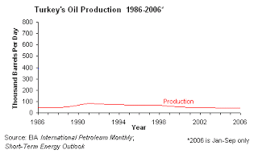

# Hafta 24

Hadi Uluengin

İlk tepkim, televizyon önünde avazım çıktığı kadar "nankörler" diye
bağırmak oldu. HAYIR, Avrupa Kupası’ndaki her hangi bir futbol
karşılaşmasından bahsetmiyorum. Daha neler, top uğruna yürek enfarktı
geçirecek kadar aklımı peynir ekmekle yemedim. Ben, İrlanda’da
gerçekleşen ve "hayır"la noktalanan AB referandumundan söz ettim. Ve,
tekrar n-a-n-k-ö-r-l-e-r! [..]  Oysa, bundan yirmi yıl önce Dublin
sokaklarını ilk arşınlamaya başladığımda, bir kaç şık semt hariç,
James Joyce’nin kentini Kuzeyli bir Üçüncü Dünya şehrine
benzetirdim. Köhne mahallelerde oyalan ve sefaleti ılık birayla
unutmaya çalışan aylak işsizler.

Yanlis ve eksik

Irlanda 90li yillarda bilgi ekonomisi olmak icin cok ugrasti. 90li
yillarda bizim ABD'deki sirketimiz Irlandali bir IT sirketinden
teknoloji satin almaktaydi - ust seviyelerde bunlar olduguna gore, bu
ulkede baska pek cok diger isin dondugunu de anlamak zor
degildi. Sirketin CTO'su ile konustugunuzda bu havayi zaten hemen
aliyordunuz. Yani para falan, bunlar da onemli, fakat onceligi nereye
koyacaksin, bu ulkeyi yonetenler tarafindan bilincli bir sekilde
yapilmasi gereken bir secimdir. Disiplinle takip edilmesini
gerektirir. Irlanda bu secimleri dogru yapabilmis bir ulkedir.Ayrica
Irlanda'nin "hayir" cevabinin temeli cok basittir: Halk Lizbon
Anlasmasina bakmis, icinde sunulanin ne halta yaradigini
anlamamistir. Bir de demek ki ekonomileri de tikir tikir isliyor ki,
AB'ye cok fazla ihtiyaclari da yok. Hayir diyebildiler.Tekrar soylemek
isterim: AB endustriyel, merkeziyetci, asiri burokratik bir
birlikteliktir. Turkiye bu "sureci" surdurmelidir, cunku surecin aktif
olmasi yararinadir - fakat katilma gunu gelince acikca belirteyim, pek
katilma taraftari oldugumu soyleyemem.

Ne yiyecegin, giyecegin, icecegin Brukseldeki bir kac burokrat okuz
tarafindan kararlastirilacak, sacma isler bunlar. Turkiyenin hali bu
kadar zavalli halde olmasa, bu surec bizim icin biraz disipline edici
bir sey olmazdi, o zaman sureci atin bir kenara diyebilirdik, fakat
Turkiye ne yazik ki reformu baska sekilde gerceklestiremiyor. O
sebeple simdilik devam diyoruz, fakat ileride Irlanda gibi olunca,
hayir'i cekmek oyle garip, ayip, kotu, kaka bir davranis
degildir.Sn. Uluengin'in uc noktada tepkisi eski sosyalistlerde bir
"teklik" arama ve esit, birbirine benzeyen bir "guruha" dahil olma
gibi bir meyil yuzunden saniyorum, bu insanlar diger tum ofsaytlari
duzeltse bile geride boyle birkac puruz kalabiliyor bazen..Mesut
Yilmazİran'da aydınlar[..] demokrasiye destek verdikten sonra bir yıl
içinde işler[..] tersine döndü.EksikIran bir petrol ureticisidir, ve
bu sebeple ABD/Ingiltere ikilisinin petrol cekismesine ev sahipligi
yapmanin bedelini odemistir. Bu ulkede son 100 senede olan hicbir
konuyu bu parametreyi dahil etmeden aciklayamazsiniz. Demokratik
secimle gelen milliyetci Mussaddik bu cekisme yuzunden (CIA
tarafindan) devrildi.

Eh, bir halkin secimlerine disaridan bazi gucler bu seviyede mudahil
olursa, normal olarak buna tepki olarak guclenecek milliyetci hissiyat
ya oradan ya buradan kendine bir cikis bulacaktir. O cikis ta en
sonunda kendini yabanciya dusman, izolasyoncu mollalar uzerinden
bulmak zorunda kalmistir. Adamin siyaseti tuketilmistir.Turkiye'de
petrol parametresi olmadigi icin Yilmaz'in benzetmesi gecerli
degildir. Turkiye'nin cografya farkliligi bir yana, halkinin dini
yorumlamasinda cok ciddi farklar vardir.SabahBöğürtlen, bünyesinde
barındırdığı antioksidanlar ve renk veren maddeler nedeniyle
bağışıklık sistemini güçlendirerek kanser türlerine karşı koruyucu
etki yaratıyor.Herkes Icin DegilB kan grubu icin soylenilen dogru,
oteki kan gruplari icin bu fayda mevcut degil ne yazik ki... Yiyecek
cesitlerinin kan gruplarina gore yararli/zararli kategorizasyonlarini
gormek icin suraya bakabilirsiniz. Her grup icin, diyabet ve kansere
karsi hangisinin etkili oldugunu da ayni sayfalarda
bulabilirsiniz.

---

Engin Ardic[..]

kızlar sarışın, mavi gözlü, genç ve çok yakışıklı bir "zabitin"
kolunda çıkmış gitmişler. [..] "Mustafa Kemal Bey," demişler,
"yamandır... İleride adını çok duyacaksın!"

Bilincaltisal Irkcilik

Ustteki yazida direk yapilmasa da, vurgular uzerinden kas/goz renkleri
ile "degisik" ve "ustun" olma arasinda surekli baglanti kuran garip
acaip retorik var ulkemizde... Kas/goz rengi baglaminda ayricalikli
bir durum, eger varsa, sadece ve sadece "kozmetik"'tir. Amerikada,
"bilim adami" ve "kafasi calisan" adam tipi Yahudi'dir. Yahudi ise
Ortadoguludur!  Kara kasli ve kara gozludur!  Yahudilerin Ortadogu
cikisli oldugu ve Araplar ile genetik yakinligi (hatta kardesligi)
bilimsel olarak ispatlandigina gore, demek ki ABD'de bilim adami
olarak betimlenen bir goruntu, aslinda Arap ta olabilecektir!Esmerlik
ve bilim adami baglantisi yansimasini ABD film dunyasinda cok rahat
bir sekilde gozlemleyebiliriz. Altta, pek cok degisik filmde bir bilim
adami oynamis ve oynamakta olan esmer, Yahudi aktorleri
gorebilirsiniz.Resimde gorulen ilk esmer aktor Leonard Nemoy, Star
Trek adli dizide yillarca uzayli bir bilim adamini
oynadi. Hatirlanirsa, dizide surekli mantiktan bahsederdi, bilimsel
konular ile hep Spock ilgilenirdi. Not: "Degisik bir gezegenden"
olarak betimlenmesi ilginctir, cunku Yahudiler de yasadiklari
ulkelerinde kismen boyle bir "disaridan" goruntusu verirler. Baska bir
anektod, Nimoy'un Spock karakterine orta iki parmagi ayirarak
verdirdigi selamin, bazi Yahudi ayinleri sirasinda gercekten
kullanilan bir isaret olmasidir! Bizce dizideki Vulkan irki tamamen
Yahudileri baz alarak kurgulanmistir (ayrica Klingonlar Suudi,
Cardassianlar Alman, Bajoranlar Filistinli, Borglar Sovyetleri temsil
etmektedir [1]). Konuya donelim: Nimoy, esmer tiptir, Ortadoguludur,
ve bilim adamini oynamistir. Demek ki her ulkede sarilik/mavilik ile
akilli olma arasinda baglanti kurulmamaktadir.Ikinci esmer, Jeff
Goldblum. Independence Day adli filmde saldiri icin gelen uzaylilarin
kodunu cozen, hatta gemilerini "hack" eden bir bilim adamini
oynamistir (bu hacking isinin dandik bir Mac bilgisayar ile yapmasi
bilenler icin hafiften komikti). Goldblum Yahudidir, Ortadogulu bir
tiptir, ve esmerdir.Ucuncu esmer, David Krumholtz su anda oynamakta
olan Numb3rs adli dizide, FBI'a cok cetrefil matematik kullanarak
suclari cozmesinde yardim eden bir Cal-Tech profosorunu
oynamaktadir. Not: Bu dizi cok populer oldu, bazi matematik hocalari
filmde kullanilan modelleme tekniklerini derslerini anlatmak icin
kullaniyorlar. Filmin bilimsel konulari gercek matematikcilere
danisilarak yapiliyor, dizinin kurgusal temeli saglam.

Konuya donelim: Yine esmer, yine/yani Ortadogulu, ve bilimci.Dorduncu
esmer, Friends dizisindeki Ross karakterini oynayan David
Schwimmer'dir. Bilimden cakiyor olmasi dizide cok on planda olmasa da,
dizide arada islenen ve bilinen bir durumdur. Dizide "kitabi
konularda" kafasi calisan karakter olarak referans
edilmektedir.Besinci esmer "kafali adam", Rainman filminde otistik ama
kafasi bilgisayar gibi calisan bir karakteri oynamis olan Dustin
Hoffman'dir. Yahudidir, esmerdir ve kafali adami oynamistir.Altinci
esmer Yahudi bile degil ama Arap. Monk dizisinde saplantilari
(obsessive compulsive) ama dahi bir detektif Monk'i oynayan Tony
Shaloub'dur. Shaloub, Lubnan asilli bir Arap'tir!Kara kasli, kara
gozlu, Ortadogu'lu. Ve kafali adami oynuyor.Yedinci esmer (resimde
yok) 7 sene boyunce Star Trek Next Generation dizisinde super zekali
bir Android Data karakterini oynamis olan Brent Spiner. Ortadogulu ve
Yahudi.Bu ornekleri cogaltabiliriz, The O.C. dizisine hic
girmeyelim. Tabii bunlari soylerken, ayni zamanda esmer olmayanin
kafali olmadigini da soylemek istemiyoruz, bu ters yonde bir yanlis
olurdu, sadece kozmetik unsurlarin hicbir ustunluk belirtmedigini
soylemeye ugrasiyoruz. Muhakkak goruntusel olarak, herhangi bir ulke
icin nadir olan, el ustunde ve "ilginc" olacaktir. Turkiye'nin Cuneyt
Arkin'ina karsi, ABD'nin Cary Grant'i vardir, cunku bu ulkenin
"artist" tiplemesi "uzun boylu, esmer, yakisikli (tall, dark,
handsome)" deyisinde kodludur cunku nadir olan odur. Fakat bunun
otesinde bu tur kozmetik goruntulerin baska hicbir anlami
yoktur.---[1] Star Trek dizisinde bir diger benzesme/sembol, Turkceye
Atilgan olarak cevrilen Enterprise gemisinin seklidir. Gemi, dikkatle
bakilirsa gayet net bir sekilde "bir erkek uzvuna" benzemektedir
(ustteki kisim kafa, sag/sol yanlarda haya bolgesi :) -ayiptir
soylemesi-)

---

Taha Akyol

Bir insanın dahi olması onun her konuyu en iyi bilen olmasını
gerektirmez. Sözgelimi [Mustafa Kemal] Jean Jacques Rousseau'ya
"mecnun" diyor. Fakat neden öyle diyor biliyor musunuz; Rousseau'nun
kuvvetler ayrılığını savunduğunu zannediyor. Halbuki Rousseau da
Atatürk gibi kuvvetler birliğini savunuyor.

Dogru

Bakiniz: Atatürk’ün Söylev ve Demeçleri 1. sf. 216:

"Bu Meşrutiyet kuramlarını bulan en büyük filozofların, bu kuramları
kurmak için çalıştıkları esasları inceledim, bunların içeriğini
anlamaya çalıştım. Benim gördüğüm şudur: Düşünmüşler ve nasıl yapalım
da bu zorba kuvvet, o toplumsal ve ulusal iradenin aşağısında
kalabilsin ya da sıfıra ulaşabilsin diyorlar. Ve bunu başaramamak
yüzünden büyük ve derin bir ıstırap duyuyorlar. Jean Jacques
Rousseau’yu baştan sona kadar okuyunuz! Ben bunu okuduğum vakit,
gerçek olduğuna inandığım bu kitap sahibinde iki esas gördüm. Birisi
bu ıstırap, diğeri bir cinnettir. Merak ettim, özel durumunu
inceledim. Anladım ki, bu adam mecnun idi ve cinnet durumunda bu
eserini yazmıştır".

---

Ahmet Kekec

Evet, ‘Büyük Dünya Krizi’ konjonktürel olarak devletçiliği (devletçi
ekonomiyi) zorunlu kılmış

Yanlis

Krizden sonra devletcilik gerekmedi, zaten "devletciligin kendisi"
krizin sebebiydi.

AK

[..] aradan fırlayan birileri bunu altı oktan birine isim yapmıştır
ama, Mustafa Kemal için devletçilik ‘geçici’ ve ‘arızî’ bir
uygulamadan başka bir şey değildir. [..] Kemalizm’i Marksizm’den ya da
bildik ‘izm’lerden ayiran da (kimilerine gore ustun kilan da) bu
gevsek ideolojik yapisidir iste.

Sacma

Aradan firlayan birileri! Mustafa Kemal'i "mitlestirmek" icin surekli
pisirilen bahane hep budur: "Efendim ondan habersiz yapildi", ya da
"efendim onun esas niyeti o degildi" ya da "efendim onun yaptiklari
[diger daha iyi olan bir seye] evrilebilirdi! Bulent Arinc'a
sorarsaniz da "laiklik Ataturk hasta yatagindayken ondan habersiz
araya sokusturulmustu"!. Bunlar peri masalidir, hicbir mesneti olmayan
sacma sapan iddialardir.

Her ama her yone egilip bukulebilmesi, bir ideolojinin gucunu
ispatlamaz. Aksine, o ideolojinin yoklugunu ispatlar. Ne bicim bir
ideoloji ki bu, Ismet Pasa'nin elinde otokrasi oluyor, ama baska
birinin elinde "bir zaman" demokrasi olabiliyor (hatta yine Ismet
Pasa'nin elinde demokrasi bile oluyor, yani .. once oluyor, sonra
olmuyor)? Hatta bu olma/olmama bundan sonra pek cok kez tekrarlaniyor?
Bir devletci oluyor, bir kapitalist oluyor? Gece ve gunduz kadar
birbirinden ayri kavramlardan bahsediyoruz efendiler! Pergeliniz
sasmaya basladi, ve problem korpe yaslarinizda Marks ile kafaniza
sokusturulan diyalektik ucubeligi galiba. Tez, anti-tez, sentez. FUCK
THAT SHIT. Okuyunuz.

Kisilere gore degisebilen ideolojinin, kalici gucu yok demektir. Bu,
onun ic butunluguyle ile ilgili bir probleme isaret eder. Ayni yolda
arabalar hem sagdan hem soldan gidecek diye bir kural koyarsaniz ve
herkes birbirine carpip kaza yapmaya baslarsa, bundan suruculeri
sorumlu tutamazsiniz.

---

Engin Ardic

Atatürkçülük, zemin ve zaman uygun olunca demokrasiye doğru
"evrilebilirdi"

Bu kaliciligini ispatlamaz

Buna yeterince cevap verdik saniyorum. Ayrica suraya bir daha
bakabilirsiniz, hatta suraya. Lutfen kimse nostaljisini cok derin
tarihi bir takim analizmis gibi ambalajlamaya ugrasmasin.

---

Milliyet

Alman bilim adamı Albert Einstein, “Eğer arılar yeryüzünden kaybolursa
insanın sadece 4 yıl ömrü kalır. Arı olmazsa döllenme, bitki, hayvan,
insan olmaz” demişti.

Yanlis

Ustteki alintiyi verirken "Einstein'a atfedilen bir soze gore" demek
adettir, cunku bu sozun kendisine ait oldugu kesin
ispatlanmamistir. Einstein teorik fizikciydi, botanik konusunda uzman
degildi. Yaygin kani bu sozun ona ait olmadigini yonundedir... En son
The Happening filminde ustteki soz kullanildi, fakat bizim
belirttigimiz sekilde - "atfedilen soz" cercevesinde.

Newsweek yazisi arilarin azalmasini "gida krizi" olarak
vermiyor. Sorulmus: "Sonumuz mu geldi (are we doomed?)". Cevap:
Hayir. Ama insanlarin gidasinda cesitliligin azalmasi mumkun diye
eklenmis... Arilarin dolleme yaptigi yiyecekler azalirsa, bu
diyetimizdeki seceneklerin azalmasina sebep olabilir. Ama buradan
"kriz" sonucu cikartilamaz.

Tabi ufak tefek konulari "kriz" haline getiren bir gazetenin, bilimsel
bir konuyu da abartmasi normal olmali.

---

Rahmi Koc

Biz maalesef Kore gibi yapamadık. Kore hükümeti, orada diktatörlük
olduğu için dedi ki, ’Samsung sen elektronik yapacaksın. Hyundai araba
yapacak. Falanca gemi yapacak. Bizde ise demokrasi var dediler ve her
isteyene otomobil üretme izni verdiler. Hiçbirimiz tam olarak
yapamadık.

Eksik

Merkezi planlama ile demokrasi birbirinin zitti kavramlar
degildir. Ikisi yanyana olabilir. 1947'den itibaren bir demokrasi olan
Japonya, hicbir dogal kaynagi olmadan pek guzel gelismistir. Demek ki
Sn. Koc'un "yapamadiklari" demokrasinin sucu degil. Hic kusura
bakmasin ama, bahsettikleri depresyon ve I. Dunya Savasi sonrasi
Almanya'daki "kartel ekonomisi" cagrisimlari yapiyor. Gelistiyse,
(etrafina saldirip kendi sonunu hazirlayana kadar) tamam onlar da
gelisti. Ama bakin simdi hangi politik duzendeler... 1949'dan beri
demokrasi. Yani beyfendinin geveledikleri totaliterci ucube
fikirlerden baska bir sey degil.

---

Hadi Uluengin

Başka bir deyişle, eğer "Eski Áhit"in Adem ve Havva "Tekvin"ini mutlak
dogma değil de bir "iláhi mitolojisi" olarak anlıyor ve akılcı mantığa
açık kapı bırakıyorsanız, insanların maymundan iniyor olması, yine
"iláhi" nitelik taşıyan arayışa nokta koymaz. Hele hele, bütün semavi
dinler içinde o dogmaya en mesafeli duran İslam açısından hiçbir engel
oluşturmaz.

Dogru

Yaratilis kavrami ile evrim teorisi birbirine zit degildir.

Hatta yaratilis kavrami ile rasgelelik de birbirine zit degildir.

Daha once determinist sekilde kaos uretilebileceginden
bahsetmistik. Benzer sekile deterministik olarak rasgele sayilar da
uretilebiliyor. Bu sayilara arkasinda bir algoritma oldugu icin "yari
rasgele (pseudorandom) sayilar" denir, fakat bu algoritmalardan
bazilari o kadar kuvvetlidir ki, yari rasgeleligin "yari"'ligi biraz
onemsizlesmeye baslar. Rasgele sayi ureticileri hakkinda birkac sey
yazalim: Bu programlarin basarisi ne kadar tekrar etmeden
gidebildiklerine gore olculur. Mesela basit ve kuvvetli deterministik
bir formul soyledir:

Z{i} = 16807 Z{i-1} mod ( 2^31 - 1)

Bu rasgele sayi ureticisi yaklasik 1 milyar rasgele sayiyi kendini
tekrar etmeden uretebilir [1].

Not: Dikkat edelim, her "yeni" sayiyi uretirken, bir once uretilmis
olani da "girdi" olarak veriyoruz. Bu rasgeleligi ve karmasikligi
arttirmasi icin yapilmis bir sey... Tum kaotik sistemlerin geri
besleme (feedback) iceren sistemler olmasi bir raslanti
olmamali... Hayatta da pek cok geri besleme vardir. Buna iyi calisin.

Tanri durumunda ise, O aynen bir bilgisayar programcisi gibi, icinde
oldugumuz evrenin programini yazan kisi ise, onun yazdigi rasgele sayi
ureticisi cok daha kuvvetli olacaktir, ve kendini tekrar etmesi
herhangi bir faninin hayatinda olacak bir olay olmayacagina gore,
mukemmel raslantisallik bu sekilde elde edilmis olur.

Ek olarak, rasgelelik olmasi, tum sistemin "karambol" uzerine kurulmus
olmasi anlamina da gelmez. Simulasyon konusunu okumuslar bilir -
kurdugunuz sistemde ana bir model olur, o modelin pek cok
deterministik, gercek hayattan girdileri de olur. Sonra bu modeli
kullanarak cok sayida insani, onlarin etkilesimini, cok uzun zaman
sonrasini ortaya cikartmak icin ortaya raslantisallik eklersiniz, ve
binlerce kez isletirsiniz. Ustteki gibi bir rasgelilik ureticisi, bu
simulasyon modelinin girdilerinden biri olur - raslantisallik "sizin
modeliniz uzerinden" sonuclari sekillendirir.

Evrenin modeli boyle bir sey ise, cok baz bir duzen kurulmus ve onun
uzerinden zar atilmaya baslanmis ve su anda yasadigimiz ana gelinmis
olabilir.

Hatta pur raslantisallik bile hicbir duzenin cikmayacagi ya da
yaraticinin olmadigi anlamina gelmez. Fraktallara bakin, neredeyse pur
raslantisallik uzerine kuruludurlar, ve harika sekiller
olusturuyorlar. Ama o sekilleri olusturan biri var. Kim? Programci.

Tabi yaratici olmasi, elinde muthis bir bilgisayar kapasitesi olmasi,
vs. hicbir sekilde icinde yasadigimiz evreni anlamak icin didiklemeyi
birakmamiz anlamina gelmez.

---

Stephen Hawking

Bu dunyadan cikip yeni dunyalari kesfetmemiz, oralara yerlesmemiz
gerekiyor. Hayatta kalisimiz buna bagli olabilir.

Dogru

Insanin oncelikli gorevi hayatta kalmaktir, hem birey, hem topluluk
olarak. Su anda tum yumurtalarimiz ayni sepette, tek
gezegendeyiz. Jupiter gezegeni o irikiyim govdesiyle bize yaklasan
goktaslarini kendine cekip tarumar ediyor, ama aradan bir tane
siyrildi mi, ahh iste o zaman, biseyi seyapariz... Rahmetli olan
dinazorlara sorun, goktasini kafaya yediler, Hakkin rahmetine
kavustular. Petrol oldular.

Bu sebeple eger riskimizi dagitmak istiyorsak, yeni gezegenlere dogru
bir acilim yapilmasi sart.. Bu acilim, ek olarak bilimsel, sosyal
konularda muthis yeni bir enerji ortaya cikaracaktir. Amerikanin kesfi
ile ortaya cikanlara bakin (bu durumdan yakinanlar olabilir, fakat
genel itibariyle yeni kita iyi sonuclara yol acmistir, temiz sayfayla
baslayabildiler, dini/bireysel/ticari ozgurlukler uzerine koca bir
ulke kurdular. Bunlar cok onemli seyler).

Demek ki hem ilerleme (adi ustunde) hem de riski dagitmak acisindan
bunlari yapmamiz gerekiyor. Bu arada, nufus artisi da aslinda bir risk
idare yonteminden baska bir sey degildir. Bir ulke icin mesela, bir
hastalik cikti, milletin %90'inini telef etti. Bu teleften sonra 10
tane mi kalmak isterseniz, 100,000 tane mi? Bu da cok onemli...

[1] Tekrar etmekten kastimiz, yaklasik 1 milyarinci sayiya gelince, her seyin basa donup, tekrar ayni sirada ayni 1 milyar sayinin uretilecek olmasidir.

http://www.snopes.com/quotes/einstein/bees.asp

http://www.newsweek.com/id/141488/page/2

Yigit Bulut

Petrol 135 dolar, Türkiye�de neden hâlâ çıkmıyor!Petrol yok demek
kiAlttaki grafik Turkiye'nin petrol uretimini gosteriyor
(kaynak). Yine bir can egrisi (bell curve)...  Egriye gore Turkiye
uretimi coktan tepeyi bulmus (89-94 civari) ve sonra dususe gecmis
(bazen tepe noktasi sivri degil duz -plateau- olabilir). ABD, Teksas,
Norvec'te dogru tahmin yapan modele inaniyorsak, o zaman diyebiliriz
ki Turkiye topraklari icinde petrol beklemek hayal olacak. Cunku bu
isin dinamigine gore kolay kuyular hemen aciliyor, oradaki uretim tepe
yaptiktan sonra daha zor kaynaklarda uretim asagi gidiyor. Ayrica
petrol cikartirken tek sorun o petrolun cikartma "bedeli" degil - (o
da onemli, fakat) varil basina daha fazla zaman harcamaniz gereken
cetin dogal durumlar da var. Her yerden cikan petrol ayni kalitede
degil ayrica, mesela Hazar denizi etrafindakiler sulfuru cok yuksek
kaynaklar. Bu daha fazla islem yapmak demek.Bizim can egrisinin ilginc
(ve komik) bir sekilde yassi olduguna isaret etmek istiyorum. Petrol
fakiri bir ulke oldugumuz bu "yassiliktan" apacik belli oluyor. Tepe
noktasi bile neredeyse tepe sayilmayacak ve gorulmeyecek kadar
altta. Hayiflanmaya gerek yok, Osmanli parcalanirken alttaki grafigin
boyle olmasi neredeyse garantilenmisti zaten.Not: Avrupa'da en yuksek
benzin fiyatlari bizde, basinda bu yonde cikan haberler dogru (kontrol
etmeden artik boyle basit haberlere bile inanamiyoruz), TR benzin
fiyatlari suradan ve AB fiyatlarini suradan alalim: Son fiyat 3.53
lira/litre = 3.53 * (1/1.9 Eur)/litre = 1.85 Eur/litre. Yunanistan
Mayis 2008'de benzin icin 1.22 eur/litre odemis. Norvec AB'de en
yuksek bedeli oduyor. Onlarda petrol uretimi vardi, fakat coktan tepe
yaptilar ve su anda dususu yasiyorlar (kaynak). Grafik altta.Cengiz
CandarFatih Terim’in sürekli kendisini aşmaya çalışan, sürekli “çıta
yükselten” bir “birey” olduğunu –altını çiziyorum “birey”- fark etmiş
ve kendisine bu nedenle sempati ve saygı duymaya başlamıştım. [..]
Kimisine, kabul edilmez ve küstahlık gibi gelen özelliği, tam da
“vasatlığa”, Türkiye’de çok revaçta bulunan ve derhal ödüllendirilen
“mediokrite”ye ters düşen “meydan okuyucu” yanı ile, yani “birey”
olmasıyla ilgilidir. [..] Fatih Terim [..] onların “mediokr”luklarına
sürekli ayna tuttuğu için, öylelerine düşmandırlar.[..] İddialı,
yaratıcı, komplekslerinden arınan, mediokriteye düşman, hırslı bir
“birey”... Bütün bu yönleri, başta “hırsı”nın kimi zaman “keskin sirke
küpüne zarar verir” özdeyişini doğrulayan görüntülere bürünmesi, onun
yanlış biçimde “ultra-milliyetçi” gibi algılanmasına yol açtı. Bu
yanlışlığa, geçenlerde Der Spiegel dergisiyle bir futbol söyleşisi
yapan Orhan Pamuk da düştü.DogruCan Dundar Orada Türmen “yeni bir
toplumsal sözleşme” ihtiyacına dikkat çekiyordu. “Herkesi daha fazla
içine alan, asgari müşterekleri daha fazla ortaya koyabilen” yeni bir
sözleşme, “kimsenin birbirinden kuşku duymadığı daha başka bir
dönem”in kapısını açabilirdi. Türmen, bu “sözleşmenin formülü”nü şöyle
açıklıyordu: “Birincisi, herkesin kendi cemaatinin dışına çıkıp
düşünmesi gerekiyor. Bu, tüm tarafları kapsıyor.Dogru,
ama...Cemaatinden cikiyor iste kardesim, universiteye girmeye
calisiyor, ama sen ona "gelemezsin" diyorsun! En azindan "oldugun gibi
gelemezsin" diyorsun, bu da yeni cagda "gelme" demekle
esdegerdir.21. yuzyilda insanlarin gruplasmalari artik endustriyel
cagdaki gibi "aidiyet" merkezli degildir. Sirketinin rozetini yakasina
takacak, onun istedigi "her sey" olacak, "organizasyon adami" haline
gelecek. Bu devirler bitmistir. Artik sirketler, kurumlar surekli
degistirilen, degisen, ve uyelerine "gelisme firsatlari" taniyan
calisanin pesinde kosan yerlerdir. Bunun sebebi yeni iscinin
fazlasiyla degerli ve el ustunde tutulan bir "kaynak" haline gelmis
olmasidir.Bu cagda yeni iletisim gruplasma metotu, "network" kurma
uzerinedir, aynen Facebookta, MySpace'de kurdugunuz turden. Bu tur
network'lerde kendiniz ile benzer ilgileri olanlar ile bir
birliktelige girersiniz, bu birliktelik icin tum benliginizi
"degismeye" ugrasmazsiniz. Yeni cagin getirdigi pek cok bilinmezlik,
gecicilik, vs. zaten vardir, tum bunlarin ortasinda birey,
degismeyecek bir seyleri yaninda tasimak, benliginde tutmak
isteyebilir. Bunlara izin vereceksiniz.Su ekmek yeme konusuna gelirsek
(yaziya baglantidan giderseniz en basta):

Yani, aktarilan AKP hikayesinin dogru olup olmadigini bilemem, ama
laikci/karsi catismasindan esas CHP ekmek yiyor olabilir. ABD
politikasinda "ayirici konu (vedge issue)" denen bir kavram vardir,
CHP ayirici konusu laikciligi kaybetse, mobilize olup CHP'ye kim oy
verir ki?  Kemalist bir takim gazeteler gazete satabilirler mi?Tum
bunlar bir yana: Aslinda turbana izin vermemek daha vahim bir
merkezden de geliyor olabilir.Nufus artisinin modelleyen denklemde,
catismalarin ortak kaynaklara olan yaris sonucu artabilecegini
aktarmistik (hatta bunun sonucu nufus azalmasi bile olabiliyordu). Eh,
yeni bilgi ekonomisinde egitim, aynen yiyecek, su, enerji gibi bir
"ortak" kaynak ise, su anki TR sartlarinda arzin durumu
ortadada. 2008'de 1.5 milyon kusur ogrenci sinava girmis, bunlarin 1
milyon kadari acikta kalacak. Yani onumuzde belli miktarda olan bir
pasta var. Laikciler soyle bir hesap yapiyor olamaz mi - "ne kadar az
kisi universiteye girebilirse, benim cocugumun sinavi kazanmasi sansi
bir o kadar yukselir". Yani talepte azalmayi zorlayip, cat diye kendi
sansini arttiriyor. Esit bir sinavda kendi sansinin olabilecegini niye
dusunmuyor? Yani, bu adamlarin sacma sapan paranoyalari var, ne
bileyim, "bunlari ozellikle hazirliyorlar" filan gibi (bir ara askeri
okullar icin bunlari geveleyip dururlardi). Yani sebep, ortak ve
sinirli bir kaynaga olan yarisin dogal sonucudur belki de.Cozum?
Pastayi buyutmek bir cozum olabilir. Nasil? Mevcut universitelere
bilgisayar bazli uzaktan egitimin (acik ogretimden fersah fersah
ileride bir duzenden bahsediyorum) mecbur tutulmasi mesela, ve bu
egitimden alinacak diplomanin sinifa giderek alinan diplomaya esit
tutulmasi. Yani kimin uzaktan kimin yakinda mezun oldugu diplomadan
belli olmayacak. Zaten sistem ikisinine de saglam egitim vermek icin
duzenlenecek. Bunun ornekleri var, bakiniz Columbia CVN programi, ya
da Stanford SPCD programi. Adam Japonya'dan ABD'ye ayak basmadan kapi
gibi Columbia diplomasi alabiliyor artik.Tabii bu cozum, sorunun ilk
kaynaginin utanc verici halini temizlemiyor. Zenciler hala otobusun
arkasinda otursun diyoruz, ama otobusun arka tarafini oyle
buyutuyoruz, ki arkada oturan bazilari artik ortada, "hafif one yakin"
oturuyormus hale geliyor.

---

Ismet Berkan

Esasen Kant’tan beri biliyoruz ki, ‘iyi, doğru ve güzel’in kaynağı din
değildir. Elbette bütün dinler ‘iyi, doğru, güzel’ hakkında önemli
şeyler söylemişler, sistemlerini bunun üzerine kurmuşlardır ama ‘iyi,
doğru ve güzel’ illa dinden kaynaklanmak zorunda değildir. ‘İyi, doğru
ve güzel’in kaynağı bizatihi insanın doğasıdır. O yüzden de, ahlakın
kökeninin insan hakları olduğu anlayışı genel kabul görmüş anlayıştır
artık.

Eksik

Insanlarin dogal isteklerini, zayifliklarini, sınırlarını yanyana
koyarsaniz, ve bu kurallara evrimsel oyun teorisini (evolutionary game
theory) uygularsaniz, bu dinamikten eninde sonunda bir ahlak cikmasi
gayet mumkundur. Aydinlanmis dinler, onu kabul edenler icin, bu
dinamigi kuran bir baslaticidan geldigine gore, bu baslatici bu
dinamigin sonucunu gayet tabii ki bileceklerdir. Bu ongoruyu
insanlarla paylasip "bu optimal olandir" diyebiliyorlarsa, bu, tahmin
ettikleri sonuclarin zaten olacagi icin sarfedilen bir uyaridir. Yol
gosterici baglamda takip edicilerini gereksiz dertten kurtarmayi
amaclayacaktir. Cunku kafasi calisan bir kisi, bu tavsiyeyi duyunca,
dini olsun olmasin, rasyonel olarak buna inanip, o yolu secebilir.

Ornek olarak sunu verelim: Oyun Teorisinde klasik bir strateji kisasa
kisas (tit-for-tat TFT) stratejisidir. Simdi sadece bu stratejiyi
bilen iki kisiyi bir odaya koyalim, eger birisi otekisine tokat
atarsa, oteki TFT'ye gore hemen karsi tokat atacak. Oyun sirali bir
sekilde oynaniyor, belirli bir "an" icinde sadece bir kisi aksiyonda
bulunabiliyor. Ve yine diyelim ki, sistemde gurultu (belirsizlik
-noise-) var, ve aktorlerden biri tokat yedigini zannetti, ve yemeden
bir tokat atti. Ne olur? Oteki hemen karsilik verir.. Buna karsilik
ilk adam TFT'ye gore hemen karsi tokat atacaktir... Zincirleme sekilde
bu dinamik boyle devam edecek ve sonucta bir sure sonra odaya
girdigimizde birbirini habire tokatlayan iki kisiyi bulacagiz. Hatta
bicareler bir sure sonra birbirilerini tuketip yere serileceklerdir.

Simdi: Biz, bu sistemi kuran olarak, bunu olabilecegini biliyorduk, ve
diyelim ki bu bicarelere yardim etmek istedik ve bu amacla soyle bir
tavsiye ortaya attik: "Ikiniz de mukemmel degilsiniz, tokat yediginizi
zannedebiliyorsunuz.. O yuzden tokat yediginizde hemen karsilik
vermeyin".

Yani kisasa-kisas (TFT) yerine iki-kisasa-bir-kisas stratejisini
tavsiye ediyoruz (buna kisaca TF2T stratejisi adini verelim).

Boylece bu iki kisi sistemdeki olasi bir gurultuye karsi korunmus
oluyorlar. Birisi tokat yiyince (gercekten yese de yemese de) hemen
tokat atmayacak. Ikinci tokati bekleyecek. Bir daha yerse,
giresecek. Ama yemezse, demek ki gurultu vardir, boylece kavga
cikmamis olacak. Bariscil bir durum ortaya cikacak.

Iste bu ornekteki TF2T stratejisi, bir dinin "yardim edici" dusturu
olarak gorulebilir. Insanlar bu durumu kendileri de kesfedebilirlerdi,
ama bu zaman alabilirdi, cok fazla dayak yemeleri gerekirdi, ya da
Oyun Teorisi matematigini gelistirmeleri gerekecekti... Demek
istedigimiz, bu yaklasimlarin ikisi de ayni kapiya cikacaktir. Her iki
durumda da amac optimalite'dir.

---

Ali Unal

Kant, ahlâkın kaynağı olarak insanın doğasını kabul ediyorsa, aksi
düşünen pek çok başka filozof olduğu gibi, ahlâk felsefesi Batı'da en
çok tartışılan meselelerden biridir. Neden Kant'ınkini genel geçer
doğruymuş ve herkes tarafından kabul edilmiş gibi sunuyoruz?. Kant,
ahlâkın menşei insanın doğasıdır derken bile, acaba bu "doğa"nın
menşei olarak neyi kabul ediyordu?. Acaba, meselâ İslâm'a göre din ile
insanın "doğası" arasındaki münasebet nedir, bunu hiç düşündük mü?

Dogru, ama dikkat

Bu Kant felsefesi islerine girerken cok dikkatli olunmasini ozellikle
tavsiye etmek zorundayim. Bu adama ister onun tarafindan ister
karsisindan yaklasin, eger dikkatli olmaz ve elinizi kaptirirsaniz,
kolunuzu alamazsiniz. Bunu hem dindar olan hem olmayan taraflarin
ikisi icin de soyluyorum.

Kant felsefesi yuzeyde rasyonalite hakkinda konusur, ah efendim, ahlak
insandan cikar, vs. diye guzel taklalar atar. Fakat biraz daha
deserseniz, alttan "zihin sunu yapar bunu yapamaz", "olculebilenin
aslinda onemi yoktur" gibi zirvalar gelmeye baslar. Bu resmen arka
kapidan iceri sokusturan mistizm'den baska bir sey
degildir. Avrupa'nin felsefe dunyasini (ve sonunda kendisini) curuten
bu felsefeden baskasi degildir.

Dindarlar icin ise, bu ilk seviyeden sonra Kant'in dini dusunceyi
savundugu gibi bir iddia ortaya atilabilir - yani, adam iste apacik
demistir, akilin gidemeyecegi yerler vardir, Tanrinin hem
olabilecegini hem olamayacagini mantik kullanarak gostermistir
(aslinda onkabuller yanlistir, ispat gecersizdir), o yuzden "inanc" bu
boslugu kapatabilecektir.

Fakat aydinlanmis hicbir din aslinda bu inancsal ziplamayi (leap of
faith) takipcilerinden istemez! Kuran'da kac yerde dogada olan pek cok
"olculebilir" olay tarif edilmekte, ve sonra "dusunenler icin burada
bir ders vardir" mealinde sozler soylenmektedir? Yani acik bir sekilde
rasyonel ve olculebilir dunya uzerinden argumanlar
gelistirilmektedir. Kant sizi burada da yolda birakir: Olculemez,
duyularin sadece bir filtre uzerinden algilayabilecegi bir baska alem
vardir, ve siz burada akilla giremezsiniz, ancak kor inancla
girebilirsiniz. Bu aydinlanmis dinlerin soylediginin tam zittidir!

---

Koksal Toptan

TBMM Başkanı Köksal Toptan 'bizi bugünlere getiren Atatürk
devrimleridir' dedi.

Yanlis

Eger Kemalist kulliyati alti okla beraber bir butun olarak ele alirsak, bizi bugunlere tamamen "devrimler" getirmemistir. Alti ok icinde devletcilik var, fakat Turkiye 80'li yillar sonrasi gelismesini devletcilige degil, piyasa ekonomisine borclu. Yani devletciligin tam zitti olan bir kavrama.

---

Yigit Bulut

Size bir soru sorarak başlamak istiyorum: Nerede İstanbul'u fetheden
Fatih, nerede Roma imparatorları [..] Bir soru daha sormak
istiyorum. Lütfen bulduğunuz bir 'çan eğrisine' bakın ve sonrasında
elinize bir kâğıt alıp 'tepe noktasında' kalabilmişleri (ister lider,
ister şirket, ister toplumsal hareket, ister bir ekonomik süreç)
kâğıda not edin. Kâğıdınız boş kaldı değil mi? [..]  Bu iki soru
sonrası birçok konuda kullanabileceğimiz çıkarımı paylaşalım; dinamik
sistemler içinde hiçbir yapı kalıcı olarak tepe noktasında
kalamaz. [..] Bu kuralı hayatın her evresinde, doğada, sosyal-politik
sistemlerde, konumuzla alakalı olduğu için belirteyim; finansal
yapılarda, rahatlıkla gözlemleyebilirsiniz...

Bozuk Anlatim

Google'dan dustu bu da... Hemen cilalayalim.

Anlatimda ciddi karmasa var. Eger can egrisinden bu sekilde
bahsedilirse, yani birden fazla insan, olculen sey'in oldugu bir
anlatim baglaminda kullanilirsa, bu, konuyu bilen insanlarda hemen
istatistikteki can egrisi cagrisimi yapar... Bu can egrisindeki tepe
noktasi ise, "lider", "zengin" gibi "nadir" olanin bulundugu nokta
degildir, nadir olanlar sag sol kenardaki alt noktalardadir (cunku pek
cok kisinin yer aldigi bir grafikte frekans olcuyorsunuz, tek kisinin
zamana gore cikisi ve inisini degil). Neyse yorumun ilerleyen kisminda
"dinamik sistem" atfi yapiliyor, o zaman durum biraz daha anlasilir
hale gelebilir, ama bastaki chicken translate laf ebeligiyle yaziyi
anlasilmaz hale sokmussunuz bir kere, buradan donus zor.

Ayrica can egrisi nereden "bulunuyor"? Etrafta gezinen guzelce
grafiklenmis "can egrileri" mi var? Can egrisi damdan duser gibi
bulunmaz (cogunlukla). Ham veriden alip sen plot edeceksin.

Yine ayrica, yazar her liderin performans grafiginin, ya da ekonomik
surecin can egrisini takip etmesi gerektigi gibi bir intiba
yaratmis.. Bunlar cok asiri, gereksiz genellemelerdir. Jack Welch gibi
bir lider alttan baslayip tepeye cikmis, ve o tepe noktasinda emekli
olmustur. Nerede can egrisi? Ya da borsalarda, IMKB-100 tam 10 sene
once bugun 4055 degerindeydi. Eger bir ekonomik sistem olan borsa bir
"can egrisini takip ediyorsa (ki etmiyor)" bu degere muhakkak geri mi
donulecektir? Nereden cikiyor bu sacma sapan analizler?

---

Malcolm Gladwell

Bir toplumda trendlerin ve alim kararlarinin verilmesinde "cok etkili"
bazi "dusunce liderleri" etkili oluyor.

Yanlis

Malcolm Gladwell, The Tipping Point (Kritik Nokta) adli kitabinda
pazarlamacilar icin ustteki tavsiyeyi verir... Ona gore,
pazarlamacilar bazi "etkili insanlari (influentials)" hedef almalidir,
cunku bu insanlar kullandiklari urunleri, etkili konumlari uzerinden
bir modayi etraflarina yayabilme becerisine sahiptir.

Fakat bilgisayar bilimci Duncan Watts'a gore, bir sosyal network
icinde o herkese "asiri bagli" oldugu kabul edilen insanlar aslinda o
kadar onemli dagitici/etkileyici noktalar degillerdir. Watts'in
hazirladigi bazi modellere gore, herhangi normal bir insan bile bir
trendi baslatmak icin dogru konumdadir. Hatta Watts gecen sene bir
simulasyonda o zamanin unlu bir pop grubunun basarisinin neredeyse
raslantisala yakin bir sekilde bile gerceklesebilecegini gostermistir.

Malcolm Gladwell'in disaridaki etiketi pop sosyolog olarak
bilinir. Yani kavramsal / rakamsal / matematiksel olarak dusunmeyip
cogunlukla anektodal dusunen, iyi hikaye anlatan, kulaga hos gelen
(hizli anlasilabilen) sosyal analizler pisiren kisilere bu lakap
takilir. Benzer sekilde Thomas Friedman icin bir "pop disisleri
uzmani" denebilir [1].

[1] TIME dergisi en son kendisi hakkinda "dunya gorusu (worldview)
bazen glib (derinliksiz) olabiliyor" tanimini kullanmis. Tabii ayni
zamanda iyi "aciklayici" da diyorlar.

---

Can Dundar

Öte yandan, en büyük diktatörlüklerin milli iradeye dayanarak
tırmandığını [..]

Yanlis

Sn. Dundar eger burada sadece II. Dunya Savasi oncesi Almanya ornegini
kullaniyorsa sunu bilmeli: Almanya ornegi bir istisnadir, kural
degil. Despot rejimler, birkac ufak ornek disinda, her zaman halka
ragmen iktidara gelmislerdir. Hicbiri halka dayanmamistir. Ornekler?
Sovyetler Birligi, Burma, Tayland, Italya.. Saymakla bitmez. Lutfen
istisnayi kural haline getirmeyelim. Ayrica Almanya sartinda
despotlugun basa gelmesinde I. Dunya Savasi olusan ekonomik
depresyonun buyuk etkisi olmustur. Depresyon derken "dolarin
dusmesinden" filan bahsetmiyorum. Depresyon. Buyuk D ile.

Ayrica o cagin endustriyel, merkeziyetci, standardize edici
kitleselligin cagi oldugunu unutmayalim. Montaj banti basinda calisan
vasifsiz iscileri siraya dizip muma cevirmek kolaydir. Masa basindaki
bilgi iscilerini kendi ikna olmadigi hicbir seye biat ettiremezsiniz.

---

Cengiz Candar

Sadece, Türkiye ile ABD arasındaki “özel ilişkiler”den ötürü değil;
Amerika'nın dünyada “tek süperdevlet” olmasından ve Soğuk Savaş
sonrası dünyadaki uluslararası sistemin aslında bir “anomali”
sayılması gereken “tek kutuplu” özelliğinden ötürü.

Eksik

ABD'nin tek superguc olarak kalabilecegi garanti degildir. Dolarin
hakimiyetinin kirildigi bir dunyada "tek" oldugunuz iddia
edemezsiniz. Askeri gucunuz olabilir, ama o guc kullanabilirseniz
etkilidir. ABD muhakkak yeni cag icin kendini en iyi sekilde
pozisyonlandirmis ulkedir, fakat bu yeni Roma olacagi anlamina gelmez.

Eski sosyalistlerde boyle "teklik" arama yonunde bir meyil oluyor
galiba. Yeni dunya gayet rahat bir sekilde super sehirler, sehir
devletler, koca bolgelerin hakim oldugu cok kutuplu bir dunya haline
gelebilir. Varili $300'dan petrolle filonu hadi getir bakalim dunyanin
bir ucundan oteki ucuna... O isler oyle kolay degil. "Degismez" hic
degil.

---

Hadi Uluengin

Artı, zenci hakları sözcüsü Martin Luther King'in aynı yıl
katledilmesinden sonra, başta "Kara Panterler" örneği olmak üzere,
daha "radikalleşen" bir Amerika şekillenmişti. [..] O halde, dün
dediğim gibi, burnu havada Fransa'nın kırkıncı yıldönümünde "atmış
sekiz"i tekele almaya kalkışması "megalomani"den başka bir şey
değildir! [..] Zira, Yaşlı Kıta'daki "Mayıs isyanı" aslında tamamen
Yeni Dünya'dan "ithal"dir. [..] Hem 2. Savaş ertesinin "tüketim
toplumu"nu sorgulayan ilk "karşı ideoloji" açısından ithaldir; hem de
bizzat "anti Amerikan" ve "sol" söylemi bab'ında ithaldir!

Neredeyse mukemmel

Eger "tuketim toplumu" yerine "endustriyellesme ideolojisi"'ni
koyarsaniz, yukarida bahsedilenler neredeyse mukemmel bir
aciklama. Sn. Uluengin ile paralel bir sekilde bu konuya ayni anda
deginmisiz ve benzer vurgulari yapmisiz. Ilginctir ki insan hayatinda
boyle ikilikler cok olur. Hatta unlu psikolog Jung bu kavrama bir isim
bile vermisti: Senkronisite (syncronicity).

---

Milliyet

Demokratik Parti’nin başkan adayı olan Barack Obama’nın başkan
yardımcısı adayının kimin olacağı merakla beklenirken, siyahi
Senatörün uygun başkan yardımcısı adayı seçeneklerini ortaya çıkarma
görevini ABD eski başkanlarından John F. Kennedy’nin kızı Caroline
Kennedy’ye vermesi tartışma yarattı.

Yanlis

Ne tartismasi yaratmis? Yok oyle bir sey. Ayrica baskan yardimci adayi
arama gorevi sadece Caroline Kennedy'ye verilmedi - Obama bu isi
yurutmesi icin bir "takima" gorev verdi, Caroline Kennedy bu gorevi
alan takimin basindaki ana isimlerden biri. Bu takimda Jim Johnson,
Eric Holder gibi isimler de var. Kafadan haber yazilmis. Ayrica
elestiriler C. Kennedy etrafinda degil, diger karakterler etrafinda
donuyor. Degerli gazetemiz dis haberler ofisine dil bilen birilerini
alsa iyi olacak.

---

Thomas Friedman

Bush takimi Libya'nin nukleer programindan vazgecmesi icin gorusmeler
yapti, ve gorusmelerde basarili oldular. Hatta Panam 103 nolu ucusun
bombalanmasi ve Amerikalilarin oldurulmesinde sorumluluklarini kabul
ettiler. Bu gorusmelerin basarisi, Irak'in isgal edilmesi sayesinde
oldu.

Eksik

Libya'nin gordugu gercek Friedman'in zannettigi gibi "nukleer programi
olanlar isgal ediliyor" ya da "diktatorlukler yikiliyor" korkusu ile
alakali degildi... Kaddafi buyuk petrol rezervlerine sahip devletci
ulkelerin artik apacik bir sekilde isgal edildigini gormustu. W. Bush
takiminin azalan petrol yuzunden gozunun dondugunun
farkindaydi. Afrika'nin en buyuk rezervlerinden birini barindiran
Libya, kendisinin de hedef tahtasina gecebilecegini hesapladi, ve
isgal edilmeden ulkeyi ben yabanci sirketlere acayim bari
dedi. Petrolu olmayan Kuzey Kore gibi ulkelerin Irak isgalindan bir
"ders" cikarmamasini bu baglamda okuyabiliriz.

Friedman, laf aramizda, bu konularda biraz saftirik bir yazardir. Hala
"kahramanlik", "Ortadoguda ABD sayesinde demokrasinin yayilmasi" gibi
laflar geveleyip durur, ikide bir ortaya attigi "kurallar" ve
"teoriler" de cogunlukla tutmaz. Tabi sonuclari dogru olmasa bile,
bazen iyi "temel" bilgilere erisiyor, sadece sizin o temel bilgileri
alip baska yone goturmeniz gerekiyor. Bu adam bu sekilde
okunmali. Mesela Friedman, II. Irak Savasi'ni babalar gibi
desteklemistir - Amerikali bir Yahudi olarak onceligi Israil'in
guvenligidir. Hatta savasi destek icin savas oncesi pek guzel renkli
cumleler bile kuruyordu. Mesela "bazi seyler W. Bush onlari tekrar
ediyorsa bile dogrudur".. Vaay! Yavrum. Biraz da yandan. Yani, icinden
ciktigi savas ve Bush karsiti kesime biraz kemik atiyor, sonra topu
donup karsi tarafa pasliyor. Bu adam bana Turkiye'den birini
hatirlatiyor ama.. kim? Neyse.

---

Ibrahim Karagul

[..] ABD-İsrail siyasi çevrelerine göre bugünkü Bush yönetimi, Barack
Obama'nın seçimi kazanacağını, Cumhuriyetçilerin kaybedeceğini
anladığı anda bu saldırı gerçekleşecek.

Mantikli

Eger neo-con takimi McCain uzerinden Iran'a saldiramayacaklarini
anlarlarsa, en azindan Iran'a girip, etrafi dagitip savas sonrasi
durumu Obama'nin kucagina atmayi dusunebilirler. En azindan "girilmis"
olur, ABD petrol sirketleri birkac kontrakt koparirlar, ABD yanlisi
bir rejim gelir, sonrasi bir sekilde halolur. Bu neo-con'lar icin
mantikli bir strateji olabilir.

---

Mehmet Barlas

Neticede onlar da [Ingiltere] imparatorluktu, biz de öyleydik.

Eksik

Osmanli koylu imparatorlugu idi, yani temel uretim metodu
tarimdi. Ingiltere bir sanayi imparatorluguydu, uretim metotunun
merkezinde fabrika vardi. Aradaki farki sadece iki ulkenin binalarina
bakarak bile anlayabilirsiniz. Ingiltere'deki yapilarin buyuklugune,
hasmetine bakin - bunlar sanayi toplumundan cikar. Yaninda Osmanli'nin
yaptiklari devede kulak ve cilizdir. Topkapiyi filan geciniz, bizim
binalar bu adamlarin soylulara bile ait olmayan birkac binasinin
yaninda cuce kalir. Ve sebebi Osmanli'nin bunlari akil edememesi
degildi, sadece uretim metotunu degistirmemesiydi.

MB

İnsanlara da hayvanlara da gösterilen saygı ve özen var öncelikli gündemde.

O saygi nereden geliyor

Sn. Barlas 2000 yilinda petrol krizi sirasinda orada olsaydi, o meshur
centilmenligin ne kadar cabuk ortadan yokoldugunu da
gorebilirdi. Garajlarda arbede cikiyordu, hastane onunde park edilen
arabalarin petrolu depolarindan cekilerek caliniyordu. Parasi olan
adam baskasina iyi, saygili davranmaya daha meyilli olur. Petrolun
varsa ucarsin. Petrol paradir.

Ama gazeteler ölmüyor.

Yanlis

Los Angeles Times 2005 yilinda sunlari yazmistir: "Gunluk gazetelerin
sirkulasyonlari 1984'teki 63.3 milyonluk tepe noktasindan 8 milyona
dustu. Ve bu sirada ABD nufusu 58 milyon artti. 1960 ve 2004 arasinda
306 gunluk gazete batti ve yokoldu". Turkiye daha o seviyeye gelmemis
olabilir, yani, gazete sirkulasyonu dusmeye baslayinca burada da
gelismisligin hizlandigina karar verebilecegiz. :)

Ayrica, Internet'in gelmesi, ortam/format (medium) degisimine yol
acar, isim olarak yok olmayabilirsiniz, ama kagit ortamindan yeni,
daha esnek elektronik formata gecebilirsiniz.

---

Hadi Uluengin

Oysa, bugüne kadar elde edilmiş bütün bulgular ve kazılardan çıkmış
bütün kemikler "Afrika kökeni"ni tartışılmaz biçimde doğruluyor. Zaten
teorisi de son derece mantıkiyet arz ediyor. [..]Dolayısıyla da,
"savan" denilen yüksek otların ötesindeki tehlikeyi fark etmek için
maymun iki ayağı üzerinde doğrulmak zorunda kalmıştır. Giderek de,
bilûmum organları bu yeni duruma uyum sağlamıştır. Ve de nihayetinde,
Süveyş müveyş derken, yavaştan yavaşa bütün aleme
yayılmıştır.DogruInsanlarin Afrikadan cikip yeryuzunde dagilma
haritalari surada bulunabilir (kaynak).Afrikadan sonra Ortadogunun
onemli bir dagitim noktasi oldugu gozukuyor. Buradan insanlar
Avustralya, Asya, Avrupa gibi degisik yonlere dagilmislar. Yukaridaki
harita mtDna metotu kullanilarak cikartilmis, yani temel
genetik.Turker AlkanAtatürk bir diktatör olmakla, demokrasiyi
yerleştirmemekle eleştiriliyor. "Yüzde doksanı köylerde yaşayan [..]
bir toplumda demokrasi nasıl kurulacaktı?" sorusu üzerinde fazla
durulmuyor. Her yönetim biçiminin belirli bir ekonomik, toplumsal ve
kültürel tabanı vardır. Hiçbir yönetim boşlukta oluşmaz, salt
kişilerin iradesine bağlı olarak kurulmaz ve yıkılmaz.DogruDemokrasi
belli sartlar olustugunda kacinilmaz hale gelen bir
yonetimdir. Bugunun Turkiyesi boyle bir ortamdir, 1920 Turkiyesinin
buna uygun oldugu soylenemez. Demokrasi ne zaman gelir? Eger bir
toplumda alinmasi gereken karar miktari tek/otoriter iktidari
asiyorsa, ona fazla geliyorsa, o zaman karar mekanizmalarinin mumkun
oldugu kadar dagitilmasi gerekir ve demokrasi buradan cikar. Otorite
buna gerektigi halde izin vermezse, o zaman kararin muhataplari
rahatsiz olur, kargasa cikar. Cin'de, her sene sadece resmi kaynaklara
gore sonu kanli biten 80,000 kusur isyan olmaktadir! Cunku
endustriyel/bilgi ekonomisinde ilerledikce, alinmasi gereken karar
miktari artiyor, ama karar mekanizmasini dagitacak demokrasileri
yok.Karar baskalarina nasil birakilir? Meclis uzerinden halka
birakilir. Ya da direk halka birakilir, yada sivil toplum orgutlerine
kismen birakilir..  Baska turlu yetisemezsiniz. Endustriyel bir
toplumda alinmasi gereken karar miktari, koylu toplumda alinmasi
gereken kararlardan kat kat fazladir. Ayni karsilastirma, girmekte
oldugumuz bilgi cagi ve oncesi icin de gecerli olacaktir. ABDde
40li,50'li yillarda bir baskan 9,10 tane cikar grubunu gozettigi zaman
isini yapmis sayiliyordu. Artik alinmasi gereken kararlar binlerce
degisik cikar grubunu ilgilendirmektedir.Ulkemize donelim: Mustafa
Kemal demokrat miydi?Degildi.Bu soru onemli bir soru
mudur?Degildir.Kemal'in yaptigi sudur: Kendi basa gelene kadar
Osmanli'nin elit tabakasinin reform icin konustugu, dusundugu,
planladigi her reformu alip hepsini 5-10 sene icinde yapmistir. Alfabe
devrimi, hilafet kalkmasi, su bu devrimi.. Bunlarin hepsi Kemal oncesi
Osmanli'da tartisilan konulardi. Din, dil, tarih.. degistir, degistir,
degistir. Evet, bu konusulanlarin arasinda demokrasi de
vardir. Denenmistir, fakat bakilmis iktidar elden gidecek,
birakilmistir, zaten zamanin Turkiyesinde kararlar "aktarilacak" kadar
fazla degildir.Sunu belirtmek gerekir: Kemal, iyi bir siyasetbilimci,
tarihci, ekonomist, dilbilimci, filozof degildi. Fakat "icraat"
isinde, aklina koydugunu yapma konusunda becerikliydi. Osmanli
elitlerinin hep uzerinde konustugu devrimleri alarak hepsini yapti,
yapabildi cunku elinde "siyasi sermaye" vardi, savas kazanmisti. Bu
icraatin iyi tarafi su olmustur: Bu "devrimlerin", dogru ya da yanlis
olsunlar, nihayet yururluge koyulmus olmasi sayesinde biz, bugun, en
azindan "keske su yapilsaydi" diye tartismaktan kurtulmus
oluyoruz.Fakat bu toptan devrimlerin yapilmasinin kotu yan etkiler de
olmustur.  Toparlama olduklari icin devrimlerin teorik tabani eksiktir
bu sebeple ozel kalemler birbiriyle catisir, uyumsuzdurlar, zaten bu
yuzden 80 sene sonra cogunun adapte edilmeleri neredeyse imkansiz
haldedir. Bizim yapmamiz gereken bunu gormek, ve ilerisini buna gore
planlamaktir.Sonuc olarak ne diyoruz?Gunumuz Turkiyesinde Mustafa
Kemal'i, Osmanli elit'ini ikiye, uce katlayabilecek dusunce
adamlarimiz vardir. Bu sebeple "Kemal bugun olsa ne yapardi" diye
sormak abesle istigal ve sacmaliktir. Ne yapacagi onemli degildir, o
zaten kendi zamani icin kendine dusen gorevi yapmistir. Eskiden bugune
aktarilacak bir sey var midir? Bunu sormak ta gereksizdir. Uretim
metotu cok buyuk bir degisim gecirmistir, eskiden gecerli olmayan
parametreler ortaya cikmistir. Yani "surekli aktarilacak ne var?" diye
bakmak zaman kaybi haline, ve gelecek planlamasini negatif etkileyen
bir unsur haline gelebilir. Bireyi referans alarak, bugun
isleyecek/islemeyecek olani anlamak icin "optimalite [1]" yeterli bir
kistas olarak gorulmelidir. Eskide olani eskide birakarak, yolumuza
koyulmamiz gerekiyor. Surekli dikiz aynasina bakmaktan vazgecmeliyiz,
yoksa onumuzde arabalara carpabiliriz.* [Cumhuriyete atfen] Dünyevi ve
uhrevi güçlerin temsilcisi, Tanrı'nın gölgesi olarak duran ve
Tanrı'dan başka kimseye sorumlu olmayan Halife Sultan yerinde kalsa,
demokrasi kurulabilir miydi?Evet kurulabilirdiDikkat, kurulsun
demiyoruz. Fakat teorik olarak bu mumkundur (bkz Ingiltere).*
[Cumhuriyete atfen] Kadınların hukuki eşitliğini sağlayan reformlar
olmadan demokrasi kurulabilir miydi?Bilgi yanlisCumhuriyet kadin
haklarini gerektigi olcude verememistir. Zamanin kanunlarinda hala
"namus" gibi kavramlar yer alir ve erkek hala aile reisi
konumundadir. Gercek anlamda kadin haklari kanunu 2004'te
cikarilmistir.* [Cumhuriyete atfen] Siyasal meşruluğun kaynağının ilah
güçlerde değil de, halkta olduğunu veri olarak kabul eden laiklik
kabul edilmeseydi, demokrasi kurulabilir miydi?Kavram
karmasasiLaiklik, Osmanli'daki millet sisteminin zittidir. VATANDASLIK
KAVRAMI ANLAMINA GELIR. Bu acidan laiklik ile demokrasi arasinda ufak
bir baglanti, korelasyon olabilir, fakat korelasyon sebep anlamina
gelmez. Sebep/sonuc iliskisi olsa olsa, demokrasinin laikligi
guclendirecegi yonunde olabilir cunku oy hakki olan vatandas, daha
guclu bir vatandastir.Demokrasinin gercek cikis noktasi, gelisen ve
karisan bir toplumda alinmasi gereken kararlari mumkun oldugu kadar
merkez disina yayma ihtiyacidir.DEMOKRASI BIR LUKS DEGILDIR.Mustafa
Akyol[..] çünkü ‘benim herhangi bir dini inacım yok’ diyen insanların
çoğu da, aslında topluma sinmiş olan din kökenli ahlaki değerlere
inanıyor. İsveçliler bugün çok seküler olabilirler, ama inandıkları
ahlaki değerler aslında Hıristiyanlık’tan süzülerek gelmiş
şeyler.Dogru* ‘İnsanlara karşı merhametli ve yardımsever olmalısınız’
hükmü, din ortalıktan kaybolunca da bir süre etkili olsa bile, bir
süre sonra birileri çıkıp şöyle diyor: ‘Bir dakika, niye öyle
olacakmışız ki? Niçin canımız ne isterse onu yapmıyoruz?’ Rus kökenli
Amerikalı yazar Ayn Rand, işte tam da bunu söylemişti. Sadece ateist
değil aynı zamanda da ‘din karşıtı’ olan Rand’in kurduğu felsefe,
bencilliği ve diğer insanlara karşı umursamazlığı yüceltiyordu. Bugün
Rand’in romanlarından etkilenen milyonlarca insan, ‘sadece kendini
düşün, kendini tatmin etmekten başka hiç bir amaç gütme’ ilkesine
inanıyor.EksikRand'in felsefesinin karsi oldugu sey
kollektivizm'dir. Sosyalizm, fasizm gibi pek cok -izm'e karsi Rand
"insanin secme/mutlulugunu takip edebilme ozgurlugu" ilkesini one
cikarip onun benligini korumayi amaclamistir - zaten insanin "kendi
mutlulugunu arayabilme" ozgurlugu ABD'nin anayasasinda bile kodlanmis
bir kavramdir (ABD'nin dini baskilardan kacan insanlar tarafindan
kuruldugunu unutmayalim, ve mutluluk, pek cok degisik sekil
alabilir). Buradaki mutluluk illa hedonizm olacak seklinde
alinmamalidir (isterse olur, ama ..), cunku Rand'e gore birey kendi
kendini yoketmemeli, potansiyeline erismelidir. Ozetle, Rand'in
bireyciligi, "neyi istedigime ben karar veririm" durusunda, zamane
kollektivizm despotluguna karsi ayakta kalmaya cabalayan,
meritokrasiye pirim veren, insani bir direnistir.Rand'in dine
karsitligi dinlerin kollektivist, komuta/kontrol gorunume girdigi
noktada baslar - onun gunumuzdeki modernite sonrasi bireysel dini
inanisa karsi olacagini zannetmiyorum. Cunku Rand, etik konusuna cok
onem verirdi, ki etik, kodifiye edilmis bir takim ahlaki/mesleki
kurallar silsillesi olarak herhangi bir din gibi, ya da onun parcasi,
uzantisi, kardesi olabilecek bir kavramdir. Rand, hatta,
kollektivistlerin etik takip edebilecek zihni kapasiteye sahip
olmadiklarini belirterek, bize bu insanlari tanimamizda cok iyi bir
kistas da sunmustur.Turkiyede Ayn Rand ne yazik ki "ask yazarlarinin"
eline dusmustur, bu sebeple bu konuda bir kisim kose yazari
seviyesinde yapilan yorumlarin dikkate alinmamasini ozellikle
belirtmek isterim.Rand'in onemli kapitalist savunucilarindan olmasi da
raslanti degildir. Ona gore birey ile kapitalizm, devletcilik ile
kollektivizm arasinda baglantilar vardir, ve bunlardan birincisi
zenginlik, digeri sefalet, catisma yaratir [3].Rand'in felsefesi bugun
icin tamamiyla yeterli degildir, fakat endustriyel bir dunya icin
yeterli/gecerli cevaplari bulmustur [4]. Gunumuzu aciklamaya talip
olan buyuk bir seztez icinde Objektivizm'in onemli bir parcasinin yer
alabilecegini zannediyorum.Engin ArdicNitekim iki gün önce Larry
Sinclair adında bir serseri Obama'yla kokain çekip [..].Standart
camur, eski hikayeObama 11 sene once kendi yazdigi kitapta, boyle
ilaclari "deneme" hatasina dustugunu kendi itiraf etmisti. O kismi
yeni haber degil. Iddiaci herifin diger iddialari camur kampanyasina
ait.. Bush / McCain catismasi sirasinda da McCain hakkinda "gayrimesru
zenci cocugu var" diye camur attiklari bile olmustu (McCain'in zenci
cocugu var, ama gayrimesru degil, Bangladesh'ten evlatlik). Standard
hareketler bunlar...---[1] Optimalite 21. yuzyila gore refah,
guvenlik, mutluluk [2], ozgurluk ogeleriyle, az/orta/cok gibi sozler,
hatta rakamlar ile irdelenebilecek parametreler uzerinden
dusunulmelidir. Amac, en fazla sayida insana, bu parametreleri
olabilecegi kadar ayni anda, olabilecegi kadar ust (optimal)
seviyelerinde sunmak olmalidir.[2] Mutluluk kelimesi, ABD anayasasinda
faydali bir ek olmustur - her turlu kollektivizme karsi onemli bir
kalkan gorevini gormustur.[3] Rand, Capitalism, The Unknown Ideal[4]
Dun yeterli olan bugun yetmeyecek aciklamalarindan bazilari, mesela,
Rand'in patent kavrami hakkindaki durusudur. Patentlere, aynen
mulkiyetlere yaklastigi gibi yaklasmistir, bireyin hakki
cignenmemelidir. Fikri mulkiyet korunmalidir, vs. Fakat, bilgi toplumu
icin bu yaklasim ne kadar dogrudur? Yeni ekonomide innovasyon cogu
zaman acik kaynaklara dayali olarak bilgini suratle birlestirilip,
kullanilip ihtiyaclar icin mobilize edilmesini
gerektirmektedir. Patentler bu hizli ekonomide destek midir, kostek
mi?

---

Mehmet Barlas

Belki atalarımızın Çin Seddi'ne dayalı topraklardan [..]

Yanlis

Turkiyelilerin, genetik olarak sadece %30'u Orta Asyalidir, geri kalan
genetik miras, uzerinde oldugumuz ve cevredeki topraklarin
karisimidir. Bu karisim, Avrupa'da genetik olarak en cok
Finlandiyalilar ve Ingilizlere yakindir bu arada (garip ama
gercek). Kulturel mirasa bakarsak ayni sekilde "%30" rakami dogru gibi
gozukuyor. Anti-demokratlik egitimler Asya ulkelerininde de tarihte
gorulmustur, halen goruluyor, kismen buradan beslendigimiz dogru
olabilir. Fakat Asyalilarin arasinda da demokrasiye yonelis var, bir
de ortada koca bir Hindistan var tabii. 1 milyar kisilik demokrasi!
Dunyanin en buyuk demokrasisi derler. En eski demokrasi Amerikadir (ve
en saglami [1]).

---

Ibrahim Karagul

Mesela yine RAND tarafından hazırlanan ve bu tarz araştırmalara yılda
100 milyon dolar ayıran muhafazakar Smith Richardson Vakfı'nın finanse
ettiği “Sivil Demokratik İslam: Ortaklar, kaynaklar ve stratejiler”
başlıklı 2003 tarihli çalışmaya bakalım:

"Anti-emperyalist ve sosyalist düşüncelerinden dolayı laiklere
güvenilmez. Fundamentalistlere ve geleneksel Müslümanlara
da. Fundamentalist ve gelenekseller arasında oluşabilecek bir yakınlık
kesinlikle engellenmeli. Hatta birbirleriyle savaşmaları teşvik
edilmeli."

Yanlis

Bahsedilen raporda o kadar kumpasvari bir hava yok. Ayrica bu iki
grubun birbirleri ile "savasmalari" degil, anlasmazliklarinin / fikir
ayriliklarinin (disagreement) tesvik edilmesi soyleniyor
(sayfa. 12). Bu belge, bir bol/yonet, onu buna kirdir belgesi degil,
yani askeri baglamda degil. Fikirsel duzlemde adam Islam cografyasinda
kimin kendine daha yakin oldugunu anlamaya calisiyor. Eger
universiteme cagiracaksam, mesela, nasil turden bir dusunuru cagirayim
zihin egzersizinde.. Yani burada RAND'i savunmak durumuna dusmek
istemem, tekil rapor bazinda soyluyorum, rapordaki bazi ispatlar
isabetli bile - mesela "modernlestirici"'lerin genelde cemaat arasinda
gorulmedigini, fazla entellektuel seviyede yazdigi, propaganda
yapmadigi icin elinin zayif oldugundan bahsedilmis.

Tabi bu kategorizasyonlara herkes katilmayabilir, koktenci
(fundamentalist), gelenekselci (traditionalist) ve modernizeci
(modernizer). Bugun Afganistan baskani Karzai'ya sorsan, "ben
koktenciyim" diyor, sanki "koktendinciyim" ya da "yobazim" der gibi,
ama korkmadan o kelimeyi ustleniyor, cunku kelimenin gercek anlamini
takip edince "ben Islam'in kokune (fundamentals)" inaniyorum onun"
icin baglantisini yapabiliyor. Bu aslinda disaridan bir kategoriyi
kabullenmemek gibi bir kulturel savunma da ayni zamanda. Bir
politikaci hicbir zaman din konusunda secmenleri onunde belli bir
kategori icine dusmek istemez.

Not: Turban hakkindaki durusuna gore tum kategoriler bir tablo ile
aciklanmis (sf 25) - bu guzeldi. Belge ayrica laikci ile laik arasinda
iyi bir ayirim yapmis, laikcileri Komunistlere benzetmis.

---

Gokhan Ozgun

Salı günü, yine bu köşede, Etyen Mahçupyan’ın yazısı muhteşem bir
ironiyle başladı ve bitti. "Şeklen bir demokraside, esasen otoriter
bir vesayet rejimi altında yaşıyorsak, şekil denetimi ne ola, esas
denetimi ne ola? Şekli inceleyen esası inceliyordur. Esası inceleyen
ise aslında şekli. Gocunabilirsin, ama sakın şaşırma."

Bütünüyle başaşağı bir rejim. Şekil dersem esas anla. Esas dersem
şekil anla.

Bu ironide bir şey daha gizli. Ki bu her şeyden daha vahim. O da,
Türkiye’nin ‘şeklen’ demokrasi olmakta ve kalmaktaki ısrarı. Şeklen
demokrasiyi derinleştirme çabası. Şeklen demokrasinin dilini kurma, bu
dili anlamlandırma, memleketi bu dile kilitleme ihtirası. Bu dil,
yalnızca karanlıkta parlayan fosforlu bir dil. Bu dil, şeklî
demokrasiden esas demokrasiye geçişi engellemek için otoriterliğe
binbir demokrat jargon taşıyan bir dil. Bu dil, kendi kendilerini
merkeze atayıverenlerin dili.

Bu dille savaşmadan, bu dille uğraşmadan, bu dili mahkûm etmeden,
bırakın tartışmayı, konuşmak bile mümkün değil. Çünkü bu dil,
insanların aklını karıştıracak. Bu dil, zamanın ayağına dolanacak. Bu
dil, Türkiye’yi demokrat dünyadan izole edecek. Bu dilin varlığı ve
gittikçe zenginleşmesi sayesinde, ‘yabancılar’ ‘Türk demokrasisi’nin
‘içişlerine’ karışamayacak.

Eskiden cumhuriyet ve muasır medeniyetin taştan, plastikten
referansları ile idare eden rejim, yeni dünyada artık kendine bir
demokrasi dili kurmak zorunda. Artık bir anlam dünyası yaratmak
ihtiyacında. Yalnızca burada değil, otoritelik her yerde, mesela
Rusya’da da bir demokrasi dili arayışı içinde.

İtidal çağrısı denen, bu yeni sahte dili kurun ve bu dilin içerisinde
kalın, emrinden başka bir şey değil.

Türkiye’de birileri, ki onlar özürsüz ve şuurları fena halde yerinde
‘ortayolcular’, her gün bu dili baştan kuruyorlar. Otoriteyi
demokrasiyle şifreliyorlar. Esasta otoriter, şeklide demokrat bir
şifreyle konuşuyorlar, yazıyorlar.

Geniş tabanlı uzlaşmadan söz ediyorlar. Aslında söz ettikleri, arzu
ettikleri, biat edilmesi. Biat kültürünü ‘uzlaşma’ adı altında
demokrat bir şifreyle tekrar tedavüle sokmak istiyorlar. Totaliter
referanslar dünyasından demokrat bir anlam dünyasına geçmek
istiyorlar. Demokrat şifrelerle itekleyerek memleketi, bir köşede
kilitlemek istiyorlar.

Sürekli ‘çoğulcu demokrasi’yi vurguluyorlar. Ne kadar güzel di mi, kim
istemez? Çoğulcu demokrasi kelimesinin içine şifreledikleri, şantajcı
otoriterlik. Deşifre edince görüyorsunuz ki, nedense sürekli endişe
içinde olan bir azınlığa, her parmak şaklattıklarında, 5 yıldızlı bir
gönül rahatlığı temin edemezseniz, azınlık diktatörlüğü devam eder,
demek istiyorlar. Çoğulcu demokrasilerde gayet tabii ki siyasi ya da
etnik azınlıklar haklarını almak için her türlü demokratik imkânı
sonuna kadar kullanma hakkına sahiptir. Ama bu imkânların bırakın
sonunu daha başında bir iktidar partisini kapatmak yoktur.

Hukukun üstünlüğü şifresine hiç girmeyelim. Onu, sözünü ettiğim yazıda
Etyen Mahçupyan deşifre etmiş zaten. Çok da iyi etmiş.

Otoriterliği demokrasiyle şifreleme çabası ‘çok sesli’
televizyonlarımız için de çok önemli.

Bu şizofrenik imkân sayesinde “tartışamama programları” büyük rating
alabiliyor.

Birileri sürekli otoriterliği demokrasiyle şifreliyor. Hem de ne
şifrelemek, 180 derece tersinden şifreliyor. Demokrat da çıkıp helak
oluyor. Ve elinden geldiğince o dili deşifre ediyor.

Şifre-deşifre, şifre-deşifre, şifre-deşifre, devran dönüyor. Bunun adı
tartışma değil, hatta münazara bile değil. Bu hiç bitmeyen bir
psikanaliz seansı gibi. Seans hiç bitmiyor, çünkü hasta olan
hastanenin sahibi. Seans, o ne zaman ‘rahatlarsa’ o zaman bitecek.

Bu dili büyük itinayla kuran ‘itidalli’ kişilere çok dikkat etmek
lazım. Çünkü onların önemli bir kısmı kuzu postunda kurt.

Onların derdi, Türkiye’yi bu şifre-deşifre patinajıyla
yavaşlatmak. Demokrasi ateşiyle otoriter zehrin dansını ebedî
kılmak. Ve Türkiye’ye zamanı kaybettirmek.

Zaman kaybetmek artık her şeyi kaybetmektir. Çünkü beğenin beğenmeyin,
dünyanın yeni oturuş düzeni Türkiye’yi demokrat dünyaya davet etmek
zorunda kaldı. Ama bu davetin altında bir de LCV var. Davete icabet
edip etmeyeceğinizi önceden belirtmeniz lazım. Öyle elinizi kolunuzu
sallayıp istediğiniz zaman, istediğiniz gibi, ben geldim lan, diye
dalamazsınız oraya.

Demokratların üzerinde, zamanı, çağı ve dünyayı arkalarına almış
olmanın gizli rehaveti var sanki. Tarihe teslim etmişler
siyaseti. Karşı tarafı küçümsüyorlar... Nasılsa bir gün demokrasi
gelecek... Hangi gün geleceğini bilmek bu devirde çok önemli. LCV

Katiliyorum

---

Cengiz Candar

Milli Takımımız gerçekten bizim Milli Takımımız idi. Bizi temsil
ediyordu. Hepimizi. Ülkemizi, toplumumuzu. Hepimizi. Hepimiz,
ülkemizi, toplumumuzu, kendimizi, önceki gece Cenevre’de Milli
Takımımızda gördük. Milli Takımımızda bulduk.

Derede boğulmak. Okyanus aşmak. Savrukluk. Beceriksizlik. Gereksiz
asabiyet ve hatta şiddet (Kaleci Volkan Demirel’in Çek Jan Koller’e
yaptığı o çirkin hareket). Hepsi bizde.

Aynı zamanda, inançla hedefe asılma, müthiş bir yetenek sergilemek,
hayatiyet, canlılık, hepsi bizimkilerde. [..] İşte Türkiye bu. Hesaba,
kitaba gelmez. Ne zaman, ne yapacağı bilinmez. Dökülür ve
şahlanır. Ezilir ve coşar. Bitti sanıldığı anda ayağa kalkar.

Türkiye’den umut asla kesilmez...

Katiliyorum

[1] Bakmayin, bu blogda Amerikan entegrator elitin attigi taklalardan
bahsettik, baskan oldurttuler, OJ mahkemesinin jurisini bir katakulli
ile "atadilar". Fakat 300 senelik tarihte bunlar ufak olaylardir,
tukenecektir, tukenmektedir. Genel itibariyle sistem saglam isler,
demokrat'tir, ve degisime izin veren esnek bir yapisi vardir. Kurtaja
izin veren Roe vs. Wade adli anayasa mahkemesi kararina ve oraya
gelinceye kadar verilen oylarin matematigine bakin. Sanki sihirli bir
el kanaati yavas yavas ozgurlestiriyor gibidir.. Zaman gelmis ve pat
diye ozgurluk gelmistir.

ABD'de, muhakkak, modernite sonrasi toplumu idare etmek icin daha
fazla katilimci demokrasi gerekecek. Simdi o gecisin, ihtiyaclarini
sancilarini yasiyorlar. Biz hala ABD'nin mevcut haline yetismeye
ugrasiyoruz. "Partilere" dokunmak/dokunmamak hakkinda konusuyoruz
(felaket durumdayiz acikcasi).

---

Emre Akoz

Geçenlerde bir yorumcu, Anayasa Mahkemesi'nin 5 Haziran'da verdiği
kararla rejimin değiştiğini söylüyordu. AYM'nin Anayasa'yı çiğneyerek
aldığı kararla, demokrasiyi terk edip yargıçlar iktidarına
geçmiştik. Olay böyle de yorumlanabilir. Gayet makul. Ama gelin başka
bir açıdan da bakalım: İddiam şu: Rejim değişmedi, rejimin maskesi
düştü. Yani Türkiye'deki siyasi rejim zaten böyleydi; şimdilerde
apaçık görünür oldu.

Dogru

Sn. Emre Akoz son zamanlarda hepsinin altina "dogru" yazilacak pek cok
yazi yaziyor [1,2,3,4,5, ...] Bunlari teker teker eklemeyelim diye
simdiye kadar alinti yapmadik, cok is olacakti - siz en iyisi
kaynagindan bakin.

---

Engin Ardic

Ne kadar isterdim şu Kıbrıs konusunu bir kurmay subayla
tartışmayı... Yanlışım varsa beni uyarsın, bilemediğim jeostrateji
ayrıntılarını öğretsin...

Sacma

Bir "kurmay subay"'in kuresel strateji konusunda uzman olmasi garanti
degildir. "Savas generallere birakilmayacak kadar ciddi bir istir"
sozunun cikis noktasi zaten budur.

Daha once Sn. Ardic'in dokundurdugu "yurtta sulh cihanda sulh" sozunun
temeli de, stratejik bir merkezde yatar, oyle mistik, bariscil bir soz
degildir... Mustafa Kemal, Osmanli'nin Asya'daki muslumanlara yonelik
"hamilik" yapma stratejisinin Osmanli uzerinde cozucu bir etkisinin
oldugunun farkindaydi. Bu sebeple "yurtta sulh (bizi rahat birakin)
cihanda sulh (biz de baskalarina hamilik yapmayalim sizi rahat
birakalim)" sozunu sarfetti. Soz, bu baglamda gayet mantiklidir. Bu
sozu oldugu gibi Kibris'a uygulamak ta uygun degildir. Pek cok konuda
oldugu gibi, eski zamani ESKI ZAMANDA BIRAKMAK GEREKIYOR. O gun dogru
olan bugun dogru olmayabilir. Kibris bir duragan ucak gemisi gibi cok
onemli bir konuma sahiptir. AB'ye girerse, sen de gireceksin, girmek
icin baski yapacaksin. Birakmayacaksin. Ama referendum gibi sonucu
belli "dis ulke kamuoyuna donuk" hamlelere izin vereceksin - "biz evet
dedik o hayir dedi" ayaklarina yatacaksin. Bunlar hep stratejik
hamlelerdir.

Son olarak sunu soylemek gerekir: Prof. Dr. Ahmet Davutoglu'nun dedigi
gibi "Kibris'ta hicbir sorun olmasa bile Turkiye'nin bir Kibris sorunu
olmalidir".

---

Serdar Turgut

Zaten Nash de kendi modelinde 'Nash dengesi' denilen durumu formule
etmistir. Beraberlik ile biten maclari bir Nash dengesi ornegi olarak
ele alabilirsiniz.

Yanlis

Nash dengesi, yarismali bir oyunda her iki tarafin, karsi tarafin
stratejisinin ve kendi potansiyel kazancini ve yapabileceklerini
gozonunde tutarak, optimal bir strateji sectigi anda ortaya
cikar. "An" derken, "stratejinin ne oldugu"'ndan bahsediyoruz,
karsilasmanin "skorundan" degil. Her iki tarafin Nash dengesindeki
stratejik secenekleri, oyunun sonunda 1-0 skoruna yol acabilir. Nash
denge ani, her iki tarafi tatmin edecek "en iyi sonuc" anlamina
gelmez. "Her iki tarafin kendine gore en fazla kazanc saglayabilecegi
stratejilerin secim noktasi" anlamina gelir. Her takim kendi
guclerini, yapabileceklerini, ve elde edebileceklerini (payoff)
gozonunde tutarak optimal bir strateji secmeye ugrasir, ve bunun
sonucunda oyun oynanir ve sonuc alinir.

Cok basitlestirerek bir ornek verelim: Diyelim ki bir futbol macinda
mumkun yegane iki strateji, defansif agirlikli, ya da ofansif
agirlikli oynamak olsun. Yine diyelim ki, mesela, 30 sene onceki milli
takimimizdan bahsediyoruz. Bu takim icin kazanma sansi az, odul onemli
ama olasilik ile carpinca kazanc (payoff) dusuk. Ote yandan fark
yemenin ihtimali daha fazla, yani kazanc cok buyuk bir eksi deger
(neredeyse ceza, ah vah niye kaybettik, utandik, zirlayip duran
Hurriyet mansetleri, vs).

Ve yine diyelim ki 30 sene onceki macta karsi takim Brezilya olsun. Bu
takimin Turkiyeli takima gore kazanma sansi fazla, odul tur atlamak,
kaybetmenin bedeli kotu, ama olasiligi az oldugu icin kazanc (payoff)
dusuk.

Boyle bir ortamda, Nash dengesi Brezilya'nin ofansif, Turkiye'nin
defansif oynadigi andir. Bu oyun sonucunda mac 2-0 Brezilyanin
kazanmasiyla bitebilir. Yani beraberlik illa Nash dengesi anlamina
gelmez.

Sayin yazarlarimiz: Lutfen bu tur derin teknik konularda yazmadan once
bir biline danissinlar. Merak, bilgiyi garanti etmez. Meraktan, bilme
anina erismek icin uzun soluklu, derinlikli dusunce, hamaliye
gerekir. Yoksa yapilan, yarim yamalak bilimsel bilgiyle yarim yamalak
sonuclara erismek olacaktir. Ayrica insanlara yanlis bilgi vermenin
kotu yan etkileri de cabasi.. Tabi Sn. Turgut icin bu acaip degil
belki de - sonucta ornek aldigi Marx ta ayni sekilde yarim yamalak
bilimle garabet sonuclara erismisti. Bu bilip, bilmemekten ote, bir
dusunce disiplini problemidir.

---

Engin Ardic

Atatürk'ün cumhuriyetinde senato da yoktur. Gerek olsaydı, Atatürk
kurardı onları...

Yanlis

Ne demek "gerek olsaydi kurardi onlari". Sacma sapan sozler
bunlar.. Siyasetbilim konularinda bir olgunun dogru olup olmamasinda,
o fikre Mustafa Kemal'in de katilip katilmiyor olmasi onemli
degildir. Kemal iyi bir asker, ve stratejisyendi. Buradan "iyi bir
siyasetbilimciydi" sonucunu cikaramazsiniz.

Bunu soylerken, Sn. Ardic'in ne yaptigini hepimizi goruyoruz
saniyorum. Kendisi Kemalistlerle bir boks macinda, ve senato isteyen
Kemalistlere "madem Kemalist'sin, niye Kemal'in dedigini takip
etmiyorsun?" diye bir tokat cakiyor, yani onlarin sozunu onlara karsi
silah olarak kullaniyor. Bu etkili bir darbe. Aslinda arkamiza
yaslanip bu boks macini seyretmeye devam edebilirdik, ringde Ardic'in
karsi tarafi tokatlamalarina bakip, gulup, guzelce
eglenebilirdik. Fakat biz, hayatin ve Turkiyenin geleceginin buyuk
cogunlugunun (artik) bu ring disinda tezahur etmekte olduguna
inanmaktayiz. Bu sebeple polemikler bir tarafa, dogru bilinenlerin
acik bir sekilde yazilmasi gerekiyor.

Dikkat: Bu yazida, senato destekleyen ya da karsi cikan bir gorus
belirtmedik. Metot hakkinda yorum yapiyoruz.

---

Gecende stand'da dergilere bakarken, Aydinlik dergisi gozume
carpti. Arada sirada ucuk fikirler gormek ve cogunlukla gulmek icin
bir bakarim. Mesela Putin'in Turkiye ziyareti sirasinda, konu hakkinda
haberi veren sayfada koca bir "Sezer Putin kucaklasmasi" fotografi
vardi. Bu resim baska yerde cikmamisti.

Neyse, dergiyi acinca sayfalarin artik saman kagit degil, renkli
kaliteli kagit ile basildigini gordum. Aklimdan ilk gecen dusunce
"Rusya'nin yeni petrol paralari birilerinin isine yaramis demek ki"
oldu. Aydinlik'in Rusya'ya yakinligi malum. Karen Fogg olayi sirasinda
e-mail'leri dergiye sizdiran suphesiz Rus istihbarati idi. Rusya'nin,
etrafindaki ulkelerin NATO'ya ve AB'ye girmesini istemedigi de bilinen
bir sey, ama bu genellikle eski mustemleke ulkeler icin
gecerliydi... Bu listeye Turkiye dahil edilmis midir? Bunu
gerceklestirmek icin ne kadar ileriye giderler? Putin eski bir KGB
ajaniydi, KGB'den kacan Oleg Gordievsky'nin Ingiltere'de zehirlenmesi
buyuk olay olmustu, hatirlayabilirsiniz. Bazilari hala eski soguk
savas oyunlarini oynamaya istekli olabilir.

Espriyle karisik gercek bir beyan okudum bir kitapta: Soguk savasi
hakikaten kim kazandi? Su anda Rusya'da, nukleer silah, petrol ve
dogal gazin ucu de var. Tabii, 80/90'li yillarda surunduler, nufuslari
azaliyor, yeterince acik toplum degiller. Hala problemler var yani.

---

Daha once Star Trek dizisinin benzetmelerle dolu oldugundan
bahsetmistim. Bunlara biraz daha devam edelim. Bir kulturu ve genre'yi
tanimak icin bunlar onemli manivelalar aslinda.Star Trek Freud'u cok
memnun edecek sembollerle dolu. Bir kere, Turkceye cok guzel bir
sekilde cevrilmis olan uzay gemisi Atilgan'in bir erkek uzvuna
benzedigini soylemistik. Devam edelim: Bu gemi, kara bir bosluk olan
uzaya dogru gidiyor/giriyor. Hoppala. Hatta geminin Turkce tercumesini
(Atilgan) de kullanmak gerekirse, bu bosluga dogru
"atliyor". Cevirmenlerimiz farkinda olmadan cok guzel bir espriyi
yakalamislar.Ama bununla da kalmiyor. Dizi baslarken arka planda /
fonda bir konusma var: Once Kaptan Kirk'u oynayan William Shatner,
sonra Kaptan Picard'i oynayan Patrick Stewart tarafindan seslendirilen
bu giris konusmasi ne diyor? "Misyonumuz hic bir erkegin gitmedigi
yerlere cesurca gitmektir! (to baldly go where no man has gone before)
".  Hoppala! Nereye "gidiyoruz" yahu? :) Her ne kadar gunun politik
hassasiyetleri (political correctness) icin sonradan "hicbir erkek (no
man)" sozunu cinsiyetsiz olan "hic kimse (noone)" haline cevirdilerse
de, dizinin genel Freudian cagrisimlari bariz sekilde ortada... Uzay
sanki iliskiye girilecek bir hanim gibi gosterilmis, ve ilginc bir
sekilde kurgulanmis gemi ile oraya dogru "atlaniyor".Tabi bunu
soylerken, bu dizinin diger politik hatta bazen utopik, sofistike
durusunu golgelemek istemem. Trek evreni hakikaten insanin olmayi
hayal edebilecegi bir evrendir...

Replicator teknolojisi ile tasarimdan uretime gitmenin bedeli
neredeyse sifira inmistir, enerji ucuzdur, insaniyet pek cok gezegene
yayilmistir. Daha guzeli insanlar sadece kendilerini gelistirmek icin
yasamaktadirlar, pek cok diger irk Federasyon catisi altinda baris
icinde yasamaktadir (bu arada Federasyon Amerikayi temsil
eder). Muhakkak oteki baska buyuk gruplasmalar ile savaslar vardir,
bunun sebebi de dizide dram yaratmak icin gerekli malzeme
saglamaktir.Star Trek dizisinin ilk versiyonu televizyonlara
ciktiginda ABD'de 60'li yillarda zenci/beyaz surtusmesi cok travmatik
bir sekilde yasanmaktaydi - ve Star Trek gayet innovatif bir sekilde
zamaninin pek cok "hassas" konusunu "ileride" gecen ve bu sebeple daha
guvenli olan bir ortamda allegori kullanip adresleyerek, bizce
zamaninin politik ortamina cok olumlu faydalar saglamistir. 80/90'li
yillarda baslayan Star Trek Next Generation da bu gelenege devam
etti.Bu dizi hakkinda daha sayfalarca yazabiliriz: Su acaip politik
ortam bir duzelsin, buralara da gireriz belki.Trek konusunda bazi kisa
haberler, Star Trek XI isimli yeni bir film yakinda cikacak, yonetmen
Lost dizisinin produktoru J.J. Abrahams. Film, ilk Trek evreni uzerine
kurulu (Spock'un oynadiklari) ve Kirk'u geri getirmediler ama daha
genc bir Spock buldular: Heroes dizisinde kotu adami oynayan Zachary
Quinto. Quinto tabii ki esmer, Ortadogulu gorunumlu (ama Yahudi degil
Italyan asilli -deniyor-).

---
