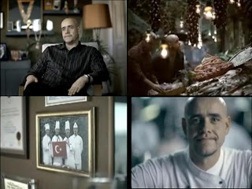

# Hafta 32

Gokhan Ozgun

Post-modernizm çok geniş bir tanımı, hatta çoğu zaman doğru dürüst bir
tanımı olmayan bir felsefe, bir durum, bir ruh hali, bir
tartışma. Kısaca, ‘yeni olan’ birçok farklı şeyi, hatta birçok karşıt
görüşü temsil ediyor.

Yanlis

Postmodernizm, ne oldugu gayet belli bir dusunce
sistemidir. Subjektif, bilim karsiti bir ideolojidir (ve Fransa'dan
cikmistir). Bu ideoloji hakkinda bir yazimiz surada bulanabilir. Sunu
belirtmek gerekir ki, "modernite sonrasi" dunyayi aciklayan her
ideoloji postmodernizm degildir. Bu blog'un ana felsefesi de modernite
sonrasini kurgulamaya ugrasiyor, ama bu, ne oldugu bilinen
postmodernizm'den bambaska araclarla yapiliyor.

Simdi Kosaner konusmasina gelelim: Kosaner postmodernizm'in yukarida
anlattigimiz sey oldugunu biliyor mu? Belki evet. Ama buyuk bir
ihtimalle hayir. Tabii kimsenin agzina laf koymak istemeyiz, o yuzden
kisisel yorumlari burada kesmeyi seciyoruz. Fakat kesinligi suphe
goturmez olan tek sey vardir ki, o da, endustriyellesme ideolojisi,
tek tipci, toptanci (mass), merkeziyetci, standardizasyoncu
modernitenin gunlerinin sayili oldugudur. Bunu durdurmak icin yapacak
bir sey de yoktur (kafanizi kuma gommek haricinde). O zaman gelecegin
nasil karsilanacagini konusmak gerekiyor, ki bu (burada Ozgun'e
katiliyorum) "bir vs.. vs.. tabaka var" havasinda itham edici pozlarla
yapilamaz. Final analizde herkesin kendi isine bakmasi gerekir, ve
felsefe yapmak askerin pek cok onemli gorevlerinden biri degildir. Bu
kendilerine verilmemis gorevi yapmayi ugrasirlarsa da bu isi ellerine
yuzlerine bulastiracaklari kesindir, bu durum tarihimizin ust uste
ispatladigi bir sabittir.

---

Hadi Uluengin

SALDIRGAN ve yayılmacı Rusya tecrit durumdadır. Üstelik, bu
yalnızlaşma sırf Batı ülkeleriyle sınırlı değildir. "Doğu" (!)
açısından da geçerlilik taşımaktadır. Nitekim, Tacikistan başkenti
Dûşanbe’de gerçekleşen "Şanghay İşbirliği Örgütü" (ŞİÖ) zirvesi,
Moskova’nın istediği doğrultuda bir karar almayı reddetti. Tamam,
ortak bildiri Kremlin’in Kafkas’taki "müdahillik hakkı"nı yarım ağızla
kabullendi ama, metin esas olarak ülkelerin, yani Gürcistan’ın toprak
bütünlüğünü vurguladı. Her halükárda da, aynı ŞİÖ’de temel direği
oluşturan Çin, fiili ilhak anlamına gelen ve Rusya’nın Güney Osetya ve
Abhazya’yı tanımasıyla orta çıkan oldu bittiye cevaz vermedi. Zaten de
veremezdi!

EVET veremezdi, çünkü en önce, "Avrasya" mavrasya patırtısı koparak
ülkemizi otoriter ufuklara sürüklemek isteyen bizim "ulusalcı -
neo-ittihatçı" zevatın iddia ettiğinin aksine, dünya sahnesinde böyle
bir coğrafi kurumsallaşma yoktur. Teorik açıdan dahi yoktur. Zaten ŞİÖ
şekillenen yapılanma da asla bir "blok" veya bir "ittifak"
değildir. Bu örgüt taş çatlasa, partnerlerin ancak azámi paydalarda
buluştuğu bir "kulüp"tür. Daha önemlisi, hem yukarıdaki "temel direk"
Çin, hem de "gözlemci" durumundaki Hindistan, siyasi ve iktisadi
planda Rusya’nın dümen suyuna girmezler ve girmeyeceklerdir.

GİRMEZLER ve girmeyeceklerdir, çünkü Moskova onlar açından,
gerektiğinde Washington’a karşı "denge unsuru" olarak kullanılacak bir
"yedek güç"tür. Hepsi o kadar! Zira Çin’in ve Hint’in esas ufku
Pasifik’e; bilhassa da California kıyısına açıktır. Üstelik,
birincinin Tibet ve Doğu Türkistan; ikincisinin ise Keşmir
sorunlarıyla hop oturup, hop kalktığı düşünülürse, Pekin ve Delhi’nin
Kremlin oldu - bittisine "eyvallah" diyeceğini düşünmek abesle iştigal
eder. Bu iki başkent de kendi ayaklarına ateş etmezler. Nitekim, aynı
Pekin lideri Hu Cintao aynı zirve sırasında kendisinden destek isteyen
Rus önder Dmitriy Medvedev’le yaptığı görüşmeden sonra, "Gürcistan
meselesi Çin’i zor duruma soktu" şeklinde konuşarak, böyle bir
desteğin gelmeyeceğini ortaya koymuş oldu. Dolayısıyla, en başta
belirttiğim gibi, saldırgan ve yayılmacı Rusya’nın sırf Batı’dan değil
"Doğu"dan (!) da tecrit olduğu Dûşanbe’de doruğunda ayan beyan gözler
önüne serildi.

ÖTE yandan, kızıl veya beyaz daima Rusya olan Rusya’nın bu iki yönlü
yalnızlaşma karşısında takındığı tavır, Leonid Brejnev dönemindeki
Sovyetler Birliği’ni hatırlatıyor. Nasıl ki Afganistan’ın işgali
ertesinde daha da çok tecride gömülen o dönem SSCB’si gerilimi
tırmandırmış ve Doğu Avrupa’ya "SS-21" füzelerini yerleştirerek
Batı’ya meydan okumuştu, üç aşağı beş yukarı, bugünkü Putin - Medvenev
ikilisi de aynı taktiğe başvuruyor. Apar topar ve aksak topal, Moskova
bu defa da "Topol" güdümlü füzelerini deniyor.

Ancak, mevcut petrol döviz ve rezervlerine güvenerek yine kısa vadeli
düşündüğü ve uzun vadeli bakmadığı içindir ki, şimdiki Kremlin o
maziden ders almışa benzemiyor. Aynı SSCB’nin, "rest"i gören ve
"yarış"ı tırmandıran bir Ronald Reagan tarafından başlatılmış "yıldız
savaşları" projesine ayak uyduramadığı için çöktüğünü unutuyor. Artı,
yine kısa vadeli hesap yapan Moskova, bu fütursuz yaklaşımıyla hem
Yaşlı Kıta’yı metazori ABD’nin kucağına itiyor; hem de kendisinin son
tahlilde, iktisadi ve teknolojik açıdan "kof", en azından "muhtaç" bir
devlet ve ülke olduğunu göz ardı ediyor.

İşin özü, yenilen pehlivan güreşe doymazmış misali, Batı’da ve Doğu’da
tecrit bir Rusya "rövanş"a soyunarak, tekrar "soğuk savaş"tan medet
umuyor. Ve, o "soğuk savaş"ı kimin kazandığını hatırlamayacak kadar
hafıza kaybına uğruyor.

Katiliyorum

--

Taha Akyol

ÖZDEMİR İnce, ilgiyle okuduğum yazarlardan biridir. Fikirlerimiz
farklı; ‘akıl yürütme’ biçimini de fazla ‘Fransız’ bulurum. Karmaşık
maddi olgular hakkında Descartes’çı mantıkla kestirme hükümler
verdiğini düşünürüm. Aşırıya götürüldüğünde bu mantık ‘doğru’ları
zihnin içinde, soyut “akıl”da aramaya başlar. Zihnimizin dışında, reel
hayatta cereyan eden karmaşık süreçleri anlamaya çalışmak yerine,
zihnin içindeki etiketleri dış olgulara yapıştırır. Onun için komplo
teorilerine çok yatkındır, Jakobenlerde de böyle soyut akılcılık ve
komplo saplantısı çok güçlüydü.

Dogru

TA

Önemli bir Amerikalı, İnce’ye demiş ki: “İslamla demokrasinin
bağdaştığını Türkiye’de kanıtlamak zorundayız. Bu konuda başarısız
olmayı ABD göze alamaz!” İyi de hiçbir sır tarafı bulunmayan bu
beyandan “ılımlı İslam Cumhuriyeti’ne dönüştürülmüş Türkiye” komplosu
çıkarılabilir mi?!

Niyetleri bozuk

Bu mantiklamanini sebebi, Akyol'un belirttigi gibi dusunce
sistematigindeki kesif arizalar olabilir, bu imkan dahilinde. Ama bir
aciklama daha var:

O aciklama da sudur: Bu insanlar aslinda, icten ice, Turkiye'den dinin
silinmesini istiyorlar.

Bu elde var bir.

Simdi bunun uzerine "İslamla demokrasinin bağdaştığını gormek isteyen"
ABD geliyor. ABD, kendi geleneklerinden temelle bir dinin silinmesini
aklindan bile gecirmiyor. Fakat iste tam bu hissiyat, yani bir dinin
"olabileceginin bile bahsedilmesi" bizim Fransizlara uymuyor. Ve bu
sebeple ABD de onlarin dusmani haline geliveriyor.

Ama bunu da tam soyleyemiyor; O zaman dusmani bari karsi tarafa da
dusman yapayim diye bir cakallik dusunuyor, ve diyor ki "ABD Islam'i
ilimlilastirarak sizi bildiginiz dininizden cikaracak".

Aslinda Islam'in ilimli olmasi, olmamasi umrunda degil. Onun istedigi
dinin olmamasi. Fakat ABD'nin dusuncelerini saptirarak, AKP'nin
muhafazakar tabanini (kendine gore) galeyana getirmis oluyor, hem de
kendi tarafina bir komplo kemigi atarak saflari birlestirmis oluyor.

Nasil ama?

---

Ahmet Kekec

Demokratik ülkelerde Cumhurbaşkanları rektör atamaz.

Tam degil

ABD'de, mesela California Universitesi okul sistemindeki mutevelli
heyetinin uyelerini bizdeki Cumhurbaskaninin karsiligi olan vali
atar. Rektoru bu heyet secer, bu sebeple, birden daha fazla secilmek
isteyebilecek heyet uyeleri uzerinde valinin bir etkisi vardir. Vali,
cok uygunsuz gordugu bir rektoru, heyete (bu etkisi uzerinden) baski
uygulayarak isinden de attirabilir. Reagan, California valisi oldugu
zaman yaptigi ilk is, bu sekilde bir rektoru kovdurmak olmustur.

Yani direk degil, ama indirekt bir etki var, ama bu etki hala cok
guclu bir etkidir. Devlet yardimi ile ayakta duran devlet
universitelerinin karar mekanizmasina secimle is basina gelmis bir
yetkilinin yon vermesi gayet mantikli, ve gereklidir. Bu da, Turkiye
durumunda ya basbakan, ya da (artik secimle gelecek) Cumhurbaskani
olacaktir.

---

Hadi Uluengin

KAFKASYA’daki yeni durum bir sürpriz değildir. Çünkü, uluslarası
hukuku hiçe sayan ve dünyaya meydan okuyan Kremlin’in Abhazya ve Güney
Osetya "bağımsızlık"larını (!) tanıması, maddenin tabiatına uygun bir
gelişmedir.

O maddenin tabiatı ki, malûm, bütün tarihi boyunca saldırgan ve
yayılmacı bir siyaset izlemiş olan Moskova için söylenen "kızıl veya
beyaz, Rusya Rusya’dır" sözünde özetlenir. Başka bir deyişle,
Gürcistan’ın toprak bütünlüğünü umursamayan Putin - Medvedev düeti
yukarıdaki iki ási "cumhuriyet"i (!) fiilen ilhak ederken, aslında táa
Kiev prensliğinden beri ve bin küsur yıldır süren bir "istilácılık
geleneği"ni tekrar canlandırmış oldu. Evet evet, "kızıl veya beyaz,
Rusya Rusya’dır" ve değişeceğine dair de emáre yoktur.

İmdiii? İMDİSİ şu ki, "Soğuk Savaş"ı hortlatmak pahasına dahi olsa, o
Rusya’nın kısa vadede ciddi bir başarı kazandığını daha şimdiden
söylersek, fazla yanılgıya düşmeyiz. Şüphesiz, Batı, Kafkas oldu -
bittisi karşısında Moskova’yla kendisi arasına daha net bir çizgi
çekecektir. Hatta muhtemelen, Kremlin’e yönelik olarak bir dizi
"tedbir" alacaktır. Fakat, dostlar alış-verişte görsünden çok öteye
gidemeyecek olan bu yüzeysel yaklaşım pratikte fazla kıymet-i harbiye
ifade etmez. Edemez ve edemeyecektir. [..] O halde evet, Rusya kısa
vadede başarı kazanmıştır ve bir süre bundan yararlanacaktır.

ANCAK, daha orta - uzun vadeli bir perspektiften bakarsak, aynı şey
geçerli değildir! Çünkü en önce, petrol ve gaz fiyatlarındaki müthiş
artıştan dolayı bugün kasaları dolu olsa bile, Rusya özünde hálá
"geri", kısmen fakir ve her halükarda da "muhtaç" bir ülkedir. Tüm
altyapısı, özellikle de söz konusu gaz ve petrol altyapısı Nuh-u
nebiden kalmadır. Hayatiyet arzeden bu sektörde Batı sermaye ve
teknolojisine çok büyük ihtiyacı vardır. Eğer o Batı o "tedbirler"i
sıkı tutarsa da, Kremlin zaman içinde etkiyi hissedecektir. Öte
yandan, Kafkaslar’daki Rus yayılmacılığının önce Ukrayna, Belarus ve
Moldova’yı; sonra da Asya’daki BDT ülkelerini daha çok
"işkillendirmesi" kaçınılmazdır. Bunlar, zaten hálá "hámi" geçinen
Moskova’dan mümkün mertebe uzaklaşmak ve şöyle ya da böyle, "Batı’ya
kapağı atmak" için yeni politika arayışlarına döneceklerdir.

Katiliyorum

---

Mehmet Barlas

Bu bakımdan AK Parti'ye alternatif olacak güçte bir veya birkaç siyasi
partinin varlığı, demokrasinin sağlığı açısından da şarttır.

Yanlis

Muhalefet "yoklugu" Turkiye siyasetinin bir numarali sorunu
degildir. Ikinci ya da ucuncu numarali sorunu da degildir. Ayrica:
Kendi keyfine uygun bir muhalefeti restoranda siparis verir gibi
istemek, demokrasiyi icsellestirmemis ve anlamamis olmanin
gostergesidir. Piyasa ekonomisinde "fiyatlar soyle olsun" demek kadar
aptalcadir. Nasil piyasa ekonomisinde fiyatlari arz/talep belirlerse,
partilerin mevcudiyetini, basarisini, basarisizligini arz
(siyasetciler) ve talep (halk) belirler.

---

Abdullah Gul

Rektörlerin son aşamada Cumhurbaşkanı tarafından atanması doğru
değil. Üniversiteler yeniden yapılanırken rektörlerin seçimi veya
tayini ile ilgili yeni bir usül olması lazım. Bunlarda siyasi yarış
gibi seçim olmaması lazım. Önemli olan bir üniversitenin rekabetinin
büyümesinin gelişmesinin öne alınması lazım. Ben yeni bir sistemin
getirilmesini, Cumhurbaşkanı’nın hiç bu işe karışmamasını arzu
ediyorum.

Yanlis

ABD'de devlet okullarinin "mutevelli heyetine" atamayi valinin
yaptigini soylemistik; Arkasindan rektorleri bu heyet atiyordu. Bu
dogru bir uygulamadir, ve su anda dunyada isleyen en iyi universite
sistemi ABD'de olduguna gore, bu sistem takip edilebilir. Vatandasin
vergisiyle finanse edilen okullarda, vatandasin oylari ile basa gelmis
birinin soz hakki olmalidir. Nokta. Sn. Gul Kemalist yobazlara kemik
atmaya mi ugrasiyor? Benim tavsiyem, hic ugrasmasin.

---

Mahmut Ovur

Oysa küreselleşen dünyada teknoloji gelişiyor

Yanlis

Kuresellesme teknolojiyi gelistirmez

---

Mahmut Ovur

[..] meslek sahibi olmak önemli. Ülkeleri giderek yakınlaştıran
küreselleşme süreci bu önemi daha da artırıyor.

Yanlis

Kuresellesme meslek ihtiyacini arttirmaz.

Yani kardesim, bir "kuresellesme yakinda k*cimizi da silecek"
demediginiz kaldi.

Tekrarlayalim: Sebepler ve sonuclar birbirine
karisiyor... Teknolojinin ve meslege olan artan ihtiyaclarin sebebi,
beyaz yakali calisanlarin artiyor olmasi ve bu kisilerin olabilmesine
sebep olan teknolojinin ortaya cikmis olmasidir. Beyaz yakalilarin
hakim sinif haline gelmesi de transistor kesfi sonrasi bilgi
sistemlerinin yayginlasmasi sayesinde olmustur. Artik 100 vasifsiz
isci alacaginiz yerde, su anda Turkiye'de de ogretilen "mekatronik
[1]" mezunu bir muhendis aliyorsunuz, meslek sahibi olan bu kisi yeni
teknoloji kullanarak size uretim yapan robotlar insa ediyor. Bunlarin
kuresellesmeyle ne alakasi var?

Kuresellesme zaten kesfettiginiz bir urunun "imalatini" parcalara
ayirarak degisik ulkelere dagitmanizi saglayabilir. Kuresellesme
sayesinde sermaye gidecek birden fazla ulke bulabilir, fakat bunlar
"indirektin indirekti" turunden sonuclardir. Petrolun varili $200'e
bir vurursa, o zaman nakliyat masrafi artar, hadi o zaman imalati
"dagitin" bakalim. Boyle bir durumda kuresellesme
"azalacaktir". Internet ile dunyanin oteki tarafi ile iletisime
gecebiliyor olmak ta, bunu ulke ici yapabiliyor olmanizin dogal bir
sonucudur. Muhakkak, kuresellesmenin kendine has bazi ek faydalari (ve
zararlari) var, ama bu kavrami surekli "sihirli kelime (buzzword)"
haline getirip alakasiz yerlere sokusturmak dusuncesel acidan cok
verimsiz bir ugrasi bizce.

---

Suleyman Yasar

“Kalkınmak için önce yoksulluğu yenelim” görüşünün karşısına, 1998
yılı Nobel İktisat Ödülünü almış Amartya Sen çıkıyor. Ona göre özgür
bir ortamda tartışılmaksızın fakirliğin nedenleri
bulunamaz. Fakirlikten kurtulmak için de önce fakirliğin nedenlerini
tespit etmek gerekir. Bu tespiti yapabilmenin yolu da bireysel
hakların ve siyasal özgürlüklerin en geniş şekliyle yürürlükte
olmasından geçer.

Dogru

Foreign Policy dergisinde bu konuyla ilgili cok guzel bir yazi
cikti. Yazida Hindistan, Cin ve kismen Pakistan demokrasi/gelisim
acisindan inceleniyor.

Hindistan ve Pakistan karsilastirmasinin sonucu zaten belli, bir
tarafta demokrasi/otarsi arasinda gidip gelen acaip bir "askeriyesi
olan ulke" degil "ulkesi olan bir askeriye" var [2], oteki tarafta
dunyanin en buyuk demokrasisi. Kazanan taraf ortada.

Cin ve Hindistan karsilastirmasinda ise, ne kadar ozgurluk
getirilirse, o kadar gelisim oldugunu goruyoruz. Siyasi olarak
otokrasi altinda yasayan Cin, bir alanda ozgurluk sagladigi olcude
gelisim sagliyor (serbest girisimlere verilen ozgurluk). Genel olarak
hizli buyumus olan demokratik Hindistan'in yavasladigi zamanlar ise ne
raslanti ki (!) ozgurluklerin kisitlandigi zamanlar oluyor, basbakan
Indra Gandhi zamaninda (66-84 arasi) parti sistemine ciddi hasarlar
veriliyor, demokrasi zarar goruyor, ve ekonomi tekliyor. Bu hatalari
sonradan arkasinda birakan Hindistan, su anda kaotik, gurultulu,
surekli inanilmaz ittifaklarin yapilip bozuldugu demokrasisiyle
beraber hizla gelismeye devam etmekte.

---

Fehmi Koru

Kapitalizm gerçekten zaman zaman vahşileşebiliyor

Eksik

Futbolu ornek verelim: Bir futbol musabakasi zaman zaman
sertlesebilir, bir takim cok faullu oynamayi secmis olabilir. Fakat
bunun sonucunda o takimin oyunculari kirmizi kartlari yiyip disari
cikmaya baslarlar (cikmalidirlar). Serbest piyasada, gayri legal isler
yapmaya baslayanlar, bunun bedelini oder (odemelidir). Bunun
yapilmamasi, sistemin kendisine zarar verir.

---

NTVMSNBC

[..] Her iki takımın da birer oyuncusunun yıldırım düşmesi sonucu öldüğü kaydedildi.

Terminoloji Yanlis

Bu hata, aslinda yaygin bir kaninin dile nufuz etmis olmasi ile
alakali, direk NTV ile bir alakasi yok. Yine de bazi ek bilgiler
verelim.

Simsek carpmasi sirasinda elektrik asagi dusmez, yerden yukari dogru cikar.

Evet, simsek olayi sirasinda yukaridan asagi gelen bir akim
goruyorsunuz, fakat o akim negatif yuklu elekronlarin olusturdugu bir
"oncu", arayici akimdir; Cok zayiftir ve fazla yokedici etkisi
yoktur. Bu oncu, akabilecek en rahat yolu arar. O yol bulundugu anda,
o yoldan, yerden baslayarak yukari giden cok kuvvetli derecede olan
arti yuklu parcaciklar gider. Bu ikinci fazin siddeti 100 milyon volt
derecelerine ulasabilir! Bu muthis enerji aktarimi sirasinda etrafta
isinan hava oyle hizla genisler ki sonik patlama (sonic boom) denen
olay vuku bulur - simsek sonrasi duydugunuz ses buradan geliyor.

Terim olarak "yildirim carpmasi" sozu bilimsel olarak daha uygun.

---

Hadi Uluengin

Şöyle ki, çoğu defa vesveseden öteye gitmese bile, Türkiye'de,
alışılagelmiş laik hayat tarzına ilişkin kaygılar besleyen ve bu
konuda çok duyarlı davranan önemli bir kesim yaşıyor. O halde, AKP'nin
"damara basmak"tan sakınmasını ilkin siyaset pratiği gerekli kılıyor.

Yanlis

---

Gokhan Ozgun

Deşifre edince görüyorsunuz ki, nedense sürekli endişe içinde olan bir
azınlığa, her parmak şaklattıklarında, 5 yıldızlı bir gönül rahatlığı
temin edemezseniz, azınlık diktatörlüğü devam eder, demek istiyorlar.

Dogru

---

Taha Akyol

Şimdi aile hukuku geleneksel ama aile kurumu gittikçe iyi eğitimli
çekirdek aileye dönüşerek modernleşiyor!

Cok kotu

Icinde oldugumuz modernite sonrasi cagda cekirdek aile kavrami
yokolmaya yuz tutar. Su anda bile Amerika'da cekirdek aileler nufusun
sadece %25'ini olusturmaktadir. Cekirdek aile endustriyel bir
kavramdir; Ve endustriyellesme ideolojisi yokolmayi surdurdukce ona
servis eden bu aile tipi de yokolmaya devam edecektir. Gunumuzde
mumkun olan beraberliklerden, cocuksuz erkek-kadin, cocuklu tek anne,
cocuklu tek baba, bekar kadin, bekar erkek gibi cesitlemeler
azalmayacak, artacaktir.

Modernite gericiliktir.

[1] Su anda bu muhendislik dali Bahcesehir, Erciyes, Marmara gibi
universitelerde bahsettigim isim altinda egitim vermekte (diger
okullarda degisik isimlere burunebilir, kontrol muhendisligi, vs.)

[2] Pakistan ile hariciye cevrelerinde bu sekilde dalga gecilmektedir.

---

Ahmet Altan

Bir çağdan bir çağa geçiyoruz. Hayat neredeyse tümüyle
değişmekte. Bütün kavramlar farklılaşıyor. Sınıf yapıları
değişiyor. İşçi sınıfı sahneden çekiliyor. Ki bu gelişme insanlık
tarihinin belki de en övünülecek, en büyük aşaması. Pek de uzak
olmayan bir gelecekte insanlar, üretime bedenleriyle
katılmayacaklar. Aletleri, aletler yapacak.

Dogru

---

AA

Bu, insanlık için büyük bir gelişme ama “sol” kesim için karanlık bir
gecede “kutup yıldızını” kaybetmek gibi rotayı şaşırtan bir sonuç
veriyor. Teorisini büyük ölçüde “işçi sınıfı” üzerine kurmuş bir
ideoloji, işçi sınıfı yok olunca ne yapacak? Onunla birlikte yok mu
olacak?

Bence evet

---

AA

Solun nihai amacı, “devletsiz, sınıfsız, mülkiyetsiz” bir
“enternasyonalizme” doğru ilerlemektir. İşçi sınıfının bu “yolculukta”
öncü seçilmiş olması, bu sınıfın “mükemmeliyetinden” ya da
vazgeçilmezliğinden kaynaklanmaz. “Mülk ve iktidar” sahibi
kapitalistlerin, durumlarından duydukları memnuniyetten dolayı daima
“değişime” karşı çıkacakları varsayımından kaynaklanır. Bu varsayım,
ilk söylendiğinde doğruydu.

Yani,..

Zannediyorum Altan'in varsayim olarak saydiklari bu paragraftakilerin
tamami. O zaman katiliyorum.

AA

Ama, işçi sınıfının en azından teorik olarak Sovyetler Birliği’nde
iktidara gelmesi, proletarya-burjuvazi çatışmasının devletler ve
bloklar düzeyinde sürdürülmesi, bir rekabetin ortaya çıkması, bu
rekabette ön almak ve galip gelmek isteyen kapitalizmin “tutucu”
yapısını değiştirdi. Uzay yarışının yaşanması teknolojiyi geliştirdi,
işçi sınıfına gerek kalmadı, Sovyetler çöktü ama kapitalistler de
yapısal bir dönüşümden geçtiler.

Dogru

---

AA

Robotlarla ürettikleri çok fazla miktarda kaliteli mal birikti
ellerinde. Bunu kime satacaklar? Tek bir ülkeye yetecek olandan çok
fazlasına sahipler. O zaman, bütün dünyanın pazar olması
gerekiyor. Devlet sınırlarının, gümrük duvarlarının ortadan kalması
gerekiyor. Globalizm gerekiyor.

Olabilir

Bir iktisadi arastirmadan bu sonuclar cikarsa, reddetmem. Ek olarak
kuresellesmenin iktisadi rasyonellikten kaynaklanan bir yan etki
oldugunu da goz ardi etmemek gerekir. Liberal teoride sizde olmayan
bir kabiliyeti baska bir yerden alirsiniz (esitlik olamaz, esitligin
olmamasi zaten ticaretin temelidir, sizde olmayacak ki baskasi sizde
olmayan bir seyi size verebilsin), bunun streoid almis hali
kuresellesmedir denebilir. Tabii nakliyat masraflari burada cok onemli
bir etkendir, ki bu da ticari rasyonalite baglaminda tartilan bir
faktordur.

---

AA

Globalizm, sınırsız tek bir dünya demek. Peki, enternasyonalizm ne
demekti? O da “sınırsız tek bir dünya” demekti.

Demek ki ..

Sn. Altan sol'un temel kavramlarindan birinin "bir baskasi" tarafindan
hayata gecirildigini soyluyor. Aslinda bunun bir sonucu daha var: Her
iki tarafin da savundugu bir olgunun varligi, bu iki tarafin
birbirinden farkini, ve nihai analizde bu iki "seyin" ayri bir kavram
olmasi gerekliligini zedeler.

---

AA

Yakında bizim bildiğimiz sınıflar ortadan kalkacak. İşçi sınıfının olmadığı bir dünya da burjuvazi de varlığını koruyamaz çünkü. Bu iki sınıf ancak birlikte var olabilirler. Burjuvazi de ya yok olacak ya da şimdiden tam olarak kestiremeyeceğimiz biçimde yapı değiştirecek. Zaten yapı değiştirmeye başladı bile. Artık, “mülk” sahipleri dünyanın en güçlüleri ve en zenginleri değil, yaratıcı fikir sahipleri onları geçti. Tek bir iyi fikirle, yoksulluktan zenginliğe zıplamak mümkün. Sadece bu gerçek bile kapitalist sınıfın nasıl bir çözülme içine girdiğini gösteriyor. Sonunda burjuvazi de yok olacak. Büyük bir ihtimalle bütün dünya “hizmet sektörü” denilen tek bir sınıfın içinde toplanacak, herkes birbirine hizmet edecek.

Dogru

---

Mülkiyetin ortadan kalkıp kalkmayacağını söylemek güç, belki yakın
zamanda mülkiyet ortadan kalkmayacak ama “mülksüzlük” ortadan
kalkacak, herkesin bir mülkü olacak.

Olabilir

Kategorik olarak mulk olur/olmaz diyemem. Mulk "daha az tercih edilir"
olabilir, ama bunun "sahiplenme bedeli (cost of ownership)" ile bir
alakasi olacaktir, ve yine, piyasa ekonomisini rasyonalizasyonu icinde
tercih edilir/edilmez olacaktir. Bilgi islem dunyasindan bir ornek
vereyim: Eskiden servis sunan koca koca bilgisayar sistemlerini "alir"
ve "kurardik". Simdi, Amazon.com bir "server ciftligi" kavramini
ortaya cikardi, Amazon gunluk milyonlarca Web istegini karsilamak icin
zaten muthis bir bilgi-islem altyapisi kabiliyeti gelistirmisti, ah
dediler, bunu baskalarina kira karsiligi acsak nasil olur? Ve bunu
yaptilar. Artik servis makinasi "almiyorsunuz", mevcut Amazon
yapisindaki servis hizmetini "kiraliyorsunuz". Bu pek cok sirket icin
bir mulkiyet azalmasi anlamina gelmistir. Ama dikkat: Hala mulk sahibi
olan birileri vardir. Bu artik biz degiliz ama, bizim "edinmedigimiz"
kadar mulku baskalarinin edinmesi ve ona bakmasi gerekiyor, ki bu da,
bu ornekte Amazon sirketidir.

---

AA

Yeni teknolojiler sayesinde dünyanın bütünü hatta belki uzayın bir
kısmı insanların kullanımına açılacak. Belki de benim tahmin ettiğim
gibi olmayacak başka gelişmeler yaşayacağız ama ne yaşarsak yaşayalım
bu, geçmişin “iki sınıflı” yapısından daha eşitlikçi, daha
enternasyonal, daha devletsiz, daha baskısız bir hayat olacak.

Dogru

"Devletsizlik" hakkinda bir soz: Liberalizm zaten devlet nufuzunun azaldigi bir duzeni savunur. Demek ki bu "ayirici nokta da" aslinda bir ideoloji tanimlamak icin yeterli olamaz. Tarihsel olarak liberalizm daha uzun sure, degismeden/yozlasmadan ayakta kalabildigine gore, o zaman liberal demokrasi hala basat ideoloji olmaya aday yegane dusunce tarzidir.

---

AA

Eğer sol, geleceği kavramak için “işçi sınıfı” anılarından hareket
ederse, geleceğe değil geçmişe doğru yol alır.

Dogru, ve..

Bence bundan baska gidecek bir yeri de yoktur. Daha once belirttigimiz
gibi, liberal demokrasi haricindeki yerlerde fazla oksijen kalmamistir
- eger illa "degisik" olmaya suni bir sekilde ugrasirsaniz,
ulasacaginiz yer Almanya'da bugun oldugu gibi "Die Linke" gibi bir
olusumdan farkli olamaz. Yani, bakin adamin ismi bile bagira bagira
"sol" diyor, fakat icerigine bir bakin, tam bir ideolojik
timarhane. Anti-girisimci, anti-kapitalist, yabanci dusmani, ne turlu
manyak ararsaniz var (hafiften bizim CHP'yi andiriyor). Degisik
olacaksaniz, bundan baska bir sey olamazsiniz. Ki, siyasi tarihi
nereden baksan bizden daha eski olan Almanya sol kelimesini
kurtaramadiysa, bunu Turkiye gibi bir ulkenin yapmasi mumkun
degildir. Acikca soylemek gerekirse, bizim gibi ikinci dunya
ulkelerinin boyle sacmaliklara harcayacak vakti de yoktur.

---

AA

Ama kendisine “kutup yıldızı” olarak “değişimi” seçer ve rotasını ona
göre ayarlarsa, yeni bir dünyanın yapılanmasında rol oynar, geçiş
dönemlerinin acısını azaltmak için politikalar
oluşturur. “Enternasyonalizme” giden tarihî yolculukta, yol gösterici
olur. Her şeyin değiştiği bir çağda elbette sol da değişecek, bir
kısmı geçmişin değerlerini ve sınıflarını savunmayı sürdürerek
geçmişin ve tutuculuğun bir parçası haline gelecek.

Yanlis

Bence yokolmalari cok daha iyidir. Tabii ne isterlerse yaparlar, ama
ideologlarinin "bu isin olmayacagini" artik acik bir sekilde
farketmeleri lazim... Ve, sol olmazsa sag da olmaz, o zaman hepsi
kullen tarihin coplugune. Tek dogru: Liberal demokrasi. Meritokrasi.

--

AA

Geçmişi savunarak ilerici olmak imkânsızdır.

Katiliyorum

---

Mehmet Altan

Sanayi sonrasi doneme gecerken uretim tarzi degisiyor. Uretim tarzinin
degismesi demek, sosyolojik yapinin degismesi demek. Eskiden isci
sinifi dogal cogunluktu. Ama teknoloji degistip kol gucunun yerini
beyin gucu aldikca [..] cok daha yuksek kalitede ve cok daha verimli
bir surece geciyorsun. O zaman ne oluyor? Isci sinifinin toplam
nufustaki agitligi azaliyor. [..] Dunya komunizme gidiyor [1,
sf. 179,184].

Neredeyse tam dogru

Sondaki yoruma gelinceye kadar cok iyi gidiyordu... Son satirda
cuvalladi.

Ama oncelikle Mehmet Altan'i bilgi teknolojilerinin gelisinin tum
yapiyi degistirecegini tespit etmesi dolayisiyla kutlamak gerekir. Son
cumle elestirisine gelirsek:

Uretim metotu bazli sinif analizi yapmak, varacaginiz sonucun illa
Marks'in vardigi sonuc ile ayni olacagi anlamina gelmez.

Bahsedilen metot Marks'in tekelinde degildir.

Bu metotu Toffler kullaninca bambaska bir yere varmistir, Marks
kullaninca malum yerlere varmistir. Marks'in acikcasi kendi zamanini
bile dogru durust analiz edemedigini goruyoruz. Isci sinifinin bir
bilincinin olacagini gormus, ama bunun "proleter" bilinci uzerinden
kesinlikle sosyalizm'e gidecegini zannetmistir. Bu kendi zamani icin
bile kesinlikle dogru degildir!

Bizim analizimizdeki sinif bilinci vurgusu, ozgurluk, serbestlik
tercihleri acisindan homojen bir gruptur, fakat cognatariat denen bu
sinif, kulturel acidan kendi icinde muazzam cesitlilik
gosterecektir. Bu grupta her turlu renk, din, irk, dil bulunacak, her
turlu hobi, eglence, ilgi alani, aile cesidi mevcut olacaktir. Evet,
cekirdek aileler modernite sonrasi azalacaktir, ama onlar da bir
secenek olarak hala varolmaya devam edecektir. Bu grupta her turlu
kazanc grubu, maasli calisandan, tekno-girisimci milyoner/milyardere
kadar giden bir yelpazede, olabilecektir.

Evet, yayginlasan bilgi teknolojileri parasiz ekonominin birdenbire
buyumesine yol acmistir; Mesela Linux fenomeni tamamen bu parasiz
ekonomide olusmus ve parali ekonomide ses getirmis bir olgudur. Fakat,
bu parali ekonominin yokolacagi anlamina gelmez. Para olmasa bile,
talep edilen bir seylere odenen bir seylerin varoldugu bir sistem
olacaktir, olmalidir. Cogunluk/tercih edenler icin mulkiyet te
olacaktir.

Sn. Altan'a tavsiyem, eskiden hatmettigi ideolojilerin ise yarayan
kismini tutup, diger kisimlari atmasidir [2].

---

Gokhan Ozgun

O esnada Türk aydını da Anadol’a benzeyen teoriler
üretmektedir. Osmanlı’nın ‘feodal’ yapısından bahseden, bir teori
arzusu ve hayaliyle üretilen, ama tıpkı Anadol gibi bin şahit isteyen
teoriler. Bir gün Anadol’un otomobil olamadığı, ‘feodal Osmanlı’nın
ise teori bile olmadığı bir takım ‘sapkın’ kişiler tarafından
farkediliverir.

Dogru

:) Hakikaten Osmanli'da feodallik falan yoktur. Osmanli buyumelerine
izin verilmeyen, kucuk topraklarin, kucuk koylulerin sistemidir. Koylu
zaten buyuyebilse, "girisimci tarimci" gibi bir seylere donusse,
verimini arttiracaktir, fakat bunu yapamaz, yapmasina izin
verilmez. Cumhuriyet'te bu uygulamayi devam ettirmistir, ek olarak cok
partili sistem sirasinda populist politikalarla oylari toplanan ama
hicbir zaman fazla buyuyemeyen (ve boylece sistemden daha fazla
ozgurluk/vs isteyecek seviyeye gelemeyen, hep devletin eline bakan)
koylulerin varligi merkezin isine gelmistir.

Feodalligina izin verilen tek yer Guneydogu'dur (cunku Osmanli onu bu
durumunu muhafaza etmesi karsiliginda bunyesine dahil edebilmistir) ve
en cok "problemin" ciktigi yer de, ne raslantidir ki (!),
burasidir. [1, 239].

---

Etyen Mahcupyan

[..] söz konusu otoriter laiklik, insanların inançla olan bağlarını
eşitlikçi bir bakış içinde değerlendirmek bir yana, dindar olanla
olmayan arasında bir hiyerarşi üretmiştir. Buna göre ‘laikler’
‘Müslümanlar’ın’ üzerinde yer almaktadırlar ve yönetme imtiyazına da
‘doğal olarak’ sahip olmaları gerekmektedir. Bunun bariz bir ırkçılık
türü olduğu, siyasi çizgisinin ise ancak faşizan olabileceği ise
nedense idrak edilememiştir.

Bunun muhtemel nedenlerinden biri söz konusu yaklaşımın devlet
şemsiyesi altında ‘rasyonel’ kılınmış sayılmasıdır. Diğer bir deyişle
devletin hem dindarlığı hem de laikliği daha iyi ‘bildiği’
varsayımının yarattığı rahatlama sayesinde, laik kesim ‘bilimsel ve
doğru’ olan tavrı sürdürdüğünü sanmıştır. Devletin bilgisinin
billurlaştığı kurumlar ise yargı ve diyanettir... Birincisi laikliğin,
ikincisi ise dindarlığın ‘bilirkişisi’ olan bu cüppeli kurumlar, bize
her iki alanın da ‘doğru’ tanımlarını vermekte ve hizada durmamızı
sağlamaktadırlar.

Böylece dindar kemalizmin ideolojik sonuçlarından birinin kemalist
Müslümanlığın oluşturulması olduğu öne sürülebilir. Bilindiği gibi
kemalistler dindarlığa temelde karşı olmadıklarını hep
söylerler. Ancak bunun nasıl bir dindarlık olması gerektiğini de yine
sadece kemalistler bilmektedir. Bugün halen yargı bizi ‘doğru’
laikliğe, Diyanet ise ‘doğru’ Müslümanlığa davet eden akil kurumlar
olarak öne çıkarılmakta. Nitekim yargı başörtülü kadınların
üniversiteye girmesinin laikliğe aykırı olduğunu söyleyerek bizlere
‘gerçek’ laikliği hatırlatıyor... Diyanet ise bir müftünün geçenlerde
sarf ettiği sözlerle Türkiye toplumuna “gerçek dini anlatmaya
çalışıyor.”

Katiliyorum

---

Bir IETT Soforu

“Direksiyon kitlendi, o sırada cep telefonu kullanan olup olmadığını
bilmiyorum” (Taksim-Sarıyer hattında çalışan Mercedes marka İETT
otobüsü direksiyonunun kitlenmesi sonucu dün öğleyin kontrolden
çıkarak ağaca çarpan, biri ağır 20 yolcu yaralandıgi kazadan yara
almadan kurtulan otobüs şoförü)

@#$@#

Direksiyonda ABS mi var, okuz herif? Bu peri masalinin bu kadar
yayilmis olmasini sebebi bu zaten, tum sofor hatalari, alakasiz baska
arizalar herkesin bildigi zannettigi bu "tek ilginc aciklama"'ya
baglaniyor. Sarampole yuvarlandim.. ah, ama o sirada yolcunun birinin
telefonu caliyordu. Tam bir geri zekalilik ornegi. ABS uzerinde de
boyle bir etki yok zaten.

[1] Asal, Defne Er, Ikinci Cumhuriyetin Yol Hikayesi: Mehmet Altan,
Hayykitap, 2008

[2] Ki bu da Marksizm'in cogunlugudur ne yazik ki.

---

Atilla Yayla

Diger taraftan, evrensel gecerliligi olan degerlerin Turkiye'de kok
salabilmesi icin mutlaka yerli kaynaklarla irtibatlarinin kurulmasi
gereklidir. Sosyolojik olarak bu bir gercektir. Eger bu degerlerin
Turkiye'de hicbir sosyolojik tabani yoksa, bu degerleri hayata
aktarmak yolundaki cabamiz meyvesiz kalmaya mahkumdur. Ben kendi
cecevemde, kendi bakis acimda, Turkiye'ye dondugumde bu evrensel
degerleri ozellikle irtibatlandirmak istedigim iki kaynak goruyorum;
Birincisi Islam. Burada kasteggitim Islam bir din larak Islam degil,
dini de kapsayan bir kultur. Dini gelenekleri, din adi verilen belki
dinle fazla irtibati olmayan bircok seyi de kapsayan bir sosyolojik
vakia olarak Islam. Eger liberalizm, piyasa ekonomisi, liberal
demokrasi gibi degerlerin Islam'la hicbir sekilde bagdasmaz oldugu
yolunde bir kanaat Turkiye'ye hakim olursa, pesinin soyleyelim ki,
bunlarin hicbir sansi yoktur.

Ikinci yerli kaynak Ataturk'tur. Burada da Ataturk'u sadece kendisinin
sozleri ve icraatlari anlaminda almiyorum. Bugun hayatini Ataturk'le
temellendiren, temel referansi Ataturk olan milyonlarca insan var. Bu
insanlar bir sekilde kendi hayat sistemlerinin, kendi hayatlarinin
Ataturk etrafinda dondugunu dusunuyorlar. Bu anlamda da Ataturk'un
gorusleri ve uygulamalari ile liberal demokrasi ve piyasa ekonomisi
arasinda isler bir bag kuramazsak Turkiye'de yine liberal demokrasinin
ve piyasa ekonomisinin kurulma sansi zayiflar [1, sf. 17]

Yanlis

Bahsedilen irtibatlandirmalardan din ile yapilacak olani hafif
derecede faydali olabilir; fakat Islam'in temeli zaten serbest piyasa,
bilim, objektif gerceklik ile zit degildir. Bir toplumun isleyisi ile
alakali ile diger kurallar vardir, ama gunumuzde bu kurallarin kanunda
kodifiye edilip edilmeyecegi meclise devredilmistir, "her dine/bireye
esit uzakliktaki" liberal hukuk devlet anlayisi bunlardan bazilarini
hayata gecirir, bazilarini gecirmez, demokrasinin ortaya cikardigi
meclis aritmetigi bunu tanimlar. Din zaten bireysel bir olgudur,
bireyin inanisi "secmis" olmasi gerekir, bundan sonrasi da bireyin
bilecegi istir.

Baglantilarin ikincisi hakkinda yapacak tek sey, daha once
belirttigimiz gibi, gercekleri insanlarin onune
koymaktir. Cumhuriyetin 1939 yilinda kadar uyguladigi politikalarin
demokrat ve liberal oldugunu savunmak zordur, ve bu durum apacik bir
sekilde, karsi tarafi uyutmaya calismadan ortaya konulmalidir. Mustafa
Kemal'in etrafindan olusturulan kultun gereksiz oldugu ortaya
konulmalidir. Bir ideolojinin dogmasi icin en talihsiz zaman
araliklarindan biri olan 1920/30'larda sekillenen bir sistematigin,
gunumuzde hayatta kalma sansinin olmadigi gosterilmelidir. Kemalizm,
surekli elektrik soku ile hayata dondurulmeye ugrasilmamalidir.

Insanlar bunu anlamiyorsa, bunun ilaci zamandir. Gordugunuz gibi CHP
kodamanlarindan Mustafa Ozyurek kendi oz kizini bile ideolojisi
hakkinda ikna edemiyor (Esra Ozyurek Modernlik Nostaljisi adli
Kemalizm'i yerden yere vuran kitabin yazaridir); Yani nesilden nesile
azalmasi zorunlu olan Kemalist demografisi, bu dinamik uzerinden iyice
cilizlasacaktir.

---

Mustafa Akyol

Burada ilginç bir benzerlik vardır: ‘Niçin geri kaldık’ sorusuna ‘din
yüzünden’ diye kestirme ve yüzeysel bir cevap veren laikçiler, aslında
aynı soruya ‘dinden uzaklaşma yüzünden’ cevabını veren siyasal
İslamcılarla aynı yanılgıya düşmektedir. Zaten her iki yanlış cevaptan
da aynı derecede yanlış totaliter siyasi projeler çıkmıştır: Laikçiler
devlet eliyle dini toplumdan kazımayı, siyasal İslamcılar ise yine
devlet eliyle zoraki dindarlık yaratmayı hedefler. Bir taraf dini ‘her
sorununun kaynağı’ zannederken, öteki taraf ‘her sorunun çözümü’ gibi
algılar.

Bugün Türkiye’de ‘siyasal İslamcılık’ akımını büyük ölçüde aşmış
durumdayız. Artık ‘İslami kalkınma modeli’nden söz eden pek
kalmadı. Dindarların çoğu, ekonominin veya siyasetin kendi içinde
kuralları olduğunu anlamış durumda. Ama tabii ki demokratik bir düzen
içinde dini değerlerini ifade etmek, inançlarını özgürce yaşamak ve
savunmak istiyorlar. Bu da en doğal hakları.

[..] laikçi vesayetin medyadaki savunucuları ise pek çok toplumsal
sorun karşısında, bunların gerçek kökenlerini anlamaya çalışmak
yerine, faturayı doğrudan ‘dincilere’ ve hatta dine kesmeye devam
ediyor. Konya’daki Kur’an kursu binasının yıkılması ve 18 küçük
çocuğumuzun elim bir biçimde yaşamını yitirmesi üzerine yapılan bazı
yorumlar, bunun iyi bir örneği. Yıkılan binanın çürüklüğünü ‘gerici
zihniyet’e bağlayan, sonra da ‘bu çağda Kur’an mı öğrenilirmiş’ diye
çıkışanlar, ülkemizdeki pek çok ‘laik’ binanın da gayet çürük
olduğunu, bu faciada karşımıza çıkan ihmálkarlık, vurdumduymazlık,
sakillik gibi problemlerin dinle doğrudan ilgisi olmayan birer
‘Türkiye sorunu’ olduğunu görmezden geliyor.

Ve bu yüzeysellikleriyle ayrı bir ‘Türkiye sorunu’ olmaya devam ediyorlar...

Katiliyorum

---

Ergun Babahan

Aslında YÖK'ün bugünkü rektör atama sistemi son derece
yanlıştır. Çünkü, seçim adı altında kadro dağıtımı yapılmakta, en çok
kadro dağıtan aday, kendisi olmasa bile eşini seçtirecek güce
ulaşmaktadır. Birkaç üniversitede bu dönem çıkan bu tablo, akademik
dünya için yürek paralayan bir tablodur. İkinci olarak seçimde
bilimsel kriterler arka planda kalmaktadır.  Bu işin doğrusu, tüm
üniversitelerin vakıf statüsü alması ve rektörlerin oluşturulacak
mütevelli heyetince atanması olabilir.

Neredeyse tam dogru

ABD universite sistemine gore ozel universitelerin rektoru mutevelli
heyeti tarafindan atanir.

Devlet universitelerinin mutevelli heyetinin uyelerini eyalet valisi
(bizde bu Cumhurbaskani olurdu) direk atar. Universite icinde oy verme
sacmaligi yoktur, heyet istedigi adami universitenin icinden,
disindan, nereden bulursa alir, kut diye rektorluk koltuguna
yerlestirir.

Bu sekildeki atamanin yapilmasinin onemli bir sebebi rektorlugun
ABD'de CEO'vari bir is olmasidir, okula "arastirma parasi (grant)"
cekebilmek gibi isleri, ve idari (executive) bazi sorumluluklari
vardir. Tipik olarak boyle islerden hocalar kacarlar. Arastirma istegi
ile yanip tutusan hicbir akademisyen oyle idari, bazen kirtasiye ve
cogunlukla "insan iliskileri" gerektiren islere girmek
istemez. Dekanlik yaptirmak icin bile hocalarin arasindan zor adam
bulursunuz, rica minnet gelirler, hemen gitmek isterler. Turkiye'de
ikinci kez "secilmek" icin cirpiniyorlar.

En onemli isi arastirmak olan bir universitede boyle maskaraliklar
olamaz.

---

Türkiye, sermaye birikimi ve burjuvalaşma sürecini henüz
bitirmemiştir. Bitirmek ne kelime, o sürece daha yeni
girmiştir. "Solun sırası değildir" yani! Henüz gelmemiştir.

Yanlis

Iktisadi olarak (Ardic'in belirttigi gibi) uretim araclarinin
kollektif sahiplenmesini savunan sol'a, hicbir zaman sira
gelmeyecektir... Arka bahceleri olan mavi yakali isci kesimi gelecekte
cok az sayida olacagi icin bir sol partiyi iktidara tasiyamaz gucte
olacaktir... "Sosyal hizmetlerin" verilip/verilmemesi konusu da bir
sol hareketi tanimlamak icin yeterli degildir.. Onu liberal partiler
de yapar, ki yapiyorlar zaten. Bu fark silinmesi durumunu Ardic ta
belirtmis; tabii eklemek lazim, farklarin silinmesi, "sol" denilen
seyin kimliginden vazgecmesi sayesinde gerceklesmistir.

Bundan oteye, bizce, "sag", "sol", "burjuva" gibi kelimeler girmekte
oldugumuz cagi aciklamakta kifayetsiz kalacaklardir.

[1] Yayla, A., Kemalizm Liberal Bir Bakis, 2008, Liberte Yayinlari

---

Fehmi Koru

[..] kıbleyi Çin'e çevirenler de en vahşi kapitalizmin

Eksik

Vahsilik sozu biraz abarti... Fehmi Koru'da anti-Amerikanciliktan
tetiklenen bir anti-kapitalizm egilimi seziyorum. Her seyin merkezine
Amerikan karsitligini (dis politika baglaminda) koymaya ugrasmak gibi
garip bir egilimi var, ve takip eden tum diger fikriyatini bu "ilk
tercih" renklendiriyor gibi..

Cengiz Candar'in bir nevi ayna yansimasi (o da surekli ABD dis
politikasini hep hakli, ve "aydinlanmis" buluyor).

Koru, iste bu ABD karsitligindan kaynaklanan bir sekilde Gurcistan
saldirisi sonrasi Rusya'yi hakli gorme yoluna gitti (dusmanimin
dusmani dostumdur). Bu bir dusunce sistematigi hatasidir. Rusya'nin
Gurcistan'a saldirmasinin McCain'e yaramasi icin tetiklendigi de "her
konuyu tek merkeze baglamaya calisan" bu garip marazdan
kaynaklanmaktadir...

Yanlis anlasilmasin, bir sinif olarak entegrator elit ulkesinde ve
dunyada her turlu pisligi yapmaya kadirdir, Kennedy suikastinin
sorumlusu da onlardir, Irak'a petrol icin ordularini
sokmuslardir. Fakat olurlugu yuksek komplolar var, olurlugu dusuk
komplolar var.

Onemli olan bu ikisini birbirinden ayirtedebilmek.

---

Deniz Gokce

Çin’de 1978 yılında yapılan devrimde, değişimi eleştirenler de
var. Ama lider Ping aşağıdaki sözler ile eleştirileri
susturuyordu. Kapitalizme dönüldüğü eleştirisine karşı “Kedinin rengi
değil, fareyi tutup tutmaması önemlidir.” Veya pürüz ve sorunlara
karşı da , “Pencereyi açtık, temiz hava geldi, ama sinekler de girecek
tabii!”diyordu ! Ne kadar haklı olduğu bugün Olimpiyatlar’da
gözükmekte!

Dogru

---

Engin Ardic

Şöyle bir kanıyı yaygınlaştırmaya çalışıyorlar: Halk, AKP yönetiminden
kurtulmak için yanıp tutuşmaktadır! AKP yüzde 47 oranında oy almış,
hemen ardından yapılan bir anayasa değişikliği referandumunda bu oranı
yüzde 70'e çıkarmıştır ama bu "geçici" bir sonuçtur. Cahillikten
olmuştur. Halk pişmandır. Bugün bile yapılan anketlerde oyları yüzde
48 çıkmaktadır ama anketi yapana "oha" deyip geçmek gerekir. Hele yeni
bir sol parti, halkın dört gözle beklediği mucize kurtarıcı
olacaktır. Çünkü halk "sol, sol" diye neredeyse aşermektedir! Belki o
kadarına bile gerek yoktur, şu CHP bile Deniz Baykal'ın elinden bir
"kurtarılsa" şaha kalkacak, AKP'yi silip süpürecektir. Ya da yeni bir
parti "yeni şeyler söyleyecektir" ve mesele kalmayacaktır.

Hani belki sosyalizm bile kurulacaktır ha... Halk bilinçlenmiştir,
artık "dikey hareketlilik" ve "yatay hareketlilik" istememektedir!
Toplumun üstündeki ölü toprağını yüzyıllar sonra nihayet silkip
canlanması onu yormuştur. Köylü şehirlere gelmekten vazgeçmeye
gönüllüdür, yerinde oturacaktır... Hele hele "sınıf değiştirmeyi" bir
daha hiç mi hiç aklından geçirmemekte kararlıdır! Artık gözü
doymuştur, yerini bilecektir. Hatta belki de halk, bürokrasinin ona
sunduğu yokluğu ve yoksulluğu, aşağılanmayı, hor görülmeyi çok
özlemiştir... Hatasını anlamıştır, artık efendilerine
başkaldırmayacaktır. Boyundan büyük işlere
kalkışmayacaktır. Bilinçlenmemekte direnen de "eğitim yoluyla",
örneğin Köy Enstitüleri'ni yeniden açarak falan, nasıl olsa
bilinçlendirilir. Olmazsa miting düzenler, beş yüz bin kişiyi beş
milyon gibi gösterir, seçmeni etkileriz. Fakat buna gerek de yoktur,
çünkü halk ilk fırsatta AKP'yi sırtından kendiliğinden
atacaktır. Belki de "sotaya" yatıp AKP'nin "çuvallamasını" beklemek
bile yeterli olacaktır, bir ekonomik kriz, belki bir savaş
falan... Böyle sanıyorlar. Böyle sanmak hoşlarına gidiyor.

Dediğim gibi, çok şükür bu ülkede artık yanlış yapanı asıp
kesmiyorlar. Kendini kandırandan vergi de almıyorlar. Geriye, yeni
şeyler söylemek isteyip de söyleyemeyenlerin dokunaklı güdüklüğü
kalıyor.

Dogru

Yazinin tamami, tam isabet.

---

Murat Belge

Ayrıca, “burjuva” dediğimiz demokrasinin bazı edinimlerini yaşamadan,
“sosyalist demokrasi” kurmanın ne kadar imkânsız olduğu, gözümüzün
önünden akan “tarih şeridi”nde kanıtlandı, hâlen de kanıtlanıyor

En azindan tutarli

Hah! :) Belge'yi en azindan kulliyata sadik oldugu icin kutlamak
gerekir. Cunku, evet, Marksizm'e gore kapitalizm evresi yasanmaliydi
ki sonraki vaadedilen "sosyalist cennet"'e kavusulabilsin. Hatta
sosyalizmin iktisadi olarak isletilmesinin imkansiz oldugunu nihai
olarak ispatlayan Mises, bunu yaptigi kitabi Sosyalizm'de Marksistleri
bu acidan elestirir: "Madem gecilmesi gereken bu evre var, o zaman tum
mulkiyet haklarini desteklemelisin, sendikalasmaya karsi cikmalisin,
en ultra-kapitalist sen olmasin!" mealinde sozler soyler.

Sosyalistler acisindan bunlar tabii ki cok zavalli dusunceler, ama
tutarlilik acisindan bu isin takipcilerinin boyle yapmalarinin
zorunlulugu bir gercek.

Daha once dedigimiz gibi, Murat Belge bu sekilde ne kadar cok koyunu
pesinden suruklerse, ulkeye o kadar cok iyilik yapmis olur. Liberal
demokrat olsunlar, sonra beklesip dursunlar.

Bir ek daha: Bu bir "sonraki evre" icin alakasiz baska bir is yapma
durumu baska nerede var biliyor musunuz? ABD'de Hristiyan Siyonistler
denen akimda... Bu adamlarin inancina gore en son Yahudi Israil'e
dondugu anda, kiyamet olacaktir ve Hz. Isa geri gelecektir. Bu yuzden
Hristiyan Siyonistler ABD dis politikasinda Israil'i kayitsiz sartsiz
savunurlar ki, tum Yahudilerin donebilecegi bir Israil olsun, ve donus
sonrasi Hz. Isa geri gelebilsin ! :)

Kirk turlu inanc var dunyada..

---

Emre Akoz

Hiçbir rektör atamasında (ya da seçiminde), kişinin yazdığı makalelere
ve bu makalelerin uluslararası düzeyde kaç atıf aldığına
bakılmaz. Niye? Cevabı çok basit: Çünkü mesele o değil! Bir rektör
atanırken ya da seçilirken, " Bu kişi üniversiteyi iyi yönetir mi "
diye düşünülür. Tabii "iyi yöneticilik" de bakış açısına göre
değişir. Kimine göre iyi yönetici olacak bir rektör, başkasına göre
kötü yöneticidir. Bir akademisyenin, dünya çapında kitap ve makaleler
yazması, onun " iyi yönetici " olacağı anlamına gelmez . Eğer öyle
olsaydı, özellikle doğa bilimleri alanında Nobel Ödülü kazanmış her
bilimciyi rektör yaparlardı. Nasıl futbolda, "teknik direktör"
aranırken, "acaba eskiden iyi topçu muydu" diye sorulmuyorsa, rektör
atamasında da " acaba bilimsel faaliyeti üst düzeyde mi " diye
bakılmaz.

Katiliyorum

---

Mustafa Akyol

Önce, kendilerine katıldığım tek bir nokta var, onu söyleyeyim:
Tarikatlar gerçekten de çoğu zaman bireyselliğe izin vermez, birey
yerine ‘cemaat’i ön plana çıkarır. Bireyselliğe değer veren bir insan
olarak da, bunu pek tasvip ettiğimi söyleyemem. Her insanın tek başına
Allah’a karşı sorumlu olduğunu öğreten İslamiyet’in de aslında
bireyselliğe yakın durduğunu düşünürüm.

Ancak bu durum, tarikatların demokrasiye engel olduğu anlamına
gelmez. Çünkü demokrasi, her vatandaşın kendini birey olarak
tanımlamasını gerektirmez. Aksine demokrasi, herkes vatandaşın,
kendini her ne şekilde tanımlıyor ise o şekilde siyasi sisteme dahil
olması anlamına gelir.

Bizim laikçilerin anlamadığı şu: Demokrasi, bir toplumda ‘olması
gereken’den değil, hali hazırda var olandan yola çıkılarak
kurulur. Tarikatlar ve dini cemaatler toplumun bir gerçeğidir. Bunları
yasaklayarak, tehdit ederek veya yok sayarak demokrasi değil ancak
diktatörlük kurabilirsiniz.

Dogru

Bahsedilen kisilerin "bireyci" soylemindeki cakalligi gormemek mumkun
degil. Aslinda sunu yapiyorlar: Demokrasi icin "dort dortluk birey"
gibi bir sart koyuyorlar (ve o "dort dortun" tanimi her zaman onlara
ait) ki, toplumda ona uymayan her ornegi gosterebilip "bak hazir
degiliz iste!" diyebilsinler.

---

Gokhan Ozgun

Eski provokatif kralcı, yeni siyasetini belirliyor. İşte o gün,
Türkiye’nin AB’ye olmasa bile Avrupa’ya girdiği gündür. Ve
Türkiye’deki siyasetin ‘yeni kralcı’ yolunun ve dilinin netleştiği
gündür. Türkiye’nin demokratikleşmesinin önünde duracak olanlar artık
‘Avrupalı’ bir dil kullanacaklar. Eski kralcılar artık kendilerine
yeni bir jargon yaratacaklar.

Muhtemel

Bir ustteki yazida anlatilanlar bunu ispatliyor galiba.

---

Ozdemir Ince

Milliyetçi, mufazakâr, dinci yani toptan sağcı bir muhitte [..]
özellikle bir yazar ya da sanatçıyı yerle bir etmek (!) için
kullanılan bir cümle vardır: “Bu toprakların adamı değildir!” Nereden
baksan kafatasçı ırkçı, din, dil, soy ayrımcısı bir kafanın yarattığı
papağan dillilerin de sıkışınca kullandıkları bir formüldür bu [..]

Ilginc

Madem oyle, o zaman sayin Ozdemir Ince Mustafa Kemal'e de papagan
dilli mi diyor? Cunku Mustafa Kemal de bir kafatasciydi. Bunu iyi ya
da kotu olarak tanimlamiyorum (sadece bugune gore yanlis -siyasi
baglamda-), bu gorus zamanin moda goruslerinden biriydi. Mustafa
Kemal, Turk milletinin "brekisefal" (bir kafatasi sekli) yapida
oldugu, tum irklarin Turk'lerden turedigi gibi teorileri
desteklemisti... Hatta, Mimar Sinan'in brekisefal yapida olup
olmadiginin anlasilmasi icin mezarini actirmis, ve kafatasinin
olcturulmesini saglamisti. Sinan'in tanimlara uydugu anlasilinca
zamanin ilim adamlari oldukca rahatlamistir [1]

---

Orgeneral Ergin Saygun

Nizam-ı Cedid (yeni düzen) ordusunun eğitim kışlası olarak kurulan
Selimiye Kışlası’nın tarihine atıfta bulunarak ordunun Osmanlı
tarihinde oynadığı yenilikçi, moderleşmeci geleneğe

Dogru secim degil

Nizam-i Cedid'in egitimini salak Fransizlar vermistir, yani
yenilikcilikten ziyade, Ordu'muzun baslangic halinin ideolojik kafa
karisikligini temsil edebilirler ancak. Neyse ki sonradan NATO
uzerinden ABD ile munasebetler sayesinde kafalar biraz "modernite
sonrasi" ayarinda calismaya basladi [2].

---

Hadi Uluengin

[..] "sol"un içinden çıkmış olduğu özgürlükçü ve liberal gelenekten
kopması [..]

Dogru

"Sol denen seyin" baslangici hakikaten liberalizm ile
baglantilidir. Fakat bu insanlar sonradan "emekcinin ezilmesi"
hissiyati uzerinden (cunku orada bir "ozgurluk ihlali" goruyorlardi,
adamin onceki hayatina kiyasla kosa kosa bu ise girdiginden haberleri
yoktu, simdi Cin'de ayni hatayi yapiyorlar) kendilerini baska bir
frekansta buluverdiler. Daha sonra kollektivist ideolojiler hem sag'i
hem sol'u fena derecede bozdu. Sag icin irkcilik, asiri dincilik
vs. gibi sacmaliklar eklendi.

Benim tavsiyem: Bu dilleri "kurtarmaya" ugrasmayalim. Cagimizda artik
tek dogru var: Liberal demokrasi ve meritokrasi.

Bunu savunanlar var, bunun karsisindan olanlar var. Bu is bu kadar
basit. Siyah, beyaz. Iceride, disarida. Akillica, aptalca.

[1] Türkçü Dergi, 92. sayı, Ekim 2005

[2] Emekli Org. Hilmi Ozkok'un NATO ile iliskilerin TSK'yi temelden degistirdigi hakkinda soylemleri vardir.

---

Derin Dusunce'de Ferhat Kentel'den guzel bir yazi

http://www.derindusunce.org/

http://www.derindusunce.org/2008/08/26/40-yil-sonra-yeniden-68/

---

Askerlik yaptiktan sonra rock muzisyeni olan ilginc kisilik James
Blunt'in bir sure once bir yazisini okumustum. Blunt, meger 1999
sirasi/sonrasi Kosovo'da carpismis; Ve o zamanlarda hatirlanabilecegi
uzere bir Pristina hikayesi vardi. Ruslar kel alaka bir sekilde
savasin ortasina damlayip Pristina havaalanini "ele gecirmislerdi". Bu
olay hakkinda Blunt'in anlattiklari soyle:

"NATO bombalamayi durdurduktan sonra, Pristina'ya gitmemiz ve
havaalanini ele gecirmemiz soylendi - fakat Ruslar oraya bizden once
gelmisti. NATO kuvvetlerinin basi olan General Wesley Clark'in bize
hemen Ruslari oradan cikartmamizi emrettiginin hatirliyorum, hatta
"yokedin" kelimesinin kullanildigini hatirliyorum. Bu asirilik Ingiliz
general Michael Jackson'a bu emre karsi gelmesi icin yeterli sebep
verdi zannediyorum, Clark'a soyle cevap verdi: "Sen dedin diye
3. dunya savasini baslatmayacagim". Ben o havaalanina erisen ilk
Ingiliz askeriydim, o yuzden Jackson'un bunu soyledigini acikca
dogrulayabilirim. Sonra Jackson'un aklina cok parlak bir fikir geldi;
Bizim guclerimiz alani iki gun icin terketti, ama sonra geri
geldik. Ruslarin ne suyu, ne yiyecegi ne de bunlari alabilecekleri
lojistik destekleri vardi, ortada kalmislardi, baktilar bizim
yardimimiza ihtiyaclari var, bize gelmek zorunda
kaldilar. Havaalaninin kontrolunu boylece ele gecirdik."

Kissadan hisse: Ruslarin haldir huldur ortama dahil olma gibi bir
aliskanliklari var... Fakat uzun vadede kazanan onlar olmayabiliyor.

http://www.newsweek.com/id/143676

---

Oyun yazicilarinin caninin sıkılmaya basladigini bu oyun ismini
gordukten sonra anladim: Bus Driver for PC. Yani "Otobus
Soforu". Evet, yanlis duymadiniz, bu oyunda canavarlar ya da kung-fu
ustalari ile carpisip dunyayi yokolmaktan kurtarmiyorsunuz, ya da bir
Galaktik Imparatorlugunu insa etmeye ugrasmiyorsunuz. Bu oyunda sadece
otobus soforlugu yapiyorsunuz.Caddelerde ilerleyip, trafikte sıkısıp
duraklarda yolcu bindiriyor, indiriyorsunuz. Bazen yagmur yagiyor,
bazen camur oluyor. Cocuklari okullarina yetistirmeniz gerekiyor. Hah!
Peki kardesim, bundan sonraki oyun ne olacak yahu? Hademe for PC?
Isportaci for Windows? (Bu islere saygisizlik gibi
olmasin..... -hmm.. peki olsun-).Ve sunu da soyleyeyim, bu oyunun da
musterisi oldugundan hic suphem yok. Bu durum aslinda bize hayat
hakkinda bir sey daha soyluyor ; Eger su anda oldugumuz yasam da bir
nevi oyunsa, bu oyunda farkli seviyelerdeki "oyun turlerine" istek
olmasi bu benzerlikten yola cikarak anlasilir olmali. Otobus soforlugu
yapmak gibi banal bir is bile musteri bulabildigine gore! Aslinda
dusunursek, otobus soforlugu bir madende iscilik yapmaktan daha zevkli
bir is olabilir. Surekli geziyorsunuz, manzara degisiyor yani, sehir
yasamini yakindan takip etme sansiniz oluyor... Neyse.. :)Bus Driver
for PC! Inanilmaz..

---

IETT otobuslerinde soforlerin, cep telefonu ile konusan yolculara
ihtarda bulundugu gibi bir haber aldik. Bu ihtar ve varsa yasak,
tamamen bir sacmalik uzerine kurulu - cep telefonlarinin ABS
frenlerine zarar vermesi gibi bir durum yok. Bu bir peri
masalidir. Insanlar da aptal degiller, Internet'ten bakmislar, ve
boyle bir durum olmadigini gormusler, soforleri
dinlemiyorlar. Haklilar da.Soforlere bu durum anlatilsin, eger varsa
yasak kaldirilsin. Yoksa halkin icinde hirgur cikmasi icin bir sebep
daha ortaya cikacak. Aktarilan hikayede yolcu ve sofor birbirlerine
bayagi bagirip cagirmislar, "en zengin semtlerimizin birinde" isleyen
o yesil klimali otobuslerin birinde. Yani sicak insanlarin basina
vurmus diyebilirsiniz, ama o degil.Bizden soylemesi.Bazi baglantilar
[1,2] (1. baglantidan bir alinti altta)İstanbul Teknik Üniversitesi
(İTÜ) Elektronik Fakültesi Elektronik Haberleşme Mühendisliği Bölümü
Öğretim Üyesi Doç. Dr. Melih Pazarcı, cep telefonunun araçlardaki ABS
fren sistemini etkilemesi nedeniyle kaza yapılması ihtimalinin yüzde
1’in altında olduğunu söyledi.

Cep telefonunda, konuşmanın yapıldığı noktayla, baz istasyonu
arasındaki mesafenin ve konuşmanın aracın neresinde yapıldığının
önemli olduğunu anlatan Doç. Dr. Pazarcı, ancak bu etkinin de sınırlı
olduğunu ifade etti.  Doç. Dr. Pazarcı, şunları kaydetti: “Cep
telefonuyla görüşme yapan yolcu ön koltukta dahi olsa etkileme
ihtimali çok büyük değil. Cep telefonunun ABS fren sistemini
etkilemesi nedeniyle kaza yapılması ihtimali yüzde 1’in altında. Diğer
kaza nedenlerinden, örneğin hatalı sollamayla kaza yapma ihtimalinden
daha az. Trafik sorunlarının içinde sıralamaya bile girmez.

---

Eski Sovyet ulkelerinden olan Gurcistan, halen Rusya'nin oyun alani
olmaya devam ediyor. 90'li yillarda AB/D Rusya'nin eski uydu
ulkelerine karismasina ses cikarmiyordu, fakat isler degismeye
basladi. Oncelikle Rusya eski uydularini Ingiltere Commonwealth usulu
biraraya getirip bir etki rejimi kurup ama ayni zamanda onlarin
istikrarli olmasini saglayacagi yerde, kendi imparatorlugunu yiktigi
gibi, bu ulkeleri de sanki ayni yikima sureklemek ister gibi
davraniyor. Eski aliskanliklar kolay olmuyor, Ruslar hala bolgede en
iyi bildikleri oyunu oynamaya devam ediyorlar: Divide et Imperium [1].

Gurcistan'da simdiye kadar neler yaptilar? Rusya, oncelikle
Gurcistan'in kuzeyindeki Abkhazya'da ayrilikci bir teror orgutune para
ve silah yardimi yapiyor. Ayrica, Guney Ostenya'da Rus asilli
Gurcistan vatandaslarina Rus pasaportu dagittilar. Rusya'nin her zaman
kullandigi bir taktik, bir ulkede karisiklik yaratip sonra "cocuklarin
kavgasini ayirmaya gelen buyuk abi gibi" ortaya cikip bahane ile
askeri mudahele yapmaktir. Pasaport dagitiklarini "koruma" bahanesi de
cabasi.

Fakat artik bolgede AB'nin onemli cikarlari var. Baku-Ceyhan petrol
hatti Gurcistan'dan geciyor, ve bu hem dunya hem Avrupa icin onemli
bir enerji kanali. Dunya petrollerinin yaklasik %1.5''i son halkasinda
bizim bulundugumuz bu kanaldan transfer edilmekte. Bu hat ozellikle
Rusya'dan gecirilmedi, bolgedeki enerji aktarim kontrolunun tek bir
ulkede (ve ozellikle Rusya'da) kalmasi istenmedi. Hattin cikabilecegi
kapasitesi gunde 10 milyon varil, o zaman dunya ihtiyacinin %10 civari
bu hattan geciyor olacak.

Son Gurcistan olaylarinda AB ile Turkiye'nin cikarlari ortusuyor. Bu
baglamda diplomatik kulak cekmeler, uyarilar, vs. gibi konularda
Turkiye'nin geri plana cekilmesinde mahsur yoktur, boylece Rusya ile
iliskiler de bozulmamis olur.. Insallah her sey duzelir tabii;
Gurcistan'in iyiligi AB ve Bati ile daha iyi iliskilerde bulunmasinda
geciyor. Ama Saakasvili'nin yonettigi ulkeye su an tam demokrasi
denemez. Kendine karsi cikan STK'leri ve televizyon kanallarini
kapatmakla biliniyor. Ulkede halen kacakcilik, mafya kol
geziyor. Yapacak cok isleri var.

[1] "Bol ve yonet" sozunun Latincesi. Romalilara atfedilen bir sozdur.

[2] Khanna, P., The Second World

---

ING Bank'in reklam filmi, Clotaire Rapaille'in Kultur Kodlari adli
kitabinda tarif edilen analizlere tamamen uygun tasarlanmis... Filmin
ana temasi "icinizden biri olmaya geldik, Turkiye'nin enerjisinden guc
almaya, gucunuze guc katmaya geldik" mesaji oncelikle Rapaille'in
saptadigi Turkiye'nin kendine atadigi kod olan MISAFIRPERVERLIK
hissiyatina uygundur (message is on code). Filmde gosterilen asci zat,
disaridan ulkeye gelmis, "kabul edilmis" ve Turk gibi yasamaya
baslamistir.Ikinci koda uygun mesaj olan "guce guc katmak" mesajinda;
Bu, Turkiye'de eger kultur kod analizi yapilsa ortaya cikacagindan
emin oldugum "GUCLU OLMAK" kodununun aktive edilmesidir. Ezilmis,
yikilmis, tarumar edilmis bir imporatorluktan ortaya cikan yeni bir
ulkenin bu kelimeler etrafinda bir kod gelistirmis olmasi raslanti
olmasa gerek (bu kod, duygusal zekada hangi hissiyata bagli bunu
bilmiyoruz, arastirilmasi gerekir).Ayrica guclu olma mesaji hayatta
kalma durtusu uzerinden surungen beyine de hitap
etmektedir.Rapaille'in arastirmalarina gore, bir urunu/servisi
alirken, beyindeki uc seviye etkili olmaktadir. Bu seviyeler surungen
beyni, duygusal beyin ve analitik beyindir. En alt seviyedeki surungen
beyin, hayatta kalma, ureme gibi onceliklerle ugrasir, duygusal zeka
ergenlik oncesi yasta kurulan zihinsel baglantilari saklar, analitik
zeka ise problem cozucu zekamizdir. En son gelisen ve en sofistike
olandir.Surungen beyin en ilkel olmasina ragmen, alim kararlarinda en
guclusudur. Diger seviyeler, sofistikelestikce kuvvetlerini
kaybederler. Yani ING Bank reklami, surungen ve duygusal zekaya hitap
ederek, cok guclu bir kombinasyonu aktive etmistir.Bu reklamda
analitik zekaya hitap eden hicbir sey yoktur. Bankanin filanca
"servisleri" iyi oldugu icin tercih edilmesi soylenmemektedir. Sadece
"guc", "enerji", "gelmek", "icinizden biri" gibi bir takim dugmelere
basilmaktadir.Yontem ve varilacak sonuc acisindan bu reklamin basarili
bir reklam oldugunu soyleyebiliriz.

---

Owen Matthews - Gurcistan

Newsweek yazari Owen Matthews, Gurcistan'da olanlari cok guzel ozetlemis . O da bu blog gibi Rusya'nin bol-yonet politikasina vurgu yapmis, ve cok guzel bir aci daha getirmis; Medvedev ve Saakasvili ne yazik ki tarihlerine esir dusmus genc politikacilar. Evet, Rusya'nin Guney Kafkasya'daki oyunlari cok eskidir, fakat artik gercekten bunlar gerekli mi? Tarihten gelen bazi siyasetler, bazen hic dikkat sarfedilmeden kullanilip gidebiliyorlar; Bizim Kibris politikalarimizin uzun sure ayni sekilde devam ettigi gibi. Bol-yonet politikasi artik ne kadar anlamlidir? Rusya'nin "zayif Gurcistan" politikasi stabilite mi getiriyor yoksa daha fazla karmasa mi?

Makalede Saakasvili'nin 2004 yilinda ayrilikci bolgeleri geri getirme platformu uzerinde secildigini de hatirlatiliyor. Yani "boyuna bakmadan ne islere kalkisiyorsun" diyenler, bu noktayi gozden kaciriyorlar. Bahsedilen bolgelerin uluslararasi cercevede Gurcistan'in parcasi sayildigini, ve Rusya'nin burada teroru tesvik ettigini bir daha dusunmemiz gerekiyor.

Bundan sonra ne olacak? Aslinda AB, bu bolgeyi usulca bir Guney Kafkasya Federasyonuna dogru itmekteydi [1]. Ermenistan, Gurcistan, Azerbeycan arasinda cok sIkI ulasim, ticaret gibi baglantilar tesvik edildi... Nakliyat baglaminda Turkiye'den baslayarak tum bu Guney Kafkasya ulkelerine hatta oradan Cin'e ziplanabilecek bir ulasim agi yavasca olusmaya basladi. Bunlar iyi seyler. Aslinda AB ile iliskiler bu bolgenin cikarina, bundan bahsettik, cunku yanibasindaki buyuk abi hala kendini toparlayabilmis degil, ve ihrac edecek "erdem"'den yoksun. AB her ne kadar modernite sonrasi caga tam uyum saglayamamis olsa da (azicik geri) ikinci dunya ulkelerine verecek bir seyleri var. Yatirim yapacak parasi da var. Buna karsilik enerji guvenligi elde edecek. Alan memnun satan memnun.

Bize donersek: Turkiye, Demirel zamaninda bir Kafkasya Anlasmasi gundeme getirmisti. Bu gundeme getirilen AB'nin planina ne kadar yakin, uzak bunu bilemiyoruz. Belki de Turkiye'nin versiyonu, AB'nin aklindaki federasyon, arti bizden ibaret, disarida kalmamak icin son anda yapilan bir hamle belki de.. Rusya buna dahil olabilir mi? Bu planla ilk kez Obama'nin disisleri patronu Brezinski'nin bir kitabinda karsilasmistim, "Demirel'in Plani" diye bahsediyordu, ve bunun tekrar gundeme gelmesi mumkun olabilir diye yaziyordu, yani Obama kazanirsa, bu plana sicak bakan bir basta olacak. Erdogan'in son gunlerde gundeme getirdikleri de zannediyorum ayni plan.

Taraf'tan Cemil Ertem'in guzel bir yazisi da altta.

[1] Khanna, Parag, The Second World, 2008

http://www.newsweek.com/id/151712

http://www.cap.lmu.de/download/2006/2006_South_Caucasus.pdf

http://www.taraf.com.tr/yazar.asp?mid=1545

---

Star Wars kulliyati uzerinden gelistirilmis Turkiye'de cekilmis,
efektleri Turkiye'de yapilmis bir fragman. Artik hayranlarin (fan)
yaptigi filmler neredeyse orijinal filmler kadar ilgi ceker oldu (daha
once uretici merkez firmanin bile kendi urunu hakkinda tekelligi
kaybetmeye basladigindan bahsetmistik); Mesela bir fan filmi olan Star
Wars Revelations George Lucas'in filmlerini aratmayan efektler
iceriyor. Insanlarin elindeki islemci gucu arttikca, bu tur kullanici
innovasyonlari daha da artmaya baslayacak... Ilgilenenlerin Machinima
adli kavrama da bakmalarini tavsiye ederim; 3D oyunlarin grafik
motorlari kullanilarak ilk sahistan oynanan figurlere rol yaptirilip
demo cekilme uzerinden bir film yaratilmasi durumudur. Bu tur
filmlerin de ciddi takipcileri var. Artik "hit" fimlerin onemi
azaliyor, bu tur istege ozel (niche) uretimler on plana cikmaya
basliyor. Kullanicidan kullaniciya uretim/tuketim cagi bu.

---

Biraz ulke ve yakin bolge disina cikip, Uzak Dogu'daki guc
dinamiklerine bakmamiz faydali olabilir. Yukselen Asya'nin ayni
zamanda catisma potansiyeli de yukseliyor. Konu hakkinda Brezinski'nin
The Choice adli kitabindan bir alintilar/derleme alttadir:"Tum Asya
ulkelerinin cok onemli bir stratejik yumusak karni var.. Her Asya
gucu, deniz tasimaciligi ve ticareti icin bolgedeki iki veya uc buyuk
limana ihtiyac duyuyor. Japonya, Cin veya Hindistan'in ekonomisine diz
cokturmek icin Shangai veya Yokohoma veya Bombay (ve birkac ek liman)
gibi girislere birkac manyetik mayin koyulmasi yeterlidir. Gemileri-ve
bu gemilerin tasidigi en onemli mal olan petrol bu hatlardan
gecmektedir, ve bu malin tum Asya ulkeleri icin ne kadar onemli
oldugunu hatirlatmaya gerek yok . Milletlerarasi tren tasimaciligi
kullanilabildigi yerlerde bile (Cin, Hindistan) deniz ulasimina oranla
kiyaslanamayacak kadar yetersizdir, ve zaten Japonya, Endonezya gibi
ada ulkeleri icin gecerli bir secenek degildir. Bu durumda Singapor'un
hemen aciklarinda olan Malacca Bogazi tasimaciliktaki en onemli
gecitlerden biri haline gelmektedir - Uzak Dogu'nun tamami bu gecitten
mal tasimaktadir.Tum bu zayifliklarin ortada olmasi, onlarin korunma
ihtiyacini dogal olarak ortaya cikarmistir.

Bu yuzden hic sasirmamak gerekir ki, Asya'da sessiz sedasiz bir
donanma silahlanma yarisinin isaretleri gozukmeye baslamistir. Bu
yarisin bir onceki yuzyilda Avrupa'da vuku bulmus olan donanma
yarisina olan parallellik gercekten carpicidir. Bolgedeki tum buyuk
oyuncular, fazla reklam ve gurultu cikarmadan, denizalti filolarini
genisletmekte, atak helikopteri tasiyan savas gemileri almakta, ucak
gemisi almayi planlamakta, ve donanmalarinin "etki/nufuz
alanini/mesafesini" arttirmaya ugrasmaktadir. Ozellikle Cin ve
Hindistan cok kuvvetli okyanus donanmalarina sahip olma isteklerini
belli etmislerdir; Her iki ulke de Rusya'nin Sovyetler oldugu sirada
yapmaya basladigi ama tamamlayamadigi ucak gemisini devralmak icin
aktif gorusmelerde bulunmaktadir. Her iki ulke ayni zamanda destroyer
kabiliyetlerini modernize etmektedir ve en son Rus uretimi
destroyerleri envanterlerine eklemislerdir. Cin ve Hindistan onemli
bir caydirici kuvvet olarak denizalti kuvvetine ozel onem
vermektedirler [2]. Cin stratejik literaturunde donanma planlamacilari
Cin'in gitgide etki alanini guneybati'ya dogru genisletmesini
savunmakta, Hindistan'da ise ayni planlamacilar hem Hindistan'in Hint
Okyanusundaki sorumlulugunun artmasina hem de Malacca Bogazi'nda
etkisinin hissettirmesine vurgu yapmaktadirlar.

Uzak Dogu'nun kaderini buyuk olcude Cin ve Japonya'nin nasil
anlasacagi ve Amerika'nin bu ikisi arasindaki konumu
belirleyecektir. Eger ABD bolgeden cekilirse, bu Japonya'nin nukleer
guc olmasini bir zorunluluk haline getirir. Zaten su an bile Japonya
nukleer enerji uretiminde 3. ulke konumundadir; Yakinda acmayi
planladigi nukleer tesisleri ve onlara gereken yakitlari elde ettikten
sonra dunyanin en buyuk uranyum birikimi onda olacaktir. Bazi Cin'li
stratejisyenlere gore Japonya karar verdikten sonra bir nukleer guc
olma suresi alti ustu bir haftadir. Bu aslinda Japonya'yi fiili
(de-facto) bir nukleer guc oldugunu gostermektedir".Brezinski,
analizinin ilerleyen kisimlarinda ABD'nin bolgeden cekilmemesini
savunan bir durusu ortaya koymustur cunku bir yandan nukleer
secenekler bir diger yandaki Avrupa tarihini andiran donanma
silahlanma yarisi, sonu belli bir noktaya dogru gidecektir. Yani
Obama'nin secilmesi durumunda ABD Pasifikte halen varligini surdurmeye
ugrasan bir ulke olarak secimini yapacaktir.---[1] The Choice,
sf. 109,[2] Stratejik olarak bir denizalti, deniz savaslarinda ucak
gemileri icin en oldurucu enstrumanlardan biridir. Soz odur ki, "eger
bir ucak gemisi kaptanina Allah korkusu tanitmak isterseniz, ona
yakinda bir denizalti oldugunu soyleyin". Bu yuzden ucak gemileri her
zaman kendi destroyerleri, ve kendi denizaltilarindan olusan bir filo
esliginde seyahat eder. Mumkun bir dusman denizalti saldirisina karsi
kendi denizaltisinin karsi koymasi beklenir.

---

