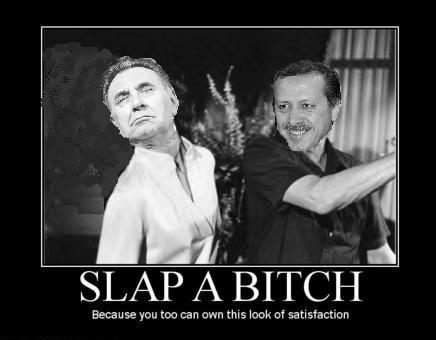

# Hafta 36

Yasemin Congar

Siyasi iktidar ile medya patronları arasındaki marazi ilişkiyi bitirme
potansiyeli taşıması açısından, bu kavga “hayırlara vesile”
sayılabilir. [..] Bu sert kavgada açılmaya başlanan gizli defterler,
bu ülkede medya-siyaset ilişkisinin temizlenmesini isteyenlerin sesini
güçlendiriyor ve bu çok önemli. [..] Erdoğan’ın Doğan’la ilgili
biriktirdiklerini ortaya dökme noktasına gelmesinde bardağı taşıran,
bu grubun son haftalardaki haberciliği olabilir. Ancak Doğan Medyası
deyince Başbakan’ın aklına Ergenekon, kapatma davası, türban davası,
yeni anayasa tartışmaları ve tabii, geçen seneki 27 Nisan muhtırası,
367 kararı, cumhuriyet mitingleri, 22 Temmuz genel seçimleri ve
cumhurbaşkanlığı seçimi sürecinde bu grubun yaptığı yayınlar da
geliyor kuşkusuz.

Ve şundan emin olabilirsiniz ki, kendisine ve partisine karşı kapatma
davası açan, darbe planları yapan, iktidardan düşmesi için iktisadi
kriz çıkmasını bile isteyen zihniyetin tehdidini üzerinde sürekli
hissediyor. [..] Başa dönersem, Erdoğan-Doğan kavgası siyasetle medya
arasındaki kirli pazarlıkları, aldım-verdimleri, imtiyaz
ortaklıklarını deşifre edip Türkiye’de yıllardır süren ve demokrasi
önündeki büyük engellerden biri olan karanlığı yırtma vaadi taşıyor.

Dogru

---

Emre Akoz

[..] iki komutan da konuşmalarını; Habermas, Karl Popper, Francis
Fukuyama gibi Batılı düşünürlerden yaptıkları alıntılarla
bezemişti. [.. A]ynı düşünür ve kavramlardan yararlanarak, bambaşka
yorumlar yapmak mümkün.

Belki

Zorlarsaniz olabilir ama, bunu yapmanin da sinirlari var. Ne kadar
ugrasirsaniz ugrasin, Popper'a "diyalektik iyidir", Fukuyama'ya
"demokrasi tum dunyaya yayilmayacak" sozlerini soylettirmezsiniz. Eger
bu yapiliyorsa, bu, okuyanlarin bu yazarlari anlamadigini
gosterir. Bunu yapiyorlar mi? (GK tefrika, lahika, sahika, konusmalar,
vb. seyleri takip etmedigim icin bilmiyorum).

---

Fehmi Koru

Birey değil cemaat

Yanlis

Dogrusu, hem birey, hem cemaat olacak.

Uretimi bireysel yapabilen yeni kabiliyetli birey, zaten ekonomik
sartlarin ittirmesi, ozendirmesi ve kazandigi paranin artmasi ile
bireyligini daha rahat yasayabilecek, tum ekonomide artan
kisisellestirme (personalization) sayesinde, isteklerini, kendine gore
daha rahat elde eder hale gelecektir.

Kisisellesen uretimin oldugu dunyada bireyler kisisellesir.

Fakat ayni anda, bu kisi, hizli degisim caginda bazi "degismezlik"
adalarina ihtiyac duyabilir. Toffler'in Future Shock adli kitabinin
tamami bu konu uzerinedir. Ve bir cemaat bu adanin ta
kendisidir. Cemaat her boyda, sekilde gelebilir (illa dini olacak diye
bir kural yok). Bir motoksiklet cetesine giren bir kisi de bir
cemaatin parcasidir. Bu cemaatin belli bir giyinisi, konusma tarzi,
yapmayi sevdikleri (motosiklete binmek), okudugu kitaplar, dergiler
vardir. Bu cemaate girerek kisi hem bir hobiyi takip etmekte / sevdigi
bir isi yapmakta, hem de ayni anda bir "yasam tarzi" elde
etmektedir. Bu yasam tarzinin "bilinir", "tahmin edilir", "rituelimsi"
bir tarafi ve bu yuzden hayatin, en azindan bir bolumunu,
basitlestirici bir yani vardir. Basitlik nedir? Mesela Hell's Angels
grubuna giren bir kisi, her gun ne giyerim sorusundan kurtulmus olur:
Her gun siyah deri ceket giyer. Tabii ek olarak, dinlerin vermeye
ugrastigi "niye?" sorusunun cevabi, o cemaat icin elde edilen
kazanimlardan biri olabilir... Ayrica derin bir kultur mevcuttur,
kisisel gelisim sozkonusudur, vs.

Bu konuyu surada aciklamistik.

Gelecekte olmayacak olan, merkeze biat eden "tek tip", patates
baskisindan cikmis kitlelerdir.

---

Mustafa Akyol

Sosyal devlet ilkesi, devletin her vatandaşa belirli bir refah düzeyi
sunması gerektiğini öngörür. Bu ilke bizim anayasamızda yazılı olsa
da, pek zengin bir ülke olmadığımızdan etkili bir biçimde
uygulanamamıştır. Gerçek sosyal devletler Avrupa’dadır. Mesela Fransa
sosyal bir devlettir. Eğer işsiz kalırsanız Fransız devleti ise
‘işsizlik maaşı’ öder. Hasta olursanız tedavi eder. ‘Devlet baba’ya
güvenip huzur içinde uyuyabilirsiniz.

Kulağa iyi geliyor, değil mi? Oysa biraz incelenince bu sistemin
tembellik ve hantallık ürettiğini görürsünüz. Devlet herkese baktığına
göre, kimsenin fazla çalışmaya niyeti yoktur. Yeni bir iş kurup risk
alacağınıza, ‘işsizlik maaşı’na talim edersiniz. Nitekim Fransa bugün
Avrupa’da en az yeni iş kuran ve istihdam yaratan ülkedir. Yaratıcılık
ve yenilikçilikte sınıfta kalmaktadır. Fransız ekonomisi, hemen
kuzeyindeki İngiltere ile karşılaştırılınca epey kötü
durumdadır. Zaten bu yüzden Sarkozy az da olsa ‘Anglo-Sakson modeli’ne
geçmeye çalışmaktadır.

O modelde ise devlet minimum düzeyde bazı sosyal hizmetler verir, ama
toplumu daha çok kendi dinamiklerine bırakır. Bunun sonucunda rekabet
artar ve girişimcilik yükselir, yaratıcılık gelişir. Bugün dünyanın en
büyük ve dinamik ekonomisine sahip olan ABD sosyal devlet değildir ve
zaten başarısını da kısmen buna borçludur.

Peki ABD’de ihtiyaç sahiplerine kim el uzatır? Başka herkesten önce,
Orgeneral Başbuğ’un hiç sevmediği o dini cemaatler. Dünyanın en
‘kapitalist’ ülkesi olan Amerika, aynı zamanda hayırseverliğin en çok
kurumlaştığı ülkedir. Amerikalıların kiliselere ve diğer hayır
kurumlarına yılda aktardığı bağış miktarı 300 milyar dolar gibi dev
bir rakama ulaşmaktadır. Bu parayla ücretsiz veya çok ucuza aş evleri,
bakımevleri, hastaneler ve bin bir türlü yardım kuruluşu
işletilir. ABD, milli gelirinin yüzde 1.7’si ile ‘dünya bağış
şampiyonu’dur. Onu 0.73 ile İngiltere izler. Aynı rakam Fransa’da
sadece 0.14’tür.

Yani çoğu Fransız, yardıma muhtaç insanlara ‘git, sana devlet baksın’
demektedir.

Dogru

Ek olarak; Fransiz "memurlar" yardimseverleri kendine rakip olarak ta
gorur: Durum Fransa'da o kadar vahimdir, "memurlar" hayatin her
alanina o kadar mudahil hale gelmistir ki, bugun Fransa'da birilerine
yardim amacli birsey yapmak neredeyse suc haline gelmistir.

---

Mehmet Altan

Ataturk dokuzu bes gece oldu der resmi tarih, hicbirimiz dusunmeyiz,
sahiden oyle mi diye; tam memurlarin ise baslamasindan bes dakika
sonra mi öldü? [2]

Mantikli

:) Yani, memurlarin bu saati uydurmus olmasi mantikli... Hayatin her
alanina mudahil olmaktan bahsediyorduk degil mi?

[1] Hacir, G., Refleks, Salyangoz Yayinlari, 2007, sf. 74.

[2] Er, D., A., Mehmet Altan: Ikinci Cumhuriyet'in Yol Hikayesi, Hayykitap, 2008, sf. 60

---

Taha Akyol

[..] Abdullah Gül’ün Ermenistan’a gitmesini eleştirirken “Ne değişti?”
diye soruyor. [..] Bu önemlidir. Evet, ne değişti? [..] On beş yıl
geçtikten sonra gelinen nokta, on beş yıl önceki gibi değildir. Bir
yanda soykırım iddiası Batı’da daha geniş bir kabul görerek Türkiye’yi
sıkıştırmıştır... Öbür yanda Türkiye’nin Kafkasya politikası
Ermenistan’ı izole ederek enerji ve ulaştırma hatlarının dışında
bırakmıştır; bunun sonucu olarak açlığa sürüklenen Ermenistan’da
Türkiye ile ilişki kurma eğilimi güçlenmiştir.

Eksik

Bu konu hakkinda Economist'te guzel bir yazi cikti. Yazinin tezi
sudur: Turkiye, son Gurcistan isgali sebebiyle bundan sonraki krizleri
daha iyi idare edebilmek icin yeni bir Kafkas Stabilite ve Ortaklik
Platformu (KSOP) ortaya atti. Bu platform Rusya ve Gurcistan basta
olmak uzere, Ermenistan ve Azerbeycan tarafindan kabul gordu, ama
bolgedeki aktorlerin hicbiri bunun bir yere ulasmayacagini
dusunuyorlardi. Bu umutsuzluklarinin sebebi, bu platforma dahil olmasi
gereken Ermenistan ile Turkiye'nin diplomatik iliskisinin olmamasiydi
(Karabag sorunu yuzunden). Fakat son Kafkasya olaylari, Turkiye'nin
tum bolgede olan cikarlarinin aciliyetini arttirdi. Yani son
Ermenistan yakinlasmasi, Turkiye'nin KSOP'yi bolgede aktif hale
getirebilmesi icin gereklidir.

Muhakkak bu yakinlasmanin soykirim iddialari ve taraflari uzerinde
yapici bir yan etkisi de olacaktir. TV'de mactan once yapilan
roportajlarindan birinde, ABD Silikon Vadisinden Amerikan aksani ile
Turkce konusan bir Ermeni Amerikali (inanilmaz bir karisimdi) birisini
gordum. Mac haberini duyunca gaza gelip, ucaga atlayip, maci
seyretmeye gelmis. Bu yakinlasmanin diyaspora uzerinde bu gibi yapici
etkisinin olacagi kesin.

Economist yazisinda bir diger vurgulanan, Turkiye'nin Ermenistan'i
izole etme politikasini simdiye kadar basarili olmadigi icin, artik
komsusu ile "konusmaya da" bir sure once baslamis olmasidir. Bu
konusmalar uzun zaman gizlice yurutulmustur, ama bir sure once durum
basina sizmistir (Economist'e gore bunu yapan da buyuk ihtimalle
kizgin bir Azerbeycanlidir).

Ozet: Turkiye/Ermenistan yakinlasmasi gayet acik bir realpolitik
gerekliligin cercevesinde gelismektedir.

Not: Uluslararasi iliskilerde yapilan onemli hareketleri "bir onceki
buyuk olay"'a baglamaya ugrasmak ise yarar... Konustugumuz ornek
baglaminda bu "buyuk olay" nedir? Gurcistan isgalidir! O zaman bu
cercevedeki aciklamalari aramak gerekir (tabii sonra o aciklamalari da
elekten gecirmek). Aktorlerin ne dedikleri degil, her zaman "en onemli
stratejik amaclari" onemlidir, eylemler buna gore sekillenir. Aktorler
her zaman rasyonel de olmayabilir, kultur kodlarinin esiri bir sekilde
hareket ediyor olabilirler. O zaman etkili analiz icin burnunuz iyi
koku alacak, rasyonalite/degil zamanlarini hissedeceksiniz, ve
zamanlamayi her zaman gozeteceksiniz. Dunya hayatinda degismez "onemli
maddeler/seylerin" ne oldugunu bir kere bileceksiniz. Nedir?
Petrol. Para. Ticaret. Teknoloji. Yakinda: Su. O zaman rezervleri
Suudi Arabistan'a rakip olan Irak isgal edilince saf saf "sebep petrol
degildi" deme durumuna dusmezsiniz. Bunlar Strateji 101 (bu son
paragraf ortaya atilmis bir beyandir, Akyol'a hitaben soylemiyorum).

---

Gokhan Ozgun

Post-modernizmde yuvalanmış en büyük ‘tehlike’ nedir, bilir misiniz?
Sonunda ‘hakikatin’, sözde ‘objektif’ olanın, yani ‘gerçekliğin’ önüne
geçmeyi başarmasıdir.

Karisik, kelime yanlis

Oncelikle: Hakikat ve gercek kelimeleri birbirinin aynidir. Sozlukte
hangisine bakarsaniz, aciklamak icin digerini referans verir. O zaman
postmodernizm yorumunu su sekilde degistirmek daha iyi olabilir:
"Postmodernizmde yuvalanmis en buyuk tehlike objektifligin ayaklar
altina alinmasi, ve bir "yenilik" kisvesi altinda gayet cig bir bilim
karsitligi ve subjektivizmin pazarlanmasidir". New Age Bullshit.

---

Cemil Ertem

Türkiye’nin eğitim sorununa köklü bir çözüm bulabilmesinin yolu, her
şeyden önce, var olan yoksullaştırıcı ve akıl dışı ekonomi
politikalarından vazgeçmesinde yatıyor. Çözümün ikinci adımı da eğitim
için bir model geliştirmek ve onda ısrar etmek. Bugün Türkiye’de
devlet eski ve çürümüş bir eğitim sisteminde ısrar ederken, eğitime
yatırım yapan özel sektör de onu taklit ediyor.

Tabii burada okullaşma oranı, bütçeden eğitime ayrılan pay, bölgesel
eşitsizlikler gibi devasa ve bu köşenin çapını aşan sorunlara
değinemiyoruz. Burada üzerinde durduğumuz ve anlatmak istediğimiz
Türkiye’nin bu eğitim modeliyle eğitime bütçeden yüzde 3-4 değil,
yüzde 10-15 gibi oranlar ayırsa bile eğitim sorununu
çözemeyeceği. Dolayısıyla işsizliği de çözemeyeceğini söyleyebiliriz.

İrlanda 1987’den sonra geliştirdiği modelle hem milli gelirini
arttırmış hem de eğitim sorununu çözmüştür. Ama İrlanda’nın milli
geliri artarken gelir dağılımı da düzelmiştir. Bu eğitim sorununun
çözülmesi için ilk adımdır.

İrlanda eğitimde sağladığı başarıyla Doğrudan Yatırımları kendisine
çekerek tam istihdama yaklaşmıştır. Dünya rekabet sıralamasında,
İrlanda hızla yükseliyor. Bunun anlamı İrlanda Ar-Ge yapıyor, kaliteli
ve markalı, teknoloji yoğun mal üretiyor demek. Bu katma değeri yüksek
maldır; bunu dünyaya sattığınız zaman yalnız milli geliriniz
yükselmez, gelir dağılımınız da düzelir. Çünkü bu malı ancak bunu
üretecek eğitimi almış insanlar üretir. Bunlara da üreticiler dünya
standartlarında ücret ödemek zorundadır. Yoksa bu işgücü başka yere
gider. Örneğin Avrupa’nın başka bir yerinde rahatça iş
bulur. Dolayısıyla bir ülkenin eğitime yatırım yapması, ezberci ve boş
bir eğitim sistemi yerine yaratıcı ve bilişim dünyasına ayak uyduracak
bir eğitimi öne çıkarması geleceğini de kurtarması demektir. Kimse
demesin, İrlanda’nın nüfusu dört milyon bizimle karşılaştırılmaz;
karşılaştırılır önemli olan nüfus değil model ve anlayıştır.

Katiliyorum

Asaf Savas Akit[..] örneğin işsizlik hızla artınca devlet aracılığı
ile onlara iş yaratmanın, yardım etmenin yolları aranır ve
bulunur.Problem bu kafada zatenDevlet bulur, devlet yapar.. Bazen
devlet "surasi benim icin onemlidir" der ve orada piyasa disi bir
mekanizma olusturur. Sonra dinamik girisimciler gelirler, o
mekanizmanin saginda, solunda, cevresinde, ustunde paketleye,
paketleye bambaska servisler olustururlar; Yaparlar, cunku
firsatcidirlar, ama is o kadar olur ki artik bu sistemde devlet elini
goremez hale gelirsiniz - ama altta o curumusluk durmaktadir.Sonra bir
gun alttaki mekanizma bir coker ve gerisi pamuk ipligi gibi
cozulur. Ve kendini bilmez bazilari gider bu durumdan firsatcilari
suclarlar. Tekrar soyluyorum: Yollari yaparsan o yollarda gidecek
arabalar olur. Firsati olusturursan, firsatcilar oraya
ususurler. Kapitalistler zaten surekli firsat pesindedir, hele Amerika
gibi bir ulkede... Programci bir arkadasim, hic unutmam, Furby denen
oyuncagin ciktigi yillardi - bir Furbymania esiyordu. Bu arkadas bir
oyuncakci dukkaninin yanindan geciyormus, tam da Furby'lerin satilmaya
basladigi ana denk gelmis. Bu da hemen iceri dalmis aninda 10 tane
Furby almis! Noel geliyor biliyor ki talep olacak. Noel'e kadar
bekledi sonra Furby'leri 3 kati fiyatla eBay uzerinden catir catir
satti!

Kapitalist bunu yapar.  Firsat alani olusturursan, oraya gelen
olur. Ayni sekilde, eger ortada "garantiligi" nispeten yuksek bir
durum olusturursan, tatli kar imkani fazla olur ise, insanlar, yani
sistemin isleyen aktorleri bu tarafa dogru akarlar.Gokhan
OzgunHayatımda çok çok az müze gezdim. Müze gezmeyi hiç mi hiç
sevemedim. Bunun nedenini de, kitaba olan düşkünlüğüm gibi, hiçbir
zaman anlamamıştım.Ben deMuze gezmeyi ben de sevmem. Sebebini soyle
rasyonalize ettim; Bizim cagimiz "istedigim sey istedigim anda
(on-demand)" cagidir ve medya bize dijital olarak gelir. Endustriyel
cag icin onemli bir kavram olan senkronizasyon bizim icin onemsizdir -
muze acildiginda, kurumus, soguk, olu ve Ozgun'un dedigi gibi "baskasi
icin onemli olan" eserleri gezeceksin, bu bizim icin olmekten
beterdir... Bu eserleri gezme etrafinda "efendim bunlari bilmek
entellektuelligin bilmemne gostergesidir" gibi bir kultur
olusturulmasi da bizim umrumuzda degildir. Gorulecek onemli bir sey
varsa, Net'e tasirsin, 3D imajlar da konulabiliyor, koyarsin, istersek
istedigimiz anda goruruz. Istemezsek gormeyiz.Dijital dagitimin
eglence tuketimini nasil degistirdigi hakkinda bir yazimiz yakinda
gelecek.Etyen Mahcupyan Başbakan Erdoğan’ın Doğan grubunu hedef alan
sert tutumu genel olarak tepki gördü ve hatta bu tavrın basın
özgürlüğüne ve demokrasiye aykırı düştüğü söylendi. Ancak mesafeli bir
yaklaşımla baktığımızda [..], Doğan grubundaki medya organlarının
dramatik abartmalarını ciddiye almak zor.[..] meselenin arka planına
gittiğimizde Erdoğan’ın Doğan grubuna nazaran daha ‘temiz’ olduğuna
dair yaygın bir kanaatin olduğunu gözardı edemeyiz. Bunun nedeni ilan
gelirlerinin neredeyse dörtte üçüne hâkim olan bu grubun, geçmişte
siyasi iktidarlar üzerinden birçok ekonomik imtiyaz elde etmiş
olması. Nitekim bu son gerilimde de Doğan grubunun satın almış olduğu
Hilton Oteli arazisine rezidans inşa etme isteğinin etkili olduğu
anlaşılıyor. Görünen o ki, bu talebin resmî makamlarca reddedilmesine
rağmen ısrarcı olan Doğan Grubu işi hafif yollu şantaja kadar
götürmüş. Bunun üzerine zarar etmekte olan CNN-Türk’ün acilen
gereksindiği kara frekansını da hükümet engellemiş. Ancak Doğan grubu
buna elde tutmakta olduğu Deniz Feneri kartını oynayarak cevap
vermiş... Ve böylece Erdoğan’ın ilişkiyi afişe ettiği noktaya kadar
gelinmiş.Ancak olay biraz daha karmaşık... Doğan grubunun geçmişte
yakın olduğu ve imtiyaz ürettiği hükümetlerin ortak bir özelliği
vardı. Bunlar laik kesimin taleplerini öne alan, bu kesim içindeki dar
bir işadamı grubuna çıkar sağlayan ‘merkez’ iktidarlardı. Taşranın
ülkenin batısında yoğunlaşan ekonomik tahakküm karşısında sürekli
kaybettiği bir paylaşım süreciydi bu... AKP ise tam tersine giden bir
değişim dinamiğinin ürünü. Bu parti Anadolu’da yükselmekte olan yeni
bir burjuvazinin ve kentleşmenin temsilcisi. Üstelik AB üyelik
sürecinin yaşandığı, küreselleşmenin Türkiye’yi bölgesel olarak
dünyaya entegre ettiği bir dönemin içindeyiz. Bunun anlamı AKP’nin
taşıdığı yeni ekonomik sınıfın, yerleşik laik burjuvaziye muhtaç
olmadan dünya ile ilişki kurmasıdır.Dahası AB sürecinin çoğulcu
demokrasiyi ve çoğunluk iktidarını ima etmesi nedeniyle, söz konusu
yeni burjuvazinin uzun süreli bir iktidar olanağı doğmuş
durumda. Diğer bir deyişle Türkiye AB çizgisinde kaldığı, demokrasisi
sekteye uğramadığı sürece, ekonomik alanın da geçmişe nazaran epeyce
farklı bir paylaşım tablosuna yol açması kaçınılmaz. Kısacası
demokrasinin yeni bir sınıfsallaşmayı beslediği, imtiyazların artık
eski sahiplerine gitmeyeceğini ima eden bir dönemin içindeyiz. Bu
durum Doğan grubu ve onun gibi şirketlerin geçici bir yenilgi ile
değil, piyasadan silinme tehlikesi ile karşı karşıya olduklarının da
habercisi. Çünkü bu şirketlerin hiçbiri bugünlere rekabetçi koşullar
altında gelmediler ve dolayısı ile hiçbiri iyi yönetilmiyor...Söz
konusu arka plan Doğan grubunun son dönemdeki gazeteciliğini de
açıklıyor... Anayasa Mahkemesi’nin 367 kararını, 27 Nisan’da askerin
e-muhtırasını destekleyen, aylarca Ergenekon haberi vermediği gibi,
darbe girişimini de küçümseyerek gizlemeye çalışan bu kendine has
habercilik, aslında Doğan grubunun ne denli sıkışmış olduğunun da
göstergesi. Çünkü bugün basın özgürlüğü ve demokrasi havariliği yapan
söz konusu yayın organları, epeyce uzun bir süreden bu yana
demokrasiyi rafa kaldıracak bir darbe girişiminin de dolaylı
destekçiliğini yapmaktaydı.Anlaşılan o ki, laik kesim içinde ekonomik
avantajlarını yitireceğini anlayan bazı kesimler, demokrasi içinde bir
çıkış yolu göremedikleri ve kesin bir yenilgiye doğru gittikleri
değerlendirmesini yaparak daha da ‘devletçi’ bir çizgiye kaymakta beis
görmediler. Aslında bu kesimin ille de darbe veya askerî idare
istediğini öne süremeyiz. Onların istediği AKP’nin gitmesi ve
geçmiştekine benzer bir ‘merkez’ hükümetin başa gelmesi. Bu
alternatifin görünür gelecekte demokrasi içinde olamayacağının
anlaşılması ise, muhtemelen şimdiki siyasi tercihe ve ona uygun bir
‘gazeteciliğe’ yol açmış durumda...Erdoğan ise artık şantaj ve
pazarlığa ‘eyvallah’ demeyecek gibi gözüküyor... Bu daha fazla çatışma
demek ve seçimlere yaklaşırken karşımıza muhtemelen bir medya savaşı
şeklinde çıkacak...

Dogru

---

Etekler Tutustu

John McCain apar topar secim kampanyasini birakip Washington'a kostu,
ve burada "gundemdeki kurtarma plani gecinceye kadar kampanyami
durduruyorum" mesajini verdi. Muthis taktik gibi dusunulmesin -
arkasinda ciddi bir evham yatiyor. Son anketlere gore ABD'de yasanan
finansal kriz McCain'in oylarinda dususe sebep oldu, Obama one
gecti. Her ne kadar hem McCain hem Obama da 700 milyar dolarlik
kurtarma planini destekliyorlarsa da, eger plan gecmezse, ve/yada
ortalik duzelmezse, bunun faturasi Cumhuriyetcilere yazilacaktir.

Muhafazakar dusunur/yazar Fukuyama gecende bir soz soyledi; Duyanlar
olabilir, Irak Savasi'ni destekleyen sonra hata yaptigini soyleyen bu
muhafazakar dusunur Obama'yi destekledigini acikladi. Bu karara nasil
ulastigini sorduklarinda soyle cevap verdi: "Bir eleme sureci (process
of elimination) uyguladim. Bence Cumhuriyetcilerin bir ucuncu donemi
haketmiyorlar. Geri kalanlardan, Hillary'den hic hazzetmiyorum (ABD'de
boyle yeminli Hillary dusmanlari coktur, ben de hic sevmem), bu
elemeden geriye sadece Barack Obama kaldi".

McCain bu kriz sirasinda Cumhuriyetci partiyi toparlayamazsa,
bahsedilen "eleme" surecini uygulayacak insan sayisi artacaktir.

Ah bu arada: ABD secimlerinde isleyen genel bir kural, secimlere
"bolunmus" olarak giren partinin, o secimleri hep kaybediyor
olmasidir. Cumhuriyetciler kurtarma plani hakkinda ciddi bir bolunme
yasiyorlar. Cunku Cumhuriyetciler icinde sIkI liberteryenler vardir ve
bu adamlar oyle paranin etrafa haldur huldur sacilmasindan hic
hazzetmezler. Batan batsin derler. Tabii kurtarma isi hikayenin
yarisi. Isleri buraya getiren devletciligin daniskasi ama o tarafi
uzun sure "caktirmadan" yaptilar, simdiye kadar hissedilmemisti.

Yani McCain bu bolunmeyi durdurmak icin geri dondu aslinda. Geveledigi
laflara bakin, "birleselim, Cumhuriyetci/Demokrat kardes olalim,
partizanlik yapmayalim" gibi bir suru karin agrisi. Arada "kaynamaya"
ugrasiyor, durum bu.

Bir yandan "isin basinda" goruntusu vererek, "daha iyi yonetici"
ayaklarina yatiyor.

Strateji ise yarayacak mi zaman gosterecek. Eger Cumhuriyetciler korku
politikalarinda ve kultur kodlari manipulasyonlarinda basarisiz
olurlarsa (Obama tarafi engelleyebilirse) Obama'nin alma sansi
artar. Obama'nin zenci olmasinin secimde buyuk bir etkisi yok,
baskanliga cok yaklasan ilk zenci zaten o degil. Clinton ikinci donemi
oncesi Colin Powell butun anketlerde ezici bir populerite ile "istese
olur" kesinligi gosteren bir durumdaydi (bu anketlere guvenin, Bush II
icin aylar once ayni anketler fikir vermistir, ve iyi ekonomiye ragmen
herif secilmistir). Clinton'un bu durumdan cok rahatsiz oldugu
zamaninda Beyaz Ev'de calisanlarin anilarinda islenmisti.

---

Taraf dun yanlis bir sekilde ABD'de kurtarma planinin gectigini
yazmis. Herkesin bildigi gibi plan gecmedi. Bu haberi baz alan kose
yazarlari da o yonde yorumlar yapmislar; Ortaya ilginc bir "alternatif
tarih" durumu cikmis. Bu hatanin nasil ortaya ciktiginin dinamigini
aslinda ogrenmek isteriz. Bir sey yetistirmek icin, olurlugu yuksek
olan bir olay manset olarak atmak mubah midir? Hata yabanci basini
takip eden kiside midir? Oyle ise bu kisi fena cuvallamistir.Bu hata,
tabii ki Ergenekoncu medyanin yaptiklari ile karsilastirilamaz. Bu
cenah bilerek/amacli olarak yalan yaziyor - arada fark var.

---

Vur Tayyip

---

Yeşilci / çevreci cenahta da bazı hurafeler var; Wired dergisi su
yazida bu hurafeleri cevaplandırmış, ve tam tersinin çevre için daha
iyi olabileceğini belirtmiş. Mesela nükleer enerji gibi "klasik
yeşilcilerin" uzak durmak istediği teknolojilerin, aslında çevre için
daha iyi olduğunu belirtmiş. Tüm tavsiyeleri altta listeledik:
1. SEHIRLERDE YASAYIN: Şehir yaşamı gezegen için çok daha iyi.
2. KLIMA FAYDALI: Klima ile hava sıcaklığını ayarlamak, ısıtmaktan
daha az CO2 salınımına sebep oluyor.  3. ORGANIK YIYECEKLER CEVAP
DEGIL: Sürpriz! Klasik tarım yöntemlerinin gezegene daha az zararı
var.  3. ESKI AGACLARI/ORMANLARI KESIN: Ağaçların yası arttıkça CO2
emmekten ziyada atmosfere CO2 atmaya başlıyorlar.  4. COZUM CIN: Çin,
şu anda alternatif enerji donanımında en önde gidiyor. Bunu yapıyorlar
çünkü yapmak zorundalar. Küresel ısınma Çin'in kıyılarını sel, iç
bölgelerinde ise kuraklık ile tehdit ediyor.  5. GENETIK MUHENDISLIGI
KABUL EDIN: Çok verimli "Frankenyiyecekler (bu isim Frankenstein'dan
geliyor) " sera gazi emisyonunu azaltıcı katkıda bulunabiliyor.
6. KARBON ALISVERIS SISTEMI ISLEMIYOR: Karbon alışveriş fikri iyi bir
fikirdi, ama fayda getirmesi çok zor.  7. NUKLEER ENERJI KULLANIN:
Kabul edin. Nükleer enerji büyük kapasitede enerji sağlayabilecek en
çevreci enerji formu aslında.  8. HIBRID ARABA DEGIL - IKINCI EL
ARABA: O yeni Prius'u satın almayın! Onun yerine kullanılmış bir
arayaba bakın.  9. EN KOTUSUNE HAZIR OLUN: İklim değişikliği bir
gerçek. Buna alışın.

---

