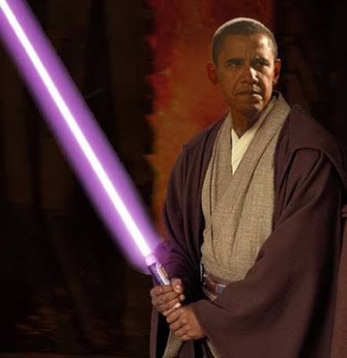
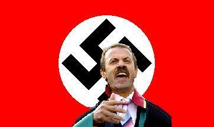

# Hafta 40

Hadi Uluengin

Dolayısıyla, heyhat ve kuşku yok, deyimin piçleşmesine göz yumduğu
içindir ki, Yaşlı Kıta kendi ihtiyarlamasına paralel olarak "liberal"
sözcüğünü de ihtiyarlatmıştır. Ama genç Yeni Dünya bunu yapmadı ve
deyimin gerçek anlama sadık kaldı. EVET, Amerikalar, bilhassa da ABD
bunu yapmadı.

Belki

Bunun tersini iddia eden eserler de var; Yani ABD'nin liberal
sozcugunun anlamini yanlis sekilde degistirdigini soyleyenler. Bu
konuda haksiz olduklarindan cok haklilar bence - cunku ABD'de olan
degisikligin oradaki kulturel bir fay hatti ile alakasi var. Ama oraya
gelmeden once; Bir: Oncelikle serbest piyasa ABD'de Avrupa'da oldugu
kadar sorgulanmiyor. Entegrator elit "caktirmadan" kendi cikarlarini
araya sokusturmaya ugrasiyor, ama bu da bir yere kadar. Fakat halkin
nedzinde kapitalizm coktan kabul gormus bir anlayis. Yani liberal
kelimesinin ekonomik serbestiyeyi temsil etmesi icin ortada buyuk bir
sebep yok.

Iki: ABD'de bir kultur fay hattinin "ozgurluk vs. sakinma/yasak"
noktasindan gectigini belirtmistik. Iste "liberal" kelimesi
muhafazakarlarin elinde bu noktada tam bir silaha donusebiliyor, cunku
serbestlik anlamina gelen bu kelimeyi "davranislarda serbestlik
(liberal in attitudes)" gibi karsi tarafin kafasina cakabiliyorsun.

Cumhuriyetci Parti'nin en unlu politik operatorlerinden biri olan Lee
Attwater (ki kendisi W Bush'u iki kere sectiren Karl Rove'un hocasidir
-burada Darth Vader'in hocasi Imparator ornegi aklima geldi nedense
(!) -) bu teknigi mukemmellestirmisti... Attwater'in tavsiyesi ile
Reagan, Bush I, sonra II "liberal" kelimesini bir kufur haline
getirdiler; Bunu yapabildiler cunku halkin duygusal zihninde
sakinmanin tersi "acilma, sacilma, bohemlik, vs" gibi bir
"serbestlik", yani "liberallik" cagrisimlari yapabiliyordu... Zaten
60, 70'li yillarda boyle bir dolu hippi etrafta geziniyordu, bu sayede
Attwater gibileri bu kelime uzerinden muhafazakar kesmi mobilize
edebildiler.

Fakat hippiler isin sadece bir yuzuydu tabii, onlarin ve diger pek cok
alternatif hayat seklinin ortaya cikmasinin sebebi 1952'den itibaren
isgucunde agirligin beyaz yakali iscilere dogru kaymis
olmasiydi. Attwater ile cok sonralari yapilan bir roportajda, negatif
tekniklerinin ise yaramasinin sebebinin "insanlarin gelecegin
belirsizliginden korkar" halde olmasinda yattigini
soylemisti. Gelecegin belirsizligi niye artmisti? Cunku ekonomik
aktivite cok daha hizlanmisti, bunun sebebi de isgucundeki aktorlerin
hareket alaninin cok daha fazla genislemesiydi. Isin bu tarafindan
daha once pek cok kez bahsettik.

---

Tayfun Acarer (Telekomünikasyon Kurumu Başkanı)

[..] internet yasaklarına çözümün yolu Youtube gibi sitelerin
“Türkiye’ye özgü kopya” üretmelerinden geçiyor.

Yanlis

YouTube'a benzer siteler Turkiye'de var zaten, mesela
Timsah.com. Ilginc bir nokta: Bu siteler iceriklerini cesitlendirmek
icin YouTube'dan icerik kopyaliyorlar.

TA

[..] bunun yapılması durumunda ‘sadece zararlı içeriğe engel
getirileceğini’ söyledi

Sacmalama

Ona yapamiyorsan, otekine niye yapamiyorsun? Bos bos konusma..

---

Cemil Ertem

Aslında bu değişimin çok büyük olacağını McCain de sezdi. Ve “beni
seçmezseniz Amerika’ya sosyalizm gelecek” deyiverdi. Oysa gelenin,
kapitalizmin onu ve onun gibileri tasfiye edecek yeni bir yüzü
olduğunu biliyor.

Dogru

---

Murat Belge

Abraham Lincoln’un ünlü sözünü bu duruma uyarlayabiliriz: “Halkın bir
kısmını her zaman korkutabilirsiniz; bütün halkı bir zaman
korkutabilirsiniz; ama bütün halkı her zaman korkutamazsınız.”

?

Uyarlayabiliriz derken, "korkmak" degil "kandirmak" kelimesini
koymaktan mi bahsediyor Sn. Belge? Eger oyleyse dogru. Degilse yanlis.

---

Deniz Gokce

Son dönemde ise, global petrol fiyatlarının azarak 150 dolara çıkması
ile dolar biriktirip şımaran Putin, birkaç yıl dünya âleme posta
atmış, üstelik de son dönemde Gürcistan’ın bir bölümünü işgal ederek
ABD ve Avrupa ile de kapışmış, show yapmıştı. Çünkü 150 dolarlık
petrol ve benzer hızla artan doğalgaz fiyatları Putin’i de “gaza
getirmişti”. Ama petrol fiyatı bugünlerde yarıya inince işler
değişti. Peki şimdi neler oluyor?

Dün aktardım! 1 Ağustos 2008 tarihinden bu yana geçen 2.5 ayda
Rusya’dan çıkan toplam fon miktarı 74 milyar dolar. Rusya’daki en
zengin 25 Oligarch’ın varlığı mayıs ayından bu yana 230 milyar dolar
düşmüş, çünkü borsa çöktü! Serveti halka açık şirketlerde olan en
zengin 10 “oligarch” zatın varlıkları, 1 Ocak 2008 değerlerine göre
sadece üçte bir düzeyine düşmüş (yani geride yüzde 34 kalmış) ve 43
milyar dolara inmiş. Rusya Merkez Bankası’na göre de Ruslar bu yıl
sonuna kadar 47.5 milyar ve daha da fenası, 2009 sonunda da yurtdışı
kreditörlere 160 milyar dolar ödeme yapmak zorunda imişler!

Putin ve Medvedev bir yandan cümle âleme posta ata dursun [..] şimdi
biraz susması, reform ve Bolivar devrimi sohbetini de küllendirmesi
gerekecek! Aynen Putin ve Medvedevíin tüm âleme postayı frenlemesi
gerektiği gibi!

---

Dogru

Rusya'nin fi tarihinde Afganistan'i isgalinin altinda yatan yine
benzer sekilde o zaman artmis olan petrol fiyatlarindan "sarhos"
olmalari ve saga sola saldirmaya baslamalariydi, Gokce'nin tabiriyle
"posta koymak" diyelim. Boylarinin olcusunu aldilar tabii, fakat
tarihten ders almayanlar onu tekrar etmeye mecbur kaliyorlar. Tek
dogru yol var (liberal demokrasi) fakat bazi insanlar bu yone gitmeden
diger tum secenekleri denemeye kesin kararlilar gibi. Olsun,
denesinler.

---

Mahir Kaynak

Yeni ABD başkanının McCain olacağını sanıyorum ve bu sonuca varırken
dünyanın geleceğinin nasıl planlandığını ve bunun için en uygun
politikanın ne olacağını tahmine çalışıyorum. Görünüş benim yanıldığım
yönünde ve Obama önde. Seçim benim için bir sınav olacak

Kafayi Duzgun Vidalamaniz Lazim

Obama, degisen uretim metodunun (kol bazli degil kafa bazli) siyasi
yansimalarini temsil ediyor - eger bu ayrimi kacirdiysaniz analiziniz
daha bastan cuvallayacaktir. Bu tahmini iskalayan herkes "modern"
kafada gidiyor, bu analizlerden bir an once kurtulunmali... Ortada bir
savas var ama bu cok gorunur bir savas degil... Cekisme Exxon ile
Google arasinda.

Yani bu iki ucun temsil ettigi gorusler arasinda.

---

Abdullah Karatas

Hükümet bundan altı ay önce Bear Stearns ve Lehman Brothers
şirketlerine indirimli kısa vadeli krediler vermeyip, batmalarına izin
verse idi; bu krizi yaşamayabilirdik. İleriye bakınca, çıkarmamız
gereken sonuç, krizleri önlemede daha çok devlet müdahalesi yerine,
daha az devlet müdahalesi olması gerektiğidir. Hükümetin yapacağı
büyük çaplı yardımlar, vergi ödeyenlerin paralarının batan ve kötü
yönetilen bankaların finansmanı için kullanılması anlamına
gelmektedir.

Geçtiğimiz seneden bu yana küresel finansal piyasalarda yaşananlar
artık, insanların küresel kapitalist sistemin etkinliği üzerinde ciddi
şüphelere sahip olmasına neden oluyor. Bu şüpheler, kritik birkaç
noktayı kaçırmamıza neden oluyor. Öncelikle kriz tam anlamıyla özgürce
çalışabilen serbest piyasa sisteminin ürettiği bir kriz değil, serbest
piyasa sisteminin tam anlamıyla işlememesinden kaynaklanıyor. Amerikan
hükümetinin piyasalara yaptığı devasa müdahaleler ve şimdilik
reddedilen ancak yeni görüşmede kabul edilmesi yüksek ihtimal olan 700
milyar dolarlık bir yardım paketi ve büyük finansal işletmelerin
devletleştirilmesiyle; yaşanan kriz daha da komplike bir hal alacak ve
diğer pek çok soruna da yol açılmış olacak.

FED KRİZİ ALTI AY ÖNCE ÖNLEYEBİLİRDİ

Bugün yaşanan finansal kriz, aslında altı ay önce Amerikan Federal
Hükümeti’nin, FED vasıtasıyla zor bir dönemden geçen Bear Stearns ve
Lehman Brothers şirketlerine açtığı indirimli kısa vadeli krediler
verilmeseydi önlenmiş olunabilinirdi. Ancak Federal Hükümet müdahale
etmeyi seçti, Bear Stearms ve Lehman Brothers’ın iflasına hareketsiz
kalmadı. Serbest piyasalar, ekonomi içerisinde kaynakların etkin
dağıtımı sürdüğü ölçüde işler. Devlet müdahalesi olduğu ölçüde,
doğrudan ya da dolaylı olarak, kaynakların etkin dağıtımı ilkesinden
taviz verilecek ve kötü yönetilen şirketler piyasada var olmaya devam
edeceklerdir. Bear Stearns ve Lehman Brothers şirketleri de işte bu
durumda olan yani kötü yönetilen şirketlerdi. Federal Hükümet bu
şirketlerine kredi musluklarını açarak problemi daha da
karmaşıklaştırdı ve piyasada tam anlamıyla bir güven bunalımına neden
oldu.

Eğer bu şirketlerin altı ay evvel batmalarına izin verilmiş olunsaydı,
küresel sistem bugün yaşadığımız ölçüde bir krizle karşı karşıya
olmazdı. Bugün sorun sadece Bear Stearns ve Lehman Brothers
şirketlerinin çöküşü ve hızlı bir şekilde satımı değil, aynı zamanda
Merrill Lynch, Washington Mutual, Fannie Mae ve Freddie Mac’te de
benzer bir durum söz konusu.

2000 YILINDA İNDİRİLEN FAİZ DE HATAYDI

Hesap sorma gününü ertelemek sadece problemi daha da patlayıcı bir
hale soktu, öyle ki dünya tarihinin gelmiş geçmiş en büyük likidite
krizlerinden biriyle karşı karşıya kaldık. Ayrıca unutmamak gerekir
ki, bugün yaşanan krizin kökeninde çok yanlış bir şekilde 2000
senesinde devletin yaptığı yanlış müdahaleler de yatıyor. O sıralarda
‘dot.com’ skandalı nedeniyle yaşanan türbülans, devletin sert bir
şekilde faiz indirimiyle tedavi edilmeye çalışılmıştı.

Düşük faizler hem bireylerin hem de şirketlerin ellerinin
kuvvetlenmesine neden oldu. Tabii bu noktada olumsuz sonuçlar da
oldu. Örneğin emlak piyasasında artan fiyatlar, küresel kredi
piyasasında yaşanan olumlu hava ve daha önceleri risk analizlerini çok
dikkatli yapan yatırım bankalarının, ucuz kredi bulunmasıyla artık
yatırım kararlarında daha gevşek davranmalarına neden oldu.

Bu durumun sona erişi, reel ekonomiden gelen şokla başladı. Zira petrol fiyatları rekor kırıyordu, Irak’ın işgali sonrası dönemde yaşanan istikrar sorunları ve Basra Körfezi’nde petrol stoklarını etkileyecek yeni bir savaş korkusu da vardı. Buna Irak ve Afganistan’daki savaş nedeniyle ortaya çıkmış olan çok ciddi bir reel maliyeti ve bu maliyetin de, vergi ödeyenlere çok ciddi bir külfet yarattığını hesaba katmak gerekiyor. Bu tablo, hükümetin açığını arttırıyor, gittikçe şişen masraflar üzerinde bir kontrol mekanizması oluşmasını engelliyordu.

Emlak fiyatları düşmeye başladı ve FED krizi engellemek amacıyla faiz
oranlarını indirmeye devam etti. Finansal balonun yaratılmasının bir
suçlusu da bir anlamda bu hamleydi. Faizler iyice düştükçe, artık
indirmenin de bir çare olmayacağı ortaya çıkıyordu. Ek olarak,
enflasyon çirkin yüzünü göstermeye başladıkça, FED enflasyonu önlemek
amacıyla faizleri arttırıyordu.

Finansal balon, ciddi olumsuz sonuçlarıyla birlikte patladı. Yatırım
bankaları ve büyük ölçekli küresel bankalar, hatta ‘asla batmaz’
denilenler bile batmayla yüzyüze geldi.

Faizlerin uzun süre düşük düzeylerde olması, banka yönetimlerinin riskleri yeteri kadar doğru bir şekilde ölçememelerine neden oldu. Bankalar milyarlarca doları yeni ev sahiplerine akıttı, hem de kredi notu düşük olanlara, geri ödeyemeyecek olanlara... Bu borçlar daha sonra mortgege temelli tahviller şeklinde yeniden paketlenerek sistem içinde kaldı. Bu durum kaçınılmaz olarak finansal linklerden oluşan bir ağ yarattı ve bu ağın var olabilmesi için ev fiyatlarının sürekli artıyor olması gerekiyordu. Ev fiyatlarındaki artış durunca, Tanrı korusun, düşmeye başlayınca, ki artık o konumdayız, büyük çaplı değer indirimleri ile karşı karşıya kalıyoruz.

Bu durum aslında kapitalizmin sonu değil. Bu kriz, aslında devlet
müdahalesinin ne kadar tehlikeli sonuçlar doğurabileceğinin bir
sonucu. Sadece Amerikalı vergi ödeyenler için değil, aynı zamanda tüm
küresel ekonomi için. Bu kriz bugün bu denli karmaşıklaştı ve
derinleştiyse, tek sorumlusu hükümetin bu denli işin içinde
olmasıdır. Hükümet eğer Bear Stearns ve Lehman Brothers’ın batmasına
izin verseydi bugünkü krizleri yaşamıyor olacaktık, zira bankacılar o
zaman kötü banka yönetiminden kaynaklanan ‘ahlaki tehlike’den uzak
olacaklardı.

DAHA AZ DEVLET MÜDAHALESİ

Bu kırılganlıklar nedeniyle petrol fiyatlarından kaynaklanan şoklar da
daha sancılı oldu. İleriye bakınca, çıkarmamız gereken sonuç, krizleri
önlemede daha çok devlet müdahalesi yerine, daha az devlet müdahalesi
olması gerektiğidir. Hükümetin yapacağı büyük çaplı yardımlar, vergi
ödeyenlerin paralarının batan ve kötü yönetilen bankaların finansmanı
için kullanılması anlamına gelmektedir. Hükümet harcamaların daha
dikkat etmek zorundadır, bütçe açığını azaltmak gerekmektedir ve
Irak-Afganistan türü yeni maceralar aramaktan vazgeçilmelidir. Tabii
en önemlisi de, kötü yönetilen bankaları kurtarma misyonundan
vazgeçilmelidir.

Uzun vadede, finansal piyasalar kendilerini düzeltecekler ve daha
güçlü bir şekilde geri dönecektir eğer hükümet karmaşadan uzak duracak
olursa. Eğer müdahaleye devam ederse, o zaman işler kesinlikle daha
kötü bir hal alacaktır.

Mantikli

---

Yasemin Congar

Krizin esasen “mali sektörün gözü dönmüş bir hırsla, denetimsiz ve
disiplinsiz bir bonkörlükle konut kredisi dağıtmasının” sonucu
olduğuna inananlar bir cephede... Bu yılın Nobel ekonomi ödülünü alan
New York Times yazarı Paul Krugman gibi iktisatçılar bu cephenin
başını çekiyor.

Dogru, ve

.. hatirlatmak isterim ki, Long-Term Capital Management adli bir
hedge-fund 1997 yilinda Nobel ekonomi odulu almis Sholes ve Merton
tarafindan kurulmustu, fakat birkac sene icinde coktu. Bu cokusun
matematiksel detaylarina fazla girmeye gerek yok (uc nokta -extreme-
olaylarin oldugu gercek dunyayi "normal" dagilim ile modellemeye
ugrastilar), fakat Nobel odullu insanlarin kendi alanlarinda
cuvalladigi bu ornekten belli oluyor.

Ekonomi ve sosyal bilimler, kontrollu sartlarda girdi-ciktilarin belli
oldugu klasik fizik gibi alanlardan daha nankor bir alandir
[1]. Aktorler rasyonel degildir, cok cesitlidir, dis olaylar,
algilayis, vs. toplaninca ortaya gayri lineer bir denklem ortaya
cikar. Yani Nobel odulu almis bir kimse bile "problemin ne oldugu" ya
da "cozumun nasil olacagi" hakkinda tek otorite olamaz. Uc nokta
(extremistan) ve normal (mediocristan) bilim alanlari arasindaki farki
The Black Swan adli kitapta bulabilirsiniz. Ilginc bir sekilde, bu
kitabin yazari, Frenni kurumlarini ta 2007 yilinda bir risk olarak
belirtmistir. Kitabin yazarinin bir liberteryen olmasi da raslanti
degil. Kafasi calisanlar bu goruste.. Niye? Cunku ne bilmedigimizi
biliyoruz. Uc noktalarin hakim oldugu alanlarda gelecegin tahminini
grup dinamigine birakiyoruz. Yari-devletci, yari-kapitalist okuzler
gibi, sistemin orasina burasina comak sokmaya ugrasmiyoruz.

Fakat Congar'i yine de karsi tarafta neler soylendigini gecte olsa
farkettigi icin kutlarim.

---

Nese Duzel

NEŞE DÜZEL: Güneydoğu’da sokak gösterileri başladı. Niye şimdi başladı
bu gösteriler?

ÜMİT FIRAT: Abdullah Öcalan, kitlesini hiç boş bırakmıyor. Bir eylem
soğumaya yüz tuttuğunda diğerini gündeme sokuyor. Böylece kitleyi
sürekli kendisine olan bağlılığını belirteceği eylemler içinde tutuyor
ve kendisi dışında bir politik kurumlaşmayı engelliyor. Zaten son
gösteriler de lidere bağlılık tezahürleri olarak ortaya çıkıyor.

Gösterilerin başladığı gün Ergenekon davasının da ilk günüydü. Ayrıca
başbakan da o gün Güneydoğu’ya gitmişti. Bu gösteriler başbakanın
gelişiyle mi, Ergenekon davasıyla mı ilgili? Yoksa bu iki olaydan
bağımsız mı?

Başbakan’ın bölgeye gideceği bilinmiyordu. Gösteriler Ergenekon
davasıyla ilgili olabilir. Ergenekon, devletin içinde sıfırlanmış
değil. Ergenekon’a bağlı insanlar bazı şeyleri tetiklemiş olabilirler,
provokasyonlara yol açabilirler. Güvenlik güçlerinde ya da korucularda
hâlâ Ergenekon’la irtibatlı olanlar var. Ergenekon soruşturması
başladığından beri Öcalan avukatları aracılığıyla ısrarla bazı şeyler
söylüyor.

Ne diyor?

“Bana da geldiler, teklifler yaptılar. Hüseyin Kıvrıkoğlu’nun (eski
genelkurmay başkanı) temsilcisi Albay Atilla Uğur ( Ergenekon’un
tutuklu sanığı) geldi, benimle konuştu,” diyor. Şam’da yaşadığı
dönemden de bir şeyler aktarıyor. “Hapisteki Ergenekoncular 1994’te
bana geldiler. Tansu Çiller’i öldürmek istiyorlardı. Bizim
üstlenmemizi istediler, kabul etmedik,” diyor.

Bütün bunların anlamı nedir?

Siz, bir ulusal kurtuluş hareketinin önderisiniz, bağımsızlık
mücadelesi veriyorsunuz. Ama biri gelip size, “cinayeti üstlenin”
diyor. Bu çok çelişkili bir şey. Benzer ilişkiler daha önce de var mı
yok mu, açmak lazım o zaman. Bunu size teklif etmeye cesaret
ettiklerine göre, bir irtibat vardır. Muhtemelen bu, benzer
diyalogların ilki değildir. Size bir şey anlatayım.

Evet...

1984, PKK’nin silahlı çatışmayı başlattığı yıldır. 1984 aynı zamanda
Özal’ın askerlere rağmen 1983 seçimlerini kazanıp hükümet kurduğu ve
bir yıl sonra da büyük bir ekseriyetle yerel seçimleri kazandığı bir
dönemdir. Yani siyaset bilimi açısından bakıldığında 1984, Türkiye’nin
sivilleşme dönemidir. Ve bu sivilleşme, 12 Eylül askerî rejiminin
kurduğu kurumların tasfiye sürecini gerektirir. Ama böyle olmadı.

Peki, ne oldu?

Normal olarak kışlasına çekilmesi gereken asker aksine ülkenin
yönetimine daha da yayıldı. Kürt sorunu vardı ve bu sorun bir
güvenlik, asayiş meselesi olarak ortaya çıkarıldı. Böylece askerin
sıkıyönetim rejimi, olağanüstü hal rejimine dönüştü ve bu yıllarca
sürdü. Sonuçta Türkiye 1984’te yakaladığı sivilleşme fırsatını bir
daha hiç yakalayamadı. Sivilleşmeyi yaşamadı, bölük pörçük yamalarla
idare etti.

Türkiye sivilleşme fırsatını AB’ye üyelik süreciyle yeniden yakalamadı
mı?

Yakaladı. Batı’yla bütünleşmek için AB’ye üyelik sürecini başlattı ama
2004’te başlayan çatışmalarla bu ikinci sivilleşme dönemi de
karartıldı. Reformların önü kesildi. Oysa 1999’da Öcalan PKK’ye
ateşkes ilan ettirmişti. Bu ateşkes aslında, silahlı mücadeleyi
bitirme ve Türkiye’yi terk etme çağrısıydı. Bu dönem, PKK’nin silahlı
mücadele dosyasını kapatıp sivil siyaset alanında çalışmayı önerdiği
dönemdir. Nitekim 2003’e kadar pek şiddet olmadı. Ama 2003’ten
itibaren çatışmalar sistemli bir şekilde tırmandı. Unutmayın AK Parti
Hükümeti ve reformlar dönemidir 2003.

Türkiye ne zaman demokrasi adımları atsa ve insanlar özgürleşmeye
başlasa PKK’nın eylemleri artıyor. Bunu mu söylüyorsunuz?

Ergenekon tarzı yapıların işine gelen bir gelişmedir bu. Zaten bu tip
yapılar, çeteler, askerî vesayet rejiminin ürünüdür.

Güneydoğu’da hem askerî operasyonlar hızlanıyor hem de PKK şiddeti
artıyor. Olanların yaklaşan yerel seçimlerle bir bağlantısı var mı?

Var. Bu mahalli seçimler, AK Parti ile DTP arasında
geçmeyecek. DTP’nin aldığı oy artı ya da eksi PKK’ye yazılacak. Şimdi
PKK, devleti ve hükümeti halka sert davranması için
zorluyor. Eylemlerini tırmandırıyor. Zira PKK’nin bu tip eylemleri,
askerin ve polisin hiddetini kabartır. Onların halka sert muamelesi de
AK Parti’nin seçimlerde oyunu azaltır. Halkı PKK’ye ya da DTP’ye
yaklaştırmak gibi bir hedef var burada. Ayrıca ‘ortada zulüm varsa
PKK’ye de ihtiyaç var’ mantığıdır bu.

PKK’ya mı ihtiyaç var?

Evet. Eğer PKK varsa, güvenlik kuvvetlerine ve orduya da ihtiyaç
vardır. Bir tür yumurta tavuk meselesidir bu. Birbirini besleyen iki
yapıdır bu. İki yapı da çatışmanın çok olduğu ortamda öne çıkar.

PKK, Diyarbakır’ı AKP’nin kazanmasından çekiniyor mu?

Çekiniyor. Diyarbakır belediye başkanlığını kazanmak artık karaya
bayrak çekmek gibi bir şey oldu. Diyarbakır’da seçimi almak PKK’nin
siyasi kariyeri açısından bir prestij meselesidir. Kaybederse büyük
prestij yitirir. Öcalan DTP’lilerin hepsini görevden
uzaklaştırır. Yeni partiler kurdurur.

AKP Diyarbakır’ı kazanabilir mi?

Geçen yıl kazanacağına mutlak gözüyle bakılıyordu. Ama şimdi durum
öyle değil. Diyarbakır’da seçimi kazanması giderek zorlaşıyor, çünkü
hatalar yapıyor.

PKK şiddetinin artmasını Kürtler nasıl değerlendiriyor?

Şiddetin geleceklerini kararttığını görüyorlar ama... PKK kendi
kitlesinde prestij kazanıyor. PKK’den korkanlar artıyor. Başbakan
Diyarbakır’a gittiğinde sanıyor musunuz ki insanlar dükkânlarının
kepenklerini protesto diye indirdiler. Kepenkleri korkudan
indirdiler. PKK’nin bölgede korku yayan otoritesi artıyor. Ayrıca PKK
ve Öcalan lehine sloganlar da artık sokak ortasında açıkça atılıyor,
PKK’nin karakollara saldırı başlattığı tarih olan 15 Ağustos gibi
günler, gençler, DTP yöneticileri ve milletvekilleri tarafından alenen
kutlanıyor.

Tam yerel seçimler yaklaşırken Başbakan Erdoğan genelkurmay başkanını
destekleyerek şahin bir tavır aldı. Bu tavır seçimlerin sonuçlarına
yansır mı?

Yansır. Türklerden alacağı oylar artabilir ama Kürtlerden ve demokrat
kesimden geçmişe göre daha iyi oy alamaz.

Şiddet artarken bir yandan da devlet, Kuzey Irak’ın yöneticisi Barzani
ile resmen görüştü. Barzani, Türkiye’deki Kürt sorununun çözümünde rol
oynayabilir mi?

Oynar. Barzani’yle barışık olmak Türkiye’nin Kürtlerle barışması
anlamına gelir. Barzani’yle iyi ilişki, Türkiye’nin kendi Kürtleriyle
ilgili şartları iyileştirmesinin ortamını yaratır. Çünkü Kürtlerle
gerilimli olan bir Türkiye demokratikleşme hamlesi yapamıyor. Eğer
demokratik hamle yaparsa PKK de güç kaybeder ve dağa çıkmanın
gerekçeleri ortadan kalkar. Öcalan, Irak Kürtleriyle Türkiye’nin iyi
ilişkiler kurmasını istemiyor. Çünkü bölgenin en büyük Kürt partisi
kendisi olmak istiyor.

Türk devletinin içinde Kürt sorununu barışçı yollarla çözmek isteyen
bir görüşle, savaşın sürmesini isteyen başka bir görüş çatışıyor mu?

Şu anda öyle bir çatışma var. Basına yansıyan MİT raporlarından,
Öcalan’la İmralı’da yapılan görüşmelerden anlaşılıyor ki, MİT, Kürt
sorunun çözümü konusunda daha gerçekçi bugün. Bu işin böyle
gitmeyeceğini görüyor. Kürt sorununun barışçı çözümünü istiyor.

Bu durumda Kürt sorunun barışçı yoldan çözümünü asker mi engelliyor?

Önemli ölçüde asker engelliyor. Asker sadece Kürt meselesinde değil,
Türkiye’nin tüm meselelerinde vesayetini sürdürmek istiyor. Askerin
siyaset üzerindeki vesayetini korumasının yolu da Kürt sorunu
üzerinden sağlanıyor. Biz Türkiye’nin meselelerini Kürt, Ermeni,
Kıbrıs, türban gibi sıralarız. Aslında Türkiye’nin meselelerini tek
başlığa indirebiliriz.

Nedir o?

Türkiye’nin sorunu askerin yeridir. Yani askerî vesayettir. Askerî
vesayet olmasa, siviller beraber yaşama kültürünü sağlayabilirler ve
bütün sorunlara barışçı çözüm bulabilirler ama... Askerin siyasi
sistem içindeki konumu yüzünden siviller devleti yönetemiyorlar ve
siyasi sorunlara el atamıyorlar. Bu sistemde bütün siyasi sorunların
çözüm yeri ordu oluyor. Bu yüzden de sistem tıkanıp kalıyor ve
partiler durmadan kapatılıyor.

PKK, Kürt sorununun şiddeti artırarak çözümlenebileceğine inanıyor mu?

Devletin Kürt sorununu şiddetin arttığı bir ortamda çözmeyeceğini
biliyor ama... Şiddeti artırarak, kendisinin, Türkiye’de ve
Ortadoğu’da Kürt meselesinde dikkate alınacağını düşünüyor. Ahmet
Türk, Öcalan’ın İmralı’dan sürekli barış mesajları verdiğini
söylüyor. Peki, bu baskınlar, tabutlar, eylemler, saldırılar asi
PKK’lilerin işi mi? Öcalan’ı dinlemeyen asi PKK’liler mı var? Artık şu
bir gerçek ki... Kürt dünyasında ve Türkiye’nin Kürt meselesinde
PKK’siz barışın olmayacağı bir noktaya geliyoruz. Çatışmaların
yaşandığı bir Türkiye’de PKK’siz barış olamaz.

Devlet yöneticileri şiddetin artmasının nasıl sonuç vereceğini
düşünüyor peki?

Devlet yöneticilerinin bir kısmı şiddet karşısında güvenlik
tedbirlerini artırarak sorunu çözmeyi umuyor. Bir kısmı da güvenlik
önlemlerinin artırılmasıyla sonuç alınamayacağını düşünüyor. AK Parti
Hükümeti’nde bazen bu tavır öne çıkıyor, bazen de
kayboluyor. Dışişleri Bakanlığı ise son yıllarda daha sağduyulu. Bu
işlerin dünyada nasıl çözüldüğünü görüyor. Demokratik reform ve genel
af istiyor. Ama bu adımlar ordunun onayı alınmadan atılamıyor. Zaten
Türkiye’de ordunun onayı olmadan reklam filmi bile
yayınlatılamıyor. Ordu siyasetin içinde dururken Kürt meselesi
çözülemez. Ordunun siyasetteki yeri zayıflatıldığında ancak bu ülkede
Kürt sorunu çözüm yoluna girer.

Geçen hafta Avni Özgürel, bu savaşın bitmesini istemeyenlerin olduğunu
söyledi. Sizce de iki tarafta da savaşın devamını arzulayanlar
bulunuyor mu?

Şüphesiz. Osman Pamukoğlu’nun da kanaati bu. Keza Öcalan da, Tansu
Çiller döneminde kendisine yapılacak olan suikasttan haberdar
edildiğini söylüyor. Ayrıca, avukatlarına, “2000 yılında ben
birliklerimin tamamını Türkiye’den çıkarmak istiyordum ama İmralı’ya
gelen genelkurmay yetkilisi hepsinin Türkiye’den çıkmasının yanlış
olduğunu söyledi” diyor. Hatırlayın, 2003’te PKK’ye karşı operasyonlar
birden tekrar başladı. Hani PKK Türkiye’den gitmişti? Meğer
gitmemişler.

Niye gitmemişler sizce?

Galiba bazı statükocu bürokratlar, Türkiye’nin AB’den müzakere tarihi
alacağını gördüler ve AB üyeliğini ciddiye aldılar. Nitekim çatışmalar
o günden sonra tırmandı. Türkiye’nin zayıf karnı çatışma ortamının
yaratılmasıdır. AB üyeliğinin önü ancak bir iç çatışmayla, savaş
haliyle kesilebilir. Çünkü bu, ordunun siyasi vesayetini artırdığı,
sivil alanın daraldığı bir dönemdir. Düşünün ki genelkurmay başkanı
Diyarbakır’a gidiyor. Oradaki kurumların temsilcilerini toplayıp
sohbet ediyor. Van’da sokakta yürüyor. Başbakan Erdoğan bölgeye
gidiyor, kepenkler iniyor.

Kepenk indirme eylemini PKK yaptırıyor. PKK niye genelkurmay başkanına
karşı aynı eylemi yapmıyor sizce?

Öcalan, 2005 Ağustosu’nda avukat görüşmesinde, “AK Parti hükümeti,
genelkurmayla PKK’nin arasını açıyor,” demişti. Çünkü asker, onun
rakibi değil varlık nedenidir. Bölgenin siyasetinde AK Parti’yi rakip
görüyorlar.

Apo, bu şiddeti durdurabilir mi?

Durdurabilir. PKK adına silah bırakma, ateş kesme kararını verecek
yegâne kişi odur. Öcalan’ın dağdakiler üzerinde büyük otoritesi
var. Avukatlarına, ‘kapattım o PKK’yi, yerine yeni bir PKK kuruyorum’
der ve kurabilir. DTP’ye oy veren, PKK’ye sempati duyan kitlesi
üzerinde böyle manevi, tanrısal bir gücü vardır. Ama tabii derin
devlet devreye girmezse...

Girerse ne olur?

Anlatayım. 1993’te Özal’ın çabalarıyla PKK’ye yönelik politika
değişikliğinde çok önemli noktaya gelinmişti. Mekik diplomasisiyle
Talabani’yle görüşülüyordu. Öcalan ateşkes ilan etmişti. Özal
cumhurbaşkanıydı, Demirel başbakandı. Aniden Özal öldü. Demirel
cumhurbaşkanı oldu. Henüz Çiller seçilmemişti, Erdal İnönü başbakan
vekiliydi. İsmet Sezgin içişleri bakanı olarak dağdakilere af projesi
üzerinde çalışıyordu. 25 Mayıs 1993 günü Demirel, bakanlar kurulu
toplantısına ilk kez cumhurbaşkanı olarak katılacaktı ve o günkü
bakanlar kurulu gündeminde “af” vardı.

PKK’yı dağdan indirebilecek bir af mıydı bu?

Evet. Bir barış ortamı doğabilecekti. Öcalan’la pazarlıklar
yapılıyordu. Ama olmadı. Çünkü aynı gün Bingöl’de 33 er kurşuna
dizildi. Çünkü PKK’li bir time bazı istihbaratlar
verildi. Dezenformasyon yapıldı. Gittiler, o askerleri öldürdüler ve o
günden sonra bir daha Türkiye’de öyle bir af projesi bakanlar
kurulunun gündemine gelmedi. O dönemde Demirel de çatışmanın sona
ermesini istiyordu. Çünkü barış elini rahatlatacaktı. Demirel sonuçta
yatırımcı bir insandır. Savunma harcamalarını bu kadar büyütmek
istemiyordu. Orduyu bir zapturapt altına almak istiyordu.

Affın olmasını istemeyen kimdi peki?

İşte bu Ergenekon tarzı ilişkilerdi. Derin devletti. Ayrıca İran da,
Saddam da, Esat da istemiyordu... Şemdin Sakık, “Biz Bingöl - Elazığ
karayolu üzerinde 33 erin öldürülmesi eylemini Öcalan’ın bilgisi
dahilinde yaptık,” dedi. Nitekim Öcalan da ilk günlerde bu olayı
sahiplendi, “Onlar çok özel eğitimli birileriydi. Bölgede bize karşı
kullanacaklardı,” dedi. Ama sonra kıtasına giden silahsız erler
olduğunu anladı ve bu olayı sonradan sahiplenmedi. O 33 insanın çok
haince bir plan için bölgeye gönderildiğini söyleyerek onu
yanılttılar.

Kim yanılttı? 33 erin öldürülmesi derin devlet operasyonu muydu?

Derin devlet bunu PKK’ye sahte enformasyon vererek yaptırdı. Ve af
gündemden kalktı. Aradan 17 yıl geçti Türkiye hâlâ o noktaya
gelemedi. Kürt sorununda çözüme en çok yaklaşılan nokta oydu. 1993
mayıs aylarıydı...

Kürt sorununu çözebilmek için sizce ne yapmak gerekiyor?

Taraflar biraraya gelsin deniyor ya bu gerçekçi değil. Önce Ankara’da
taraflar bir araya gelmeli. Genelkurmay, bürokrasi, dışişleri, yargı,
MİT, hükümet sivil ve demokratik bir çözümde uzlaşmalı.

PKK’yı dağdan indirmek için ne yapmalı?

Aftan önce, bu insanları dağa götüren gerekçeler ortadan
kalkmalı. Yeni anayasa yapılır ve vatandaşlık tanımı etnisiteye
bağlanmazsa... Kürtlerin dağlarında her yere ‘Ne Mutlu Türküm’
yazılmazsa, ‘Türk öğün, çalış, güven’ gibi laflar
kaldırılırsa... Bunlar iyiye gidişin işaretleri olur.

Türk tarafı PKK’yı dağdan indirmek için gerekli tedbirlerin alınmasını
tasvip eder mi peki?

Uzun vadede kendisi için iyi olacağını onlara anlatmak lazım. Daha çok
tabut istenmiyorsa demokratikleşmeden başka çıkış yolu yok. Üstelik
demokratikleşmede kimse kimseye bir şey vermiyor ki. Kimsenin biri
şeyi eksilmiyor ki. Aksine toplumun içindeki zenginlikler artıyor.

DTP kapatılırsa, siyasi sonuçları ne olur?

Siyasi yasaklar gelirse parlamentoda grup kuramazlar. DTP’nin
kapatılması Öcalan’ın ve PKK’nin işine geliyor. DTP kapatılınca PKK
kapatılmış olmuyor ki. Sadece siyasi kadro zayıflıyor. Zaten Öcalan ve
PKK, DTP’nin parlamentoya girmesini çok arzulamamıştı. Tabanın
isteğine uydular. Yoksa kendileri dışında bir yapının ortaya çıkmasını
ve meşru adres olarak görülmesini istemezler. Ayrıca DTP’nin
kapatılması PKK için meşruiyet zeminidir. ‘Ne yapabilirim, mecburen
yeraltında örgütleniyorum’ diyor.

Mantikli

Ve eklemek isterim ki, yukarida tarif edilen tablo tam anlamiyla bir
felakettir.

[1] Kaldi ki, temel bilimlerde de kaotik sartlarin ortaya ciktigi
yerler son zamanlarda ortaya cikmaya baslamistir. Ilginctir, sarkac
problemine geri donuldu mesela... Bu alanda Strogatz gibi babalar
sarkacin kaos yaratabildiginin ortaya koydular.

---

Economist

[..] Son zamanlarda yeni bir hipotez one cikmisti; Bu hipoteze gore
finans piyasalarinin tabiati stabil olmaktan uzaktir. Stabil
periyodlar her zaman asirilik ve kacinilmaz krizlere sebep olur, ve
"daha serbest" piyasalar her zaman "daha fazla hasara" sebep olur.

Bu gorus bilindigi uzere 20. yuzyil ekonomisti Hyman Minsky tarafindan
ortaya atilmisti. Minksy'ye gore [..] stabil finans bir hayalden,
seraptan ibaret bir fikirdi.

Bu gorusteki problem finansal innovasyonlarin oyle kendiliginden
ortaya cikmadigi, boslukta peydahlanmamis oldugu gercegidir. Butun bu
innovasyonlar devletin bu alanda yarattigi tesvikler sonucu ortaya
cikmistir. [..] Politikacilar bu hatada cok buyuk bir rol
oynamistir. En buyuk asiriliklarin yasandigi Amerika'nin emlak sektoru
probleminin her yerinde devletin parmak izlerini
bulabilirsiniz. Devletlestirilmelerinden cok once Fannie Mae ve
Freddie Mac sirketlerinin ikisinin de ustu kapali bir "devlet
garantisi"ne sahipti. Columbia Universitesinden Charles Calomiris'in
ve American Enterprise Institute'den Peter Wallison'in belirttikleri
gibi, "2004'ten sonra subprime emlak piyasasinin patlama yapmasinin
sebebi, bahsedilen her iki sirketin de asiri miktarda subprime
mortgage almaya baslamis olmalaridir, ki bunun sebebi de ortalikta
herkesin 'rahatca alinabilen ev'lere sahip olmasina ugrasan bir
politik iradenin mevcudiyetidir".

Ek olarak: Tarih bize gosteriyor ki, finansal patlamalar / yukselisler
para "ucuz" oldugunda ortaya cikarlar. Ve para, baylar ve bayanlar,
ozellikle Amerika'da gectigimiz birkac yilda asiri derecede
ucuzdu. [..] Bunun en onemli sebeplerinden biri FED'in faiz oranlarini
cok uzun sure cok dusuk tutmus olmasidir, ve bunun sonucunda, cok
fazla tasarruf eden, buyuyen ekonomilerden Bati'ya dogru bir sermaye
akini olmustur.

Demek ki, modern finansi tek basina, izolasyon halinde krizin
sorumlusu olarak yargilamak yanlistir.

Katiliyorum

---

Sabah

Android, 'temelde dış dünyayla iletişim kuran ufak bilgisayarlar olan'
cep telefonlarında yeni bir devrimi başlatmak için gerekli altyapıya
sahip. Bu da şu anlama geliyor: Android, öncelikle bir platform. Apple
da programcılara iPhone'larda kullanılabilecek yazılımlar üretme
imkanı sağlamış, ancak hep yaptığı gibi merkezi yönetim mantığıyla bu
yazılımların ancak kendi filtresinden geçtikten sonra iPhone
kullanıcılarına ulaşmasını şart koşmuştu. iTunes Store da aynı
mantıkla iPhone'da kullanılacak bütün şarkı, video ve yazılımları bir
çatı altında topluyordu. 'Apps' yani uygulamalar adlı alanda sattığı
yazılımlarla ilk ayda Apple, 30 milyon dolardan fazla para
kazandı. Yazılımları hazırlayan programcılar ise toplam 70 milyon
doları ceplerine indirdi. Android, bu düzene bir isyan anlamına
geliyor. Apple'ın dükkanına koymayı reddettiği pek çok yazılım var. Bu
noktada da devreye 'kontrolü' geri plana iten Android platformu
giriyor.

iPhone kullanıcıları Google Maps kullarak vahşi dünyamızda yollarını
hiç şaşırmıyordu. Android elbette Google Maps'e takla attırmış: Aylar
önce ilk çıktığında epey gürültü koparan 'gerçek fotoğraflardan
oluşan' sokak görüntüsü modu sayesinde Android kullanıcıları
bulundukları noktadan 360 derece çevrelerini gerçek fotoğraflar
aracılığıyla inceleyebilecek. Android'in pusula özelliğiyle birleşince
harita konusunda G1, iPhone'a büyük fark atıyor. Kullananların
yalancısıyız: Sokakta Google Maps'i açıp telefonu nereye tutarsanız
oranın görüntüsü anında ekranda beliriyormuş. Birkaç tuşa basın ve
karşı kaldırıma geçince göreceklerinizi, karşı kaldırıma geçmeden
görün.

Dogru

Kutlarim. Haber en onemli noktalari yakalamayi basarmis.

---

Engin Ardic

Orta Asya'da atalarımız [..]

Yanlis

Genetik arastirmalara gore su anda Turkiye genetik havuzunun en fazla
yuzde 30'u Orta Asya kaynaklidir. O zaman, Orta Asya'dan buraya gelen
insan grubu icin "atalarimiz" degil "atalarimizdan bazilari" olarak
bahsetmek daha dogru olur. Hatta bu katki "azinlik" oldugu icin "biz"
ve "ata " kelimeleriyle ayni cumlede anilmamasi daha iyi olur.

---

Gokhan Ozgun

Kapitalizm [..] bir üretim tarzıdır.

Yanlis

Kapitalizm bir uretim tarzi degildir.

---

Murat Belge

Komutanın golf oynaması, benim ölçülerime göre, hak ettiğinden çok
daha fazla bir eleştiriye uğradı. Buna kusur bulunurdu, elbette,
bulunmaz demiyorum. Ama, sanki, kurumun yarattığı bir şey sonunda bir
bireyin başında patladı.[..] özet olarak, en olmadık günde, bolca
fotoğrafıyla birlikte, “golf oynayan komutan” tesbit edilince, bütün
birikim onun üstüne boca edildi. [..]

Simgesel jestler, duruşlar, sözler toplumu bizimki. Çünkü “teftiş”
edilmeye alıştırılmışız. “Hiza ve istikametler” düzgün, ayakkabılar
boyalı olacak, yakalar iliklenecek. Teftiş “eden” yerinde olan kişi
yakası bağrı açık yakalanınca, teftiş edilenler de hıncaldılar.

Dogru

---

Mehmet Altan

[..] benim AK Parti’ye ve hükümete önerim Avrupa Birliği’nde birey ile
devlet arasındaki ilişkiyi en gelişmiş bir anlayışla tanzim eden
‘Temel Haklar Şart’ını’ bundan böyle temel metin olarak kabul
etmeleridir... İşlerin kolaylaşacağını ve Ankara Statükosu’nun yemi
haline gelmeyeceklerini görecekler... Çünkü... Eğer referans evrensel
hukuk ve özgürlükse, özgürlük anlayışınız bütünsel ve ilkeli ise
bununla Ankara bile baş edemez... Yeter ki bir konuda özgürlük talep
ederken, diğer bir konuda yasakçı olmayın... Ve demokratik
reformlardan taviz vermeyin.

Katiliyorum

---

Hadi Uluengin

Yani, ortada "x" miktar para varsa, onunla postal mı, tüfeng mi, yoksa
batarya mı alınacaktır? Buna kim karar verecektir? Tehdit algılaması
hangi kıstaslara göre saptanacaktır?[..] bakanlığın "savunma" sıfatına
rağmen, esas itibariyle hálá eski dönemin "harbiye nezareti" tanımına
uygun düşüyor. Neden mi?[..] ABD'den havada ikmal uçakları satın
alıyor.

O gerekli

Ikmal ucaklarinin tedariki, Bosna bunalimi sirasinda Turkiye'nin bu
ucaklara sahip olmamasi sebebiyle Balkanlarda bile operasyon
yapamayacak halde oldugunun anlasilmasindandi [1]. "Efendim
Balkanlarda operasyona ne gerek var?" derseniz, bu sinirlarina hapis
kalmis bir savunma anlayisini temsil eder... Artik etkili savunma
"saha savunmasi" degil, gerektigi zaman guc
tasiyabilecek/yansitabilecek (projecting power) durumda
olmaktir. Geleneksel etki alanlarindan koparilmis, suni sinirlarin
oldugu bir bolgede yasayan ve bunun kotu yan etkilerini surekli
tecrubeleyen Turkiye icin bu ozellikle gereklidir.

Aktutun baskinina gelelim; Asimetrik savas, sabit duran askerlerin
savasi degildir. En iyi savunma saldiridir ve bu savasi surekli
hareket halinde olan "avci" ve ozel egitimli birlikler yapmalidir.

ZORUNLU ASKERLIK SONA ERDIRILMELIDIR.

---

Emre Akoz

Eğer çöken bir şey varsa, bu bir " üretim biçimi " olarak kapitalizm
[...]

Yanlis

Kapitalizm bir uretim bicimi degildir.

---

Atilla Yayla

Öyle ya, kapitalizm gerçekten bir üretim biçimi olsaydı bazı
kapitalist ülkelerdeki Taylorizm, Fordizm gibi adlarla anılan üretim
biçimlerinin en sıkı taklitçisi olan sosyalist ülkelere ne ad vermek
gerekirdi? [..] Kapitalizm bir iktisadi örgütlenme tarzıdır.

Dogru

Uzun sure hem kapitalizm hem sosyalizm'in superideolojisi
endustriyellesme olmustur (ve onun yan urunleri olan modernite,
kitlelesme, merkeziyetcilik, vs). Ozal'in tarifiyle "yuzde 80'i
servis/bilgi ekonomisinde calisan" bir ekonomi kapitalist olabilir.

Ozel mulkiyet ve serbest mubadele kapitalizmin temelidir. Satilan
mallarin "ne" ve "nasil uretildigi" degisik "izm"'lerin alanina girer.

Fordizm, Taylorizm kisaca endustriyellesme ideolojisine tekabul
ederler - bunlar montaj banti mentalitesidir. Bant Allah'tir, bantta
calisan isciler banta tapinan kullardir. Banttan tek tip urunler cikar
ve bunu ureten insanlar da tek tiptir. Buna ayni zamanda buyuk
olceklerin ekonomisi (economies of scale) denir, fakat sayi olmasina
ragmen "cesitlilik" yoktur. Ford'un unlu sozu neydi? "Siyah secmek
sartiyla arabanizi istediginiz renkte alabilirsiniz".

[1] Stratejik Derinlik, Davutoglu, A., sf. 73

---

Taha Akyol

“Ergenokon gözaltıları tam Başsavcı’nın Anayasa Mahkemesi’nde esasa
dair iddiasını sunduğu gün...” İyi ama bu gözaltılar birkaç gün önce
yapılsaydı, “tam da Başsavcı iddiasını hazırlarken”
denilebilirdi. Gözaltılar daha sonra yapılacak olsaydı “tam AKP davası
karar sürecine girmişken...” denilebilirdi. [..] komplo teorileri
“zihnimizin içindeki kurgular” olduğu için daima ve yine zihnimizin
içinde ‘sebepler’ ve ‘kanıtlar’ yakıştırılabilir, kurgulanabilir.

Sacma, Eksik

Iste turban gkararinin gerekcesi yine tam Ergenekon davasinin
basladigi ana denk geldi. Bu da mi raslanti? Ayrica bunun yapilmasinin
gayet basit bir aciklamasi olabilir: Bu iki "buyuk olay", surekli ayni
anda goturuluyor ki kimse "gol yemis" hissiyatina girmesin. Bu kadar
basit. Ya da, biri, digerinin sansasyonu icinde gomulmeye
ugrasiliyor. Basit bir halkla iliskiler, PR cabasi yani.

---

Emre Akoz

Hatırlarsınız: Anayasa Mahkemesi (AYM), Turkiye Büyük Millet
Meclisi'nin yaptığı bazı Anayasa değişikliklerini iptal
etmişti.Meclis'in 411 gibi rekor bir kabul oyuyla değiştirdiği 10'uncu
ve 42'nci maddelerde, 5 Haziran 2008 günü kamuoyuna açıklanan kararla
eskiye dönüldü.

Bildiğiniz gibi konu türbanla ilgiliydi. Meclis'in amacı üniversitede
türban takanlara serbestlik getirmekti. Eğer olaylar olağan mecrasında
aksaydı, bu sömestrden itibaren isteyenler türbanıyla üniversiteye
devam edecek ve böylece yıllardır sürüp gitmekte olan tartışma son
bulacaktı. Ancak AYM, normalleşmeye izin vermedi. Türban tartışması
kaldığı yerden devam edecek. Bazı aymazlar AYM'nin verdiği kararı
"laikliği savunuyor hatalarını şöyle özetleyebiliriz: " diyerek
alkışlıyor. Bu şakşakçıların

1) Üniversitede türban takmakla laikliğin hiçbir ilişkisi
bulunmuyor. Devlet, " elemanı olmayan ", reşit insanların giyimine
kuşamına karışamaz. Sokaktaki türbanlı kadın laikliği zedelemiyor da,
üniversitedeki öğrenci mi zedeliyor?

2) AYM'nin üyeleri bu kararı alırken Anayasa'yı çiğnedi. Çünkü
Anayasa, tartışmaya yer vermeyecek biçimde AYM'nin Anayasa
değişikliklerini ancak " şeklen " inceleyebileceğini, " içeriğe " ise
dokunamayacağını belirtiyor. Bunları yazan 148'inci madde
çiğnenmiştir. Bu suçtur . Üyelerin cezalandırılması gerekir. ( Tuhaf
bir durum: Suç işledikleri apaçık ama böyle bir yargı mekanizması
yok.)

3) AYM'nin 5 Haziran'da açıkladığı, gerekçesini de dün yayınladığı
kararın bir başka vahim yanı da, Meclis'in yetkisine el
atmasıdır. Yani AYM, Meclis'e ve sadece Meclis'e ait olan bir yetkiyi
gasp etmiştir. Bunu yaparken kaynağını Anayasa'dan almayan bir
yetkiyi, kendine vehmederek kullanmıştır.

4) Şakşakçıların göremediği nokta şudur: AYM, bu yetki suiistimalini
ve gaspını Anayasa'nın değiştirilemez maddelerine atıf yaparak
sağlıyor. Bu olayda atıf yapılan temel kavram " laiklik ". Ancak yol
bir kere açıldı: Ekonomiden siyasete, herhangi bir konuda yapılacak
değişiklik, " demokrasi ", " sosyal devlet " ve " hukuk devleti " gibi
değiştirilemez ilkelere atıfta bulunarak iptal edilebilir.

Yani Anayasa Mahkemesi artık " Vetoyasa Mahkemesi " olmuştur. Çünkü
her türlü değişikliği veto edebilir hale gelmiştir. Artık Meclis'in
yapacağı tüm Anayasal değişiklikler, AYM'nin çizdiği sınırlar içinde
olmak zorundadır. Milli Güvenlik Kurulu ve diğer mekanizmalarla,
Türkiye'de bir " Askeri Vesayet Rejimi " kurulduğunu söyler dururuz
eskiden beri. Şimdi bu rejime Anayasa Mahkemesi de eklendi. Bir de "
Yargısal Vesayet Rejimi " vardır artık Meclis'in üzerinde. Yani çifte
düğüm atılmış, çifte zincirle Meclis kıpırdayamaz hale getirildi.

Bir başka kurumun (yani AYM'nin) olurunu almadan Anayasa maddelerini
değiştiremeyecekse, "Meclis'in yasama yetkisinden" nasıl söz
edebiliriz? Nasıl " Egemenlik kayıtsız şartsız milletindir "
diyebiliriz? Diyemeyiz!

Dogru

---

Newsweek

W. Bush'a gore [ev sahibi, cekirdek ailelerden olusan] bir ulke daha
stabil ve daha refah olacakti. Baskan Ekim 2004'te "kendi evine
tasinan her aile Amerika'yi guclendirir" sozlerini soylemisti ve Bush,
bu vizyonu gerceklestirmek icin ev sahibi olunmasini tesvik eden
politikalari takip etmeye koyuldu: Mesela "sifir pesinat atilimi"
bunlardan biriydi; Ki bu atilim aynen isminin soyledigi seyi yapiyordu
- devlet subvansiyonu altinda insanlarin sifir pesinatla ev
alabilmeleri tesvik ediliyordu. Arkasindan daha egzotik mortgage'lar
turemeye baslayacakti, "ilk iki sene hic taksit odenmeyen" plan
gibi... Dahasi da var: Bazi planlar borcu alandan "hic belge
istememekle" biliniyorlardi.

Bu ornekler tabii ki son derece absurt kurgulamalardir. Fakat bu
kurgulamalar bile mortgage'larin uzerinde turetilen "finansal
enstrumanlarin" yaninda hafif kaliyordu. Mortgage'lari baz alan yeni
turevler, ve o turevlerin turevleri derken paketin icinde paketlerin
fazlalastigi acaip bir sistem ortaya cikmis, ve bir sure sonra bu
paketlerden biri alininca neyin alindigi, hatta o alinanin degerinin
ne oldugu anlasilamaz hale gelmisti. - Zachary Karabell

Dogru

Burada onemli bir analiz daha var: Ustteki paragraflardaki bazi
anahtar kelimelere dikkatinizi cekerim: Mesela cekirdek aile. Cekirdek
aile niye peydahlanmisti, hatirlayalim: Bu aile sehir disindaki evde
yasamaktaydi cunku "uretim merkezine (fabrikaya)" yakin olunmasi
gerekiyordu. Bu artik gecmiste kalan endustriyel bir duzene hizmet
etmek icin ortaya cikmis bir sosyal yapilanmadir.

Bunu hatirlayarak, 2004'te gazlanan, tesvik edilenin ne olduguna
tekrar bakalim: Sehir disinda yasanilacak bir ev. Bu evin alinmasi ne
demek? O eve gidip gelmek icin araba alinmasi demek. Nemalanan hangi
sektor? Otomotiv. Bu araba alinca icine benzin konulmasi gerekecek. Bu
hangi sektor? Petrol. Bu arabanin gececegi yollar, evin kendisini kim
yapacak? Insaat sektoru.

Bu sektorlerin hepsi de (ozellikle petrol) modern/endustriyel
ekonominin parcalaridir. W. Bush, bilindigi uzere bogazina kadar bu
cikarlara batmis bir baskandir.

Bush hukumeti ile petrol cikarlari arasindaki baglantilari daha once
ortaya koymustuk.

Tabii W. Bush, bu vizyonu ittirirken, bazi kod kelimeler kullanmistir:
Mesela "sahiplenme toplumu (ownership society) olmak". Bu ABD'nin
kapitalist kultur kodlarina yapilan bir satis operasyonundan
ibarettir. Sahip olmanin tabii ki bir zarari yok - liberal ekonominin
temel noktalarindan birisi: Fakat, bahsedilen sekilde "alinan" ev,
gercekten kisiye ait oluyor muydu? Bu evi almak icin borca
giriliyordu! Gayrimenkul aslinda hemen "sizin" olmuyordu. Evet, borca
girmek kapitalist bir ekonomide tabii ki mumkundur, ama risk
algilamasi piyasa kosullarinin icindeyse.

Tabii ki bu geri kalmis "modern" vizyon, gunun birinde gercek ekonomik
sartlarin sert duvarina toslayacakti. Kaldi ki, aslinda cekirdek
aileyi emlak sahibi yapmaya ugrasan politika, bu ilk amacina bile
erisememistir! Gercek durum insanlarin giderek uzaktan calismaya
baslamasi, sehirlere tasinmasi ve mobil bir hayat yasamaya baslamis
olmalaridir. Eh, ortaya bir emlak tesviki cikinca, bu tesvik gercekten
yasama amacli olarak degil, spekulatif amaclarla kullanilmis, bu da
emlak balonunun sismesi icin bir sebebi daha teskil etmistir.

---

Haber, eglence birbirinin icine iyice gecmeye basladi - bunun icin
Real Time with Bill Maher programina bakmak yeterli. Maher'i bu
blog'da pek cok kez referans ettik; Daha once Politically Incorrect
diye bir programi bir network TV kanalinda (kablolu yayin degil yani)
sunuyordu. Bu programin sunusu, meger Maher'in bir zaman evinde
yaptigi politik konusmalarin bir uzantisiymis. Bana ilginc gelen,
insanlarin apolitik olmakla suclandigi bir zamanda mesela Slash gibi
(unlu bir gitarist) tiplerin politika konusunda fikir beyan ederken
gormekti. ABD unluleri bile demek ki o kadar apolitik
degildi.Arkasindan 11 Eylul sonrasi o unlu an geldi. Bush II
teroristler icin "korkaklar" dedikten sonra, Maher "herif ucakla
kamikaze dalisi yapiyor bunun neresi korkak?" deyiverdi (program ismi
politically incorrect nihayetinde) ve bu isini kaybetmesine sebep
oldu.O da gitti kablo TV'ye gecti, boylece sansurden de kurtuldu,
istedigi kadar "f**k" kelimesini kullanabiliyor artik.Simdi Maher'in
politik durusuna gelelim. O genelde bir Demokrat, su anda (benim gibi)
Obama'yi destekliyor.Fakat hayat tarzini politik durusuna tam
yansitamiyor bence. Bunun sebebi tum nufusta yaygin olan bir
bilgisizlik ve dil eksikligi. Mesela Maher, evli degil, evlilik
muessesinden hic hazzetmiyor (ve bununla surekli dalga geciyor),
cocuklari da sevmiyor. Kucuk kasabalari sevmiyor, ve bugunlerde Sarah
Palin "gercek Amerikalilar kucuk kasabalarda" deyince, monologunda
"peki tatlim ama buyuk sehirlerde ne var biliyor musun? bir suru
oyveren" diye tokatlamaktan kacinmiyor.Simdi bunlari yanyana koyun:
Buyuk sehirler, serbest aile sistemi (tek kisilik aile, cok kisili de
olabilir, sadece tek sekilde olacak diye bir sey yok), hizmet
sektorunde calismak, liberteryen durus.

Ne bunlar? Ucuncu dalga. Karsi taraf? Kucuk kasaba, yobaz
(koylu/kasaba dini), petrolcu (Palin'in kocasi Exxon'da calisiyor,
Palin'in valiligini yaptigi Alaska zaten tamamen Exxon'un avucunda
gibi bir sey); 2. dalga. Fakat bu iki taraf carpisirken kullandiklari
dil bir turlu gercek hali yansitamiyor. Maher icgudusel bir sekilde
(basarili komedyen olmasi zaten zeki oldugunu da gosterir -insanlari
guldurmek cok zordur, aglatmak nispeten daha kolaydir-) bu farklara
odaklanip onlara yuklenip komedi cikartabiliyor, ama sistemize bir
sekilde yer tanimlanirken acaiplikler ayyuka cikiyor.Mesela Maher din
konusuna takmis durumda, ve bunun sebebi yillardir bu konuyu
sahiplenmis "karsi" tarafin Cumhuriyetciler olmasi, ve evet, bu konuyu
kotuye kullanmislar. Fakat sizin karsi tarafinizin tersi her zaman
dogru degil; Maher dine asiri bir dusmanlik besliyor, Religolous diye
bir belgesel (documentary) bir film yapti [2] ve burada dine karsi bir
hacli seferi (!) baslatmis halde...  Bunlar tamamen gereksiz
hareketler.Sonra, bir programinda "kongrenin en eski uyesi" bir adami
getirmisler, arkadas "demokratik sosyalist" imis, bir liberteryene hic
uymayacak sozler sarfediyor, fakat Bush karsiti oldugu icin programda
alkis tufani duyuluyor, Maher'dan ses yok. Programda tam bir sosyalist
orji hali yasaniyor.Ayrica Maher'in kendi ulkesi yeni cagda en ileride
olmasina ragmen, bir "Avrupacilik" yanilgisina dusmus halde, tabii
burada onemli bir nokta, ABD'de kulturel bir fay hattinin ozgurluk
vs. sakinmak/yasak (prohibition) noktasindan gecmesi (dikkat: ozgurluk
vs. dikta degil).Fransa'da bu hat ozgurluk vs. seckinlik noktasindan
geciyor [1] (dikkat: yine ozgurluk vs. dikta degil).Maher bu sebeple
serbestce marijuana icilen Avrupa ulkelerine imreniyor cunku yasagin,
fay hattinin "ters tarafi" orada. Bu da surekli espri konusu oluyor
tabii.Neyse.Fakat acikca soyleyeyim, muthis bir kavram karisikligi
var, ve mevcut politik dil katiyen hakiki cekismeyi yansitacak halde
degil.

Belki de insanlar bu dili "rahat" oldugu icin tercih ediyorlar,
tanidik, bildik sozler, bir de gercek cekisme hatlari ortaya konsa,
belki buyuk catisma esas o zaman olacak. Butun aktorler bu gercek
cekismenin farkinda olabilir, fakat herkes belli kod kelimeleri
tekrarlayarak alttan alta bazen gerekli mesajlari cakmaya
ugrasiyor.. Biz Obama'yi boyle okuyoruz; Kendisinin regulasyonlar
hakkinda ne dedigi benim son dekode cabamdi. "McCain regulasyonlar
kalksin diyordu!" diye onun kafasina vuruyor, bunu dikkate almiyoruz,
sonra diyor ki "problem 21. yuzyila uygun regulasyon olmamasi". Iste o
zaman biz "hah mesaji verdi" diye anliyoruz, ve bekliyoruz.---[1]
Bunun onemli bir ornegi Paris'te Euro Disney acildiginda yasandi. Euro
Disney ilk acildiginda iceride sigara, icki icmek yasakti, bu
Fransizlarin hic hosuna gitmedi. Bunun ustune, sadece bir bolgede
sigara serbestlestirildi, ve ah, bu muthis begenildi, cunku esitlik
denizi ortasinda bir seckinlik adasi tam bunlarin kultur kodlarina
uygun bir durumdu. Tarihleri boyunca "esitlik" ile dikta arasinda
degil, "seckinlik" arasinda gidip gelmis olmalarinin arkasinda yatan
sebep te bu kultur kodudur (Fransiz Devrimi sirasinda "seckinleri"
yikarak basa gelenler o seckinligi "kendileri icin" istiyorlardi,
esitlik icin degil).[1] Religolous kelimesi buyuk ihtimalle "religious
(dindar)" ve "ridicolous (sacma/aptalca)" kelimelerinin bir birlesimi.

---

ABD kurtarma plani gectikten sonra medyada bolca "Avrupa yapamadi,
merkezi sistemleri daha oturmadi bla bla bla" kivaminda bir suru
gevezelik yasandi. Halbuki Avrupa bu sekilde mudaheleci, merkeziyetci,
bol miktarda burokrasi iceren "buyuk" kurgularin anavatanidir
kardesim! Iste cok gecmeden bir araya geldiler, saldilar avrokratlari,
ve belli miktarlarda kurtarma operasyonu icin para ortaya koymaya
basladilar.

Bunu aklima getiren neydi? Bundan once gundeme gelen buyuk, merkezi,
AB ulkelerini iceren bir proje: CERN'deki "carpistirici"'dan
bahsediyorum. O iste tam Avrupa'ya uyan bir projeydi. Kultur kodlarina
cuk diye oturacak bir yapilanma idi.

Peki bu yaziyi niye yaziyorum? Onun sebebi ise CERN'deki deney uzerine
hemen bizden bir kurumun "onu biz de yapariz" diye ortaya
atlamasi... Bu Turkiye icin oyle uygunsuz bir projedir ki, acikcasi,
bu haberi duyunca bu mentaliteyi neresinden tokatlamaya baslasam diye
karar veremedim; Bunun yazilmasi ondan biraz zaman aldi.

Neresinden baslayalim? Ekonomisinden baslayalim isterseniz.

Oncelikle, Turkiye gibi gelismekte olan ulkeler, az olan para ve insan
kaynaklarini nereye harcayacaklarina cok dikkat
etmelidirler. Yaptiginiz her eylem, devletin kaynak aktardigi her
alan, "innovasyon kapasiteme nasil etki ediyor?" sorusunun
filtresinden gecirilmelidir. Devlet/universite bir seye para
koyuyorsa, o para koyulan seyin ekonomiye en fazla miktarda "sacilim
etkisine (spillover effect)" sahip olmasi iyi olur. Bu sacilim nasil
oluyor? Projede calisan adam gidip ozel sektore giriyor, fikirlerini
paraya donusturuyor, innovasyon ekonomiye girmis oluyor. Bilgi bu
sekilde etrafa "sacilmis" oluyor.

Simdi: Mesela bu acidan aya adam gondermenin sacilim etkisi
fazladir. Balistik, roketler, bilgisayar/yazilim teknolojisi,
matematik, hepsinde bir hareketlenme olur.. Kendi basina uzaya uydu
koyabilmenin ekonomik faydalarindan bahsetmeye zaten gerek bile yok.

Peki carpistirici deneyi ne ise yarar?

Acikca soyleyelim: Cok ozel teorik sorularin cevabi haricinde baska
hic bir b.ka yaramaz. Zaten temel, parcacik fizigiyle
ilgileniyorsaniz, bu deneyin verilerine nasil olsa erisebilirsiniz. Bu
veriyi bir daha uretmenin ise hicbir degeri yoktur! Adam o kadar para
harcamis, deneyi kurmus, bundan faydalanacaksin! AB ile uyelik sureci
kapsaminda zaten pek cok bilimsel baglantilar kurumsallasiyor,
universitelerimiz CERN'un urettigi her seye aninda erisebilirler!

Turkiye'nin ihtiyaci bu deneyi tekrarlamak degildir. Turkiye, bu
veriyi anlamlandirabilecek, ona "hayat" verecek matematiksel modelleme
konularinda insanlar yetistirmelidir. Cunku bunun baska alanlara
faydasi da olacaktir (sacilma etkisi): Girdigimiz bilgi caginda ham
veri, kapidan, bacadan, agzinizdan, kulaginizdan iceri giriyor olacak,
o kadar fazla olacak ki "nasil bulacagim?" diye dusunmeyeceksiniz
bile. Bu noktadan sonra veriyi analiz edebilecek insanlar ve araclara
ihtiyac had safhada olacaktir; Temel bilimler bu alanlardan sadece bir
tanesidir... Bu blogda niye bu kadar matematik diye bir tarafimizi
yirtiyoruz zannediyorsunuz.

Muhakkak, deneysel bilimcillik saygideger bir daldir. Bu alanda cok
ozel sorulara cevap verebilecek turden cok ozel deneyler
planlayabilen, insa edebilen yetenekler/insanlar vardir.

Fakat once o sorulari soracak adamlariniz olacak.

Bir konu daha var: Turkiye'deki devletci universite mentalitesi icin
bu carpistirici deneyi kolayciliktan baska bir sey degildir. Ne
istiyor biliyor musunuz? Bir suru paralar harcanip bir "makine"
yapilacak, ve iste o bir "bilim makinesi" olacak. Aynen Kemalist'lerin
evinde misafirden misafire acilan "misafir odasi" gibi, arada sirada
acilak ve "iiiisssteeee simdi biliiim yapiliiiyoooorrr" anonsu medyada
patladildiktan sonra bir curcuna icinde bir takim "deneyler" yapilacak
(Avrupa yapti ya, iste ben de yapiyorum), ondan sonra makine
kapatilacak. Herkes mutlu, hosnut, o tatli "bilim yaptik" sicak
hissiyatinda o gece yataklarina yatacak. O gun biraz daha "gelisilmis"
olacak.

O "bilim makinesinin" etrafina kirk tane cayci, yirmi tane asagilik
memur/burokrat guvelenecek; Onlar bilim makinesinin kapi bekcileri
haline gelecekler. Herkesi sokmayacaklar, bulgulari herkesle
paylasmayacaklar.

Aslinda burokrat profosorlerimizin hizlandirici deneyini cok
sevmelerine hic sasirmamak gerekir, cunku bu projenin
"basari/basarisizlik" sonucu oyle cok goze batan bir sey
degildir. "Efendim calisti iste" diye milleti uyutabilirsiniz. Kiyasla
bir fuze gonderseniz, yari yolda patlayabilir, hedefine
varmayabilir. ONUN BASARISIZLIGINI GIZLEYEMEZSINIZ. Bu sebeple
burokrat profosorler boyle projelerden kacinmak isteyeceklerdir.

Ama "biz de yaptik" demekten baska bir ise yaramayan bir proje, bol
tantana ve curcuna icinde palazlandirilacak, ve insanlara ballandirila
ballandirila satilmaya ugrasilacaktir.

---

Aciklama: Siyah Kugu terimi, Nassim Nicholas Taleb'in bilinmeyen bilinmezleri tarif etmek icin kullandigi bir metafordur. Alttaki satirlar Taleb'in 2007 yilinda yayinladigi ayni adli kitabindan tercume edilmistir. Bu satirlarda yazarin icinde oldugumuz mali krizi dogru sekilde tahmin ettigini goruyoruz.

Evet, [uzun vadede] gittigimiz yeni duzen karisikliga dogru bir gidistir ama bu iyi turden bir karisiklik olacaktir. Bu duzunde sakin ve kipirtisiz periyotlar olacak ve bunlari ufak sayida, konsantre olmus Siyah Kugular takip edecektir.

Eski savaslarin tabiatini hatirlayalim; 20. yuzyil (yuzde bazinda) en oldurucu yuzyil degildi belki, fakat bu yuzyil yeni bir sey ortaya cikardi: Uc nokta (extremistan) savaslarin baslangici. Bu savaslarda, olasiligi dusuk bir catisma tum insan irkini yoketme kapasitesine sahip daha buyuk bir savasa donusebiliyordu, ve dunyanin hicbir yeri boyle bir catismada guvenli degildi.

Gunumuzde benzer bir etki ekonomik hayatta goruluyor. Evet kuresellesme burada/kapimizda, fakat kuresellesme tamamen iyi bir kavram olarak betimlenemez. Kuresellesme ulkelerin birbiriyle asiri fazla bagliligindan ileri gelen yeni bir tur "kirilganlik" ortaya cikartmistir. Evet, bir yandan dalgalanmalari (volatility) azaltmistir fakat bu sahte bir stabilite goruntusu verebilmektedir [1]. Diger bir anlatimla, bu tur yapilar mahvedici Siyah Kugular yaratirlar. Insanlik simdiye kadar hic kuresel bir cokus tehdidi altinda yasamamisti. Finans kurumlarinin surekli birleserek az sayida ama cok buyuk bankalara donustugunu goruyoruz. Artik bankalarin neredeyse tamami muthis derecede birbiriyle bagli. Bana gore, finans ekosistemi icten ice kanayip sisen bir yara gibi devasa, burokratik bankalara donusuyor ve bu olusumlarin hepsinin risk olcum yontemi Gaussian (normal) dagilimi kullaniyor [2]. Riski iyi hesaplayamayan bu kurumlardan biri duserse, hepsi dusecektir.

Evet, finansta "konsentrasyonun" artmasi bir krizin "olasiligini" azaltmis olabilir, ama ayni konsentrasyon, bir krizin cikma durumunda, o krizin hem kuresel olmasini ve tahrip gucunun cogalmasina sebep olacaktir. Cok cesitlilik gosteren, hepsinin kendine gore degisik kredi politikasi olan ufak bankalardan olusan bir ekolojiden, homojen bir altyapida hepsi birbirine benzeyen finans kurumlarina gectik. Dedigim gibi, bu durum krizleri azaltti ama o kriz bir olursa ... bunu dusunmek bana korku veriyor.

Boyle bir krizin nasil cikabilecegini de biliyoruz. [Finansal yapinin bir ag (network) mimarisine benzemesinden hareketle] network'lerin az sayida cok bagli, ve cok sayida az bagli olan nod'lar iceren bir yapida organize olmaya meyilleri vardir. Bu sekilde bir yapi sadece Internet'e has degil, insan iliskileri de benzer kaliplari takip ediyor. Bu tur baglantilar bir network'u saldiriya daha dayanikli hale getiriyor - network'e rasgele sekilde yapilan saldirilarin cogu az derecede bagli olan nod'lardan birini bulacaktir, ve network'un tamamina zarar vermeyecektir. Ama bu tur yapilar, network'un Siyah Kugu'ya acik olmasi sonucunu getiriyor. Cok bagli bir nod'da problem cikinca ne olacagini bir dusunun. ABD'nin kuzeydogusunda 2003 yilinda meydana gelen buyuk elektrik kesintisini, ve arkasindan cikan karmasayi hatirlayin. Bu kesinti, eger buyuk bankalarimizdan biri cokse olacaklarin bir resmidir.

Ve emin olun ki, bankalarin durumu Internet ile karsilastirilamayacak kadar kotudur. Finansal endustride "az bagli cok sayida" nodlarin sayisi iyice azalmistir! Degisik bir ekolojide, yani ufak kuruluslarin arada sirada cokup, yerine yenilerin geldigi bir ekolojide yasiyor olsaydik bu cok daha iyi olurdu, bu Internet'in kendisine ve ekonomisine daha benzer dayanikli bir yapi olurdu. Ne yazik ki boyle bir yapida yasamiyoruz.

Tum bunlar yetmezmis gibi, bankalarimiz Siyah Kugu'lara artik eskisinden oldugundan cok daha aciklar. Mesela su koca sirket J.P.Morgan'in yaptigina bakin, 90'li yillarda RiskMetrics adli sacma sapan bir metot kullanan bir programi risk yonetmek icin hizmete koydu. Bu sirket, bu hareketiyle tum dunyayi riske sokmustur (diger sacma sapan ve baglantili bir metot "value-at-risk" metotudur, bu da yangin gibi hizla kurumlarimizda yayilmaktadir). Ayni sekilde devletin sponsor ettigi bir kurulus olan Fanny Mae'nin riskine ben baktigim zaman, bu kurumun bir dinamit ficisi uzerinde durdugunu gormustum, en ufak bir hickiriga kurban gidebilecekleri apacik ortada. Oh, ama hic supheniz olmasin, bir oda dolusu bilim adami onlara bu tur hickiriklarin "olasiliginin dusuk" oldugunu muhakkak pek cok kez soylemistir.

[1] Yazar kitabin diger kisimlarinda en korktugu yatirimlari "guvenli" olarak bilinen, cok uzun sure bu sekilde stabil giden, fakat bu sahte guvenilirlik altinda beklenmez durum ve krizlere karsi cok acik olan yatirimlarin oldugunu belirtmistir.

[2] Taleb'e gore uc nokta olaylari modellemek icin Gaussian, yani "normal" dagilim (adi ustunde!) son derece uygunsuz bir matematiksel yontemdir. Ama kitabi boyunca yerden yere vurdugu finans analizcileri surekli bu tur metotlari kullanmaktadirlar.

---

Daha onceki bir YDB yazisinda bahsettigimiz Android telefonu
cikti. Android, network saglayicisi (carrier) ve cep telefon
donanimindan bagimsiz bir isletim sistemidir, bir cep donanimi icin
gelistirilen uygulama digeri icin rahatca calisabilecektir. Bu ucuncu
parti programlar piyasasina bir dinamizm saglar, cunku program
gelistiricileri (bizler) yazdiklari kodun tek bir telefona "hapis
olmasini" istemezler.Bu telefon ayni zamanda Google Phone olarak ta
aniliyor, Google'in telefonun donanimi ile bir alakasi yok aslinda,
sadece isletim sisteminin arkasindalar, fakat bu onemli bir faktor
oldugu icin bu vurgu yapiliyor. Isletim sistemi, acik yazilim. Kaynak
kodu Internet'ten paylasiliyor. Son zamanlarda Nokia'da bu aciklik
trenine binmeye karar verdi.G-1 ozellikleri surada
bulabilirsiniz:Telefon Turkiye'ye ne zaman gelir? Ingiltere icin
Kasim, Almanya, Avusturya, Cekoslavakya, Hollanda'da 2009'un ilk
ceyreginde deniyor. Turkiye icin simdilik bir zaman tablosu duymadim,
herhalde 2009 ceyregi ve sonrasi olur.Ozelliklerden bazilari: 3G,
WiFi, Bluetooth, pusula!, Google Maps ve Street View destegi.Bu son
ozelligin demosunu bazilari gormus olabilir; Telefonun icinde pusula
var, boylece telefonun nereye dogrultulmus oldugu Street View'e
aktarilabiliyor, ve zaten GPS uzerinden dunyada nerede oldugunuz belli
oldugu icin Street View goruntuyu dinamik olarak degistiriyor! Bir
demo'da duvara dogru tutulan G-1 duvar arkasindaki caddeyi
gosteriyordu mesela! MAD SKILLZ. YouTube video surada (Turkiye'den
baglananlar icin KTunnel.com)

---

---

Jack Welch: Krizin Sebebi

GE'yi uzun yillar yonetmis olan Jack Welch, bu soruyu Agatha Christie'nin Murder on the Orient Express adli romanina referans yaparak cevap veriyor. Aynen bu romandaki gibi gece ortasinda cinayete kurban gitmis tek kisi vardir fakat trende pek cok kisi bu cinayetten suphelidir. Welch'e gore son finans krizi cinayetinde suphelilerden bazilar sunlardir:

1) Politikacilar / kongre uyeleri: Ev sahibi olmayi asiri istekli (overzealous) bir sekilde [mudaheleci yontemlerle] surekli tesvik ettiler.

2) FED: Faiz oranlarini [90'li yillarda] asiri sekilde dusuk tuttular.

3) Avci borc vericiler (predatory lenders): Ev alimi icin borc veren bazilari, karsilayacak parasi olmamasina ragmen korumasiz ev almak isteyenlerden faydalandilar.

4) Beyaz Ev: Banka regulasyonlarinin fazla serbestlesmesine izin verdiler.

5) Finans yoneticileri: Tam anlamadiklari ama cok tatli karlar kazandiklari finans urunlerini sattilar

6) Rating ajanslari: finansal urunleri yanlis sekilde karakterize ettiler

7) Hedge fonlari: Aciga satarak inise oynadilar ve bir anlamda o inise "sebep" oldular.

Ne kadar cok supheli varmis!

Bu blog'un gorusu, 1. ve 2. faktorlerin tum faktorler icinde en onemlisi hatta digerlerine sebep olabilecek derecede "belirleyici" bir faktor olmasidir. Devlet burnunu gereginden fazla piyasalarin isleyisini sokmustur, ve bunun bedelini herkes odemektedir. Insanlar ev sahibi olsun diye suni krediler, garantiler saglanmis, bunlarin ustune FED faiz indirimi ve (firsatci bir ekonomide olmasi dogal olan) cetrefi instrumentasyonlar ve diger faktorler binince, "mukemmel kasirga (perfect storm)" denen olay meydana gelmistir.

Evet, finans sistemi aynen iklim gibi cok degiskenli, lineer olmayan (nonlinear) bir sistemdir ve bu sistemler kaotiktir. Dikkat: bu "karambol" anlamina gelmiyor - sistemi tarif eden formullerin polinom derecesi cok yuksek oldugu icin ufak bir degisiklik ileride "muthis" buyuk degisimlere yol actigi, ve ne olacagini bilemedigimiz, cunku o ufak degisimi hicbir zaman gerektigi kadar gercege yakin (accurate) olarak olcemedigimiz anlamina geliyor. Yani tam formulu bilsek bile olcemedigimiz icin tahmin edemiyoruz.

Yine evet; Iklim gibi bir dinamik sistemde mukemmel kasirgalar olur, mesela Katrina kasirgasi. Ama isin puf noktasi suradadir: New Orleans'ta olan kasirga Shangai'da kapalari bacalari yikmaz. Capisc? Kapitalizm her dinamik sistem gibi turbulans uretebilir, ama bu derece derin, New York'ta olanin Cin'de kapayi bacayi dagitabilecegi krizler suni sekilde birilerinin isleri bozdugunu gosterir.

Krizde sinifta kalan analizciler, kurtarma plani cercevesinden surekli etrafa "pragmatik" olunmasini salik veren kisilerdir. Pragmatizm, yani "ilkeli" olmamak, zaten bastan beri "ilke disi" hareketler yapanlarin sigindiklari son limandir. Bu kimseler soylenmesi gereken sudur: Eger ikide bir kafanizda, g.tunuzde kriz patlamamasini istiyorsaniz "bastan" ilkeli olacaksiniz. Eger bastan ilkeli olsaydiniz, simdi iki senede bir halkin oyunu arayan ve diken ustunde olan temsilciler meclisi uyelerinin agzina bakmak zorunda kalmayacaktiniz.

---

Newsweek Türkiye çıkmış. İlk sayıya şöyle bir göz geçirdim, Orhan
Pamuk röportajı güzel olmuş. Newsweek İngilizce sayısında olan ünlü
kişilerden haftanın sözleri ilginçti.. Bu formatta Türkiye
şahsiyetlerinden komik sözler okumak hoş oldu. Mesela Saadet Partisi
Recai Kutan geçen hafta şöyle bir söz sarfetmiş: "Elhamdülillah
kapitalizm de yıkılıp gidiyor. Bundan sonra inşallah adil bir düzen
kurulacak". :) Buna bayağı güldüm...Newsweek Türkiye sayısına yayın
hayatında başarılar dilerim. Başında günlükten ziyade, bir adım geriye
atarak (bir haftalık) daha geniş perspektiften bakabilecek kalite bir
dergiye ihtiyaç vardı, umarım bu boşluğu Newsweek TR doldurur. Ayrıca
bizi, beğendiğimiz Newsweek İng. makaleleri tercüme etme derdinden de
kurtarmış olacak.Tekrar başarılar dilerim,

---

Bu blogda Ozal'in ozgurluk, bilgi ekonomisi hakkinda soylediklerine
referans yaptik, bu gorusler blog'umuzun senteziyle tam bir uyum
icinde. Fakat 80'li yillarda Ozalciligin diger iki bacagi olan 1)
Kemalizm/Ataturkculuk ile beraber yasama cabasi, ve yine o cagda
peydahlanan 2) Yeni Osmanlicilik fikriyatina kesinlikle
katilmadigimizi belirtmek istiyoruz [1]. Bu iki gorus te, bu blog
yapisinin disinda birakilmistir.

Bu iki bacagin nereden geldigini anlamak icin zamanin sartlarina
bakalim: 12 Eylul darbesi sonrasi zaten askeri cunta bir Ataturkculuk
soylemini ortaya atmisti. Ozal gayet basit bir sekilde bu soylemle
savasmayip, beraber yasamayi secti. Yeni Osmanlicilik ise, "aslinda
Osmanli o kadar kotu degildi" tonunda, resmi tarihte surekli
asagilandigi icin bunun tersi bir soylem gelistirmeye ugrasan bir
"reddiyenin reddiyesi" rengini tasiyordu.

Fakat, yanlisin tam tersi, her zaman tam dogru olmuyor. Osmanli
hakikaten uretim metotu bazinda son derece geri kalmis ve cokmeyi
coktan haketmis bir topluluktu. Evet, III. Roma'ydi ve onun son
mirascisiydi. Fakat bu yapi aslinda 19. yuzyilin sonlarinda da
cokebilirdi, bir takim denge politikalari ile ayakta tutulmus olmasi
bu gercegi degistirmemistir. Ittihatcilarin "bile" bu yapiyi
yikabilmis olmalari zaten sistemin kirilganligini acikca ortaya
koymustur. "Mozaiginden" cok bahsedilir, Ilber Ortayli Bey o zamani
kurtarmak icin adeta cirpinmaktadir - bunlarin hepsi ne yazik ki bos
cabalardir... Hatirlatmak isterim ki Osmanli devrinde degisik
milletler tolere edilse de, bu milletlerin arasindaki gecislere, sIkI
iliskilere pek iyi gozle bakilmazdi. Bu "mozaik", girdigimiz cagin
hizli iletisim, seyahat, kultur alisverisinin yaninda acikca komik
kalmaktadir. Osmanli'nin toprak idaresi geridir, uretim metotu
geridir, ve buna bagli olarak sosyal yapisi geridir, zaten bu sebeple
bitmistir. Muhakkak, Kemalist'lerin soyledigi gibi bir "maymunlar
cehennemi" degildir, fakat bu, hicbir cagdaki hicbir sistem icin bir
iltifat sayilamaz.

Kemalizm/Ataturkculuk ile beraber yasamaya "ugrasmak" ise, gerceklerin
ortaya konulmasi gereken cagimizda bizi cikmaz sokaklara
goturecektir. Yeni Osmanlicilik gibi burada da "efendim aslinda o
kadar kotu degillerdi" tonlarinda besteler yapan, hele hele, tum
hatalari "sonraki adamin" uzerine yikip o zaman tum
intelligentsia'mizda yasanan fikri eksikleri kapatmaya calisip "adam
kurtarmaya" ugrasan cabalara hic paye vermeyecegimizi buradan tekrar
belirtmek istiyoruz. Herkes tarihte hakettigi yere koyulacaktir. Tum
gercekler konusulacak, tum gercekler aciga cikacaktir.

Arkada biraktigimiz bu anlayista, tum tarihten bugune duz bir cizgi
halinde, bir "saadet, basari zinciri" takip edilerek gelmek mumkun
olabiliyordu. "O kadar fena olmayan" Osmanli'dan, "aslinda liberal
demokrasi istemis ama kaka bazi adamlar tarafindan saptirilmis olan"
Cumhuriyet kurucularini takip ederek "tutarli bir sekilde" bugun AB
adayi olan ulkeye ulasiyordunuz. Ne mutluluk! Bu saadet cizgisinin
tamamen uydurmaca olmasi insanlari rahatsiz etmiyordu. Bu cag, ne
raslantidir ki ayni zamanda zoloft cekmis Polyanna gibi surekli
siritarak etrafta dolasan garip bir dusunur/yazar tipinin cagidir. Bu
saadet sentezine balik gibi atlayanlar, simdi fikri dunyalarinin yavas
yavas parcalandigina sahit olacaklardir.

Bizim Ozal'in destekledigimiz, ve aslinda en onemli gorusleri, bu
blog'da yayinlanan konusmasidir.

[1] Aslinda bir bacak daha var, o da "Amerikan kucakciligi" olarak
tanimlanan tek merkezli, tek yonlu bir dis politika anlayisidir. Bu
konuya bu yazida girmeye gerek yok, once tezkerenin reddi ve
Turkiye'nin cok yonlu dis politika anlayisiyla bu "kucakcilik" geride
birakildi.

---

Sieg Heil!

---

