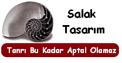
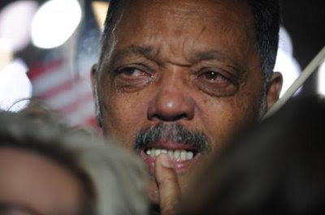
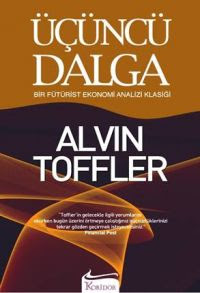

# Hafta 44

Hadi Uluengin

Fakat aslına bakarsanız, dünya kamuoyuna ilk kez George W. Bush’un 26
Şubat 2003 tarihli ünlü konuşmasıyla duyurulan bu plan zaten baştan
ölü doğmuştu.

Dogru

Fakat ilginctir ki, bu safsataya yelpazenin her bolumunden balik gibi
atlayan pek cok dusunur olmustur... Irak Savasi'nin sebebinin tamamen
petrol oldugunu anlayamayan bazilari hala duruma uyanmis degiller.

---

Fehmi Koru

Orhan Pamuk, bir romanına, “Bir kitap okudum hayatım değişti” diye
başlar ya, kendi hayatıma şu sıralarda bir çizgi çizmem istense, benim
de “Bir cümle sarfettim, hayatım değişti” demem gerekir... Altı-üstü
öylesine bir cümleydi benim için

Inandirici degil

Bu cumleyi sarfetmis olma sebebiniz, bizce, tamamiyle ilgi cekme
amacliydi. Belki de bu blog'da Gucun Fahisesi olarak hicivlenen
kisinin "ilgi cekmek" adli taklit yazisini okumustunuz, ve buradan,
ilgi cekmek icin chicken translate tavirlarla "ortada takilmak", ve
arada "hafiften donmek" gerektigine kanaat getirmistiniz. Bir nevi bu
fahisenin "Islami versiyonu" olmaya talip oldunuz. Ama caba elinizde
patladi. Ilgi cektiginiz kesin ama bunu gayet beceriksizce ve tutarsiz
bir sekilde yaptiniz (bu operasyonun ne kadar tutarli yapilabilecegi
tartisilir tabii)

---

Rasim Ozan Kutahyali

[..] Cengiz Çandar gibi aslında samimiyetle bu gazetenin yanında olan
ama aşamadığı neocon makro-politik mantığı sebebiyle [..]

Candar Amerika neyse o olur

Candar, neo-con'lar iktidarda iken "Irak'a hucum" der, baska bir sey
soyleyen iktidara gelince, o denilen baska seyi soyler.. Irak'a petrol
icin girildigini bilmeyen saftiriklerden biri kendisi zaten.

"Salak mi acaba?" diye insanin aklina bir soru geliyor, ama belki de
bu "kralin etegine takilma" operasyonunu, ABD'de belli cevrelerde
"kabul gormek" icin yapiyor. Yani su, bu think-tank'te "takilmak"
oralarda "tanidiga sahip olmak" icin, belki de bilincaltisal sekilde,
bu sekilde kaypak bir zemine oturtuyor kendisini, ki boylece daha
rahat kabul edilecegini zannediyor/biliyor olabilir. Eh bu sayede onun
okuyuculari (ki ben kesinlikle bunlardan biri degilim) neler olup
bittigini "aktorlerin agzindan" ogrenmis oluyor, guya onlar da bu
AC/DC akimindan faydalanmis oluyorlar.

Kendini bu sekilde rasyonalize ediyor olabilir.

Fakat ozetle sunu soylemek gerekir: Candar'in fikirsel durusu onemli
degildir. "Aktardiklari", o gunku ABD milli politikasidir.

---

Etyen Mahcupyan

Bu avantaj bir süredir AKP’nin önünde ve çok da kötü kullanılmış gibi
gözükmüyor. Son seçimlerde radikal bir biçimde yükselen oylar, AKP’nin
kendi cemaatinin sınırlarını aşabilme yeteneğini ve isteğini ortaya
koymakta. AB reformları konusunda gösterilmiş olan isteklilik de bunun
göstergelerinden biri... Ancak son dönemde birçok gözlemci bu sürecin
durduğunu, AKP’nin ‘kitle partisi’ olmaktan vazgeçerek devlete
yanaştığını söylemekte. Başbakan’ın tutumu, söylemi ve davranışları
kınanmakla kalmıyor, derin bir hayal kırıklığının yaşandığı da teslim
ediliyor.

Oysa burada asıl ilginç olan AKP’nin şimdiye kadarki performansının
böylesine kolaylıkla kanıksanması ve bu partinin geçmiş tüm partilere
benzeyen tutumunun ise yadırganması. Çünkü asıl ‘garip’ olan AKP gibi
bir partinin çevreden ve alttan gelen bir ivmeyle oluşarak, dünya ile
entegrasyoncu, dışa açık bir siyaseti sahiplenmesiydi. Modernist
beklentiye göre hiç olamayacak olan gerçekleşmiş, taşra
muhafazakârlığı kendi içinden yeni bir bireyselleşme üretmiş ve bunu
kamusal alana taşımıştı. [..]

Böylece AKP etrafında iki farklı sempatizan tavrı doğdu. Bu parti ile
aynı gelenekten gelen ve taşranın siyasi dinamiği içinden bakanlar,
AKP’ye ilişkin epeyce alt düzeyde bir beklenti oluşturdular. Hükümetin
başörtüsü sorununu çözmeyi denemesini istediler ama çözmesini
beklemediler. Kimlikler arası gerilimlerin üzerine gitmesini arzu
ettiler ama bunların çok da zorlanamayacağını kabullendiler. [..]

Buna karşılık AKP’ye destek vermiş olan laik aydınlar kimliksel olarak
aynı kökten gelmedikleri bu partiye büyük bir misyon atfetti. Aslında
bugüne kadarki siyasi çaresizliklerini AKP üzerinden telafi etmeye
çalışmaktaydılar. Bu kesimlerin AKP desteği iyi tanımlanmış siyasi
önermelerle beslenmiş olsa da, aynı zamanda psikolojikti...

Dogru

Benim "sekerci dukkan onundeki veletler" diye niteledigim kisiler
aynen bu aydin tipleridir. Cogunlukla kendine sol diyen seyin
mayasinda insa edilmis bu kisi, sosyalist cennetten artik vazgecmis,
onun yerine, "hemen ama simdi hemen" olmasi gerekecek demokratik
cenneti yerlestirmistir. Yanlis anlasilmasin, liberal demokrasi
gunumuzun en optimal duzenidir (en fazlayi elde etmenin en minimal
sistemi daha dogrusu), fakat hezeyana da gerek yok. Bu arkadaslara
arada sirada Bhavagad Gita okumalarini oneririm. "Kendinizi yaptiginiz
isin meyvelerinden soyutlayin". Surec, sonuc kadar onemlidir. Hatta
belki de sonuc, surecin ta kendisidir. Gecenlerde gordum bir reklam
cok guzel soyluyordu: Havale yapacagim diye havale gecirmeyin.

---

Hincal Uluc

Şimdi Demokratlarla, Cumhuriyetçiler olarak bölündük. Demokratlar
"Halk ne derse, ne isterse o olur" diyorlar.. Cumhuriyetçiler "Halka
rağmen halk için" diyor ve bazı değerlerin korunması gerektiğine
inanıyorlar.. Gerekirse yasalarla.. Bugüne dek olduğu gibi..

Temel dogru sonuc yanlis

Bir Cumhuriyet, ABD'de oldugu gibi, bir demokraside ortaya cikabilecek
"oy coklugu ile alinamayacak haklara (inalienable rights)" sahip
olabilir [1]. FAKAT, bunlar bireyin "ezilmemesi" icin ortaya konulmus
liberal, bireysel "haklar"dir. Proaktif sekilde kendine dusman
gozukenleri onceden "telef etme hakki" degildir.

Mesela siz bir Gestapo Inspekteur olun, karsinizdaki de bir
Yahudi. Yahudi "beni sabun yapmayin" diyor, siz "burasi Cumhuriyet,
demokrasi degil" diye adamin kafasina vuruyorsunuz. Yaptiginiz tami
tamina budur.

Oyle ABD kurulus fikriyatinin dibinde kalmis artiklari totaliter bir
ideolojiyle birlestirip piclesmis bir sentez olusturarak insanlarin
ezilmesini yuzunuz kizarmadan savunamazsiniz Sn. Uluc.

[1] Burada bir noktaya daha dikkat cekmek gerekir: Uluc Cumhuriyet ve
Demokrasi kelimelerinin 200 kusur onceki yaptigi cagrisimlari
kullaniyor (ve bunu kasitli, demagoji amacli yapiyor). Sunu belirtmek
gerekir ki, zaman gectikce bu iki kavram birbirine yaklasti ve
gunumuzde artik Demokrasiler buyuk cogunlukla Cumhuriyetler ile
beraber anilir/kullanilir hale geldiler. Birbirlerinin ozelliklerini
tasir duruma geldiler. Bir demokrasi, kral/kralice oldugu ve anayasa
olmadigi halde bile "alinamaz bireysel haklari" sahip oldu. Cumhuriyet
hep bir demokratik secim duzeni kullanir oldu.

Dikkat edilmesi gereken bir husus, saltanat olmadigi halde bazi otarsi
ile yonetilen ulkelerin kendilerine Cumhuriyet demesidir; Bu koca bir
ambalajlama operasyonudur. Otokrasiyi, kulaga daha hos gelen bir
kelime ile saklama cabasidir. Cumhuriyet "temsiliyet" vurgusu tasir ve
bunun hicbir sekline izin vermeyen yer Cumhuriyet olamaz. "Mutlulugunu
takip etmesine" izin verilmeyen ve "alinamaz haklari alinan"
insanlarin ulkesine de Cumhuriyet demek cok zordur.

---

Gokhan Ozgun

Ben Batı’ya ait olduğumu [..] Türkiye’nin, dahası Müslümanlığın,
Batı’nın kültürel, siyasal, tarihî bir parçası olduğuna
inanıyorum. Her şeyin bu aidiyetin kabulünden başlaması gerektiğini
düşünüyorum. Bu aidiyeti kabul ettikten sonra kafam çalışıyor.

Ilginc

Belli aidiyetlerin ve buna benzer psikolojik pistonlarin kafa
calistirmasi/calistirmamasi ile ilgili ilginc bir deney var: Deneyde,
lisansustu ogrenci adaylari icin hazirlanmis GRE denen bir testin bir
kismi iki grup zenci ogrenciye veriliyor.

Bir grup, sadece, direk testi alip cikiyor. Diger gruba ise teste
baslamadan once "irklarinin ne oldugunu" soran bir bilgi formu
doldurtturuluyor. Bunun sonucunda bu zihin durumu ile teste giren
ikinci gruptaki ogrencilerin test performansi yari yariya dusuyor
[1]. Yani on soru yerine bes soru dogru cevaplamis oluyorlar (mesela).

Burada ne oluyor? Testi alanlar kendi irklari ile ilgili negatif
onyargilari hatirliyorlar herhalde, ve bilgilerini, yaptiklarini daha
fazla supheyle eleyip, gereksiz daha fazla suzgecten gecirmeye
basliyorlar (second-guessing) ve performanslari dusuyor. "Mojo"
kayboluyor [4].

Ikinci ornek, bilgisayar bilim dalinda arastirmaci bir
profosorden. Arastirma sirasinda nasil calistigini anlatirken soyle
demis: "Eger bir konuya takilirsam hemen benden buyuk abimin bana 'ben
sonucu biliyorum ama sana soylemem' dedigini hayal ederim"
demis. Prof'a gore bunu kendine soyledikten sonra genellikle aklina
bir cozum geliyormus :) Ilginc degil mi?

Iste iki ornek. Bu konu hakkinda biraz dusunulmeli bence. Ilginc
sonuclar cikabilir.

---

Hadi Uluengin

Öte yandan, kapitalizmin konjonktürel krizleri dahil, Karl Marx'ın
yapmış olduğu burjuvazi sermaye tahlillerinde yine kısmi doğruluk payı
vardır ama, sonuç tekrar yanlıştır. Ölümünden bir buçuk asır sonra,
"vahiy" olarak haber verdiği, kapitalizmin kendi kendini yok edeceği
asla savı gerçekleşmemiştir. Daha ötesi, emáresi dahi
sezilmemiştir. Aksine, kapitalizm sanayi devrimine bir de teknoloji ve
bilişim devrimlerini eklediği ve artı-değer zenginleşmesi daha geniş
dağıttığı için, burjuvazi proletarya ikilemi Marx'ın yine kesin
addettiği o "antagonik" zıtlaşmaya ulaşmamıştır

Dogru

---

Cemil Ertem

Şimdiye kadar biriken ama, eskinin kurumları üzerinde var olamayacağı
için, atıl duran sermaye, şimdi güçlü bir dalga olarak bütün insanlığı
içine alacak bir teknolojik devrim başlatacak. Bu büyük dalga, şimdiye
kadar alttan alta gelişen ve artık denetlenemeyen teknolojiyi
gerçekten iktidara getirecek. Bu yaklaşım şimdiye kadar birçok bilim
insanı tarafından gündeme getirildi; Marx’ın kapitalizmin
dinamiklerini, küçük çevrimler (toplumsal sabit sermayenin
yenilenmesi) ve sistemin teknolojik temelinin tümüyle yenilenmesinden
oluşan büyük krizler olarak görmesini, hem Marx’ı takip edenler hem de
diğer okullardan gelen iktisatçılar geliştirmişlerdir. Kondratiev’in
uzun dalgaları, Mandel’in Geç Kapitalizm’i ve nihayet Alvin Toffler’in
Üçüncü Dalga’sı bu genel tespitten hareket eder

Dogru

---

Taha Akyol

Her şeyin fiyatını kâra göre piyasanın değil, güya “ihtiyaca göre”
devletin belirlediği kumanda ekonomisinde hiçbir şeyin gerçek fiyatı
yoktu. 24 milyon kalem mal ve belki bir o kadar hizmet üreten modern
bir ekonomide, hepsi birbirinin girdisini oluşturan milyarlarca
birimin fiyatını hesaplamak imkânsızdı. [..] Von Mises’in makalesi de
fevkalade önemlidir. Liberal iktisatçı Mises, daha 1920’de yayımladığı
“Economic Calculation in the Socialist Commonwealth” adlı uzun
makalesinde, fiyatların siyasi kararla belirlenmesinin tam böyle bir
sonuç vereceğini, sistemin bu yüzden çökeceğini anlatmıştı.

Dogru, ve...

Ayrica Mises'in Sosyalizm adli kitabi burada bitirici darbeyi vuran
eser olarak kabul edilebilir. Sosyalist bir ekonominin islemesinin
niye imkansiz oldugu bu kitapta acikca belirtilmektedir. Bizim bu
kitaptan yaptigimiz alintilar surada bulunabilir. Baska kaynaklardan
diger derlemeler surada [2,3].

[1] Blink, Gladwell, M., 2006, sf. 57

[4] Obama'nin baskan olmasi, bu acidan, zenciler icin iyi bir "mojo yukseltici" faktor olabilir. Kendilerine guvenleri yukselir, iclerinden birinin basarili olmasi hepsinin yapabilecegine dair bir inanc asilar.

---

Emre Akoz

Hindistan gezisine giderken Başbakan Erdoğan, gazetecilerin "YouTube'a
girilemiyor" eleştirisi üzerine, "Yoo, ben giriyorum, siz de girin"
diyor. Fark şurada: Geçmişte mahkeme bir yasak getirir, siyasetçi de
bundan memnun kalır, ellerini ovuşturarak uyulmasını sağlardı. Şimdi
ise siyasetçiler, yasağı delmeni yollarını bizzat anlatıyor! Yani tam
bir komedi!

Aslında YouTube yasağının, ön kapıdan girişi kocaman bir kilitle
engellenmiş ama arka tarafı herkese açık Nasrettin Hoca türbesinden
farkı yok. (Eskiden böyleydi ve Nasrettin Hoca'nın esprisine uygundu.)
Mahkemeler istedikleri kadar yasaklasın YouTube'a gireceğiz; çünkü
böyle bir yasak, internetin ruhuna aykırı. Yine de olayın hiç de komik
olmayan bir tarafı var: Siyasetçinin görevlerinden biri de, Meclis'te
kanunları değiştirerek, bu tip anlamsız yasakları ortadan
kaldırmaktır. Yani mesele, YouTube yasağını delecek yan yollar önermek
değil, yasaklamayı imkânsız hale getirmektir. Hindistan "bilişim" ve
"internet üzerinden iş yapma" konusunda epey ilerledi. Başbakan
Erdoğan'ın Hindistan'dan feyiz almasını ve döner dönmez şu saçma
yasağı kaldıracak girişimlerde bulunmasını umalım.

Katiliyorum

---

Gokhan Ozgun

Özal, Türkiye’de büyük tabuları yıktı. Bugün Türkiye’nin yüzü hâlâ
Batı’ya dönükse, bu, Özal sayesindedir. Yoksa mesela, Turgut Sunalp
denen asker olmaktan başka bir mesneti ve meziyeti olmayan, şimdi
kimsenin nursuz yüzünü ve adını bile hatırlamak istemediği birinin
‘boşluğuna’ çevirecekti yüzünü Türkiye. [..]

Ama putları kıran aynı Özal, ‘benim memurum işini bilir’ diyerek,
askerlikten uyanık vatandaşa çıkış yolu temin ederek, devlet yanaşması
burjuvaziye pek ilişemeden, ona ne idüğü belirsiz bir ‘becerikli’
burjuvazi ekleyerek, yepyeni bir uyanık vatandaş modeli yaratmıştır.

Bu ‘uyanık muhalif vatandaş’, kimseyi, özellikle hiçbir kurumu
karşısına almaz, her şeyin etrafından dolaşır. (Özal’ın kendi gibi,
bir nevi bürokrat muhalif tiplemesidir.) Bunun mekanizmaları toplum
içinde zamanla kabullenilmiştir. Sınıf atlamaya çalışan Türkiye,
yıllardır bu mekanizmalarla ve bu ‘uyanık muhalif’ tiplemesiyle idare
etmiştir.

Medyamız bu ‘uyanık muhalif’ tiplemesiyle ağzına kadar doludur. Onlar
için vize hakiki bir sorun değildir. Eğitim hakiki bir sorun
değildir. Demokrasi hakiki bir sorun değildir. Asker hakiki bir sorun
değildir. Hepsinden kaçış için açılmış ‘hakiki’ gizli yeraltı
tünelleri mevcuttur. Bunları bilmeyen, kullanamayanlar için, çok
üzgündürler. Türkiye güzel, ama yalnız bir ülkedir... Ve hatta, yalnız
olduğu için mi, bu kadar güzeldir, yoksa?.. Sorry. Karar vermek çok
zor.

Ama artık o gizli geçitlere bütün ‘uyanık muhalifleri’ sığdıramayacak
kadar gelişiverdi memleket [..]

Dogru

Bu "etraftan dolasmaciligin" ornegi yukarida goruluyor zaten.. "Benim
memurum isini bilir", "benim Internet kullanicim isini bilir".. Arada
bir fark yok.

---

Mumtaz'er Turkone

Daha bugünden şiddetlenen, mahallî seçimlere odaklı AK Parti-DTP
rekabeti, tam olarak siyasî bir savaş. "Siyasî savaş", çünkü siyasî
amaçlar için bir taraf şiddet araçlarını kullanıyor. DTP, bu seçim
rekabetini silahların ve en yaygın biçimiyle şiddetin devreye
sokulduğu bir "savaş" olarak yürütüyor. PKK'nın artan eylemleri ve
şiddet yüklü kitlesel gösteriler bu durumu anlatıyor. İstanbul'da
arabaları yakmaktan Nusaybin'de polisle çatışmaya ve PKK baskınlarına
kadar bütün eylemler bu siyasal savaşın bir parçası. Peki işe yarar
mı? DTP, artan şiddet sayesinde Güneydoğu'da seçim kazanabilir mi?

[..] DTP'nin bu mahallî seçimlerde Diyarbakır'ı kaybetmesi, PKK için
sonun başlangıcı demek. Erken başlayan şiddetin ve tırmanan
gerginliğin sebebi bu endişe. PKK'nın farkında olmadığı veya kabul
etmesi imkânsız olan gerçek ise şu: Tersinden bakıldığında bu seçimler
bölge halkı için PKK otokrasisinden kurtulmanın en kestirme
yolu. Şiddet sokaklarda egemenliğini kurabilir, insanları
sindirebilir; ama seçim sandığı insanın kendi vicdanı ve en risksiz
şekilde özgür iradesi ile baş başa kaldığı yer. DTP, Kürtlerin
CHP'si. Siyasal anlamda güçlü, ama toplumsal karşılığı zayıf. Bunca
yıllık kanın, öfkenin temsilcisi. Kanın siyasetini yapmakla, kanla
siyaset yapmak arasındaki fark, PKK'ya sempati duyanları bile bu
seçimde tedirgin edecek.

Dogru

Guneydogu'da "meydan savasi" basladigindan beri bizim Turk
fasistlerinin Ergenekonu ile Kurtlerin fasistleri PKK arasindaki
paralellikleri dusunuyorum. Aynen bizdeki "bindirme kitalarin" etrafta
asiriliklar yaparak oy toplamayi umduklari gibi, PKK da teror yaratip
oy toplamayi umuyor olabilir... O zaman, Ergenekoncularin "piyesinin"
geri tepmesi gibi Kurt vatandaslarimiz tarafindan onlarin kurgulari
sandikta geri puskurtulebilir mi? Bence hic kimse oyu icin kendine
kabadayilik yapilsin istemez. Umariz ki Kurt vatandaslarimiz bu oyunu
gorup tavirlarini alirlar.

---

Engin Ardic

Hillary’nin en büyük rakibi Barack Obama’nın da göbek adı
Hüseyin... Düzeltiyorum: Göbek adı Barack, asıl adı Hüseyin. Kıl
kapılmasın diye tersini kullanmaya çalışıyor. Onun da kampüs ya da
bazı Hollywood “mahfilleri” dışında hiçbir ağırlığı yok. [..] Adı
Hüseyin olan biri Amerika’ya başkan seçilsin, çıkar Taksim Meydanı’nda
anırırım.

Eh Buyrun Bakalim

Sayin Ardic: Dort dortluk dusunce adami olma yolunda en buyuk
handikaplarinizdan biri, bosbogazli olmak, ve ne bilmedigini
bilmemektir... Bu engellerle cok sIkI bir sekilde bogusmaniz
gerekiyor.

Secerenize baktim, Saint Taşşaque liselerinin birinden mezun
olmussunuz. Bu tur egitimi cok kucuk yasta aldiysaniz, hayat boyu
belinizi dogrultamayabilirsiniz. Bu maca 2-0 yenik baslamissiniz
demektir. Cok disiplinli bir sekilde bilmeden konusmaktan uzak
durmaniz gerekiyor. Potansiyeliniz var, bosbogaz gevezelikleriniz
onunuzdeki en ciddi handikap.

---

Emre Akoz

Liberal Düşünce Topluluğu 2008 Kongresi'nden bir izlenim daha. Paneli
izleyen bir arkadaş sordu: "Liberal bildiğimiz köşe yazarları, bazı
konularda tam tersi fikirler ileri sürerek bizi şaşırtıyor. Bu nasıl
oluyor? "

* Bir kere Türkiye'de liberal çok az. Zaten o köşe yazarlarının ve entelektüellerin çoğu kendini "liberal" olarak tanımlamaz. Karşı safta yer alanlar (ulusalcılar, milliyetçiler, vs.) onlara bu adı taktı. Türkiye'de "Avrupa Birliğini, demokrasiyi, hukukun üstünlüğünü " savunmanın adı liberallik oldu. Halbuki mesela bir sosyal demokrat da bunları savunur. Ancak o değerlerden yan çizen CHP'ye "sosyal demokrat" denilince acayip bir kavram kargaşası çıkıyor ortaya.

* Bizde liberal fikir ve değerler mesela üniversitelerde doğru dürüst öğretilmez. "Siyasi ve ekonomik doktrinler" türü derslerde şöyle bir okutulup geçilir. İlk ve lise öğretimi ise bu açıdan tam bir çöldür. (Nereden çıktı şu " Birey devletten önemlidir" lafı!) Öğrencilere 1933'ten beri "Varlığım, Türk varlığına armağan olsun " diye yemin ettirilmiyor mu?

* İmkân olsa da entelektüellerin evlerine gidip kitaplıklarına baksanız: Liberal düşünceyi işleyen pek az kitap bulursunuz. Devletçiliği karşı çıkanlar dahi liberalizm konusunda pek okumaz. " Kolektivist " fikirler iliklerimize işlemiştir.

* Toplumsal taban açısından bakıldığında da liberal fikirler öksüzdür bu ülkede. İstanbul'da yoğunlaşan Türk burjuvazisi, bir "sınıf " olarak liberal düşünceye yüz vermez; gözleri kulakları hâlâ Ankara'dadır. Zaten kriz çıktı mı, "Devlet bizi kurtarsın " diyenlerden başka ne beklenir?

* Siyasiler bile tutarlı olamıyor bu konuda. Liberal Demokrat Parti yöneticileri ziyaretime gelmişti. Şöyle dediler:

"Hazine yüzde 7 ve üstü oy alan partilere yardım yapıyor. Daha az oy
alan partiler bir araya getirilsin. Toplam oyları kadar yardım
yapılsın. Sonra bu küçük partiler o parayı aralarında bölüşsün." Bence
devletin siyasi partilere para vermesi zaten bir skandaldır. Liberal
bir partinin bunu kaldırmayı amaçlamak yerine pay istemesi daha da
beter. İşte böyle bir sistem ve kültürde ancak bu kadar liberal
olunabiliyor.

Dogru

... soze ne denir.

---

Ahmet Altan

Atatürk bir diktatördü. Bunu kendisi bizzat Fethi Okyar’a da
söylemişti. Katı bir adamdı. Muhaliflerine karşı çok sertti. Çok
ihtiraslıydı. [..] iyi bir örgütçü, dengeleri her zaman çok iyi
gözeten yetenekli bir politikacıydı. Kendi ilkeleri yoktu, duruma göre
görüşlerini değiştirirdi, pragmatikti [bu pek iyi bir sey degil, ama
en azindan yanlis ilkelere sahip olmaktan daha iyi -UDG-] Kendine ait
bir kuramı, derinliğine kapsamlı bir fikir sistemi bulunmuyordu. “Bu,
Mustafa Kemal’in kendi fikriydi, daha önce hiç söylenmemişti”
diyebileceğiniz tek bir fikir bile bulamazsınız zaten.

Batılı bir hayat tarzını Türkiye’ye getirmek isterdi. Ve o Batılı
ülkeyi de kendisinin yönetmesini isterdi. Bir asker olduğu için
“emirlere” inanırdı. Klasik Batı müziğini bile Türk köylüsüne emirle
sevdirebileceğini sanmıştı. Denemişti. Bunu “iyi niyetli” bir şekilde
yapmıştı, çünkü Sofya’da, Selanik’te, Berin’de gördüğü hayatın
Türkiye’de de yaşanmasını istiyordu. Sadece o hayatın nasıl
şekillendiğini, hangi aşamalardan geçilerek o noktaya gelindiğini
bilmiyordu. Zorla şapka giydirip, zorla müzik dinleterek Batılı bir
toplum yaratabileceğini sanıyordu. Yaratılamazdı, yaratamadı.

Ama Kurtuluş Savaşı’nı çok iyi örgütledi, cumhuriyeti kurdu. Liderliği
ile ülkenin önemli bir dönemeçten geçmesini sağladı. Bu gerçek
değişmez.

Atatürk’ün zaafları bulunan bir insan olduğu gerçeği de değişmez. Onun
kurduğu cumhuriyetin hâlâ demokratikleşemediği gerçeği de
değişmez. Zaten gerçekleri değiştirmeye değil, o gerçekleri görmeye
ihtiyacımız var. O gerçekler görüldüğü zaman Atatürk’ün ne değeri
eksilir ne de değeri artar, sadece onun arkasına saklananların asıl
yüzü ve amaçları ortaya çıkar. Esas korktukları da bu, onun için bu
kadar saçmalıyorlar zaten.

Dogru

---

Cemil Ertem

ABD’de ikinci kurtarma paketinin, en az Bush’un paketi kadar büyük
olacağı, ancak, bu paketin finans kesiminin ve bankaların
aktiflerindeki işe yaramaz kâğıtları satın almak yerine orta sınıfa
yöneleceği anlaşıldı. Bu kriz süreci, güç dengesini kendi lehine
çevirmek isteyen kesimlerin-sınıfların derin, kapsamlı mücadelesine de
sahne olacak.

Kurtarma paketleri bu mücadelenin yansıması olarak karşımızda.

Devlet hazineleri ellerindeki kaynakları kim için, nasıl
kullanacaklarına biraz da bu sınıf mücadelesinin seyri doğrultusunda
karar verecekler. Bush ve Obama paketleri arasındaki fark bu anlamda
bir bakış açısı farklılığı olduğu kadar kriz sonrası hâkim sermeyenin
bileşiminin ipuçlarını da veriyor. İleri teknoloji üreten ve kontrol
eden sanayileri öne çıkartacak olan Obama dönemi, buna uygun bir çıkış
paketini yakında açıklayacak.

Dogru

Hatta; eger komplo teorisyeni olsaydim, derdim ki, sanayi/militer
orgutunun karanlik uyeleri yeni baskan "onlardan" olmayacagi icin,
Bush gitmeye yakin bir kriz tetiklediler, kurtarma paketleri,
vs. derken giderayak parayi kendi adamlarina "aktarmak"
istiyorlar. Genclerin tabiriyle "Indra Gandi yapacaklar". Ama komplo
teorisyeni degilim, o yuzden bunu soylemeyecegim.

CE

Türkiye’de ise işçi sendikaları ve sol şimdiye kadar uygulanan ve
Washington Uzlaşısı kaynaklı [..] politikalara alternatif iktisat
politikası çerçevesi öneremedi.

Çünkü artık “eski” sendikal anlayışlar geçerli değil. Bu sendikaların
–ister sağ tarafta ister sol tarafta olsunlar- mücadele anlayışları ve
örgütlenme modelleri hem bu krizi hem de kriz sonrasını kapsayacak,
omuzlayacak nitelikte değil. “Bu krizin maliyetini üstlenmeyeceğiz”le
başlayan açıklamalar da her zamanki bıktırıcı hamaset metinleri olarak
karşımızda.

Katiliyorum

Dunyada ve Turkiye'de hala sendikalardan "degisim" bekleyen saf
insanlar var. Sendikalar, "sistem ici" bir kapismanin taraflarindan
birini temsil ediyorlar. Endustriyel bir ekonomide dogal olarak ortaya
cikan entegrator elit tabakasinin ekonomiyi hep kendine yontmasina
karsi, topluca calisanlarin haklarini aramalarinin bir yoluydu
sendikalar... Tabii bunu goren elit tabakasi hemmen bu insanlarin
icinden sectigi "sendika lideri" kimligindeki basta olanlari icine
dahil etti, ve bu akimi kendi icinde eritti. Bugunku halleriyle
sendikalar, nerede olursa olsun, artik sistemin bir parcasidir.

Halbuki yeni buyumeye baslayan beyaz yakali yeni calisanlarin
ekonomisi, sistem ici bir kapismayi degil, sistem disi bir meydan
okumayi temsil ediyor. Bu iki "dalganin" uyelerinin sistemden cok
farkli beklentileri var. Bunlar olurken, eski sistemin "taraflari" her
gun kan kaybetmekte.. ABD'de (ki gidecegimiz yer orasidir) bir semsiye
sendika orgutu olan AFL-CIO uye sayisi her yil, surekli
azalmaktadir. Bu da politik baglamda bir guc kaybi anlamina
gelmektedir. Bu devam edecektir.

---

VOA News

Korsanlar Somali sularinda yeni bir gemi kacirdi. Bu gemi Yemen'li.

Bu Yeni Bir Ortacag

Bu son kacirma olaylari bana hep Parag Khanna'nin sozlerini
hatirlatiyor: "[Gunumuzu tarif etmek icin] yeni duzen yerine "Yeni
Ortacag" kelimeleri aslinda daha uygundur, cunku aynen Ortacag'da
oldugu gibi bugunde sadece ulkelerin degil, imparatorluklarin,
cokuluslu sirketlerin, dini akincilarin/sefercilerin (crusaders),
devletten bagimsiz aktivistlerin ve mega-hayirseverlerin cirit attigi
bir dunyada yasamaktayiz, ve bu aktorler, kompleks bir matriksi
andiran 21. yuzyil guc dinamiginin her katmaninda boy
gostermektedirler".

Bu listeye bir de "korsanlar"'i ekleyinca tam Ortacag oluyor
iste. Korsanlar! Telafuzu bile insana komik geliyor...

---

Can Dundar

Asıl mücadele ne Yunanlılara ne asi Kürtlere ne de gericilere karşı
veriliyor. Atatürk’ün asıl mücadelesi, "İktidarı, gökyüzünden
yeryüzüne indirme meselesi." [..] Üstelik yapmaya çalıştığı çok özel
bir şey, sadece Türkiye’yi değil bütün insanlığı ilgilendiriyor. Bütün
insanlığı dönüştürebilecek bir şeyden söz ediyor.

Daha neler

Atif yapilan sozde Dundar'in zannetigi kadar bir derinlik
yok. Felsefe, siyasetbilim gibi konular Kemal'in uzmanligi degildi ve
bu konularda cagina gore averaj bir dusunur sinifdandaydi. Problem, bu
konudaki dunya literaturunu bilmeyen kapali beyinlerin (Dundar gibi)
onemli olmayani onemli gibi gostermeye calismasidir.

Iktidari gokyuzunden yeryuzune indirmenin pek cok yolu vardir
Sn. Dundar; Diktatorluk te bu yollardan biridir. Neymis yani? Demek ki
onemli zannettiginiz ayrac, soz, onemli degilmis. Bu konularda daha
derinlikli bir soz, mesela, bir iktidarin "insanlarin degil,
kanunlarin iktidari" oldugunu soyleyebilmektir, ki bu soz ABD kurucu
babalarindan John Adams tarafindan soylenmistir.

---

5N1K Programinda Bir Konuk

[mealen] Dis basinda Ataturk icin "diktator" deniyor fakat diktatorluk
o zaman icin Avrupa'da olan bir sey.

Ee Yani?

Yamyamlik ta Afrika'da olan bir seydi. Hatta bir zaman bir yamyam
lider oteki hakkinda "iyi yamyamdir" demis olabilirdi. Aradan 1000 yil
gecip donup bakinca "ama o zaman yamyamlik varmis" diyerek bunu da mi
savunacagiz? Bu ne sacma sapan savunma?

200 kusur sene once ABD kurulurken etrafta dogru durust cumhuriyet
yoktu ama bu kurucular duzgun isleyen bir cumhuriyet kurabildiler
[1]. Uzulerek tekrar soylemek zorundayim: Kurucularimizin entellektuel
birikimi saglam degildir. John Adams, Jefferson gibi babalar
zamanlarinin politik eserlerini bastan sona hatim etmislerdi, bu
herifler konuyu takip ede ede eski Yunan'a kadar gitmislerdi ve bu
eserleri ORIJINAL ESKI YUNANCA DILINDE okuyabiliyorlardi. Turkce nasil
deniyor? BORU DEGIL.

Dogal olarak bu adamlarin yazdigi anayasa cok ufak degisiklikler ile
200 kusur sene dayanmistir, yapilan degisiklikler ise her zaman
ozgurlukleri GENISLETMEK icin yapilmistir. Ulkemizde ise yasa
kurucusunu ve zamanini asamamis, bir dolu darbe, krizden sonra hala
takip edilemeyen bir kanunlar silsillesinin miras oldugu bir garip
durum mevcuttur. Zaten "lider kultunun" one cikarilmasinin sebebi,
yazili haldeki kanunlarin fikirsel kitligidir. Kanun ile gercek durum
arasindaki ucurum, "tapinma" ile kapatilmaya ugrasilmaktadir.

Ustune ustluk, uretim metodunun degismesi ile ABD anayasasi bile artik
yetersiz kalacaktir, fakat en azindan degisim surecini idare
edebiliyorlar. Burada o da yok.

---

Ahmet Kek

Bunlar Kemalist değil, Enverist

Kurtarma Operasyonu

Bosuna ugrasiyorsunuz.

---

Hadi Uluengin

FAKAT, bu satırlar yazarı da dahil, yukarıdaki "aydınlanma"nın ve
"modernite"nin çocuğu olan [..]

Modernite Gericiliktir

Sizin de secerinizde Saint Taşşaque mezunlugu varmis
Sn. Uluengin. "Modernciliginiz" buradan ileri geliyor herhalde.

Modernite, standardizasyon, senkronizasyon, merkezilesme, uzmanlasma,
maksimizasyon gibi konularin hepsini iceren endustriyellesme
ideolojisinin bir diger adidir.

21. yuzyil itibariyle gericiliktir.

Postmodernizm bilim dusmanligi icerir, bundan da uzak durulmasi
gerekir.

---

Emre Akoz

Bize de ilkokulda aynı gerekçeyle anlatılmıştı dildeki sadeleşme
hareketi: 'Üçgen'e 'müselles', 'eşittir'e 'müsavidir' demek zorunda
kalacakmışız ama son anda kurtarılmışız. Uzun yıllar ben de öyle
düşünmüştüm. Ancak zamanla böyle bir gerekçelendirmenin anlamsız
olduğunu kavradım. İngilizcede üçgene 'triangle' (okunuşu:
'trayengıl') deniyor. Ağzından ha 'üçgen' sesi dökülmüş, ha
'trayengıl', ha 'müselles'. Ne fark var? Yok. Sadece aynı nesneye
gönderme yapan ama farklı kültürlere, dillere ait sesler bunlar. Yani
'müselles'in yerine 'üçgen' demeye başladığın için matematiği daha iyi
öğrenmiyorsun.

Dogru

---

Vecdi Gonul

Bugün eğer Ege’de Rumlar devam etseydi ve Türkiye’nin pek çok yerinde
Ermeniler devam etseydi, bugün acaba aynı milli devlet olabilir miydi?

???

Su anda Guneydogu'da, Istanbul'da Kurt asilli vatandaslarimiz var. O
zaman biz Gonul'un tarif ettigi "milli devlete" hala kavusamamis mi
oluyoruz? Ne soylemeye ugrasiyor anlamadim. Sacma sapan bir
cikis. Bazi olaylar hakkinda "iyi olmus" havasi yaratmanin haricinde
baska bir ise yaramamis, ve galiba, soylenis amaci da buydu.

[1] Ah bu arada, ABD ilk kuruldugunda demokraksi degildir, ama
bolgelerin secilmis temsilcilerine "kelleniz ucar" gibi sozun
soylendigi katiyen vaki degildir. O temsilcilerin kim olacagina
karisilmazdi. O temsilcilerin kimi baskan secilecegini de
karisilmazdi. Bu muthis bir politik yaris ortaya cikarmistir, ki
yaris, iyi bir seydir.

---

Mahir Kaynak

Teşkilat içerisinde, aktif faaliyetlerde bulunmayı, tıpkı MOSSAD gibi
birtakım eylemler yapılmasını isteyen gruplar var. Oysa istihbaratın
hem görevi o değildir, hem böyle bir kullanış yanlıştır. [..] Mesela
CIA birini bertaraf etmek istiyorsa, hiçbir zaman CIA elemanı
kullanmaz, aracı kullanır.

Yanlis

CIA'nin icinde operasyon kabiliyeti olan paramiliter gruplar
vardir. Bu kisiler HUMINT (insanlardan toplanan istihbarat) islerine
de bakan DOO'ya (director of operations) baglidirlar. Bunlar acik
kaynaklardan ogrenebileceginiz seyler.

---

Asaf Savas Akat

Dikkat edilirse, Mundell’in savunduğu görüşün tipik örneği
eurodur. Avrupa Para Birliği onun savunduğu fikirlerin başarılı bir
uygulamasıdır. Dolayısı ile Mundell benzer para birliklerinin
oluşturulması gerektiğini söyledi.

Herkes bu fikre katilmiyor

Stiglitz'in her gorusune katilmam, mesela az regulasyonlu, liberize
edilmis ekonominin islemedigi hakkindaki gorusune - ABD'deki mevcut
sistem tam kapitalizm degildi (Stiglitz de buna benzer laflar
geveliyor bazen ama, gidip geliyor, bir oyle bir boyle); Fakat rezerv
sistemi konusunda bazi iyi seyler soyluyor. Mesela Making
Globalization Work adli kitabinda Mundell'in soyledigi az sayida ve
daha genis alana hitap eden para birim birim sistemlerine karsi
cikiyor. Ozeti surada bulunabilir. Ona gore, eger az sayida buyuk
rezervler olursa, millet bir paradan otekine habire kosup duracaktir,
bu cok fazla volatilite demek olacaktir.

Gunumuzdeki sistemin kotu tarafi ise sudur: Stiglitz'e gore, dolar,
global bir para birimi oldugu icin her ulke tarafindan kotu gunlerde
korunma elde etmek icin ve ayrica yerel para birimini stabillestirmek
icin mecburen rezerv olarak tutulmaktadir. Bu, atil duran ve baska bir
sey icin harcanamayan bir paradir ve bu paranin tutulmasi ayni zamanda
"ayni sepete koyulmus yumurta" anlamina gelmektedir. Risk dagitilmis
degildir.

Stiglitz'in fikri, yeni bir "global rezerv bankasi" yaratmak, ve her
ulkenin GDP'sine orandaki parayi "kendi para biriminde" bu bankaya
yatirmasidir. Bu paranin toplami, kriz durumunda herhangi bir ulkeye
yardim edebilecek bir fon gorevini de gorecektir. Ayrica bu fon, hem
tutulan paralardan hem de bu paralarin uye ulkelere donup borc
verilmesinden (IMF'nin yaptigi gibi) kendi uyelerine faiz getirisi de
saglayacaktir. Surada anlatiliyor.

Bu iyi bir fikir bence.

Ayrica, dikkat edelim, iki Nobel odullu ekonomistin tamamen zit seyler
soyledigini goruyoruz. Niye? Cunku ekonomi basi sonu belli olan degil,
"uc nokta (extremistan)" olaylarin oldugu gayri-lineer hareketlerin
dondugu bir ortamdir.

ASA

Dalgalı kurun dünya para sisteminde yarattığı zafiyetler nasıl
çözülebilir? Son krizi gördükten sonra acaba altın standardına geri
dönülmesini mi önerecek diye merak ediyordum.

Bu iyi olmaz

Ekonomide Avusturya Okulunun cogu fikrini takip etmemize ragmen, altin
standarti fikrine katilmiyoruz. Para, eger dolasimda olan "degerin"
bir temsili ise, ama bahsedilen ekonomi sınırlı kaynaklarin sınırlı
sekilde islenebildigi sınırlı bir ekonomi (yani endustriyel) ise,
kendisi de sınırlı bir kaynak olan altin iyi bir standart
olabilir. Fakat mevzubahis olan bilgi/servis ekonomisisi ise, bu tur
ekonominin buyumesinde sınır yoktur, bu yuzden boyle bir ekonomide
dolasimda olan degerin sınırlı bir kaynak olan altin ile temsil
edilmesi dogru olmazdi.

---

Ahmet Altan

İttihatçılar insafsız bir soykırım gerçekleştirdiler.

Fiilen dogru, diplomatik olarak kabul edilemez

Bu konu hakkinda yanda paylastigimiz kaynaklara bakarsaniz [1,2,3] (ki
bunlar sirasiyla Ilber Ortayli, Halil Berktay, Hrant Dink - bir karsi,
iki destekci), hepsinin ortak noktasinin "devletin soykirimi
kabullenmemesi" noktasi oldugunu gorursunuz. Ittihatcilarin yaptiklari
bir rezalettir. Yasanan bir bolgesel savastir, kayiplar iki
taraflidir, ve Ermenilerin kayiplari daha fazladir [2].

Simdi isin diplomatik tarafina gelelim: Eger milletlerarasi camiada
soykirim kelimesini kabul ederseniz, ve bunu devlet agziyla
yaparsaniz, sadece bu eylemi gerceklestiren X zamanindaki Y "insan
grubu", yani "bir takim kaka insanlar" suclu degildir. Bu durumun
kabulu soyunuzu sopunuzu, tum KULTURUNUZU zan altinda birakir
[1]. Nazilerin yaptigi Yahudi soykirimindan sadece Naziler degil, tum
Protestanlik dini sucludur. Zan zinciri gide gide Luther'e kadar
dayanir. 500 senelik bir zamandan bahsediyoruz.

Bu sebeple benim durusum, aci olaylari, Ittihatcilarin katliamini
tanimak, bolgesel savasa vurgu yapmak ve disari donuk konusmalarda
"soykirim" kelimesinden kacinmaktir. Berktay, Dink ve Ortayli ayrica
dis ulke meclislerinin Ermeni Soykirim Kanunlari gecirmemesi
noktasinda da birlesiyorlar.

Ileride birisi diplomatik dili degistirirse, konjektur, vs. yerinden
oynarsa, durumlar degisebilir. "Tarihciler halletsin" sozunde
hemfikirim. Ayrica stratejik olarak Turkiye kacar gorunmemelidir, ve
gorunmuyor zaten. Mevcut yaklasim dogrudur.

[1] Bu kultur, bu arada, sadece "Turkler"'den ibaret degildir. Kultur
bu topragin kulturu olarak tum Turkiyelileri kapsayacaktir.

[2] Yanliz Turk kaybinin daha az olmasinin arkasindaki sebep, Turk
nufusun koylere daginik olmasi ve Ermeni cetelerinin bu daginik yapida
tahribat yapma sansinin daha sinirli olmasidir. Yoksa hic suphe
olmasin ki bu tahribati yapacak niyet (intent) Ermeni tarafinda da
vardir. Sadece elinde bunu etkili yapabilecek mekanizma yoktur.

---

Gulay Gokturk

Evet, 12 Eylül Anayasası ortadayken bu ülkede doğru dürüst bir
demokrasi kurmanın imkanı olmadığında büyük çoğunlukla hemfikiriz. Bu
anayasanın mayasının kötü olduğu, dolayısıyla orasından burasından
düzeltmeye kalkmanın yetmeyeceği, toptan ve farklı bir zihniyetle
yepyeni bir anayasa yapmamız gerektiği konusunda da hemfikiriz.

Ama acaba gün bugün müdür? Bence bu sorunun cevabını geçtiğimiz
aylarda Özbudun Taslağı'nın ortaya çıkışından sonra yaşadığımız
tartışmaları ve türban konusunda yapılan anayasa değişikliğinin
uğradığı akıbeti hatırlayarak vermemiz gerekir.

Birçok insan, Özbudun Taslağı'nın başarısızlıkla sonuçlanmasını içine
"sızdırılan" türban serbestisi maddelerine bağladı. Oysa, uzlaşmaz
cepheleşme daha en başından, başlangıç bölümündeki Atatürk
milliyetçiliğini anayasa hükmü haline getiren maddenin değiştirilmek
istenmesinden başlamış ve anayasanın iskeletini oluşturan bütün temel
meselelerde sürmüştü.

O tartışma sadece belli maddelerde değil, yeni yapacağımız anayasanın
ruhunda anlaşamadığımızı ortaya koydu. Ardından gelen türban
değişikliği iptali ise bize eski paradigmanın savunucularının icabında
beğenmediğimiz o 12 Eylül Anayasası'nı bile ihlal ederek, Meclis'i
işlevsiz kılmayı bile göze alarak değişimi engellemeye kararlı
olduklarını gösterdi.

O günden bu güne güçler dengesinde hiçbir değişiklik olmamışken, [..]
aynı denemeyi bir kez daha yapmak kendi kendini yenilgiye mahkum etmek
değilse nedir? Ve yeni bir yenilgi toplumun moralini bozmaktan,
değişim umudunu yıpratmaktan başka ne işe yarar? Bugün geldiğimiz
noktada şu soruyu tekrar sormalı ve gerçekçi bir cevap aramalıyız:
Askeri vesayeti anayasa değişikliği yoluyla mı gerileteceğiz, yoksa
askeri vesayeti belli oranda gerilettikten sonra mı Anayasa
değişikliği yapacağız? Bence yaşadığımız son deneme birinci yolun
çıkmaz olduğunu gösterdi.

O yüzden diyorum ki, yeni deneme, ancak güçler dengesi değiştiği, yeni
bir güçler dengesi oluştuğu zaman yapılmalıdır. Güçler dengesinin
değişmesi ise ancak, toplumun daha geniş bir kesiminin sivilleşme ve
demokratikleşme isteyen cepheye aktif destek vermesi ile olur. Peki bu
nasıl sağlanır? Daha küçük ama kazanılması daha mümkün mücadeleler
içinde güç toplayarak...

Mantikli

---

Alper Gormus

[..] böyle bir ülkede “muhalif mizah”tan söz etmekle, “normal” bir
ülkede “muhalif mizah”tan söz etmenin aynı şey olmadığı
açıktır. Muhalif mizah biz sıradan insanların hayatlarıyla ilgili
tasarruf hakkına sahip olan iktidar sahiplerini hedef alır. Eh,
“normal” ülkelerde asıl iktidar sahipleri hükümetler olduğuna göre,
oralarda yapılan ve hükümetleri hedef alan bir mizahın da kendisine
“muhalif” demesinde hiçbir gariplik yoktur.

Fakat Türkiye gibi bir ülkeden söz ediyorsak, mizahçılar kendilerini
“normal” bir ülkenin mizahçıları olarak göremezler,
görmemelidirler. Burada, hakiki bir muhalif mizah, “siyasi iktidar”la
birlikte “devlet iktidarı”nı ve onun ideolojisini de gırgıra almaktan
geçer. Yoksa, çekiver kuyruğunu, gitsin...

Dogru

Bizim de aslinda "hiciv" bolumunu baslatmamizin sebeplerinden biri
buydu. Ama ben yine de bu dergileri arada bir kolacan ediyorum:
Gecende fena olmayan bir karikatur gordum. Dindar birini cizmisler,
sokakta etrafinda bir suru insan var, ve adam korku icinde bagiriyor:
"I see laik people!". :) Simdi burada Sixth Sense filmine bir atif
var, fena bir espri degil. Komik. Fakat bu tur hiciv digerlerine
oranda azinlikta. Problem burada zaten.

---

Zafer Toprak

Evet. Ben daha doğrusunu söyleyeyim size. Cumhuriyet Türkiyesi,
Fransa’daki Üçüncü Cumhuriyet’in bir tür replikasıdır. Cumhuriyet
Türkiyesi’nin düşünce dağarcığı tamamen Üçüncü Cumhuriyet’tir. Ayrıca
Fransa’nın Üçüncü Cumhuriyeti’nin radikal partisiyle Cumhuriyet Halk
Partisi arasında çok yakın bir bağ vardır. Bu nedenle bizim
laikliğimiz de Üçüncü Cumhuriyet’ten gelmiştir. Fransa’da bu dönem
1870’ten başlar İkinci Dünya Savaşı’na kadar devam eder.

Dogru

Ben bir adim daha ileri gidecegim; Ilhamin tamamen Fransa'dan
alindigini ama Turkiye'de kurulan seyin Cumhuriyet olarak
etiketlenmesinin bile supheli olabilecegi ihtimalidir bu. Cumhuriyet,
bolgesel temsilcilerin kanun yapabilmelerini ve baskan secebilmelerini
ongorur. Peki Turkiye'de 1923-38 sirasinda, ve hatta sonrasinda, bunun
oldugunu soyleyebilir miyiz? Bolgesel temsilciler ne kadar merkezden
"bagimsiz" olarak secilebiliyorlardi?

Bunlarin olmadigi bir rejime Cumhuriyet demek ne kadar dogrudur?

---

Etyen Mahcupyan

Ne var ki AKP’nin yaklaşan seçimler arifesinde taktiksel bir esneklik
uğruna siyaseten pasifize olmayı kabullendiğine ve devlete yaklaşarak
muhalefeti söylemsiz bırakmaya çalıştığına tanık oluyoruz. [..] Bugün
AB reformları durmuşsa, bunun nedeni AKP’nin kendini güçlü hissederek
‘aslına’ dönmesi değil... Tam aksine kendini güçsüz hissettiği ölçüde
AKP’nin ancak devlete yaslanarak seçim virajını alabileceği
değerlendirmesini yapması. Kısacası hükümet beceremeyeceği girişimlere
başlamaktan çekiniyor, başarısız olmaktan korkuyor ve bunları seçim
sonrasına erteliyor. Öte yandan devletçi söylem üzerinden muhalefeti
sıkıştırmanın akabinde, hükümetin Kürt ve Alevi taleplerine ilişkin
olarak çok daha yumuşak bir tavır göstermesi kimseyi
şaşırtmamalı. Böyle bir açılımın inandırıcılığı çok fazla olmamakla
birlikte, unutmamak gerek ki diğer partilerin neredeyse faşizan
ideolojileri yanında AKP’nin fazlasıyla pragmatist tavrının yine de
seçmen nezdinde çekiciliği olacaktır.

İkinci AKP döneminin siyasi analizi, bu partinin kendini ve misyonunu
algılama biçimine ‘içerden’ bakmayı şart kılıyor. Çünkü karşımızda
sıradan bir ‘sağ’ iktidar yok... AKP’nin temel hedefi Türkiye
siyasetinde başat konumunu muhafaza etmek ve ayakta
kalabilmek. Yapılması gerekenler ikincil... Diğer bir deyişle bu parti
belirli reformlar uğruna kendi bekasını riske atacak hiçbir adımı atma
niyetinde olmadığı gibi, bu durum kendi seçmeni tarafından da dikkate
alınıyor. [..]

Bu nedenle Erdoğan seçmenine şimdilik ‘sabır’ öneriyor. İlk hedef
kazasız belasız seçimleri geçmek ve Türkiye’nin meselelerine çözüm
getirebilecek tek partinin AKP olduğunu kesin bir biçimde
kanıtlamak. Ancak bu gücü bulduktan sonra reformlara yeniden dönülecek
ama o sürecin de partiyi riske atan bir sürate sahip olmayacağı
açık...

AKP’yi eleştirmek kolay... Eleştirenler haksız da değil... Ama itiraf
etmek gerek ki, alternatif bir siyasi hareket üretmeyen bir toplumun
ve özellikle laik kesimin AKP eleştirisi epeyce naif kaçıyor. Çünkü
hükümetin psikolojisini anlamadan siyasetini anlamak pek mümkün değil.

Dogru

Burada "sol mayali" "cilgin demokratlarin" iki problemi
var. Birincisi, bir adim geri atarak genel resmi degil, cok sık
frekansta aldiklari bilgilere gore anlik tepkiler vermeleri, ve
analizleri bu sebeple sacmaliyor. Sanildiginin aksine, bir konuda daha
fazla veri her zaman daha saglikli kararlara yok acmiyor.

Bununla ilgili bir deney bile yapildi. Deneyde iki denek grubu
var. Her iki gruba goruntusu bulandirilmis bir musluk resmi
gosteriliyor. Sonra, resimler yavas yavas duzeltilerek gosterilmeye
baslaniyor, fakat, bir gruba daha sık araliklarla ve daha fazla resim
gosteriliyor, diger grup daha genis aralikli daha az resim
goruyor. Sonucta iki grup ayni derece (artik daha az) bulanik musluk
resmine ulasiyorlar ve bu noktada deneklere resimdeki goruntunun ne
oldugu soruluyor.

Sonuc: Daha az sıklikta resim goren grubun tahminleri daha basarili
cikiyor [2]. Yani cok fazla veri/bilgi, her zaman daha basarili karar
anlamina gelmiyor.

AKP hakkinda toplanan verilerin sıklıgı, bence, yerel secimler bitene
kadar azaltilmalidir.

Iki: Sol mayali cilginlarin diger problemi, taktik ve strateji
mefrumundan bihaber olmalaridir... Burada yine Marksist gecmis devreye
giriyor; O zaman ortada "aklen" mumkun olmayan bir hedef vardi, ve
mecburen reel durum ile utopya arasindaki bosluk "taskinlik" ve
"heyecan" ile dolduruluyordu. Bugunku nihai hedef (demokrasi) bir
utopya degil, fakat isler kizisinca zaten analiz kitligindan mustarip
bu vatandaslar eski aliskanliklarina donup yine "taskinlik" yapmaya
basliyorlar. Akil enerjisi yerine duygusal heyecanlarini yakit olarak
kullaniyorlar.

---

Osman Nuri Bedir

Gusül abdestsiz Baykal’ın adını anmayın

Yanlis

"Abdestinizi bozmamak icin Baykal'in adini anmayin" demek daha dogru olurdu.

---

Emre Akoz

Yeni Şafak yazarı İbrahim Karagül, CERN deneyini coşkuyla, heyecanla
karşıladığı dünkü yazısında konuyu Kuran'a getirerek söyle diyordu:
"Evrenin genişlemesiyle ilgili olarak da Kuran'da şu ifade geçer: 'Biz
göğü 'büyük bir kudretle' bina ettik ve şüphesiz. Biz, (onu)
genişleticiyiz.' (Zariyat, 47)" Buradaki temel mesele şurada:
Müslümanlar hemen her türlü önemli bilimsel gelişmeyi (daha sonra:
yani iş işten geçtikten sonra) Kuran'da buluyor ve bundan memnun
oluyorlar. Bir de olaya öteki açıdan bakalım: Niye Müslüman bilimciler
Kuran'dan hareketle yeni kuramlara, yeni buluşlara imza atmıyor?
Mesela niye evrenin sürekli genişlediği (ki artık bir kuram değil,
veri sayılır) fikrini Kuran'ı temel alan bir Müslüman bilimci
geliştirmedi?

Dogru

Belki de muslumanlara gore, bu dogrularin varligi yeterli oluyor, bu
sebeple daha fazla arastirmaya gerek kalmiyor.

Halbuki burada yine "surec vs. sonuc" ayriligina
geliyoruz. Arastirirken bilim adaminin gectigi surec cok onemli. Bu
surec, daha fazla rasyonellik, yaraticinin eserine daha fazla hayran
olmak (Einstein'in bu konuda bir cok sozu vardir), ve bu
arastirmalardan "yan urun" olarak cikan "uygulamalar" yani "urunlerin"
olmasi. Bu uygulamalarin birakin ticari tarafini, saglik, askeri gibi
insanligin ve o ulkenin gelecegini yakindan ilgilendiren pek cok yan
etkisi var! Dusunen insanlarin fazlalagindan ortaya cikan bir
demokrasi kulturu, munazara, tartisabilme, anlasabilme ortamindan
bahsetmeye bile gerek yok.

Aslinda bir musluman arastirmaci, diger kulturlerden gelen bilimcilere
gore cok daha avantajli olabilir. Bir kere hayal edebilecegi cozum
alani daha genis olacaktir. Akoz'un bahsettigi gibi, Kuran'da evrenin
genislemesinden tutun, zamanin izafiligine kadar pek cok konu
islenmistir. Tabii, anlatimin nerede allegorik nerede kelimesi
kelimesine alinmasi gerektiginin ayirtedilmesi gerekir, ama zaten isin
bilimsel tarafi devreye orada girer. Bence Kuran illa bir "baslangic"
olarak alinmasa da, bilimcinin "hayal gucunu genisletici" bir kavram
olarak son derece faydali olacaktir.

---

Ali Bulac

[..] Tasarımcı teori"nin [Akilli Tasarim demek istiyor] çok iyi bir
şey olduğu anlamına gelmiyor. Allah, zeka sahibi insan gibi
tasarlamaz; ilmi, iradesi ve kudretiyle halkeder ve bu yaratma "Kün"
emriyle vuku bulup devam eder. İnsana ait bir sıfatla Allah
nitelendirilemez; Allah, tasarımcıların nitelendirmelerinden yüce ve
münezzehtir.

Fena degil, ama ekleyelim...

Once Akilli Tasarimin (AT) ne oldugunu ortaya koyarak ise baslayalim:
AT, Amerikali "kırsal" Hristiyanlarin, yani köylü yobaz kesimin gayet
sig bir yaratilis temasini "bilim" kisvesi altinda gizleyerek ogretim
mufredatina sokusturma cabalarindan ortaya cikmis bir "teoridir".

Allah'in yaratma isine hangi noktadan basladigini "dogrulamadan"
"tahmin" etmeye ugrasmak, ve bu cabalara bir isim koyarak yuceltmeye
calismak beyhude ve yanlis bir cabadir, AT kisaca bunu yapmaya
ugrasir... Ismi bile problemlidir; Insana referansla tasarimin akilli
oldugu soyleniyor fakat bu tasarimin pek te oyle olmadigina dair bir
dolu kanit mevcuttur. Bu, son urunun (yani canlilarin) bu haliyle daha
yuksekteki bir zeka tarafindan tasarlanmadiginin, baska dinamiklere
(evrim) birakildiginin ispati aslinda.

Ornek mi lazim? Su vucudumuzun haline bakin: Ayni delikten nefes alip,
icip, yemek yiyoruz, ve Heimlich'in unlu "manevrasina" ragmen solunum
yoluna bir sey tikanmasi tum diger olum sebeplerinin arasinda dorduncu
sirada geliyor. Peki ya suda bogulmak (bu besinci sirada). Dortte ucu
su ile kapli bir gezegende yasayan insanlarin suda nefes alabilmesi
iyi bir ozellik olmaz miydi? Ya da şu ise yaramayan vucut
parcalarimizi ele alalim; Ayak serce parmak tirnaginiz ne ise yariyor?
Ya da apendesit? Cocuklugunuz bittikten sonra islemeyi birakiyor ondan
sonra patlama tehlikesi haricinde baska bir halta yaramiyor. Ise
yarayan parcalar bile bazen problem cikartabiliyor. Dizlerimiz isimizi
goruyor, dogru, fakat carpmaya karsi iyi korunmus olduklarini kimse
iddia edemez.

Vucudumuzdaki sessiz katillere ne demeli? Yuksek tansiyon, kanser,
diyabet ABD'de her yil onbinlerce kisi olduruyor, vucudumuzda bu
tehlikelere karsi bizi uyaran mikroorganizmalar olsaydi fena olmaz
miydi? En ucuz, dandik arabada bile gostergeler olur. Bizde niye yok?

Ha bir de: Hangi DAHİ acaba "diskilama" ve "eglence" merkezini ayni
yere koymayi akil etti?

Butun bunlara bakinca, bu tasarimin akilli degil, aslinda son derece
SALAK oldugunu gormus oluyoruz.

Bizce bu teoriye SALAK TASARIM demek daha uygun olurdu.

Hatta soyle bir logo dusunulebilirdi.

Gayet olasi bir diger aciklama, bir yaraticinin cok baz bir sistemi tetikleyip, gelisimi evrime birakarak "cok acil durumlar haricinde" hicbir seye karismadan durumu seyrettigi de olabilir. O bazin nerede olacaginin tam olarak bulunmasi bilimin isidir.

[1] Neil de Grasse Tyson, The Perimeter of Ignorance, 2005

[2] Nassim Nicholas Taleb, The Black Swan, sf. 144, 2007

---

Hasan Bulent Kahraman

Amerika bizim gençliğimizde kendini "ergime çanağı" ("melting pot")
olarak tanımlardı. Aradan geçen zamanda bunun yerel kültürü yok eden
bir anlayış olduğu kanaatine varıldı ve Amerika'nın toplum yapısı
"salata kasesi" diye ifade edildi. Yani her şeyin hiç erimeden
dönüştürülmeden kendi özgün yapısını koruduğu sadece ortak bir sosla
ötekine bağlandığı bir salata kasesi.

Eksik

ABD'ye "domates corbasi" diyenler de var (bkz Huntington'un "Biz
Kimiz?" adli kitabi). Bu dusunceye gore Amerika'nin belli bir
"karakteri", "ruhu" vardir, eklenen her yeni kultur tadi biraz
degistirebilir ama domates corbasi hala domates corbasi kalir.

---

Mehmet Barlas

Bu satırları yazarken bizim bölücü teröristlerimizin de
İskenderun-Adana Otoyolu Denizciler Gişeleri'nde trafik ekibine uzun
namlulu silahlarla pusu kurdukları ve bir polisimizin şehit olduğu
haberi geliyordu ajanslardan.. [..] Terörizmin ne aklının, ne [...]
bulunduğunu kanıtlayan son örnektir bu.

Yanlis

Terorizm'in akli olabilir. Vicdani olmayabilir, ama kategorik sekilde
hicbir taktik, stratejik hedefi yoktur diyemezsiniz. "Bu teror iyi bir
seydir" diyoruz anlamina da gelmez. Kelimelere dikkat. Yoksa baska
birisi sizin aklinizin olmadigini soyleyebilir.

---

Cemil Ertem

Bu krizin yalnızca bir kriz olmadığı köklü bir dönüşümü beraberinde
getirdiğini anladık. Yani bu kriz gelişmiş ülkelerde sermayenin
kendini yenilemesinden ibaret değil.

Sermayenin yenilenmesine dönük krizler son yıllarda iktisat
literatüründe, finansal krizler çerçevesinde, döviz ve bankacılık
krizleri olarak ele alınmıştır. Kârları çok hızlı düşen ve yeni yapıyı
omuzlayamayan kurumların yenilenmesine, hatta tasfiyesine dönük
krizlerdi bunlar. Doksanlı yıllarda “gelişmekte olan ülkelerde”
görülen bankacılık ve döviz-borç krizleri hem bugünkü büyük dönüşümü
hazırlamış hem de şimdi yaşadığımız kriz sonrası için “gelişmekte olan
piyasaları” takviye etmişlerdir. Bu açıdan, içlerinde Türkiye’nin de
olduğu birçok ülke, bu krizi umulandan daha az hasarla
atlatacak. Şimdi tam da Ernest Mandel’in dediği gibi yeni bir uzun
dalgaya geçiyoruz. Bu kapitalizmin “son” uzun dalgasının bittiği
anlamına geliyor. Bu bitişin çok önemli, soyut olmayan hemen hepimizin
şu anki hayatına yansıyacak etkileri olacaktır. Tıpkı bir dünya
savaşının başlaması ve kendimizi onun içinde bulmamız gibi...

Şimdiye kadar biriken ama, eskinin kurumları üzerinde var olamayacağı
için, atıl duran sermaye, şimdi güçlü bir dalga olarak bütün insanlığı
içine alacak bir teknolojik devrim başlatacak. Bu büyük dalga, şimdiye
kadar alttan alta gelişen ve artık denetlenemeyen teknolojiyi
gerçekten iktidara getirecek. [..] Aslında Toffler’in geliştirdiği
teori çok önemli kavramsal açılımlar da getirerek kuru bir iktisat
anlatısının ötesine geçer. Toffler, bütün bu krizler tarihini üç temel
akımda toplar; birinci akım, organize tarıma geçiş; ikinci akım,
sanayileşme ve üçüncü akım ise bilgi toplumudur. Şimdi bu şemayı çok
indirgemeci hatta statik bulabilirsiniz; ancak Toffler öyle
ayrıntılara girer ve öyle kavramlar ortaya atar ki “işte tam da bu”
dersiniz. Örneğin sanayi toplumunun temel yönetici dinamiğini anlatan
“birleştirici seçkinler” (integrator elite) kavramı bugün bize çok
şeyi anlatıyor. Bu “bütünleştirici-birleştirici seçkin”ler sanayi
modernleşmesinin yarattığı yönetici ve asalak bir kast olarak
karşımıza çıkar. Farklı üretimleri birleştirerek bu üretimlerinin
temel dinamiklerini ve buna uyacak siyasi oluşumları “yukarıdan”
yaratırlar- idare ederler.

Bilindiği gibi Türkiye bu yönetici seçkinlerin, her düzeyde at
koşturduğu bir ülke olmuştur yıllardır. [..] Bu “birleştirici
seçkin”ler aynı zamanda burjuvazinin kendi içindeki servet aktarımının
aracılığını da yaparlar.

Önceki gün Halis Toprak bir basın açıklaması yaptı. Basın
görmedi. Görmez de zaten; çünkü 2001 krizi bahanesiyle Toprak
Holding’in varlıkları bu “yönetici-birleştirici seçkinler” tarafından
yağmalanıp, o sıra hâkim olan burjuvaziye teslim edildi. Toprak
Holding’in yağmalanması çok önemli bir olaydır. Çünkü Halis Toprak,
yatırımlarını doğuya (memleketi olan Diyarbakır’a) kaydırmaya
başlamıştı. Yani Halis Toprak’ın, hem kendilerini tehdit edecek
büyümesine katlanamadılar hem de henüz doğuya yatırım yapmak zamanı,
birilerine göre, gelmemişti. Aynı şekilde 28 Şubat sürecinde Saadet
Partisi’nin tasfiyesi de bugünü anlatan önemli bir kırılma
noktasıdır. Şimdi doğuya yatırım yapma ve demokrasi zamanı. Bu işe
yaramaz “yönetici seçkin”lerin iplikleri de pazara çıkacak. Çünkü
insanlık “sanayi toplumundan” bilgi toplumuna geçiyor.

Dogru

---

Nurettin Yilmaz

Talabani bana, “Turgut Özal gerek başbakanken, gerek cumhurbaşkanıyken
federasyon taleplerinde bulundu, biz de kabul ettik” dedi. Nitekim
Özal bir gün bana, “Nurettin, Irak’taki Kürtlerin bir federasyon
şeklinde Türkiye’ye bağlanması iyi olur değil mi” diye sordu ve sonra
devam etti. “Hem Iraklı Kürtler Saddam’ın katliamından kurtulurlar hem
de Türkiye’nin gücünü arkalarında görürlerse kendi bölgelerinde
korkusuzca yaşarlar” dedi. Ben de espri yaptım. “Tabii... Bunda Kerkük
petrolüne Türkiye’nin hâkim olma politikası da var değil mi” dedim.

O da tebessümle “o kadar da olur elbet,” dedi. “Şunu bil ki her
uzlaşma ve anlaşmada tarafların çıkarları kaçınılmazdır” diye de
ekledi. Talabani’ye Özal’ın düşüncelerini açıkladığımda, “bu öneriyi
bana da açıkladı” dedi. Unutmayın... O dönemde Saddam firavun gibiydi
ve Kürtleri yok etmeye çalışıyordu. On binlerce şehit
verdiler. Saddam’dan kurtulmanın tek şartı Türkiye’nin kendilerini
desteklemesiydi. Talabani ve Barzani buna inanmışlardı.

Ama medya askeriyenin etkisiyle öyle saldırdı ki, Turgut Bey
söylediklerini inkâr yoluna gitmek zorunda kaldı. Federasyon fikrine
medya ve derin devlet karşı çıktı. [..] Özal’ı yok etmeye
çalıştılar. Zaten bu nedenlerden ötürü öldürüldüğü söyleniyor.

Mantikli

Rahmetli Ozal'in olumunde bence bas fail ABD petrol cetesidir. Iran'da
secilmis bir politikaciyi oldurten, Irak'ta basbakana suikast
duzenlettiren (sonra onu da oldurten) bir ceteden zaten farkli bir sey
beklenemez. Ozal'in fikri iyiymis, cesaretini alkislamak lazim,
denemesi de iyi oldu belki de. Keske daha iyi korunsaydi. Fakat final
analizde Kuzey Irak petrolune Indra Gandi yapacaksin ve karsi taraf
elleri bagli bunu seyredecek.. Mumkun degil.

[..] Bunun için de var gücüyle yerel seçimlere asılıyor; [..] Peki
bütün bunlar Erdoğan'ın isminin üstünü çizmek için yeterli mi?
Başbakan'ın Bush'tan farkı kalmadığını söylemek, ya da askeriyeyle
anlaştığını, ordunun siyaset üstündeki vesayetine tamamen boyun
eğdiğini iddia etmek gerçeğe ve hakkaniyete ne kadar uygun? [..]

Bu kesimden bazı arkadaşlar, AK Parti'nin çeşitli hataları karşısında
son derece sekter bir tutum alıyor. Günlük siyaset içinde ortaya çıkan
her yanlış tutumda "Milliyetçilerin kuyruğuna takıldı" "Devletle
eklemlendi", "AB'yi rafa kaldırdı" "Tek Parti diktatörlüğüne yöneldi"
ya da"Obama'ydı Bush oldu" gibi insafsız genellemeler yapıyorlar.

Oysa bakıyorsunuz, iki gün önce derin devletle uzlaştı dedikleri
iktidar iki gün sonra Ergenekon Davası'na siyasi destek vererek
şimdiye kadar hiçbir TC hükümetinin yapamadığını yapmış. Şimdi ne
olacak?

İki gün önce atılan "uzlaştılar" başlıkları nereye sokulacak? Evet,
Erdoğan Aktütün Olayı'nda Genelkurmay'la ağız birliği yapıyor, ama
aynı günlerde terörle mücadelenin inisiyatifinin ve yönetiminin
askerlerden sivillere aktarılması için önemli bir düzenleme yapmayı
başaran da yine aynı insan.

Dogru

---

Aglayan Jesse Jackson. Bu blog'da daha once hakkinda bir yazi
yazmistik. Jackson o sirada destegini Obama'ya vermisti, fakat daha
sonra bazi garip hareketler yapti: Bir haber programindan once "Barack
Obama zencilere yukaridan bakiyor, onlari kucuk goruyor" diye
yanindaki haberciye fisildarken kameralar calisiyormus "meger(!)", ve
bu goruntu Internet'e sizdi. Sonra buyuk haber oldu. Bu tur zenciler
bu acidan "bir kisim" Turkiyelileri andiriyorlar bu baglamda,
aralarindan biri yukselince, hem gururlanip, hem de onu asagi cekmek
isteyenler oluyor [1]. Simdi burada biraz ayricalik durumu da var:
Jackson gibileri baskanin "kendisi" zenci olunca "zenci lider"
pozisyonlarini kaybedecekler. Adamin zenci lidere niye ihtiyaci olsun?
Kendisi zenci zaten!Yani bu fotografin isi bilenlerin zihninde
canlandirdigi hikaye bu. Aklimdan ilk bu gecti: Agla bakalim
#@##$. Colin Powell da aglamis, ona sozum yok.---[1] Hintlilerde de
benzer bir hissiyat var. Bu kendilerinin soyledigi bir durum. "Biz
kovadaki yengecler gibiyiz" derler "birimiz cikmaya kalkinca
digerlerimiz onu asagi cekeriz" (guya yengecler boyle yaparmis).

---

Ahmet Altan

Biz ise Fehmi Koru’nun çok vurucu bir biçimde ifade ettiği gibi “Obama
gibi başlayan ama gittikçe Bush’a benzeyen” bir başbakan tarafından
yönetiliyoruz. Amerika, “Bush’tan ve silahtan, Obama’ya ve
demokrasiye” doğru yol alırken, Türkiye ve Erdoğan tam tersine bir
yolculuğa çıkıyor. Erdoğan için acıklı bir yolculuk bu. Onu sevmiş ve
inanmış insanlar için de iç acıtıcı bir hayal kırıklığı.

Asiri Duygusal Sacmalik

Belki bu analize varmanizdaki sebep Sn. Altan, sizin buyuk resmi
goremeyen ve asiri tez canli bir tip olmanizdir. Belki de olan aslinda
sudur: Erdogan Basbug'u destekledigi o gunde buna "gicik oldunuz" ve o
zamandan beri her turlu hareketi bu "giciklik" penceresinden
yorumluyorsunuz.

Size bir sey soyleyeyim: Dunyada Tayyip Erdogan'a gicik olmak kadar
rahat bir is yoktur. Acin bakin iste, televizyonda herhangi bir gunde,
iddiali, gurleyerek bir seyler soyluyor halde onu bulabilirsiniz, ve
buna, ozellikle Turkiye'de, gayet rahat gicik olmak mumkundur. A
noktasindan B noktasina aninda varabilirsiniz. Yeter ki bunu isteyin.

Burada bolgesel farkliliklari bir tarafa birakiyorum, Karadeniz'de
imamlar bile kufur eder [2], benim egitimli bir kadin olan babaannem
bile bazen guzeeelce kalaylardi. Bu herkesin mizacina, kulaklarina
uymayabilir. Biz sert insanlariz. Bunun iklim ile bir alakasi olabilir
- cogunlukla havamiz kapalidir, denizimiz dalgalidir ve takamiz
sallantidadir. Bu hayatta kalma refleksinin aciliyetini arttirarak
"sert sevgiyi" gundeme getirmis olabilir. Dogruyu soylesimizde bir
"tokatlayici" etki olmasinin sebebi belki de buradadir cunku
karsindaki adam "uyanmazsa" bu sert iklimde herkesi tehlikeye atabilir
(evrimsel bir tepki). Bilemiyorum. Fakat bunun "entel dantel" tiplere
uymadiginin farkindayim [1]

Tez canlilik konusuna gelirsek: Sn. Gokturk'un yaptigi gibi birazcik
uzun vadeli ve dengeli bir sekilde gormeyi ogrenmeniz
gerekiyor. Efendim sunu soyluyor, bunu soyluyor, bilmemne.. Yahu, ne
YAPIYOR ona bakacaksin kardesim! Iste asker OHAL istedi, OHAL aldi mi?
ALMADI. Ne gak guk yapiyorsun o zaman?

Evet, AB sureci hizlansin, evet 301 kalksin. Evet zorunlu askerlik
kalksin. Fakat bir kalemde nasil bir lideri boyle cizebiliyorsunuz
bunu aklim almiyor. Yilmaz'li, Ciller'li, Dead Man Walking Ecevit'li
gunlere mi donelim? Biraz perspektif lutfen. Sekerci dukkani onundeki
veletler gibi olmayin... Babanizin da kafasi bu konularda pek
calismiyor, sizden biraz daha iyisini bekliyoruz.

[1] 70 Cent Ugruna adli kitapta Mehmet Emin Karagulle'nin aktardigi bir hatirada bir dis ulkede Bulent Ecevit'in oraya ziyareti sirasinda bir konu hakkinda fikri sorulmak uzere oraya konu hakkinda bilgili bir Karadenizli cagirilir. Fakat adam asiri derecede kufurlu konusmaktadir ve entel dantel Ecevit bunlara dayanamaz. Adamin fikirleri dinlenmez ve sonucta onemli bir ticaret anlasmasi kaybedilir.

[2] Karadeniz bolgesinde Of adli bir ilcedeki imamin vaazi bu baglamda bir klasiktir. Wav dosyasini suradan indirebilirsiniz.

Milliyet

Gizli Servis, ABD’nin yeni başkanı Barack Obama'dan kendisine bir kod
isim seçmesini istedi... Obama'nın seçtiği kod isim ise Renegade
oldu. Yani "dininden dönen kişi..." Obama seçtiği bu isimle Müslüman
olduğu iddialarına kapalı da olsa bir yanıt vermiş oldu.

Sacmalik

"Renegade" her hangi bir "kacak" ya da "isyanci" icin de
kullanilabilir. Herhangi bir partiden "kacmis", askerden "kacmis" ya
da herhangi bir totaliter sistemden "kacmis" ya da ona "isyan eden"
kisi bir renegade olabilir. Tercih ettiginiz tercumeler uzerinden
absurt aciklamalar yumurtluyorsunuz.

---

Newsweek

Amerika'nin kurucularinin yarattigi bir Cumhuriyetti, Demokrasi degil.

Dogru

Kurucularin kurdugu ilk sistemde, mesela, baskani secen "electoral
college" uyeleri "herkes" tarafindan secilmiyordu. Andrew Jackson bu
sistemi degistirdi, onu demokrasiye daha da yaklastirdi. Yanliz
dikkat: Ilk kurulan sistemin diktatorya'dan fersah fersah uzakta bir
sistem oldugunu da belirtmek isterim. Electoral college uyeleri hala
kendi bolgelerinde bir sekilde "seciliyorlardi". Bizdeki sistemde ise
1938'e yaklastikca ve sonrasinda meclis uyelerinin secimi tamamen
"parti" kontrolune girmisti. Parti, devlet, hukumet birbirinin icine
gecmisti.

Bence bu sisteme Cumhuriyet bile denemez.

---

Venezuella hukumeti egitim amacli olarak 1 milyon ucuz laptopu
Portekiz'den almaya karar verdi. Alinacak makinalar Intel'in
tasarladigi Classmate PC tasarimini baz alacak ve makinalarda isletim
sistemi olarak acik kaynak kodlu ve bedava Linux isletim sistemini
kullanilacak. Aletlerin fiyatinin birkac yuz dolar civarinda olmasi
bekleniyor.Classmate PC ve buna benzer ucuz laptoplarin uretimi, Her
Cocuk Icin Bir Laptop (OLPC) hareketinin kendi tasarimini ortaya
atmasiyla baslamisti. Bu tasarimin anonsunu burada yapmistik. Amac,
artik bir kalem ve kagit kadar gerekli olan bilgi araclarinin egitim
icin her cocuk icin saglanmasini saglamakti. Kagit kalem
paylasilmadigini gore, bilgisayar odalari uzerinden bilgisayarlar da
paylasilmamaliydi. Egitimin buyuk kisminin okul disinda meydana
geldiginden hareketle, egitim araclarinin eve tasinabilmesi ve her
cocugun "benim" diyebilecegi, uzerinde oynayarak, "kurcayalarak"
ogrenebilecegi, belki innovasyon yapabilecegi bir ortamin onlara
saglanmasi amacini guden OLCP, sektorde guzel bir hareketlilik
yaratmisa benziyor.

---

Ve Baskan Obama ..

---

Bugun bir kitapcida Toffler'in Ucuncu Dalga kitabinin degisik bir
yayinevi ve yeni bir tercumesiyle karsilastim. Soyle bir goz gecirdim,
fena olmamis. Bu bana bu kitabin Ingilizcesini ilk kez bir kitapcida
gordugumu zamani hatirlatti; Ben arada sirada rasgele, "ucuk" bir
kitap secip okumayi severim, eglenceli olur. Third Wave bu
denemelerden biriydi, futuristik bir sey ariyordum, kapaginda bol
isiklar, patlamalar, "iste gelecek" diyen iddiali ama hafif
lakirdilar. Fakat bu kitabin ilk on sayfasindan sonra hic oyle hafif
bir kitap olmadigini anlamistim.Oltaya her zaman balik vurmuyor tabii;
Rasgele ucuk denemelerimden bir digeri, Sirius Galaksisiyle ilgili bir
kitapti. Efendim dunya arada sirada tum gezegen sistemi ile beraber
bir "kusaga" girermis, ama bu kusak icindeki yuksek radyasyon varmis,
buna normal bunye dayanmiyormus. Fakat Allah'tan uzayli dostlarimiz
yardimimiza gelmis, bizim genetik yapimizi degistirmeye
baslamislar. Su anda genetik yapimiz cift sarmaldan 12-sarmalli yapiya
geciyormus! Saglik probleminiz varsa bundan iler geliyor. Hah! Iyi
bilim kurgu ama, adam bunu ciddi sekilde yaziyor. Neyse. Arada sirada

---

Doğada, bir eylemi beraber gerçekleştirmeye dönük çoğu senkronizasyon
için merkezi bir noktaya ihtiyaç olmadığı biliniyor. Bunun sebebi
herhalde sağlam (robust) ve optimal bir yapıya olan ihtiyaçtadır: Eğer
merkez bir nokta olsaydı, bu noktanın ölmesi/yok olması sonucu tüm
grubun işi tehlikeye girebilirdi. İlginçtir ki insanların kurduğu ve
sağlam bir yapı olan Internet aynı şekilde düzenlenmiştir. Bu
merkezsiz yapı, ayrıca, ağın optimal bir şekilde büyüyebilmesini de
sağlar. Her yeni birim, ağa istediği noktadan katılabilir ve işe
anında başlayabilir çünkü kimsenin merkezi bulmasına gerek yoktur.

Doğadan basit ve ilginç bir örnek, ateş böcekleri olabilir.

Guney Asya'da bir ateş böceği tipi toplu halde oldukları zaman aynı
anda, senkronize bir şekilde yanıp sönme kabiliyetine sahiptir. Bunu,
yakında gezmekte olan dışı ateş böceklerine mesaj verebilmek için
erkek böcekler grubu yapar (yani bu senkronizasyonu
gerçekleştirebilmek evrimsel bir avantajdır).

Bu senkronizasyonu gerçekleştirmek için hiçbir koordinatör karaktere
ihtiyaç yoktur.

Gayet basit bir şekilde bir böcek kendine en yakın böceğin yanıp
sönüşüne bakar. Eğer bu yanıp sönüş kendi frekasından daha fazla işe,
o böcek kendi frekansını artırır. Yavaş ise yavaşlatır. Diğer böcekler
aynı algoritmayı takip ederler. Bu ufak algoritmaların "kollektif"
birleşimi ise, bir süre sonra aynı yanıp sönüşe doğru yaklaşır
(converge). Bunu matematiksel olarak modelleyen Winfree, Kuramoto,
Strogatz gibi bilim adamları bu sonucu analitik olarak ta
ispatlamışlardır.

Ve bu sonuç, daha önce bahsettiğimiz "bütün, parçaların toplamından
fazla" kavramını doğrulayan bir gözlemdir.

---

Londra'da o zaman girilmekte olan yeni bin yila atfen yapilmis olan Millenyum Koprusu'nun ilginc bir hikayesi var. Futurustik bir yapida insa edilmis bu koprunun ruzgar, titreme gibi her turlu fiziksel sarta hazir oldugu zannediliyordu. Fakat kopru acildigi gun (10 Haziran 2000) ustunde insanlar yuruyerek karsiya gecmeye basladi ve o an, garip bir sey oldu: Kopru sagdan sola salincak gibi sallanmaya basladi (sway). Kopru derhal kapatildi ve problemin kaynagi arastirilmaya baslandi. Sallanmayi duzeltmek icin koprunun yanlarina sok emici ekler yapilmasi gerekecekti. Fakat tasarim niye basarisizliga ugramisti?

TEXT](http://img.youtube.com/vi/gQK21572oSU/0.jpg)](http://www.youtube.com/watch?v=gQK21572oSU)

Kopru haberini duyan ve senkronizasyon konusunda arastirmalar yapan Steven Strogatz adindaki bir bilim adami, durumu matematiksel olarak modellemeye karar verdi. Nature dergisinde yayinladigi makalesinde problemin kaynagini soyle acikliyordu: Insanlarin yuruyusu birbiri ve kopru ile senkronizasyona girmis ve sallanti kendi kendini besleyen (feedback) turden bir etkilesime girerek, buyuye buyuyue kopruyu tehlikeli derecede sallanir hale getirmistir.

Daha once ates boceklerinin yanip sonmesini senkronize edebildiklerini belirtmistik. Dogada bu "kendiliginden uyuma girme" olayinin pek cok diger ornegi vardir [1]. Kopru durumunda ise belli bir kritik yaya sayisi asildigi anda birdenbire bir tavuk/yumurta iliskisi peydahlanmistir. Az bir uyumunun [2] tetikledigi kopru sallanimi, geri donup, daha fazla yayanin adimini senkronize olmaya mecbur etmis, bu da donup bu sefer daha fazla salinima sebep olmustur. Ve durum kotuleserek devam etmistir.

Askerler bir kopruden gecerken, normalde yapabilecekleri gibi, ayni anda adim atmamalari (breaking step) gerektigini bilirler. Cunku ayni anda asagi inen adimlar, koprude planlanmayan dikey bir kuvvet olusturup koprunun yikilmasina sebep olabilir. Fakat Millenyum Koprusu'ndeki sallanti yatay sekilde vuku bulmustur ayrica yayalar raslantisal sekilde yurumuslerdir. Buna ragmen adimlar ve koprunun senkronizasyonu kendiliginden olusmus (emergent) ve kendi kendini besleyip tum yayalara yayilmistir. Strogatz'in formulleri bu dinamigi yakalayarak olayin nasil meydana geldigini ortaya cikarmistir.

Not: Burada bilim ve teknolojinin dinamigi, sureci, nasil yapildigi acisindan bazi dersler var.

Oncelikle, ilginc ve futuristik bir tasarim cekinilmeden "denenmis". Kopru yatay sallantisi bir cuvallama sayilabilir, fakat bu dunyanin sonu degildir. Onemli olan degisik bir seylerin denenmis ve kurcalanmis olmasidir. Daha sonra, bu sallantiyi duyan dunyanin baska bir yerindeki bir bilim adami olayi merak etmis ve o da kendi acisindan kurcalamak istemistir. Daha once baska alanlar icin gelistirdigi matematiksel yontemleri bu duruma adapte ederek bazi cevaplar aramistir. Ve sonucu bulmustur! Model ona kac kritik yaya sayisi ve ne kadar sure sonra sallantinin baslayacagi gibi onemli ongoruleri hesaplayabilmesini saglamistir.

[1] Mesela ayni evde yasayan kadinlarin adet doneminin bir sure sonra yakin gunlere (3 ila 5 gun farkla) denk gelmeye basladigi, yani senkronize oldugu bilinmektedir.

[2] Istatistiki olarak kopru uzerinde esit (uniform) sekilde dagilmis adim atislarin birkacinin ayni anda asagi inmesi olasiligi yuksektir. Bu gereken ilk fitili ateslemis olabilir.

---

2001 yilinda Bahceli MHP'li vekillere onemli bulunan kitaplardan
ogrenmeleri icin ev odevi vermis. Ilginc bir liste...

Clinton ve Al Gore'un seçim beyannamesi (10 sayfa)

Clinton'un Meclis'te yaptığı konuşma (7 sayfa)

Hayat Yolunda (Taha Akyol - 15 sayfa)

Siyasetten Kesitler (Mehmet Turgut - 16 sayfa)

Medine'den Lozan'a (Taha Akyol - 9 sayfa)

Şok: Gelecek Korkusu (Alvin Toffler - 10 sayfa)

Üçüncü Dalga (Alvin Toffler - 15 sayfa)

Büyük Satranç Tahtası (Zbig Niew Brzezinski - 16 sayfa)

Yaratıcı Düşünme ve Beyin Fırtınası (Geoffrey Rawlinson - 7 sayfa)

Çatışan Uygarlıklar (Brzezinski)

Osmanlı ve İran'da Mezhep ve Devlet (Taha Akyol - 9 sayfa)

Kürtler ve Sosyal Gelişimleri (Mesud Fani - 8 sayfa)

Şark Meselesi Işığında Şeyh Sait Olayı (Yaşar Kalafat - 8 sayfa)

AB Katılım Ortaklığı Belgesi (9 sayfa)

Osmanlı'nın son asrından anekdotlar (8 sayfa)

Bu kitaplarin ozetlerini cikarttirip onu odev vermis bu arada; bence
vekiller kitaplarin tamamini okusalar daha iyi olurdu... Neyse, ozet
ya da degil, fena bir liste sayilmaz.

---

Lockheed Martin şirketinden, denizi suyunu kullanarak sınırsız enerji
üretebilecek bir proje. Test proje başarılı olmuş, bunlar iyi
haberler. Enerji üreteci şöyle çalışıyor; Denizin üst kısmındaki
sıcaklık kullanılarak kaynama noktası düşük olan bir madde (mesela
amonyak) buharlaştırılıyor. Bu buharlaşma bir türbini döndürmek için
kullanılıyor. Amonyağı tekrar sıvı haline döndürmek için denizin daha
derin kısmındaki soğuk su kullanılıyor, ve devri daim böyle devam
ediyor.  Küresel ısınmanın denizleri normalın üstünde işittiği
düşünülürse, bu fazla sıcaklık, bu makina için daha da fazla enerji
üretimi anlamına gelecektir.  Kaynak: New Scientist.

---

Taraf sordu, Ahmet Davutoglu cevapladi.

1. En sevdiğiniz kelime?

Hikmet

2. Nefret ettiğiniz kelime?

Nefret

3. Ne sizi heyecanlandırır?

Tarihin içinde akmakta olduğum hissi

4. Heyecanınızı ne öldürür?

Bu akışın ritmini kaybetme korkusu

5. En sevdiğiniz ses nedir?

Çocuk sesi ve gecenin karanlığında derinden gelen bir ney sesi

6. Nefret ettiğiniz ses?

Münasebetsiz vakitlerde çalan cep telefonu

7. Hangi mesleği yapmak istemezsiniz?

Cellatlık

8. Hangi doğal yeteneğe sahip olmak isterdiniz?

Savaşmaya hazır tarafları durdurabilecek bir ikna yeteneği

9. Kendiniz olmasaydınız kim olurdunuz?

Kendim olmayı tartışmayı haddi aşmak olarak görürüm

10. Nerede yaşamak isterdiniz?

Her sabah kalktığımda güneş doğarken Kudüs, Medine ve İstanbul’un tarihi siluetini aynı anda görebileceğim bir mekanda

11. En önemli kusurunuz nedir?

Birçok işi aynı anda yapabilme hırsıyla zamanı idare edememek ve aileme yeterince vakit ayıramamak

12. Size en fazla keyif veren kötü huyunuz hangisi?

Yoğunlaştığım teorik bir çalışmanın en kritik aşamasında kağıdı ve kalemi terk ederek alabildiğince yürümek

13. Kahramanınız kim?

Üzerinde herhangi bir kul, hayvan, bitki hakkı olmadan ruhunu teslim eden sıradan bir insan

14. En çok kullandığınız küfür?

Eğer küfürse “densiz”

15. Şu anki ruh haliniz nasıl?

Metafizik dinginlik ile tarihi yaşama coşkusunun oluşturduğu iniş-çıkış

16. Hayat felsefenizi hangi slogan özetler?

Mahiyet sahibi olmadan erdemli, özgüven ve izzet sahibi olmadan onurlu olunamaz. Bir problemi görme yeteneğine sahipsek o problemi çözebilme kudretine de sahibizdir.

17. Mutluluk rüyanız nedir?

Çocuklarımın ve öğrencilerimin insanlara faydalı eserler verdiğini görebilmek

18. Sizce mutsuzluğun tanımı?

Varoluşuna anlam verememek

19. Nasıl ölmek isterdiniz?

Ders verirken

20. Öldüğünüzde cennete giderseniz Tanrı’nın kapıda size ne söylemesini istersiniz?

Dağların üstlenmekten çekindiği emanetin hakkını verdin ya kulum! Cemalimde varlığın ezeli ve ebedi anlamını keşfedebilirsin.

---

