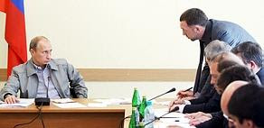
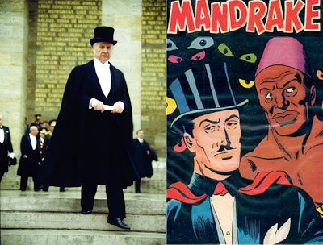

# Hafta 24

Barack Obama

[Yoneticiler] azinliklarin haklarina saygi gostermelidir. [..] Tek
basina secimler demokrasi icin yeterli degildir.

Dogru

Burada soyleyip duruyoruz. Liberal demokrasi kavrami burada devreye
giriyor zaten. Azinlik, birey haklarina saygi + secimler.

Demokrat ama ozgurlukcu olmayan dangalaklara duyurulur.

---

Dick Cheney

[mealen] Barack Obama ile ayri siyasi felsefelere sahibiz. Ben
Cumhuriyetciyim, o liberal demokrat.

Sen de liberal demokratsin farkinda degilsin

Mevcut kanunlar altinda yonetime secildiysen, bundan sikayet
etmediysen sen de liberal demokratsin, kelaj beyfendi. Seni takip
edenlerin en fanatik olanlari "federal hukumet bana dokunmasin" felan
demiyorlar mi? "Silah edinme hakkimdan vazgecmem" demiyorlar mi?
Patronun Bush I, II NAFTA'yi babalar gibi desteklemedi mi? Serbest
ticaretci degil misin? Sen de liberalsin. Ve demokratik sistem icinde
oynamayi kabul ettiysen ayni zamanda demokratsin.

Problem aslinda surada: ABD liberalizm kelimesini kendi kultur kodlari
cercevesinde ve secim kampanyalari icin carpitti ve su anda bu
kelimeyi saglikli bir sekilde kullanmak mumkun olmuyor. ABD kelimeyi
oyle bozdu ki buradaki anlaminda liberalizmden bahsetmek icin orada
"klasik liberalizm" demek zorunda kaliyoruz. Avrupa ve biz bu kelimeyi
hala dogru kullaniyoruz (Avrupa'nin duzgun yaptigi nadir islerden
biri). Bundan daha once bahsettik.

Tabii, her zaman oldugu gibi, burada okuz Fransizlar mustesna; onlar
degisik bir familya oluyorlar. Bunlar neoliberalizm diye bir kelime
hakkinda bir nefret havasi olusturdular, ama bunun da onlarin kultur
kodlariyla bir alakasi var. Bundan da daha once bahsettik.

---

Star

Bilgi Üniversitesi Sivil Toplum Çalışmaları Merkezi tarafından
yayınlanan, Galatasaray Üniversitesi Siyaset Bölümü öğretim üyeleri
Prof. Füsun Üstünel ve Doç. Dr. Birol Caymaz’ın hazırladıkları
‘Seçkinler ve Sosyal Mesafe’ konulu araştırmada, ‘prestijli’ orta ve
yüksek öğretim kurumlarından mezun, orta üst sınıf mensubu, iyi
mesleki pozisyonlara sahip, kendini Cumhuriyetçi, laik değerlerin
taşıyıcı olarak gören kesimlerin Türkiye’nin temel meseleleri
üzerinden Lozan azınlıkları, Kürtler ve muhafazakarlara yönelik algı
ve temsillerini ve bu bağlamda ötekileştirme söylemi ele alındı. [..]
Araştırmaya katılanların çoğunun başörtüsü meselesine ‘biz’ ve ‘onlar’
çerçevesinden baktığı ifade edilerek, en ılımlı söylemde bile
‘ötekine’ tehdit algısının olduğu vurgusu yapıldı. Ayrıca görüşülen
kişilerin neredeyse tamamının, eşi başörtülü olan bir kişinin
Cumhurbaşkanlığına tepkili olduklarına yer verildi.

Dogru

Arastirma dogru noktalara parmak basmis. Turkiye'deki rahatsizligin
yegane kaynagi kendini elit zanneden bu kisilerdir.. 12 Eylul, 28
Subat gibi oluslar hep onlara yonelik kurulmus "piyeslerdir" ve bu
kisilerin uzerinden belli araliklarla, cesitli sekillerde ulkede
"kontrol" ve "para" gasp edilmeye calisilmistir [1].

Kultur kodlarina inersek, bu kisiler kendini "sarayli" olarak gorur,
digerleri "koyludur". O kisilerin bayanlarinin taktigi basortusu de
zaten koylulugun simgesidir (her ne kadar bu konu hakkinda bir takim
kelime cambazligi yapmaya ugrassalar da akillarindan bu gecer) ve bu
sebeple o diger kisiler "sarayda" yani "onlarin oldugu yerde"
istenmez.

TR'de asagi yukari sarayi temsil eden yegane yer olan
Cumhurbaskanligi'nda tabii ki hic istenmez!

Ayrica koylu simgeleri onlari, kendini elit zannedenleri "daha buyuk
saray" "sarayin sarayi" olan Bati onunde rezil etmektedir [2].

Kafa boyle calisir.

Fakat kimse bu insanlara modernitenin bittigini, bireysel tercihlerin
yeni ekonomiyle beraber tekrar geri geldigini soylememistir. Bir tek
bunlar degil; Avrupa'daki salaklarin da haberi yok. Bunlar orayi takip
eder. Farkinda degiller ki gordukleri bu kisiler modernite asamasindan
gecmeden beyaz yakali ekonomiye atlamislar ve bu baglamda
aliskanliklarini, inanclarini degistirme luzumunu
hissetmemislerdir. Niye hissetsinler ki? Artik boyle bir gereklilik
yoktur. 1-2-3 yerine 1-3 gecisi yapilmistir. Modern Kemalistler ise
illa kendilerinin gectigi yoldan gecilmesini istemektedirler; ve mal
kultur kodlari bu anlayamadiklari durumu sert bir fay hatti uzerinden
ortaya koymalarini zorlamaktadir.

Bu noktada bir Martin Luther King'e ihtiyacimiz var. "Cocuklarimin
deri rengine [bizim icin giyimine] gore degil, karakterinin ozune
bakilarak deger verildigi bir ukede yasayacagi gunleri hayal ediyorum"
demisti.

Bu mesaj tekrarlanmalidir.

[1] Aslinda onemli bir suclu da gasp amacli basa gelmeye calisan
kisilerin medyadaki kopeklerinin kulturel fay hattini daha da
derinlestirmis olmasidir. Bu aslinda geri beslemeli bir dongu
(feedback loop) gibidir, kendi devinimi yine kendisini buyuten bir
garip dinamiktir. Kemalist kultur kodu uzerinden "farkliyi" gorur,
medya kopekleri bunu besler, farklilik buyur, medyadaki kopekler daha
fazla farklilik ortaya cikartabilir. Boyle devam eder.. Bu garabet 28
Subat'ta zirveye varmistir.

[2] Sarayi temsil eden seyler, eski saray ile ozdeslestirilen ne ise
o'dur; Egitim beceri sahibi olmak icin degil, "rutbe" sahibi olmak
icin edinilen bir seydir, zaten eskiden de "egitilince" saraya
girilmektedir. Cinsellik, escinsellik, alem konulari hep sarayla
ozdeslestirilen ve bu "sarayli olma" konusu ile yakindan alakalidir
[3]. Fransa'nin hayata atadigi kultur kodu ZEVK ALMA Kemalist'lerin bu
ulke ile yakin alakalari uzerinden ithal edilmis ve saraylilik
kistaslarina monte edilmis bir ektir. Acikcasi bu neresinden baksaniz
piclesmis, b.ktan bir sentezdir. Goruyorsunuz, azicik desince kagittan
ev gibi yikiliyor.

[3] Bu baglamda en sevilmeyen, korkulan kisiler cinsellik,
escinsellikle alakasi olan ama "onlarin tarafindan olmayan"
kisilerdir; Mesela Cemil Ipekci ve Emre Akoz. Biri escinsel digeri
"pornocu". Bunlari hic sevmiyorlar.

---

Aykırı

Bir yazida Cin endustriyellesip modernlesiyor dediniz, onun
silahlarini guzelce kullaniyor dediniz.. Onlar bunu yapabiliyorsa biz
niye yapamiyoruz? Madem hala yapilabiliyor..

Tum Cin yazilarimiz okudunuz mu?

[Aykırı adli karakter yeni eklendi, bu adam arada sirada "aykiri"
sorular soracak].

Cunku bu yazilarin birinde, Cin'de "sadece devlet rakamlarina gore"
yilda 80,000 sonu kanli biten isyan ve gosteri oldugunu
soylemistik. Eh, tamam ice kapanalim, sadece dis ihracata donuk mavi
yakali isgucune dayali gecikmis bir toptan endustriyellesme
gerceklestirelim, yukaridan-asagi, standart, tek-tip toplum
olalim. Kimlikleri yokedelim. Hizmet sektorunu sallamayalim, iletisim,
yazilim sektorlerine burun kiviralim. Demokrasi olmasin.

Ama iste onu yaparsan, yilda 80,000 kanli gosteriyi de (daha dogrusu
bizim nufusa gore ayarlanmis olan rakami) goze alacaksin demektir.

Cunku yeni teknoloji temelli sosyal degisim illa bir sekilde ulkeye
sizacaktir ve bu rahatsizliklar buyuyup daha fazla siddet, rahatsizlik
yaratacaktir.

Kuzey Kore gibi herseyi kapatirsan, bu isi "hakkiyla" yapabilirsin,
adamlarin koca koca antenleri var, disaridan sinyalleri engellemek
icin, halka surekli yalan soyluyorlar (zavalli insanlar BMW
arabalarinin Kuzey Kore mali oldugunu zannediyorlar), ve bu "piyes"
simdilik bir sekilde devam ediyor.

Turkiye bunu yapamaz. Efektif olarak mumkun degildir. Bu cografyada,
bu konjenkturde. Namumkun. Nicht moglich arschloch.. Not possible.

O zaman olmayacak duaya amin demeyeceksiniz. Turkiye'nin gidis yonu
daha fazla otokrasi, daha fazla tek-tiplesme olamaz. Optimalitenin
gosterdigi yon bellidir. O yol takip edilmese de takip etmemenin de
bir derecesi var.. KK olacak halimiz yok.

---

Anonim

Dunyanin hic bir yerinde [..]

Nereden biliyorsun?

Dunyanin her yerine gittin mi? Yoksa tum dunya ulkeleri hakkinda ardi
ardina kitaplari mi devirdin?

Aslinda ustteki kelimenin TR'de sikca gevelenmesinin sebebi ana
kulturel fay hatti olan "sarayli/koylu" hattidir.

Turkiye halki kendi icinde surekli bu ayrimi gozettigi gibi (kim o
tarafta, kim bu tarafta, ben neredeyim?) Bati ve disarisi soz konusu
oldugunda disarisi cogunlukla "sarayli", Turkiye'nin tamami "koylu"
olmaktadir. O zaman "dunyanin hicbir yerinde" diye baslayan kelimeler
aslinda "koylulere" "bu is sarayda soyle soyle yapiliyor" havasinda,
kulturel fay hatti uzerinden (guya) atilmis bir tokattir.

Nihai analizde aslinda bir kolayciliktir (ve bilgisizligin bir
bilincaltisal disavurumudur).

Bizim sahsen takip etmeyi sectigimiz yontem, asagidan yukari
baslayarak, en temel insani durtuleri, o durtulerin uzerinden sekil
buldugu en temel ekonomik gucleri baz alip, bunlari "toplayip" sonucun
bize soylediklerine bakmaktir. Dis ulkelerden gerektiginde, hem iyi
hem kotu baglamda ornekler veriyoruz, fakat tum bunlar aslinda
"dunyanin her yerinin" nasil bir degisim altinda oldugunu da
gosteriyor.

Saray yoktur. "Iyi" olan, optimal olandir. Optimalite buyuyen,
saglikli, mutlu bir nufus demektir. Kistas budur. Bu amaca nasil
ulasilacak? Savunulacak olani savunmak icin buradan hareket etmek
gerekiyor.

Bu baglamda, mesela, daha fazla bireysel ozgurlugu savunmak icin
"dunyanin hic bir yerinde" diye baslayan bir cumleye ihtiyaciniz
yoktur. Yeni ekonomik gereklilikler, bilgi bazli uretim bireyin daha
fazla ozgur olmasini GEREKTIRMEKTEDIR. Asagidan yukari. Yukaridan
asagi degil. Bu ozgur bireylerin toplaminin bir sekilde kendi kendini
yonetmesi GEREKMEKTEDIR. Yine asagidan yukari.

Not: Bu bir lineer, deterministik beyan gibi alinmasin. Halklar
optimal olani bulamayabilirler, bulsalar bile takip
etmeyebilirler... ve aci cekerler. Bu da mumkundur.

---

Hadi Uluengin

Cocukcagiz, cocukcagiz diyorum ama aslinda kazik gibi adam, beni fark
edince haniyse hazirola gecti. Ceket dugmelerini ilikledi ve elindeki
cigarayi avucunun icinde sakladi.

Ayni hat

Yoruma gerek yok.

---

Wired

Geri geldiler; Dogal olarak. Bu zaten Terminator'larin yaptigi is
degil mi? Geri gelmek? [..] Onlarin bir acidan "eski toprak" oldugunu
iddia edebiliriz. Son zamanlarda ekranlarda gordugumuz su yeni
robotlari insandan ayridetmek zor oluyordu. Battlestar Galactica'daki
Saylonlar, ya da Matrix'teki Sentient programlari gibi... Fakat
Terminator robotlari daha cok 50'li yillarin robotlari sanki, monoton
ses tonuyla konusan [..] sendika yapimi, emekci sinifi olum makinalari
onlar. Zaman kartlarina damgayi vuruyorlar, ve yapilmasi gerekeni
yapiyorlar.

Analiz hos, ama eksik/yanlis

Bir kere Battlestar Galactica felaket bir bilim kurgu dizisiydi, ve
bilim kurgu seyircisi bu dizideki "insandan fazla insana benzeyen,
asiri duygusal, cogunlukla manyak, garip" robotik kurguyu
begenmedi. Galactica her gecen sezon izleyici kaybetti ve umarim ki bu
seriyi "geri getiren" Ron Moore'un artik bu sektorde is bulmasi iyice
zorlasmistir.

Imdi; Insanlarin Terminator'u sevmesinin sebebinin su olmasi daha
muhtemel. Ozellikle TII'den baslayarak Arnold'un oynadigi bu robot
artik bir "kisisel bilgisayar" havasinda. Bir acidan T, tekil
kisilerin iPod, iPhone, PSIII bilgisayarlarini andiriyor. Bu makina
bazen bir arkadas, bazen sahibine gore "kisisellesebilen" bir
yazilim. Hatirlayalim; TII'de John Connor makinaya Ispanyolca laflar
ogretir [1], ona "herkesi oldurmemesini" emreder (ABD sakinma/ozgurluk
kulturel fay hattina uygun olarak tabii); yani makina gittikce
Connor'a gore "kisisellesmis" hale gelir.

Icinde oldugumuz cagin uretimi, urunleri de zaten boyledir. Sanayi
urunlerinde bile artik cok cesitli, hetrojen urunler goruyoruz ve
montaj bantlarinin omru gittikce kisaliyor. Henry Ford'un "siyah olmak
sartiyla arabanizi istedigini renkte alabilirsiniz" sozu geride
kaliyor.

Bu baglamda Terminator kurgusu, isin asiri dramatik tarafini bir
tarafa birakirsak, aslinda teknolojik olarak gitmek isteyebilecegimiz
(kisisellesmis Arnold bilgisayari baglaminda) bir gelecegi kurguluyor.

Peki o zaman Skynet nedir?

Skynet bariz bir sekilde modern eski olusu temsil ediyor. Dusman olan,
kapisilan bu sey "makinadir". Seri sekilde islerler, uretirler,
oldururler. Kitlesel, toptan is yaparlar. Skynet'in arka planinda
yapay zeka olup olmamasi onemli degildir cunku onlar artik insanliktan
kopmustur. Uretimleri insan odakli "kisisel" degildir. Sadece kendi
mekanize gercekliklerini devam ettirme amacli olarak uretirler ve
yokederler.

Terminator filmleri bu "savasi" resmettikleri, gercek kapismanin bam
telini yakalayabildikleri icin bu kadar zamandir seyirci
toplayabilmistir.

[1] Bu ufak ayrinti yillar sonra aktor Arnold Schwarzenneger'in
California valiligine aday oldugu zaman Ispanyol asilli oyverenlerden
muthis bir destek almasini saglayacakti. Oyle ki Arnold bu yarista
karsisinda gercekten Ispanyol asilli birini gecmeyi basaracakti.

[2] Muhakkak her begenilen uzun soluklu serilerde oldugu gibi T
serisinde de bazi alt/yan sorular sorulmakta... Mesela "biz insanlik
olarak hayatta olmayi hakediyor muyuz?" gibi. Sonucta belki de
makinalar insanligin evrildigi bir sonraki "seyi" temsil ediyor, niye
onlar degil de biz? Yillar yili insanlik ta dogayi kirletmis, istismar
etmis, bu yeni olusun ondan farki nedir? Gibi.. Tum bu sorular ek
katmanlar olarak filmleri renklendiriyor. Matrix filmlerinde ayni
sekilde.. Uyanmak mi iyidir yoksa uyanmamak mi? Mutlu bir sekilde
biftegini yiyorsun.. niye uyanacaksin ki? :) Cahillik mutluluktur :)
(aslinda degildir)

---

Ahmet Davutoglu

[mealen] Turkiye'nin Ortadogu ile iliskisi bir nevi ic politika gibi gorulmelidir

Katiliyorum

Evet; siyasetciler bu bolge ile ilgili konusurken sanki oranin
halklarindan da oy alacakmis gibi konusmali, siyaset uretmeli. Bir
kere bugunku dandik sinirlar zaten tarihte hicbir ornegi bulunmayan
acaip sinirlardir. Propaganda filminde harika bir sekilde resmedildigi
gibi, garip bir sekilde (aslinda petrol kaynaklarinin Bati devleti
tarafindan gaspini azamilestirecek sekilde) cizilmis sinirlarin iki
yanindaki insanlarin sanki hicbir sey olmamis gibi hayatina devam
ettirmesi beklenmistir. Soguk Savas suresince bu garabet duzen agir
aksak sekilde devam etmis olsa da, artik hizli bilgi iletisimi, onu
takip eden insan ve para hareketleri, serbest ticaret bu sinirlari
yavas yavas silmeye baslamistir. Bu bir guc kaymasidir ve nihai
analizde iyi bir gelismedir.

Ayrica; madem bu bolgenin kaderi bu kadar birbirine yakin, neden resmi
politikasi da birbirine resmi sekilde entegre olmasin? Irak
Parlamentosunda bir Turkiyeli olamaz mi? Veya TBMM'de bir Irakli?
Tabii, oraya gelmeden tum Turkiyelileri (mesela Kurtleri) kendi
meclisimizde hazmedebilen bir anlayisin gelismesi gerekir; umariz bu
da yavas yavas yerlesmeye baslar. Guc yansitmak istiyorsak once kendi
evimizin duzende olmasi gerekiyor.

---

BBC

Iran'da sokaktaki insanlar bir satranc oyununda tas olarak kullaniliyorlar.

Hoppala

Bunu oyle bir havada soylediniz ki sanki "herseyden habersiz gudulen
suruler" anlami cikti. Evet sokaktaki hareketlerin mollalarin kendi
iclerindeki bolunmelerle bir paralellik arz ettigi dogrudur. Fakat
ayni sekilde o mollalar-ici bolunmenin de bu "sokaktaki kanaatten" gaz
aldigi soylenebilir. Burada birbirini besleyen iki dinamik var; ama
bizim teoriye gore tabii ki, baslangic alttan yukari dogru olan -
insanlarin daha fazla ozgurluk ve demokrasi ihtiyaci. Bu "ham kuvvet"
iktidar odaklarina bir sekilde yansimistir. Onu "temsil etmeye"
"talip" olan birileri muhakkak cikar.

Secimlere hile karisti mi? Bati medyasi karistigina dair iddiasini
daha kesinlestirmeye basladi. Economist, BBC, CNN'de bu tur yayinlar
oldu. Kesinlikle mumkundur. O zaman mumkun degil diyemeyiz. Yapilmissa
yapilmisstir [Demirel aksaniyla].

Ne yalan soyleyelim; hile karismamis olmasinda kullandigimiz bazi ek
kistaslar Iran'in bolgede ve dunyada demokrat gozukme ihtiyaci, "iyi
yonetilen devlet" havasi yaymak istemesi gibi unsurlardi. Bu kadar
aptal olamazlar gibi bir yan arguman aklimizdan gecti.. Fakat Aznar'in
Ispanya'da kendi halkina yalan soylemesi orneginde, ya da Turkiye'de
son derece makul bir Cumhurbaskanligi secimi icin gerzekce engeller
yaratilip sebebi kapatmak icin yalan soylenmesi durumunda goruldugu
uzere, kadim bir ulkenin yonetici kademesinin de okuzluge son derece
acik olabilecegini goruyoruz. Iran'da bu olmus olabilir. Hem
Ispanya'da hem Turkiye'de halkin cildirdigini hatirlarsak, Iran'da
olanlar bu kadar acaip gelmeyecektir.

Fakat secime hile karismamis olsa bile, gostericiler yerden goge kadar
haklidir. Iran'a daha fazla demokrasi, daha fazla ozgurluk
gereklidir. Ulkesine Internet, Facebook, Twitter girmis yerin gidecegi
yer de zaten orasidir. Eh bu gidis once olur, bu gidis sonra olur. Ama
illa ki olur. Insanlarin mecbur olmadikca degismeme yonunde bir meyili
vardir, bu yuzden zor olan seyler hep ertelenir ve bu "seyler" de
toplana toplana birden ayni anda patlarlar, o sebeple tarihin ufak
ufak adimlarla degil, buyuk ziplamalarla gerceklestigi
soylenir. Entellektuellerin yapmasi gereken iste bu ziplamalari
gormeye, hissetmeye ugrasmaktir. Mevcut duzenin niye boyle oldugu, bu
aciklamanin sadece alt basliklarindan biri olabilir, ana hikaye
olamaz. Buraya dikkat.

---

Emre Akoz

'Irk' açısından bu toplumda 'Türk' azınlıktadır. Bir araştırma yüzde
12 gibi bir sonuç çıkarmıştı. O halde ırka dayalı bir millet anlayışı
yanlıştır. [..] Bence bizim için o kadar önemli değil. Çünkü sadece
çarşıda dolaşmak bile 'Tipik Türk' diye birisinin olmadığını
gösteriyor.

Dogru

Bu arastirmalardan hangisini takip edersek edelim, etnik Turklugun
Turkiye'de cogunluk olmadigi acikca ortadadir. Turkler bu topraklara
geldiler, karistilar, ve su anki koca sentezin bir parcasini
olusturdular. Dil, ayni sekilde, etrafindan etkilendi, Farstan,
Araptan bir suru kelimeler alindi, verildi.

"Orta Asya'daki atalarimiz" sozu bu sebeple yanlistir. Atalarimizdan
bazilari, bir kismi demek daha dogrudur.

Bunlar bir yana, isteyen kendisini ne hissediyorsa oyleyim
diyebilmekte serbest olmalidir. Kendini Turk hisseden Kurt "Turkum"
diyebilmelidir, tam tersi de gecerli olabilmelidir.

Ek olarak isminde "Turk" gecen her kurum bu kelimeyi "Turkiye" olarak
degistirmelidir. Turkiye Silahli Kuvvetleri, Turkiye Dil Tarih Kurumu
gibi.

"Turkiye Turklerindir" gibi basliklar hakkinda ise gereken derhal
yapilmalidir. Bu soylem bolucu bir soylemdir. Apacik sekilde teror
tesvik edilmektedir.

---

Clay Shirky'nin blogundan

Arkadaşım Nick Lemann Columbia Habercilik bölümünden mezun olanlara
çok güzel bir konuşma yaptı [..]. Şunları söyledi: "Benim neslimin
görüşü bir habercilik şirketine sahip olan bir kişinin bir "kamu
hizmeti" yaptığı yönündeydi. [..]. Elde edilen kar, bu şekilde
kaliteli bir haberciliğin finansına izin veriyordu. [..] Fakat artık
kaliteli haberciliğin yapılacağileceği türden bir kazancımız yok. Bu
değişim, acilen haber üretimi için yeni bir "iş modeli" arayışını
ortaya çıkardı. "

---

Biat, Itaat

Putin bir fabrikatoru fircalamis, herkesin onunde imzalamak istemedigi
bir belgeyi imzalatmis. Fabrikayi ziyaret edip "kizmis". Iste bu tam
populizmdir. Bizde populizm genelde "subvansiyon" konusu ortada var
ise gundeme cikar fakat populizmin daha genis bir tanimi var. Obama
aylarca once benzer sekilde sirketlere "kizdiginda" bu populizm
hissiyati ABD'de takir tukur guzelce analiz edildi. Populist, yani
"halkci" kendini halkin tum ihtiyaclarina kendi basina karar
verebilecek sekilde gorur, bu acidan bir tur kolektivist
sayilabilir. Cozumleri mikro bireylerin toplami olan dinamige
birakmaz, kendi halleder. ABD'deki tartismada isin evrimsel tarafina
bile girdiler; efendim populist "genler" halki "kendisi gibi"
gozetenlerdir ve bu alisveriste halk populiste ihtimam gosterir, ona
bakar ve bu genler bu sayede bir sonraki nesle intikal eder. "Sinir"
gosterisi ise herkese takip edilmesi gerekeni bildirmek icin bir
mesajlasma aracidir.Demokrasilerde secilmis her politikacinin
populizme biraz meyilinin olmasi normaldir, ne de olsa "halka", "cok
olana" hitap ederek oraya gelmislerdir. Bu bir ikilem; her yigidin
kendi yogurt yiyisi olacaktir. Obama'nin yaklasimi pek begenilmedi, o
da bu yontemi takip etmeyi birakti.

---

Economist: "Eski aliskanlar zor degisir. Turkiye bu atasozunu surekli
herseye burnunu sokan ordusundan daha cok dogrulamaya calisiyor
sanki. [..]  Pek cok kisi son olaylarin Basbug'un demokratik durusunu
ortaya koymasi ve ordu icindeki 'isyanci' ogeleri nihai sekilde
temizlemesi icin bir sans olarak goruyor, ama su ana kadar ortaya
cikan resim pek ic acici degil. Albay Cicek son olaylar sirasinda
gorevinden alinmadi ve ordu olaylarin basinda islenmesi konusunda
kanuniligi bile tartisilabilecek bir yasak koydu"

---

Wikinomics sitesinde guzel bir yazi. Yazar Mike Dover'a gore yeni
nesil "eskilerin klasikleri" Catcher in the Rye, Moby Dick gibi
eserleri sIkIcI buluyorlar. Bu eserlerdeki ana karakterler,
kahramanlar ile kendilerini ozdeslestirmiyorlar, onlarin yaptiklarini
sacma olarak niteliyorlar. Dogal olarak bu eserlerden "ders" te
cikartmiyorlar.

Makalenin alt kisminda Godfather (Baba), Spinal Tap gibi filmler icin
yazilmis (herhalde Amazon gibi bu urunleri satan bir siteden) alinmis
yorumlar daha da ilginc. Biz de sahsen benzer yorumlari Citizen Kane,
One Flew Over Cuckoo's Nest gibi herkesin "illa ki" "muthis, cigir
acan film" olarak betimlemesi "gereken" filmler icin de yapabilirdik
(Not: Katiliyoruz: Godfather filmlerinde en guzeli ucuncusudur).

Ozet olarak yeni nesil kenarda kosede kalmis, tecrit olmus, "degeri
bilinmemis", toplumu degistirmeye ugrasan anti-kahramanlar ile
ilgilenmiyor. Onlar bir sekilde icinde olduklari toplumda one cikmaya
ugrasiyorlar. Normal olarak one cikabilecekleri alanlar, basarili
olabilecekleri konulardadir, ve bu alanlar onlarin ilgisi, becerisi
oldugu konulardadir; Kapitalist duzen ise, bu one cikma ihtiyacini bir
sekilde topluma "servis" olarak dondurmeyi basarir ve devinim bu
sekilde devam eder. Herkes "gonenclenir", cok oturgacli goturgeclere
binilir.. hahaha... Yani, topluma olan fayda bireyin zevkleri
uzerinden sekillenir.

Modernite vs. sonrasi caglar arasindaki fark her zamanki gibi bariz
ortada.. Bu cocuklar montaj bantinda "beyinsiz isci" gibi
dusunmuyorlar ve hicbir zaman o isleri yapmayacaklar. Bu sebeple o
turden "yanlis" ekonomik aktiviteleri baz alan sanat, dusunce,
ideolojilerin cokmesinin sebebi daha da anlasilir oluyor.

---

Edge

John Brockman, Edge.org hakkinda

"Üçüncü kültür verişel/sayısal (empiriçal) iş yapan ve çalışmaları,
yazdıkları ile artık klasik entellektüellerin yerine geçmeye başlayan
bilim adamları ve diğer düşünürlerden olusuyor. Bu kişiler hayatımızın
derin anlamlarını ortaya çıkarıyorlar, ne ve kim olduğumuzu tekrar
tanımlıyorlar".

Geçtiğimiz birkaç sene içinde Amerika'daki entellektüel oyun sahasında
bir kayma meydana geldi. Klasik entellektüeller gittikçe marjinalize
oluyorlar. Artık 1950 model Freud, Marx ve modernite eserlerini hatim
etmiş olmak, 90 sonrası yıllarda entellektüel olmak için yeterli
değil. Hakikaten de klasik entellektüeller bu sebepten dolayı gittikçe
reaksiyoner bir havaya bürünmekteler; onlar çağımızın entellektüel
gelişimlerden habersiz oldukları gibi bu bilmemezlikten sapkın bir
şekilde neredeyse övünüyorlar. Bilimi hiç dikkate almayan kültürleri,
çoğunlukla verişel değil (nönempiriçal); bu kültür kendine has bir
jargon kullanıyor, kendi kirli çamaşırını kendisi yıkıyor.. Yorumları
yorumlayan, yorum üstüne yorum içinde kendi kendini boğan ve sonunda
gerçek dünyayla bağlantısını tamamen kaybeden bir tartışma usulü bu
kültürün en karakteristik özelliğidir [1].

1959 yılında C. P. Snow "İki Kültür" diye bir eser yayınladı. Bir
tarafta edebi entellektüeller vardı, diğer tarafta bilim adamları
vardı. Snow kendine inanılmaz gelen bir gözlemi de bu kitapta
paylaştı; 1930 yıllarında edebi entellektüeller çaktırmadan
kendilerini "tek entellektüel sınıf" olarak tanımlamışlardı - sanki
başka entellektüeller yokmuş gibi. Bu yeni tanım astronom Edward
Hubble, matematikçi Von Neumann, sibernetikçi Norbert Wiener, ve
fizikçiler Albert Einstein, Niels Bohr, ve Werner Heisenberg'ü tamamen
dışarıda bırakıyordu [..].

Daha sonra Snow 1963 yılında kitabının ikinci baskısını yayınladı. Bu
baskıda "İki Kültür: İkinci Bir Bakış" adlı yeni bir yazı vardı ve bu
yazıda Snow iyimser bir şekilde bir "Üçüncü Kültür"ün ortaya
çıkacağını, ve iki kültürün arasındaki boşluğu dolduracağını iddia
ediyordu. Snow'un bu üçüncü kültüründe edebi ve bilimsel
entellektüeller birbirleri ile konuşabilecekti. Fakat biz burada
Snow'un kelimelerini ödünç almış olsak bile, üçüncü kültürün onun
tahmin ettiği şekilde ortaya çıkmadığını eklememiz gerekiyor. Edebi
entellektüeller hala bilim adamlarıyla konuşmuyorlar. Bilimsel
entellektüeller halka direk konuşmaya başladılar. Geleneksel
entellektüel medya, hep yatay bir oyun oynayagelmiştir; bu oyunda
gazeteciler yukarı doğru, profosörler aşağı doğru yazardı. Bugün,
üçüncü kültür düşünürleri orta tabakayı eş geçerek en derin
düşüncelerini kafası çalışan okuyan halka hitap edecek şekilde, direk
kendileri dile getiriyorlar.

Ağır konular içeren ciddi bilim kitaplarının satış başarıları sadece
klasik düşünürleri şaşırttı [2]. Onlara göre bu tür kitaplar bir
"anormallik" idi. Bu kitaplar alınıyor ama "okunmuyordu". Bu görüşe
kesinlikle karşıyım. Ortaya çıkan bu yeni üçüncü kültür aktivitesi
insanların yeni entellektüel fikirlere karşı ne kadar büyük bir açlık
hissettiklerini ispatıdır ve kendilerini eğitmek için
gösterebilecekleri eforun bir göstergesidir.

[1] Belki bu "gerçekten kaçışın" önemli sebeplerinden biri, modern
hayatın son derece sıkıcı, monoton bir yer olmasıdır (ya da iki dünya
savaşının ispatladığı gibi dehşet verici berbat bir yer). Fakat yeni
çağda artık gerçeklik tekrar ilginç hale gelmeye başladı, ayrıca
yapılacak çok iş var! Herkesin bu işin bir tarafından tutması
gerekiyor.

[2] Burada iyi örneklerden biri Stephen Hawking'in A Brief History of
Time kitabıdır. Kitap son derece derin konulardan bahsediyor olsa da
müthiş bir satış başarısı yakaladı. Günlük işlerinde sürekli
"sembolik" düşünen bilgi toplumu için, artık bu tür entellektüel
egzersizler artık "erişilebilir" hale gelmiştir. Satış grafikleri
arasında korelasyon arayan, pazarlama amaçlı anketleri gözleyen,
istatistiklere bakan, hatta sofistike bilgisayar programları yazan
"normal beyaz yakalı vatandaş" artık bu kavramları anlayabilir, en
azından onlara karşı bir merak, açlık beşler hale gelmiştir.

---

Enternasyonalizm

Sosyalist temelli ideolojilerin one cikarttigi "enternasyonalizm"
fikrinin takipcileri neyi takip ettiklerini iyi anlamali ve
kavramali... Oncelikle sosyalizme onemli katkilarda bulunmus Moses
Hess ve komunizmin kurucusu Marks birer Yahudi olarak "sinirlarotesi
olma" fikirlerini ittirirken bilincaltisal olarak ulkelerindeki
yerellige sikismis ve diger ulkelerdeki kardesleri ile iletisme istegi
guden azinliklarin, yani Yahudilerin bilincaltisal ihtiyaclari
isiginda davraniyorlardi.

Bu fikriyattan yeni bilgi ekonomisinin ortaya cikaracagi hizli
iletisimin ve serbest piyasanin ortaya cikardigi kuresel ticaret,
seyahat, iletisime gelmek, enternasyonalizmcilere "benzer", "tanidik"
gelebilir; ama tami tamina ayni sey degildir.

Dogru noktaya yanlis yoldan gecerek ulasmak, sizi ileride farkli
yanlislara ulastirabilir cunku konjenktur degistigi anda yanlis yoldan
gecenler bir sonraki dogruya erisemediklerini farkedeceklerdir.

Sovyetlerin enternasyonalizmini romantize edenler, bu stratejik
hareketin, Sovyetlerin endustriyel ekonomisini beslemek icin kaynak
arayisinin bir bacagi oldugunu goremiyorlar.

Cunku aynen emperyalist Bati'nin dunyanin her yerinde dogal kaynaklari
talan ettigi gibi, Sovyetler de kontrolleri altinda olan ufak "uydu"
ulkelerin dogal kaynaklarini talan etmistir.

Avrupa'da sozde "sag" kazaninca siz "kaybetmis" falan
olmuyorsunuz. Siz zaten yoksunuz. Sizin kafaniza Berlin duvari
yikilmis, altinda kalmissiniz. Cokmussunuz. Yeni sol, yeni sag
pesindeki kisileri bu baglamda bosuna ugrasiyorlar.

Bu acidan kuresellesme de sizin fikri alaninizda degildir.

Kaldi ki kuresellesme yeni cagin basat bir faktoru degildir. Emtia
fiyatlari bir artarsa, nakliyat fiyatlari yukselirse, o zaman
kuresellesme degil bolgesellesme gorurdunuz, ve bu sizin
teorilerinizin patlamasi anlamina gelirdi. Mevcut teknoloji baglaminda
Agri'daki bir programci ile iletismenizi saglayan tekniklerle
Japonya'daki bir programci ile iletismenizi saglayan teknoloji,
teknikler arasinda hicbir fark yoktur. Bunlarin birisinde "yerel"
birisinde "enternasyonel" oluyor olabilirsiniz, fakat bireyin
ihtiyaclari acisindan bunun zerre kadar farki olmazdi. Kullanilan
teknikler ayni olacakti.

Avrupa'nin problemi "ulus-devleti" probleminde sikismis olmasi degil,
o butun ulus, uniter, vs. devletlerin kendi icinde ne kadar bilgi
ekonomisine gecip gecemeyecegidir. Lizbon'da belirlenen hedefler AB
ulkeleri tarafindan surekli iskalanmistir. Lizbon toplantisina katilan
eski demirperde ulkeleri bu "politburo toplantisina" benzeyen gudubet
"calistay" ile ne yapacaklarini bilememislerdir. Cogunlukla toplantiya
gulmuslerdir.

---

Obama Misir Kahire'de guzel bir konusma yapti. Kuran'dan bol bol
alintilar yaparken tum dinlerin ortak noktasina vurgular yapti,
ozgurluklerden bahsetti, kendi ulkesindeki muslumanlarin (ve tum diger
dinlerin takipcilerinin) hayat bicimini yasamalarinda taninan
ozgurluklerden ve bu ozgurluklere engellemeye calisanlara verilen
cezalardan bahsetti. Turkiye'nin "Medeniyetler Ittifaki" cabasina
vurgu yapmasi bu atilimin dis politikanin meyve vermeye basladigini
gosteriyor.Obama musluman ulkelerine yonelik buyuk bir konusma
yapacagini soylemisti; herhalde o konusma bu. Tum dinlerin ana
mesajinin temel insan haklarinin soylemi ile ayni oldugu mesaji da
olumluydu.Konusmanin tum metni.

---

\#Hackedu

Twitter hakkindaki bir yazimizda # isareti ile nasil dinamik, onceden
planlanmadan (isteyen Twitter mesaji yazarken istedigi kelime basina #
isareti koyabilir) online gruplasmalar yaratilabildiginden
bahsetmistik. Time dergisinin bu haftaki yazisinda Twitter hakkinda
bir ornek vardi; orada #hackedu [1] gruplasmasindan bahsediliyordu. Bu
gruplasma muthis bir ornek cunku sosyal medya uzerinden bilginin nasil
yayilabildigini gosteriyor. #hackedu aslinda egitim reformunu konusmak
uzere toplanan 30 kusur kisiden basliyor. Bu kisiler fiziksel olarak
bir lokasyonda toplantidalar. Toplanti ve prezentasyonlar sirasinda
oradakiler bilgisayarlari, cep telefonlari uzerinden #hackedu
uzerinden statuleri hakkinda bazi mesajlar yaziyorlar. Ve bir sure
sonra bu mesajlar yavas yavas disari sizmaya basliyor (su metaforuna
dikkatinizi cekerim) ve bir sure sonra toplantiyla alakasi olmayan
kisiler #hackedu uzerinden egitim reformu hakkinda kendi goruslerini
bildirmeye basliyorlar. Fiziksel toplantida olanlar bunu farkediyor,
onlar da bu mesajlari alip gercek zamanli olarak toplantilarinda geri
besleme olarak kullanmaya basliyorlar.

Muthis bir sosyal medya basarisi.

Simdi, bizim icin daha onemlisi #hackedu altinda konusulanlar. Bazi
ilginc baglantilar bulduk; tercumeler takip edebilir.

[1] Hack, kurcalama, degistirme anlaminda kullaniliyor, edu ise
education yani egitim kelimesinden geliyor.

---

Businessweek dergisinden Michael Mandel'in ilginc bir teorisi var: Ona
gore krizin onemli sebeplerinden biri inovasyon eksikligidir
(innovation shortfall). Bu eksiklik yuzundendir ki, zaten kuresel
dengesizlikler yuzunden asiri miktarda yatirim yeri arayan sermaye,
inovasyonla alakasi olmayan emlak temelli yatirimlara yonelmistir; bu
para ileride ABD'nin bir sekilde inovatif urunleri kesfedip piyasaya
surebilecegi umuduyla ABD'ye gelmistir ama o urunlerin ortaya
cikamamasi, baska yere yonelemeyen paranin olusturdugu balonun
patlamasina yol acmistir. Mandel'e gore son caglarda dogru durust
inovatif urunlerden akilda tek kalabilecek olan iPod'dur. Halbuki
bundan once modern caglarda radyo, televizyon, ucak, otomobil gibi
urunler devrimsel, hayat degistiren, cigir acan turden buluslardi.

Teoriye yuzde yuz katildigimi soyleyemem.. Ama yine de ilginc bir
bakis acisi.

http://www.businessweek.com/magazine/content/09_24/b4135000953288.htm

---

Mahmut "Ahmetcan" Ahmedinejad'in fark atarak tekrar secilmesinin yankilari suruyor. Suradaki bir rapora gore secimden once yapilan anketlerde Ahmedinejad'in acik ara farkla kazanacagi saptanmis. Soyle bir dusunce akla geliyor; eger mollalar hakikaten sonuclara hile karistirmak isteseler, acaba farki daha az yapmazlar miydi?.. Secime hile karismis olma ihtimali sifir degil; simdilik onumuzdeki bilgiye bakarak bunun olmadigini tahmin ediyoruz.

Iran'daki secimlerin ABD'yi takip ettigi, yansittigi soylenir, Ahmedinejad'in seciminin Bush II secimi ardina gelmesi gibi (sahine karsi sahin). Eh peki o zaman Obama sonrasi niye daha az sahin olan adam Iran'da secilmedi? Bu dogru bir soru, fakat Israil'de olanlara bakalim (orasi da Iran icin onemli) ve orada basa gelen yine bir sahin oldu (Benjamin "Neden Yahu?" Netenyahu). Ahmedinejad kirsal bolgede yasayanlardan cok destek aliyor. Eski Tahran belediye baskani bu arada.

Bunu soylerken Iran'da sokakta gosteri yapanlari anladigimizi da belirtelim. Mevcut demokratik haklar yeterli degil, Cumhurbaskaninin bile uzerinde olan dini lider halk tarafindan secilemiyor, anketlerde her 5 Iranlidan 4'unun dini lideri de secmeyi istedikleri ortaya cikmistir. Ayrica daha fazla bireysel ozgurlukler gerekli; genclerin uzerinde baskilar var, ahlak polisi kadinlarin ustune basina karisiyor (zorla bas acilmasina da kapatilmasina da karsiyiz), kadinlarin yeterli hukuki haklarinin olmamasi kotu. Aslinda Iran agir aksak liberize etme yonunde ilerliyordu; telekom, enerji sektorlerinde ozellestirmeye baslamisti; demek ki daha fazlasi gerekiyor.

Twitter'dan tum gelismeleri aninda izleyebilirsiniz. En son baktigimda her dakika onlarca mesaj geliyordu.

---

Jeomuhendislik

Kuresel isinma regulasyon, karbon ticareti, vs. gibi yaklasimlarla
nihai olarak engellenezse, "jeomuhendislik" denilen buyuk (dunya)
capinda atilabilecek bazi adimlar ile isinmayi engellemeye ugrasmak
gundeme gelebilir. Ilac tedavisi yerine ameliyattan bahsediyoruz
yani. Bu jeomuhendislik planlarindan bir tanesi atmosfere buyuk
miktarda sulfur yaymaktir. 1991 yilinda Filipinlerde bir yanardag
patladigi zaman dagdan cikan ve atmosfere yayilan sulfurun, bir
sonraki sene sicakligin 0.9 derece dustugunu sagladigi
gorulmustur. Buradan hareketle suni olarak insanlarin yayacagi
sulfurun sicakligi istenen olcude indirebilecegi dusunulmektedir.

Bunlar oldukca ekstrem mudaheleler muhakkak; diger sinirlamalarin hala
yapilmasi iyi olur fakat gerekirse bu tur planlarin uzerinde simdiden
dusunmek faydali.

---

Kotu Cocuk Iran

Yillardir ABD baskanlarinin Iran hakkinda zart zurt konusmalarina
dinliyorum; fakat dusunuyorum dusunuyorum, bir turlu Iran'i niye boyle
kaka cocuk haline getirdiklerinin 'normal parametrelere' bakarak
anlayamiyorum.

Iste yine bir Iran secimi, bu sefer kaos, bir suru olay var, ve ABD
baskani cikiyor televizyona bu konu hakkinda 'bir seyler'
soyluyor. Ama kardesim, Iran 'niye bu kadar onemli?'. Bir kere,
konvansiyonel olarak kesinlikle senin disinin kovuguna bile girecek
bir rakip degil. Adami ezersin. Aninda.

Nukleer olarak eh tamam, silah gelistirmeye ugrasiyor ama o silaha
halen sahip degil. OLSA BILE onu ABD'ye gonderebilecek (delivery)
mekanizmasina sahip degil. OLSA BILE bir iki tane gonderir, ardindan
adami yokedersin.

Hayir. Iran'a surekli bu sekilde bir onem atfedilmesinin sebebi askeri
olamaz. Sebep jeostrateji ile alakali olmalidir. Ortadogu'daki dis
ucgen Turkiye, Misir, Iran icinde muhakkak bir kaka cocuk bulunmalidir
ve bu cocuk bir sekilde disari itilmelidir. Bu 'yapay' dusman uretme
stratejisi sebebiyle Iran'dan ABD medyasinda gereginden fazla
bahsedilmektedir cunku onu bir sekilde sistem disina itmek gerekir ve
bu sadece onu gereginden fazla onemli gostererek mumkundur. Bu
kadar. Medyalari bunu sorgulamiyor tabii; disislerinin soyledigine
balik gibi atliyorlar (merkez medyasi sonucta).

---

Kredi Kart Sirketleri

ABD'de eger birisi kredi kart borcunu odemezse ne olur? KK borcu
'guvenlenmemis borc' kategorisindedir; yani bu tur borclarin
gayrimenkula, arabaniza, vs. baglantisi yoktur. Eger biri KK borcu
odemezse KK sirketi gelip arabanizi alamaz. Prosedure gore borc var
ise bu borc bir 'tahsilat sirketine' transfer edilir (bu noktada akla
eli sopali iri kiyim adamlar gelebilir), fakat bilindigi uzere bu
kisiler telefonda 'rahatsiz / usteleme (harrass)' etmek haricinde bir
sey yapamazlar; yani biri KK borcunu odemezse, odemek istemezse, bunu
yapabilir.

Burada risk KK sirketinin kucagindadir... Baska nerede olacakti ki?
Bir kisiye gereginden fazla kredi acmislarsa o kisi bu krediyi
kullanip odeyemediginde KK sirketi hata yapmis demektir. O adama o
krediyi vermeyeceklerdi. Tabii su sorulabilir; bunun nasil bilsinler?

Iste bu bilme 'ihtiyaci', piyasanin o yone 'ittirmesi', KK sirketleri
bunyesinde bir suru inovasyonu yaratmalari icin onlari tesvik
etmistir. Mesela su anda KK sirketlerinin elinde oyle analitik, tahmin
edici (predictive) algoritmalar, programlar vardir ki, bir soylentiye
gore alim satim kayitlarina bakarak KK sirketi birinin bosanip
bosanmayacagini yuzde 95 uzerinde bir dogruluk ile iki sene onceden
tahmin edebilmektedir.

Bunu niye tahmin etmeye ugrasiyorlar? Cunku bosanma finansal durumda
bir bozukluk ortaya cikartabilir ve onlara donecek odemeleri
aksatabilir (mesela). Bu onlar acisindan bilinmesi iyi olacak bir
gelismedir. Bu tur analitik alanlarda at kosturan biri olarak bunu
kesinlikle mumkun oldugunu da burada belirteyim.

---

\#Mandrake

---

Twitter'de \#hackedu altinda paylasilan baglantilardan biri bir Koreli
milyar dolarlik egitim sirketi Megastudy (mega ogrenim) hakkinda. Bu
sirket hakkinda bazi bilgiler:

1. Ozunde Megastudy bir online ogrenim sitesi (ders videolarini
Internet uzerinden sunuyor).

2. "Is modeli" ogrencinin istedigi derse abone olmasi etrafinda sekilleniyor.

3. Her dersin ogretmeni o dersin cirosundan %23 gibi bir pay aliyor.

4. Sistem online calistigi icin bir ogretmenin potansiyel olarak
sinirsiz sayida ogrencisi olabiliyor.

5. Bunun sonucu olarak bir ogretmenin ortalama maasinin $40K oldugu
bir ulkede yilda 1 milyon dolar kazanan ogretmenler var.

6. Ogretmenler derslerine talep yaratmak, "populer olmak" icin
eglenceli, neseli, efektif ve ogrencisinin ilgisini ceker sekilde ders
anlatmak zorunda. Yani ogretmen bir nevi "girisimci" olmali.

Megastudy Kore'deki standart testlerde basarili olmak isteyen
ogrencilere yonelik bir sirket (bir tur online dershane) fakat bu
sistem ilkogretim, universite bazinda da uygulanabilir. Derslerin bir
"piyasada" sunuluyor olmasi ilginc; bu sayede en etkili hocalarin ders
"kayitlari" piyasanin oy verme mekanizmasinda daha yukari
cikiyor. Megastudy, bir sirket olarak, hocanin dersini kayit etmek
icin ekipman, beceri ve kayitlari depolamak, Internet'ten sunmak icin
teknik altyapiyi sagliyor. Gerisi ogretmen ile ogrenci arasinda.

Not: Bu sistemin Guney Kore'de yaygin olmasinin bir sebebi de GK'nin
uzun bir sure dunyadaki en yuksek ve birim fiyati en ucuz Internet
servisine sahip olmasiydi belki de. Su anda bu tur bir servis TR'de
verilebilir mi? Fizibileteye konuyla ilgilenenlerin bakmasi gerekir.

---

Allah rahmet eylesin; Michael Jackson vefat etti. Hakkinda bir suru
iddia, suclama yapilmisti, dogru olup olmadiklari hicbir zaman
anlasilamadi, ve bu unlu kisiligin gizemli hayati gizemli bir sekilde
sona erdi.

ABD'de MJ'ye karsi hep bir antipati hissetmisimdir, kiyasla bu
hissiyat Avrupa'da cogunlukla mevcut degildir. MJ'in ABD'de yasadigi
antipati, zannederim, MJ'in kendi irksal, kulturel mirasini (heritage)
yok sayip baska bir sey olmaya calismasiydi. Zenci bir arkadasimla bir
kere televizyonda bir MJ klibine denk gelmistik, arkadasin soyle bir
bakip "yahu bu adam bembeyaz olmus!" diye yorum yaptigini
hatirliyorum. O yillarda artik ABD "gecmisini hatirla" "atalarina
saygi goster" moduna girmisti. Domates corbasi degil bir "salata
kasesi (salad bowl)" olma cabasinin izleriydi bunlar. Aslinda bu
secimin optimal bir durus oldugunu kabul etmek gerekiyor, sadece MJ,
belki de dogdugu (eski) cag itibariyle, bu akimin biraz
disindaydi. Reagan cifti ile cektirdigi fotograf dunyanin en garip
fotograflarindan biri sayilmalidir bence (ben sizin kulturunuzun
askeriyim durusu).

Diger taraftan; Ilginc gelebilir ama MJ'in psikolojik analizi onun
asiri savasci karakterde biri oldugunu gosteriyor. Bu tur insanlar
miyminti, canim cicim tipler degildir. "Ben" ve "herkese karsi ben"
hissiyatiyla kusanmis asiri savasci insanlardir. Bazi MJ kliplerindeki
siddet gosterileri (tabii ABD sakinma / ozgurluk hattina satis
yaparak) bu baglamda okunmali; Ama bu insanlarin aslinda digerlerine
guc vermeyi, desteklemeyi ogrenmesi gerekir, MJ kariyerine bakarsak bu
ne kadar basarilmistir, bilemiyoruz. Efendim cocuklugu soyledi
boyledi, babasi onu asiri calistirmisti... Sacmalik bunlar.. Bu
karakterdeki insanlar ne tur olursa olsun disiplin ortamina alisiktir,
iyi ya da kotu, karakterleri buna musaittir.

Sonuc olarak, pek cok arkadasin belirttigi gibi, MJ bu dunyaya
aldigindan daha fazlasini geri vermistir, bu sebeple iyi sekilde
anilmayi haketmistir, bizce. Kendi dilinde ekleyelim: RIP.

---

Ingiliz disisleri bakani David Miliband pek cok kisi tarafindan Isci
Partisi'nin gelecegindeki lider olarak gorulmekte, mevcut basbakan
Gordon Brown bayagi kotu durumda. Buna ilahi adalet mi denir bilmem
ama, Brown yillarca Blair'in yerine gecmek icin onun basinin etini
yemistir [1], partideki "ikinci guclu adam" olarak hep "hadi artik
sira bende" diye Blair'i iteleye ugrasmistir. Nihayet sira ona geldi
ama konjenktur saginda solunda patlamaya basladi. Bir krizi bir digeri
takip etti.

Brown hakkinda bazi ufak gozuken ama onemli detaylar var. Bir kere,
basbakan olup tutunabilmek icin "kafa adam" testinden gecmeniz
lazim. Sokaktaki adam "bu adamla takilir miydim" yani "kafa adam mi?"
sorusuna bir lidere bakarak "evet" diye cevap verebilmelidir. Ne yazik
ki Brown bu testten gecemiyor. Garip tikleri var; konusurken agzini
garip bir sekile sokup sol tarafindan "ara gazi" aliyor. Fazla
gulmuyor. Tony Blair kadar eglenceli, kafa goruntude degil. Yillarca
maliye bakanligi yapmis birinin ekonomik kriz sirasinda "tecrube"
yansitarak basarili olmasi beklenirdi fakat krizin Brown'a yaramadigi
goruluyor. Liderlikte "ilham / enerji verebilmek (inspire)" onemli bir
ozelliktir, Brown bu goruntuyu ne yazik ki yansitamiyor.

Miliband bu testte basarili. Bu onemli.

Simdi bu yazinin esas konusuna gelelim.

Gectigimiz hafta arkasi arkasina Brown'in bakanlari istifa etmeye
basladi. Bu bakanlardan bazilari "harcama skandalina" karismislardi
"nasil olsa mecburen isi birakacagim, simdi kendim istemis gibi isi
birakayim" havasina girmeyi uygun bulmus olabilir; bunlar suruyu takip
edip "sonra yerine once" istiflarini bastilar, onlar baska. Ama onemli
bir kisim Brown ile bu isin yurumeyecegi dusuncesine sahip. Bu sirada
"partinin gelecegi" olan Miliband ne yapti?

Brown'i destekledi.

Sebep? Kisisel cikari, motivasyonu takip edelim.

Isci Partisi su anda uzun suredir iktidarda; ve Blair'in Irak Savasi
sacmaligi, yalan soylemesi, kriz sonrasi isleri sonunda iyice
hirpalandi. Brown'da zaten karizma sifir. Simdi su sekilde bir
"hikaye" Miliband icin daha uygun: Isci Partisi batti, bir donem
muhafazakar (Tory) hukumeti denendi, onlar da batti, ve "kurtarici
olarak" Miliband geldi.

Miliband, bence, onumuzdeki secimde muhafazakar lider [2] Cameron
karsisina cikmak istemeyecektir.

Muhalefette iken "partiyi toparlayan lider" olarak gozukmek onun icin
daha uygundur.

[1] Blair, Anthony Seldon, 2004

[2] Bu arada muhafazakar diyoruz ama sag sol ayrimi artik kalmadi;
Cameron yesilci, mudaheleci, ayni anda serbest piyasaci. Ha? "Devrimci
degil evrimciyim" sozune hep vurgu yapiyor, bir yandan Blair'i babalar
gibi kopyaliyor (Blair'in Theatcher'i kopyaladigi gibi)... 21. yuzyila
hosgeldiniz.

---

This American Life programı finans krizini işlemeye devam
ediyor. Bugünkü programı The Watchers da konu reyting
şirketleriydi. Krizee giden yolda reyting şirketleri, temelinde düşük
kalitede mortgage borcu bulunan enstrümanlara en iyi notu, yani AAA
notunu vermişlerdi. Fakat AL programına göre bu hareket tek başına
krizi oluşturmak için yeterli değildi. Esas önemli faktör, bankaların
ne tür yatırımları elinde tutabileceğini tanımlayan bir kanundur ve bu
kanuna göre bir yatırımın kalitesinin ne olduğunun irdelenmesi reyting
ajanslarına bağlanmıştır! Hatta birkaç tane reyting ajansına
bağlanmıştır! Bunu iyi bir tartalım; düşünün; pek çok sayıdaki banka,
trilyonlarca değerinde yatırımı irdelemek için birkaç tane reyting
ajansının notuna bakıyor!

Bu, yine devletin merkezileştirici, odaklaştırıcı yan etkisinin
çuvallamasının resmidir. Piyasanın kuvveti pek çok aktörü fiyat
üzerinden arz-talep dengesini oluşturabilmesidir. Mesajlar toplum
içinde optimal şekilde kişiden kişiye atlayabilir (propagate). Fakat
kanunlar ile "hangi yatırımın iyi olup olmadığı" "birkaç tane" reyting
ajansına bağlanınca bu hareket sisteme potansiyel bir "bozuk mesaj"
"bozuk sinyal" sokmak ile eşdeğer hale gelmiştir çünkü tekil aktörler
çuvallayabilirler.

Gönderdikleri yanlış mesajlar piyasanın dinamiği içinde düzelemez,
düzeltilemez.

Ve krizin önemli bir sebebini daha burada öğrenmiş oluyoruz. Aynen
politikacıların güya fakir insanlara yardım etmek için düşük kalitede
emlak yatırımlarını yarı-kamusal kuruluşlar üzerinden "zorladıkları"
gibi, kanunlardaki hangi yatırımın iyi olacağının birkaç tane reyting
ajansı tarafından tanımlanmış olması yangına benzin atılması anlamına
gelmiştir. Bankaların defterlerine milyarlarca dolarlık kötü yatırım
bu şekilde girmiştir.

---

Teknoloji cevrelerinde bu soru geziniyor.. Onemli bir soru. Twitter sitesinde reklam goremiyoruz. Mesajlara reklam eklenmiyor.. O zaman Twitter nasil para kazanacak? Twitter uygulama genisletme stratejisine bakiyoruz; programlama arayuzleri sayesinde mesaj gondermek icin Twitter sitesine bile ihtiyaciniz yok.

O zaman geriye tek bir sey kaliyor. Twitter omurgasi uzerinden gecen mesajlarin verisel degeri. Aslinda yeni ekonomide boyle bir sey var: Bir uygulamanin idare ettigi verinin degerinin o uygulamanin kendisinden daha fazla olabilmesi hali [1].. Facebook icin ayni seyi soyleyebiliriz. Gucun uc bacagi fiziksel, parasal ve bilgisel guctur, bunlardan bilgi en esnek kullanilabilen (versatile) olanidir, cunku diger birimlere en rahat sekilde cevirilebilendir; o zaman Twitter idare ettigi bilgiyi ileride paraya donusturmeyi umabilir.

Belki servis verdikleri sirketlere uzerilerinden akan bilgiye gone bazi analizler sunarlar; bir analitik departmani kurabilirler. Hukumetler, STK'ler bu servislere uye olabilir. Twitter'daki akan mesajlardaki bazi kelimelerin frekansina gore cografi bolgelerde alarm zilleri caldirabilme boyle bir ozellik dusunulebilir. Ucuncu partiler simdiden boyle uygulamalar yapiyorlar; #swineflu (domuz gribi) kelimesine gore o mesajlarin cografik dagilimini gosteren harita uygulamasi bunlardan biri [2]..

[1] Revolutionary Wealth, Toffler, A., 2006

[2] Bahsedilen uygulama bir Twitter ve Google Maps harmanlamasi

---

Güzel bir siteye denk geldik; Üçüncü Kültür. İsim olarak bizim
blogdaki 'üçüncü' kelimesi ile direk alakaları yok, fakat kavramsal
olarak arada birebir bağlantı var. Kendilerini tarif ettikleri
aciklamada "eski tur entellektüellerin çağımızda gittikçe marjinalize
oldukları"ndan, ve "1950 model Freud, Marx ve modernite eserlerini
hatim etmiş olmanın artık 90 sonrası yıllarda entellektüel olmak için
yeterli olmadığı" analizi yer alıyor.. Bu analize kesinlikle
katılıyoruz. Merkez medyamızda boy boy yer alan, donuk kafa resimli,
bazen "hırka" giymiş dua eder gibi "sol", "sağ" kelimesini sürekli
tekrarlayan, yeni teknolojilerden bahsetse bile onların sosyal
dokudaki etkilerini kavrayamayan entellektüeller de işte tam da bu
kategoriye giriyorlar. Bu kişiler düşünce hayatında ne büyük bir kayma
olduğunun farkında değiller... Edge sitesinin onlar için bir kalk
borusu görevini görmesini umuyoruz.

http://www.edge.org/about_edge.html

---

Yeni Yeni Ekonomi

Chris Anderson, Wired makalesi, 2009

İnternet'in şekillendiği 80'li yılllarda Tom Malone adlı bir MİT
profosörü, bu yeni oluşumun endüstrileri nasıl değiştirebileceği
konusu hakkında düşünmeye başladı. Malone arka arkaya seri halde
yayınladığı makalelerde 20. yüzyılın büyük "yukarıdan aşağı" organize
olmuş şirketlerinin gayri-merkezileşmiş hale geleceğini ve bu
şirketlerin içeride yaptıkları pek çok işi "dışarıya" vereceklerini,
yani bir "endüstri ekosistemine" dönüşecekleri tahminini yaptı.

Malone 1998 yılında Wired dergisine verdiği bir röportajda "iki, üç
şirkete değil, iki, üç yüz şirkete bölünmüş bir AT&T şirketi hayal
edin" diyordu ve ekliyordu "bu şekilde radikal ve kendi insiyatifleri
ışığında olacak bir parçalanma bazı büyük şirket için daha tercih
edilir bir alternatiftir".

Bu düşünce aslında gerçekten rasyonel bir temele dayanıyordu. O
devasa, dikey şekilde entegre olmuş büyük şirketler tedarik zinciri
üzerindeki takımlar arasındaki, Ronald Coase'in "işlem masrafı
(transaction cost)" adını verdiği bedeli azaltmak için ortaya
çıkmışlardı. Ama şimdi dağıtık enformasyon ağları aynı işi bir
şirketin duvarları dışında yapmayı mümkün kılıyordu. Bu anlamda Web,
küreselleşmenin daniskasıydı. Projeler onu bitirmeyi en yetkin
olanların talebine açık olacak, tek bir ürün için anında bir araya
gelebilecek kişiler, takımlardan müteşekkil şirketler oluşup, sonra
bir başka ürün için aynı işi tekrarlayabileceklerdi. "Gevşek
bağlantılı ufak parçalar" cümlesi günün sloganıydı.

Fakat dış dünyanın gerçekliğinde, sanki bu öngörünün tam tersi
oluyordu. Holdingler büyüdükçe büyüyordu. Goldman Sachs yılda 90
milyar dolarlık bir kazanç rapor ediyordu [..], ilaç endüstrisi
yüzlerce alım, birleşim sonrası kendini konsolide ederek birkaç büyük
şirkete doğru evriliyordu. Fortune 10 içinde olan Walmart ve General
Electric 1990 yılından beri üç katından daha büyük bir ölçüye
varmıştı.

Ve geçtiğimiz Eylül ayında herşey birdenbire paldır küldür çöküverdi.

O koca finans şirketlerinin aşırı borçlanma ile o devasa boyutlarına
vardıkları anlaşıldı.

Ve geçtiğimiz Eylül ayında herşey birdenbire paldır küldür
çöküverdi. O koca finans şirketlerinin aşırı borçlanma ile o devasa
boyutlarına vardıkları anlaşıldı. Büyük otomotiv şirketleri ise aşırı
yükselen petrol fiyatlarına ve düşen talep problemine 'tosladı'. Büyük
ilaç şirketleri o dev karlar getiren sükseli ürünleri ortaya
çıkaramamaya başladılar. Wal-Mart ardı ardına dükkan kapattı, aynı
anda GE bazı bölümlerini satmaya çabaladı.

Şimdi önümüzde duran şu devler mezarlığına bakarak tekrar soralım:
Malone haklı mıydı? Onun tahmin ettiği daha ufak 'canlılardan'
oluşacak ekosistemin gelişini geciktiren sadece eski devasa
dinazorların çukura yürüyüşlerini seyretmemiz miydi?

Yaşadığımız son krizi sadece bir dönemsel düşüş olarak nitelemek
yanlış olur. Bu kriz aslında bir çağın bitişini işaretidir. Bu krizden
sadece daha bilge olarak değil, daha değişmiş olarak çıkacağız.

Geçtiğimiz 9 ay içinde aşırı büyüklüğün ekonomik olmadığını [1]
keşfettik. Büyük firmaları nakit akışıyla işletmek daha zordur, bu
sebeple bu şirketler daha fazla borca ihtiyaç duyar hale
gelmişlerdir. Büyük şirketler, [seçecekleri ürünler, gelecek tahmini
hakkında doğal olarak] daha büyük kumarlar oynamak zorundadırlar, ama
aynı zamanda aynı şirketler iş yaptıkları o aşırı çeşitli piyasada
dağıtım ve rekabet üzerindeki kontrollerini kaybetmeye
başlamışlardır. Sonuç olarak oynanan kumarlar daha riskli ve getiriler
daha düşük hale gelmiştir [2]. Üstüne üstlük Wall Street firmalarının
görmeye başladığı gibi büyük şirketler daha fazla regüle edilmeye
başlanacaktır, ki bu iş dünyasında hiç istenmeyen daha az esneklik
anlamına gelecektir. Finans sektörünün "yıldız çalışanları" çoktan
daha ufak firmalara kaçmaya başladılar çünkü oraları artık ilginç
şeyler yapabilecekleri yegane yerler olarak görüyorlar.

Risk yatırımcısı Paul Graham'a göre eskiden geçerli olan "büyük ve
disiplinli organizasyonlar kazanır" kuralının sonuna artık şu
değiştirici ibareyi eklemek gerekiyor ".. değişimin yavaş olduğu
sektörlerde". Kimse bu gerçeği işler yeterli bir hiza erişinceye kadar
farketmemişti.

O zaman şunu söyleyebiliriz ki kriz sonrası, eskisinin küllerinden
doğacak yeni ekonomi 'küçük olanı' daha avantajlı hale getirecektir
[..].

Niye küçük firmalar avantajlı olacak? Bilinen klasik sebepler olan
çevik olmaları, risk alabilmeleri gibi öğelere bir de şunları ekleyin:
"Bulutta işlem yapabilmek (cloud computing)" [3] sayesinde yeni
şirketlerin artık İT / bilgisayar ekipmanı satın almasına gerek
kalmıyor. Böylece bu şirketlerin para peşinde koşmak ya da borca
girmeye daha az ihtiyaçları olacak. Aynı zamanda elektronik
sektöründen tutun giyim sektörüne kadar pek çok yerde tedarik
zincirinin "Webleşmesi" artık en ufak şirketin bile global piyasadan
sipariş verebilmesini sağlıyor, aynen eskiden sadece büyük şirketlerin
yapabildiği gibi. Koca bir plak / müzik şirketinin yapabildiğini artık
bir müzisyen tek bir laptop sayesinde yapabiliyor, aynı laptop'u bir
mühendis yeni bir elektronik ürünü tasarlamak ve ürettirmek için
kullanabiliyor.

[1] Yazar burada ilginç bir kelime oyunu kullanıyor. Genelde
endüstriyel ekonomiler "büyüklük ekonomisi (economies of scale)"
olarak tarif edilir. Birim başına az bir kar elde ediyor olsanız bile
seri üretimle ürünü pek çok kez üretebildiğiniz için o ufak karlar
toplanarak nihai karı büyütürler. Bu sebeple sanayisel bir teşekkül
büyüdükçe büyümek ister (doğal kaynak sınırına toslayana kadar tabii
[4]). Chris Anderson ise aşırı büyümenin patladığı ortamı tarif etmek
için "-dış-economies of scale" diyor, yani büyümenin "gayri ekonomik"
olduğu durum.

[2] Böyle bir yorumun kelimesi kelimesine Holywood film endüstrisi
için kullanıldığını hatırlıyorum. Holywood aynı şekilde sürekli aşırı
sükseli / ilgi çeken film (blockbuster) peşindedir fakat film
bütçeleri gittikçe büyürken piyasadaki beklenirlik azalmaya
başlamıştır (belki de o sebeple son zamanlarda habire 'yeniden yapım
(remake)' seyreder olduk). Bir BBC belgeseline göre eğer Holywood
parasını filmler yerine bankalara koysa şu andakinden daha çok para
kazanıyor olurdu.

[3] Bulut kelimesi "İnternet üzerinden erişilen bilgisayar kümesi"
kavramını sembolize etmek için kullanılmakta. Bir işlemi yapabilmek
için tek bilgisayar yerine pek çok bilgisayar paralel olarak aynı
işlem üzerinde koşturulur, böylece sonuca daha çabuk varılması
sağlanır. İlginç bir şekilde ekonomide daha küçük olana gidiş,
bilgisayar dünyasında yıllardır yaşanmaktadır, daha küçük olana (PC
boyutları yani) bir gidiş olmuştur. Bizim sektörde de başta koca koca
bilgisayarlar (mainframe) vardı; fakat ibre sonra PC boyutlarına
kaydı. Koca, tek bilgisayarlar hala üretiliyor fakat ucuz, daha ufak
PC'leri biraraya getirip "kümeleştirmek" çoğu işlemde aynı, hatta daha
iyi performansı yakalayabilmenizi sağlıyor.

[4] Yazılım işinde doğal kaynak sınırı da yoktur. Hammadde bilgidir.

---
