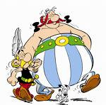
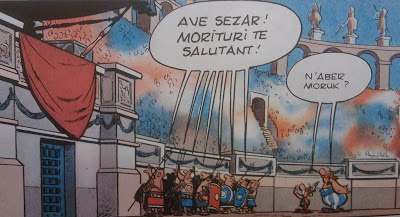
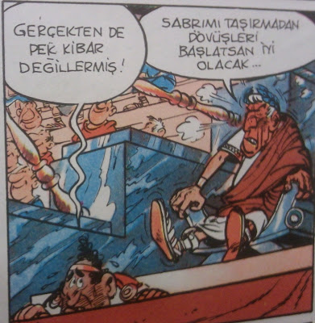

# Hafta 40

Anonim

Habur'dan giris yapan PKK ekibi icin yapilan gosteriler uygunsuz oldu

Neresi uygunsuz?

Eger DTP / Ocalan ile donus oncesi yapilmis anlasmalar varsa, ve bu
anlasmalar karsilamadaki gosteriler ile bozulduysa (ve sonuc olarak Ak
Parti beklemedigi bir sonuc ile karsilastiysa) bu surpriz Ak Parti
icin 'guven bozucu' olmus olabilir. 'O tepkiyi' bu baglamda
anlayabilirim.

Ama bundan ayri olarak, sadece olayi kendi basina tartarsak (bizim
perde arkasi anlasmalardan haberimiz yok), yapilan 'gosterilerde'
batici bir hal yoktur.

Adam yuzyillardir eziliyor. Oyleyse militani 'geri geldiginde' ister
oynar, ister kafasi uzerinde donup break dans yapmaya baslar, bunu
oturup seyredecegiz. Seyretmek ne kelime! BAYILA BAYILA
izleyecegiz. Ders cikartip ic gecirecegiz. Ic muhasebe yapacagiz. Iyi,
anlayisla karsilayacagiz.

Sunu da ekleyelim: Oyle silahli burokratlar, "bir kisim devlet memuru"
durduk yerde hic babalanmasin.

Siz "kaybetmis" bir ordusunuz. Kaybetmis bir ordu gibi kuyrugunuzu
bacaklariniz arasina kistirip, sesinizi alcaltacaksiniz Bunlar bir de
kuruluslarini Nizam-i Cedit'e falan bagliyorlar, bu son derece
ironiktir, cunku Nizam-i Cedit ilk savasinda Misir karsisinda
tepelenmis, bozguna ugramisti. Yani ilk savasini da son savasini da
kaybetmis bir ordusun demek ki. Kurtulus Savasini kazandik, ama orada
da orduya yardim eden "milisler" vardi.

Milisler.. hmm.. bu kavram bir yerden tanidik geliyor ama..

Durdugumuz yeri iyi bilelim.

---

Samuel Huntington

Bati medeniyetinin temeli Magna Carta'dir, Big Mac degil.

Ilginc

Sozun asli "Magna Mac" kelimesi iceriyor aslinda cunku magna latincede
"buyuk (big)" demek, o baglamda kelime oyunu, guzellemesi var, neyse
daha rahat anlasilmasi icin bazilari sozu bu sekilde degistirmekte.

Huntington gozlemi su acidan ilginctir - Avrupa icin one surdugumuz
kulturel fay hatti olan "Roma / Ortacag" teziyle uyumlu. 1215'te
ortaya cikan Magna Carta bilindigi gibi bireysel haklardan bahseden,
bazilarini korumaya calisan ve kralin yetkilerini sinirlama amacli
ortaya cikan en etkili ilk dokumandi, daha sonra ortaya cikacak diger
anayasal demokrasilere bir ilham kaynagi olmustur. Taraflara dikkat:
Yetkileri sinirlanan "tekil kral", bir otarsi, merkezi kuvvet,
karsisindakiler ise daginik bir yapida olan "baronlar". Yani Magna
Carta mutlakiyet ve cogulculuk arasinda bir kapismanin urunudur. Cikis
cagi da ilginctir: 1215: Ortacag!

Konunun yaptigi bazi cagrisimlar: Guya kralini yikmis olan Fransizlar
bir Cumhurbaskani sectiginde o Cumhurbaskani bir tur krala donusur,
kral gibi yetkileri vardir. Elysee Sarayina yerlesir. Ote yandan
Ingiltere'de gercekten kral / kralice olanlarin yetkileri semboliktir
ve bu kral / kraliceler insanlarina aslinda bir cogulculuk sembolu
olan sovalyelik payesini verirler!

---

Jose Manuel Barroso

Avrupa bir liberal demokrasidir.

Dogru

Hala bu terime direnen salaklara duyurulur.

---

Mumtaz'er "Happy Soldier, Forward the Turk" Turkone

[mealen] Osmanli zamaninda olsaydi Abdullah Ocalan pasa olurdu

Uydurma

Arastirmadan bir tarafinizdan cikardiginiz analizleri ortalikta
sallamayin... "Periyot dizisi" cekiyorsunuz. Bu sacmaliklar hep 80
model MGK sentezinin kalintilari iste, farkinda olmadan ona uygunsuz
insanlar bile balik gibi bu laflara atliyor.

Acin Mir Muhammed ornegine bir bakin [1], Abdullah Ocalan ornegine
paralellikler arz ediyor; bu kisi de kendi basina bolgede bir guc
kazandi, hep dis guclerle baglantisindan (o zaman Misir) korkuldu,
yenilgiye ugratildi. Sonra Istanbul'a "sultanin huzuruna" cagrildi
(Sultan Mahmut zamani), canim cicim laflar edildi, sonra eve donerken
gemide "kayboldu". Oteki taraftan cikmadi.

Yaaa.

Sen yuzyillarca bolge dinamiklerinin icine s.cmissin, bozukluga
ugratmissin, ondan sonra kalkip diyeceksin "eskiden olsaydi soyle
olurdu"; Olmazdi kardesim. Tras yapma. Internet cagindayiz, boyle gak
guk laflar aninda kontrol edilebiliyor. Kendinizi rezil etmeyin.

[1] A Modern History of the Kurds, David McDowall, sf. 41-46

---

Sevan "Dartanyan" Nisanyan

Ey Türk gençliği! Birinci vazifen, insan olmaktır.

İnsan olmanın yegâne temeli insana sevgidir. Hayatın boyunca,
insanlara güzelliği, aklı ve adaleti öğretmeyi görev
bileceksin. Bilgin varsa, bedel beklemeden paylaşacaksın. Buna imkân
ve şeraitin müsait değilse, yanındaki üç veya beş kişiye katıksız
sevgini vermeyi deneyeceksin; onların hayat yükünü bir nebze
hafifletmeye çaba göstereceksin. Bunu yaparken Türk mü, yoksa Hindu
mu, Yamyam mı diye sormayacaksın. Çünkü insan, galiplerin hasbelkader
çizdiği sınırlara sığmayacak kadar kıymetli bir hazinedir.

Dahili ve harici bedhahlarla etrafın çevrili olabilir. Sen şerri
bahane etmeyecek, hayırhahlığını ilelebet muhafaza ve müdafaa
edeceksin. Zira kötülük, esarettir. Manevi istiklalini ve manevi
hürriyetini ancak insan olmakla kazanabilirsin.

Düşman bütün tersanelerine girmişse, vazifeye atılmadan önce
düşüneceksin. Önce, düşman mı diye soracaksın. (Çünkü bugün düşman
olan yarın dost olabilir.) Sonra onu kendine düşman etmek için ne hata
yaptığını düşüneceksin. (Çünkü düşmanlık, herkes için ağır bir
yüktür.) Gönlünü kazanmayı deneyeceksin. Tersaneyi beraber işletmeyi
teklif edeceksin. (Öylesi her ikiniz için daha kazançlı olabilir.)
Sonuç alamasan, bir tersane uğruna düşman olmaya değer mi diye bir
kere daha kendine soracaksın. Bunları yapabilirsen, inan, dünyanın tüm
tersaneleri senin olur. Tüm ordular sana boyun eğer. Tüm kalelerini
terkedecek gücü ve güveni kendinde bulursun.

Memleketin dahilinde iktidara sahip olanlar sana “düşünmeyeceksin!”
diyebilirler. Kendi çorak ve bencil emellerine seni muhafız ve müdafi
yapmak isteyebilirler. Kuşaklardan beri süren iktidarlarını bir gün
daha korumak için senin damarlarındaki kanı talep
edebilirler. Memleketin bütün tepeleri kan ve intikam bayraklarıyla
donatılmış, bütün mektepleri zaptedilmiş, bütün mahkemeleri elde
edilmiş, bütün gazete köşeleri bilfiil müstevlilere terkedilmiş
olabilir. Millet, cehalet ve propaganda içinde serseme dönmüş
olabilir.

Ey insan evladı! İşte bu ahval ve şerait içinde dahi vazifen, insan
olduğunu unutmamaktır. Muhtaç olduğun kudret tanrı vergisi olan
vicdanında ve her gün çalışarak geliştireceğin aklında mevcuttur.

Guzel olmus

---

Aykiri

Ama 80 model MGK sentezi pek cok kisiyi bir sekilde "birlestirmiyor mu?"

Hayir

Sayi olarak bakilirsa "pek cok" kisiye "dokundugu" dogru, ama kimseyi
dogru durust birlestiremiyor, aslinda bu hem kasti hem de artik ise
yaramadigi ortada. Mesela sentez Aleviye "ama Turkuz" Kurt'e "ama
Sunniyiz" diyor, diyor da, o zaman karsina Alevi Kurt cikinca ne
yapacaksin? Syntax Error. Bu adama ne "Sunniyiz" diyebiliyorsun, ne
"Turkuz" diyebiliyorsun. Kurtlerin ucte biri Alevi olduguna gore
oldukca buyuk bir rakamdan bahsediyoruz! Bu kisiler tanim itibariyle
sentez disinda kaliyor. Ornekler cogaltilabilir.

Ayrica sentez, her topluluga "ikincil kimlikleri" uzerinden baglanmaya
ozen gosteriyor, bunu kasti olarak, onlari pasifize etmek icin
yapiyor. Kimisi icin muslumanlik kimligi Turk kimliginden onemli,
sentez onlarla daha az onem verdikleri Turk kimligi uzerinden baglanti
kuruyor, boylece bu kisilerin asal taleplerini gormezden
gelebiliyor. Kurt ile daha az onem verdigi muslumanlik kimligi
uzerinden temas ediyor, Kurt dili hakkindaki taleplerini gormezden
gelebiliyor. Kimse tam mutlu olmuyor, olamiyor, ve bu boyle olmasi
icin tasarlanmis.

Demek ki 80 model MGK sentezi ne yeterince kisiyi birlestirebiliyor,
ne de bunu dogru durust yapabiliyor. Madem ise yaramiyor sentez niye
hala ortada? Eh iste, bir deli bir kuyuya tas atmis, 40 tane akilli
adam tasi cikartmaya ugrasiyor, olan budur. Bazi insanlar her seyi
bilincsiz bir sekilde takip eder, bu kurgunun ne zaman, niye ortaya
ciktigini bile unutmustur, beyni yikanmistir, bunlari uyandirmak zor
olacak. Fakat baska caremiz de yok. Cunku sentez artik islemiyor.

---

Anonim

Ertugrul Bey cenazesindeki ilgi...

Yanlis

Cenazede ilgi falan yoktu; aksine ilgisizlik durumu vardi, hic
kalabalik degildi. Daha once belirttigimiz gibi "Osmanlicilik" 80
model MGK sentezi dolayisiyla pompalanan bir kurgudur. Insanlarin
saltanat ilgisinin arttigi falan yoktur.

Biraz daha detaydan bahsetmek gerekirse: 80 model MGK sentezi bir
Turk/Islam/Osmanlicilik/Baticilik sentezidir, ama kurgunun her ogesi
bir "farkliligi" "baska bir aynilik" ile kapatmak uzere
kurgulanmistir. Ogeler, ayrica, kasten sulandirilmistir.

Tum bu kurgunun merkezindeki elit, Aleviye "ama Turkuz" der, Sunniye
"ama Osmanliyiz" der, Kurt'e "ama Sunniyiz" der. Her grubun "degisik
bir aynilik" ile notralize edilmesi elzemdir. Bu arada Sunni, Alevi
ile, Kurt Turk ile notralize edilir. Bu sentez patlamistir.

Osmanlicilik ayrica genel baglamda ulkemizin kulturel fay hatti
"sarayli / koylu" isiginda yuzyillarca duzen tarafindan duzulmus
halkin torunlarini pasifize etmek icin de gereklidir. "Hepimiz
Osmanliyiz" diyerek elit bir "biz" duygusu pompalamaya calisir. Soyle
denilir: Dedelerinizi duzuldu, ama bekleyin, belki birgun "siz de"
duzersiniz.

Neyse ki son acilim baglaminda algiladigimiz hava bundan daha degisik
bir frekansta. Artik "farkliliklar zenginliktir" deniyor. Yani artik
bir "aynilik" aranmiyor. Zaten insan olmak, serbest piyasa
ekonomisinde isbirligi yapmak haricinde (dikkat, Fransiz
dayanismasindan farkli) baska bir "birlestiriciye" ihtiyac
yok. Isbolumu, anlasmak icin oldukca guclu bir motivasyon
faktorudur. Ayni topraktasin zaten, (cografya kaderdir -geography is
destiny-), ve ek olarak konjenktur birlesme konjenkturu, ayrilma
konjenkturu degil. Bunlar isiginda biz, basbakanin pek cok farkli
kulturden, "halktan" sanatciya vurgu yapmasini bu analiz baglaminda
okuyoruz. Amerika'da Duke Ellington zencidir, ne beyazlikla alakasi
vardir, ne Plymouth kayasina gemiyle gelmistir, ama "farkliligi" bir
zenginliktir. Devlet Duke Ellington'a "ama Ingiliz hanedancisiyiz"
dememektedir. Vatandassin demekte, ve serbest birakilan bu kisinin caz
muziginden faydalanmaktadir.

Gdisat eritme potasi, domates corbasi yonunde degildir. Gidisat bir
salata kasesidir.

[1] Kamu politikasi (public policy) saptarken kultur kodlari cikis
noktasi olamaz, cikis noktasi "hayatta kalmak (birinci seviye
-surungen- beyin) icin gereken akli (ucuncu seviye -analitik- beyin)
cozumler etrafinda donmelidir. Bundan sonra elde birkac alternatif var
ise, o zaman kultur kodlarina uyumluluk aranabilir, sonrasinda zaten
secilen politika "satilirken" kultur kodlari kullanilmalidir. Mesela
"aynilik aramadan farkli olanin kabulu", farkli sanatcilara yapilan
vurgu TR'nin kendine atadigi MISAFIRPERVERLIK kodu ile uyumludur (the
message is on code). Misafir, her kimse, kabul edilir, ayniligi olup
olmadigina bakilmaz.

---

Asterix külliyatı 50 yaşına basmış; kutlarız. Bu hikaye daha önce
bahsettiğimiz Roma / Ortaçağ kültürel fay hattı ile birebir
uyumlu. Asterix hikayesinde Roma tüm Fransa'yı ele geçirmiştir, "tek
bir köy hariç". O koyun büyücüsü ihtiyar bir iksir yaratır, böylece
köydekiler süper güçlere sahip olurlar, Roma'ya direnirler, vs.vs.Bu
altyapıdan pek çok hikaye çıkacaktır tabii ki, biz de zevkle bunları
okuduk. Bir hikayede Asterix ve (Türkçesi) Hopdediks'in Sezar'ın
önünde durup herkes Roma (Nazi) selamını çakarken "n'ber moruk!"
demeleri ilginç anlardan biriydi mesela. Kahramanlar Ave Ceasar (Heil
Hitler) dememişlerdi, "direnmişlerdi".Fakat, ne yazık ki tarihte böyle
bir köy olmadı, olamadı. Roma bugün Fransa denen yeri tamamen işgal
etti. O zaman Asterix hikayesi günümüz Fransızlarının bilinçaltını
dışa vurması açısından önemli bir veri noktası... Fransızlar tamamen
ele geçirildiler, ama "keşke ele geçirilmeseydik", "Romalılaşmasaydık"
hissiyatları Asterix üzerinden dışa vuruyor olmalı.Dipnot olarak
belirtmek gerekir: Fransızca dili aslında zamanında orada konuşlanmış
olan Roma askerlerinin konuştuğu "kaba Latincenin" bir türevidir, bir
tür sokak ağzıdır. "Romantik" bir dil deniyor (romantik içindeki Roma
vurgusunu dikkati çekerek devam ediyoruz) "hissiyatı kuvvetli bir dil"
bağlamında şunu söylemek gerekir, bizce bu dil son derece kaba, iğrenç
tınılara sahip; kusmakta olan bir insanın çıkardığı sesleri
çağrıştırıyor. Neyse.. zevkler ve renkler.Fransa'nın ana kültürel fay
hattı "seçkinlik / eşitlik (özgürlük)" izlerini acaba Asterix hikayesi
içinde bulabilir miyiz? Roma tarafından tamamen ele geçirilen bu ülke,
seçkinlik tarafını "Roma" ile eşleştirmiş, ve onun karşıtı olan
tarafını, "eşitliği / özgürlüğü" Avrupa'nın "Ortaçağ" noktası ile
birleşiyor olabilir mi? Olabilir. Düşünmeye değer.

---

New York Times yayincisi Arthur Sulzberger Jr mulakatindan

Endustri muthis bir gecis donemi yasiyor, fakat su anda yaptigimiz
isin temel ozu hala onemli. Kendimizi bastan yaratmaliyiz, ve tekrar
yaratacagimiz sey hala habercilik olacak. Insanlarin bilgi alis
yontemi degisiyor, fakat bilgi alma ihtiyaci hala mevcut.

[Gazetelerin durumunu tarif etmek için] aklıma gelen en iyi analoji
Titanık. Titantik'teki kritik hata neydi? Kötü inşa mı? Kaza geçirmesi
mi? Yeterince kurtarıcı bot olmaması mı? Buzdağlarıyla dolu bir deniz
bölgesinde hız rekoru kırmaya çalışan bir kaptan mı? [Kafasını hayır
anlamnda sallıyor] Aslında Titanık New York'a güvenli bir şekilde
gelseydi bile onun sonu gelmişti. 12 sene önce iki kardeş uçak
teknolojisini keşfetmişlerdi.

---

NewScientist makalesinden

Peri Masali 1: Domuz gribinin semptomlari normal grip gibi. Eger
atesiniz varsa, domuz gribi olmussunuz demektir.

Domuz gribine yakalananlarin neredeyse yarisinda hic ates gorulmuyor,
bazilari gastrointestinal problemler yasiyor, bazilari evet, standart
grip semptomlari yasiyor

Peri Masali 2: Bu basit bir grip. Olum oranlari normal gripten bile
daha dusuk

Domuz gribi cok yaslilardan ziyade genc insanlari olduruyor, ve kis
daha yeni basliyor olmasina ragmen, tum kis sirasinda olebileceginden
daha fazla genc insan domuz gribinden simdiden can verdi.

Peri Masali 3: Saglikliysaniz problem yok. Sadece hasta, zayif
insanlar oluyor

Simdiye kadar domuz gribinden olen cocuklarin hepsi son derece
saglikli cocuklardi, ve hastaliga yakalanan cogu yetiskin kurbanin da
daha onceden yasadigi bir problem yoktu.

Peri Masali 4: Eger "organik" yersen, vitamin alirsan, maske takarsan,
ellerini cok yikarsan ve bol bol sivi icersen, problem yasamazsin.

Asi olmak aileniz ve sizin icin edinebileceginiz en iyi korunma
yontemidir.

[..]

Peri Masali 6: Asi guvenli degil. Niye alcak dozlu bir gribi durdurmak
icin bu riski alalim?

Daha onceki salginlar sirasinda nufusun ucte biri ya da daha fazlasi
hastaligi kapti, ve gribin birini oldurmesi ya da Guillain-Barré
sendromuna kapilmasinin riski asidan olme riskinden cok daha fazla.

Peri Masali 7: Bu virus daha oldurucu hale gelmeyecek. Bir virus icin
bu daha iyi yayilma yontemi degil [cunku cok oldururse atlama sansi
azalir, evrimsel olarak demek istiyor]

Grip virusleri bazen daha oldurucu hale gelebilir. Kimse 2009 gribinin
nasil evrim gecirecegini bilmiyor ama bir yere gitmedigini kesin
biliyoruz.

Peri Masali 8: Bu grip bir kez yokolunca birkac onyil isi kurtardik
demektir

Ertesi gun bir baska hayvan gribi insanlara ziplayabilir, ve yeni bir
salgin baslatabilir, ve bu, 2009 salginindan bile daha kotu olabilir.

---

Kodlarda Degisim

Clotaire Rapaille sistemine gore 3 seviyeli beyine sahibiz ve bu
seviyelerin etkisi yukaridan asagi (en eskiden, en yeniye) dogru onem
kazaniyor. 1. seviye surungen beyin, 3. seviye analitik beyinden daha
etkili. Catisma oldugunda, onun dedigi oluyor.

Peki her seviyedeki algilama, program yapisi nasil degisiyor?

Degisim hizi, etkinin tam tersi; asagidan yukari dogru hizlaniyor. En
ustteki analitik beyin, en hizli degisebileni. Ihtiyaca gore, sartlara
gore aninda uyum gosterme kabiliyetine sahip. Ortadaki duygusal zeka,
yani kultur kodlari degismesi "mumkun olan", ama bu degisimi "cok
agir" yapabilen seviye. An alttaki surungen zihindeki yapilar ise, hic
degismiyor. Bu yapilar hayatta kalma, ureme ile alakali oldugu icin,
onlar cok buyuk bir evrimsel degisim (bilahere cevre sartlarindan
kaynaklanan durumlar) ya da genetik muhendislik haricinde
degismeyecekler.

Kultur kodlarinin degisimi onyillar, yuzyillar ile olculmekte.

Bazi kultur kodlarinin cikis noktasi da aslinda "hayatta kalma"
ihtiyaci; ise yaramis hayatta kalma stratejilerinin kultur olarak
kodlanmis olmasi. Fakat buyuk degisimler yasadigimiz bu cagda, kultur
kodlari ile "gerekli olanin" catismasi yasanabilir. Agir degisen
caglarda bu catisma hissedilmiyordu. Fakat hizli degisim gereken
cagimizda, bazi kultur kodlarinin buna dierenmesi
gozlenebilecektir. Cunku her kod "dogru" degildir, neyse o'dur,
oradadir, bunun bazi sonuclari vardir, bunun bilinmesi gerekir, ve
catisma alanlari iyi gozlenmelidir.

Ornek verelim; Ingilizlerin kendine atadigi kod KAST, profosyonellesen
bir isgucunde, toplum yapisinda "geri" ve "yanlis" bir kod
olacaktir. Bu kod eninde sonunda degisecektir. Amerika'nin ickiye
verdigi kod SILAH garip bir kod'dur. Sacmadir. Degisebilir. Fransizlar
zaten toptan ayvayi yemis, onlara deginmeye gerek yok. Degisecekler.

Turkiye'deki bilgiye atanmis kod RUTBE bazi acilardan iyidir (egitimi
kamcilamasi sayesinde) ama bazi acilardan sacmadir ('daha fazlasi'
birisini 'daha onemli' yapiyor goruntusu). Sevgiye atanmis kod ACI
acaiptir, degisebilir. Kendimize atadigimiz kod MISAFIRPERVERLIK
iyidir, herhalde kalmaya devam edecektir. Gibi.

---

Web dunyasindan bilinen crowdsourcing, yani bir 'isi kalabaliklara
ihale etme' kavrami [1] Amazon'un yeni servisi uzerinden bir
fiyatlama, paylasma, alma/satma mekanizmasina sahip oldu. Mekanik Turk
servisi bir 'dusunce hizmeti' almak isteyen alici ile o servisi vermek
isteyen saticiyi birlestiriyor. Dusunce hizmetleri neye benziyor?
Genellikle basit seyler; 30 tane resime bak ve her birinin daha
onceden belirlenmis kategorilere esle, mesela. 'Ilginc bir yemek
tarifi bul' gibi istekler de oluyor. Sistemin isminden hareketle her
hizmeti veren 'emekciye' turk deniyor, hizmet icin odenen bedel
oldukca cuzi. Yani iyi para kazanmak isteyen turk, pek cok bu
sekildeki hizmeti bir gun icinde vermek zorunda, ki bu o kadar zor
degil, cunku gorevler dedigimiz gibi agir degil. Bu isin etrafinda bir
kultur olusmaya baslamis, teknikler hakkinda konusanlarin bu kelimeyi
kullanisi insani guldurebiliyor bazen, TurKit diye bir yazilim araci,
Turkopticon diye bir notlandirma sistemi varmis..

Mekanik Turk isminin secilmesi tarihteki "Turk" adinda bir otonom,
mekanik satranc aletine gidiyor; Bu alet 'guya' mekanik olarak satranc
oynuyordu, ama aslinda icinde canli bir insan vardi, ve bu satranc
aleti Napolyon, Benjamin Franklin gibi unlu kisileri satrancta
yenmisti. Isin foyasi sonra ortaya cikartildi.

Bu servis sosyal bilimlerde, reklamcilikta deneyler yapmak isteyenler
icin iyi bir firsat olmali, deney yapmak istediginiz isi Amazon
uzerinden ilan edip aninda gerektigi kadar turk'u isin uzerinde
calistirmaniz mumkun.

[1] Kalabaliklara ihale etme kavraminin ornegi YouTube'un herkesin
video asmasina izin vermesidir, boylece 'kalabalik' ilginc video'lar
asma isini, ihalesini gerceklestirmis olur.

---

Richard Wiseman: "On yıl önce "şans" fenomenini incelemek için ise
koyuldum. [..] Şans olarak ortaya çıkan fırsatları ele alalım mesela;
Şanslı diye bilinen insanlar tutarlı / sürekli şekilde bu tür
fırsatlara rastlayıveriyorlar, diğerleri ise hiç rastlamıyorlar. Bu
şans farkının, acaba o şansın "farkedilmesinden mi" ileri gelip
gelmediğini anlayabilmek için bir deney yapmaya karar verdim.

Şanslı ve şansız insan gruplarının ikisine de bir gazete verdim ve
gazetenin tamaminde kaç tane fotoğraf olduğunu söylemelerini
istedim. Şansız insanlar cevabı vermek için ortalama olarak 2 dakika
harcadılar, şanslı insanlar ise saniyeler içinde cevabı
buldular. Niye? Çünkü gazetenin ikinci sayfasında koca harflerle
"saymayı bırak, bu gazetede 43 tane fotoğraf var" diye bir ibare
vardı. Ama şansız insanlar bunu kaçırıyor, şanslı insanlar ise
çoğunlukla bunu yakalıyorlardı. Eğlence olsun diye gazetenin ortasına
doğru şöyle başka bir mesaj yerleştirdim "saymayı bırak, sadece
deneyciye bu mesajı gördüğünü şöyle ve 250 papel kazan". Yine
şansızlar bu mesajı çoğunlukla kaçırdı, şanslılar ise yakaladı.

Daha sonra yaptığımız kişilik testleri, şansız insanların daha gergin
insanlar olduğunu ortaya çıkardı, ve araştırmalara göre, endişe
(anxiety) insanların beklenmeyen şeyleri farketmesini engelliyor. Bunu
inceleyen bir diğer deneyde deneklerin bilgisayar ekrandaki bir
noktayı takip etmeleri istenmişti. O sırada, hiç uyarı olmadan,
ekranın köşelerinde birdenbire bir büyük noktalar
gösteriliyordu. Deneklerin neredeyse tamamı bu büyük noktaları
farkediyordu.

Sonra aynı deney, ikinci bir grupla tekrar yapıldı, ama bu sefer
deneklere ortadaki noktayı takip etmeleri için bir parasal ödül teklif
edildi, bu daha çok gerginlik yarattı. Bu grup daha fazla ortadaki
noktaya odaklandı ve köşelerdeki büyük noktalar denek grubunun üçte
biri tarafından kaçırıldı. Görmek için ne kadar yoğunlaşsalar, o
ölçüde daha az görüyorlardı.

Şans fenomeni de aynen böyle işte: şansız insanlar fırsatları
kaçırıyorlar çünkü gayet ağır / ciddi bir şekilde başka bir şeye
odaklanmakla meşguller. Eğlence partilerine "mükemmel eşi" bulmaya
odaklı bir şekilde gidiyorlar, ve arkadaşlık kurmak için fırsatları
kaçırıyorlar. Gazetelerde belli / net iş fırsatları bulmak için
bakıyorlar, ve diğer uygun olabilecek diğer iş çeşitlerini
kaçırıyorlar. Şanslı insanlar daha rahat, daha açık, böylece "sadece
aradıkları şey" yerine "gerçekten ne olduğunu" daha rahat görüyorlar"

---

Guzel Gelismeler

Dis politikada olumlu gelismeler oluyor; Turkiye / Suriye vize
kaldirimi bir fiili birlesmeden baska bir sey degil, etki alanimiz
genisliyor, kalici barisin gelmesi daha mumkun hale geliyor. Turkiye
tutarli dis politikasinin meyvelerini toplamaya basladi, Ermenistan
acilimi, Iran anlasmalari, hepsi cok olumlu. Emegi gecen herkesi
kutlariz.

---
