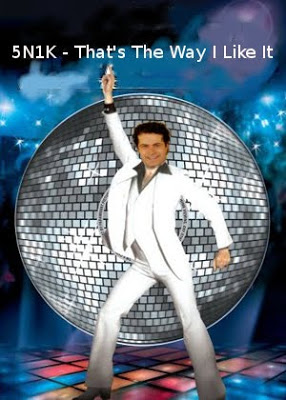
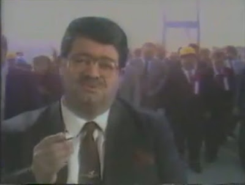
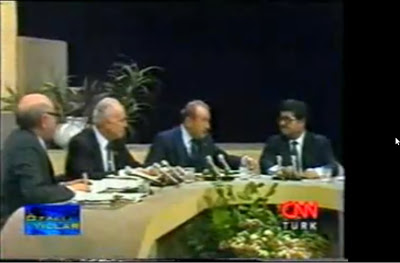

# Hafta 48

Abdullah Ocalan

Resadiye'yi anlayamadim

Vay cakal

Once cingari cikartti, sonra anlamadim diyor. Gucunu vurgulamak icin
bir hamle yapti, kismen basarili da oldu, fakat sivil siyasetin devami
icin ezici bir sinyal gelince BDP'ye destek olmaya mecbur kaldi. Apo /
PKK, hamlesi baglaminda KCK'yi yeni adres olarak gosteriyordu, sivil
siyaset agir basinca o tarafa yonelme durumu cikti, uvey cocuk haline
gelen KCK'nin simdi tepesine biniliyor. Dogru, yanlis yorum
yapmiyoruz, olani anlatiyoruz. Kandil'in yayin ajansi Firat
Haberler'den KCK hakkinda cit cikmiyor. Buradan PKK duruma mutabik
gozlemini yapiyoruz.

---

Anonim

Turban bir simge

Dogru... ama kim icin?

1) Daha once Turkiye'de Kemalistler ve Alemci Istanbul grubu arasinda
bir ittifak oldugundan bahsetmistik (ki son gelismelere bakilirsa
bunlarin ayak takiminin Izmir gibi yerlerde de bulunabildigini
goruyoruz) ve 2) Kemalizm modern (ve geri) olmasi sebebiyle Turkiye'ye
akli olarak sunacagi bir sey kalmadi. Peki o zaman ustte bahsedilen
ittifak nasil yasatilacak? Bildiniz: simgeler uzerinden. Dikkat edin,
adam "turban bir simge mi?" diye sorgularken aslinda kendini, ruhunun
derinliklerini afise etmis oluyor. O simge onun varligi icin gerekli.

Bu grup, ayrica, her kanserli hucre gibi genislemek arzusunda, iste
basbakana "restorandaki musterilere raki kadehi kaldirmasi" isteginin
arkasinda yatan motivasyon da bu. Cunku bu tur simgeler olmadan,
gruplar birlestirilemez. Kalca g.t koalisyonu buyuyemez.

---

Gulay Gokturk

Bir ülkenin kaderini belirleyen, geleceğini şekillendiren kimi önemli
kararlarda temsili demokrasinin kurumlarıyla yetinilmemesi ve doğrudan
demokrasinin işletilmesi gereği ortaya çıkabilir. Mesela Türkiye
halkının çoğunluğu AB üyeliğine "Hayır" derse, ülkemizi dünyanın
3. liginde oynamaya mahkûm eder, yoksul ve tecrit edilmiş bir
Türkiye'den yana oy kullanırsa, bağrımıza taş basar razı
oluruz. Milletin hakimiyeti karşısında boynumuz kıldan ince der, susar
otururuz.

Demokrasinin özü genel oydur. Genel oy benim nasıl yönetileceğimi
belirleyebilir. Ama nasıl yaşayacağımı dikte etmek, neyi düşünüp neyi
düşünmeyeceğime karar vermek genel oyun haddi değildir.

İktidarlar Türkiye'nin AB'ye girip girmemesini, NATO'da kalıp
kalmamasını, nükleer santral yapılıp yapılmamasını halka
sorabilir. Ama benim özgürlüklerimi oyların yüzde 99'una dayansa da
kısıtlayamaz.

Çünkü özgürlük, demokrasinin eleğinden geçirilemeyecek kadar üst bir
kategoridir. Demokrasi, insanlığın şimdilik bulduğu en iyi yönetim
biçimidir. Ama geçicidir. Oysa özgürlük evrenseldir, tabiidir ve
ebedidir. Bir insanın yaşama özgürlüğünü, yeme-içme, sevme-sevilme,
hayatını sürdürme özgürlüğünü referanduma sunamazsınız.

Dogru

---

Gulay Gokturk

İsviçre'deki minare referandumunun temel insan haklarının, inanç ve
ibadet özgürlüğünün açık ihlali anlamı taşıdığı noktasında söylenecek
fazla bir şey yok.

Dogru

---

Ozdemir Ince

Harf Devrimi'nin 80. yildonumu kutlu olsun.

Tükel üzgü bir kıvanç duydum

Avrupa'nin bu bitim ucunda yerimizi berkittik, ve ataç özlüklerimizin
tüm ıssılarına sahibiz. Baysak, önürme, uygunluk kıldacılarımız
bulunuyor, gonencimiz artiyor. Ben de kutlu olsun diyorum.

---

Ihsan Dagi

Ancak her durumda DTP'nin kapatılma kararı savunulamaz. Anayasa ve
yasalar ortadayken AYM'nin kapatmaktan başka çaresi yoktu tezi için
hiç kullanmadığım bir sözü kullanacağım: çifte standart. AYM'nin RP ve
FP'yi kapatması, cumhurbaşkanlığı seçimleri için icat ettiği 367
şartı, 'laiklik karşıtı eylemlerin odağı olduğu' yaftası, Anayasa'nın
10. ve 42. maddelerinin değiştirilmesini yetkisini aşarak iptali ne
kadar Anayasa'ya ve yasalara uygunsa DTP'nin kapatılması da ancak o
kadar yasal ve hukukîdir. AYM mevcut yapısı ile sonuna kadar 'siyasî'
ve meşruiyeti tartışmalı bir kurumdur.

Dogru

---

Samil Tayyar

Birden fazla istihbarat örgütü ve güç odaklarının etki alanındaki Öcalan [..]

Yanlis

Ocalan'in rolunu (en azindan / ozellikle yakalanana kadar olan
zamanda) ic / dis "orgut kontrolunde" diyerek azimsamak yanlis
olur. Apo, PKK'yi kurmus, ve Turkiye silahli kuvvetleri acisindan
istenmeyen sonuclara yol acsa da, etkili bir hale
getirmistir. Istihbarat acisindan ise.. eh peki, mesela zamaninda Iran
ile baglantilar "kurdugu" dogrudur. Fakat bunlari kendi insiyatifi ve
stratejik secimi acisindan yapti. Birileri uzaktan gelip firildak
cevirir gibi buradaki aktorleri cevirmedi.

Not: Bu arada Sn. Tayyar hakkindaki mahkeme kararina karsi oldugumuzu
belirtelim. Karar acikca ifade ozgurlugu ihlalidir. Boyle
saklabanliklar yeni ekonominin gerektirdigi yapiya aykiridir (evrensel
sacmaliklara, vicdan karin agrilarina girmeye gerek yok). Mevcut guc
yapilanmalari, cikar gruplari (vested interests) bu esas gucu
gormezden gelirlerse, halimiz felaket olur.

---

Jorge Luis Borges (Paul Coelho aktariyor)

Aslinda tum dunyada anlatilan topu topu 4 tane hikaye vardir. Bunlar:
iki kisi arasindaki ask hikayesi, uc kisi arasindaki ask hikayesi, guc
elde etme yolunda cabalamak (struggle for power) ve sehayat.

Ilginc

Coelho bu prensipleri iyi anlamis herhalde, yazarliktan mali
goturdu. Helal olsun tabii bir sey demiyoruz.

---

Haber

'Anaposta Projesi' kapsamında, her çocuğun doğar doğmaz nüfus
cüzdanında yazılı olan bir posta adresine sahip olacağını
bildirildi...Bilgi Teknolojileri ve İletişim Kurumu (BTK) Başkanı
Tayfun Acarer, ''yerli arama motoru'' kurulmasına yönelik çalışmaları
2010 yılında tamamlamayı hedeflediklerini [..] bildirdi. [..] Acarer,
''Youtube'' ve ''Google'' başta olmak üzere mevcut tüm arama
motorlarının yabancı kaynaklı olduğunu hatırlatarak, ''Bu nedenle, şu
andaki internet yoluyla yapılan her türlü haberleşme yabancı ülkelere
gidiyor.

Vatandas sana niye guvensin

Nufuz cuzdanina yazin, yazmayin, halkin cogunlugu devletin verdigi
adresi kullanmaz, bizce. "Vatandas anapostaya postayi koyar". Guvenlik
argumani bos; Yahoo guvenilir degilse, devlete guvenilir mi? Bugun
oyle oldugunu farzedelim, yarin olacaginin garantisi nedir? Ustelik,
vatandasin istegi "slm nbr olm" mesajlarinin ultra guvenli olmasi
midir, yoksa kesintisiz isleyen bir servisin mevcudiyeti midir? Sittin
tane devlet kurulusunu ozellestirirken burada servise baslamanin alemi
nedir?

---

Haber

Fener Rum Patriği Bartholomeos [..] "kendimi çarmıha gerilmiş gibi
hissediyorum" [dedi].

Firsati kacirmamis

Kultur kodlarina satis yapmis.. Basarili bir soylem, zamanlama
(kendisi icin) mukemmel. Ikircikli bir havada tak diye gundeme girerek
mesajini verdi. Ayrica herkese bir acilim oluyor, bizi unutmayin diye
telaslaniyor olmali.

Satis yapilan kod Avrupa'yi tanimlayan "Roma / Isa / Ortacag"
hattidir. B. carmiha gerildigini soyleyerek son derece guclu bir koda
hitap etmistir. "Karsimdaki Roma" diyerek Bati'daki kadim hissiyatlari
depresirmeye ugrasmistir. Hakli midir? Karsisindaki Roma olmasa da,
3. Roma (Osmanli) tortularini tasiyan bir ulke oldugumuz dogru. Laik
degiliz. Ve bu ulkede, aynen Osmanli'da olmadigi gibi dini esitlik
namevcuttur [1]. Daha once deginmistik.

Ozetle, Bartholomeos icin basarili bir hareket, hukumet icin uygunsuz
bir zamanda ortaya cikan bir soylem.

Tabii sunu da ekleyelim: Osmanli'nin Avrupa karsisinda yasadigi
hezimet (endustriyel kuvvet, koylu kuvveti darmadagin etti, yeni dalga
her zaman kazanir) ile eszamanli olarak Osmanli'ya dogru misyoner
eylemlerin oldugu dogrudur. Bunun ulke icindeki Hristiyanlara yonelik,
ve onlarin statusunu yukseltme ihtimali / sonucu getirdigi ve bunun
musluman kesim uzerinde bazi refleksler yarattigi da dogrudur. Hatta
David McDowall'a gore aci Ermeni kayiplarinin bas sebebi budur!

Tum bu verilerle, ve Milli Gorus gecmisli bir partinin iktidarinda,
bahsedilen konuda kolay adim atmasi beklenmemeli. Dogru olan muhakkak
tam ozgurluk.

[1] 80 model MGK sentezinin Osmanli'daki dini esitsizligi takip ediyor
ve sentezin bizzat Osmanlicilik iceriyor olmasi da bir raslanti
olmamali.

---

Mustafa Karaalioglu

Anayasa Mahkemesi, daha önceki parti kapatma davalarında (Refah
Partisi, Fazilet Partisi ve AK Parti gibi...) Avrupa’dan örnek
bulamamış ve herhangi bir davayı refarans gösterememiştir. Bu kez, DTP
için İspanya’daki ayrılıkçı Batasuna partisinin kapatılmasını örnek
vererek ilk kez Avrupa hukukuyla güçlü bir refarans ilişkisi
kurmuştur. Temel problem mahkeme, yıllar sonra Avrupa’ya açılmışken
Batasuna’yı örnek almak yerine bu konuda evrensel hukuk standardını
temsil eden Venedik Kriterleri’ni görmezden gelmiş olmasıdır.

Oysa, Türkiye’nin de aralarında bulunduğu 51 ülkenin temsilciciyle
oluşan ve Avrupa Konseyi’nin anayasa hukuku konularında danışma organı
olan Venedik Komisyonu parti kapatmalara açık bir standart
getirmektedir. [..] komisyon kararlarında [..] “Siyasal parti
yasaklama veya kapatma biçimindeki yaptırım, EN SON ÇARE OLARAK,
İSTİSNAİ BİR TEDBİR biçiminde kullanılmalıdır [ibaresi vardir].

Ilginc

---

Mumtaz'er Turkone

Şimdi ne olacak? Hiçbir şey olmayacak. [..] Ahmet Türk, Kürt
siyasetinin en itibarlı ismiydi. PKK'lı veya DTP'li olsun olmasın
Kürtlerin, hatta Kürt olmayanların bile saygısını kazanmış sahici bir
politikacı. PKK, otoritesine rakip gördüğü Türk'ü tasfiye etmeyi
denemiş, sonra yerine koyacak adam bulamadığı için tekrar DTP'yi ona
teslim etmişti. Anayasa Mahkemesi, PKK'nın beceremediği bu tasfiye
işini tek hamlede bitirdi. Bu işte bir gariplik yok mu?  DTP'nin
kapatılmasının en çok PKK'yı memnun ettiğini gözden kaçırmamamız
lâzım. PKK, DTP'nin kapatılmasını demokratik siyasetin itibar
kaybetmesi, kendisinin varlığının Kürtler nezdinde meşruiyeti
artırması olarak görüyor. Başından itibaren DTP'nin kapatılmasını
savunanların nerede, kimlerle hangi çizgide buluştuklarını görmeleri
gerekir.

Katiliyorum

---

Ali Bulac

Liberal kapitalizmin kalbinde baş gösteren ekonomik kriz, başlamış
bulunan küreselleşme sürecini tersine çevirmeyecek; böyle bir beklenti
içinde olmamak lazım. [..] Sorunun ekonomik yanını göz ardı etmeden şu
söylenebilir ki, bundan sonraki beşeri toplumsal hiyerarşik sıralamada
ilk halkada, kendi özü ve şahsiyeti üzerine daha çok yoğunlaşan insan,
ikinci halkada "cemaatler/sivil toplum kuruluşları", üçüncü halkada
"şehirler", dördüncü halkada "bölgesel entegrasyonlar" yer
alacaktır. Bu sıralamada ulus devletler yer almaya devam
edeceklerdir. Küreselleşme ile ulus devlet formu arasında çapraz bir
ilişki olsa da, ulus devletler bugüne kadar sahip oldukları birçok
iddia ve formlarından vazgeçmeyi kabul ederek varlıklarını
sürdüreceklerdir.

Yerküresini içine alan bu değişime yol açan temel faktörler arasında,
Batılı felsefi perspektifin (modernite) aşınma payının artması [..]
dünya ölçeğinde baş gösteren demografik hareketliliğin daha çok kent
nüfusuna yol açıp bu nüfusun kentlerin merkezine doğru yönelmeye
başlamasıdır.

Dogru

Modernite iflas etmistir.

---

AB

Pozitivizmin çökmesiyle sekülarizasyon nihilizme dönüştü;
postmodernizmle toplum çözüldü, bu iki temel gelişmenin sonucunda
birey projesi sona erdi.

Yanlis

---

AB

Söz konusu değişimi hangi aktörlerin yaptığı konusu, ortaya çıkan
belirsizlikle atbaşı gitmektedir. Kimine göre, adına "küreselleşme"
denen belirsiz bir gelişme dinamiği var, ne olduğu bir türlü
kestirilemeyen bu dinamik açık seçik olmadığı için bir heyula gibi
belli güç ve çıkar merkezleri tarafından araçsallaştırılmakta,

Dogru

Kuresellesme nitelemesi pek cok kisi tarafindan, olur olmaz yerlerde
aciklama olarak kullaniliyor. Fakat aslinda, bu kelimenin farkli
kesimler tarafindan farkli "cikarsal" anlamlari var.

Muhafazakar cevre icin kuresellesme, "icerideki" Kemalist yapinin
"disina" cikarak, kayirmayan, ayirmayan bir "aliciya" direk satmasi
anlamina geliyor. Bir tur "esitsizligi" kirarak, disari cikmasini
sagliyor.

Fakat bu durum, kuresellesme kelimesini "her seyi" ve "her kesimi"
aciklayan bir kelime haline getirmiyor. O zaman bu kavramin genel,
kapsayici (blanket) bir kavram olarak kullanilmasi yanlistir, cunku
herkesi esit / ayni (uniform) sekilde etkilemiyor, ve ilerisi
acisindan, arttigi gibi, oldugu gibi, statik kalmasi da mumkun bir
olustan bahsediyoruz. Petrolun varili 200 dolar oldugu bir ortamda
Brezilya'ya "ihracat" yapmanin zorlugu ortada.

Hayir. Herkesi esit etkileyen tek kavram, beyaz yakalilasan toplum, ve
degisen uretim seklidir. Cin'den, Japonya'ya, oradan Amerika'ya tum
siyasi, toplumsal dinamikleri etkileyen, degistiren temel piston,
enerjidir.

[Bir onceki yazidan hareketle] Tower Records'un iflas etmesi,
kuresellesme ile hicbir alakasi olmayan bir kavramdir. Internet
cikmistir, bilgi iletimi rahatlamistir, sarkilar boylece paylasilmis
ve Tower Records cokmustur. Tamamen ic dinamiklerin, temel kuvvetlerin
etkisiyle olan bir durumdur.

---

Aykırı

Ama sol bir dengeleyici olarak lazim degil mi?

Sol degil sosyal inovasyon lazim

Muhammed Yunus'un mikrokredi atilimini ele alalim. Tamamen bireyin kar
/ zarar realizasyonu temel alinarak, verilen krediyi sorumlu bir
sekilde kullanip geri odemesi baglaminda gelisen bir sistemdir. Bu bir
sosyal inovasyondur. Sol ile alakasi var midir? Yoktur.

Sigorta sistemin ele alalim. Bir felaket oluyor, evin tarumar oluyor,
ve hop sigorta sirketi gelip zararini karsiliyor. Al sana
"dayanisma". Sosyal yardim! Fakat onceden sigorta bedelini odemissin,
ve istatistiki olarak evi tarumar olmayanlar daha fazla ki bu para
'yardimini' alabiliyorsun. Arkada bir kar realizasyonu var. Sol
nerede? Yok.

Bu da bir sosyal inovasyondur.

Iste bu tur inovasyonlar lazimdir. 'Ah vah, ben seni koruyacagim
kollayacagim' diyen hiyarlar lazim degildir. Bireyin degeri tamamen
guc dinamikleriyle aciklanabilir: eger yeni uretim sekliyle guclenen
bireyi ezersen, o da birgun senin kafani kirar. Demek ki ezmeyeceksin,
KENDINI KURTARMAK ICIN. Yine bencillik. Yine akil.

Iste bize bu bireyi, onun rasyonel kararlar aldigi bir sistemi baz
alan inovasyonlar gerekiyor.

Not: Bugun gecerli birseyler soyleyebilen her "sol" kisilik aslinda
liberal demokrat olmustur. Geriye sadece bunu kabul etmeleri
kalmistir. Edemeyenler gencliklerinde hakkinda heyecan hissettikleri
bir kelimeden vazgecmek istemedigi icin bunu yapiyor. Bu kelimeyi
adeta dua eder gibi tekrarlamalari, 'bir zamanlar' bir sey hakkinda
'hakli olduklarini' zannetmelerini sagliyor. Bunlari asmak lazim.

---

Cengiz Candar

Türkiye'de dramatik iç gelişmeleri “geniş fotoğraf” içinde görmek
isteğiyle, dış dünyadaki, uluslararası plândaki gelişmelerle
bağlantılı olarak değerlendirme eğilimi yaygındır. [..] Ne var ki, bu
yaklaşım, her vakit, çok da isabetli sonuçlar vermez.

Türkiye'de “darbe” dendiğinde, geçmiş deneyimden de yola çıkılarak,
“darbe”nin altından ya ABD çıkar; ya da arkasında ABD
bulunur. 1960'taki ilk askeri darbe olan 27 Mayıs'tan bu yana, her
darbe ile Amerika, belirli ölçülerde ilişkilendirilmiştir. [..] 27
Mayıs sabahına, bu ülke, darbecilerin sözcüsü Albay Alparslan
Türkeş'in “NATO ve CENTO'ya bağlıyız” sözcükleriyle uyanmıştır. Daha
sonraların 27 Mayıs için “dış bağlantı” arayanlar, dönemin başbakanı
ve 27 Mayıs darbesi sonucunda idam edilen ilk ve tek Türk başbakanı
olan Adnan Menderes'in Sovyetler Birliği'ne “ABD'nin çizdiği
sınırların ötesinde yakınlaşma çabası” gösterdiğini öne sürerek, 27
Mayıs'ın arkasındaki “Amerikan bağlantısı”nı rasyonalize etmeye
çalışmışlardır. 12 Mart'ı (1971) ise, Amerika'nın üzerinde çok önemle
durduğu “haşhaş yasağı”nı Süleyman Demirel'in başkanlığındaki Adalet
Partisi hükümetinin kaldırmamasıyla açıklama eğilimi de yaygındır. 12
Eylül darbecileri, iktidara el koymalarından çok kısa bir sonra,
Yunanistan'ın NATO'nun Güneydoğu kanadına dönmesini, “Rogers Plânı”
namıyla bilinen ve Türkiye açısından Ege'de büyük taviz sayılan bir
“uzlaşma” sonucunda kabul ettiler. Yani, 12 Eylül'ün arkasında [guya]
ABD'nin geniş çaplı “küresel” ve “bölgesel” çıkarlarının yattığı
kanıtlanmış oldu!

Ak Parti'nin kapatılma talebiyle Yargıtay Başsavcısı tarafından
Anayasa Mahkemesi'ne başvurulması, bir ilk. Neyin ilki? İktidardaki
partinin, bir “askeri darbe” gerçekleşmeden kapatılma tehdidiyle yüz
yüze kalması. Bu nedenle, 14 Mart (2008), gerek Türkiye'de gerekse AB
çevrelerinde bir “yargı darbesi” nitelemesiyle karşılaştı. [..]

AB, kestirmeden, böyle bir gelişmenin Türkiye'ye “AB kapılarını
kapatacağını” ilân etti. Amerikan Dışişleri ise, 27 Nisan (2007)
ertesindeki ayıplı haline tekrarlamadı ve “seçimle iş başına gelenin
seçimle gitmesi”nin gerekliliğini vurgulayan bir açıklamayı zaman
geçirmeden yaparak, tavrını “resmen” belli etti. Türkiye'de
“Amerika'sız darbe olamayacağı”na inanmışlar, bu son “darbe” ya da
belki daha doğru bir deyimle “darbe girişimi”nin ardındaki Amerika'yı
bulup, Türkiye'deki gelişmelerle bir “rasyonel” bağlantı kurmak
ihtiyacındalar.

Dogru

Turkiye'de tum darbeleri "dis faktor" olmadan aciklayabilirsiniz.

Tum kariyerini bu aciklama uzerine kurmus olanlar icin bu muhakkak
kotu bir haber. Fakat ic aktorlerin kendi cikarlari, mevcut uretim
yontemi (uzun zaman koyluluk) aktorleri, bu bir secenek oldugu
zamanlarda, "darbe" yonune dogru itebilir. Ve darbeyi yapar. Niye?
Yapabildigi icin!

Asiri "dis" vurgunun sebebi, ulkemizde dogru olanin kultur kodunun
DISARIDA NE VAR kelimesi olmasi. Darbe yapanlar bunun arkasina
sigindilar. Turkes'in beyani bir ornek.

Tarihi tekrar gozden gecirmek gerekiyor ve saglam verileri baz almak
gerekiyor. "Dis destegi" dogrulamak icin kendini dusunur zanneden sair
gazetecinin hapishanede iken "Ingilizce duymasi" zerre kadar onemli
degildir. Ayni sekilde disarisinin bir darbe sonrasi "bizim cocuklar"
demesi de yetmez. Boyle bir soylem, "kimin cocuklari bunlar" diye bir
sorunun etrafta gezindigi bir ortama isaret eder ve tersi yonden de
okunabilir.

Tekrarlayalim. Darbe tamamen ic faktorlere tabidir.

Hıyarlar yerli malıdır

---

Anonim

Obama icinde bulundugumuz ittifakin lideri

O ittifak tek degil

Merkez Turkiye'dir, ne baskasi, ne bir ittifak. Eger bu nuansi
anlamadiysaniz, Turkiye'nin yeni dis politikasindan hicbir sey
anlamamissiniz demektir. "Kurumsal" olarak NATO baglantimiz var, fakat
bu baglantiyi "tek" ve "korunmasi" "uzerine titrenmesi" gereken bir
sey gibi gormek yanlis olur. Turkiye istedigi cografyada istedigi
"ittifaki" on plana cikartabilir. Bu Kibris'ta Birlesmis Milletler,
Balkanlarda NATO, Kafkaslarda AB olabilir.

---

Ahmet Davutoglu

[Amerika Turkiye'den ne istiyor sorusuna karsilik] Bu soru tipik soguk
savas kafasidir. Soru, tek bir guc, ABD oldugunu varsayiyor, ve bu guc
hep birilerinden bir seyler 'istiyor'. Muttefik olmak paylasmak, dahil
edici olmak demektir.

Iste

---

Mehmet Altan

[Davutoglu'nu tarif ederken] “Türkiye” dışında etkin ve belirleyici
bir “küresel” güç tanımlaması ve kabulü konusunda da çok istekli
görünmüyor. Dünya üzerinden Türkiye’yi değil, Türkiye üzerinden
dünyayı tanımlamayı yeğliyor.

Dogru

Bu gorusu 'disaridan' ve 'degisik' olarak anlattiginiz gibi bir hava
aldim, fakat burada garip olan onun durusu degil, sizinki. Siz eski
Marksistler dunyaya hep deterministik bir "plan" acisindan bakmaya
egilimlisiniz. Efendim, "suradan suraya bir guc havzasi kurulacak" yok
"bilmemne pazarlari birlestirilecek" falan. Yok oyle bir sey. Yeni
uretim sekli eski guc yapilanmasini tarumar etti (bunu iyi kotu
anlamissiniz), ve artik her ikinci dunya ulkesi "nufuz piyasasinda"
pek cok aktorle "alisveris" yapabilmeye basladi. Oyle merkezi bir plan
falan kalmadi.

Tabii ki uretim seklinin durdurulamaz gucu bir seyleri
"sarsacak". Fakat bu dinamik bir olusum, tepede birilerinin kukla
oynattigi falan yok.

---

Aykırı

"Aci gercekcilik" demissiniz, yani hic bir sey degismesin, kotu,
islemez seyler dahil her seyi kabullenelim mi diyorsunuz?

Zen deyisi soyle gider

"Fikirler gizemi, ifadeler fikirleri, fonksiyon potansiyeli
engellememeli".

Potansiyeller, gercekciligin parcasidir. Bir odun, hem ateste
yakilabilir, hem birinin kafasina vurulabilir. Yani tek, bariz bir
fonksiyona takilip kalmamak gerekir.

Fikirler, gizemi yoketmemeli; bilimsel acidan hayat muthis bir
gizem. Mevcut anlatimla yetinmeyip, daha derine inmek, daha fazla
desmek gerekiyor.

Turkiye'de bazi kelimelerin kullanimi bozulmus durumda. Mesela "akilli
ol" sozu "haddini bil" anlamina dejenere olmus (bir sokak lumpeninin
bu sozu Orhan Pamuk'a yoneltmesiyle bunu bir daha hatirladik). Fakat
akil, gercek statik bir durus ile sinirli degildir. Potansiyelleri
unutmayalim.

---

Torkish medya

Trafik canavari can aldi [..vs..] bayram bilancosu [..]
olu. Batiyoruz! Oluyoruz!

Abartmayin

Ingiltere 2007 rakamlarina gore trafik kazalarinda 2,946 kisi can
vermis. Turkiye'de ayni rakam ayni sene icin 3,459. Nufusa gore
ayarlarsak (Ingiltere 52 milyon TR 71 milyon) o zaman Ingiltere kaybi
71/52*2946 = 4,022. Bu TR 3,459 sayisindan daha yukarida.

Tasitlari insanlar kullanmaya devam ettikce, kazalar
olacaktir. Bilmemkac tonluk saatte bilmemkac kilometre hizla giden bir
arac fiziksel olarak bir yoketme aracidir. Kinetik enerji 1/2
mV^2. Koydu mu ucarsin. Capisc? Care? Daha fazla tren ulasimi
belki. Ileride (cok) zaten bilgisayar kontrollu arabalar geliyor. ABD
askeriyesi bu arastirmalari ciddi finanse ediyor, gecende biri DARPA
yarisini kazandi, araba tamamen otomize bir noktadan bir noktaya
ulasti, sollama filan yapti [2], tabii o tasitlarin ekonomik olarak
her kesime inmesi (trickle down) ne kadar surer, Allah bilir.

Peki medya bu isleri niye abartiyor? Birkac sebepten: 1) TR'de 'sevgi'
kavraminin kultur kodu ACI. Millete sevgi hissetmek icin aci veren
olaylar [1] gormek isteginde olabilecektir 2) Surekli bir facia ortami
yaratilarak yonetimdeki hukumet (kim oldugu farketmez) guya
sikistirilmis oluyor. 3) Sarayli / koylu hatti: Su soyleniyor: "Saray
(guya hukumet) bak! Madur olan koyluleri gor, vah vah!". Gazetelerde
habire gorulen kameraya dogru elinde bir kagit parcasi tutan gariban
vatandas fotografi ayni hissiyata / amaca servis ediyor.

[1] Bu hissiyatin sapik bazi turevleri, bir gruba, halka sevgi
gosterisinde bulunmak icin onu ezmek. "Bak dovuyorum, cunku ilgi
gosteriyorum".

[2] Alman oto sirketleri bu arastirmadan iyi nemalandi bu arada,
yarisi kazanan prof Alman (Amerikan okulunda), kendi "koylusuyle"
calismak istemis, Alman sirketleri bazi know-how'i buradan kapti,
sonradan danisman olarak ta hocayi calistirmislardir.

---

The Economist

[Sarkozy hukumeti] en ust seviye 3 bakeloryanin birinin son senesinde
tarih dersini zorunlu olmaktan cikardi. Bac S denilen bilim ve
matematik odakli dereceyi takip eden ogrenciler icin tarih dersi
secmeli hale geldi. [..] Bu karara sadece ogretmenlerden degil,
filozoflar ve diger entellektuellerden itiraz sesleri yukseldi. [..]
Fakat bu cekismenin en ilginc tarafi Fransiz bilim adamlarinin artik
daha az tarih ogrenecek olmasi degil; Ilginc olan merkezi yonetimin
hala okullara, hangi konulara, dakikasina kadar ne kadar zaman
ayiracaklarini dikte ediyor olmasi. Bu, 1808 yilinda emperyal bir emir
ile mufredatin ne olacagini kodifiye etmis olan Napolyon'un arkada
biraktigi bir miras.

Öküz Fransızlar

Bizimkilerin takip ettigi ornek te bu iste. Muspet bilimciler icin
tarihin secmeli yapilmasindan bahsetmiyoruz tabii (o iyi olmus),
ceberrut merkezi devletin kontrolculugu problem.

---

Anonim

Kopenhag'daki kuresel isinma toplantisi bir basarisizlik oldu.

Bruce de Masquita tahmin etmisti

Ustad, Oyun Teorisi temelli matematiksel yontemi ile bu toplantinin basarisizlik olacagini tahmin etmisti.

---

93 ve öncesinde Abdullah Öcalan tarafından deklare edilen ve bir kez
uzatılan ateşkesin bitmesine sebep olan 33 askerin oldurulmesi olayı
hakkında pek çok spekülasyon var. Fakat, bu olayda 'derin' ve 'dış'
bağlantıları aramaya gerek yok; gözönünde olan herkesin bildiği
aktörlerin (yanlış) algısı, kaçınilmaz olarak herkesi tekrar savaşa
doğru itti. 1) TSK yanlış bir şekilde ateşkesi karşı tarafın zayıflığı
olarak algıladı ve 2) ateşkes sırasında bile saldırıya devam etti 3)
Özal'ın ölümü sonrası TSK saldırıların şiddetini azaltmak söyledursun,
arttırdı [1, 2].

Bundan sonra, ve barış yanlısı Özal da ortada olmayınca, Apo
komutanlarını dizginleyemedi, saldırılar karşısında asker kaybederken
prestij de kaybediyorlardı, ve sonunda Şemdi Sakık yönetimindeki
PKK'lılar görevde olmayan 33 askeri otobüslerini durdurup
oldurdüler. Ateşkes bu şekilde sona erdi.

[1] McDowall, D., The Modern History of the Kurds

[2] Marcus, A., Blood and belief: the PKK and the Kurdish fight for independence, sf. 214

---

Danseeet

---

DTP kapatildi, PKK amacina erismis gozukuyor. DTP'yi devreden
cikartarak asal aktor pozisyonlarini guclendirdiler. Ak Parti
demokratik acilim baglaminda bir politik parti olarak PKK'yi muhatap
almak istemiyor, Ozal daha yoz milliyetci bir ortamda, ayni kaygilari
tasiyordu (mesela Ocalan ile gorusmelerini Talabani idare ediyordu
[1]) su anda gelinen durum tercih edilen bir hal olmayacaktir . Tum
aktorlerin olayi "kimin yaptigi" hakkindaki yorumlari aslinda gercekte
olani degil, neyin onlar icin daha iyi oldugunu gozler onune
seriyor. Ahmet Turk "Ergenekon" dedi, cunku PKK saldirisi kapatma
davasi oncesi onun durumunu zora sokacakti. Basbakan ayni sekilde PKK
olasiligini azaltmaya ugrasan sozler soyluyor, biraz onceki muhataplik
problemi yuzunden. Gercekten olan nedir?

Kabak gibi ortada olandir. PKK bu isi yapmistir.

AYM acisindan ise, adam bakti, "bu PKK'yi durduramiyorsun sana ne
ihtiyacim var" dedi, ve cat diye kapatti. Hukuk filan kalmadigini
hepimiz biliyoruz (dogru durust bir anayasa yapilincaya kadar) tek
mevcut olan guc kapismasi.

[1] Ozal'in Ocalan'a "deli herif" lakabini taktigi biliniyor,
mesajlari ileten Talabani'ye "git su deli herife soyle, bastir, masaya
gelsin" gibi seyler soylermis. Tabii bu "delilik" son saldiriyi
aciklamak icin yeterli degil, koprunun altindan cok sular akti; herkes
sadece kendi cikarini kolladigi (kimse global bir optimal noktayi
sallamak zorunda degildir, politik kararlarda Masquita'nin belirttigi
faktorler on plandadir) al/ver surecinde kozlarini oynuyor.

---

Filme TRT'de rastgeldik... Orijinal ismi The Man From Earth ve bilim
kurgu filmi olarak listeleniyor. Fakat filmde hiç patlama, işin
kılıcı, uzay gemileri yok. Doğru dürüst evin dışına bile
çıkılmıyor. Film tek bir faraziye üzerine kurulu: eğer binlerce yıl
öncesindeki bir mağara adamı genetik bir şans sonucu hiç
yaşlanmasaydı, ne olurdu?  Sonuç üstteki şahsiyet. Bu kişi tarihin
canlı bir şahidi, ve film yapımcıları aslında bir yandan da insanlığın
tarih hakkında bildiklerini bu karakter üzerinden aktarıyor. Mağara
adamı üniversite hocası olmuş (o kadar çok vakti var ki, istediği
konuyu öğrenebilir), karedeki diğerleri hoca arkadaşları; böylece
hikayesini anlatırken, şüpheci, bilgili bir grup anlatımı sorgularken,
aynı anda o anlatımı zenginleştiriyor.  [Takip edecekler heyecan
kaçırtabilir -SPOILER ALERT-]. Ama işi daha ilginçleştiren mağara
adamının Buda ile tanışması ve ondan öğrendikleri ile İsa peygamber
haline gelmesidir... Roma'nın zulmüne karşı gelmeye karar verir, ve
çarmıha gerilir, ama kaçar (tekrar dirilmez), yaralarını iyileştirir
(Budist teknikler kullanarak) ve kayıplara karışır.  Hikaye sırasında
dini hissiyat sorgulanır; John (İsa) mealen 'ben bu peri masallarına
dayalı şeyi (bugünkü hristiyanlık) yaratmadım' der, 'benim dersim
tamamen gerçek hayata yönelikti'. Arkadaş doğrular: 'Budizm de ilk
çıktığında acı gerçekçilik (brütal realism) üzerine kurulu bir
öğretiydi' der, 'hayattan kaçmanın yolu değildi'. Filmin sonuna doğru
bütün arkadaşlar artık ikna olmuştur, teoloji öğreten hristiyan bayan
hoca dahil.  Filmin sinematografi acısından yaratmaya çalıştığı hava,
' kamp ateşi başında anlatılan hikayeler' havası. Hikaye konusu mağara
adamı olduğuna göre, seçim uygun denebilir.
 Film bir açıdan İslam'ın
Hristiyanlığa getirdiği eleştirileri de yansıtıyor. Filmde İslam yok,
film tamamen / sadece Batı kültürünün kendi kendini sorgulaması
çerçevesinde gelişiyor.
 Güzel bir film. Tavsiye ediyoruz.

---

Arthur Kroker, Tekrar Dogan Ideoloji yazisindan

Klasik emperyalizm sırasında güç, toprakları, insanları, hatta zamanın
kendisini ele geçirerek kazanılan bir şeydi. Network temelli güç ise
bunun tam tersidir. Böyle yapılarda güç sirkülasyondadır / hareket
olduğu yerde, zamandadır ve geniş bir yelpaze üzerinden ürünler,
fikirler, tasarımlar, imajlar, hizmetler olarak yansıtılır /
nakledilir. Bu nokta Thomas Friedman tarafından iyi anlaşılmıştır [..]
Friedman, son zamanlarda yaşadığımız dijital (içe dönük) patlamanın
çok aktörlü, çok taraflı bir rekabet dünyasını serbest bıraktığını
söylemektedir. Bu dünyada kazananlar ülkelerini teknolojiksel olarak o
mobil, o anıme, o kablosuz dilde yetkin hale getirmek suretiyle
dijital geleceğini mümkün kılanlar olacaktır.

---

Seth Godin'in blogundan

Bir geminin batıp batmadığını anlamak için farelerin ne yaptığına
bakmayın. Zengin yolcuların ne yaptığına bakın.

iTunes ve İnternet'ten dosya paylaşmak Tower Records'u
yoketti. Semptom: En iyi müşteriler gitti. Düşünülürse, tabii ki
gideceklerdi, yılda 200 albüm alan onlardı, ve bu değişimi yapmak için
daha baskın sebepleri / ihtiyaçları (incentive) vardı. Alternatifler
daha hızlı ve ucuzdu.

Amazon ve Kindle kitapçıları öldürdü. Niye? Çünkü senede 100 ila 300
kitap alan müşterileri kaybettiler. Tipik Amerikalı zevk için yılda
bir kitap alır. Bu tür müşterilerin kitapçılar için hiçbir anlamı
yoktur. Önemli olan daha sık, surekli alışveriş yapan müşterilerdir,
ve artık, 2009 itibariyle resmi olarak bu müşteriler kitapçıları
terketmiştir. Olay bitmiştir.

---

Su yazida belirtildigi uzere Google'in acik kaynakli cep telefonlari
icin yazdigi isletim sistemi Android, Cin'den, Japonya'ya, cep
telefonlarindan, arabalara, e-kitap okuyuculara kadar genis bir
yelpazede kendini gostermeye basladi. Bu sistemi kullanmak donanim
ureticilerinin cikarlarina uyuyor. Niye? Isletim sistemi acik kaynakli
oldugu icin 1) hicbir sirkete 'kitlenmemis' oluyorlar, eger kafalarina
eserse kodu alip kendi istedikleri farkli bir yone gidebilirler 2)
acik bir platform programcilar (biz) icin cazip oldugu icin (cunku
yazilan kod, beceri dagarcigi pek cok urun icin gecerli olur, boylece
ogrenim icin harcanan zamandan tasarruf edilir), bu piyasa icin
gelistirilen programlardan otomatik olarak faydalanabilecekler.

Acaba Turkiyeli sirketlerin bu alandaki firsatlardan haberi var mi?
Vestel, Android temelli bir cep telefonu ile piyasaya cikamaz mi? Oto
sirketleri gomulu sistemlerde bu sistemden faydalaniyor mu?

Ozellikle bahsediyorum, cunku bu sistem uzerinden "mevcut oyunculara
karsi" bu alana girmek isteyebilecek sirketler icin rekabetsel bir
avantaj var. Cinli ureticilerin sistemin uzerine atlamasi bir raslanti
degil. Yazilim sistemi, ve onun arkasindaki ekosistem hazir olunca, bu
bir is modelini hazir hale getiriyor, ve Cinli bir ureticinin Nokia
gibi bir devin oldugu Avrupa piyasasina girebilmesini sagliyor. Alici
hic taninmaz edilmez bir telefonu almaktan korkmuyor cunku nasil olsa
icinde Android olacagini biliyor. Boylece ayni yazilim piyasasindaki
urunlerden faydalanabiliyor. Surada o da anlatiliyor.

---

Bu kalemi var ya.. Satarım, satamazsın.. Eskilerden esintiler. Özal
iyi anlatırdı, bazen duygu sömürüsü de yapardı. Bir hikayeyi hiç
unutmam: IMF toplantısındaymış, 'bir yandan kalbimiz tekliyor, bir
yandan halkımız için para istemeye çalışıyoruz', lafları... Üstün
performans... Köprü sattırmam hikayesi başka alem zaten. Üstteki memur
tipli kazık herif nasıl kızmış dikkat. Masaya doğru hareketler
yapıyor. Kamalist enternasyonal.

---

Iran hakkinda de Mesquita'nin ongorusu nasil kullanilabilir? Oncelikle
ongoru neydi? Ne olursa olsun, Iran nukleer silah kalitesinde yakit
imal etmekle yetinip "ulusal onurunu" tatmin edecek, ama nukleer silah
imal etmeyecektir. Ustad'in projeksiyonuna gore bunun gidecegi iki
degisik yon var; Birincisinde dis gucler Iran'a baski yapiyor,
digerinde yapmiyor. Isin ilginci bu iki alternatif yonun ayni kapiya
ciktigi gibi, eger baski olursa Iran'in silahtan vazgecmesi(ni deklare
etmesi) daha fazla zaman aliyor!

Turkiye bu ongoruyu nasil kullanir? Iran hakkinda yapilacak traslara
dik durmasi kolaylasir (ki zaten duruyor), kaka senaryo olmayacagina
gore Iran hakkinda diplomatik yardimlar daha hizli gundeme
gelebilir.. Gibi.

---

Ahmet Davutoglu, Stratejik Derinlik, 2000, sf. 445

Turkiye'nin gerek Incirlik ussunun Irak'a karsi yogun sekilde
kullanilmasinin dogurdugu rahatsizlik, gerekse Kuzey Irak ile ilgili
girisimlerin sonuclari konusunda duydugu kaygilarla, hakli olarak Irak
politikasinda bir denge arayisina yonelmesi ve [zamanin Irak
basbakani] Tarik Aziz'i Ankara'da misafir etmesi Obdulah Ocalan'in
yakalanmasinda [1] etkili olmustur [..].

ABD bu yolla Turkiye'ye su mesaji vermistir; Ocalan'in yakalanmasi ile
artik Turkiye icindeki Kurt Meselesi kendi ic alanina ve Turkiye'nin
tam denetimine cekilmis bulunmaktadir; dolayisiyla da Irak'in
statusunun ve Kuzey Irak'taki gelismelerin Turkiye'yi tedirgin eden
yonleri asgariye inmistir. ABD, boylece Kuzey Irak'taki gelismelerin
kendi ic butunlugunun bir parcasi olarak goren Turkiye'nin
kaygilarinin bittigini dusunmekte; dolayisiyla da Turkiye'yi Irak ile
isbirligine sevketmesi muhtemel saiklarin etkisini kaybedecegini
ongormektedir [2].

[1] Yani ABD'nin Ocalan'i yakalattirmasinda

[2] Yani ABD (o zaman) Turkiye'nin Irak'tan 'uzak durmasi'
istegindeymis; Ocalan'in kucagimiza teslim ederek aradaki baglantiyi
aza indirgemeye ugrasmis.

---

Ahmet Davutoglu Turkiye'nin dis politikasina ornek vermek icin
birlesmeden onceki Bati Almanya'nin Ostpolitik doktrininden
bahsetmis. Biraz tarih: 1949-69 yillari arasinda Almanya Dogu Almanya
ile iliski, irtibattan kaciniyordu. Fakat 69 secimiyle basa gelen
Brandt hukumeti doguya yapilacak bir acilim baglaminda ticari,
kulturel irtibatin komunist rejimin cokmesini uzun vadede daha
kolaylastirabilecegini savundu. Brandt, ayrica Ostpolitik'in Bati
Avrupa ve NATO ile iliskilerini zedelemeyecegini savundu. Davutoglu da
TR acilimindan bahsederek asagi yukari ayni vurgulari
yapti. Komsularla iyi iliskiler, Bati ile iliskiler acisindan "ya o,
ya bu (mutually exclusive)" turunden bir iliski degildir.

Ilginctir; bugun Turkiye'nin acilimina karsi yapilan tingirtilar,
eskiden Ostpolitik icin, ayni aktorler tarafindan yine yapilmisti
(Davutoglu'nun bu ornegi secmis olmasi, bir yandan bir mesaj da
iceriyor). Hatta bu kisiler, 69 oncesi 20 yillik suren izolasyon
politikasinin fazla kati oldugunu soyleyen ayni kisilerdir! (Kissenger
bu listede) Korku, "eyvah bu sefer fazla mi guclu olacaklar" korkusu
tabii. Muhakkak Bati Almanya bu acilimi yaparken etki alanini
genisletmeyi de hedefliyordu, komunist rejimin cokmesi iyi bir 'yan
etki' olacakti. Bir 20 sene sonra o cokus te vuku buldu, o noktaya
gelinmesinde yardimci olan pek cok faktor arasinda Ostpolitik'in de
oldugu iddia edilebilir.

---

Adamımız Cenk Uygur, İnternet temelli televizyon programı The Young
Turks ile Fast Company dergisine konu oldu. TYT tam anlamıyla yeni
teknolojilerin, yeni ekonominin mümkün kıldığı bir oluşum. Program
sadece YouTube'da günde 450,000 izleyici çekiyor. Biz bu programa
nasıl rastgelmiştik? Google'daki arama seansları sırasında (bizim
nesil için düşünmek ile eşanlama gelmeye başladı), galiba jon türkler
ile alakalı bir şeyi ararken rasgele çıkmıştı... O günlerde OJ'in Las
Vegas'ta yakalanması olayı vardı, teyp kaydı çıkmıştı, Cenk OJ taklidi
yapıyordu: "Back against the wall m...f.cker. You stealin' my
shit?". Gülmekten yerlere yatmıştık. Eh politika da var, seyretmeye
başladık. Tüm fikirlere katılmasak ta, duruşları genel itibariyle
doğru.Karakterler ilginç; fotoğrafta görülen bayan Ermeni, diğeri
zenci, öteki ispanyol (hispanic). Salata kasesi.

---
