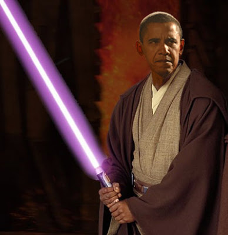

# Hafta 8

Suleyman Demirel

Uluslararası meselelerde birtakım faturalar çıkar. [..] Hadiselere
dünyanın nasıl baktığına da önem vermemiz lazım.

Senin vaktin gecmis artik

Ne dunyasi coban herif, senin derdin ABD neo-con grubu ve
Israil. Senin "dunyan" bunlardan ibaret...

Daha once belirttik, tekrar uzerinden gecelim. Yeni merkezsiz dunyada
herkes bir arayis icinde. Turkiye'nin cok yonlu politikasinda ABD
onemli bir parametre ama sadece bir parametre olmali. Israil bile
bunun farkinda kardesim! Can havliyle dis politikalarinda degisik
(okuyun: ABD harici) arayislar pesindeler. 90'li yillardan beri. Bu
zamanlarda baris acilimini niye Avrupa'da baslattilar zannediyorsunuz?
Niye ABD'nin hic hosuna gitmemesine ragmen, Cin'e silah satmaktalar?
Gerci Cin bu silahlari Iran'a satabiliyor, ve gunun sonunda Israil bir
gun kendi silahlari ile vurulabilir, ama yeni dunya boyle bir sey
iste.. Adam satiyor.

Acele bir Google arayisi, fi tarihinde Demirel'in danismanligini, Irak
savasinin sebebinin petrol oldugunu hala bilmeyen uber-keriz Cengiz
Candar oldugunu ortaya cikardi. Tencere yuvarlanmis kapagini bulmus
iste. Kadim ozdeyisi tekrarlayalim;

Kilavuzu karga olanin burnu b.ktan kurtulmaz.

---

Star

Devlet Planlama Teşkilatı'nın talebi ve sağladığı 35 milyon lira
kaynakla 2002'de başlatılan proje kapsamında İstanbul Teknik
Üniversitesi'nde (İTÜ) ilk yüzde 100 Türk helikopteri
tasarlandı. Helikopterin özgün tasarımının yapıldığı 'Havacılık
Araştırma Geliştirme ve Uygulama Projesi' kapsamında üretilmekte olan
prototip 2010'da tamamlanacak ve ilk deneme uçuşunu yapacak.

Bravo

Isleyen helikopteri gorunce daha da seviniriz. 150 muhendis.. 2010
sonrasi bu arkadaslardan bazilari acaba uzaya arac gonderme projesine
transfer edilebilir mi? (acilen insan kaynaklari mudahelesi yapiyorum
gordugunuz gibi.. yarin da spor yorumu yapacagim :)). Peki oteki
universitelerimiz ne alemde? DÜTTÜ diye bir okul vardi mesela, ne oldu
bu adamlara? Bogazici, IU, nal mi topluyorlar? Universiteler
goreve.. :) Gercek gorevlerine yani. Arastirma yapmaya.

---

Star

Denetim elemanlarının, Vergi Usul Kanunu'na göre vergi inceleme
yetkisine sahip olduğuna işaret edilen açıklamada, vergi
incelemesinden maksadın mükelleflerin ödemesi gereken vergilerin
doğruluğunu araştırmak, tespit etmek olduğu belirtildi. Bakanlığa
gelen bilgilerden hareketle, Doğan Holding AŞ nezdinde gelirler
kontrolörleri tarafından 2003-2006 yıllarıyla ilgili vergi incelemesi
yapıldığı belirtilerek, "İnceleme sonucunda düzenlenen raporlara
istinaden ilgili vergi dairesi, adı geçen mükellef kuruma vergi
kanunlarına göre cezalı vergi tarhiyatı yapmış ve tebliğ etmiştir."
denildi.

Olum ve vergiler..

Anglo Sakson dunyasinda bir laf vardir: "Olum ve vergiden kacis
yoktur". Eh, ne de olsa Chicago'lu unlu haydut Al Capone vergi sucu
sayesinde hapse gonderilebilmisti.. Aydin Dogan eli silahli bir haydut
degil fakat ulkeye son yillarda yasattiklari, bilgi kirliligi ve
psikolojik savas ortami bir silahli haydutun yaptiklarindan daha mi
masum ve toz pembeydi acaba? Ozgurlukleri ve demokrasiyi hic ayirim
yapmadan savunsalar, bundan herkes faydalanacak, fakat arkadaslarin
kafasi boyle calismiyor. Diger taraftan, insanin aklina gelen, bir
taraflari acikti ki onu kapatmak icin onceden (preemptive) kavgaya
giristikleri durumudur. Cunku uzun zamandir pireyi deve haline
getirmeleri ancak bu tur bir kumpas ile aciklanabilir. Acikca
soyluyorum; Turkiye'nin menfaati icin BU PISLIK BIR AN EVVEL
TEMIZLENMELIDIR. Baska caresi yok. Baska turlu ulkenin ic kuvvetleri
birlesip daha verimli vahalara akamayacak, gelisimimiz surekli
baltalanacak. Bu serefsizlerin gelisimi, ilerlemeyi temsil ettigi koca
bir yalandir. Asagilik gazetelerinden sadece sapkinlik ve ikinci
seviye bir elektronik oyuncak (gadget) tuketim kulturu akiyor. Ozgur
olmayan ortamda bilim yoksa, bu adamlarin dunyasinda bilim
olamaz. Bilahere, ilerleme olamaz. Aydin Dogan medyasi ulkemiz icin
acik ve mevcut bir tehlikedir.

---

Economist

Orta sinifla dalga gecmeyi herkes cok sever. Dar kafaliligi,
ilgisizligi/rahatligi, surunun pesine takilmasi / konformizmi komedi
dizisi ve roman yazarlari icin bitmez tukenmez bir kaynak
olusturmaktadir.

O "endustriyel" orta sinif

Eski cagda bahsedilen orta sinifin tarif edildigi gibi oldugu
dogrudur. Fakat, ABD'de eglence urunlerinin tuketimine bakarsaniz,
artik eskiden orta sinif denilen bu kesimin hizla cesitlenmeye
basladigi gorulmektedir. Bu endustriyel toplumdan servis/bilgi
toplumuna gecisin bir sonucudur. Referans edilen grafikte, muzik, film
gibi urunlerin istatistiki dagilimina bakilmis. En bastaki en buyuk
bolge "hit eserler". Herkesin bildigi, kismen dinledigi, seyrettigi
sanat eserleri. Fakat sag tarafa bakin, o azalarak (ama hicbir zaman
tamamen sifir olmarak giden) kisim ise "niche" urunlerin dagilimi. Bu
bolgeyi toplarsaniz hit bolgesinden daha fazla bir tuketici sayisina
erisiyorsunuz. Yani niche bolgesi artik hit bolgesinin asmis. Internet
dunyasinda blog'lar bu niche bolgesinin icinde oluyor. Basin acisindan
gittigimiz gelecek bloglar ve alternatif haber, yorum kaynaklarinin
merkez kaynaklari asacagi bir dunya olabilir.

Neyse; eski kavramlar, siyasi bolunmeler yeni dunyada gecerli
degildir. Sag, sol, orta, yukari, bilmemne sinif kavramlari niteligini
yitirmistir. Isci sinifi yokoldugu icin onlari temsilen bir sol
gereksizdir, herkes potansiyel bir girisimci oldugu icin sag
kelimesine de gerek yoktur, zaten herkes totaliter devlet
karsitidir. Bu dunyada siyasi duzen olarak liberal demokrasi en baz
seviyede bir gerekliliktir, fakat bunun etrafinda da bir bolunme,
ciddiye alinacak iki tarafin varligi imkansiz ve anlamsizdir. Liberal
demokrasinin destekcileri makuldur.. Karsitlari ise öküzdür.

Ileride katilimci demokrasi gibi ekler peydahlanabilir, paranin
yokolmasi ve yerine elektronik sistemlerle idare edilen degis/tokus
(bartering) sistemleri bir olasiliktir. Ileride ne olacagini
bilmiyoruz, sadece ne olmayacagindan eminiz. Ulus devlet gucu yerini
guc kusaklarina, tek kutup yerini N tane kutba birakacaktir. Bu arada
kuresel isinmadan ayvayi yememissek, bu yeni daha dinamik dunya
muhakkak daha eglenceli ve firsatlarla dolu olacak.

Temel teze donersek; dunyada 'orta' sinif degil, 'tek' sinif olacak.

---

Halil Inalcik

[Osmanli] sisteminde tum tarim arazileri devlete aittir. Bu topragi
isleyen koylunun statusu o toprak uzerinde bir kiraci seviyesindedir
ve koylu bu topraktaki emeginin karsiligi olarak kullanim hakkini elde
eder. Koylunun toprak uzerindeki hakki babadan ogula gecebiliyordu,
fakat koylunun o topragi satma, hediye olarak baskasina verme - yani
izinsiz baskasina transfer etme hakki yoktu. Diger yandan nufuz sahibi
insanlar surekli arazileri uzerinde mulkiyet hakkini elde etmeye
ugrasagelmislerdir. Aynen Bizans ve Abbasi halifeliginde oldugu gibi
Osmanlida da, devlet ve bireyler arasinda arazinin mulkiyetinin ele
gecirmek icin devamli suren mucadele sosyal tarihte en onemli problemi
teskil etmistir. Ne zaman devlet zayiflasa bireysel ve vakif
mulkiyetlerinde hizli artis meydana gelmis, ne zaman guclu merkezi bir
otorite ortaya ciksa, hemen bireysel mulkiyet haklari, vakiflar
ortadan kaldirilmis ve devlet mulkiyeti geri getirilmistir. I. Beyazit
ve Fatih Sultan Mehmet bu alandaki "reformlari" ile unludurler
[tirnaklar ve koyu harfler bana aittir].

Iste Osmanli

Ustte tarif edilenler, totaliter bir otarsinin tarifidir ve bu
kafadan, bu mentaliteden serbest ticarete dayali bir sistem cikmasi
mumkun degil ne yazik ki. Sistem eninde sonunda yikildiktan sonra ve
uzun zaman gecip bu mentalitenin kafalardan yavas yavas silinmesi
sayesinde, ilerleme mumkun olabilmistir. Osmanli muhakkak miras aldigi
kulturel, cografi, askeri bazi ogeleri harmanlayarak bir sure basarili
bir sistem olusturabilmistir, fakat kendinden sonraki uretim duzenine,
buyuk degisime adapte olamamistir. Yerine gecen (Cumhuriyet olmayan)
Cumhuriyet te bu kotu aliskanliklari surdurdugu surece geri kalmaya
devam etmistir - 1950 itibariyle ulkenin durumu ne yazik ki kronik bir
sefalettir.

Halk ozgurlugunu kisitlamis, onu savaslara surmus Osmanli'dan,
saraydan hazzetmez ve bugun de kendine onu hatirlatan her turlu parti,
zumre, grupa soguk bakacaktir. "Duzen" kelimesinin halk nedzindeki
argo karsiligi bir raslanti degildir. Duzen her zaman "duzulmek"
aksiyonunu beraberinde getirdigi icin, insanlar bu kelimeye dogru
anlamini vermislerdir.

Bizim gibi uzun eski bir tarihi olan Cinlilerin tarihleriyle olan
muhabbetleri belki burada aydinlatici olabilir; Cinlilerin hissiyati
"gelecek yeterince hizli gelmiyor" kelimeleriyle ifade edilmektedir,
insanlar geriye degil, ileriye bakmaktadir. Cunku ozellikle son 50
senenin gelisimi karsisinda gecmiste ozenilecek fazla bir sey
kalmamistir.

Halil Inalcik, The Ottoman Empire, The Classical Age 1300-1600, sf. 109

---

Standart makroekonomik olcutlere bakarak tarihciler ve ekonomistler
II. Dunya Savasi'nin harcama yaratip refah getirdigine inanirlar. Bu
inanisin temeli curuktur, cunku savas sirasinda ABD'nin komuta/kontrol
ekonomisi oldugunu gozardi eder. Bilahere 1942-46 arasi cogu
makroekonomik performans olcutleri istatistiki olarak yanlistir,
otekiler ise kavramsal olarak abuktur. Daha dogru olan soylem savas
sirasinda ekonominin bir kaynak olarak tuketildigidir; ve bu sirada
tuketicilerin hayat kalitesi dusmustur.

Ancak savastan sonra gercek refahin ortaya cikmasi mumkun
olabilmistir.

http://www.independent.org/newsroom/article.asp?id=138

---

Cin'in uzun vade stratejisi acik: Afganistan'da en fazla yatirim yapan
ulke su anda Cin; Iran ile devasa Aynak bakir madenlerini birlestirmek
icin uzun bir karayolu insa ettiriyorlar. Cinliler ayni zamanda
Pakistan'in Arap Denizinde, Gwadar'da bir derin deniz limanini finans
etmeye basladilar. Bu arada, uzun zamandir Wahabbi camilerine ve
Taliban'a miktari halen bilinmeyen seviyelerde para yardimi yapmis
Suudi Arabistan, Taliban ile Afganistan'daki Karzai rejimi arasinda
gorusmelerde arabuluculuk gorevini ustlenmis durumda. Iran,
Pakistan'daki elektrik acigini telafi etmek icin santrallar insa
ediyor. Daha da onemlisi, Iran eskiden gundemde olan
Iran-Pakistan-Hindistan dogal gaz hattinin insasini tekrar gundeme
getirip, insaya gecmek istiyor. Bu hat, hem Pakistan, hem Hindistan
tarafindan cok ihtiyac duyulan bir hat. Pakistan'da elektrik
kesintileri artisa gecti, ve artik eski tahmin edilir ritimlerinin de
disina cikti.

Suradaki yazidan tercume edilmistir. Holbroke'un bolgeye gorusmeci
olarak atanmasiyla ilgili yazilmis bir yazi... Eski yorumcular
bakiyorlar, zannediyorlar ki bolgeye "superstar" atanacak, o bolgeye
gidecek, herkes agzi acik bu durumu seyredecek, cicekler acacak,
inekler ucmaya baslayacak. Gercek durum ise soyle; Mesafelerin
kisalmasi ve merkezin parcalanmasi anlamindaki kuresellesme sonucu,
kimsenin "merkezdeki" adamin ne yaptigini ipledigi yok. Herkes kendi
ilgi, etki alanini yaratmak, genisletme cabalarini tam gaz
surduruyor. Eski "kible" ise yaramiyor, artik pek cok kibleler var,
hatta ulkeler kendileri nacizane kible olmak icin bolgelerinde at
kosturuyorlar. Ingiltere, BBC belgeselinde tum dunyayi icine alan bir
tarih mefrumu yaratirken, o belgeselde allanip pullanan ulkelerden
biri Cin ile finans krizinden kurtulmak icin anlasma yapiyor. Dunun
"bariyer ulkesi" Turkiye, korsanlara karsi Somaliye savas gemisi
gonderiyor. Iran uzaya uydu koyuyor.

---

William Easterly'nin blogundan alinti:

Bunu soylerken genel gorusun (conventional wisdom) disinda olacagimi biliyorum fakat o koca Asyali gelistirmeci devlet, otoriter, planlamaci, merkeziyetci gelisme modelinin iyi olmadigini anlatmak istiyorum. [..] Jong-Wha Lee tarafindan yapilmis iyi bilinen bir arastirmaya gore Guney Kore'de hukumetin iltimas ettigi sektorlerin edilmeyenlerden daha kotu buyume gosterdigi ortaya cikmistir.

http://blogs.nyu.edu/fas/dri/aidwatch/2009/02/asian_success_mythology.html

---

Bir yazimizda soyle demisiz:

"Girdigimiz bilgi caginda ham veri, kapidan, bacadan, agzinizdan,
kulaginizdan iceri giriyor olacak, o kadar fazla olacak ki "nasil
bulacagim?" diye dusunmeyeceksiniz bile. Bu noktadan sonra veriyi
analiz edebilecek insanlar ve araclara ihtiyac had safhada olacaktir;
Temel bilimler bu alanlardan sadece bir tanesidir..."

Ham veri hakkinda ilginc bazi gelismeler: Amazon EC2 sistemini
bilenler vardir. EC2, Web sitelerini barindirmak icin anlasma yapilan
servis saglayici sirketinin yapisina benziyor. Fakat istediginiz
kapasitede bir "sanal bilgisayari" bir kac komutla dinamik olarak
yaratiyorsunuz (Amazon altyapisi bunun hangi fiziki bilgisayara
tekabul ettigini ayarliyor, belki ellerinde birkac dev gibi bilgisayar
ya da koca bir kume var, o kullanici icin onemli degil) ve bu
bilgisayara uzaktan aninda baglanip is yapabilmeye
basliyorsunuz. Hemen kullanilip (istenirse atilabilen) islem gucune
sahip olup, bunun karsiliginda bir kira odeyebiliyorsunuz. Bu bir.

Iki: Amazon EC2'de yeni bir servis baslatti: Bu servis kullanilmak
uzere hazir, onceden pisirilmis bazi veri kaynaklarini acik olarak
paylasmak. Acik veri obeklerine EC2'deki programlar aninda baglanip
onlar uzerinde islem yapmaya baslayabiliyor. Bu girisimciler icin bir
firsat: Veri setlerini analiz ederek son kullaniciya bazi hizmetler
sunulabilir. Veri setleri arasinda simdilik Insan Genomu biyolojik
verisi, ekonomik veriler gibi kaynaklar bulunuyor. Son kullanicilar
basvurup onemli gordukleri verileri EC2 uzerinden
yayinlattirabiliyorlar.

Bir "veri bollogu" donemine giriyoruz; bu donemde bol analist,
modelleyici, isleyici, informasyon teknolojisi uzmani gibi kisiliklere
ihtiyacimiz var.

---

2009 Davos toplantilarinda en ilgi ceken iki kisilik Roubini ve
Nicholas Taleb olmus. Finansal krizi tahmin eden bu arkadaslar
Davos'ta "rock star" ilgisi gormusler, guya. Bill Gates, Michael Dell
filan konusma yapacaklari salonun onunde "sirada" beklemis.. Vay
anasini! :) Taleb'i ve kitabi Siyah Kugu'ya burada pek cok kez
referans vermistik. Roubini, Iran'li Yahudi, ama Israil ve Italya'da
buyumus, tip Ortadogu nameleri caliyor Ingilizce'yi Italyan aksaniyla
konusuyor. Tam bir kesmekes anlayacaginiz. Kuresel krize, kuresel
doktor mu demek lazim? Taleb ayni sekilde, Beyrut'lu bir Hristiyan
Arap ve ABD vatandasi.Soyleside Taleb'in vurguladigi bir konuya
deginmek istedim; Borclardan kurtulma (deleveraging). Hem Roubini hem
Taleb bankalar nasyonalize edilsin dediler. Tabii piyasalar "N
kelimesi" telafuz edilince pek hosnut olmadi, ama, galiba fiili
(de-facto) bir nasyonalizasyon olmaya basladi bile.Imdi; nereden cikti
bu borclardan kurtulma isi? Daha onemli soru, bankalar niye borca
batmis durumda? Aslinda FED'in 1913'te yaratilmasindan once
bankalardaki hisse senedi turu yatirimlar (equity) oranlari %60'in
uzerinde seyrediyordu.

Bankalarin yuksek equity seviyelerinden dusuk equity seviyelerine
dusmesinin sebebi devletin icat ettigi vergilendirme politikalariydi.
Devlet nerede cuvalladi? Hisse senet satislarindan gelen kazanca asiri
vergi koydular, bir. Diger yandan bankalarin borclarini sirketin vergi
bazindan dusmesini saglayarak borclanmayi tesvik etmis oldular,
iki. Ayrica "son borc verici" olarak "merkez" bankalari bu trendi
tesvik ettiler - finans operasyonlar icin kapital bulmak yerine
borclanmak daha kolay geldi. Bu uc.Bunun ustune, Basel II regulasyonu
yuzunden bankalarin egzotik, riski yuksek, ama potansiyel getirisi
tatli turevsel finansal araclara yonelmesi geldi. Eger Basel II, ve,
devletten fitili almis Frennie'nin kotu ornegi olmasaydi, bankalar
buyuk bir ihtimalle bu zehirli araclara yonelmemis
olacaklardi. Kuresel dengesizlikler yuzunden olusan ve ABD'ye hucum
eden devasa para havuzundan bahsetmistik. O konuya bir daha
girmeyelim.

Orada ayrica petrodollar kavrami, ABD'nin dunyaya "biz dolar uretiriz,
siz dolarin alabilecegi seyleri ureteceksiniz" gibi bir posta koyusu
da var.Bugun Newsweek'in "Larry Summers'in Tekrar Egitimi" diye bir
yazi patlattigini gordum - bastan sona felaket bir yaziydi. De
Soto'nun yazisini da hic parlak bulmadim. Ne yalan soyleyelim; Millet
dokuluyor. Foreign Policy dergisinde Moises Naim cok guzel yazdi -
ekonomistler son krizde iyice karizmayi cizdirdiler, su kurtarma
operasyonlari ise yararsa "birazcik" onurlarini kurtarmis olacaklar,
ama o da ise yaramazsa tam battilar. Bunlar cok garip adamlar - bir
kere tum akademiya icinde kendi alani "disina" en az referans veren
arastirmacilar ekonomistlerdir. Yahu kardesim senin tum HAYATIN dis
alanlar etrafinda donuyor. Nasil bakmazsin! Onu yapmazlar, sonra
disaridan kendi alanlarina girenlere de kiziyorlar.

---

Chicago Kamu Radyosundan kuresel kriz hakkinda guzel bir belgesel
radyo programi yayinlandi. Paylasilan bir istatistik cok ilginc;
Dunyada yatirim icin kendine yer arayan tasarruf miktari yaklasik 70
trilyon dolar. 70 trilyon! Bu para, en gelismis olarak gordugu ABD
finans sistemine hucum etti, ve saglam mortgage kontrakt temelli
yatirimlari bitirince daha egzotik (saglam olmayan) mortgage
borclarina dogru yoneldi. Arka planda finanscilar borc vermenin
standartini iyice dusurduler; oyle dusurduler ki bir sure sonra
birinin borclanma tarihine bakilmadan borc verilmeye baslandi. Bu
durumun en trajikomik orneklerinden biri Ohio'da 23 olunun bile borc
alabilmis olmasiydi.

70 trilyonu perspektife koymak icin su bilgi paylasiliyor: Tum 2008
yili boyunca dunyada alinan, satilan herseyi toplasaniz, yine de 70
trilyon dolardan daha az olurdu.

Devasa boyutlardaki ac yatirim parasi, sistemin tum vidalarini
cikartmis gibi gozukuyor. Ve, ben burada, yine kapitalizm eksikligini
sucluyorum. Bu sefer ABD'deki eksikligi degil, dunyadaki
eksikligini. Cin gibi devletler muthis tasarruf biriktiriyorlar, peki
bu tasarrufu degerlendirebilecek finans sistemini niye kurmuyorlar?
Cin'de borsa var fakat Cin devleti haldir huldur bu borsaya girip
cikiyor. Boyle borsa mi olur kardesim? Dunya capindaki yarim yamalak
isletilen kapitalizmin bedeli odeniyor galiba. Tabii su da var: Kriz
sonucu mortgage temelli yatirimlarda kaybedilen para ne kadar? Ingiliz
Mirror gazetesine gore 2.8 trilyon dolar. Bu, kuresel tasarrufa, 70
trilyona kiyasla hala nispeten daha az, fakat tek bir ulke icin cok
buyuk bir rakam. Uretim, yatirim kuresel boyutta, fakat tuketim,
yatirimin degerlendirilmesi gibi islerin orantisiz sekildeki bir
kismini ABD ustlenmis. Diger ulkelerdeki yarim yamalak kapitalizmin
boslugu ABD ile doldurulmaya ugrasilmis. Bedelini orantisiz sekilde
ABD odeyecek, ama zincirleme sekilde (yine bozuk kapitalizmin yuzunden
orantisiz sekilde) tuketim kismini ustlenmis ABD'ye ihrac edenler de
zarar gorecek/goruyor.

NPR'dan bir radyo programi da kredi reyting sirketleri hakkinda. Bu
sirketler de krizden once fena cuvalladilar. Bunlar ozel sirketler
fakat borc veren bankalarla ayni yataga girmisler (sahipleri ayni
sirket/kisi). Bu ne is!

http://www.thislife.org/Radio_Episode.aspx?episode=355

---

\#Düşeş

2 Subat itibariyle mollalar uzayda... Afiyet olsun. Komsuyu kutluyoruz
ve biz aynisini simdilik yapamadigimiz icin hayiflaniyoruz. Muhakkak
Iran "izole" edildigi icin hem prestij hem bu izolasyonu kirma amacli
olarak uzay arastirmalarina daha onem vermis (ayrica robot
teknolojilerine de onem veriyorlar - robot projesi uzerinde
ugrasanlarin askerlikten yirtma sansi var-), ama bu basariyi
golgelememeli. Bravo diyoruz.Konu hakkinda ilginc bazi spekulasyonlar
soyle: Iran roketi Omid'in uc seviyeli oldugu dusunuluyordu. Simdi
roketin iki seviyeli oldugu tahmin ediliyor ve bunun onemli bir anlami
var; New Scientist'te cikan bir yaziya gore eger iki seviyeli roket
dogru ise, Iran'in roket kabiliyeti zannedilenden daha ileride, cunku
o zaman, Omid'in ikinci seviyedeki itis gucunun Iran'in sahip oldugu
sanildigi teknolojinin cok ilerisinde oldugu ihtimali ortaya
ckiyor. Eger bu dogruysa, bu teknolojiyi kullanarak 2021'de uzaya
astronot gondermeleri mumkun olacak. Isi ulkelerin roket
kabiliyetlerini analiz etmek olan MIT'ten Geoffrey Forden'in konu
hakkindaki yazisi surada.Turkiye'ye gelirsek:Komsu hamle yapti. Her ne
kadar hasmane bir iliskimiz olmasa da bizim armut toplamamiz
olmaz. Basbakan gecende uzay arastirmalari hakkinda bir anons
yapmisti. Simdi, Iran roketinin isiginda, buna ek olarak bizim
nacizane talebimiz, Turkiye'nin ulasmak istedigi hedef hakkinda ortaya
bir zaman cizelgesi (timetable) konulmasidir. Mesela "5 sene sonra TR
uzaya uydu koyacaktir"... Ortaya bir zaman tablosu ve hedef koyuldugu
zaman, onu gerceklestirmek icin ic kaynaklarin mobilizasyon ihtiyaci
daha belirgin hale gelecektir.

---

Google Earth 5 surumu cikti ve bu son versiyonda Mars gezegeninden en
son gelen fotograflar kullanilarak bir gezegen haritasi
olusturulmus. Aynen GE ile dunyayi gezilir gibi artik Mars ta
gezilebiliyor. Alttaki resim boyle bir gezinti sirasinda ekran ciktisi
alarak kaydedildi.Manzaraya dalip gitmemek mumkun degil. Bakinirken
insanin aklindan "bir canli var midir acaba... suradaki bir kafa
miydi?" gibi dusunceler gecmiyor degil. :) Mars'i gezen robotlar
Spirit ve Opportunity disli ciktilar, hedeflenen misyonlarini astilar,
hala resim gondermeye devam ediyorlar. Bir belgesele gore robotlari
hareket gezdirmek bayagi kulfetli bir is imis, tek bir gezinti icin
sayfalarca program yaziliyor. Robotlar hala tam otonom degiller yani,
yapay zeka arastirmalarindaki seviyemiz halen buna musait
degil. Muhendislik secimi (engineering trade-off) denen sey burada
ortaya cikar iste, muhendis kesfedilmemis olanla degil, eldeki ile isi
bitirmeye ugrasir. Isi de bitirmisler evelallah. YZ arastirmalarina da
camia tam gaz devam ediyor zaten.

---

Teknolojinin asenkron ozelliklerinin fazlalasmasi, uretim ve bilahere
tuketim aliskanlarinda degisime yol aciyor. Hulu adindaki sirketin is
modeline bakarsak, Internet uzerinden istenilen anda (on-demand) dizi,
film, haber servisi yapmak uzerine kurulmus bir model oldugunu
goruyoruz. Bu model, YouTube is modelinden biraz farkli; YouTube
herkesin video icerigi yuklemesine izin veriyor, Hulu ise film, dizi
ureticileri ile anlasarak onlarin iceriklerini aktaran bir "kanal"
olmaya aday olmus. HBO, Universal, NBC, vs. - pek cok icerik ureten
sirket Hulu ile anlasma yapmis durumda.

Hulu gibi on-demand yayincilar, eski modelde is yapan
televizyoncularin tahtini sarsmaya baslayabilir. Yeni neslin tuketim
aliskanliklari gittikce cesitli ve kitle iletisim araclarinin disina
cikan isaretler gostermeye baslamistir. Surada belirttigimiz gibi,
ABD'de kitle televizyonu altin caglarini yasadigi 70/80'li yillardan
beri surekli kan kaybetmektedir. Bugunun "bir numara" diye bilinen
herhangi bir TV programi, 70'li yillarda ilk 10'a giremezdi bile. Bu,
nufus artmasina ragmen hit diye bilinen eserlerin takipcisinin
azaldigini gostermektedir.

---

Alvin Toffler ile roportaj. Yil 1995.

Gerçekten sıfırdan başlamamız gerekiyor. İşsizlikteki problem şu;
Diyelim bir 2. dalga ekonomisinde 1 milyon işsiz var. Bu durumda
Keynesyen ya da diğer makroekonomik manipülasyonlar ile ekonomiyi
canlandırabilirsiniz (stimulate). 1 milyon iş yaratırsınız ve problemi
çözersiniz. Fakat, diyelim ki bir 3. dalga ekonomisinde 1 milyon
işsiziniz var, ve aynı şeyi yapıyorsunuz; bunu yaparak 10 milyon iş
bile yaratabilirsiniz, fakat o işleri yapacak kimseyi
bulamazsınız. Yani artık işsizlik problemi bir nicelik (quantity)
problemi olmaktan çıkmış bir nitelik (qualıty) problemine
dönüşmüştür. Durum, becerileri mevcut ihtiyaca eşleştirme (skill
matching) problemidir.

Clinton yönetimi bu yüzden tekrar eğitim (retraining) programı
başlatalım diyor. Ama orada da bir problem var, hayatın hızlanmasını
gözardı ediyorlar. Tekrar eğitildiğin zaman ekonomideki beceri
ihtiyacı çoktan değişmiş olabilir. Ayrıca, tavsiye edilen plan ileride
hangi becerilerin gerekeceğini tamamen bilebileceğimizi, yüzde yüz
geleceği görebildiğimiz savına dayanıyor.

Tüm bunlar bana yapısal işsizlik ile uzun zaman beraber yaşayacağımızı
söylüyor, ve bu işsizlerin içinde eğitimli orta sınıfların büyük bir
kısmı de yeralacak. Bu kişiler belki birkaç ay işsizlik yaşayarak,
şansları yaver giderse, bu sırada tekrar kendilerini eğiterek işgücüne
dönebilecekler.

Bu gerçek, işsizliğin etrafındaki politikayı tamamen
değiştirecektir. Artık işsizler "oradakiler", "ötekiler" denebilecek
gettolardaki insanlar değildir. O potansiyel işsiz grubu artık
biziz. Umuyorum ki bu gerçek, problemin çözümü için daha bir aciliyet
getirecek ve daha parlak fikirlerin ortaya çıkmasını sağlayacaktır.

Bence problemin mevcut ekonomistlerin mevcut lisanını, ve su anki
mevcut muhasebe sistemini mentalitesini kullanarak bir çözümü
yoktur. Bu problemi ikinci dalganın metotlarını kullanarak
çözemezsiniz. [..] Çünkü artık ekonomide "üretkenliğin" tanımı
değişmiştir.

Ekonomistlerin mevcut üretkenlik tanımı çağdışıdır ve çok, çok dar bir
çerçevede tanımlanmıştır. Daha kapıdan çıkar çıkmaz "tek önemli olan
paranın el değiştirdiği eylemlerdir" diye lafa giriyorlar. Halbuki bir
annenin çocuklarını yetiştirmesi, onları nasıl yetiştirdiği bir
ekonomideki üretkenliği direk etkileyen bir eylemdir.

Demek ki tüm ekonomik terminolojiyi yeniden tanımlamak
gerekiyor. Kategorilerimizi baştan düşünmemiz gerekiyor. Verimlilik,
üretkenlik nedir? Şu GNP'yi, GDP'yi unutun. Bize ekonomide
entellektüel bir devrim lazım. Fakat hükümetler o Merlin'lere,
manipüle etme sihirli gücüne sahip olduğunu zanneden kişileri
dinlemeye devam ediyorlar.

Eski ekonomide hep doğru olmuş ama dikkate alınmamış ve yeni
ekonominin ilk/altın kuralı, sen istediğin kadar makroekonomik
manipülasyon yap, insanların mikroeonomide yaşadığı gerçeğidir. Bu
gerçek hep göz ardı edilmektedir.

http://www.yoyow.com/marye/toffler95.html

---

Obama yonetiminin baslangici nasil? Obama yapmak istediklerinin
hepsini gerceklestirebilecek mi? Kurtarma paketi ne olacak? Obama bir
Jedi gibi ortaya cikip herkesi kurtarip herseyi tamir edebilecek
mi?Obama paketinin oncelikleri ucuncu dalgaya uyumlu. Hedefler egitim,
saglik, bilim, temiz enerji, petrol bagimliligindan kurtulmak. Fakat
Obama bu paketi ittirirken, bir yandan kabine atamalarinda iki
basarisizlik yasadi. Boyle seyler olunca bir yonetim ABD siyasi
tiyatrosunda politik sermaye kaybi yasiyor, ve diger yaptigin isler
tehlikeye giriyor; cunku gecirmek istedigin kanuna destek verecek
kongre uyeleri miziklamaya, kaytarmaya baslayabiliyorlar. Atamalardaki
sallantilar sonrasi zaten Obama "cuvalladim (I screwed up)" demis,
iste bu tur seyler adami zayif gosteriyor. Neyse bugun televizyona
cikip, savasmaya baslamis, Amerikalilarin "degisime" oy verdigini,
eski usullerin arkada birakilmasina coktan karar verildigini soyledi
falan.

Sureci sahiplenmeye basladi; kamuoyu uzerinden kongre uyelerini
sIkIstiriyor bir yandan.ABD'de kongre ve hukumet ayri kutleler oldugu
icin, baskan yeni kanular icin kongreye "rica etmek" zorundadir. Tabii
kongrede kendi partisinden adamlar vardir, fakat bu kisiler degisik
secim takviminde olduklari icin kamuoyu hissiyatina karsi hukumetten
bagimsiz bir hassasiyetleri vardir. Halk ne dusunuyor? Halk nedzinde
Obama kurtarma paketine karsi muthis bir istek gorunmuyor cunku Wall
Street icin gecirilen paketin ise yaramadigi hakkinda bir algilayis
var. Dogru ya da yanlis, algilayis boyle.Kriz zamaninda devlet
mudahelesi mubah midir? Burasi gri bir alan... "ABD'yi burayi getiren
yanlis devlet mudaheleleri olduguna gore, oradan cikaracak ta (bu
sefer dogru?) devlet mudahelesidir, ama bu belli bir sistemi oturtmak
icin yapilir, sonra karisilmaz" gibi bir yaklasim kabul
edilebilir. Simdilik Obama'nin beni tek rahatsiz eden tarafi, bazen
serbest piyasa ruhuna uymayan sozler sarfetmesi; Mesela "dayanisma"
diyor, "yerli mali kullanalim" dedi ama bundan sonra cark etti
[1]. Neyse ki kabinesinde saglam piyasacilar var (Summers, Clinton),
bu iyi haber.--[1] Avrupa'dan da bu konuda itiraz geldi zaten. "Siz
korumacilik yaparsaniz biz de yapariz" noktasina geliyor isler, yani
"ticaret savasi (trade war)" olasiligi bas gosteriyor.

---

