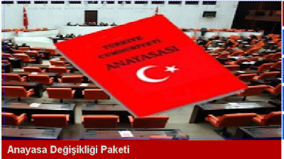

# Hafta 12

Newsweek

[mealen] Yukselen ekonomilerde ortaya cikan orta sinifin degerleri ABD
ile her zaman uyusmuyor. Bu orta sinif demokratliktan, ozgurluklerden
uzak karakterler sergileyebiliyor.

Oyle ama...

Tum dunyadaki orta siniflar ekonominin icerigi degistigi icin baski
altinda. Sizinkiler de oyle (ABD). Orta sinifiniz stres
halinde. Gelisen ekonomilerdekiler nispeten o konuma daha yeni geldigi
icin daha diken ustunde olabilir. Ayrica 'fabrika usulu islerde'
calisan bu kisiler, ne yapilacaginin onlara soylenmesine aliskinlar,
ve o soyleyen kisi, demokrat olmayan, totaliter degerler asilayan
birileri olabilir. Bu kisilerden "degistirilebilir" islerde
calisanlar, yeni konumu kaybetmemek icin kendine benzemeyen
baskalarini (mesela egitimini uzerinden) engellemeye calisabilirler,
cunku vasifsiz islerde calismaktadirlar, ne kadar az kisi onlarla ayni
seviyede olursa o kadar iyi gibi dusunebilirler.

Bu dertler farkli ulkelerde farkli sekillerde ortaya cikiyor olabilir.

---

Newsweek

[mealen] egitimin kalitesinin dusmesi sonucu orta sinifin gelismesinin
onundeki bir kopru yikilmis oldu

O kalite sizde de dusuyor

Ozetle: Kendine bak.

Aslinda kalite dusmuyor, hep oldugu yerde, ama ihtiyaclar degistigi
icin egitimin kalitesi dusmus gibi gozukuyor. Artik fabrikaya benzeyen
okullardan birbirine benzeyen, "ogutulmus", "isciler" degil, inovatif
yeni calisanlar cikmali. Bunun icin egitim bastan asagi tekrar
yapilanmali.

---

Aykırı

Su sanat degil mi?

Degil

Hiciv bolumumuzun baslamasina sebep olan bu karikatur, birilerine bir
seyler eklemis olabilir, bir hediye de sayilabilir. Fakat statukoyu
zorlamamistir, bu baglamda sanat degildir.

---

Aykırı

Duchamp'in lazimligi sanat midir?

Oyledir

O sekilde sergiye konan birinci lazimlik sanattir. Ikincisi degildir.

---

Haber

Genelkurmay tarafından yüksek tirajlı gazetelere servis edilerek 25
Nisan 1998'de aralarında Cengiz Çandar, Mehmet Ali Birand, Akın
Birdal, Salim Ensarioğlu, Ahmet Altan, Mehmet Altan'ın da bulunduğu
isimleri 'PKK ile işbirliği yapmak'la suçlayan manşet [..]

Ilginc

Tarihin cilvesine bak. Sn. Candar ulkedeki despot "merkez" ile papaz
olan ailesindeki ilk kisi degil. Vakti zamaninda musluman elit icinde
anahtar bir konumda olan Candarli ailesinden geliyor, bu aile
1359-1499 arasinda Osmanli'ya toplam alti vezir gonderdi. Ama
Istanbul'un fethinden sonra isler degisti; vezirlik pozisyonuna
kapikulu getirilmeye baslandi; Anadolu'daki musluman aileler
marjinalize edildi, disari itildi. 1656'da basvezir olacak Mehmet
Koprulu saraya pasta, corek pisirmek icin girmisti, Arnavutluktan
geliyordu, babasi hristiyandi. Hirvat olan Ali Pasa benzer bir
hikaye... Saraya cesnicibasi olarak girmisti [1].

Ilginc degil mi?

[1] Grillo, R., Pluralism and the Politics of Difference State,
Culture, and Ethnicity in Comparative Perspective, sf. 84

---

The Scholarly Kitchen blog'undan, Clay Shirky'nin bir konusmasi hakkinda:

[HSBC bankasının bazı müşterilerinin hoşuna gitmeyen bir kararından sonra] müşteriler tahmin edileceği üzere Facebook, sosyal ağlar çağında bu yapılana sessiz kalmadı. Online ortamda organize oldular. Eylemi daha ileri taşıyarak protestolara da başlayacaklardı, o noktada HSBC pes etti.

Shirky'nin söylediği gibi, mutsuz müşteriler satıcı tarafından ilgiye mazhar olabilir, fakat mutsuz ve network oluşturmuş müşteriler kısa sürede işiniz üzerinde bozucu bir etkiye sebep olabilir. Birbirimizle bağlanmamızı sağlayan, yayın yapmamızı, paylaşmamızı sağlayan teknolojinin her yere yayılmış olması klasik yayıncılık sistemini altüst etmektedir - fakat bunların hiçbiri aslında yeni bir haber / problem değil.

[Fi tarihinde] matbaa'nın çıkışı, kitapların eskisine oranla 300 kat daha hızlı çoğaltılabilmesini sağladı. Bunun bilginin yaygınlığına bariz etkisinin yanında, Katolik Kilisesi üzerinde daha az bilinen etkileri de oldu. Genel kanının aksine, matbaada ilk basılan eserler arasında İncil haricinde başka şeyler de vardı, bunların en yaygın olanları Katolik Kilise'sinin çıkarttığı sevaplara tekabül eden bir tür "dini para"ydı [1]. Eskiden elle yazılan bu para, matbaa sayesinde çok fazla basılabilince, işin cılkı çıktı ve bu durum Martin Luther'in 95 Tezi'ni yazmaya itti, bu da büyüye büyüye Protestan Reformasyonu başlatan sürecin kıvılcımını sağlamış oldu. Yani, ilk bakışta mevcut durumu güçlendireceği zannedilen bir buluş (güya İncil'in 'daha fazla', dini paradan 'daha fazla' basabilmek, eski düzenin 'daha fazla' olması demek olacaktı) bir bakıldı ki mevcut düzeni tamamen alaşağı etmiş.
Bolluk, yokluktan daha fazla değişime sebep olur. Çünkü insanlar yokluk durumunda ne yapacaklarını bilirler.
Bu sözü iyi bir düşünelim. "İnsanlar yokluk durumunda ne yapacaklarını bilirler". Evet, yokluk şartlarında eğer gerekirse nasıl tasarruf edeceğimizi, azar azar harcamaya başlayacağımızı, nasıl muhafaza edeceğimizi biliyoruz. Fakat bilgi / seçenek / seçim aşırı fazlalaşınca önceliklerimizi nasıl ayarlayacağımızı, nasıl yön seçeceğimizi bilemiyoruz. Bolluk altında boğulabiliriz. Yolumuzu kaybedebiliriz. Kafamızı kuma gömebiliriz. Ama her halükarda, bolluk, kafamızı yokluktan daha fazla karıştırır.

Shirky'nin konuşması sırasında pek çok diğer cevher vardı. Fakat beni düşünmeye iten bir diğeri şöyleydi:
Eskinin en iyisini tutup, yeninin en iyisiyle birleştirelim demek kolaydır, fakat devrimler sırasında, yeninin en iyisi ile eskinin en iyisi birbirine taban tabana zıttır. Yeni durum, her şeyi, tamamen değişik bir şekilde yapmakla alakalıdır.
Belki bazı şartlarda yaptıklarımızı azar azar (incrementally) adapte etmek / değiştirmenin yolu vardır. Fakat gerçek değişim gerektiğinde eskiyi "bir hatıra" olarak tutmak haricinde saklamanın başka yolu var mıdır? Bu durumlarda eski, bilgi vermek haricinde başka ne yapabilir ki?

[1] Terminolojide bu kavram "indulgences" olarak geçiyor.

---

Pazarlama dunyasinda unlu simalardan Seth Godin'in konuk oldugu bir
podcast'ten derlenmistir:

Sanayi çağının özü şudur: fabrikayı kurarsın, içine bulabildiğin "en
ucuz" çalışanları doldurursun, bir ürünü erişebileceği / hitap
edebileceği en geniş kitle için tasarlarsın, ve bu maldan pek çok
sayıda satarsın. Bu tür fabrikalar birbirine benzer eşyalar, pastalar,
börekler, vs. üretirler, fakat bu tür 'kitlesel' mentaliteyle yazılım
da üretilmektedir (mesela Microsoft ürünleri). Bu fabrika mentalitesi
mevcut halimize gelmemizi sağladı, refahı, zenginliği arttırdı. Ama
son 10 senede (bize göre 1956'dan beri) modern / endüstriyel çağ artık
yeterli olamıyor.

Şu anda öyle bir zamandayız ki, eğer yaptığınız iş ucuz ve averaj ise, o aynı işi daha ucuz ve daha averaj yapan birilerini bulabilirim (küreselleşme). Bu yüzden artık yapılması gereken 'uyum sağlamak', 'normal' olmak değil, averaj dışında, (kendi yeteneklerinin ışığında) değişik olanı yapabilmek. Çünkü insanların, tüketicinin istediği artık "ihtiyacı olan" şeyi değil, "arzu duyduğu" şeyi almak. Biraz önce belirtildiği gibi ihtiyacın olduğu şeyler artık eşyalaşmış / vasat / yaygın (commodatized) hale geldiği ve çok ucuz bir şekilde alınabildiği için, esas para özel olanı yapabilmekte.

Bu kalite argümanından da öte bir konu. Bir tür sanattan bahsediyoruz. Godin'e göre (ki yaygın bilinen şekli de bu) sanat bir şeyi üretirken önceden hazır yolu, listeyi, kuralı (guideline) takıp etmediğiniz her durumda mevcuttur. Düşüncenin en rafine hali olan matematikte mesela, modelleme işi bir sanattır. Bir veriyi modellemenin pek çok yolu vardır; en optimal, en uygun olanı, en iyi tahminleri yapabileni ortaya çıkartmak sanat ister. Aynı örnekleri bir film, bir şarkı, bir yazılım, bir kitap için de kullanabiliriz.

Bu sanat, Godin'in "bonus, hediye" kavramıyla yakından ilintili. Bir ürünü dinleyiciye, seyirciye verdiğiniz, aktardığınız zaman içindeki "yapmaya mecbur olmadığınız ek" bir hediyedir. O hediye, o bonus, alan ve veren arasında bir bağ oluşturur. Mecbur olunmadığı bilinçsel, bilinçaltısal bir şekilde alıcı tarafından bilinir, hissedilir; ve alıcının üreticiye daha yakın hissetmesini, ürün hakkında bazen üretenden daha fazla heyecan duyabilmesini sağlar. Bu aynı zamanda, bedava reklamdır. Ki bu tür üretim artık bir lüks değil, bir tür mecburiyet haline gelmiştir.

Böyle bir dünyada, daha fazla kişi uygun görülmese de ona doğru geleni takip etmelidir, ve sürekli denemelidir. Picasso'nun çok kötü resimleri vardır, fakat Picasso hayatı boyunca resim yapmıştır. Sürekli denemiştir.

---

Destekliyoruz

---

Lokasyon bilgisi uzerine kurulu mobil programlardan biri
Foursquare. Programi degisik yapan lokasyonun surekli paylasimi
yerine, kullanici istegine gore bir yere (restoran, fuar, bar, cafe)
gelindiginde "orada olundugu" bilgisinin kendi istegiyle dis dunya ile
paylasmasi; yani "check-in" yapmasi (otele check-in yapildigi
gibi). Bu yapilinca kullanici dunyaya sanki "burada oldugum bilinsin",
"etraftaki benim gibi olan kisilerle tanismak istiyorum" gibi bir
mesaj veriyor, diger Foursquare kullanicilari aninda bundan haberdar
oluyor. Mesela cocugunuzu oynamak icin parka goturdunuz, parka
check-in yapiyorsunuz. Etraftaki diger anne, babalardan aynisini
yapanlarla tanisma firsati, programda lokasyonu size yakin diger
kullanicilar hemen gozukuyor. Restoran, cafe gibi yerler Foursquare
promosyonu yapabiliyorlar, oraya belli sayida check-in yapan kisiler
mesela oranin "mudavimi" "piri" haline getirilebiliyor, ona gore
hediyeler, avantajlar vermek mumkun. Tam bir 21. yuzyil uygulamasi;
insanlari yakinlastiran, hizli bilgi paylasimi, mobil bir kavram
uzerine kurulur. iPhone ve Android uzerinde kullanilabilmekte.

---

Bizim analize gore Turkiye'de gecmise, gecmis kavramina atanan kultur
kodu GUZEL GUNLER. Insanlar eskiden islerin daha iyi oldugunu
dusunmeyi seviyor, nostaljiyle hasir nesirler, "eski bayramlardan"
tutun, "Etiler Lisesi oncesi Etiler" hakkinda bile laf geveleyenler
cikiyor (30 sene once dogru durust olmayan bir yerden bahsediyoruz
ha!). Bu durum 80 model MGK sentezinin niye (bir sure) basarili
olabildigini acikliyor - darbeciler bu koda hitap ederek insanlarin
aklini by-pass etmeyi basarabilmisler. Osmanlicilik, vs, "eski
iyiydi". Fakat gercekte, degildi. O zaman ne yapilacak? Parca parca
iyi noktalar bulunup biraraya getirilecek, uymayan bir sekilde
uydurulacak (efendim, o donem, o kisi aslinda "soyleydi, boyle
degildi"), ve mutlu bir tarih cizgisi olusturulacak. Abdulhamit,
in. Inonu, out. Kemal'e bir transformasyon, birlestir parcalari. Gul
gibi mutlu cizgi.

Bu bir organize salakliktir. Kultur kodlari yol gosterici ozelligini
tamamen kaybetmis olabilirler. Turkiye'de "ama aslinda" diye baslayan
pek cok yorum dupeduz yalan icermektedir. Adam gelisiguzel tarihe
bakiyor, salliyor "efendim aslinda Avrupaliyiz". Degiliz. Simdi olmaya
basliyoruz. Bariz degil mi? Bunu isledik: Avrupa yakin tarihinde
(karanligiyla beraber) Ortacag'in daginik ve cogulcu ortamini yasadi,
zapturat haricinde baska bir seyleri "uzun sure" tecrube ederek
kulturunun parcasi haline getirdi. Bu olus bu topraklarda vuku
bulmadi. Ama sunu da ekleyelim: "Normal olan" Turkiyelilerin yasadigi
surecti. Avrupa'da olan bir takim cok ozel sartlarin yanyana
gelmesiydi, normal olan ardi ardina gelen merkezi despotlarin halki
ezerek vergiyi, askeri toplamasidir (=Osmanli).

Uluslararasi iliskilerde de "tarih" tutarli bir yol gosterici
degildir. Iste Ermenistan ile iliskiler: Dogru, zamaninda Ermenileri
Osmanli'nin kolelik sisteminden muhaf tutmussun, ayricalikli bir statu
vermissin, ama sonra kesmissin [1]. Bunlarin hangisini kullanacaksin?
Efendim, ise yarayani kullanacagiz. O zaman tarih gelisiguzel
kullanilan (arbitrary) bir parametre haline gelmis demektir, ve zaten
modeldeki etkisini kaybetmistir. Tabii kendi kendini mutlu etmek
isteyen Ankara memurlari kendilerini istedikleri sekilde
kandirabilirler.

Hicbir millet mukemmel tarihe sahip degildir. Ingilizler koca bir
imparatorlugu kaybetmistir, ve bu konu hakkinda surekli hayiflanirlar.

"Gecmisle olan kirilmayi" da su an herkes yasamaktadir, cunku uretim
yontemi degismektedir, daha once iki kere degistigi gibi. Bu konuda
yanliz degiliz. Kafayi kuma gommeye gerek yok.

[1] Dogu vilayetlerinde olan facialar sadece Ittihatcilarla sinirli
degil. Abdulhamit Hamidiye uzerinden yarattigi teror ile bolgede
kiyim, aclik, sefalete sebep olmustur. Elinde kan vardir. Ittihatcilar
malum. 1938'de neler oldugunu hepimiz biliyoruz. Goruldugu gibi bir
"sureklilik" var. Daha geri gidilirse pek cok diger despotluk
ornekleri bulunacaktir. Toprak bazli imparatorluk baska sekilde
olamaz. Uretim sekli bunu dikte eder.

----

Amerika'da bir deyiş vardır: "Sosisin nasıl yapıldığını görsen yemek
istemezsin". Bu deyişi mecliste kanunların yapılışına uygulayanlar da
çoktur. Obama'nın "azar azar ilerleyici (incrementalist)" olduğu
söylenir, sağlık garantisi hakkındaki reformu izlerken bu cümleler
sürekli aklımızdan geçti.

Reformun bir ilerleme olduğu kesin. Karşı gelenler "kanunu anayasa
mahkemesine" götüreceklerini söylüyorlar, diğer taraftan Tayland'da
sağlık reformu yapan "popülist" Thaksın'ın darbeyle devrilmesi ilginç
bir durum. Bu sağlık reformu işinde bir şeyler var.. ama ne? Olayda
tanıdık bazı öğeler var.

Her halükarda, Obama reformu anons ettiği basın toplantısında "değişim
işte buna benziyor" diye bir yorum yaptı, bu sözü, seçim kampanyası
sırasında sürekli vurgulanan "değişim" mesajından sonra (mecburen)
ortaya çıkan "yavaş" ilerlemeye bakarak "nerede bu değişim"
eleştirisini yapanlara bir cevap niteliğini taşıyor. Eleştirenler de
bir ölçüde haklı: Seçim kampanyası "devrimsel" mesajlar içeriyordu.

---

O'Reilly Radar, Nat Torkington yazisi

Biyolojide canlilarin evrimsel tarihine baktigimizda, bir canlinin
defansina agirlik vermesinin onu av olarak goren diger canlilara karsi
isine yaradigini goruyoruz, ama bu defans cevresel / iklimsel
degisiklige karsi hicbir ise yaramiyor. Iceriklerini bir "odeme
duvari" arkasinda kapatmaya ugrasan ve Google'a bagirip cagiran
gazeteler eger Google bir avci / yiyecek pesindeki bir canli olsaydi,
basarili olabilirdi. Fakat burasi kopyalama masrafinin sifir oldugu,
herkesin musteri olabildigi, rakibinizin 'bir tiklama otede'
olabildigi [..] Internet ortami. Internet'i bir baska / herhangi bir
rakip olarak gormek bu ortamin [..] ana mesajini hic kavrayamamak
anlamina gelir. Icerigini News Corp usulu odeme duvari arkasinda
kapatanlar bir kuyruklu yildizin dunyaya geldigini bilen ve "zirhimi
kalinlastirayim, cunku gelenin buyuk bir kuyrugu varmis" diye dusunen
bir dinazordan farksizdir.

---

Yunanistan basbakani George Papandreou'nun ABD Brookings Enstitusundeki konusmasi. Moderator Kemal Dervis.

[[-]](http://cspan.org/Watch/Media/2010/03/08/HP/A/30434/PM+of+Greece+George+Papandreou+at+Brookings+Institution.aspx)

---

ABD meclisi disisler komitesinde Ermeni onerisi kabul edildi. Neler
oluyor? Bir kere Obama ve Demokratlar darda. Obama'nin halk destegi
dustu, belli bir duzeyin altina inmedi, ama yaklasan kongre
secimlerinde neler olacagi belli degil. Temsilciler meclisi uyeleri
bilindigi gibi 2 senede bir secilir; bu onlari daha "diken ustunde"
tutar, sistem buna gore ayarlanmistir; baskanin partisinden olanlar
onun popularitesine bakarak yakin ya da uzak pozisyon almaya
bakarlar. Ermeni tasarisi bu bolgelerden oy almak isteyecekler icin
onemli: iste boyle is dara dusunce de oy nereden gelirse buyur
edilecektir. Temsilciler meclisinden gecse de, daha uzun vadeli
bakabilen senatonun (cunku uyeleri 6 senede bir secilir -4 senede bir
ucte biri icin-) karari daha degisik olacaktir. Onerinin su an icin
reddedilmesi iyi olur.

Burada hakliliktan, haksizliktan bahsetmiyoruz tabii. Neler
yapilabilir, neler mevcut durum, ve ondeki sorunlari icin en iyisidir,
bundan bahsediyoruz. Uzun vadede dogru olan Turkiye'nin tarihteki aci
olaylari kabul etmesi, hatta olayin etrafinda anitlar, ritueller
gelistirerek, bu hatirayi gerektigi yere koymasi, ve onu gommesidir.

Miras aldigi Roma mentalitesinin pisligini temizlemesidir.

---

Baslamadan hemen belirtelim: Biz refleksiv bir TRT dusmani degiliz.

Pek cok ortamda Pax Americana sentezine abone olmus ucuz liberalizm
yapmaya calisan hiyarlarin TRT'ye gak guk laf ettigini isittik. Bunlar
gereksiz hareketler. Onlarca kanal icinde bir devlet kanalinin
olmasinda hicbir zarar yoktur. Olabilecek en kotu sey nedir? Kanalin
devlet / hukumet borazani haline gelmesi.. O zaman onlarca kanal
arasinda orada durur, ve seyredilmez.

Fakat ikinci bir ihtimal, halkin oyuyla secilmis olan karar
vericilerin karar vermelerine yarayacak kanal olusturmalaridir (ya da
onu yapacak kaliteli bir adami basa getirmeleridir). O zaman mevcut
banallik, averajlik denizi icinde bir tane farkli bir 'sey' ortaya
cikar ve belki Ingiliz BBC olcusune yaklasabilir. Verirsin adama ayda
uc bes kurus maas, takir takir sana anlatir Amerika'dan (Bulent Ali
Riza), neler oluyor bitiyor. Bunlar degerli seyler. Ya da Medya
Mufettisi. vs. Bunlar karar verici icin faydali; eger halk icinden
ilgisi olan varsa, onlar da kenarindan faydalanir iste.

Bilgi aktariminin, ham bilginin ucuzlastigi (commodatized) hale
geldigi bir ortamda (kagit pacavra gazeteler bu sebepten cokuyor)
paradoksal bir sekilde devletin de bir servis saglayabilmesi
mumkundur. Tukenen petrol kaynaklari ortaminda ozel sirketler yerine
devlet sirketlerinin ortaya cikmasi orneginde oldugu gibi.

Tabii devlet cikisli haberlerde (emniyet, vs. gibi) "o da kardes
devlet kurumu" diye TRT'ye iltimas gecilmesi rekabete aykiridir, o
baska mesele. Buna dikkat edilmeli.

Ama bunun haricinde TRT mevcudiyeti ilkesel bir yanlislik degildir.

---
