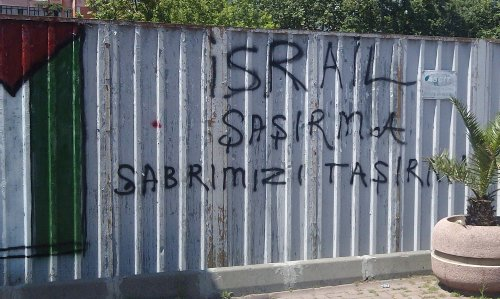
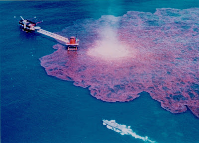

# Hafta 24

Mehmet Altan

“PKK sonuç mudur, neden mi?”

Maalesef açılım süreci bu soruya kesin ve saydam bir cevap vererek
başlamadı.

“Askeriyenin kırmızı çizgilerinden” etkilenenler, PKK’ya “neden”
olarak baktı.

PKK’yı “sonuç” olarak görenler ise, Birinci Cumhuriyeti “Türkiye
Kürtleri’nin” de devleti haline getirecek olan radikal
demokratikleşmeyi göze alamadılar. İçeride istihbarat; dışarıda ABD,
Irak, Barzani çizgisinin yeterli olacağına fazlasıyla güvendiler...

Bir de buna iktidar partisiyle, bölgedeki “yerel iktidar” konumundaki
parti rekabeti de eklenince şiddet “daha da ürkütücü bir biçimde geri
döndü.”

“Güvenlik mantığını” tek ölçüt olarak ele almayıp, “PKK sonuçtur”
denseydi, Birinci Cumhuriyet gerçek bir “vatandaşlık” açılımı yaparak,
keskin bir demokratikleşmeye uğrayacaktı.

Tabii sadece Kürt vatandaşlar değil, gayrimüslimler de Heybeli Ruhban
Okulu’ndan hala mahrum kalmayacak, Aleviler de cemevlerinde ibadet
etmek için “devlet onayı” beklemeyecekti.

Birinci Cumhuriyet, “vatandaşlığı” keşfederek, kimlik ve nitelik
değiştirerek Kemalizm’den demokrasiye terfi edecekti. 2010 yılının
yazı da çocuklarımıza tabut olmayacaktı...

Dogru

---

Gulay Gokturk

Peki neden 700 bin-800 bin kişilik bu dev ordu çeyrek yüzyılı aşkın
bir süredir üç-beş bin teröriste karşı silahlı mücadeleyi kazanamıyor?
[.. A]skeri boyutta neden bu kadar başarısız kalındığının da izah
edilmesi gerek. [..] Aşağıya alacağım satırlar artık hepimizin
yakından tanıdığı Doçent Sedat Laçiner'e ait.

"Terörist sivrisinek gibidir. Ordu ise dev bir balyozdur. Türkiye
elinde balyozla sivrisineğin peşinde koşturuyor. Siz sivrisinek
olsanız, balyozdan korkar mısınız? Korkmazsınız. Balyozun üzerinize
isabet etme ihtimali çok düşüktür çünkü. Bu yüzden sivrisinek insanın
devamlı orasına burasına konup kanını emmeye çalışır ki, balyoz
insanın kendisine vursun. (...) Doğu'da 250 bin asker var. Değil 250
bin, 2 milyon asker yerleştirin, terörist gene gelir bombasını
atar. Bir ili, 50 kişiyle terörize edebilirsiniz. Çünkü ordular
hantaldır. Orduyla iç güvenlik sağlanamaz. Siz 10 bin kişiyi oradan
oraya sevk ederken, 50 kişi ıslık çalarak başka bir yere
gidiyor. (...) Mesela Gabar Dağı'nın adı çok geçiyor. Bu dağda şu anda
35 PKK teröristi var. Bu resmi rakamdır. Peki, biz bu dağın etrafında
kaç kişi bulunduruyoruz biliyor musunuz? Dağın etrafında 10 bin kadar
askerimiz var bizim. Cudi Dağı'na gelelim... Orada da 100 civarında
PKK teröristi var. Oysa bir dağa hâkim olmak için binlerce insana
ihtiyacınız yok. O dağa işini iyi yapan, komando eğitimi almış, SAT
türü 35-100 James Bond gönderirsiniz, işi bitirirsiniz. Ama
gönderilmiyor."

Bu arada, Batı'da teröristle mücadeleyi orduyla yürütmeye çalışan tek
ülkenin de Türkiye olduğunu öğreniyoruz Laçiner'den. "Terörle
mücadele" ve "teröristle mücadele" kavramlarını birbirinden ayıran
Laçiner bu konuda şöyle diyor:

"Batılı ülkeler, teröristle mücadeleyi asla orduyla
yapmıyorlar. Polisin içinde bir birim kuruyorlar. Kuzey İrlanda'da
biraz orduyu işin içine soktular, sonuç felaket oldu. Sonra yeniden
profesyonel güçlere döndüler."

Katılıyorum

---

Deniz Ulke Aribogan

Tam Türkiye Cumhuriyeti'nin nasıl bir fikrin ürünü olduğu konusunda
bir şeyler yazmaya niyetleniyordum ki, Carol Negro'nun American
Thinker'da yazdığı 'Amerika'nın Sırrı' başlıklı makaleyi gördüm. Yazı
şu satırlarla başlıyordu: 'Amerika bir toprak parçası değildir. Bir
kültür ya da bir milliyet değildir. Bir örf ve adetler bütünü
değildir. Bir hükümet değildir. Kişiler değildir. Bir kurallar kitabı
değildir. Bir ırk ya da etnisite değildir. Amerika bir fikirdir.

Bu nedenle bu fikri kucaklayan herkes Amerikalı olabilir. Diğer birçok
ulus kan veya toprak temelli olmasına rağmen, Amerika taşınabilir bir
şeydir. Onu kalplerimizde ve zihinlerimizde
taşıyabiliriz. Şehirlerimizi bombalayabilirsiniz, ekonomimizi
çökertebilirsiniz, kıtaları okyanusa dökebilir, çoğumuzu
öldürebilirsiniz ama Amerika'yı yok edemezsiniz. Çünkü nerede iki ya
da daha fazla Amerikalı bir araya gelir Amerika oradadır. Sırrımız
şudur: Biz Amerika'da yaşamayız, Amerika bizim içimizde yaşar. Amerika
bir fikirdir'.

Ben de yukarıdaki satırlardan ilham alarak 'Türkiye bir fikirdir'
iddiasını öne sürüyorum.

O fikir sizin sandiginiz sey degil

ABD'yi ABD yapan fikir, kendine atadigi kultur kodunda vucut bulan
RUYA kelimesidir. Tepe uzerindeki sehir (city on the hill), ozel /
farkli / yegane olmak (exceptionalism) deyisleri hep buraya baglanir
-- cografi, sosyolojik temelleri de vardir. Cok buyuk bir alana
gelinmis, dini baskilardan (religious persecution) kacilmistir, boyle
buyuk, bos bir alana hakim olmak, cozum bulma kabiliyetinizi
genisletmeniz anlamina gelir. Buyuk alanda insan gucu sinirli ise az
sayida kisinin etki alanini genisletecek icatlara odaklanirsiniz,
hayal gucunuz calismaya mecburdur (Einstein ABD ziyaretinde aynen bu
gozlemi yapmistir). Bu gerekliliklerden dolayi, fikir olabilecek bir
kavram, RUYA, kultur kodu haline gelmistir.

Turkiye'deki Turklerin kultur kodlari bundan farklidir.

Bu bir.

Iki, Turklerle Kurtlerin kultur kodlari ayni degildir.

Kultur kodlari asimilasyona karsi muthis bir mukavemet gosterirler,
Kurtlerin Osmanli, sonra Turk baskici politikalarina karsi yillardir
gosterdigi mukavemetin sebebi de budur, ve korunan kodlar
degismemistir.

Demek ki Turkiyelilik baglaminda ortada ne fikir olabilecek bir kod,
ne de yuzde yuz uyumluluk gosteren "kodlar toplami" vardir.

E peki, bunlar yoksa birarada olunamaz mi?

Olunur niye olunmasin? Kodlari bir tarafa birakalim: Cografi (tarihi
degil) ve ekonomik gereklilikler zaten gerekli entegrasyonu
yapacak. Cagin ruhunu takip edeceksin, modernist aptalliklari bir
tarafa birakacaksin. Merkezilesme, maksimizasyon, standardizasyon,
senkronizasyon, konsentrasyon gibi daha once isledigimiz kategorilere
uyan hicbir cozum bugun ise yaramaz. Bu prensipler takip edilirse
beraber yasamakta problem cikmaz.

---

Parag Khanna

Turklerin tum kendine guvenine ragmen, Avrupa'nin gorunmeyen Turkiye
kolonizasyonu yoluna devam etmistir. [..] Jacques Chirac 2005 yilinda
"Turkiye'nin Avrupali olmasi bir kulturel devrim gerektirir" sozlerini
soylemekte iken, ayni anda AB komisyonu Turk devletini lobotomize etme
gorevine yerine getirdi. Turkiye 90'li yillarin sonunda Avrupa'yi
utandirip kendisini ciddiye almaya zorlamis olabilir, ama buna
karsilik AB, menusunun tamamini, 35 tane basligi (chapter) Turkiye'nin
bogazindan asagi tikmistir, ki bu sayi diger ulkelerden 4 baslik daha
fazladir.

Boyle iste

Turkiye, yonetim disiplini baglaminda Osmanli'nin mirascisidir. Boyle
bir miras varsa, tabii ki degisim sancili olacak.

Turkiye bu konuda yanliz degildir. Roma mirasina sahip olan tum
ulkeler problem ulkelerdir: Italya, Yunanistan, Turkiye.. sirasiyla
1. 2. ve 3. Roma. Bunlar kendi klasmanlarinda Avrupa'nin en geri
ulkeleridir. Italya modern tarihinde hicbir savas kazanamamis, son
elli senedir ortalama hukumet yasi 1.5'u gecmemis, coplerini dogru
durust toplayamayan bir millettir. Yunanistan'in basina gelenleri
hepimiz gorduk. Turkiye.. eh surekli calkantida.

Magna Carta'nin yazildigi, universite kavraminin temelinin atildigi,
daginik, cogulcu (ve karisik) Ortacagi yasamadiysan, uzun bir zamani
Osmanli gibi baskici despotluk sistemleri altinda gecirdiysen isin zor
[1].

Rusya benzer problemleri yasadi ve yasiyor. Bu tur toplumlarin
moderniteyi adaptasyonu da cok sert yontemlerle oldu. 2. dalga
prenspileri o kulturlerin ezici, cikarimci (extractive) merceginden
suzuldu, ve daha da katilasti. Stalin'den bahsettik, etrafina soruyor,
filanca ulkedeki en buyuk fabrika hangisi? Cevap geliyor, sudur
efendim... Stalin hemen emri veriyor: Daha buyugunu yaptirin.

Anlatabiliyor muyum? Bati ulkelerinde modernite maksimizasyona sebep
olmus, kuruluslar buyudukce buyumus, ama hala derinlerde bir yerlerde
o cogulcu kodlar duruyor. Vardigi noktadan rahatsiz. Organization Man,
1984 gibi filmler cekiyor habire, o rahatsizligi anlatiyor. AT&T gibi
"buyuklerini" parcaliyor. Oteki hiyar ne diyor?

Daha buyugunu yaptirin.

Iste fark burada.

---

Robert Kaplan

Bugunku Yunanistan, [kadim] Perikles Yunan kulturunun degil, Bizans ve
Turk despotluklarinin cocugudur.

Dogru

[1] Italya cogulculugu yasadi, Roma tecrubesi oldukca uzakta.. ama
var. Korelasyon soyle kurulabilir: Roma ne kadar uzaksa, gelisim o
kadar fazla. Italya "gerilerin ilerisi".

[2] Khanna ayrica, Turkiye burokrasisini tarif ederken ilginc bir
kelime oyunu yapiyor. Once arka plan: Ingilizce literaturde karmasik,
yoz bir burokrasiyi sifatlamak icin iki tanimdan biri kullanilir. Ya
Kafkavari (Kafkaesque) derler, ya da Bizansvari (Byzantian). Niye
Kafkavari? Cunku unlu yazar Kafka burokratik cehennemi tarif etmis,
bitirmistir. Her neyse, Khanna, Turkiye burokrasisini tarif ederken
"Bizansvari" demis, sonra parantez acip yanina yazmis: Kelimenin tam
anlamiyla (literally). Bu bizi bayagi guldurdu.

---

Thomas Friedman

Turkiye'nin Islamci hukumeti Arap Lig'ine katilacak gibi [..] Israil'e
direnis ekseni [bir suru zirva]

Oyle mi?

Direnis, ve siddet hakkinda Friedman'in soyleyecek fazla sozu yok.. Bakalim Friedman kendisi hakkinda su soylenenleri begenecek mi?
11 Eylul'den sonra Bush hukumeti artik Amerika'nin gucunu BM kararlari icinde maskelemek, pardon, BM icinde calisarak icra etmek yerine, apacik, bir gozdagi amaciyla kullanilmasi gerektigine karar verdi. Bu sayede olan ve olabilecek tum dusmanlar korkutulmus olacakti. Hukumetin Ortadogu konusunda zaten kendi bilirkisileri ve entellektuel amigolari vardi. Bernard Lewis'e gore mesela, 'dunyanin o kisminda kararli ve mutlak guc haricinde hicbir sey sonuc veremezdi' ve Lewis Taliban'in hemen yikilmasi ile dogrulanmis gibi gozuktu. Irak dogal olarak bir sonraki hedefti. Thomas Friedman [unlu soylesi programi] Charlie Rose'da sunlari soyluyordu. "Iraklilar evlerinin onunde, kapidan kapiya dolasan Amerikali kiz ve erkek [askerleri] gormeli, ve onlar su mesaji vermeliler: 'Sen bu cumlenin neresini anlamiyorsun? Biz kendi acik toplumumuza onem veriyoruz, siz bir fantazi balonu icinde yasiyorsunuz. Bu fantazi balonunun buyumesine izin verecegimizi mi zannediyorsunuz? Alin bakalim. Bunu. Kafaniza. Yiyin [1]'".
Evet, Friedman zamaninda Irak Savasi'ni desteklemis, ve neocon manyaklar ile ayni yataga girmekten cekinmemistir.

Entellektuel durusu "saibelidir".

[1] Burada Friedman igrenc bir argo, "suck on this" kelimelerini
kullaniyor. Yukarida tercumede ona yakin olabilecek kelimeleri
kullanmaya calistik.

---

Derya Sazak

40 bin insanımızı kaybettiğimiz Güneydoğu’daki sorunu bitirmede
“denenmemiş” tek yol, PKK’ya silah bıraktırmaktı! Sınırların
değişmeyeceği ancak, Anayasal yurttaşlık temelinde Kürt kimliğinin
tanınacağı, ana dilde eğitime olanak tanınacağı, Parlamento’da,
belediyelerde DTP/BDP gibi partiler üzerinden temsil meşruiyetinin
sağlanacağı adımlarla Kürt sorunu demokratik bir çözüme
kavuşturulabilirdi. Öcalan’ı dışında tutacak bir af çıkarılarak, PKK
silahlı bir örgüt olmaktan çıkarılabilirdi.

“Demokratik açılım’ın içi ancak böyle dolardı!

Hükümet tam olarak neyi planladı bilmiyoruz ama cesaretinin
kırılmasında MGK etkisi, Baykal’ın CHP’sinin süreci kesintiye uğratma
çabası, PKK’daki “tasfiye” kaygısı ve nihayet Kürt siyasetinin İmralı
ve Kandil’i muhatap göstermesinin, Habur girişlerine tepki olarak
başlatılan KCK operasyonlarının sembolik de olsa silah bırakanların
cezaevine atılmasının gelinen aşamada etkisi büyük.

Din ile dil, askerle siyasiler arasına sıkışan bu “paradigma” seçime
giden Türkiye’de değişmez.

Dogru

---

Aferin IHH

Bu grubun yardim amacli gitme yaninda, etrafi karistirma amacinin da
oldugu anlasiliyor; hazirlikli gitmisler, ve iyi is
basardilar. Kutluyorum. Disariya yayin yapabilmek icin herseyi
hazirlamislar, askerler gelince birazcik ortami gidiklamis ta
olabilirler. Boylece Israil'e bacaklarini soktular. Guzel bir taktik
basari. Bravo.

---

Cay Partisi

Çay partileri ABD'nin kuruluş tarihine bir atıf, bilindiği gibi
bağımsızlık savaşından önce İngilizlerin vergilendirmesine baş
kaldıran Amerikalılar, Boston'da bir İngiliz gemisinin getirdiği
çayları denize atmıştı. Şimdi benzer bir protesto yine (önce)
Boston'da, ama bu sefer aşırı borçlanmayı, vergilendirmeyi protesto
eden liberteryenler tarafından yapılıyor. Hareket daha sonra tüm
Amerika'ya yayıldı ve Cumhuriyetçi Parti içinde kuvvetli bir damar
haline geldi.Bu hareketin "ruhani lideri" Teksas'tan uzun yıllar
milletvekilliği yapmış olan Ron Paul. Paul ekonomide Avusturya okulunu
takip etmesiyle biliniyor, ve merkezi kontrolün insanların hayatına
her türlü müdahelesine karşı. Paul emlak temelli finans krizini yıllar
önceden doğru tahmin etmesiyle gündemde iyice öne çıktı. Sağda resmi
görülen kitabı "FED'i Bitirin (End the Fed)" ismini taşıyor. Çay
Partisini çıkış sebebi, ve duyarlılıkları açısından
destekliyoruz. Daha önce bahsettiğimiz her iki partide bölüp porcuk
olan yeni çağ gerekliliklerinin peşinde koşanların kıpırtıları
bunlar.Merkez'in yeni çağda belki de yapacağı en iyi icraat kendini
gereksizleştirmek. Ulus-devletler sürekli etraflarındaki sınırları
delerek kendilerini gereksizleştirmeli, altyapıya odaklanarak onun
üzerinde dağınık iş yapılarının, çözümlerin gidip gelebilmesini
sağlamalı, Internet'ten elini ayağını çekerek halkın bilgilenmesine
engel oluşturmamalı. 

---

---

Seth Godin'in blog'undan

Eskiden fabrikalar düz bir hat üzerinde organize edilirdi çünkü
fabrikada bir buhar motoru vardı, ve bu motor bir şaftı (shaft)
döndürüyordu [saft doğal olarak düz, ve motora bağlı, güç aktarımı
sebebiyle]. Fabrikadaki tüm makinalar değişik yerlerden bir kemer ile
bu safta bağlıydılar, böylelikle her makina gerekli mekanik gücü elde
ederdi. Ofis binasının fabrika binasının tam yanında olması
gerekiyordu, ki böylece üretimin kontrolü yapılabilsin. 150 sene
geçtikten sonra şu soruyu soralım: Niye çalışmak için hala tesis /
fabrika / ofis'e gitmemiz gerekiyor?

---

Jon Stewart'in Egitimi

Irak Savasi sonrasi Bush'a cakarken alkisladik. Neocon manyaklara
karsi cikmasini destekliyoruz. Fakat Jon Stewart, ve onun temsil
ettigi liberal (devletci sol) durusu halen politik soylem bazinda
olmasi gerektigi yerde degil. Bu durum Cumhuriyetciler icin de gecerli
tabii.  Elektronik cagina lazim olan gorusler her iki partide, boluk
porcuk halde bulunuyor. Iki taraf ta "pismemis". Illa iki taraf olmasi
gerektigi bile supheli zaten. Sag / sol ayrimi coktu, yerine tekrar
iki taraf gelmesi sart degil.Stewart Obama'yi BP petrol sizintisi icin
elestirirken iste bu "pismemisligini" gosteriyor. Bildik laflar
ediyor: Merkez "daha iyi" olsa isler duzelecek, ondan once "merkez
bankasi" daha iyi regule etseydi finansal kriz olmayacakti sozleri
gibi...

Egitim hakkinda konusunca benzer menseili laflar cikiyor: Daha fazla
okul olsun, standartlar duzeltilsin, vs.En son konugu vali Tim
Pawlenty bu sebeple Jon Stewart'in programina bir yeni hava, temiz
oksijen sagladi [video]. Adam diyor: "Niye ogrenciler dort duvar
arasinda bir sinifta olmali? Niye ogretmen anlatirken ayni anda
ogrenci orada olmali? Niye egitim belli bir zaman araliginda olup
biten bir sey olarak goruluyor?". "iPad uzerinde universite" gibi bir
suru yeni fikirden bahsedildi; Stewart bunlari ilgiyle dinledi. Iyi
bir program oldu - soylesi programin klasik zamani icinde bitmedi,
Stewart soylesiyi program sonrasina uzatarak "gerisi Web'de olacak"
diye bir anons yapti.--[1] Stewart'in "sasirdigi" baska bir nokta
gazeteci Helen Thomas'in "Yahudiler Filistin'den cikip geldikleri yere
donsunler" sozunu elestirmesiydi.

Dalga gecmeye ugrasti, espriler tutmadi, cunku espriler gercegi
yansitmiyorlar. Thomas'in soyledikleri deli sacmasi sozler
degil.. Haksiz isgali birakin, Israil'in kendisi sanki "bu bolgede
olmak istemiyormus" gibi bir hava icinde... Thomas'in goruslerini
paylasan pek cok Amerikali da oldugu biliniyor.. medyadaki
"Judeo/Hristiyan Sentezi" bunu disa yansitmiyor olabilir. Her neyse,
ne de olsa Stewart bir Yahudi olarak bazi konulara digerlerinden daha
hassas olabilir, ki Israil'i pek cok kez yerden yere vurmustur. Yardim
gemisi konusunda Israil'e cakmisti.

---

Endustriyel Cag insanlari, parayi konstantre eder. Benzer sekilde,
enerji kaynaklari da konsantre haldedir. Gel gor ki, enerji
kaynaklariniz konsantre, ufak bir alanda cok yogun sekilde duruyor
ise, tek bir hata asiri buyuk bir alani kotu yonde etkileyebilir
(nukleer enerji ayni problemden mustarip).Petrol uretiminde tepe
noktasi hesabini buradan paylasmistik. Bu egri su ongoruyu modeller:
ilk basta kolay petrol kuyularina erisilecektir, onlar bitince sira
daha zor olan kuyulara gelecektir, ve o noktadan sonra uretim artisi
yavaslamaya, ve sonra dusmeye baslayacaktir. BP kazasi bu modelde bir
veri noktasi. Kolay kaynaklar azalmaya basladigi icin denizin
derinliklerinden petrol cikarilmaya ugrasiliyor.O zaman pek cok
yonden, endustriyel cag, modernite agir dayak yemektedir. Konsantre
kaynaklari dogal (!) olarak azalmakta, onun yaninda risk fazlalastigi
icin o ya da bu sekilde olacak kazalar kamuoyunu galeyana
getirmekte.

Ustune basarak soyleyelim; bu kaza bir felaket, bir rezalettir, pek
cok kisiyi son derece kizdirmistir. Gelecekte misilleme ekoterorizm
olaylarinin olmasi bile muhtemeldir.Olay sonrasi Obama'nin sahilde
basina verdigi goruntu ise tam bir zavallilik ornegiydi. Kendileri de
cokmekte olan medeniyetin temsilcileri "merkezi" yonetimlerin olaylar
karsisinda ne kadar caresiz oldugunu bir kere daha gormus olduk. Bazi
Amerikalilar (ozellikle devletci sol) Obama'yi elestiriyor, fakat onun
da mevcut sistem icinde yapacak bir seyi yok. Su anda Vatandas Kevin
Costner, baskan Obama'dan daha faydali.3. dalgaya uyumlu olan "daginik
(distributed)", bireysel, temiz enerji uretimidir. Bu uretim gunes,
biyo/tarimsal, ruzgar seklini alabilir.

---

Marketwatch

Japon [endüstriyel] robot üreticileri borsada iyi bir yükselişe hazır
görünüyorlar, çünkü Çin'deki fabrikalar gittikçe daha fazla otomasyona
geçmeye başladı - özellikle son zamanlarda Çin'de vuku bulan işçi
isyanı, üreticileri bu gidişata mecbur etti. [..] Bir Nikkei iş
dünyası yayınında çıkan yoruma göre, Çin'deki işçilerin daha fazla
maaş talep etmesi Çin'in ucuz emek işgücüne dayalı modelinde bir
deprem etkisi yaratıyor. [..] Japon Kyödo haber ajansına göre,
Guangzhou'da iş kurmuş olan bir Japon yönetici, üretim hatları bu
bölgedeki otomotivcilerin Mayıs sonunda birdenbire ortaya çıkan ve
hızla artan işgücü bedeli karşısında şok olduğunu
bildiriyor. Yöneticiye göre "işçi ücretlerindeki artış o kadar hızlı
ki, otomasyona geçişi hızlandırmaktan başka şansımız kalmadı, insan
işçilerin yaptığı işi robotlara yaptırarak masraflarımızı azaltmak
zorundayız".

---

Pek Çok "En İyi"

Malcolm Gladwell'in TED konuşması. Gladwell, pek çok şey öğrendiği
hocası Howard Moskowitz'ten bazı dersler aktardı. Birkaç örnek:

Moskowitz'e bir şirket kola ürünleri içine ne kadar tatlandırıcı
koyması gerektiğini sorar, Moskowitz bir deney yaptırır. Deney
sonuçları dağınık çıkar, veri noktaları tek bir yerde toplanmış halde
değildir. Moskowitz şu sonuca varır: Tek bir "en iyi" yoktur, pek çok
"en iyi" vardır. Herkese uyacak tek tip ürün mevcut değildir, en
iyiler belli kümeler altında gruplanmaktadır.

İlginç bir diğer bulgu: Pazarlama deneyleri herkesin "en iyi kahve"
diyebileceği bir ürünü bulmak için uğraşır, fakat hangi ürün seçilirse
seçilsin, elde edilebilecek en iyi rakam ürünün kişi başına ortalama
yüzde 60 seviyesinde beğenilmesidir. Fakat seçenekler arttırılıp 3
kahve çeşidenden (grup -cluster-) seçim yapıldığı zaman bu ortalama
yüzde 75'e fırlamıştır.

Bu analiz, diğer yandan, ürünlerde, çözümlerde hep "tek bir en iyi
(standart)" olduğunu zanneden modernist mentaliteye indirilen ağır bir
darbedir.

---

Reagan ve Foursquare

Teknoloji konularindaki kitaplari, yayinlari ile unlu O'Reilly
sirketinin kurucusu Tim O'Reilly

1983 yılında başkan Ronald Reagan bir icra emri (executive order)
imzaladı; bu emre göre GPS adı verilen küresel pozisyonlama sistemi
kamunun kullanımına açık hale geldi. Bu karar, sonunda Foursquare ve
Göwalla gibi uygulamaların ortaya çıkabilmesini sağladı, ve insanların
birbiriyle iletişimine yeni bir boyut kattı. Reagan'ın GPS verişini
vatandaşların kullanımına açması aslında dünyadaki ilk "Açık Devlet"
örneklerinden biridir.

O'Reilly şu anda Gov 2.0 Expo adlı bir fuarda; bu fuarda devletin
verişini açarak, o veriyi kullanan yeni şirketlerin, uygulamaların
ortaya çıkabilmesinin ekonomiye, sosyal hayata sağlayacağı katkılar
konuşuluyor.

---

Suck On This

Friedman'ın o kelimeleri telafuz ettiği video'nun bağlantısı altta
bulunabilir. Video altında girilen yoruma dikkatinizi çekerim.

http://www.youtube.com/watch?v=HOF6ZeUvgXs

---

Bu arada, biz TR'den hala YouTube'a girebiliyoruz. 

---

