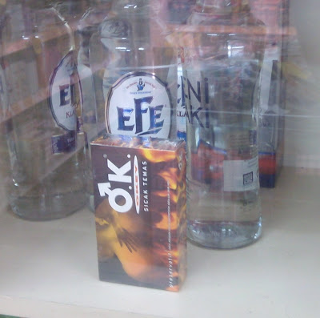

# Hafta 28

Hadi Uluengin

KARA Kuvvetleri Komutanı Orgeneral İlker Başbuğ [..] yaptığı konuşmada
moderniteyi kısaca, "akıl ve bilimi kabul eden toplumsal kurallar,
düzenlemeler ve kurumlara öncelik veren dünya görüşüdür" diye
tanımladı. Ve, yukarıdakiyle çelişen postmodern eğilimlere karşı da o
moderniteyi sahiplendi. Ben de aynısını sahipleniyorum! [..] nasıl ki
"ulus devlet-laik devlet-üniter devlet" eksenli hedef ve kimlikte
Başbuğ'la uyuşuyorum, onun modernist ufkuyla da buluşuyorum. [..]
zaten sütûnunun adı dahi "Modern Zamanlar" olan birisinden farklı şey
beklenemez. [..] ANCAĞI şu ki, "öz" ve "hedef" ne denli ortak olursa
olsun [..] "biçim"le de, "yöntem"le de, "araç"la da, "usûl"le de
çelişiyorum.

Fena yakalandin

Sen bosuna "temelde ayniyiz usulde farkliyiz" zirvalariyla nefesini
tuketme.

O, mamasinin hangi -ite'den nasil gelecegini senden iyi biliyor. Senin
esas dusunmen gereken niye askeriye ile ayni kategori altinda
oldugundur. Akil ve bilimi kabul etmek icin modernist olmak
gerekmiyor; zaten askeriye mevcut burokratik konumunu muhafaza etmek
icin ulus-devlet, modernite savunuculugunu yapmakta.

Mevcut haliyle TSK, modernist pisligin tamamini temsil eden koca bir
ornek haline gelmistir. Nedir bu temsil edilen ogeler? Merkezilesme,
konsantrasyon, senkronizasyon, standardizasyon, maksimizasyon, tek
alanda calisma. TSK merkezi hiyerarsik bir karar mekanizmasina
sahiptir, gucleri belli bolgelere konsantre eder (karakollarda),
sayisini maksimize etmeyi onemli zanneder. Askerler tek bir alana
odakli (specialized) ve senkronize halde calisirlar, tek bir gorevleri
vardir, onu yapmalari emredilir. Standart uniformalar giyer, standart
doktrinler takip ederler.

Fakat yeni cagin organize olma sekli bundan cok uzaktadir ve
askeriyenin Guneydogu'daki 30 yillik basarisizligi bunu tescil
etmistir. Osmanli yeni uretim seklini iskaladigini ilk kez savas
meydaninda anlamisti. Asirlar sonra durum bundan farkli degildir. Yine
bir uretim sekli iskalaniyor, ve bu gercek, tum ciplakligiyla savas
meydaninda goruluyor.

---

Mumtaz'er Turkone

Başbuğ'un sözleri emeklilik işareti. Üniformayı çıkarttığı zaman çok
fazla ka'le alınmayacağını biliyor. Söyledikleri amatörce, "Askerlik
vatan borcu", "Türk ordusunun belkemiğini Mehmetçik oluşturuyor"
diyor.

Profesyonelleşmenin ordu ile millet arasındaki bağı kopartacağından
şikâyet ediyor. Türkiye'nin asker meselesinin aslında bir bürokrasi
meselesi olduğunu bu sözler gösteriyor. Hiçbir bürokratik kurum
personelinin azaltılmasını istemez. Neden? Çünkü gücü azalır.

Dogru

Ilgili yazilar: Burokrasi, Askerlik, Endustriyel Ideolojilerin Temelleri

---

Bir edebiyat dergisi

[mealen] Ilhan Selcuk'un olumu ile bir Aydinlanmaciyi kaybettik

Daha fazlasini kaybettin

Avrupa'da Aydinlanma evresini Modernite takip etti, bu iki evre
birbirinden farkli iki olustur. Selcuk, Kemalistler, diger saskinlar
hep bu kavramlari birbirinin aynisi zannederler. Aydinlanmanin
temelinde geleneksel kurumlarin sorgulanmasi, ahlaki degerlerin gozden
gecirilmesi, rasyonaliteye ve bilime olan vurgu vardir. Arkasindan
"buharli" ortaya cikinca modern evreye girilmistir.

"Transistorlu" sonrasi daha degisik bir sosyal yapilanma gerekli
olmaktadir, ve bu yapilanma, klasik endustriyel yapilanmadan farkli
olacaktir. Olmasi gerekmektedir.

Ozetle, Selcuk'un vefati ile bir Aydinlamaci, daha onemlisi bir
"modernist" kaybedilmistir.

[1] Kant Aydinlanmayi "insanin kendi zekasini kullanma ozgurlugu" diye
tanimlamistir. Aydinlanma evresini elestirenler "bilimin her seyi
aciklamaya yeterli olmadigi" yorumunu yaparlar, bu yanlistir [2]. O
zamanin bilimi lineer, matematigi belli cercevede kisitli bir
bilimdir. Bugun olasiliksal matematik, simulasyon, oyun teorisi, kaos
kavramlari ile daha farkli hesaplar yapabiliyoruz, ve rasyonalite
sinirlarini, hatta tanimini genisletiyoruz.

[2] Bu kisilerin itirazi aslinda cogunlukla modernitenin standardize
edici, normatifligine karsidir, fakat itiraz adresini sasirmis
(misplaced) bir itirazdir. Aksiyon olarak, farkliliklari dumduz eden
klasik endustriyel cagin ortaya cikardigi sosyal yapidir.

---

Emre Akoz

Meğer bunlar "kızıl" değil sarı sendikacıymış

Oyle olmak zorundalar

---

Cemil Ertem

Güçlerini ulus-devletten alan sendikalar, kendilerine ne ad takarsa
taksın, zaten artık sarı sendikadır.

Dogru

---

Clay Shirky makalesi

Matbaaya giden acılı süreçte o zaman deneme olarak görülen pek çok
çözümün şimdi geriye bakınca dönüm noktası olduğu
anlaşılıyor. Venedikli matbaacı, yayıncı Aldus Manutius, daha ufak
octavo cildini ve italik yazım tipini keşfetti. Bu ufak bir değişiklik
gibi görülmüştü, bir kitabı al, boyunu ufalt. Fakat şimdi geriye
baktığımızda bu icatin kitaplara erişimin demokratize edilmesinde
anahtar bir rolünün olduğunu anlıyoruz. Kitaplar daha ucuz, daha
taşınır, bu sebeple daha istenilir hale gelince tüm yayıncıların
erişebileceği piyasa artmıştı, ve okur yazar olmanın değerini tepelere
fırlatmıştı.

Devrimsel çağlar işte buna benzer. Eski olan, yeni olanın ortaya
çıkmasından daha hızlı bir şekilde parçalanır. Herhangi bir deneyin
önemi o anda anlaşılmaz; Büyük değişimler tıkanır, ufak değişimler
yayılır. Devrimin içinde aktif olanlar bile işlerin nereye gideceğini
bilemez. Tüm taraflar, ana kurumların korunması hakkında hemfikir
olduklarını söylerler, ama eylemleri "anlaşmazlık yok" diyen
tarafların dediklerini anlamsız hale getirir. Luther ve Kilise
yıllarca ne olursa olsun, ortada bir anlaşmazlık (schışm) olmadığını
söyleyip durmuşlardır. Kadim sosyal yapılar bir kere bozulduktan sonra
kolayca tamir edilemezler, yerlerine yeni olan çözümler yeterince
hızlı gelemez, herhangi yeni bir sosyal yapının yerini bulması
onyıllar alabilir.

---

Parag Khanna, Big Think sitesindeki yazisindan

Bir ürünü araştırmadan geliştirmeye götürmenin sadece büyük
şirketlerin yapabileceği iş olduğu söylemi bir peri masalıdır.

Eskiden, tek başına bir kişinin fikrini ürüne çevirmesi için tek
seçeneği, tasarımının oldukça kaba bir prototipini yaratmak ve bu
prototipi büyük bir şirkete göstermekti. Eğer bu kişinin şansı yaver
giderse ve şirket tasarımını beğenirse, o şirket prototipin daha
rafine bir şeklini kendi labaratuarında yaptırır, ve bu da başarılı
olursa tasarımı toptan / kitlesel / seri üretim için kendi
fabrikalarına gönderirdi. Elde ettikleri kardan da tasarımcıya çok
cüzi bir parça verirlerdi.

Bu model artık değişiyor. Tarihte şimdiye kadar görülmemiş bir
değişim, tek bir kişinin tasarımdan başlayıp, tasarımı prototiplemek,
üretmek ve dağıtma işlerinin hepsini kendi başına yaptırabiliyor
olmasıdır. Bu yeni akıma kendi-işini-kendin-yap (do-it-yourself -DIY-)
adı verilmesini sebebi budur.

Mesela iyi bir koltuk tasarınız varsa, bu koltuğu Google Sketchup
üzerinde tasarlayabilirsiniz (bu program Google'ın mükemmel 3 boyutlu
tasarım programıdır, temel versiyonu bedavadır), sonra $950
fiyatındaki 3 boyutlu printer Makerbot aracı ile tasarımı 3 boyutta
basabilirsiniz, bu çıkan prototipi Çin'deki bir fabrikaya
postalarsınız, ve oradan çıkan ürünlerin Amazon üzerinden dağıtımını
yaptırtırsınız.

Wired dergisinin editörü Chris Anderson'a göre DIY üreticiliği bir
sonraki sanayi devrimi olacak. 

---

Joshua E. Keating, Foreign Policy makalesi

Fransiz Devrimi sirasinda rakip taraflar bir toplantida odanin sag ve
sol tarafina oturdugundan beri, "sol" ve "sag" kavramlarinin politik
anlami oldukca sabitti. Dunyanin her yerindeki sol kanat fikirde
olanlar yuksek vergi, buyuk devlet, ve sosyal degisimi savunurken, sag
kanattakiler vergi azaltilmasi, kucuk devlet ve serbest piyasayi
savundular.

Ama isler artik degisti.

[..] Macaristan'in ilk komunizm sonrasi hukumeti harcamalari
arttirmisti. 90'li yillarin basinda harcamalari denetlemek / azaltmak
(austerity) ve ulkenin piyasasini hareketlendirme isi sosyalistlere
kaldi. Diger yandan Polonya'da sosyal demokratlar, toplumda tartisma
yaratan "sok terapi" denilen hizli liberizasyon politikalarinin guclu
taraftariydilar. Her iki ornekte de oy verenler partilerin bu
"ideolojik yalpalamasi" sonucu kendini ihanete ugramis gibi
hissetmedi, aksine bu partileri ust uste odullendirdiler.

Bu sadece Dogu Avrupa'ya has bir durum mu? Bu kesin degil, ama
arastirma sonuclari sag ve sol kavramlarinin artik net bir sekilde
yeterli olamadigini gosteriyor [..].

[1] Sag ve sol kavramlari modernitenin bir parcasidir (baslangic
noktasi olarak 2. dalga toplumunun sekillenmeye basladigi Fransiz
Devrimi olmasi 'manidar'). Bu baglamda sag, sol kavramlarinin
kifayetsizligi aslinda modernitenin cokusu ile paralel bir gidisat
sergiliyor.

---

Mustafa Kemal Şan, Bilgi Toplumu blog'undan

Lyotard, Baudrillard, Jameson, Foucault, Touraine ve Bell gibi modernliğin eleştiricileri, gelişmiş ileri Batı toplumlarındaki modernliğin dönüşüm eşiğinde olduğunu, modernlikten bir kopuşun yaşanmakta olduğunu, yeni bir dönemin ortaya çıktığını savunmaktadırlar. Buna karşın, Habermas, Giddens ve Gellner, iddia edildiği gibi yeni bir dönemden bahsedilemeyeceği, ancak içinde bulunduğumuz dönemin modernliğin ileri bir biçimi olduğu konusunda hemfikirdirler. [..]

Büyük ölçüde kültürel alandan kaynaklanıp gelişen postmodernizm kavramı, gittikçe yaygınlaşıp daha birçok alanı kapsar hale geldi. Yalnızca postmodern resim, mimari, edebiyat ve sinemadan değil, aynı zamanda postmodern felsefe, postmodern politika, postmodern ekonomi, postmodern aile hatta postmodern kişiden söz edildiği görülmektedir. Bu durum sanayi toplumlarının yeni bir nitelendirmeyi hak edecek kapsamlı bir dönüşümden geçtiklerini ima etmektedir. Böylece yalnız postmodern bir kültürden değil, gitgide postmodern olan bir toplumda yaşamakta olduğumuz sorusu ortaya çıkıyor.

Endüstriyel toplumların siyasal-kültürel mantığına şekil veren modernite teorilerinin adeta kitle üretimi düşüncesine uygun olarak savundukları homojen toplum tezlerine, postmodern söylemle karşı çıkılmaktadır. Dolayısıyla modernizmin, her yerde geçerli olabileceği yöndeki büyük boy kuramlar (büyük anlatılar) geçerliliklerini kaybetmeye başlamıştır. Öte yandan modern/endüstriyel toplumlarda homoeconomicusa indirgenen insanın diğer boyutları yeniden keşfedilmeye başlanmıştır. Üretim/yönetim sürecinde insan faktörünün önem kazanması yanısıra toplumsal sorumluluğu da artmıştır.

Postmodernleşme iki düzlemde kendini ortaya koymaktadır. Gücün [gayri merkezilesmesi] ve çatışmaların ekonomik zeminden kopması. Modernitede politik süreç esas olarak sınıfsal ve ulusal nitelikte iken; postmodernitede sınıfsal farklar çözülmekte; ulusüstü organlar ortaya çıkmakta; global kültürel geçişler önem kazanmaktadır. Bir yandan da üretimin fiziksel araçları birikim süreci içindeki önemlerini yitirmekte; mental aktivitenin göstergesi olan bilgi yeni üretici güç olarak öne çıkmaktadır.

Bauman'a göre, postmodern [..] entelektüeller, evrensel hakikat ve akıl konusundaki her hangi bir anlayıştan hareketle topluma mutlak kurallar ve standartlar biçmekten ibaret bir rol oyna[ya]mayacaklarını artık kavramaya başlamışlardır. [..] Entelektüeller daha ılımlı bir rol oynamayı, toplulukların birbirini anlamalarına yardımcı olmak üzere bir gelenek ve görenek yorumcusu rolünü kabul etmeliler. Bu modernist yasa koyucuların yüksek konumundan bir düşüş gibi görününebilirse de, daha gerçekçi olmakla kalmayıp aynı zamanda bireylere ahlaki tercih ve sorumluluğu yeniden teslim etme avantajlarına sahiptir. Bireyler ve toplumlar kendi kaderlerine şekil verme bakımından, modernliğe ilişkin klasik toplum kuramının onlara izin verdiğinden çok daha fazla özgür olup çok daha az [tanimlanir haldedirler].

---

Bir TRT Ayrıntı programına konuk olan Ali Şimşek, CHP'li Sencer
Ayata'nın yeni orta sınıf tanımına katılmadığını belirtti. Yeni orta
sınıf hakkında bir kitap yazmis olan Simsek'in fikirleri hakkında bir
paragraf soyle:

Yeni Orta Sınıf, [..] var olan sınıfların sınırlarını genişletip
daraltan ve en azından sosyolojik ve/veya kültürel açıdan yeni bir
'tür' yaratan, daha doğrusu bu sınıfı genişleten tarihsel süreci
anlamaya ve anlatmaya soyunuyor. Şimşek, bu tarihsel süreci, biri
enformasyon toplumu kavramının öne çıktığı süreç ve diğeri ise esnek
teknolojinin esnek uzmanlaşmayı getirdiği, üretim ilişkilerini
dönüştürdüğü süreç (post-fordist dönem) olmak üzere iki süreci ele
aldığı bir dönemlendirme üzerinden anlatıyor. İlk dönemlendirmede,
değerin ve büyümenin kaynağı olarak 'kuramsal bilgi'nin öne çıktığı
enformasyon toplumunun ortaya çıkışı anlatılıyor. Bu, "bilginin,
mikro-elektroniğin ve bilgisayarların dünyasına 1970 sonrası girmiş,
ama asıl formunu 1980 sonrasında bulmuş, 'Altın Çağı'na ise 1990'larda
ulaşmış" bir toplum. Bu toplumsal dönemlendirmeye benzer ve bunu
tamamlar nitelikte bir diğer dönemlendirme ise, post-fordist döneme
ilişkin. Post-fordizm 1980 sonrası dünyayı tanımlamada kullanılan bir
kavram ve bu kavramın ana vurgusu da üretim ilişkilerindeki dönüşüm.

---

Sofistike Toplumlar Niye Çöker?

Sofistike oldukları için...

Joseph Tainter'in The Collapse of Complex Societies kitabındaki
fikirleri şöyle özetlenebilir. Bir grup insan, sosyal organizasyon ve
çevresel şartlardan ortaya çıkan biraz şans ile artı (sürplus) bir
kaynağa kavuşur. Bu fazlalığı, artığı idare etmek o toplumu daha
sofistike hale getirecektir. Tarım, matematiksel beceriyi
ödüllendirir, tahıl depoları değişik tur inşaat gerektirir, vs. İlk
başta eklenen her tür sofistikasyon daha fazla çıktı sağlayarak
kazancı arttırır. Fakat her geçen gün "azalan getiriler kanununu (law
of diminishing returns)" daha yakınlaştırır, ve bir noktadan sonra
eklenen her katman artı değeri azaltır, ve nihayetinde artı olan
tamamen yokolur. Bu noktada eklenen her idare katmanı artık pür
masraftır.

Tainter'in tezi şudur: Bir toplumun elitleri fazladan bir bürokrasi
katmanı daha, fazladan bir kıyak daha almaya uğraşırken, çevrelerinden
çekip çıkartılabilecek tüm artı değeri yokederler, hatta artı olandan
fazlasını da tüketmiş olurlar.

Ve en büyük problem de işin "daha fazlası" kısmındadır.

Çetrefilleşmiş / sofistike toplumlar çöker, çünkü stres ani geldiğinde
bu toplumlar kendilerini esnekliklerini tamamen kaybetmiş halde
bulurlar [..] Bu tür aşırı çetrefilleşmiş toplumlarda, artık işleri
"biraz daha basitleştirmenin" yolu kalmamıştır. Bütün yapı devasa,
girift, her alt birimin diğerleri ile içiçe (interlocking) geçtiği bir
oluş haline gelmiştir, ve değişim için herhangi bir değişik noktaya
gidebilmenin çaresi yoktur.

Tainter'a göre bu tür toplumların birdenbire parçalanmaları trajedi,
ya da bir hata olarak görülmemelidir. Onun sözlerini kullanırsak,
"getirinin sürekli azaldığı bir ortamda tamamen çöküş en iyi çıkış
noktası olabilir". Zaten makul / orta seviyeli bazı değişimlerin
yapılmesi mümkün olsa bile, bu değişimlere sert bir şekilde direnilir,
çünkü her türlü basitleştirme o toplumun elitlerine rahatsızlık verir.

Clay Shirky

---

Bir markette goruldu.. Urun konumlama (product placement) iste buna
denir.

---

