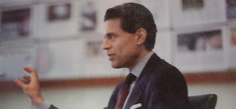

# Hafta 32

Suleyman Yasar

Siyasetçi nasıl halkla inatlaşamazsa, işadamları da ekonomiyle
inatlaşamaz. [..] Peki o zaman niye TÜSİAD referandumda evet demeyerek
bütün bu hukuk dışılıkların sürmesini istiyor?  Çünkü TÜSİAD, Anadolu
sermayesinin sadece İstanbul'un ürettiklerinin "bayisi, acentesi"
olmasına razı oluyor. [..] TÜSİAD, piyasaya, büyük sermayenin
ürünlerinin dışında yeni ürünlerin girmesini istemiyor. Kendisine
rakip mal üreten Anadolu sermayesinin yatırımlarını yok etmek
istiyor. Hatırlanacaktır, Anadolulu pek çok işadamının fabrikası,
İstanbul'un büyüklerine rakip oldukları için devletin gücü
kullanılarak kapatılmıştı. Ama artık TÜSİAD Anadolu'yu
engelleyemiyor. Çünkü siyasiler, TÜSİAD'ın isteklerini artık eskisi
gibi gözü kapalı yerine getirmiyorlar.

Dogru

---

Mehmet Altan

İslam medeniyetinin altın çağını yaşadığı 7. ile 17. yüzyıl arası [..]

Yanlis

İslam medeniyetinin altın çağı, 8. ve 13. yuzyil arasidir.

---

Bir Kemalist

AKP oy almak icin komur dagitiyor

Bize has degil

Oy karsiligi para, projeleri bir bolgeye, o bolgenin temsilcisine
vermek, ABD'de "pork barrel spending" deyimiyle biliniyor. Bir meclis
uyesinin herhangi bir kanunda desteginin alinabilmesi icin bazen bu
tur "sekerlemelerin" o kanuna dahil edilmesi Washington'da anormal bir
olay olarak gorulmez. Gecende vefat eden Senator Robert Byrd mesela,
bu isi o kadar iyi yapiyordu ki, adi "king of pork"'a
cikmisti. Byrd'un eyaletine yonlendirdigi harcamalarin 1 milyar dolari
astigi soylenmektedir.

Tabii bu tur sekerlemelerin halka direk verilmesi bazilarina itici
geliyor olabilir, zaten ABD'deki pork barrel soylemi de genelde itici
bir cercevede telafuz edilir. Fakat onemli nokta, demokratik sistem
icinde bunlarin imkansiz, inanilmaz seyler olmadigidir -- hatta
kimilerine gore yapilan demokrasinin ana islevlerindendir.

Yani bunlarin hepsi kendi basina tartisilabilir, fakat su veriliyor,
bu veriliyor, bunlar baska hicbir yerde olmuyor, "bize has" soylemi
kesinlikle dogru bir soylem degil.

---

Fareed Zakaria

Petrol sizintisina cevabimiz bir rezaletti, burada biz derken
ulkemizden degil, medyanin cevabindan bahsediyorum. Dunyanin en buyuk
felaketlerinden biri olurken medyadaki yorumcular "Obama'nin
televizyonda duygu gosterisi yapmasini" soyluyorlardi. [..] New York
Times kose yazarlari Obama'yi "kizgin" gormek istediklerini
soylediler, [film yapimcisi] Spike Lee Obama'nin "kufur edip, etrafina
saydirmaya baslamasini" istedi, Demokrat James Carville baskani
"tepesi atmis" halde gormek istedigini belirtti. [..]Biz aklimizi mi
yitirdik? Onumuzde muthis muhendislik zorluklari var: deligi tikamak,
petrolu sudan ayirmak, korfezi eski haline getirmek. Ama yok, biz
teknik elemanlara danismayi falan bosverelim. Oyle seyleri inek
cocuklar yapar. Biz savas boyalarini surelim, ve birilerinin guzelce
tozunu alalim.

Aferim len

Arada sirada kafan calisiyor Ferit. Yanliz Newsweek Enternasyonel'de
gecende bir resmini gordum, boyle artiz pozlar verilmis... Acaip birel hareketi.. Bu ne hareket boyle.. Indir o elini! Indir!:)

---

Aykırı

Su Newsweek Turkiye yazisinda "civil engineer (insaat muhendisi)"
kelimeleri niye "toplum muhendisi" diye tercume edilmis?

Cakallik seziyorum

Civil engineer kelimesinden toplum muhendisine gecis yapmak zor
istir.. Bunun icin ugrasmak gerekir. Acaba dergi sahibinin insaat
isinde olmasindan dolayi mi boyle bir gecis yapildi? Ferit Zekeriya:
uyuyor musunuz?  Bakin adaminiz bile bile YALAN YAZIYOR. Birilerinin
kulagini cekin.[alttakiler birlestirme]

Refik Erduran

Cennet gibi bir ortamın sefasını sürerken "Ah, şimdi falan yerde olmak
vardı" diye sızıldanır ya da başka zaman dilimlerinde yaşamaya
özeniriz. Bu ikincisi en çok yaşlıların "Eskiden falan şey şöyle
iyiydi, böyle güzeldi" sözleriyle başlayan nostalji kıtırları
biçiminde gelir gündeme.

Bize has degil

Yazinin geri kalaninda bakilinca tarif edilen durum Turkiyelilere has
bir durummus anlami cikiyor. Bu dogru degildir. Eskiye olan romantik
bir dingillik diger milletlerde de mevcuttur. Fikra soyledir: Bir
ampulu takmak icin kac Ingiliz gerekir?  Cevap 5 tane. Biri ampulu
takar, diger dordu eskisini nasil daha iyi oldugu hakkinda
yakinir.

Turkiye'de gecmise verilen kultur kodu GUZEL GUNLER (dilimizde okkali
bir kufrun "gecmisini s.keyim" olmasi raslanti olmasa gerek).Kodlar
bir tarafa, gecmis tabii ki bugunde kullanilabilirlik acisindan,
dogrular ve yanlislar ile doludur, muhakkak bazi kulturler
digerlerinden daha sansizdir ve Turkiye Osmanli / Roma mirasi
sebebiyle nispeten sansizlar kolonundadir. Ama Avrupa'ya olan cografi
yakinlik, kultur geciskenligi, adapte olabilme ozellikleri, yani
kodlarin bugune gore "iyi" olan taraflari isleri kurtariyor. Bu dogru
kodlar evrimsel bir surecte odullenip yeni nesillere
tasinacaklar.

Cengiz Han[Savasta Selcuklu Turklerinin kafasini kirarken]

Beni gunahlarinizin cezasini vermem icin Allah gonderdi.

Belki

Isin Allah kismi kesin degil muhakkak, fakat Han'in bir seylerin
cezasi oldugu kesin. Tarihciler, sosyologlar; Cengiz Han'in isgal
ettigi ulkelerin yonetiminde despotlugun artmasinda bir korelasyon var
mi, yok mu, bir arastirin (bir ise yarayin); Beyaz Ruslar, Turkler,
Araplar bu isgale maruz olmustur. Asyali erkeklerin yuzde onunun
Cengiz Han'in soyundan geldigini burada belirtirim ve saygilar
sunarim. Bunun anlami hakkinda biraz "beyin firtinasi" yapin
bakalim.

Bir akademisyen

Gecmiste olmayan milletler bugun olamazlar

Yanlis

Bugun olanlar bir sekilde gecmiste nasilsa olmustur. Bu olusun "ne
kadar guzel" oldugu hakkinda trasa gerek yoktur.

Carl von Clausewitz

Savasta rakibinizin agirlik merkezini (schwerpunkt) bulun.

Sen artik eskidin

Modernist tipler ne zaman stratejiden yarim yamalak caktiklarini
ispatlamaya ugrassalar, Clausewitz'den birkac kelime
patlatirlar. Clausewitz modern ordular, endustriyel cag icin gecerli
bir askeri stratejisyendi, klasik endustriyel cagin bitmesi ile
bilgeligini kaybetti. Ustte bahsedilen agirlik merkezi dusmanin "onu
farkli / ustun yapan" avantajindan bahseder, yani, karsindaki sanki
bir fabrikadir, efendim bu fabrikada, montaj hattinda oyle bir vidayi
bul ki, onu gevsetince tum hat dursun.Ya da soguk savastaki "durdurma
problemi (halting problem); Sovyet ordusu Avrupaya dogru ilerliyor,
nasil durduracaksin? Hemen Clausewitz'e bakilir, standart cevap, X
kadar askeri olunce Sovyet doktrini durmayi emreder, o zaman, X kadar
asker oldur. Bombalari (kitlesel bir sekilde) indir asagi. Bombalar
"aptal bomba" tabii ki.Bugune gelelim. Artik "etki temelli savasma
(effects based fighting) gibi kavramlar var. Ek olarak dusman
gayri-nizami savasiyor (3. dalga yontemleri, merkezsiz, asenkron),
halkin icine karisiyor, ya da halkin ta kendisi. Bul bakalim agirlik
merkezini. Eski ezberleri biraz guncellemek gerekiyor galiba. Ne
dersiniz?---[1] Medyamizda "Oyun Teorisine gore Nash Dengesi futbol
macinda beraberliktir" diyebilen parlak zekalar da cikabilmistir
nihayetinde. Burada problem bilmek, bilmemek degil, ne bilmedigini
bilmemek.

Bir yazar

Askeriyenin problemi uyguladigi egitimde.

Dogru

Askeriyenin problemi "Modernist-Kamalist" egitim sistemini uyguluyor olmasidir. Bu mentalite geri bir mentalitedir.

Bir Kemalist

Istanbul'a her yerden insan akin etti, sehir batti.

Yeni gelenlere hep kotu gozle bakilir

Bir sehirdeki eskilerin yeni gelenlere kotu gozle bakmasi Turkiye'ye has bir durum degil (pek cok kez ornegini gordugumuz uzere, biz bize benzemiyoruz).

Ilgili yazi: Sehir Tercihi

Refik Erduran

Insanlar gazete okumuyorlar

Normal

21. yuzyil icin uygun kalitede, detayda bilgi, haber, yorum ne yazik ki gazetelerden elde edilemiyor.

Ilgili yazilar: Edge, Ucuncu Kultur

Cetin Altan

Toplumda gazete okunmasi gelismislik gostergesi

Yanlis

Artik Internet temelli pek cok alternatif haber kaynagi var.

---

80MGK+

12 Eylul darbesinin Turkiye'ye dayattigi sentez 80 model MGK sentezi olarak adlandirilabilecek Turkculuk, Islamcilik, Osmanlicilik ve (modernist) Baticilik karisimidir. Bir kisim medya ve uzantilari yillarca bu sentezi islediler (mesela Turkiye Turklerindir gazetesi).

Simdi, Haber"Turk" bu sentezin degisik bir versiyonunu isleme koymus gozukuyor. Onlarinki yine Turkculuk, Islamcilik, Osmanlicilik ve (modernist) Baticilik, arti Turban.

Bu yeni senteze 80MGK+ adi verilebilir.

Sentez nasil icra ediliyor? Boru sesli acaip bir adama "tarih fetisizmi" yaptiriyorsun, Osmanlicilik isliyor (daha cok boguruyor, ne soyledigi bile dogru durust anlasilmiyor). Ciplak kari resimleri ve sig bir magazincilik ile Baticilik yapmis oluyorsun, sonra brekisefal kafali bir adamin yaninda turbanli bir bayan cikarinca da Turkculuk, Turban ogelerini de halletmis oluyorsun.

Bunlar bos ugrasilar. Modernite sonrasi toplumlarda "standart" bir "sentez" isleyemezsiniz. Elinizde patlayacaktir. Zaten "kitlesel" iletisim kanallari giderek etkilerini kaybetmeye baslamistir, herhangi bir sentez isleyecek etki alaniniz surekli daraliyor.

Tavsiyemiz: Bosuna pedal cevirmeyin..

Not: Turban ozgurlugunun medyada daha fazla gorulmesi kotu degil... Sadece islenmeye ugrasilan sentezin tamami eskisinden cok farkli degil.

---

Wired makalesi

[Pazarlama analizcisi] Nielsen sirketine gore 2007'da gorulen bir tepe
noktasindan sonra, cep telefonumuzdan yaptigimiz ortalama telefon
konusma sayisi her yil dusmeye, ve ayni anda da, bu konusmalarin
suresi azalmaya basladi [..] Yani cok ilginc bir kulturel gecisi
gozlemliyoruz: telefon konusmasi kavraminin yokolmasi. Bu degisim
ozellikle gencler arasinda daha belirgin. Tanidigim bazi universite
ogrencileri akilli telefonlarini konusmak icin kullanmadan gunler
gecirebiliyorlar. Gecende takildigim 20 yaslarindaki bir girisimci,
kendi telefonunda birini arama komutunu bulmak icin 30 saniye
telefonunu evirip cevirdi.

Yeni nesil telefon aramasi yapmiyor, cunku birbirleriyle diger
yontemler uzerinden "hafif ama surekli" bir iletisim icerisindeler
zaten: text mesaj gondermek, chat yapmak, sosyal aglarda
mesajlasmak.. Bu secenekler eskisine gore sayica daha fazla olmak
yaninda, daha da iyi secenekler. Yeni alternatif iletisim yontemleri
ses bazli klasik iletisimin kotu tasarlanmis bir sistem oldugunu
ortaya cikardi. Telefon konusmasi olmeyi hakediyor.

[1] Telefonda ses bazli iletisim "senkronize" bir iletisim
yontemi. Konusan iki tarafin ayni anda, eszamanli olarak telefon
basinda olmasini gerektiren yontemler (kiyasla bir email bu
kisitlanaya tabi degil). Ses bazli senkron iletisimin oneminin
azalmasi teoriye uygundur. Moderniteye bir darbe daha inmistir.

Ilgili yazi: Endustriyel Ideolojilerin Temelleri: Senkronizasyon

---

Newscientist makalesi

Aynen evrimciler gibi, yaratılış bilimciler de hayvanlar arasındaki ilişkileri onların morfolojisine (fiziksel karakteristikleri) ve moleküllerine bakarak tartarlar. Jeolojik zaman çizgisine ve tüm yaşam biçimlerinin aynı yerden geldiğine şüpheyle bakmaya devam ediyorlar, ama yaratılışçı bilimcilerin çoğu, doğal seleksiyon ve faydalı mutasyonlar gibi diğer evrimsel kavramları kabul etmekte. Yaratılışçıların farkı değişik "tip" organizmaların - "baraminlerin" - 6000 yıl önce ayrı bir şekilde yaratıldığını öne sürmeleri.. Bir baramın içinde farklılaşmanın olduğunu kabul ediyorlar, ve hangi canlının hangi baramine ait olduğuna karar vermek için değişik yöntemleri var; bunu yaratıklar arasında morfoloji, genetiksel, molekül yapısında boşluklar / büyük farklılıklar bularak tartmaya uğraşıyorlar.

Ben [röportaj yapılan bilimci Phil Senter] yaratılışçı bilimcilerin baraminler arasındaki farklılıkları göstermek için kendilerinin de kullandığı klasik çok boyutlu ölçekleme (claşsiç multidimensional scaling) tekniğiyle bilinen ilk kuş türü [..] ile dinazorların [..] arasında büyük farklar olmadığını gösterdim. Yaratılış bilimcileri bu türlerin farklı şekilde yaratıldığını zannediyorlardı. Yani onların en favori tekniğini kullanarak onların farklı zannettiği iki turun çıkışının aynı olduğunu göstermiş oldum [..]

Evrimi, yaratılış bilimcilerin karşı çıkamayacağı şekilde ispat etmek önemli. Bunu yapmanın yöntemlerinden biri, yaratılış bilimin kendisini kullanarak evrimsel prensipleri onlara anlatmak.

Ilgili yazi: Salak Tasarim

---

Ilginc..

---

Bir "reality show" olan The Colony (Koloni) dunya capinda bir felaket
sonrasi nasil yasanabilecegi, neler olabilecegini gostermeyi
amacliyor. Ilk sezon Los Angeles sehrinde gecti; dizinin yapimcilari
bir alani kapatarak, orada felaket sonrasi bir dunyayi
hazirladilar. Bu ortama birakilan kisiler degisik becerilere sahipler;
elektronik, bilgisayar uzmani, mekanikci, eski asker, vs. gibi tipler
var. Bunlar beraber calisip, hayatta kalmaya ugrasiyorlar. Dizi
ogretici; su nasil dezenfekte edilir, enerji nasil uretilir
(1. sezonda pek cok ilginc yontem gorduk) gibi pek cok hayatta kalma
yeteneklerini gozlemlemek mumkun. Boyle bir senaryoyu isletmek nereden
akla gelmis? Katrina sonrasi New Orleans'da gorulenler, teror
saldirilari, kuresel isinma, ve genel baglamda dunyanin "tipasi
cikmis" goruntusu boyle bir dizi icin yeterli motivasyon herhalde. Bol
bol inovasyon var. Tavsiye ediyoruz.

---

Bianet haberi

TÜİK, 2009'da bir önceki yıla göre gazete ve dergilerin tirajı azalırken çalışan sayısının arttığını açıkladı. [..] Bir önceki yıla oranla gazete ve dergilerin tirajı yüzde 15 azaldı. TÜİK'e göre gazete ve dergilerin tirajı düşerken çalışan sayısı yüzde 10 arttı.

Ilgili yazilar: Gazeteler ve Dusunulemezi Dusunmek, Bırakın Batsınlar

---

Newscientist makalesi

Beyinlerimizin evrim geçirdiği çok açık, fakat bu evrimin esas mekanizması / ittirici temeli [..] teknolojinin varlığıydı. Biz [insanlar] hiçbir zaman pür biyolojik yapılar olmadık. Biz eskiden de şu anda da hep bir tür "yapay maymun" olduk [..]

Arkeolojik kazılar yontma taş araçlarının 2.5 milyon seneden yaşlı olduğunu gösteriyor [..] Elimizdeki en eski [insan sapiens'in içinde olduğu kategori] Homo canlısının fosil kalıntıları ise 2.2 milyon yıllık. Bu, arada 300,000 yıllık bir boşluk olduğu anlamına geliyor, ki bu rakam tüm Homo sapiens türünün dünya üzerinde olduğu süreden daha fazla. Demek ki ilk [sapiens olmayan] hominin türleri taş araçlarını icat edebilmişler [..].

Teknoloji sayesinde biyolojik eksiklerimiz çoğalıyor / onları biriktirebiliyoruz. Mesela keskin tırnaklarımızı kaybettik çünkü kesme araçlarını keşfettik, ya da artık büyük bir çene yapısına sahip değiliz çünkü taş bazlı araçlarımız vardı. Tüm bunlar temel saldırganlığımızı da azalttı [..] ve kadın ve erkek cinslerimiz arasındaki farkları azalttı. Biyolojik eksikleri toparlamaya devam ediyoruz. Modern insanın göz keskinliği / görme kapasitesi ortalama olarak 10,000 sene önceki insandan daha kötü.

Son 30,000 senedir beyin büyüklüğü azalıyor ve bu trend devam ediyor. Bunun sebebi [gereksiz] zihni işleri outsource edebiliyor olmamızdır. Aklımda bir Neanderthal kadar fazla şey tutmama gerek yok, çünkü benim bilgisayarım var. Muhafazası pahalı ve tehlikeli olabilecek biyolojik özellikleri tutmaya mecbur değilim.

---

Baskan Eisenhower'in 1961 yılındaki veda konusması

Bugün, büyük ülkelerin katıldığı tam dört savaşın yaşanmış olduğu bir
yüzyılın ortasından 10 sene uzaktayız. Yüzyılın dört büyük savaşının
üçünde ülkemiz vardı. Bu büyük, kıyıcı savaşlara rağmen ülkemiz bugün
dünyanın en güçlü, en çok nüfuza sahip ve en üretken ülkesi haline
gelmiştir. Bu pozisyonumuzdan halkı olarak gurur duymamız bir yana,
esas anlamamız gereken, Amerika'nın liderliğinin ve prestijinin sadece
materyel ilerleme, askeri güç ve zenginlik ile alakalı
olmadığıdır. Liderliğimiz ve prestijimiz gücümüzü dünya barışı ve
insan hayatının ilerlemesi yönünde nasıl kullandığımız ile alakalı
olacaktır [..]

Bugün sahip olduğumuz askeri organizasyon benden önce başkanların
barış zamanı yönettiklerinden, hatta II. Cihan, Kore Harbi sırasında
sahip olduğumuz organizasyonlardan tamamen farklı bir şekle girmiştir.

Son katıldığımız savaşlar haricinde, öncesinde ABD'nin silah
endüstrisi yoktu. Önceleri çiftçiler için şaban demiri üretenler yeri
geldiğinde kılıç üretmeye başlıyordu. Sonunda güvenlik ihtiyaçlarımız
acil durum silah üretiminin başa çıkamayacağı bir hale erişti; bu
sebeple dehşet boyutlarda ve kalıcı bir silah endüstrisi yarattık. Tüm
bunların üstüne savunma endüstrisi ile yaklaşık 3.5 milyon insanın bir
şekilde bağlantılı olduğunu düşünün. Her sene savunmaya harcadığımız
para tüm Amerikan holdinglerinin kazancının toplamını aşmış
durumdadır.

Kalıcı bir askeri örgütlenmesi ile büyük bir silah endüstrisinin
evliliği / kesişmesi Amerika için yeni bir kavramdır. Bu birlikteliğin
ekonomik, politik hatta ruhani eksenlerdeki etkileri tüm Amerikan
şehirlerinde, her eyalet, her devlet kurumunda hissedilmektedir. Bu
gelişmenin oluş sebeplerini biliyoruz; fakat mevcudiyetinin son derece
ciddi sonuçlarını da düşünmek zorundayız. Kaynaklarımız, emeğimiz,
hayatımız ve sosyal hayatımızın yapısını ilgilendiren gelişmeler var.

Militer endüstriyel kompleksin devlet yönetiminde gereğinden fazla
etki sahibi olmasına engel olmalıyız. Gücün bu odak tarafından yanlış
bir şekilde elde edilmesi ve kullanılma potansiyeli vardır ve bu
potansiyelin mevcudiyeti kalıcı olacaktır.

---

Newscientist makalesi

Bir zamanlar pek çok açıdan insanlığı özel zannederdik. Artık daha iyi
biliyoruz. Biz hisleri olan, başkaları ile empati kurabilen, ahlaki
bir sistem takip edebilen dünyadaki tek canlı değiliz. Şahsiyeti olan,
kültüre sahip, tasarı yapabilen, araç kullanabilen tek yaratık ta
değiliz. Buna rağmen, 'sadece bizim' diye bildiğimiz en son bir
beceriye de hala sımsıkı sarılmaya devam ediyorduk: konuşarak
anlaşabilme yeteneği.

Gelin görün ki, bu beceride özel olmadığımız da ortaya çıktı. Evrimsel
olarak dilin gelişmesine bakışımızda konuşarak anlaşmanın tanımlanması
anahtar rol oynuyor. Bir ana yapıya sahip, ayrıksal, tekil bir oluş
olarak görülen dil, artık pek çok ayrı becerinin bir birleşimi olarak
görülmekte. Bu şekilde görülürse dili oluşturan bölümlerin [..] diğer
canlılara kıyasla özel olmadıkları ortaya çıktı.

---

Referandum

---

Techcrunch haberi

[..] Bill Gates'e gore gençlerin eğitim almak için üniversitelere
gitmesi yakında son bulacak [..]. Techonomy konferansında Gates "5
sene sonra dünyanın en iyi derslerini bedava olarak Web'den
indirebileceksiniz [1]" yorumunu yaptı ve "bu kaynaklar[ın toplamının]
herhangi tek bir üniversiteden çok daha kaliteli olacağını" ekledi.

Gates'e göre bilgini nereden alırsan al, bu bilginin kreditasyonu
(sertifikasyonu) bir şekilde yapılabilmeli [..]

Eğitim kurumları, K12 seviyesinde hala önemli, özellikle charter
okullarını övülmeye değer, bu okullarda çocuklar zamanlarının yüzde
80'nini derin bir şekilde öğrenmekle geçirebiliyorlar.

Fakat üniversite, daha az "lokasyon / yer odaklı" olmalı [..]

Gates'in genel vurgusu şöyle özetlenebilir: En üst seviye, en kaliteli
eğitimi veren okulların fiyatları fahiş seviyelerde ve bu okullara
girmek aşırı derecede zor. Ve [öğrenim açısından] yakında "yer
temelli" üniversite eğitimi bugün olduğunun beşte biri kadar önemli
olacak.

Eğitimdeki bir diğer problem, ders kitapları. İlköğretim seviyesinde
bile bir matematik kitabı 300 sayfa olabiliyor. Bunlar koca, korkutucu
kitaplar. Bu kitaplara bakınca insan düşünmeden edemiyor: "bu kitabın
içine neler doldurmuşlar böyle?". Gates'e göre Amerika'daki kitaplar
Asya'daki karşılıklarından üç kat daha büyük. Fakat Asya eğitimde pek
çok açıdan Amerikayı solladı. Problem bu koca kitapların komite usulü
tasarlanmış olması, bu sebeple mevcut olanın üstüne [aynı konular]
sürekli eklenip duruyor.

Gates eğitimi tekrar kontrol altına almanın ve genişletmenin tek
çaresinin daha fazla teknoloji kullanmak olduğunu söyledi.

[1] Bu trend MIT OCW projesi ile başladı bile. MİT pek çok değerli
hocasının derslerini video'ları, ders notları ile beraber İnternet'ten
paylaşıyor. Diğer ünlü okullar benzer atılımlar yaptılar. Zaten ders
notlarını neredeyse her mühendislik / temel bilimde ders verenler PDF
olarak bir siteden paslaşıyorlar. Hakikaten de şu anda bile,
uğraşanlar en kaliteli olan materyelleri birleştirerek tek bir okuldan
alınabileceğinden daha iyi bir materyele sahip olabilir.

[2] En iyilerin verdiği eğitimine herkesin erişebilmesi niye önemli?
Çünkü artık toplumdaki çoğunluğun üretim sürecine zihinsel seviyede
dahil olması gerekiyor, modern dünyada olduğu gibi "ufak bir elit
düşünür tabakası" bugünün ekonomisi için yeterli değil.

---

Stephanie Rosenblum yazisi

İki yatak odalı apartman dairesi. İki araba. İki düzine insana yemek
servisi yapmaya yetecek kadar porselen eşya... Tüm bunlara rağmen
Tammy Strobel mutlu değildi. Davis ilçesinde bir yatırım şirketinde
proje idarecisi olarak çalışıyor ve [yılda] $40,000 kazanıyordu; kendi
tabiriyle "kazan-harca kosma bantına" yakalanmıştı.

Ve bir gün o banttan aşağı indi.

Daha basit yaşamak hakkında okuduğu kitaplar ve blog yazılarından
aldığı ilham ile ikisi de 31 yaşında olan Bayan Strobel ve kocası
Logan Smith eşyalarını birer birer bir yardım vakfına
bağışladılar. Her geçen ay sahip oldukları ayakkabılar, kazaklar,
kitaplar, tabaklar, tencereler kapı dışarı edildi, bir sürelik deneme
ayrılığından sonra, televizyonlarını bile bir dolapa koyup ortadan
kaldırmaya karar verdiler. En sonunda arabalarından da kurtuldular.

Sadece 100 tane eşya ile yaşamayı salık veren bir Web sitesinden daha
da cesaret alan Bayan Strobel sahip olduğu tüm giyecek, makyaj,
vs. aletlerinin toplam sayısını tamı tamına o rakama indirdi.

Annesi ona deli olduğunu söylüyordu.

Bugün, Strobel ve Smith "küçültme operasyonuna" başladıklarından 3
sene sonra Portland Oregon'da mütevazı 400 foot^2 büyüklüğünde büyükçe
bir mutfağı olan bir stüdyo evde kalıyorlar. Smith fiziyoloji
doktorasını tamamlıyor, Strobel evinde çalışıyor, Web tasarımcılığı ve
freelance olarak yazarlık yapıyor. 4 tane tabağı, 3 çift ayakkabısı, 2
tane tenceresi var. Smith'in şu anda doktorasının son 2 ayı, ve
Strobel'in $24,000'lik maaşı tüm faturalarını ödemeye
yetiyor. Arabaları yok, ama 2 tane bisikletleri var. Sahip olmadıkları
başka bir şey daha var:

$30,000'lik borç.

Strobel'in annesi bundan çok etkilendi. Artık çiftin turistik
seyahatlar ya da yeğenlerinin eğitim fonuna yardım yapmak için
paraları var. Borçları tamamen ödenmiş olduğu için Strobel'in daha
kısa süreli çalışması mümkün, böylece dışarıda, doğada olmak için, ya
da hayır / sivil toplum gruplarına zamanını vermek için daha fazla
vakti oluyor [..]

"Hayatta mutlu olmak için daha fazla büyüklük fikri yanlış"
diyor. "Materyel şeylere sahip olmanın mutluluk getirmeyeceğine
gerçekten inanıyorum".

Ekonomik krizden önce Strobel ve kocası harcama alışkanlıklarını
tamamen değiştirirken, büyük bir tüketici grubu da benzer bir şeyi
kriz sonrası yapmak zorunda kaldı. Bu değişim ülkenin harcama
kalıplarında büyük bir değişikliğe yol açıyor.

NPD Grubu parakende araştırma ve danışmanlık bölümünde analist olan
Marshal Cohen "istediğim için / anında alırım (conspicuous
consumption) tavrından hesaplı alım evresine geçiyoruz" diyor [..]

Tüketim konusunda yapılan bazı araştırmaların gösterdiği üzere,
insanlar paralarını tecrübeler (experiences [1]) için harcayınca
materyel objeleri almak için harcadıklarından daha mutlu oluyorlar
[..] Komşularını harcama yarışında geçmeyi (outdo Joneses [2])
bırakmak, hayatlarını daha mutlu hale getiriyor [..]

Araştırmalar, servis sektöründe ve dinlenme (leisure) için yapılan
harcamaların materyel objelerin alınmasına kıyasla sosyal bağları daha
fazla kuvvetlendirdiğini, ve bu durumun, mutluluğun artmasına olumlu
bir etki yarattığını gösteriyor.

[1] Mesela bir konsere gitmek, turistik gezi yapmak bu tür
"tecrübelerin" bir örneği.

[2] "Komşuyu eşya alım yarışında geçmek" Amerika'da "Jones ailesini
geçmek" deyimi ile biliniyor. 2009 yılında tam da bu konuyu işleyen
bir filmin "The Joneses (Jones Ailesi) [imdb]" olarak çıkmış olması bu
espriyi yansıtıyor. Başrolde David Duchovny, Demi Moore oynadı. Güzel
film, tavsiye ediyoruz.

---

Alan Murray, WSJ Online makalesi

İş dünyası gürüsü Peter Drucker yöneticiliği "20. yüzyılın en önemli
buluşu" olarak betimlemişti [..] Peki bu buluş 21. yüzyılda ne kadar
geçerli olacak? Bulgulara bakılırsa cevap herhalde "Hayır".

"Modern" yönetim anlayışı artık yokolma evresine girdi.

Büyük şirketler (corporations) kendilerini ne kadar "serbest piyasanın
en ateşli destekçileri" olarak sunsalar da, aslında onlar serbest
piyasayı by-pass etmek için yaratılmışlardı. Bu yapılar, ülke çapında
telefon servisi sağlayabilmek, bir arabayı [seri şekilde] üretmek gibi
büyük ve kompleks işleri organize etme amacıyla, değişik yerlerde ve
beceride binlerce insanı koordine etmek için ortaya çıkarılmışlardı.

Nispeten daha basit 1776 dünyasında yaşayan Adam Smith, ünlü klasiği
Wealth of Nations kitabını yazdığında insanların hayatını ikame etmek
amacıyla birbirlerine kontrakt usülü servis sağlamasının, ekonomik
gelişmeyi sağlamaya yeteceğini öne sürmekteydi. Fakat 100 sene sonra
ortaya çıkan Sanayi Devrimi Smith'in vizyonunu antika / garip bir
duruma düşürmüştür. Endüstriyel dünyada insanları organize, kaynakları
yönlendirmek daha çetrefil bir sistem gerekiyordu [1].

Sonuç olarak endüstriyel çağın merkezi sorununa cevap olarak, idare
edilen büyük şirket (managed corporation) kavramı ortaya çıktı. Takip
eden 100 sene içinde bu büyük şirketler cevaplamak için kuruldukları
probleme iyi bir çözüm sağladılar [..]

Fakat son zamanlarda en büyük idarecilik başarıları büyük şirketlerin
değil, bu mega yapılara karsi elde edilen başarılar olmuştur. General
Electric şirketinden Jack Welsch büyük şirket inşa edici ünlü neslin
belki de en son üyesiydi. Ama Jack Welsch bile şöhretini şirket
bürokrasilerine karşı açtığı savaşa borçluydu. Geçtiğimiz onyılların
diğer idareci guruları da kemikleşmiş büyük şirket kültürüne
saldırmak, hiyerarşileri by-pass etmek, büyük şirket yapılarını
dinamitlemek, ve genel anlamda devrimsel taktikler kullanarak bir fili
dansettirme uğraşmaları üzerinden isim yaptılar.

Tüm bu olanların sebebi gayet basitti aslında: Büyük şirketler bir
bürokrasidir ve idareciler bürokrattır. Bürokrasilerin temel dürtüsü
kendilerini büyütmektir. Üstüne üstlük onlar, eşyanın tabiatı
gerektirdiği üzere, değişime direnç göstermeye
ayarlanmışlardır. Onların varoluş amacı ve görevi, aslında, serbest
piyasayı güçlendirmek değil, katakulli ile onun yerine geçmek, hatta
ona direnç göstermektir.

Fakat günümüz dünyasının kasırga gibi esen piyasa güçleri -- hızlı
küreselleşme, hızlanan inovasyon, ve aman vermez rekabet -- ekonomist
Joseph Schumpeter'in "yaratıcı yıkım güçleri" adı verdiği oluşu
güçlendirmeye başladı [2]. Geçmişi onyıllar öncesine dayanan Lehman
Brothers ve Bear Sterns bir gece içinde yokolurken, Google ve Twitter
gibileri birdenbire ortaya çıkıverebilmektedir. İnternet'te gezinen
popüler bir video bu trendlerin geometrik şekilde büyüme meyilini
ortaya seriyor. Radyo 38 sene, televizyon 13 sene sonra 50 milyon
kişiye erişirken, İnternet'in aynı kitleye erişmesi için 4 sene, iPod
ve Facebook için 2 sene yeterli oldu [..]

En iyi idare edilen şirketler bile nefes kesen değişim ve büyük şirket
yavaşlığı arasındaki bu parçalıyıcı çarpışmadan kendilerini
koruyamıyorlar. [Ünlü bazı CEO'lara] onları en çok etkileyen kitabın
ne olduğu sorulduğunda cevap olarak Clayton Christensen'in
İnovasyoncunun İkilemi kitabı zikrediliyor. Bu kitap, detaylı bir
şekilde bir zamanlar piyasaya liderlik yapan şirketlerin nasıl olup ta
büyük sektörel değişimleri ardı ardına kaçırdığını belgelemesiyle
ünlü. Bilgisayarlar (mainframe yapısından PC yapısına geçiş), telefon
(sabit hattan mobile), fotoğrafçılık (filmden dijitale), borsa
(fiziksel alışverişten -floor- online ortama) olan geçiş "kötü
yönetim" yüzünden kaçırılmadı, aksine, treni kaçıran şirketler mevcut
yapılarına göre "iyi yönetim anlayışını" takip
ediyorlardı. Müşterilerini çok iyi dinlediler [3]. Piyasa trendlerini
çok iyi takip ettiler. Sermayeyi en çok getiri sağlayacak alanlara
yönlendirdiler. Ve tüm bunları yaparken çok daha büyük getiri
sağlayabilecek oyun bozucu inovasyonları, daha az yatırım ile herkese
çekici gelebilecek piyasaları kaçırdılar.

Hızlanan değişim karşısında çözüm geliştirmekte zayıf kalan büyük
şirketlerin yaşadıkları aslında problemin sadece bir yarısı. Problemin
diğer yarısı, büyük şirketlerin mevcudiyetinin bile sorgulanmaya
başlandığı temelde yatmakta.

İngiliz ekonomist Ronald Coase 1937'de yayınladığı "Firmaların
Tabiatı" adlı kitabında büyük şirketlerin varlık mantığını ortaya
koymuştu. Coase'a göre büyük şirketler, ortada bir işlem masrafı
(transaction cost) olduğu için gerekliydi. Herhangi bir işin /
projenin verileceği doğru çalışanın doğru zamanda serbest piyasada
bulunabilmesi çok zor, çok pahalıydı. Aynı şekilde doğru kaynakları
doğru zamanda bulabilmek, alımlarda fiyatlar üzerinde anında pazarlık
yapabilmek, tüm bunlar olurken alım yapılan kişilerin performanısını
ölçmek, ve şirketin ticari sırlarını saklayabilmeyi serbest, açık
piyasada yapmak zor olacaktı. Büyük şirketler [tüm] kaynakları ve
çalışanları doğru yerlere kanalize etmekte serbest piyasa kadar
başarılı olmayabilirdi, fakat bu eksikliği işlem masrafını azaltmakla
telafi etmiş oluyorlardı.

Coase Nobel ödülünü Internet çağının başlamakta olduğu 1991 yılında
kazandı. O zamandan beri envai türden değişik becerilerideki insanın
dünyanın her yerinden birbirleri ile koordine olup kompleks işleri
yapma becerileri inanılmaz şekilde ilerledi. [Şu anda insanlığın
yaratmış olduğu en büyük yazılım] Linux işletim sistemi, ya da
Wikipedia gibi kompleks atılımlar artık çok az ya da hiç hiyerarşik
yapı olmadan halledilebiliyor [..] İşlem masrafları hızla aşağı doğru
düşmekte. Ve sonuç olarak, şirketleri yönetmek için geçtiğimiz
yüzyılda öğrendiğimiz herşeyi baştan gözden geçirmemiz gerekli.

Yeni yapının daha çok serbest piyasa merkezli olacağı çok açık [..]
Kaynakların doğru yerlere akması en önemli sorun [..] Mr. Hammel'a
göre "şirketlerin başarısız olmasındaki en büyük sebep olan duruma /
statükoya çok fazla kaynak ayırıp, olabilecek olana çok az kaynak
ayırmalarıdır".

Iste Christensen'in altını çizdiği inovasyoncunu ikilemi bu:
Christensen'in baktığı şirketler yaklaşan yeni inovasyonları
göremedikleri için değil, bu inovasyonlara yatirim yapmadiklari, para,
kaynak aktarmadıkları için başarısız oldular. Çözüm için büyük
şirketlerde büyük para havuzlarını kontrol eden kişiler daha az
holding para idarecisi gibi, daha çok risk sermayecisi gibi düşünmeye
başlamalı. Bir kaç tane çok büyük risk almak yerine pek çok yere, pek
çok projeye yatırım yapmalılar. Zarardan dönmeyi de iyi bilmeliler
[..]

Kaynak dağılımı yanında daha büyük bir zorluk çalışanları motive
edebilmek ve onlara ilham sağlayan bir yerde olabilmelerini sağlamak.

Bugünün kompleks organizasyonunda çalışan pek çok kişinin işine angaje
olmadığı yönünde elde çok bulgu var. Bu çalışanların pek çoğu
televizyondaki ünlü The Office dizisindeki Jim Halpert gibi; Halpert
bu dizinin birinci sezonunda şöyle demişti: "Bu yaptımız bir iş, bir
görev (a job) sadece.. eğer yaptığım kariyerimle alakalı olsaydı,
kendimi trenin önüne bile atardım".

[1] Daha doğrusu zamanın iletişim, organize teknolojisi, endüstriyel
bazlı üretimin serbest, kontrakt usülü yapılmasına imkan
vermiyordu. Bahsedilen daha fazla çetrefillik, önceki köylü toplumuna
göre bir tür "sofistikasyon" içeriyor tabii ki.

[2] Ki bu tarif edilen tum degisimler 3. dalganin bir etkisidir.

[3] Burada Henry Ford'un unlu sozunden bahsetmek gerekir; Model-T
arabayi uretme tercihi hakkinda soru soruldugunda su cevabi vermisti
-- "eger neyi uretmem konusunda musterime danissaydim, benden herhalde
daha hizli bir at arabasi isteyeceklerdi".

--
