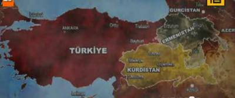
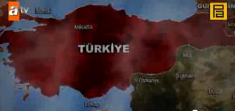
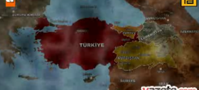
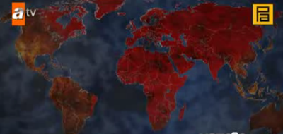

# Hafta 36

Anonim

Amerikan filmlerinde niye surekli vampir, siddet, seri katil,
vs. oluyor?

Kultur kodlariyla alakali

Amerika'da seksin kultur kodu SIDDET kelimesidir. Bu koda gore artist,
sukseli olmak siddet gosterisiyle yan yana gider. Bitmek tukenmek
bilmeyen vampir filmleri bu koda satis yapar, kan emici iblis tipli
yaratiklar bu koda gore "seksi" olmaktadir. Acikca soyleyeyim, bu
dingilce bir kultur kodudur. Kultur kodlarin hepsi dogru, hepsi yanlis
olacak diye bir sey yok; raslantisal sekilde dogru olabilirler tabii,
o baska.

Neyse, bu kodun pek cok ornegi sinemada mevcuttur. 1989 yapimi Michael
Douglas'in basrolde oynadigi War of the Roses filmi Clotaire
Rapaille'in kitabinda kullandigi ornektir. Film bastan asagi evlilik
icinde yasanan bir savasi resmeder. Taraflar bu savas uzerinden sanki
"cima etmektedir".

Dedigim gibi; dingillik.

Daha yakin tarihe gelirsek, Fight Club'da miyminti karakter (Edward
Norton) artist Tyler Durden'e (Brad Pitt) donusunce kluplerde kavga
etmeye baslar. Seks = Siddet. Brad Pitt ve Angelina Jolie filmi
Mr. and Mrs. Smith ayni sekilde. Toplumda seri katiller bu sebeple
surekli ilgi ceker, arada "sakinma / saliverme" hattina da satis
yapilir, vs. vs.

---

Anonim

Hazerfan Ahmet Celebi'yi konu alan Istanbul Kanatlarimin Altinda
filmi, Hazerfan'in bertaraf edilmesiyle ilgili olarak seyhulislam'i
gostererek "onlar hep vardi, hala varlar ve hep var olacaklar"
beyaniyla suclayici bir havada bitiyordu. Ne is?

Uydurmaca

Hazerfan Ahmet Celebi hakkinda guvenilir tek kaynak Evliya Celebi'nin
Seyahatname'de yazdiklaridir. Celebi kitabinda Hazerfan Ahmet'in (eger
boyle bir sey olduysa tabii) malum ucusu yaptiktan sonra IV. Murat'in
onun hakkinda sunlari soyledigini yazar : "Bu korkunc bir
adam. Istedigi her seyi yapabilme kabiliyetine sahip. Boyle insanlarin
etrafta dolanmamasi / olmamasi lazim". Ardindan IV. Murat Hazerfan
Ahmet'i Cezayir'de surgune gonderir, yani ortadan kaldirir.

Tum bunlarin icinde seyhulislam'dan falan bahis yok. O sonradan araya
sokusturulmus, olayin icine "dini" dahil etmek icin. Durum tersine
cevrilmis ayrica, "halka" ait olan bir sey sanki "sarayi", "yonetimi"
ele gecirip yanlis yonlere sevketmis gibi bir havada sunulmus.

Halbuki, illa bir suclu gerekiyorsa, tipik Osmanli despotlugundan
baska bir yere bakmaya gerek yok. Bu kafaya gore her sivrilen,
insiyatif alan herkes merkezi yagmalama sistemi icin potansiyel bir
tehdittir. Ayrica Roma'da bilim yoktur, olamaz; bu baglamda da 3. Roma'nin
icraati son derece anlasilir, kendi ic mantigina uygun bir eylemdir.

[1] Kaldi ki seyhulislam isin icinde olsa bile o da merkezi sistemin
parcasi, dini "yonlendirmekle" gorevli, bununla halkin inancinin ne
alakasi var. Alakasiz bir baglanti.

---

Anonim

Internet kuresellesmenin sembolu

Belki

Aslinda iletisim aglari bir ulkenin "ic baglantilarini" daha
kuvvetlendirir. Bu agin bir guc haline gelmesinin esas sebebi
bu... Disariyla tabii ki baglanti kuruyorsun, ama bu baglanti
icerideki mesajlasmanin boyutuna gore ikinci derecede. Niye boyle
olur? Dili, kulturel referanslari benzer olan insanlarin birbiriyle
daha fazla iletisimde olmasindan dogal ne olabilir?

Nereden nereye gelindigi hakkinda bir ornek aydinlatici olabilir. Bir
TR universitesinde profosorun hikayesini hic unutmam: Tasrada buyumus,
ITU'ye girmis, o zamanki universiteler hakkinda sunu soylemisti
"Ankara sehrinde ODTU diye bir universite acildigini ITU'ye girince
ogrendim".

Iletisimin nereden nereye geldigini tahmin edin.

---

Aykırı

Endustriyel toplum olmayinca endustriyel uretim olmuyor mu?

Oluyor

Tarim toplumu olmayinca tarim uretimi oldugu gibi endustriyel toplum
olmayinca endustriyel uretim olur. Tek fark, endustriyel uretim
tarzinin artik sosyal hayati etkileyemez hale gelmesidir. Bu sektor
artik "belirleyici" olamaz. Vasifsiz iscilerin sayisi azalir, sadece
onlara gore duzenlenmis sosyal hayat, politik duzen imkansiz hale
gelir. Hayat "senkronize" olamaz, insanlar daha serbest sekillerde
calisabilirler. Hayat "merkezi", "odakli" olamaz, o zaman egitim de
"merkezi" "odakli" yapilamaz.

Turkiye'nin gidisati budur. Amerika, Almanya ornekleri ortada:
Isgucunun dagilimi ABD'de sanayi %21, servis %76.9, Almanya sanayi
%26, servis %72.3. Rakamlar boyle olunca sendikal hareketler, sol kan
kaybeder. Kafasini kullananlarin sayisi artinca her turlu kolektivizm
batar, "sol" ve "sag" gucsuzlesir. Hayat boyu egitim onemli hale
gelir, insanlar kendilerini egitir, birden fazla alanda calisma
ihtiyaci dogar, "tek alanda calismak" "standardizasyon" prensipleri
silinir. Modernite iflas eder.

---

Tayyip Erdogan

Türkiye artık emek yoğun çalışan bir ülke değildir. Türkiye artık emek
yoğun çalışmaktan, teknoloji yoğun çalışmaya giden bir ülkedir

Dogru

---

Anonim

TUSIAD soyle yapsin.. boyle yapsin [..] Yanlis yapti.. [..]

Ceneni yorma

Az sayida secenek, kisinin oldugu siyasi secim anlarinda, oyuncular
oyun teorisine uygun sekilde cikarlari dogrultusunda bir secim
yaparlar. Bu secim deterministiktir; hesaplanabilir, onceden tahmin
edilebilir.

Buyuk sirketleri temsil eden TUSIAD'in sistemin demokratize
olmamasinda cikari vardir. Yeni Yeni Ekonomi yazisindan aktariyoruz:

Gectigimiz 9 ay icinde [kriz sirasinda] asiri buyuklugun ekonomik
olmadigini kesfettik. Buyuk firmalari nakit akisiyla isletmek daha
zordur, bu sebeple bu sirketler daha fazla borca ihtiyac duyar hale
gelmislerdir. Buyuk sirketler, [sececekleri urunler, gelecek tahmini
hakkinda dogal olarak] daha buyuk kumarlar oynamak zorundadirlar, ama
ayni zamanda ayni sirketler is yaptiklari o asiri cesitli piyasada
dagitim ve rekabet uzerindeki kontrollerini kaybetmeye
baslamislardir. Sonuc olarak oynanan kumarlar daha riskli ve getiriler
daha dusuk hale gelmistir [..]

Risk yatirimcisi Paul Graham'a gore eskiden gecerli olan "buyuk ve
disiplinli organizasyonlar kazanir" kuralinin sonuna artik su
degistirici ibareyi eklemek gerekiyor ".. degisimin yavas oldugu
sektorlerde". Kimse bu gercegi isler yeterli bir hiza erisinceye kadar
farketmemisti.

O zaman sunu soyleyebiliriz ki kriz sonrasi, eskisinin kullerinden
dogacak yeni ekonomi 'kucuk olani' daha avantajli hale getirecektir
[..]

Eger buyuk olanin hizli ekonomide hantallasmasi sebebiyle daha fazla
borca ihtiyaci varsa, ve devlet bu potansiyel borc verici kaynaklardan
en onemlisi ise, devleti kontrol edenin "kontrol edilmesi" buyuk
sirketlerin cikarinadir. Daha fazla demokrasi kontrolun dagilmasi
anlamina gelir, bu da gucun "konsantre" oldugu eski sistemin bekcileri
icin iyi degildir [1].

O zaman TUSIAD'a uzaktan tavsiye vermeye, genel anlamda trasa gerek
yok. Eger siyasi polemik amacli "cakmak" isteniyorsa, o baska
tabii.. Ama temel seviyede bilelim ki yapmalari gerekeni yapiyorlar,
digerlerinin (bizim) yapmasi gereken catisma oldugu oranda onlari
ekarte etmek, ve alternatif (21. yuzyila uygun) bir ajandayi
ilerletmektir.

Blog'un sag tarafinda duran merhum Ozal'in veciz sozunu tekrarlayarak
bitirelim:

"Önümüzdeki asır ferdin asrıdır, bilgi asrıdır. Bu asırda fertlerin
kitleler halinde değil, daha çok ufak gruplar ve tek tek çalıştıkları,
bilgisayar, telekomünikasyon, nakliye, inşaat, turizm gibi ekonomik
faaliyetlerden oluşan hizmet sektörü, toplam işgücünün yüzde 80'inden
fazlasını istihdam edecektir."

Ilgili yazi: Yeni Yeni Ekonomi, Bruce Bueno de Mesquita, Kim Daha
Fazla Istihdam Yaratiyor?, Endustriyel Ideolojilerin Temelleri:
Maksimizasyon

[1] Buyuk sirketler ortalama olarak istihdam artisina da pozitif etki
saglamiyorlar. O zaman yeni ekonomiye uygun siyaset daha fazla serbest
piyasayi desteklemek ve dinazorlarin kendiliginden yokolmasini
seyretmektir.

---

Haber

Iran "ucan deniz botu" yapti

Stratejik olarak anlamli

Eger Iran merkezli bir cekisme olursa Iran'in stratejik amaclarindan
biri Hurmuz Bogazi'ndaki petrol trafigini felc etmek olur. Deniz ile
ilgili yiginak yapmasi bu sebeple anlasilir. Bu arada, Bueono de
Mesquita'nin Oyun Teorisi kullanarak hesapladigi tahmini hatirlatirim;
one gore Iran silah kalitesinde nukleer yakit uretecek, ama silahin
kendisini uretmeyecektir. Bu konu hakkinda baski yapmak ise bu "denge
noktasina" gelinmesini daha da geciktirecektir.

Ilgili yazilar: Hurmuz Bogazi, Bruce Bueno de Mesquita

Aykırı

Fight Club filmi seks = siddet kodunu kullaniyor, bu kod dingilce
dediniz. O zaman filmin tamami dingilce midir?

Degildir

Bu film yerinde bazi mesajlar da icerir.. Mesela: "Sana öğrettikleri
küçük görevi yerine getiriyorsun. Bir kolu çek. Bir düğmeye bas. Neyi
neden yaptığını bilmiyor, sonra da ölüp gidiyorsun".

Bu ifade modernitenin suratinda patlayan bir tokattir.

Endustriyel toplumlarda insanlar montaj bantindaki tek bir isi, ust
uste, standart bir sekilde yaparlar. Bu sekilde nihai urunden,
sonuctan gittikce uzaklasirlar. Koca bir makinenin icinde ufak bir
disli haline gelirler. Bilgi toplumunda uretim araci sahislara
aittir. Bu aracla final urunu, bastan sona, istedigimiz sekilde
uretebiliriz. Bu sekilde insanlarin cogaldigi bir toplumda devrimsel
degisiklikler olacaktir dogal olarak. Bu elestiri yerindedir.

Diger bazi mesajlarda evrensel olmayan, kulturel / duygusal (mal)
beyinden gelen irdelemeler hala var, ve bunlar kismen tutabilir,
kismen tutmayabilir. Mesela: "Hiçbir zaman tamamlanmış olmayayım, ne
olur. Hiçbir zaman halimden memnun olmayayım. Hiçbir zaman kusursuz
olmayayım. Kurtar beni, Tyler, kusursuz ve tamamlanmış olmaktan
kurtar". Bu mesaj bir kultur kodundan geliyor: Mukemmeliyetin ABD'de
kultur kodu OLUM kelimesidir.

Mukemmele erismek bir tur bitis gibi algilanir, bu sebeple mukemmelin
pesinde kosmamak yonunde de bir yeltenme vardir. Ilginc bir sekilde,
teknolojinin kultur kodu ISLEMESI YETER kelimesidir. Kod ne kadar
gecerli? Yani, bilimde, teknolojide calisirken, muhakkak mukemmeli
elde etmek mumkun olmayabilir, diger yandan, o yonde "ugrasmak"
kalitede belli bir artisa da sebebiyet verebilir, vs. 50/50.

---

Zontalarin, Romaci, merkeziyetci kabadayi zavallilarin dizisi Kurtlar
Vadisi icin bir reklam yapmislar, YouTube'da geziniyor (bu siteyi
yasakladigini zannedenlere arz ederim).Adamlarin koylu, toprak bazli
dunya gorusu "toprak kaybetmemek, toprak kazanmak" oldugu icin toprak
uzerine korkunc senaryolar yapiliyor dogal olarak.Ilk senaryo ABD'nin
Turkiye emelleri:Ikinci senaryo Israil'in emelleri:Ucuncu senaryo
AB'nin emelleri (Istanbul ozerk bolgesine dikkatinizi cekerim):Ve en
son, Turkiye'nin emelleri.Tabii isgalci, yagmaci mantiga uygun olarak
tum dunya fethediliyor. Fakat benim anlayamadigim Amerika'yi niye
kutuplardan fethediyor. Yani orada t..klarin donacak kardesim.. Niye
ta tepeden iniyorsun?Fasistin en babasi bile iklime yenilmis, senin
gibi ufak, ikinci derece davarlara ne oluyor?Bu milliyetciler
hakikaten cok gerizekali oluyorlar...

---

Star Trek franchise'ini tekrar baslatan direktor J. J. Abrahams,
dizinin ruhunun Kirk ve Spock birlikteligi oldugunu soylemisti. Bu
ifade, ve diger Trek kulliyati aslinda Amerikan / Avrupa kultur
kodlari hakkinda ilginc gostergeler.

Trek gelecegin dunyasini resmetmeye calismistir (kiyasla Star Wars,
hayali, "uzaklarda bir yerlerde" fantastik bir evrendir), ve o dunyayi
resmederken bugunku dunyayi nasil gorduklerini belli etmislerdir. Kirk
ve Spock birlikteligi Amerika, Avrupa ittifakinin temsilidir.

Vulkan irki Avrupa'dir. Savasci degillerdir, bilim ve felsefe ile
ugrasirlar..

Kirk'un yasadigi ve dizinin merkezi olan Federasyon pek cok irki,
gezegeni (eyaleti?) birlestirmis olan ABD'dir.

Dizi bu ittifak uzerinde danseder, gider gelir. Amerikali Kirk
maceraci, risk alan "yoneticiyi" oynar. Avrupali Spock mantiki
dusunmeyi, kendini kontrol eden karakteri oynar. Tabii diger yandan
ABD kulturel fay hatti olan "sakinma / saliverme" uzerinde de gidip
gelinmektedir; Spock "sakinir", Kirk "saliverir". Kirk gittigi her
gezegende bir kariyi goturur. Spock duygularini kontrol eder.

Ama kodlar burada bitmiyor.

Sıkı durun: Vulkanlarin genetik olarak benzerleri, ama onlardan bir
sekilde "ayrilmis" onlarin "zitti" bir irk vardir.

Bu irk Romulan ismiyle biliniyor. Romulanlar savasci, militarist ve
yayilmacidir. Baskentlerinin ismi nedir?

Romulus!

[1] Buradan devam edersek Klingonlar Suudi, Cardassianlar Alman,
Bajoranlar Filistinli, Borglar Sovyetleri temsil ediyor.

[2] Spock rolunun bir Yahudi olan Leonard Nimoy'a verilmis olmasi bir
raslanti degil. Yahudiler ABD'de kendilerini "Amerika'daki
Avrupalilar" olarak gorurler.

[3] Eklemek gerekir ki, ST dizi ve filmleri Vulkan Romulan
farklilasmasini birincisinin "evrilmis olmasi" isiginda resmeder. Yani
Vulkanlar daha "ilerlemis" "evrilmistir". Romulan millet saldirgan,
militarist olarak "kalmistir".

---

Chris Anderson Wired makalesi

Sektörler şirketlerin, devletlerin, ve diğer kurumların etki alanından
çıkıp normal insanların erişebileceği hale gelince, yani demokratize
olunca dengelerin transforme, eskinin tepetaklak olduğu tarihi anlar
ortaya çıkar. İnternet yayıncılığı, iletişimi demokratize etti, ve
sonuç olarak dijital olan her alanda katılımın çeşitinde müthiş bir
artış yaşandı.

Aynı değişimler şu anda imalat / sanayi sektöründe yaşanıyor.

3 boyutlu baskıdan tutun, elektronik parça birleştirmeye varıncaya
kadar, artık fabrika üretimi için gereken araçlar toptan ya da ufak
ölçülerde, bireylerin erişebileceği hale geldi. İyi bir fikir ve biraz
uzmanlıkla artık herkes bilgisayarının birkaç tuşuna basarak Çin'de
bir montaj bantı kurdurabilir. Birkaç gün sonra bir prototip
kapılarında belirecektir, ve bu prototip iyi durumdaysa, birkaç tuşa
daha basılarak yüzlerce, binlerce ürünün aktif üretimine
geçilebilir. Artık herkes sanal bir mikro-fabrika haline gelme
potansiyeline sahiptir, hiçbir altyapıya, hiçbir stoga gerek
duymadan. Ürünler imal ettirilip dağıtıcılara kolayca eriştirilebilir.

Bugün mikro-fabrikalar bisikletten tutun, arabalara, oradan mobilyaya
kadar aklınıza gelebilecek her alanda üretim yapmaktadırlar. Garajında
kurcalamakla uğraşan meraklı / kaşif amatör milyonlarca insanın toplu
potansiyeli, küresel piyasalarla tanışmak üzeredir; fikirler direk
üretime gidecek, tüm bunlar [kompleks] finans ve araç, gereç yatırımı
gerektirmeden olacaktır. "Diz üstünde bilgisayarı olan üç kişi"
şimdiye kadar bir Web girişimini tanımlamak için kullanılırdı. Artık
aynı ibare bir donanım şirketini tanımlamak için de kullanılabilir.

MIT profosörü Erich Hippell'e göre "donanım iyice yazılıma benzemeye
başladı". Bunu söylemesinin sebebi pek çok donanımın içinde yazılım
olması değil [.. üretim amaçlı] ortak platformların, kolay
kullanılabilen araçların, Web başed mesajlaşma / beraber çalışma
ortamlarının ve İnternet temelli dağıtım kavramlarının ortaya çıkmış
olması.

Biz bu filmi daha önce seyrettik: Kaya gibi tek parça (monolithic)
endüstriler yeni gelenlerin etkisiyle paramparça oldular. Müzik
endüstrisinden tutun, gazetelerin başına gelenlere kadar neler
olabileceğini iyi biliyoruz. Giriş koşulları (barriers to entry)
azalınca, rahatlaşınca, herkes / topluluk içeri doluşuyor.

Olanları daha akademik bir dille şu şekilde tarif edebiliriz: Küresel
tedarik zinciri artık "ölçekten bağımsız (scale free)" hale geldi; bu
zincir hem küçüğe hem büyüğe, garajındaki amatörden koca Sony
şirketine aynı anda hizmet verebiliyor. Bu değişimin arkasında iki
büyük güç var: Birincisi mühendis olmayanlar tarafından bile
kullanılabilen ucuz ve kapsamlı prototipleme araçlarında bir patlama
yaşanması. İkincisi son ekonomik krizin (çoğunlukla) Çinli
üreticilerin işleyiş politikalarında büyük değişimler yaratmış
olması. Bu üreticiler, kriz sırasında [mecburen] daha esnek hale
geldiler, böylece Web-bazlı, siparişe göre (custom) işleri alabilmeye
başladılar -- bu siparişlerde miktar daha az olabiliyor ama kar
oranları daha yüksek oluyor.

---

Son 500 senenin onemli bilimsel sahsiyetleri birbirlerine olan
etkisine gore metro haritasi olarak resmedilmis [baglanti].

http://www.crispian.net/ScienceMapv0.37.png

---

Internet temelli dijital ve siparis usulu video servisi yapan Netflix,
Coinstar gibi sirketlerle rekabet edemeyen video sirketi Blockbuster
Inc. sonunda iflas bayragini cekti. Blockbuster'in yaklasik 1 milyar
dolarlik borcu var. Blockbuster yeni medya duzenine uyum saglayamayan
dinazor sirketlerden biri; ve iflasa giden surecte yasadiklari ABD'de
gazetelerin cokusu ile paralelligi var.

---

Inovasyona Davet: Atmosferdeki Karbonu Azaltmak

Kuresel isinmanin potansiyel tehlikeleri kapida / ortada: The
Economist dergisi inovasyonunun outsource edilmesini saglayan
Innocentive sirketi / sitesi uzerinden projeleri, fikirleri olanlara
cagri yapiyor: Olceklenebilen bir sekilde atmosferdeki karbonu cekip
cikarmak, onu azaltmak, ve kuresel isinmanin onune gecebilmek. Odul
$10,000.

---

Khanacademy YouTube uzerinden matematik dersleri veren bir
kanaldir. YouTube reklam sistemi uzerinden para kazanan bu "Internet
okulu" su anda 1600 ders video'suna erismis bulunuyor. Bill Gates bu
kanalin hayranlarindan biri.

Alttaki video'da Bill Gates ile 2010 Aspen Fikirler Toplantisi'nda
yapilan roportaj gorulebilir. Gates cocuklarina Calculus ogretmek icin
Khanacademy'yi kullaniyor. Roportajda Gates "zeka kaynaklarininin bir
ulkede nasil dagitildigi" hakkinda ilginc sozler soyledi: Gates'e gore
egitim hakkinda AR-GE'ye giden zeka kaynagi neredeyse sifir. Egitim
hakkinda AR-GE nedir? Iyi bir ogretmenin metotlari, kaynaklari,
kullandigi referanslar yayiliyor mu? Bu konuda arastirmalar yapiliyor
mu?

Khanacademy'yi kuran Sal Khan finans sektorunde (hedge fund)
calisiyordu; YouTube isini baslatinca (ve eski isinden istifa edince)
Gates sakayla karisik Khan sayesinde "finans sektorunden bir miktar
IQ'nun egitim sektorune transfer oldugunu" soyluyor.

Sitenin diger dillere tercume programi var. Iyi bir fikir, cunku
anlatim haricinde gosterilen her sey matematik sembolleri, yani
goruntulerin degistirilmesine gerek yok, sadece yabanci dilde
seslendirilme yapilmasi yeterli.

http://www.khanacademy.org/about#translation

http://www.youtube.com/watch?v=6A07Pj71TUA

---

Esra Ozyurek'in [1] Modernlik Nostaljisi kitabinin tezi sudur: Icinde
oldugumuz gayri-modern cagda, Kemalistler modernligi kamusal alanda
degil artik icsel, kulturel seviyede yasamaya baslamistir;
[standardizasyon desturuna uymasa da] modernist semboller bireysel
hale gelmistir.

Clotaire Rapaille kultur kodlari mantigini buraya eklersek, olanlarin
tamami sudur:

1) Uretim sekli (tarim, sanayi, bilgi) en temel seviyedeki hayatin
idamesiyle alakalidir, etki baglaminda duygusal kodlar onun altinda,
analitik dusunce onun altindadir. Bilgi toplumunun guclenmesiyle
modernite cokmektedir ve hayatin idame edilmesi uzerinde etkisi
kalmamistir / kalmayacaktir. Modernitenin yasayabilecegi tek yer,
imgesel, hayatin gercekliginden kopuk olan hayali bir noktada
olabilir.

2) Turkiye gibi uretim sekilleri arasinda cok hizli gecisler yasayan
ulkelerde, cocukken okulda sanayi toplumuna uygun kodlari alanlar,
buyuyunce kendilerini tamamen farkli bir dunyada
bulabilmektedirler. Bu kimseler aslinda "parcalanmis hayatlar"
yasamaktadirlar. Ic dunyalari Kamalist, hayatlarini idame edisleri
post-modernisttir.

Ama, salt kodlar seviyesinde yasanan dis dunyanin gidisatinda
belirleyici olamaz. Hayatin idamesi, ekonomik uretim sekli en baz
seviyede ve daha guclu bir olustur... Eninde sonunda yeni teknolojinin
gerektirdikleri kodlar seviyesinde yasanan modernizmi de silindir gibi
ezip gececektir.

Fanusta yasatilan süs modernizmi, bir süs olmaktan ileri
gidemeyecektir.

[1] Esra Ozyurek bilindigi gibi CHP elemanlarindan Mustafa Ozyurek'in
kizidir. Bir tur "mahalle kackini" yani.

---

Nick Bilton'ın I Live In The Future kitabindan

Gazeteleri okumayı çok severdim. 2004'te New York Times'da çalışmaya
başladığımda Sunday Times'in işyerimize Cumartesi günü erkenden
getirildiğini farkedince çok sevinmiştim [..] böylece kendime bir
ritüel yarattım. Her Cumartesi erkenden ofise gider [..] o istiflenmiş
kopyalardan bir tane alır, ve ertesi günün gazetesini detaylıca
okumaya başlardım. Çok geçmeden arkadaşlarım benden gazetenin
gayrimenkul bölümünün kopyalarını istemeye başlamıştı.

Fakat bir sene sonra bu ritüelim sona erdi. Arkadaşlarım da telefondan
aramıyordu. Birer birer hepimiz başka bir ritüele geçiyorduk. Gazete
kağıdının eldeki hissiyatı, kağıdının kokusu yerine daha hızlı, her
şahsa göre değişik olabilen dijital okuma tecrübesini tercih
ediyorduk. Arkadaşlarım bedava olmasına rağmen artık benden gazetenin
kopyalarını istemiyorlardi [..] !

Bugün, sabah uyanınca başlıklara bilgisayardan bakıyorum, ofise
giderken detaylı makaleleri mobil telefonumdan okuyorum, ve haber
sitelerini gün içinde belli zamanlarda sürekli gözden
geçiriyorum. Facebook ve Twitter gibi sosyal ağlar sayesinde en iyi
içeriğin biraraya gelmesi iyice rahatlaştı, ve online ortamda
haberleri görmek daha hızlı hale geldi. Tüm bunların üstüne, artık
beğendiğim makaleleri arkadaşlarımla daha rahat paylaşabiliyorum,
paylaştıklarım hakkında kendim de yorum ekleyebiliyorum [..].

[Gazetelerin] problemi yaklaşımlarının artık anlamsız hale gelmiş
olması. Kavram şöyle -- yüz küsur kadar haber makalesi Times
editörleri -benim arkadaşlarım- tarafından başlıkları ile beraber ve
önem sırasına göre güzel bir ambalajın içine konuyor. En önemli
haberler belli yerlerde, iş haberleri belli yerlerde, spor bölümü
hafta içi çoğu günde iş bölümünün hemen arkasında.

Ama problem tam da burada zaten: bu paket editörlere göre neyin önemli
olduğunu yansıtıyor, benim tercihlerimi dikkate almıyor. Benim hoşuma
giden, gitmeyen formülün parçası değil. Daha da önemlisi, o dikkatlice
seçilmiş, geniş kitle için tasarlanmış gazetenin üzerindeki kelimeler
benim evime ulaştığında çoğu artık güncel bile değil.

---

PISA 2003 hakkinda analizi surada yapmisiz. 2006 yilina gelelim:
Bilindigi gibi PISA OECD ulkelerindeki 15 yasindaki cocuklarin bilim
konusundaki seviyesini olcer; bu sinavi onemli yapan bilimsel bilginin
gunluk hayata, ham veriye uygulanisini, yani analiz yetenegini
olcmesidir. Bilimsel arastirmanin onemli bir kismi modelleme
eylemidir; veriye uygun model bulunmaya ugrasilir, model gelistirilir,
vs.

PISA 2006 sonuclarinda Turkiye'nin durumu nedir?

Ne yazik ki durum pek iyi degil.

Bilim seviyesi 6 bolume ayrilmis, her ulkede ogrencilerin yuzde
kacinin hangi skala altinda oldugu gosteriliyor. Turkiyeli
ogrencilerin takriben yuzde 40'i en alt seviye ve onun
altindadir. 3. ve 4. seviyelere gelindiginde (yani seviye arttiginda)
sert dususler gorulmektedir, bu noktada gelismis ulkelerin
ortalamasinin yarisi, dortte biri (3. ve 4. skala icin sirasiyla) gibi
oranlar gorulmektedir.

Gelecegin bilim adamlari 5. ve 6. seviyelerdeki cocuklardan cikacak:
TR icin 5. seviyeye cocuklarin sadece yuzde 0.9'u
erisebilmistir. 6. seviyeye ise hic bir Turkiyeli ogrenci
erisemistir. Gelismis ulkeler icin 5. seviyede ortalama olarak
cocuklarin yuzde 10 kadari erisebilmeliydi. TR bunun ancak onda biri
seviyesindedir.

Sonuc bir rezalettir.

2006 itibariyle Turkiye egitimde cuvallamistir.

PISA 2009 sonuclari Aralik 2010'da aciklanacak. Insallah orada bir
duzelme gorulur.

PISA 2006

---

ABD saglik sistemindeki bozukluklari gosteren, eglenceli bir dizi:
Royal Pains. Zengin hastalara hizmet veren bir hastanede acil mudahele
/ yardim (emergency) doktoru olan Henry "Hank" Lawson, hastanenin en
buyuk finansorlerinden birini operasyon sonrasi risksiz bir noktayken
birakip, hastaneye gelen fakir bir hastaya bakmaya gider. Sansizlik
eseri zengin hasta o sirada olur, ve Hank kovulur.Hank diger bazi
raslantilar sonucu kendini New York'un yazlik mekani olarak bilinen
Hamptons'da bulur; burada zenginlere ozel doktorluk yapmaya baslar,
ayni anda, parasi olmayanlara bedava servis verir; dizide telafuz
edildigi gibi Hank, bir tur "tibbi Robin Hood" haline
gelmistir. Degisik bir sekilde zenginden alip fakire vermektedir
(tabii kardesiyle kurdugu HankMed ile arada para da
kazanmaktadir).Dizi hasta bakimini hastanelere "konsantre" etmis
mevcut sistemi elestiriyor, ve alternatif cozumler oneriyor. Hank
aslinda burokratize olmus modern sistemi by-pass ederek ihtiyaci olan
hastaya direk ulasmayi basariyor. Hastanelerin Amerika'daki kultur
kodu ISLEM TESISI (processing plant -fabrika-) kelimeleridir [4] --
dizideki zenginler hem gizlilik amaciyla, ama ayni anda ulkedeki
herkesin katildigi kultur kodlariyla bu "islem tesislerine" girip
sosis gibi islenmek istemiyorlar. Problem yok, Hank onlara
geliyor. Hank'in sagladigi servis, ayrica, surekli olan bir bakim;
hastayi aklinda tutuyor, tekrar ziyaret ediyor, hayatina giriyor, ve
"tesiste" gorulemeyecek bozukluklari boylece goruyor [1,2,3].Diziyi
ilginc yapan diger ozellikler, Hank'in acil durumlara yaptigi McGyver
usulu mudaheleler; Hank etrafta olan normal ev esyalari ile inanilmaz
cozumler buluyor (yaratici, standart degil). Bu acidan dizi baska bir
genre'da olsa da populer Burn Notice dizisini cagristiriyor.

Ayrica Hank'in kardesi Evan Lawson The O.C. dizisindeki hizli konusan,
kafasina gore deyim yaratan inek (geek) ve kafa adam karisimi bir tur
Seth Cohen olarak aynen onun gibi diziye komedi unsuru ekleyip, iyi
anlamda havayi hafiflestiriyor.---[1] Turkiye'de ileri surulen aile
doktorlugu bu baglamda iyi bir cozum.[2] House M.D. dizisi de benzer
noktaya parmak basiyor. Teshisci Dr. House, gerekirse (yani her zaman)
dizide hastalarin evine bile hirsiz gibi girerek etraftakileri kolacan
ederek dogru teshisi yapmaya ugrasiyor.[3] Mevcut sistemde isin saglik
tarafi haricinde diger bozukluklar da var. ABD'de asiri legalize olmus
sistem, doktorlarin elini kolunu baglayip kaliteli bakimi
baltaliyor. Tek bir yanlisi yuzunden sistem Hank'in pesini birakmiyor
mesela; durum biraz dramatize edilmis olsa da, aslinda gercekten cok
uzak sayilmaz.. Kaynaklar da dogru yerlere aktarilamiyor. Cozum
servisin "sosyalize" edilip edilmemesinde degil -- saglik servisini
devletin karsiladigi Ingiltere'de en az Amerika kadar problemler
var. Yani her zaman oldugu gibi, gunumuzde dogrular / yanlislar
arasindaki ayrac, sag / sol cizgisiyle degil organizasyon "sekliyle"
alakali. Modernitenin cokusu cogu sorunun ortak noktasi.[4] Rapaille,
C., The Culture Code

---

Roma dis dunyayi barbarlar olarak tanimlayarak [1] etrafindaki
ulkelerle surekli savasti, ve basarabildigi olcude yakip yikti. Fars
dunyasi bu barbarlar listesinde onemli bir yer tutmaktaydi. Barbarlar
yazisinda bugunku Iran'in yerinde olan Parthia'nin Roma ile olan
savasindan bahsettik. Bu cekisme (ezeli rekabet?) ilginc bir sekilde
700 sene devam etmistir, ama sonuc olarak aradaki sinir neredeyse hic
degismeden kalmistir, ve savaslar saldiran Roma'nin agir yenilgisiyle
sonuclanmistir.

Fakat, Roma ile olan surekli iliski Fars dunyasi uzerinde kotu etkiler
yaratti [2].

Farslilar yenilmemelerine ragmen her savas sonrasi gittikce daha fazla
Roma'ya benzemeye basladilar. Parthia sonrasi kurulan Sasaniler, Roma
gibi, merkeziyetci, toleranssiz ve disariyi "surekli dusman" olarak
niteleyen bir topluluktu. Bu toplum yapi bakimindan bugunku Iran'a da
oldukca benzemekteydi.

Iran benzerligi, diger yandan saldiran Bati'nin bugune olan
benzerligini akla getirir. Roma'nin mirascisi neo-con Amerika, Iran'a
karsi saldirgan tavrini devam ettirmekte, ve bu tavir, yeni Fars
memleketini, aynen gecmiste oldugu gibi merkeziyetci ve toleranssiz
bir yere cevirmektedir [4].

Bu film ne zaman bitecek?

[1] Osmanli'nin Dar-ul Harp tanimlamasi ayni kafa yapisina
aittir. Yagmalama sistemi daha fazlasini gasp etmeli, elde ettigi
ganimetleri merkeze aktarmalidir.

[2] Terry Jones' Barbarians

[3] Roma'nin Fars saldirisi sonrasi aldigi yenilgiler dillere
destandir. Tek bir Sasani imparatoru uc tane Roma imparatorunu arka
arkaya yenilgiye ugratmistir. Belki de tum bu yenilgiler Roma / Fars,
Bati / Dogu cizgisine mistik bir hava kazandirdi. Bu garabet
hissiyatlardan kurtulmak gerekiyor.

[4] Neocon kanaat onderlerinden Robert Kagan'in "ABD Mars'tan Avrupa
Venus'ten" sozu "manidardir". Bu soz daha once bahsettigimiz
Avrupa'nin, genel anlamda Bati'nin, kulturel fay hattina isaret
etmektedir. Militarizm Avrupa'nin geride biraktigi Roma kafasina, bir
kisim Amerikali'nin hala kurtulamadigi bir hastaliga isaret
etmektedir. Turkiye'deki Osmanlicilik benzer bir kafadan urer. Turkiye
bunlari geride birakarak daha fazla Avrupali olacaktir.

---

Parag Khanna makalesi

21'inci yüzyıl [..] bir şehirler yüzyılı olacak. Hiçbir şeyin doğru
dürüst idare edilemediği bir çağda, idare edilebilen tek 'adalar'
devletler değil şehirler olacak gibi gözüküyor. Yeni dünya, bir
'küresel köy' olmayacak -- pek çok farklı / ayrı koyun birbiriyle bir
şekilde bağlı olduğu bir yapı olacak [..]

Bu dünyayı anlamak için ne 19. yüzyılın 'güç dengeleri' politikaları,
ne de 20. yüzyılın güç bloklanmaları kavramları yeterlidir. Onun
yerine aşağı yukarı 1000 sene kadar öncesine, Kaire ve Hangzhou gibi
şehirlerin küresel dengelerin merkezlerini oluşturduğu Ortaçağ'a
dönmemiz gerekiyor [..] Unutmamamız gerekiyor ki Marko Polo
Venedik'ten çıkıp o zamanlarda yeni gelişmeye başlayan İpek Yolu'nda
seyahat ettiğinde, ziyaret ettiği yerlerdeki imparatorlukları değil,
şehirleri övmüştü. Polo, Kaşgar'ın üzüm bağlarından, Xi’an'ın
bolluğundan imrenerek bahsetmişti [..]

---
