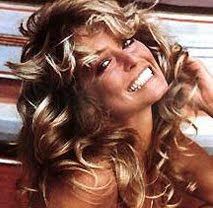
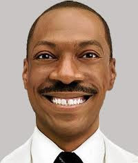
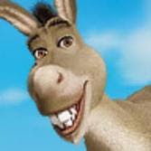

# Hafta 40

Aykırı

Bayes teorisi diye bir sey duydum, model olustururken onkabul
(apriori) bilgi cok onemli oluyormus, o zaman hicbir sey objektif
olmuyormus. Subjektivizm kazandi demek ki.

Balık gibi atladın

Bilim dusmanlari boyle sacmaliklara bayiliyor.. Araya biraz kuantum
traslari, kaos filan ekledin mi gaza gelip iyice sacmalamaya
basliyorlar. Biraz daha sıkıstırınca "hayat yok" filan demeye basliyor
adam.. dehset bir felsefe.

Bayes istatistigi denen bir dal var, dogru (bizim takildigimiz
alanlardan biridir); ve onkabul bir dagilim (distribution) olarak,
modelden once, isin icine dahil edilir, evet. Daha sonra veriyi
modelin uzerinden gecirerek (likelihood) onkabule uygularsin (carpim
uzerinden), ve bu baslangic dagilimi degistirir, bir sonuca
goturur. Degisik baslangiclar, ayni veri, ayni model uzerinden bizi
degisik sonuclara (posterior) tasiyabilir.

Fakat en sonunda gelinen noktayi her zaman gercek veriye tekrar
bakarak, uyum acisindan kontrol edersin. Bu uyuma gore bir model
atilabilir, yerine bir digeri getirilebilir. Alternatif modeller
yaristirilabilir, hangisi, hangileri daha basarili ise onlar
kullanilir.

Bu Popper'in soyledigi "yanlislanabilir dusunceden" baska bir sey
degildir! Yani farkli onkabuller bir modelleme numarasidir, burada
subjektiflik falan yok, alan bilgisini dahil etme olayi var; Son sozu
gercek hayatin verisi soyluyor.

Ama efendim "hayatin verisine nasil guvenecegiz, hayat gercek mi?"
safsatalari tekrarlanabilir, bunlara Einstein en iyi cevabi vermistir:

"Hayat bir iluzyondur, ama bu iluzyon, cok ısrarcıdır".

Yani neredeyse her turlu teorik, pratik amac icin veri, nihai
noktadir.

Trasa gerek yok.

---

Anonim

Orhan Pamuk hicbir unlu (buyuk?) yazar gibi yazmiyor.

Yani standarta uymuyor

Not: Sanat zaten aykiri olmayi gerektirir. Ustteki ifade bu bakimdan da sacmadir.

---

Kemal Kilicdaroglu

Turban .. seklinde baglansin

Yani standart bir sekilde baglansin

---

Askeriye

Tek tip askerlik olsun

Yani askerlik standardize edilsin

Not: "Herkesin" bir sekilde, belli yaslarda, mecburen, "tanima uygun"
yaptigi is basli basina bir standardizasyon zaten. Tamamen
kaldirilmasi gerekir.

---

Anonim

Niye askeriye surekli moderniteden bahsediyor(du)?

Hayatta kalma refleksi

Osmanli'yi yikan modernitenin silahlariydi. Bu yuzden "askeri koylu
imparatorlugu" moderniteyi ilk kez disaridan, onu "yenen" yuzuyle
tanidi, ve o "kendini yikan seye" sahip olmak icin dayanilmaz bir
istek duydu. Dusmani gibi olmak istedi.

Avrupa ise yarattigi endustriyel vahset makinasinin yikimini kendi
icinde yasadi. I. II. Cihan harplerindeki milyonlarca oluler ona
aitti. Onun tarafindan oldurulmuslerdi; baskasi tarafindan
degil. I. Cihan Harbinde Osmanli net bir sekilde kaybetti. "Kiralik
asker deposu" olarak geldi, tokadi caktilar, iki seksen yere
serildi. Avrupa'da kazananlar bile kaybetti (bu dersin tam anlasilmasi
icin 2. Cihan harbini de yasamak gerekiyordu).

TR'ye donelim: Modernite ithal edildikten sonra da, bir degil, iki
degil, tam uc tane Roma imparatorlugu yasamis bu topraklara
modernitenin merkeziyetciligi, standardizasyonun "otekilestirdigi"
"barbarlar" kavrami daha bir "cuk" diye oturdu. Bakin, adam hala yuzuk
takmis kendi topraklarini fethetmekten bahsediyor. Bu koklu, kadim bir
davarligin isareti.

Avrupa zamani gelince, hem yasadigi dehsetten dolayi, hem modernitenin
son kullanma tarihi gectiginden dolayi, icine dustugu durumu
irdeleyebildi. Irdelemesini hizlandiracak "kalintilar da" sahipti;
Romali Katolik Kilisesi, merkezi militarizmin carmiha gerdigi Isa
hatirasi ve onun degisik varyantlardaki takipcileri, Ortacag tecrubesi
onun parcasiydi.

Turkiye agir aksak ama benzer sonuclara variyor.

---

Aykırı

Dukkanlarinda kaset, DVD servisi yapan Blockbuster niye iflas etti?

Fiziksel dukkanlarin sinirli olmasi sebebiyle

Uzun Kuyruklu Dagilim (The Long Tail) yazimizdan: [Walmart'in] dagitim
kanali fiziksel raflaridir, dukkanlaridir - insanlar bu fiziksel
dagitim kanali arasinda/icinde gezinirler. Fakat bu fiziksellik
yuzunden hit bolgesindeki (yani en populer urunleri satan) sirketler,
dagitim kanali acisindan sinirlidir. Wal-Mart'in ne kadar fiziksel
buyuk bir yeri olursa olsun, tum muzik disklerini barindirmasi mumkun
degildir. Bilahere Wal-Mart, bugun itibariyle mevcut muzigin sadece
yuzde 1'ini tasiyabilmektedir.

Fakat Rhapsody, iTunes gibi muzigi dijital olarak dagitan sirketler,
bu fiziksel sinirlamalarin hicbirine tabi degildir. Dahasi da var:
Eger Wal-Mart bir mucize eseri tum diskleri tasiyabiliyor olsa bile,
bu sefer asamayacagi baska fiziksel sinirlamalar onu engeller. Bir
diskin kategorizasyonunu dusunelim. Bir disk rock mi, pop mu,
alternatif mi olmali? Fiziksel dunyada ve depolama acisindan bir diski
iki yere birden koymaniz cok zordur. Fakat dijital dunyada, iTunes
icin bir diskin kategorizasyona bir veri tabani tablosunda atilan bir
sanal isaretten ibarettir. Bu isaret istenildigi kadar istenildigi
sekilde atilabilir. Dijital kategorizasyonda hicbir sinir yoktur.

Modernitenin yikilisi farkli kollardan ilerliyor. Ustteki ornek bu
cokusun ekonomik baglamdaki disavurumu. Fiziksel dukkan belli sayidaki
esere "konsantre" olmalidir; dijital dukkanin boyle bir siniri
yoktur. Miktar "maksimizasyonu" gereksizdir. Sonuc olarak Blockbuster
gibi bir sirket paldir kuldur asagi iner.

---

Zulfu Dicleli

Dijital ekonomi, bilgi ekonomisi çağı başlıyor. 1985’ten beri dünyada
böyle bir süreç yaşanıyor. Artık ekonomide üreten, değer yaratan güç,
bilgili kişi oldu. İnsanlar, kuruluşlar, şirketler birbirleriyle bilgi
paylaşabilmek üzere şebekeler, networkler oluşturuyorlar ve karşılıklı
besleniyorlar. Anlayacağınız bugünün ekonomisinde esas değer bu şebeke
ilişkilerinden çıkıyor. Oysa eskiden sermaye önemliydi. Çünkü sermaye
makine demekti. İşçiler makineleri kullanarak değer
üretebilirdi. Dolayısıyla sermaye olmadan üretim yapılamazdı. Şimdi
ise sermaye olmadan üretim yapılabiliyor. Çünkü esas üretim gücü artık
bilgili kişi ve onun sosyal ilişkileri. Bilgili kişinin artık üretim
aracı olarak sadece bir bilgisayar ekranına ve klavyesine ihtiyacı var
[..].

Üreten-üretmeyen ayırımı yok artık. Bilgi, sermayeden daha önemli hale
geliyor [..].

["Böyle bir dünyada siyaset ne olacak peki? Sağ ve sol ne olacak"
sorusuna cevaben] Sol ve sağın fikir çerçevesini oluşturan dünya artık
yok oldu. Sağ ve sol fikirlerin ortaya çıktığı sanayi toplumu [..]
Fransız ve Rus devrimlerinin dünyası yok artık. Bambaşka bir dünya
oluşuyor şimdi. Şimdi her şey yeniden tarif edilecek. Ve iki önemli
özlem ‘özgürlük ve adalet’ insanlığın gündeminde daima kalacak.

Dogru

---

Bu Sefer Durum Farkli

Carmen M. Reinhart ve Kenneth S. Rogoff adli ekonomistler tarafından
yazılmış bir kitap: Bu Sefer Durum Farkli (This Time Is
Different). Kitabın başlığı devlet yöneticileri, ekonomistler arasında
yaygın bir hissiyatı eleştiriyor; bu hissiyat her onyılda (decade)
olan ekonomik krizleri hep "bu sefer işler değişik" diye gören bir
hissiyattır. Reinhart ve Rogoff'u değişik yapan, Çin ve Hindistan'ın
tarihine kadar gidip buradaki ekonomilerin tarihinden, ekonomisinden
veri çekip çıkarmış olmaları. Gerçek hayat sadece veri üzerinden
anlaşılabilir (veri eksik olursa modeller eksik olur) bu sebeple
yaptıkları önemli bir iş.  Reinhart ve Rogoff bu yeni veriye bakarak
2008 şubprime krizinin aslında hiç te 'özel', 'değişik' olmadığını
ortaya koyuyor. Yazarlar ayrıca krizi tahmin etmekte başarısız olan
ekonomistleri "hep standart veri setlerine baktıkları" gözlemiyle
eleştiriyor.
 Ek bazı gözlemler: Sermaye hareketlerinin arttığı
dönemleri hep banka krizleri izliyor.  Gelişmekte olan piyasalarda
seri şekilde borç ödeyeme / iflas (default) olaylarının görülmesi
garip değil, normal

---

Finansta Turevsel Urunler

Unlu yatirimci Warren Buffett'in 2002 yilindaki yazisindan

Charlie [yatirim ortaklarindan biri] ve ben, turevsel urunler ve bu
urunlerin alim satimi hakkindaki gorusumuzde hemfikiriz. Bizce bu
urunler, hem onlari alip satanlar icin hem de ekonomik sistemin tamami
icin bir saatli bomba gibidir.

Turevlerin isleyis mantigina gore, fiyatin belirlenmesi icin temel
alinan varligin [mesela bir sirketin] fiyatsal degeri kullanilmakta,
ama o temel alinan varligin kendisi el degistirmedigi icin tek bir
kurus alinip satilmadan potansiyel naylon degerler uzerinden finans
sirketleri rekor karlar, ya da rekor kayiplar gosterebilmektedir.

Turevlerin degerini saptamakta kullanilan ne oldugu belli olmayan /
detaysiz metodlar yuzunden bu enstrumanlarin gercek degerinin ortaya
cikmasi yillari alabilir. Turevlerin islenmesi ile ilgili hatalar cok
olasidir; bu hatalarin bir kismi muhakkak normal insan hatasi
olacaktir, insanlar ellerinde tuttuklari menkullarin degerini genelde
optimistik gormeye meyillidirler. Fakat daha onemlisi / kotusu,
turevsel yatirimlarin isleyisi sebebiyle fiyat sisirme / saklama /
muhasebe oyunlari ile para calmayi kiskirtan / tesvik eden (incentive)
bir yonlenlerinin oldugudur. Bu sebeple su anda patronlarin,
borsacilarin buyuk karlar, buyuk getiriler uzerinden elde ettikleri
kazanclarin ileride bir "dalavere" oldugu ortaya cikacaktir.

Charlie ve ben buyuk bankalarin turevsel urunleri hakkindaki
aktivitelerini anlatan koca bir dipnotu okuyup bitirdigimizde,
anladigimiz tek sey, bankanin ne kadar risk tasidigini
anlamadigimizdir.

Bizim gorusumuze gore finansal turev urunleri bir tur "kitle imha
silahidir".

---

California valisi Schwarzenegger Japonya'ya hizli tren sirketleriye
gorusmeye gitmis. Bu sirketler kendi ic pazarlarini doyurdular, artik
disa acilmaya bakiyorlar. Amerika, California genis memleket, arti
petrol fiyatlarinin ne olacagi belli degil, ve surucu dikkatsizlikleri
ile olan kazalar ortada. Trenler kuresel isinmaya karsi da iyi bir
onlem, "yesil" sayilabilecek bir teknoloji. Her bakimdan kazancli bir
is.

---

Farah Fawcett posterini gorunce aklimiza geldi; o poster 70'li
yillarin simgesi haline gelmisti... O "sırıtış" sonra 80'lerde de
kendini gosterdi, bu sefer Eddie Murphy'nin yuzunde. Tabii gulumseme
yetmiyordu o zamanlarda, boyle at gibi guleceksin. Butun disleri
gostererek. Eh 70/80'ler ne de olsa "plastik" bir cagdi, plastik
ifadeler, plastik suratlar.Eddie Murphy deyince, en sagdaki resim
Shrek animasyon filmindeki esek karakteridir, ve seslendirmesini
Murphy yapiyor; Hemen ona da pat diye Murphy'nin sırıtışını
vermisler. Alem adamlar bunlar... Holywood boyledir, hicveder, sonra
hicvettigini hicveder, boyle devam eder.

---

