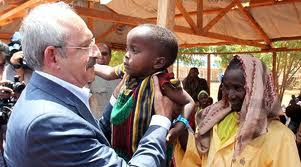

# Hafta 36

Ludwig von Mises

Zahitçe hevesli kimseler, Marx'da dünya tarihinin kahraman
şahsiyetlerinden birisini görürler; ve onu, en büyük iktisatçılar ile
sosyologlar, hatta en mümtaz felsefeciler arasında sınıflandırırlar
[..] Bir iktisatçı olarak Marx, özgünlükten tamamen yoksundu. O,
klasik siyasi iktisatçıların bir takipçisiydi, ama siyasi bir önyargı
olmaksızın esaslı iktisadi meselelere yaklaşma kabiliyetinden
yoksundu. Her şeyi, ilk ve her şeyden önce, halkın zihninde yapılan
tesiri dikkate alan bir tahrikçinin gözleriyle gördü [..].

Ayrıca o, sistemini, yani Das Kapital'in ilk cildinin yayınından sonra
[.. olan] teorik iktisattaki devrimden tamamen habersiz olması
talihsizliğine sahipti. Sonuç olarak Das Kapital'in takip eden
ciltleri yayımlandıkları günden itibaren yeni bilimle temastan tamamen
uzaktı. Bu onun meftun takipçilerini özellikle güç durumda bırakan
kötü şansın bir parçasıydı. Baştan itibaren onlar ustanın yazılarının
verimsiz / kısır gösterileriyle yetinmek zorundaydılar [..].

Bir sosyolog ve tarih felsefecisi olarak Marx asla partisinin gündelik
ihtiyaçları için yazan yetenekli bir tahrikçiden fazlası
değildi. Maddeci (materialist) tarih olgusu bilimsel olarak
değersizdir; ayrıca Marx hiçbir zaman onu tam olarak hesaplamadı,
aksine birbirine bağdaşması mümkün olmayan çeşitli şekillerde önerdi
[..].

Bilimsel bir yazar olarak Marx kurak, bilgiç, ukala ve
ağırdı. Kendisini zeki bir şekilde ifade etme kabiliyeti, ondan
esirgenmiştir. Siyasi yazılarında, güçlü etkileri ve sırf göz
kamaştırıcı anti-tez ve hatırlanması kolay ibareler sayesinde, sırf
kelime oyunlarıyla boşluklarını gizlediği cümleler üretir [..].

Marx'ın özgünlüğü ve tarihi önemi, siyasi teknik alanda yatar. O,
işyerlerinde bir araya getirilmiş işçilerin büyük kitlelerinin sıkıca
birleştirilmesiyle elde edilebilecek muazzam sosyal gücü, siyasi
etkiyi fark eder ve bu kitleleri uyumlu bir hareketin içinde
birleştirmek için sloganlar arar ve bulur. Başka türlü siyasete
ilgisiz insanları özel mülkiyete saldırmaya yönlendiren o gerekli sözü
üretir. Gücenmesini akılcılaştıran ve kıskançlıklarını ve isteklerini
dünya tarihi tarafından emredilen bir görev içinde yücelten bir
kurtuluş öğretisine övgü yağdırır. Onlara, tek başlarına insan ırkının
geleceğini taşıyan kimseler olarak şapka çıkartarak misyonlarının
bilincinin ilham eder.

Iste

---

Anonim

Marksistler niye akla karşıdır?

Başka türlü ideolojilerini yayamazlar

Link Aşağı yukarı 19. yüzyılın ortalarına kadar sosyalizm ideali
ortadan kaybolmuş gibi gözüktü. Bilim, katı mantık kuralları ile onun
işe yaramaz olduğunu göstermişti; ve onun destekçileri, tek bir etkin
karşı iddia geliştirememişlerdi [..] Marx, Hegelci diyalektikte [..]
usta olduğu için, sosyalistlerin kendilerini buldukları ikilemden
kurtulmanın bir yolunu bulmakta zorlanmadı. Bilim ve mantık,
sosyalizme karşı olduğu için, bu türden rahatsız eleştirilere karşı
sosyalizmi savunmak için dayanak oluşturabilecek bir sistem tasarlamak
zorunluydu. Marksizm'in yapmaya çalıştığı şey buydu [..] 3 yol takip
edilecekti: Birincisi, mantığın, bütün insanlık için ve bütün çağlar
için evrensel olarak geçerli olduğunu inkar etti. Düşünce, Marksizm'e
göre, düşünürlerden müteşekkil bir sınıf tarafından
belirleniyordu. İkincisi, Marksizm, diyalektik gelişmenin bizleri
zorunlu olarak sosyalizme götürdüğünü, bütün tarihin amacının ve
hedefinin kamulaştıranların kamulaştırılması -inkarın inkarı-
sayesinde üretim araçların sosyalleştirilmesi olduğunu ileri
sürdü. Son olarak Marksizm, hiç kimsenin (ütopik sosyalistlerin
yaptığı gibi) sosyalist vaat edilmiş toprakların inşası için belirli
bir öneri sürmesine izin verilmemesi kuralını getirdi.

Sosyalizmin gelmesi muhakkak olduğundan; bilim, en iyisi, onun
doğasını belirlemeye yönelik bütün çabalardan vazgeçmeliydi [..]

Fakat, Marksizm'in olağanüstü başarısının altında yatan esas durtu, ta
ezelden beri insan ruhunun derinliklerine kök salmış öç/intikam
duygusu, ve her hayalinin gerçekleşmesini bekleyen bir yöndür.

Bu duygulardan biri aşırı hayalci, diğeri çok öfkelidir, ve hiçbir
insan bu duyguları aklı selim halde kabul etmez. Bu yüzden, bu türden
intikam rüyalarının saçmalığını gösteren akıl ve mantık yürütme bir
tarafa itilmelidir. İşte bu sebeple Marksizm, akılcılık tarafından
tesis edilen hayat ve eylem üzerine bilimsel düşüncenin hakimiyetine
yönelik en radikal saldırı haline gelmiştir. Marksizm, akıla karşıdır,
bilime karşıdır, bizzat düşünce faaliyetine karşıdır. Bolşevikler,
ısrarlı bir şekilde bize, dinin insanlar için bir afyon olduğunu
söylerler. Fakat gerçekte Marksizm düşünceye karşı tasarlanmış bir
afyondur. Bu ideoloji, ne yazık ki, safsata yoluyla sosyolojik
problemlerin bilimsel incelenmesine mani olmuş ve zamanın entellektüel
atmosferini kötü bir şekilde zehirlemiştir.

---

Bir akademisyen

Gelişmiş ülkelerde siyaset kültürel değil, ekonomik çerçevede yapılıyor.

Uydurma

Aklına eseni "dünyanın hiç bir yerinde.. " diye başlayan cümlelerle
yapılmaz, edilmez diye etiketlemeyiniz. Böyle sözleri söylebilmek için
dünyanın "bir kaç yerinde" nelerin olup bittiğini iyi bilmek gerekiyor
öncelikle. Kültür temelli siyasi çekişme ABD 2000 seçimlerinde Bush II
- Gore arasında bal gibi olmuştur. Ekonomi, en azından görünürde, iyi
gidiyordu, Gore bu konuyu etkili kullanmadı / kullanamadı, Bush II
kültürel bir çekişme yaratarak seçimi kazandı.

---

Bir görevli

Eski imparatorluk bolgemiz Mısır'a [..]

Yüksekten atma

Mısır'lıların yanında böyle atıp tutarsanız, size hemen 1831-32
sırasında Mısır'ın Osmanlı'yı yıkmaya ne kadar yaklaştığını
hatırlatırlar, "biz de sizi yönetiyor olabilirdik" gibi imalara da
maruz kalırsınız.

Mısırlılar 1832 yılında Konya'da Osmanlı'nın evire çevire "tozunu
aldıktan" sonra, İstanbul'a yürümek için önlerinde hiçbir engelleri
kalmamıştı. Eğer "gavurlar" ise karışmasaydı, Osmanlı denen hayvanlar
tarih sahnesinden daha da önce çekilmek zorunda kalacaktı. Ne yazık ki
çöküş biraz daha gecikti. Özgüven eksikliği yaşayanlar, güven elde
etmek için başka adreslere bakmalıdır. Afrika Savana'sından ileri
fırlayan adamın cesaretinden fazlasına ihtiyaç yoktur aslında, o
genler de evrimsel olarak herkesde var.

Bundan fazlası "traş" kategorisine girer.

---

Anonim

Biz buraya gelince..

Sen kimsin?

Hala "biz" diyerek uzaklardan bir yerlerden gelip buraya yerleştiğini
ve olduğu gibi kaldığını zanneden salaklar var. "Biz" dediğin şey,
genetik olarak bu topraktakilerin en fazla yüzde 30 civarını
oluşturuyor. Kültürel olarak ta genetik olarak ta. Buranın kültürü,
genetik yapısı da bu sebeple topraklardan ne gelip geçtiyse
o'dur. Bunun icinde Antik Yunan da var, Hitit de var, kısmen Roma /
Osmanlı denen öküzler de var [yönetimsel olarak]. Var da var.

Bir kısım insan Orta Asya'dan gelmiştir, doğru. Her gelen bir şeyler
verdi, bir şeyler aldı (çoğunlukla aldı), ve mevcut durum ortaya
çıktı. Yok biz "geldik" biz "gittik", böyle saçma sapan batıl
inançlardan kurtulmak gerekiyor.

---

Abbas Güçlü

[Muvaffak Gözüaydın adlı bir mühendisin gönderdiklerinden]

Online Eğitim ile Bilişim öğretmeni arasındaki fark lokomotif ile
koyun arasındaki farktır. Online Eğitimde çocuklar bilgisayar
kullanmayı yarım saatte öğrenir. Buna şahsen Hakkâri’de bile şahit
oldum.

[B]omboş geçen binlerce saat ve tamamen bilgisiz öğretmenler [egitim]
sağlar [mı]? Bilgili öğretmeni ABD bile sağlayamamıştır. Rüya
görmeyelim. Ama dünyanın en iyi öğretmenlerini online programda en
ücra köşeye gönderebiliriz. Eğitimde eşitlik budur.

Öğretmen olmayan okulda tablet olsa [ne] olacağını göreceksiniz. Çoğu
okulda çocuklar öğretmenlerinden daha ileride derslere hâkimdir. Hatta
öğretmene ihtiyaç bile yoktur. Fakat bunu öğretmenlere kabul ettirmek
imkânsızdır.

Öğretmen olmadan dahi çocuklar tableti kullanıp sınıflarını
geçecekler. Burada kuvvet yazılımdır. Tablet tek sınıflı okulda 4 kere
daha iyi vazife görecektir.

"O tablet paralarına 50.000 öğretmen atamayı düşünün önce". İşte
dünyanın en saçma mütalaası. Zaten okulların tamiri, bakımı, su parası
elektrik parası yeterli olmadığı için tablet geliyor. Okullarda
öğretmen olmadığı için tablet geliyor. Yalnızca 360 liraya o da 36
ayda ödenecek bir öğrenci kazanıyorsunuz. Öğretmen olmasa da öğrenci
dersi takip ediyor. Kar olsa, sel olsa, zelzele olsa öğrenci dersi
evde takip ediyor.

Bir öğretmenin maliyeti ayda en az 1.500 lira. Yılda 18.000
lira. 50.000 öğretmenin yıllık maliyeti 18.000 x 50.000 = 900.000.000
lira veya 600.000.000 $ 5 yıllık maaşı ise 600.000.000 x 5 = 3 milyar
$16.000.000 tabletin maliyeti ise 150 x 16.000.000 = 2.4 milyar
$. Yani çok iyi bir iş yapılıyor.

Bilgi Teknolojileri Öğretmenleri kadrolarını da arttırmak mi?
Cehaletin daniskası denir buna. Tablet kullanmak için bilgisayar
bilmeye lüzum yoktur. Herhangi bir öğretmen veya veli 10 dakikada
öğretir.

"Öğretmensiz öğrenirler artık!" En doğru laf. [..] Yazılım geliştikçe
öğretmene de ihtiyaç kalmayacak. Öğretmenlerin de korkusu burada.

Bir öğretmenin yetişme maliyeti yılda 50.000 $’dan 4 yıllık eğitim
200.000 $’dır. Sonra da yıllık maliyeti 12.000’$ dır. Ayrıca iyi bir
öğretmen yetiştirmek için 200.000 $ değil 1 milyon $ gerekir. Bunun
için dünyanın her yerinde öğretmene karşı savaş başlamıştır. Öğretmene
kâfi maaş verilememektedir. Bundan dolayı da iyi öğretmen
yetişmemektedir. Bütün dünya öğretmensiz eğitime gitmek zorundadır ve
gitmektedir.

Dogru

Bu çağa gereken sayıda ve kalitede öğretmen yaratmak mümkün değil ve
artık herkese kalite gerektiği bir çağdayız. Bu da video, ders
materyelleri, herşeyin Internet üzerinden verileceği bilgisayar bazlı
bir sistem ile olabilir. Khanacademy'nin başarısı ortada [1].

Öğretmenlere ne kadar para verilip, verileceği, kaç tane olacağı bir
tarafa, araştırma ile uğraşmayan tüm öğretmenler işten
atılmalıdır. Bir ürünü [öğrenciyi] işlemek için o sayıya oranla
niteliksiz işçiyi [öğretmeni] fabrikada [okulda] istihdam etmek, aynen
orkestrada daha fazla ses çıkarmak için daha fazla müzisyen
çalıştırmak gibi, modernist ve geri bir yaklaşımdır. Bu yaklaşım öyle
ya da böyle iflas edecektir.

[1] Devlet bir hizmet olarak Khanacademy'nin içeriğine Türkçe ve
Kürtçe seslendirme yapabilir.

---

Wael Ghonim

[Sorulara oy verilmesi] tekniğini biz Google'ın içinde
kullanıyorduk. Şirket CEO'muz canlı bir ortamda konuşma yapıyor olsa
bile, eğer [elektronik sistemimizde] birisi ağır bir eleştiri / soru
yöneltiyorsa ve diğerleri bu soruya oy veriyorsa, CEO durup bu soruya
cevap vermek zorundadır.

İşte demokrasi

3-4 senede bir, zaten çoğu Bağlantıcı Elit tarafından elenmiş,
filtrelenmiş, "öne sürülmüş" adayların arasından birinin seçilmesi
demokrasi değildir, ona temsili sistem denir. 21. yüzyılda demokrasi
Ghonim'in belirttiği gibi ve pek çok diğer tekniği kullanmak
zorundadır. Ghonim bilindiği gibi Mısır'daki direnişin liderlerinden
ve eski Google çalışanı. Umarız ki sistemlerini olusturduklarinda yeni
ve denenmemiş bir şeyler yaparlar. Eger 19. yüzyıl endüstriyel
sistemin bir kopyasını kuracaklarsa, direnişte görülen bir sürü efor
boşuna harcanmış demektir.

---

Anadolu'nun DNA Yapısı

[Yapılan araştırmalardaki] mitokondrial ve Y kromozom [bazında] en iyi
hesaplara göre Orta Asya temelli genetik karışım en fazla yüzde 30
seviyesinde. Bu yaklaşıksal hesap Anadolu'ya geldiği iddia edilen
büyük sayıda (tarihi olarak belgenmemiş olsa da) Türkmenlerin göç
oranı ile uyuşuyor. Bu oran 40 nesil boyunca her nesilde yüzde 1
seviyesinde olmuştur.

[[-]](http://web.unife.it/progetti/genetica/Giorgio/PDFfiles/ajpa2001.pdf)

---

Bazı Yanılgıların (Nihayet) Çöküşü

Felix Marquardt

[Arap Baharı sonrası görüldü ki] özgürlük için hissedilen o açlık,
dışarıdan empoze edilmedi, içeriden geldi. Arap Sokağı diye bilinen
kişiler, hayatlarındaki problemler ve apaçık ortada olan -arka arkaya
9 BM raporuyla tescillenmiş- geri kalmışlıkları için Batı'yı,
Amerika'yı ve İsrail'i suçlamaya çok daha az meyilli.. Onlar nihayet
problemlerinin (çoğunun) sorumlusu olarak kendilerini yöneten,
yönetmiş olan despotları suçlamaya başladılar. 11 Eylül'de uçakların
kulelere çarpmadan hemen önce, o kulelerdeki "Yahudilerin" uyarılmış
olduğu türünden akıl sır erdirilemeyen peri masallari da artık alıcı
bulamıyor. Al Kaide'nin hiççiliği de (nihilism) aynı şekilde
reddediliyor.

---

Kılıçdaroğlu Somali'de

Bazılarında hiç "halkla temas" yeteneği olmuyor... Yukarıdaki resme
bakınız. Kılıçdaroğlu'daki ifade sanki elinde canlı bir bomba
tutuyormuş gibi .. Afrikalı çocuktaki ifade "bu memur niye kapımıza
geldi, evrakları eksik mi doldurduk acaba?" kıvamında.. Tam bir PR
fiyaskosu. Yok mu bir kaset daha?

---

Sünger Bob Çocukları Aptallaştırıyor

Businessinsider

Amerikalı araştırmacılara göre Sünger Bob gibi hızlı tempolu çizgi
dizileri çocukların çetrefil işleri becerme kabiliyetlerini ciddi
şekilde azaltıyor. [..] Araştırmada çocuklar üç gruba ayrıldı, ve
[.. Sünger Bob seyreden] çocukların işlerini idare etme, takip etme
fonksiyonlarında düşüşler görüldü. Bu çocukların kuralları olan
organize oyunları oynamaktaki [..] başarısının azaldığı gözlendi.

---

