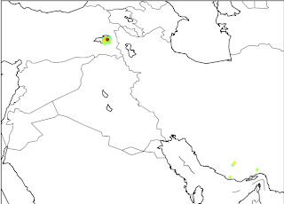
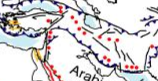

# Hafta 40

Ürdün

The Second World, Parag Khanna

Coğrafi olarak pek çok diğer ülke tarafından çevirilmiş, hapsolmuş
Ürdün gibi bir ülke için çöküş her zaman ufakta bekler. Bu ülke
neredeyse sürekli bir mevcudiyet savaşı vermektedir. Eger Ürdün bir
gün çökmeye başlasa, komşularının hiçbiri parmağını bile
kıpırdatmayacaktır, İsrail, Filistinliler, Suudi Arabistan, Suriye
hepsi ellerine geçen parçaları kendilerine dahil etmeye uğraşacaktır,
ve hayat devam edecektir.

Ürdün Arap jeopolitikasının tüm çetrefilliğinin bir temsili
sayılabilir. Bu ülkenin doğuş hikayesi bile sömürgeci devletlerin
verdiği sözler ile Arap saltanatlarının birbiriyle rekabetinin
karışımıdır ve bu saltanatların rekabeti "çöl Araplarının" Suudi
Arabistan ve Ürdün bazlı Haşemi saltanatı olarak ayrı kamplarda yer
almaları sonucunu vermiştir. Ürdün, bugün bile, ayakta, bağımsız
kalabilmek, hem de onlardan yatırım çekebilmek için Körfez soylu
aileleri ve kendi soyluları arasında ayarladığı evlilikleri
kullanmaktadır.

Diğer yandan Soğuk Savaş sırasında bir "tampon ülke" görevi görmüştür,
Batı tarafından Sovyet yayılmasını durdurmak için kullanılmıştır. Her
ne kadar topraklarındaki İngiliz subaylarını yarım yüzyıl önce
evlerine yollamış olsa da, bugün ne söyleyip, ne yapacağı Amerika
tarafından dikte edilmektedir. Bu ABD baskısı, onu Arap ülkeleri
içinde İsrail'i ilk tanıyanlardan biri yapmış, ve bu icraatına
karşılık olarak ne topraklarındaki Filistinlilerin evine dönmesi, ne
de kendisi için su doğal kaynaklarına erişim hakkı gibi hediyeler elde
edebilmiştir.

Filistin ne zaman karışsa zengin, fakir her türlü Filistinli Ürdün'e
akmakta, ve bu göçmenler para ile birlikte sosyal rahatsızlıklarını da
beraberlerinde getirmektedirler. Beyaz kireçli evlerle süslü ve
caddeleri çöp dolu mahallelerden arabayla geçerken Ammanlı bir
entellektüelin bana "biz bir ülke değiliz, biz kim isterse onun
kiraladığı başka bir şeyiz" diye şikayet etmesinin sebebi buydu
herhalde.

---

Van

USGS deprem verilerine gore son bir hafta icinde Turkiye'nin etrafinda
Richter olcegide 1 uzeri olan depremler sadece guney Iran'da. Ekim
19,20 ve 23'unde orasi da "titremis". Nukleer test mi yapiliyor nedir?
2008 yilinda Iran'da Richter 5 civari sarsintilarin nukleer test
oldugu iddia edilmisti. Neyse komsuyu daha fazla somut bilgi olmadan
suclamayalim, veriler altta (kolonlar sirasiyla siddet, derinlik,
zaman, bolge)7.2 20.00 Sunday, October 23, 2011 10:41:21 UTC eastern
Turkey4.3 10.00 Sunday, October 23, 2011 00:31:19 UTC southern Iran4.5
10.00 Thursday, October 20, 2011 06:57:25 UTC southern Iran5.2 7.00
Wednesday, October 19, 2011 02:52:44 UTC southern Iran4.5 38.90
Wednesday, October 19, 2011 00:58:07 UTC southern IranHarita uzerinde
tum 1 haftalik veriyi grafikleyince soyle cikiyorFay hatlari
haritalarinda guney Iran ve Turkiye'nin dogusunu baglayan bir hat
gozukuyor.Paylasalim dedik.

---
