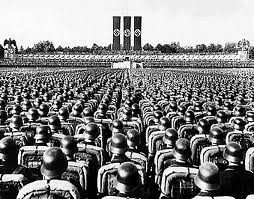
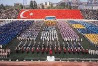

# Hafta 48

Ali Bulac

İslam dünyasının durumunun hiç parlak olmadığı aşikâr. Ne tarihi
yüceltmeye gerek var, ne bütün sorumluluğu [..] Batı'nın üstüne
atmaya. Açık olan şu ki, bizim çok yönlü bir değişim sürecinden geçme
zaruretimiz var. Kısaca kendimizi; siyasetimizi, toplumsal yapımızı,
ahlaki formasyonumuzu, ekonomik anlayış ve tutumumuzu tepeden tırnağa
değiştirmek zorundayız [..].

Hiç kimse Müslüman toplumların "iyi durum"da olduğunu
söyleyemez. Böyle bir yüceltme bizi kör eder. Ne İslami referanslar ne
tam modern kriterler açısından İslam dünyası iyidir. Sosyo-kültürel
yapısı zayıftır; ahlaki bakımdan çöküş yaşamaktadır; aydınları
iktibasçı ve tüketicidir; iktisadi, beşeri ve tabii kaynakları heba
olmaktadır; adalete ve özgürlüğe uzaktır; toplumsal çözülmeye
uğramaktadır; postmodern sömürgeci güçlerin av sahasıdır; otokrat
rejimler, monarşiler ve diktatörlükler tarafından yönetilmektedir, en
'demokrat' görüneni bile vesayet rejiminden kurtulmuş değildir; mezhep
ve etnik çatışmalara sürüklenmektedir; şehirleri her geçen gün biraz
daha patolojik hal almaktadır.

Dogru

Özellikle şehirlerin durumu kötü, ve kötüleşiyor. En "kaliteli"
bilinen yerlerde bile kamusal alan batmış durumda; mesela Bebek diye
bir yerde, hava atmaya çalışan piç kuruları patlak egsozlu
arabalarıyla resmen ralli yapıyorlar, günün her saatinde. "Polis
nerede?" diye oradaki esnafa sorunca adamlar cevaben öyle bir kalayı
basıyorlar ki duyunca irkilirsiniz.

---

Anonim

Zavallı köpekler onları koruyalım

Kendi köpeğini koru

TR binbir türlü Dogu / Batı kaynaklı zihinsel tortunun en dandik
sentezi; Üsttekiler sozler modernist gamalist birinden. Ülkemize
Batı'dan, orada sahibinin kendi hayvanına verebileceği zararı
engellemek için koyulmuş "hayvanları koruma" kuralları geliyor -- ama
sokak köpekleri için. Sokaklarda görülüyor, kulağa etiket takılmış,
"fişlenmiş" hayvan dolaşıyor.. böylece iş halledilmiş güya. Tabii bu
hayvanlar birbirine, gelene geçene havlıyor, sürüler oluşturup volta
atıyorlar, zaten göt kadar olan kaldırımın üzerine yayılıp siesta
yapıyorlar. İnsanların alanını işgal eden bu saçmalığa izin veren
yönetim vatandaşını neyle eşdeğer gördüğünü mü belli ediyor acaba?
Modernist gamalist belediyeler özellikle izin veriyor bu işlere,
herhalde "dincilerin mekruh gördüğünü korursa / tersini yaparsa"
otomatik olarak ilerlemiş olacaklarını zannediyorlar. Her taraf salak
dolu.

Bu hayvanlar turistik yerlerde de sürekli geziniyor bu
arada.. Ortaköy'de bizzat gördüm, hayvan bacağı kaldırıp çat diye
tarihi caminin önüne işedi.

---

Radikal

Hollywood ile ilgili sınanmış tespitlerden birisi de ‘kriz’ anlarında
geçmişin dehlizlerinden başarı hikâyelerini, sararmış kâğıtlara
sıkışan süper kahramanları bir kez daha göreve çağırıp ‘Amerikan
Rüyası’nın hâlâ gerçekleşebilir bir seçenek olduğunu gösterme çabaları
[..] Bu hafta sinemalarımıza konuk olan ve bu yazının konusunu
oluşturan Brad Pitt’li ‘Moneyball/Kazanma Sanatı [..] ‘Küçük
Amerikalı’ya, “En büyük olmak, tepeye çıkmak için çok paraya ihtiyacın
yok. Doğru yöntemlere ihtiyacın var” diye sesleniyor film. Ama
‘kapitalizmin ruhu’na sadık olmak koşuluyla. “İnsanları birer metaymış
gibi alıp satmaktan, yeri geldiğinde hiç tereddüt göstermeden kapının
önüne koymaktan, verimliliği artırmak için iş koşullarını yeniden
düzenlemekten imtina etmeyeceksin” diyor.

Yanlış

Filmin konusu olan genel müdür (Pitt) başarıya erişemiyor; yenilikçi
teknikleri kısmen yarıyor ama şampiyon olamıyor.. Film sonunda,
yazıyla, o teknikleri kullanan başka bir takım Red Sox'ın (ki uzun
süre şampiyon olamayan kaybeden bir klüptü) şampiyonluğa eriştiği
belirtiliyor. Yani birkaç deneme, birkaç takımı kapsayan bir süreç var
ortada. Ayrıca filmde insan faktörü var, sahadaki antrenör kritik bir
anda kritik bir kişiyi sahaya sokarak önemli bir maçı
kazanıyor. Ezbere bir takım lafları tekrarlayabilmek için film
yorumunun içine etmişsin.

---

Murat Kapkıner

Ez cümle, eski İçişleri Bakanı Sadettin Tantan televizyonda '[vicdani
ret] bizim cihad kültürümüze aykırı" diyor [..] Mehmet Baransu [..]
'adam öldürmemek ama adam öldürene yemek yapmak, onun bulaşığını
yıkamak öyle mi' [diyor -bravo- ..]

Arap yarımadasının en pehlivanı, yenilmez savaşçısı [..] 'Ya Muhammed!
Sana katılıp çarpışmak istiyorum' deyince, Peygamber 'bana inanıyor
musun' der 'hayır' cevabını alınca da: 'lazım değilsin' der [..] Adam
üç kez teklifini tekrarlamış ve üçünde de 'inanıyorum' deyince 'gel o
zaman' denilmiş. Yani ki İslam'da inançları, vicdanı kanattları için
nefs-i müdafaa yapmama, yapmayarak ölümü seçme hakkı bulunduğu gibi,
davanın hak olduğuna inanmayan kişi savaşmıyor, dahası, anası izin
vermeyenler de savaşamıyordu.

Ölmeye veya öldürmeye birey karar vermeli.

Doğru

---

Etyen Mahcupyan

[R]eformları yapamadığı ölçüde, AKP [..] hüzünlü bir tablo
sunuyor. Reformun önünü kesmek üzere kotarılan her direnç adımı, bir
bumerang gibi dönüp, iktidarın siyasetini bir farsa
dönüştürüyor. Vicdani ret meselesi iyi bir örnek... Önce şunu
söyleyelim: Şu anki anayasada bile 'zorunlu vatan hizmeti' bir
'askerlik görevi' olarak tanımlanmıyor. Yani insanların eline silah
vermektense, onları başka kamu hizmetlerinde kullanmak mümkün. Bunun
için tek bir yasa değişikliği bile gerekmiyor. Ama bu adım atılmıyor,
çünkü 'eline silah verme' konusunda bir esnekliğin günümüz dünyasında
'eline silah alma' konusunda da bir esnekliği ima edeceği açık.

Devlet bundan tedirgin. Çünkü toplumun askerlik hizmetine nasıl
baktığını gayet iyi biliyor. Hamasi jargonun aksine, giderek çok daha
fazla sayıda genç askerlik yapmanın anlamsızlığına, hatta bu deneyimin
kendi kişiliğine zarar vereceğine inanıyor. Nitekim orantısız bir
cezalandırma uygulaması olduğu halde, şimdiden yüzü aşkın vicdani
retçi var... Türkiye'nin bu kişileri ömür boyu hapsetmekten başka çare
bulamaması ise AİHM'den tazminat cezaları olarak dönüyor. Şimdi
yapılan düzenleme ile bu hapis cezası tek sefere inecek ve böylece
suçla orantılı olduğu savunulabilecek 'adil' bir ceza konmuş
olacak. Ancak tek seferlik cezanın makul olması için askerlik süresini
aşmaması gerekiyor. Çünkü aksi halde zımnen askerliğin mahpusluktan
daha beter bir şey olduğunu itiraf etmiş olursunuz. Öte yandan bu
cezayı çok da kısa tutamazsınız, yoksa 'maazallah' askerlik yapacak
adam bulamama ihtimali var!

Ancak askerlik süresiyle eşit bir hapis cezası bile pek güvenilir
olmayabilir... Çünkü toplumun değişim dinamiğine aykırı yönde giden
bir tedbirin geri tepeceği, bizzat toplum tarafından kadük hale
getirilebileceğini hayal etmek zor değil. Binlerce gencin vicdani
retçi olduğunu ve hapisleri doldurduğunu düşünün... Bunların arasında
AKP'li gençlerin de olabileceğini, hatta belki de bizzat parti ileri
gelenlerini yadırgatan biçimde, bunların azımsanmayacak bir sayıya
ulaşabileceğini de öngörebiliriz.

Diğer bir deyişle bu yasa kendisini gülünç durumda bırakan bir
tasarrufa dönüşebilir. AKP farkında olmayabilir, ama gençlere 'haydi
hepimiz hapse!' türünden bir kampanya açmalarının zeminini de sağlamış
oluyor ve muhtemelen bununla nasıl başa çıkılacağı hakkında bir fikre
sahip değil. Hüzünlü ama doğrusu keyifli bir süreç olacak... Toplumsal
değişim isteğinin ve evrensel taleplerin önünü kesebilecekmiş gibi
yapan her iktidar gibi, AKP de utanacağı ve yenik düşeceği bir süreç
yaratmak üzere.

Doğru

---

Bülent Arınç

Kürtlerin varlığının inkâr edilemeyeceğini söyleyen Arınç, “Bir
insanın kimliğini inkâr etmek o insanı inkâr etmek demektir. Kendisini
Kürt kimliği ile Arap kimliği ile Boşnak kimliği ile artık ne gelirse
aklınıza... Hepsi, kim, ne varsa bu topraklar üzerinde kendi kimliğini
rahatlıkla söyleyecektir. O kimliğe saygı duyacağız. O kimliğin bütün
kültürel haklarını, Anayasal haklarını vereceğiz, tanıyacağız” diye
konuştu.

Bravo

---

Huseyin Ergun

Sanayi toplumunda (kapitalizmde) [..]

Bu eşitleme nereden çıktı?

Kapitalizm = sanayi toplumu (2. dalga) eşitlemesi doğru değil. Aslında
kapitalizm tanımın kendisi bir muğlaktır, ama çoğunlukla bireysel
mülkiyet, kar amacıyla üretim yapabilme gibi öğeler icerdigi kabul
edilir.

---

Huseyin Ergun

Marksist kabule göre [..] sosyalizm gelecekti. Öyle olmadı, [..]
bilişim toplumu geldi. [..] Marx ve arkadaşları makine teknolojisinin
kendi doğrultusunda gelişeceğini varsaydılar. Sosyalizmi, kapitalizmi
izleyecek bir toplum biçimi olarak tahayyül ettiler; iddialarını bunun
üzerine kurdular. Bir teknolojik devrimle sanayi toplumundan büsbütün
başka bir uygarlık doğacağını öngöremediler. Bu arada, aynı çeyrek
yüzyıl içinde,bilişim teknolojisi ile sanayi toplumu aşıldı.

Dogru

Yeni dönemin ideolojisi hala belli değil (ama nelerin olmayacağı
belli). Fakat hayat hızlanıyor, bilgi temelli üretim, bireylerin ve
onların kurduğu ağ yapılarını ön plana çıkartıyor, merkez
"standardize, senkronize edici" eylemleri yapamaz hale geliyor.

Tahmin edilirlik hızla kayboluyor. Uzun vadede yeni bir ödüllendirme /
kazanç / ödeme sistemi devreye girebilir, mesela sosyal ağlar
üzerinden "beğen" tıklaması benzeri, ya da gelir dengelerindeki aşırı
asimetri, teknolojinin yarattığı yaygın işsizlik yüzünden devletlerin
vergi kazancının bir bölümünü halkına maaş olarak vermeye başlaması
[1]. Ama her iki durumda da arz-talep vardır, "sinyaller" piyasada
dolaşmaktadır. Not: ikinci tavsiye Marks'dan değil, bazılarının
şeytanlaştırdığı "neo-liberal kan emici, vampir herif !" Milton
Friedman'dan gelmiştir.

[1] Bence bu senaryoda devlet tüm diğer sosyal servisleri
kaldırır. Mesela ABD'deki sosyal güvenlik fonu, tıbbi ilaç ve muayene
için ödenen paraların tamamı.

---

Yorumcu

Milliyetçiliğin tersi olan enternasyonalizm [..]

Tersi olduğunu nereden çıkarttın?

Son 300 yılda ortaya çıkan ideolojilerinin hepsi bir şekilde montaj
bantı başındaki adamla alakalıdır; bu ideolojileri anlamak için o
anonim, prototip kişiyi anlamanız gerekir. Milliyetçilik, montaj
bantındaki adamın, önüne gelen parçanın sadece tek bir vidasını
sıkmasına benzer; işçi / vatandaş o tek, monoton işi yapar -- gerisini
"sisteme" bırakır. Parça gelir, vidası sıkılır. Bir parça daha, bir
vida daha.. Böyle gider. Ürünün tamamı bantın geri kalanında
halledilecektir, birleştirilecektir. Bağlantısal kararlar averaj
adamın çok, çok üzerinde alınmaktadır.

Modern milliyetçilik te aynen böyledir. Biri bir kimlik / görev
yaratır (işçi / vatandaş), o görev / kimlik bağlamında herkesin ufak
bir şeyler yapması beklenir "geri kalanını biz bağlarız" demeye
getirilir. Kişinin yapması gereken oranı buranı vatan için "siper
etmek", sıraya filan girmek, davar gibi bir yerlerde böğürmek
olabilir.

Eğer o bağlantısal kararlar ülke değil, bir kıta, dünya çapında
alınıyorsa, ve kişinin bu duruma dahil olması bekleniyorsa, bu da bir
tür milliyetçiliktir. Yani söylemi bir şekilde "ulus dışına" atmakla
otomatik olarak milliyetçi zıttı olunmaz. Bazı Marksistler hala bunu
anlamıyorlar.

3. Dalga, bilişim devrimi kararların birey seviyesine inmesiyle
alakalıdır. Montaj bantındaki adamın seçeneği yoktur, zamanın
teknolojisi onu bant başında köleleşmeye itmiştir; birileri o işi
yapacaktır, insanların çoğu o işi yapmıştır. Marx sadece bu kişiler
"bir sınıf" haline gelirse, siyasi bir güç sahibi olacaklarını
hissetmiştir, o amac icin gerekli o kışkırtıcı sözü üretmiştir,
milleti galeyana getirmistir vs.. Bunlar tarihte kaldı
artık.. Üretimin çoğunu robotların oldugu / olacağı, insanların
cebinde akıllı telefon taşıdığı çağda birey ufak değil, daha büyük
işler yapabilir, kendi işini kendi birleştirir ve güç bu insanlara
kayar. Onların biraraya gelmek için herhangi bir kolektif, sınıf
mesajına ihtiyacı yoktur. Eksiği görür, çat diye mesajı yazar, çat
diye biraraya gelir (flash mobs denen kavram), bilgiyi alır, bilgiyi
üretir.

Dahası da var tabii; merkezi mesaj pompalayamazsan, vatandaşı
standardize edemezsin, beyaz yakalı koyun gibi güdülemez yani zorunlu
askerliği istemez, senkron hayat yaşamaz, o zaman hayat karışır,
tanzim edilemez, tanımlanamaz bir şey hale gelir, yönetici "konsantre"
grup tarafından kontrol edilemez.. Son 50/60 yılın hikayesi.

Yani modern milliyetçilik çökecek, ama sebep "dışarı çıkılması",
"enternasyonel olunması" değil, yereldeki merkezin değişime uğraması,
bireyin, onun kurduğu yerel ağ yapılarının öne çıkması olacak.

---

Bir görevli

Biz [..] yapmadık, sözde Ermeni katliamıyla bizim alakamız [..]

Kim bu "biz"?

Kendini yönetici takımıyla niye özdeşleştiriyorsun? Tarihi olarak
İslam ülkelerinde halk ağırlıklı olarak kendini yönetici ile
özdeşleştirmez, İslam'ın Duvarı yazısında anlattık. Osmanlı bir
yönetici tabakasıydı, bir sülaleydi. İttihatçılar bunun devamıydı
(Enver "aileye" dahil oldu).

İngiltere'de bile böyle bir özdeşleşme toplumun çoğunluğunda
yoktur. Gecende BBC'de haftalık bir söyleşi programında program
yöneticisi espri yapıyor, "gelecekte sadece 5 sülale ayakta kalacak"
diyor (bu arada iskambil kağıtlarındaki renklere İngilizce sülale
denir, "house of [vs]"), sonra sayıyor "bunlar kupa sülalesi, maça
sülalesi.." ve en sonunda espriyi patlatıyor, "bir de Windsor
sülalesi! (house of Windsor)". Yani adam bırakın 'biz', ya da 'ulu
kralice' filan demeyi, 'o aile', "bunlar" mealinde laflar ediyor [1].

TR'nin bazı kesimlerinde görülen acaip özdeşleşme durumu 80 Model MGK
Sentezidir, 12 Eylül "modern" darbesi icraatıyla. İslam toplumlarında
halk militer merkeze yakın değildir. Zaten o sebeple savaş çoğunlukla
kölelere yaptırılır, örnek: Yeniçeriler. Modernite, endüstriyel çağda
doğal olarak zorunlu askerlik, endüstriyel savaş makinasının ocağına
atılacak daha fazla odun gerekir. "Ben size taarruzu değil ölmeyi
emrediyorum" diyor.. Karşı taraftaki makinenin cephanesi
tüketilecek. "Arş" ileri.

Ermenilerin basına gelenlere dönersek, feci olaylar olmuş mudur,
olmamış mıdır? Roma'nın devamı, gaddar, despot Osmanlı anlayışı ile
modernite'nin ucube birleşiminden her şey beklenir. Abdülhamit'ten
başlayan ve Dersim'e uzanan süreçte olan oldu, kimse bu rezaletleri
milletin sahiplenmesini de bekleyemez. Halk iddialari kendine
yakıştıramıyor tepki veriyor bunda da haklı; ama olup bitenin onunla
alakası yok zaten.

Fransa'da meclisin gecirdigi kanunun (sacma bir yasa olmakla beraber)
reel siyasetle alakalı bir tarafı da var, onu da ekleyelim; Sarkozy ve
Fransız eliti TR yönetimine "çakıyorlar". Niye çakıyorlar, neden şimdi
çakıyorlar bunu onlar düşünecek.

[1] Esprinin temeli "amma dayandılar bunlar" görüşü, hakikaten de
Windsor ailesi binbir takla, PR becerisi sayesinde bu kadar zaman
yönetimde kalabildi.

---

Mubarek Tahmini

Intrade bir tahmin piyasasidir, onemli olaylarin tahmini uzerinden
bahis yapilmasini saglar. Su ana kadar yapilan bahislere gore Husnu
Mubarek'in Subat sonundan once yonetimi terketmesine %70'den fazla
ihtimal verilmis.

---

Mubarek "Bunlari Haketmiyordum" Havasinda

Televizyondaki konusmasinda Mubarek "ben bunlari haketmiyordum"
havalarina girdi.. Ama 2011 yilina gelinmis, artik ne hakettigi
etmedigi muhim degil - 30 sene basta kalan biri boyle havalara
giremez.

Mubarek gittiginde bolgeyi buyuk degisiklikler bekliyor. Misir'in
simdiye kadar dis politika konusunda tek "ihrac urunu" Israil /
Filistin arabuluculuguydu. Yeni gelen kisi o isi ne sekilde, nasil
devam ettirmek isteyecektir? En son sizintilarda Filistin'i de
karistiran bilgiler var, domino etkisi iyice kuvvetleniyor. Herkes
ayni anda karmasaya girdi.

Ardi ardina iki diktatorun gitmesi yerine yapisip kalmis tum
diktatorler icin, hatta Turkiye gibi icinde halki takmayan bazi
"odaklari" barindiran ilkel devlet yapilarina okkali bir mesajdir. Bu
odaklar kendilerine ceki duzen vermek icin daha "istekli"
olacaklardir.

Sonuc itibariyle gidisat iyidir. Ortadogu zaten oyle dipteydi ki,
nereye hareket etse yukari gitmis olacakti.

---

Muhtesemligi Kalmayan Suleyman

The Economist yazisi

Kendi oglunu oldurtmus, katletmis olmasi ve diger bazi rezalet
icraatlarina ragmen Sultan Suleyman [..] Turkiye'de kutsal olarak
addediliyor. Modern Turkler ona "Kanuni" diyerek ordularinin
Viyena'nin kapisina kadar geldigini soyleyip ovunmekten
hoslaniyorlar. Tarihci Jason Goodwin'e gore Suleyman'in oyle
muhtesemdi ki (!) "etrafini inanilmaz sayida sersem, yalaka, cuce,
dilsiz, astrolog, ve konusamayan yenicerilerle kusatmisti". Suleyman
cok uzun sure basta kaldi, adeta Kralice Victoria'nin bir tur Osmanli
versiyonu haline geldigi soylenebilir [..]

Fanatik Islamcilar Osmanlilari padisahligi ve hilafeti kaldiran
Ataturk'un bir anti-tezi olarak goruyorlar [1]. Ek olarak Suleyman
hayatinin son yillarinda dine donmustu. Mr. Goodwin'e gore Suleyman
[bu zamana denk gelen bir aniya gore] "normal tabaklardan yemek yemis,
ve klasik Islam'i savunan sozler soylemis.. ama [bunlari dinleyen]
Avusturya elcisi disari ciktiginda, anlattiklari sultan'in
anlattiginin tam tersine su sekildedir: "Imparatorluk padisahin
kendisi gibi ihtisamli, ayni anda curuyen, yag baglamis, uyduruk, ve
ulserli bacagindan aci ceker halde".

[1] Turkiye'nin dandik siyasi yelpazesinde boyle bir durum var. Bu
hissiyatin yani basinda 12 Eylul'un "Türkçü", "Osmanlıcı" okuz kurgusu
da duruyor. Bu fikriyatlarin pesinden kosturan zavallilarin ayaklari
birbirine dolanmadan tek bir adim atabiliyor olmalari bile aslinda
ufak bir mucize.

---

Ruhsuz, Cesaretsiz Basın

Noami Wolf, The Huffington Post yazisi

Wikileaks'in Tunus hakkında yayınladıklarının o ülkede bir isyan
baslatmasi, Misir'in demokrasi taraftari protestosunun, ABD'nin
gecmisteki Filistin manipulasyonlarinin Filistin Makaleleri'nden yine
Wikileaks üzerinden öğrenilmesiyle başlamasından sonra, ABD medyasının
bu organizasyonu, yayınlama hakkını ve onun temsil ettiklerini
savunması beklenirdi. New York Times, Wall Street Journal ve USAToday
gibi yayınların, hatta tüm ana TV kanallarının Assange'in yayın
hakkına destek vermesi beklenirdi [..] Ama bunun yerine kulakları
sağır edici bir sessizlik duyuyoruz [..]

Bu nasıl olabilir? Bu derecedeki bir cesaretsizlik Amerikan medyasının
en karanlık anıdır, hatta bu karanlık McCarthy zamanında olduğu kadar
derindir.

Ilgili yazi: Birakin Batsinlar

---

2o1o 10AMMAN219 kodlu sizinti, buyukelci Stephen Beecroft

Urdun'un en ust kidemli askeri danismani ve Kral Abdullah'in kardesi
Prens Faisal bin Al Hussein [..] Urdunlu pilotlarin kullanacagi F-16
jetlerinin ve UH-60 helikopterlerinin Afganistan'a savas amacli
gonderilebilecegini soyledi. [..] beklentileri, bunun karsiliginda
kendilerine para odenmesi.

---

Eğitim Sansürü

Evrim teorisini anlatan bazı Web sayfaları Türkiye'nin İnternet'i
kontrol eden bir kurumu tarafından "çocuklar için uygunsuz" olarak
etiketlendi [ve erişimi engellendi ..] Medya ve akademisyenlerden
gelen tepkiler üzerine erişim tekrar sağlandı, fakat son raporlara
göre bu sitelere erişim okullarda hala yasak.

---

İslam'ın Duvarı

Debt, The First 5000 Years, David Graeber

Ortaçağ İslam'ı [..] hukuk kavramini benimsedi, yaşattı çünkü hukuki
ilim Peygamber'den kalan bir dini kurum olarak görülüyordu. Ek olarak
tarihsel olarak bu cagdaki İslam, devlet kavramını istenmeyen ama
"katlanılması gereken bir şey" olarak görmüştür ve dindarların ondan
uzak durması gerektiğini vurgulamıştır.

Kısmen bunun sebebi İslami devletlerin kendine has
doğasıdır. Hz. Muhammed'in 632'de ölümünden sonraki askeri Arap
liderler Sasani imparatorluğunu ele geçirip ve Abbasi Halifeliğini
kurmuşlardı, ama hala kendilerini aslen çöl insanları olarak görmeye
devam ediyorlardi, ve hiçbir zaman kendilerini yönettikleri şehirlerin
bir parçası olarak görmediler. Bu rahatsızlıktan ne yönetilen, ne
yöneten de hicbir zaman tam olarak kurtulamadı. Yönetilen
topraklardaki insanların yönetenin dinine geçmesi için nesiller geçti,
ama bu geçişten sonra bile yönetilenler kendilerini liderlerine yakın
hissetmediler. Devlet pür askeri bir güç olarak görüldü, evet halkın
inancının korunması için gerekliydi belki de ama temel olarak toplumun
dışında olan bir şeydi.

Bir diğer faktör İslam'da halkın ve tüccarın devletin karşısında
konumlanmasıdır. Halife al-Ma'mum'un 832'de başarısızlıkla sonuçlanan
bir teokrasi kurma denemesinden sonra yeni yönetim dini konulardan
uzak durmaya karar verdi. Envai çeşitteki İslami okullar kendi eğitim
merkezlerini, kendi yerel yönetim kurallarını tanımlamakta serbest
kaldılar. Bu sebeple Mezopotamya, Suriye, Mısır, ve Kuzey Afrika'da
İslam'ın yayılmasının öncüleri İslami hukuk ilimcileri olan ulemaydı,
[askeri liderler değildi]. Üstüne üstlük ulema, diğer sivil toplum,
ticari örgütler, dini cemaatlerle beraber devleti uzak tutmak
konusunda bilfiil caba gosterdiler.

Dönemin bir atasözü şöyle der "en iyi prensler dini öğretmenleri
ziyaret edenlerdir", ve devam eder "en kötü dini öğretmenler
prenslerin kendini ziyaret etmesine izin verenlerdir".

Bu kopukluğun çok önemli ekonomik etkileri olacaktı. Halife bir yandan
[eski imparatorluklar] gibi davranmaya devam ediyordu, bir tür
"askeri-koleci-para basıcı" kompleks mevcuttur, fakat tüm bu olanlar
toplumdan tecrit bir fanus içinde vuku bulmustur.

Mesela genişleme amaçlı savaşlar, Avrupa ve Afrika ile ticaret tutarlı
bir köle akışını sağlamaktaydı, fakat kadim diğer toplulukların aksine
bu kölelerin çoğu ağır işlerde, üretim merkezlerinde
çalıştırılmamıştır. Çoğu köle zenginlerin evinde dekorasyon haline
geldiler ve zaman geçtikçe artan bir şekilde orduda asker olarak
kullanılmaya başladılar. 750-1258 sürecinde Abbasiler en sonunda
tamamen Memlüklere dayanan bir askeri güç haline geldi, ve Memlükler
Türk bozkırında yakalanan, satın alınan kölelerden oluşuyordu [1].

Kölelerin asker olarak kullanılması o zamana kadar [..] görülmemiş bir şeydi. Çoğu yerde, zamanda köleler silahların yanına bile yaklaştırılmayacak kimselerdi, kıyasla bu düzende iş sistematik bir haldeydi.. Ama garip bir şekilde, aslında, tüm bu olanlar mantıklıydı. Eğer köleler tanım itibariyle toplumdan kopuk kimseler ise, aynı şekilde toplumdan dışarı itilmiş devlet içinde yer almalarından doğal bir şey olamazdı.

Zamanın İslami liderleri toplum ve devlet arasındaki bu duvarı
yükseltmek için ellerinden geleni yapmışlardır. Liderler acısından,
orduda kölelerin kullanılmasının bir diğer sebebi bunun dindar
kişilere itici gelmesi ve onları askeriyeden uzak tutma gibi ek bir
"fayda" sağlamasıydı (çünkü birinin askeriyede bir gün diğer
müslümanların üzerine saldırtılma olasılığı her zaman vardı, dindarlar
bundan rahatsız olacaktı).

[Ulema tarafında da] hukuki bağlamda sistem öyle ayarlandı ki bir
müslümanın (ayrıca hristiyan, yahudilerin de) köle olması imkansız
hale geldi. Bu noktada al-Wahid oldukça haklıdır. İslami hukuk İÖ
800-200 arası [kendinden onceki, kadim] yönetimlerin en bozuk
taraflarını hedef almış gibidir; rehin, borç, kanuni yollarla kölelik,
çocukların sergilenmesi, satılması, hatta kişilerin kendisini
isteyerek satması gibi eylemler ya cok zor hale gelmiş, ya da tamamen
ortadan kaldırılmıştır.

[1] Burada Türk bozkırı derken "Orta Asya merkezli göçebe bir kitle"
kastediliyor, şu anda Türkiye'de yaşayan insanların kültürel, genetik
olarak ufak bir kısmı bu coğrafyayla ilinti (en fazla yüzde 30).

---

\#Senkronizasyon

Kuzey Kore

Almanya

19 Mayıs  - Türkiye

---
