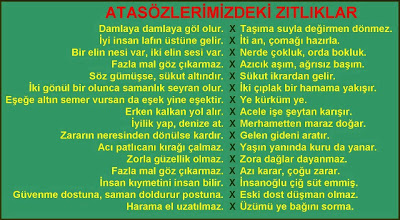

---

Wikileaks: Türkiye'nin Ermeni [iddialarına] olan yaklaşımı oldukça
karmaşık.. Cumhuriyetin kuruluşundan itibaren Atatürk ve onu takip
eden liderler suni / yapay bir kurgu olarak yarattıkları "Türk
kimliğinin" Cumhuriyetlerinin muhafazası ve gelişimi için vazgeçilmez
olduğu iddiasinda oldular; ve [bu kimliğin önemli bir parçası da] onun
yerli ve yabancı düşmanlar tarafından sürekli saldırı altında olduğu
iddiasıdır. Bu sebeple Türk devletinin temsilcileri /  şimdiye kadar
gelmiş geçmiş tüm yönetimler Ermeni iddialarının kabul edilmesi
durumunda Türklerin mazlum imajının tehlikeye gireceğinden, tartışmalı
sınırlarının gündeme gelmesinden, ayrıca tazminat talepleriyle
karşılaşmaktan korkuyorlar.

---

Dam Üstünde Saksağan

---

