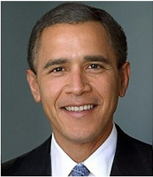

McCain

Adam haldır huldur çakıyor yahu.. Bu ne biçim iş? 

https://youtu.be/IekCfe2Lr5o

---

Obama'ydı Bush Oldu

Gerçek Bush'la Obama'dan bahsediyoruz.. Obama'nın başı bu ara dinleme
skandalı, izleme skandalı gibi şeylerle belada.. Seçimlerde onu
destekleyen Internet gazetesi Huffington Post ta bu resmi
patlattı. Felaket.

---

Wikileaks: "Anketlere göre Türkler diger ülkelerle ilişkiler / angaje
olma konusunda negatifler [..] NATO'ya destek ise yarı yarıya azalmış
durumda. Diğer yandan Türkiye'nin askeri kurumu TSK'yı tamamen
silahlandıran ABD'dir, ve Türkiye,  kapı komşusu / yakınındaki
ülkelerdeki pek çok yangından etkilenmemesinin- Irak'tan,
Afganistan'a, oradan Pakistan'a- sadece ABD ve NATO liderliğini kabulü
ve onunla yakın çalışması sayesinde olabileceğinin farkında. Zaten AKP
liderliğinin de çok iyi bildiği bir gerçek  var, o da Ortadoğu'daki ve
diğer bölgelerdeki sahip oldukları "wasta (hava, fiyaka)", anahtar
Batı kurumlarındaki konumları sayesinde mümkün olabiliyor. Bu genel
eğilim bazen sarsılabilir, ya da azalabilir, fakat somut faydaları
olması ve her türlü siyasi yaklaşımın elitleri tarafından kabul
edilmiş olduğu için Türkiye ondan tamamen vazgeçemez [..]

Başarısına ve elindeki izafi gücüne rağmen Türkiye ne ABD ne de
[dışişlerinin aktif olduğu alanlardaki] "bölge liderleri" ile eşit
konumda rekabet edecek durumda (bunlar Balkanlarda AB, Kafkaslarda ve
Karadeniz çevresinde Ruslar, Suudiler, Mısırlılar hatta Ortadoğu'da
İran). Türkiye dışişlerinin Rolls Royce boyutunda istekleri, ama Rover
boyutunda kaynakları var, bu yüzden Türkiye kendilerini kısayol / ufak
hareketler ile ortama dahil etmeye uğraşıyor. Nasıl? Bölgede marjinal,
az güçlü (underdog) birisi bulunuyor [..] ki bu kişi bir Siladjcic,
bir Mish'al, ya da bir Ahmedinejad olabilir (marjinalliği açısından bu
kişi "davasını" Türklerin üstlenmesine dünden razıdır tabii ki),
ardından Türkiye dışişleri Batı'nın kendi adamlarına yönelik aleyhte
kararlarını durdurma, ya da revizyona gidilmesi yönünde olabildiğince
bastırıyor. Bu [..] yaklaşım nisbeten ucuz bir şekilde etki, güç, ve
"biz geri geldik" gösterisi yapılmasını sağlıyor.

[Fakat] Türkiye eninde sonunda ortaya gerçek sonuçlar çıkartmaya
mecbur, bunun için de şimdiye kadar takip edilen siyasetin, risk
alınarak, ortaya kaynak konularak, zor kararlar verilerek takviye
edilmesiye mümkün olabilir sadece. Şimdiye kadar görülenler kulağa hos
gelen popüler sloganlar, ardı ardına yapılan geziler, ve pek önemli
olmayan mutabakat anlaşmalarına atılmış sayısız imzadan ibaret"

---

