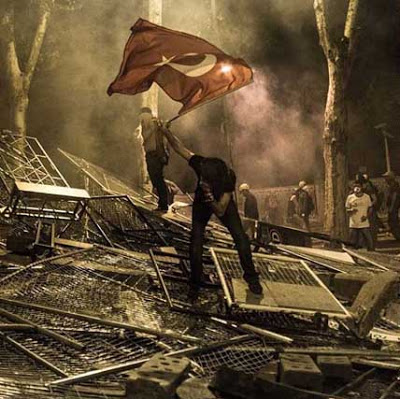

---

\#gazeteler

---

Tokyo 2020 yaz olimpiyatlarında değişimsel değil, güvenli bir seçenek
olduğu için seçildi [..] Uluslararası Olimpiyat Komitesi için
Japonya'nın [Fukushima sonrası] yaşadığı çevresel sorunlar,
Türkiye'nin Suriye sınırındaki savaş, İstanbul'daki protestolara
hükümetin verdiği aşırı sert tepki, İspanya'daki ekonomik kriz ve
yüksek işsizlikten daha önemsiz gözükmüş olmalı.

---

---
